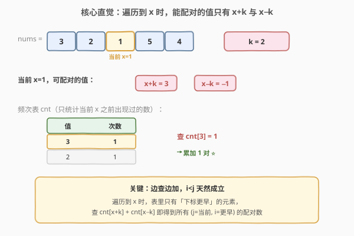
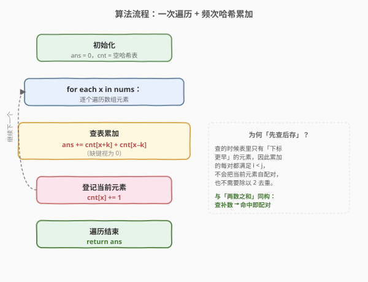

# 差的绝对值为 K 的数对数目

- **题目名称**：差的绝对值为 K 的数对数目
- **链接**：[2006. 差的绝对值为 K 的数对数目](https://leetcode.cn/problems/count-number-of-pairs-with-absolute-difference-k/)
- **难度**：简单
- **标签**：数组、哈希表、计数

## 1. 题目概述

给定一个整数数组 `nums` 和一个整数 `k`，返回满足 `i < j` 且 `|nums[i] - nums[j]| == k` 的数对 `(i, j)` 的**数目**。

**示例 1**：

```text
输入：nums = [1,2,2,1], k = 1
输出：4
解释：差的绝对值为 1 的数对有：
- (0,1)：|1-2| = 1
- (0,2)：|1-2| = 1
- (1,3)：|2-1| = 1
- (2,3)：|2-1| = 1
```

**示例 2**：

```text
输入：nums = [1,3], k = 3
输出：0
解释：|1-3| = 2 ≠ 3，不存在满足条件的数对。
```

**示例 3**：

```text
输入：nums = [3,2,1,5,4], k = 2
输出：3
解释：差的绝对值为 2 的数对为 (0,2)、(0,3)、(1,4)。
```

**约束条件**：

- `1 <= nums.length <= 200`
- `1 <= nums[i] <= 100`
- `1 <= k <= 99`

---

## 2. 解题思路

### 2.1 暴力思路：两层循环枚举所有数对

最直观的做法是用两层循环枚举所有 `(i, j)` 数对（`i < j`），逐个判断 `|nums[i] - nums[j]| == k`，命中则计数加一。

```text
for i in 0..n-1:
    for j in i+1..n-1:
        if abs(nums[i] - nums[j]) == k: ans += 1
```

时间复杂度 $O(n^2)$。本题 `n ≤ 200`，约 $4 \times 10^4$ 次操作，能通过但浪费了题目给的「值域极小」这一线索——`nums[i]` 仅在 `[1,100]`，意味着大量重复值，可以按值聚合把"两两比较"转化为"按值计数"。

### 2.2 核心观察：查配对值，用哈希表 O(1) 计数



关键直觉：要找的两个数 `x, y` 满足 $|x - y| = k$，即 $y = x + k$ 或 $y = x - k$。当我们遍历到 `x` 时，能与之配对的值是**确定**的，只有 `x+k` 与 `x−k` 两种。问题转化为：**这两种值在之前出现过几次？**

用哈希表 `cnt` 记录"已经遍历过的元素值 → 出现次数"，每次遍历到新元素 `x` 时，先把 `cnt[x+k] + cnt[x−k]` 累加到答案（即与之前所有可配对的元素各组成一对），再把 `x` 登记进表里。

> 💡 **为什么是"查之前见过的"而不是"查整个数组"？** 因为 `|x - y| = k` 是对称的——当我们遍历到靠后的 `y` 时，靠前的 `x` 一定先于 `y` 出现并已在表里。所以只需单向查"之前"，每个数对恰好被计数一次（以靠后那个元素为"当前"时计入），无需除以 2 去重。这与 [1. 两数之和](1_两数之和.md) 的"边查边存"完全同构。

### 2.3 算法流程图



整个流程是单层循环：查表累加 → 登记当前值。每个元素只查一次、存一次，总时间 $O(n)$。注意**先查后存**的顺序：查的时候表里只有当前元素**之前**的元素，天然保证 `i < j`。

### 2.4 示例演算

![逐步演算 nums=[3,2,1,5,4], k=2](../images/cpadk_example_walkthrough.svg)

以 `nums=[3,2,1,5,4], k=2` 为例逐步演算：

- **i=0, x=3**：查 `cnt[5]+cnt[1]=0+0=0`。登记 `cnt[3]=1`。`ans=0`。
- **i=1, x=2**：查 `cnt[4]+cnt[0]=0+0=0`。登记 `cnt[2]=1`。`ans=0`。
- **i=2, x=1**：查 `cnt[3]+cnt[-1]=1+0=1` ⭐（与前面的 3 配对，即 `(0,2)`）。登记 `cnt[1]=1`。`ans=1`。
- **i=3, x=5**：查 `cnt[7]+cnt[3]=0+1=1` ⭐（与前面的 3 配对，即 `(0,3)`）。登记 `cnt[5]=1`。`ans=2`。
- **i=4, x=4**：查 `cnt[6]+cnt[2]=0+1=1` ⭐（与前面的 2 配对，即 `(1,4)`）。登记 `cnt[4]=1`。`ans=3`。

最终 `ans=3`，与暴力枚举结果一致。

---

## 3. 参考代码

### C++（哈希表一次遍历）

```cpp
class Solution {
  public:
    int countKDifference(vector<int>& nums, int k) {
        unordered_map<int, int> cnt; // 值 -> 出现次数
        int ans = 0;
        for (int x : nums) {
            ans += cnt[x + k] + cnt[x - k]; // 查配对值（缺键时 operator[] 返回 0）
            cnt[x]++;                       // 登记当前元素
        }
        return ans;
    }
};
```

### Python

```python
class Solution:
    def countKDifference(self, nums: List[int], k: int) -> int:
        cnt = defaultdict(int)  # 值 -> 出现次数
        ans = 0
        for x in nums:
            ans += cnt[x + k] + cnt[x - k]  # 查配对值（缺键返回 0）
            cnt[x] += 1                      # 登记当前元素
        return ans
```

> ⚠️ **注意"先查后存"的顺序**：必须先累加 `cnt[x±k]` 再执行 `cnt[x]++`。若先存后查，当 `k=0` 时会把自己也算进去（本题 `k ≥ 1` 不受影响，但保持顺序是好习惯，与两数之和同构）。本题 `k ≥ 1` 保证 `x+k ≠ x`，故 `x+k` 与 `x−k` 不会指向当前元素自身。

---

## 4. 复杂度分析

| 维度 | 复杂度 | 说明 |
|------|--------|------|
| 时间复杂度 | $O(n)$ | 遍历一次数组，每次哈希表操作 $O(1)$ |
| 空间复杂度 | $O(n)$ | 最坏情况存入 n 个不同值；因值域 `[1,100]`，实际为 $O(\min(n, 100)) = O(1)$ |

> 💡 由于约束保证 `nums[i] ∈ [1, 100]`，哈希表最多存 100 个键，空间实为常数级；也可用长度 201 的数组代替哈希表（下标偏移 100 容纳 `x−k` 的负值），省去哈希开销。

---

## 5. 扩展：值域数组替代哈希表

题目约束 `1 <= nums[i] <= 100`、`1 <= k <= 99`，故 `x+k ≤ 199`、`x-k ≥ -98`。用长度 201 的数组（下标偏移 100 即可覆盖 `[-100, 100]`）代替哈希表，免去哈希常数：

```cpp
class Solution {
  public:
    int countKDifference(vector<int>& nums, int k) {
        int cnt[201] = {0}; // 下标 = 值 + 100
        int ans = 0;
        for (int x : nums) {
            ans += cnt[x + k + 100] + cnt[x - k + 100];
            cnt[x + 100]++;
        }
        return ans;
    }
};
```

**两种实现对比**：

| 实现 | 时间 | 空间 | 适用场景 |
|------|------|------|----------|
| 哈希表 | $O(n)$ | $O(n)$ | 值域未知或很大、通用 |
| 值域数组 | $O(n)$ | $O(值域)$ | 值域小且已知，常数更小 |

> 💡 值域小是本题给哈希优化留下的"甜区"——遇到"值域受限 + 计数"型题目，优先想到按值聚合。

---

## 6. 面试要点

1. **为什么用哈希表？它把哪一步从 O(n) 降到了 O(1)？**

   - 暴力法对每个 `nums[i]`，在剩余元素里线性扫描找满足 `|nums[i]-nums[j]|=k` 的 `nums[j]`，这一步是 $O(n)$。哈希表把"查找配对值的个数"优化到 $O(1)$，整体从 $O(n^2)$ 降到 $O(n)$。

2. **为什么必须"先查后存"？**

   - 先查后存保证查的时候表里只有当前元素**之前**的元素，累加的每对都满足 `i < j`，不会把当前元素自配对。本题 `k ≥ 1`，`x+k` 与 `x−k` 都不等于 `x`，即便先存后查也不会自配，但保持该顺序可避免 `k=0` 变体出错，且与两数之和同构、便于迁移。

3. **为什么不需要除以 2 去重？**

   - 因为只查"之前见过的"元素。每对 `(i, j)`（`i < j`）只在遍历到靠后的 `j` 时被计入一次（此时 `i` 已在表里），遍历到 `i` 时 `j` 还没出现。对称性被"时间先后"自然消除，不会重复计数。

4. **如果数组中有大量重复元素（如 [1,2,2,1], k=1），算法还能正确工作吗？**

   - 能。表里存的是"次数"而非下标，重复值通过次数累加自然处理。以 `nums=[1,2,2,1], k=1` 逐步演算：
     - i=0, x=1：查 `cnt[2]+cnt[0]=0`，存 `cnt[1]=1`，`ans=0`。
     - i=1, x=2：查 `cnt[3]+cnt[1]=0+1=1`（与 i=0 的 1 配对 → (0,1)），存 `cnt[2]=1`，`ans=1`。
     - i=2, x=2：查 `cnt[3]+cnt[1]=0+1=1`（与 i=0 的 1 配对 → (0,2)），存 `cnt[2]=2`，`ans=2`。
     - i=3, x=1：查 `cnt[2]+cnt[0]=2+0=2`（`cnt[2]=2` 反映前面有两个 2，分别配出 (1,3) 与 (2,3)），存 `cnt[1]=2`，`ans=4`。

     最终 `ans=4` ✅。关键在于 `cnt[x±k]` 累加的是"之前所有可配对值的个数"，重复元素被一并计入——这正是按值聚合相对于按下标枚举的优势。

5. **哈希表解法和值域数组解法各自的优劣？何时选哪个？**

   - 哈希表：$O(n)$ 时间、$O(n)$ 空间，通用，不依赖值域大小。值域数组：$O(n)$ 时间、$O(值域)$ 空间，当值域小且已知时常数更小、更快。本题值域仅 `[1,100]`，两种皆可，值域数组更优；若值域未知或达 $10^9$，只能用哈希表。

---

## 7. 同类练习题

- [1. 两数之和](https://leetcode.cn/problems/two-sum/)（[题解](../0001-0100/1_两数之和.md)）：哈希一次遍历查补数，本题的"母题"，"边查边存"范式同构
- [1512. 好数对的数目](https://leetcode.cn/problems/number-of-good-pairs/)：哈希计数 + 累加已出现次数，本题 `k=0` 的特例
- [219. 存在重复元素 II](https://leetcode.cn/problems/contains-duplicate-ii/)：哈希表维护最近下标 + 差值判定，同属"遍历查表"家族
- [2341. 数组能形成多少数对](https://leetcode.cn/problems/maximum-number-of-pairs-in-array/)：按值计数后组对，同属"值域聚合计数"思路
