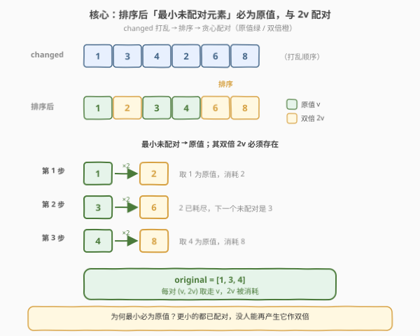
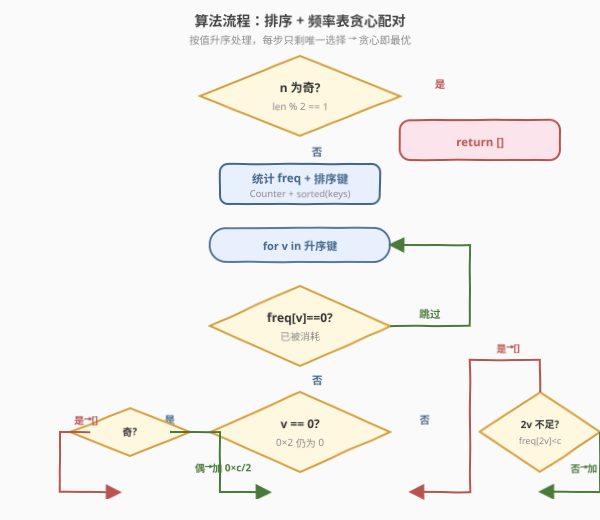
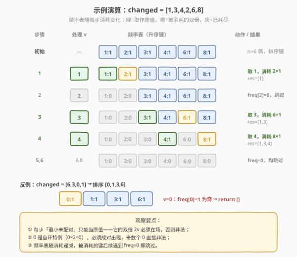

# 从双倍数组中还原原数组

- **题目名称**：从双倍数组中还原原数组
- **链接**：[2007. 从双倍数组中还原原数组](https://leetcode.cn/problems/find-original-array-from-doubled-array/)
- **难度**：中等
- **标签**：数组、排序、贪心、哈希表

## 1. 题目概述

一个整数数组 `original` 可以转变成一个**双倍**数组 `changed`，转变方式为：将 `original` 中每个元素的**值乘以 2** 加入数组，然后把所有元素**随机打乱**。也就是说，`changed` 的长度是 `original` 的两倍，其中一半是原值，另一半是对应的双倍值。

给你一个数组 `changed`，如果它确实是由某个 `original` 转变而来的**双倍**数组，返回 `original`（顺序任意）；否则返回空数组 `[]`。

**示例 1**：

```text
输入：changed = [1,3,4,2,6,8]
输出：[1,3,4]
解释：original = [1,3,4]，双倍 = [2,6,8]，打乱合并后即 [1,3,4,2,6,8]。
```

**示例 2**：

```text
输入：changed = [6,3,0,1]
输出：[]
解释：不是双倍数组。
```

**示例 3**：

```text
输入：changed = [1]
输出：[]
解释：长度为奇，不可能是双倍数组。
```

**约束条件**：

- $1 \le \text{changed.length} \le 10^5$
- $0 \le \text{changed}[i] \le 10^5$

> 💡 **审题关键**：① `changed` 长度必须是偶数（双倍 = 原值 + 双倍值，长度恒为 $2n$），奇数长度直接非法；② 元素可重复，且 $0$ 是「自环」特例——$0 \times 2 = 0$，所以 $0$ 必须成对出现；③ `original` 顺序任意，意味着我们只需配对成功，不必还原原始顺序。

---

## 2. 解题思路

### 2.1 暴力思路：枚举配对

最直观的做法是：把 `changed` 的 $2n$ 个元素划分成 $n$ 个二元组 $(a, b)$，每个组满足 $b = 2a$（或 $a = 2b$），且每个元素恰好属于一个组。若存在这样的完美匹配，则每组的较小者为 `original` 元素。

- **正确性**：覆盖所有匹配方案，存在即返回。
- **效率**：完美匹配的枚举是指数级的，对 $n \le 5 \times 10^4$ 完全不可行。

> ⚠️ 暴力的瓶颈在于「盲目枚举配对」。其实配对关系有强结构：每对 $(v, 2v)$ 中 $v < 2v$（除 $0$ 外）。若把数组排序，**最小的元素不可能作为某元素的双倍**（没有更小的元素能让它翻倍而来），于是它的身份被唯一确定——这给了一个强有力的贪心切入点。

### 2.2 核心观察：排序后「最小未配对元素」必为原值



关键洞察分三步：

**第一步：排序后，最小未配对元素只能是原值。** 把 `changed` 升序排序，从小到大处理。当处理到值 $v$ 时，所有 $< v$ 的值都已配对完毕（要么作为原值被取走，要么作为某个原值的双倍被消耗）。如果 $v$ 仍有剩余（$\text{freq}[v] > 0$），它**不可能是任何更小原值的双倍**（那些双倍已被消耗），所以 $v$ 只能是原值本身。

**第二步：原值 $v$ 的双倍 $2v$ 必须在场且足够多。** 既然 $v$ 是原值，它的双倍 $2v$ 必须在数组中存在，且数量 $\ge \text{freq}[v]$。若不足，说明无法配对，整个数组非法，返回 `[]`。配对后，把 $\text{freq}[2v]$ 减去 $\text{freq}[v]$（消耗掉对应数量的双倍），并把 $v$ 加入结果。

**第三步：特例 $v = 0$（自环）。** 因为 $0 \times 2 = 0$，$0$ 的原值与双倍都是 $0$ 本身。所以 $0$ 必须**成对出现**：若 $\text{freq}[0]$ 为奇数，直接非法；否则每两个 $0$ 贡献一个原值 $0$，即往结果里加 $\text{freq}[0] / 2$ 个 $0$。

$$\boxed{\text{排序后逐值贪心：} v \text{ 最小未配对} \Rightarrow v \text{ 为原值，消耗 } \text{freq}[v] \text{ 个 } 2v}$$

> 💡 **为什么贪心是「被迫」的，无需复杂证明？** 每一步处理最小未配对 $v$ 时，它的身份**唯一**——只能是原值（无法作为别人的双倍，因为更小的都配完了）。它的双倍也只能是 $2v$（不是别的数）。所以每步只有一种合法选择，贪心即最优。这种「每步被迫选择」是贪心正确性最强的保证，比交换论证更直接。

> ⚠️ **最高频陷阱**：忘记处理 $v = 0$ 的自环。若直接套「$v$ 配 $2v$」的逻辑，遇到 $0$ 时会试图用 $0$ 配 $0$，但 `freq[0]` 若为奇数，会错误地消耗一个 $0$ 却无对应的另一个 $0$。必须单独判定 $0$ 的奇偶性。

### 2.3 算法流程图



1. **奇偶判定**：若 `changed` 长度为奇数，直接返回 `[]`。
2. **统计频率**：用哈希表 `freq` 统计每个值的出现次数，取出键并升序排序。
3. **逐值贪心**：对每个升序键 $v$：
   - 若 $\text{freq}[v] == 0$：已被消耗，跳过。
   - 若 $v == 0$：若 $\text{freq}[0]$ 为奇数 → 返回 `[]`；否则往结果加 $\text{freq}[0]/2$ 个 $0$，置 $\text{freq}[0] = 0$。
   - 若 $v > 0$：若 $\text{freq}[2v] < \text{freq}[v]$ → 返回 `[]`；否则往结果加 $\text{freq}[v]$ 个 $v$，令 $\text{freq}[2v] \mathrel{-}= \text{freq}[v]$，置 $\text{freq}[v] = 0$。
4. **返回结果**：所有键处理完毕且无非法，返回结果数组。

> 💡 **为什么用「键」而非逐元素遍历？** 同一个值 $v$ 可能出现多次，且它的所有副本身份相同（都是原值，都要配 $2v$）。按值批量处理可以一次性消耗 $\text{freq}[v]$ 个 $v$ 和对应数量的 $2v$，逻辑更清晰，也避免重复判定。

### 2.4 示例演算

以官方样例 1 演示频率表的逐步消耗：



| 步骤 | 处理 $v$ | 频率表变化 | 动作 |
|------|---------|-----------|------|
| 初始 | — | `{1:1, 2:1, 3:1, 4:1, 6:1, 8:1}` | $n=6$ 偶，排序键 |
| 1 | $1$ | `2:1→0`，`1:1→0` | 取 $1$ 为原值，消耗 $1$ 个 $2$；`res=[1]` |
| 2 | $2$ | `freq[2]=0` | 跳过 |
| 3 | $3$ | `6:1→0`，`3:1→0` | 取 $3$ 为原值，消耗 $1$ 个 $6$；`res=[1,3]` |
| 4 | $4$ | `8:1→0`，`4:1→0` | 取 $4$ 为原值，消耗 $1$ 个 $8$；`res=[1,3,4]` |
| 5,6 | $6,8$ | 均为 $0$ | 跳过 |

最终 `res = [1,3,4]`。反例 `[6,3,0,1]` 排序后首个键为 $0$，`freq[0]=1` 为奇 → 立即返回 `[]`。

> 💡 **观察要点**：① 每步「最小未配对」只能当原值，其双倍 $2v$ 必须在场；② $0$ 自环必须成对；③ 频率表随消耗递减，被消耗的键后续遇到 `freq=0` 即跳过——这正是「最小未配对」判定生效的机制。

---

## 3. 参考代码

### C++

```cpp
class Solution {
public:
    vector<int> findOriginalArray(vector<int>& changed) {
        int n = changed.size();
        if (n % 2 == 1) return {};
        unordered_map<int,int> freq;
        for (int x : changed) freq[x]++;
        vector<int> keys;
        for (auto& [k, _] : freq) keys.push_back(k);
        sort(keys.begin(), keys.end());
        vector<int> res;
        for (int v : keys) {
            int c = freq[v];
            if (c == 0) continue;
            if (v == 0) {
                if (c % 2) return {};
                res.insert(res.end(), c / 2, 0);
            } else {
                if (freq[v * 2] < c) return {};
                res.insert(res.end(), c, v);
                freq[v * 2] -= c;
            }
            freq[v] = 0;
        }
        return res;
    }
};
```

### Python

```python
class Solution:
    def findOriginalArray(self, changed: List[int]) -> List[int]:
        n = len(changed)
        if n % 2:
            return []
        freq = Counter(changed)
        res = []
        for v in sorted(freq):
            if freq[v] == 0:
                continue
            if v == 0:
                if freq[0] % 2:
                    return []
                res.extend([0] * (freq[0] // 2))
                freq[0] = 0
            else:
                if freq.get(v * 2, 0) < freq[v]:
                    return []
                res.extend([v] * freq[v])
                freq[v * 2] -= freq[v]
                freq[v] = 0
        return res
```

> 💡 **写法对照**：两版逻辑完全一致——奇偶快判 + 频率表 + 升序键贪心。C++ 用 `unordered_map` 计数后单独排序键；Python 直接对 `Counter` 的键 `sorted`。注意 `freq.get(v*2, 0)` 处理 $2v$ 不在表中的情况（返回 $0 < c$ 即非法）。面试中先讲清「最小未配对必为原值」的观察，再落代码，避免被 $0$ 的自环特例绊倒。

> 💡 **溢出提示**：$v \le 10^5$，$2v \le 2 \times 10^5$，均在 `int` 范围内，无需 `long long`。但若用值域数组代替哈希表，数组大小要开到 $2 \times 10^5 + 1$（覆盖 $2v_{\max}$）。

---

## 4. 复杂度分析

| 维度 | 复杂度 | 说明 |
|------|--------|------|
| 时间复杂度 | $O(n \log n)$ | 排序键 $O(n \log n)$ 主导；频率统计 $O(n)$，贪心扫描每个键常数操作总计 $O(n)$ |
| 空间复杂度 | $O(n)$ | 哈希表存频率 + 键数组 + 结果数组，均为 $O(n)$ |

> 💡 $n \le 10^5$，$O(n \log n)$ 完全宽裕。本题的优雅在于把「指数级匹配枚举」化简为「排序 + 单趟贪心」——关键在于识别「最小未配对元素身份唯一」这一结构，把配对问题降维成线性扫描。

---

## 5. 扩展：排序 + 队列的等价解法

除了「频率表 + 升序键」批量处理，还有一种逐元素的**队列解法**，思路同样基于「排序后最小未配对必为原值」：

1. 排序 `changed`。
2. 维护一个队列 `q`，存放「等待配对的双倍期望值」。
3. 逐元素 `x` 扫描：
   - 若 `q` 非空且队首 `== x`：说明 `x` 正是某个原值的双倍，弹出队首（消耗），**不**加入结果。
   - 否则：`x` 是新原值，加入结果，并把 `2*x` 入队（期望后续遇到）。
4. 扫描结束后，若 `q` 非空 → 返回 `[]`；否则返回结果。

```python
def findOriginalArray(self, changed: List[int]) -> List[int]:
    if len(changed) % 2:
        return []
    changed.sort()
    q = deque()
    res = []
    for x in changed:
        if q and q[0] == x:
            q.popleft()
        else:
            res.append(x)
            q.append(x * 2)
    return res if not q else []
```

**正确性**：由于原值升序入队，`2*x` 也升序，队列天然单调递增，队首始终是最小的未配对双倍期望。遇到 `x` 时，若 `x` 等于队首期望，则它「被迫」充当双倍（否则该期望永远无法满足，因为后续元素更大）；否则 `x` 是新的最小未配对原值。这与频率表解法是同一贪心的两种实现。

**复杂度**：$O(n \log n)$（排序）+ $O(n)$（扫描），空间 $O(n)$（队列）。与频率表解法等价，但避免了哈希表操作，常数更小。

> ⚠️ 队列解法处理 $0$ 自然成立：`x=0` 入队 `0`，下一个 `0` 命中队首 `0` 被消耗——两个 $0$ 一对，奇数个 $0$ 会让队列残留，最终返回 `[]`。无需特判。

---

## 6. 面试要点

**Q1：为什么排序后「最小未配对元素」一定是原值，而不是某个原值的双倍？**

> 因为所有比它小的值都已配对完毕。若 $v$ 是某原值 $w$ 的双倍，则 $w = v/2 < v$，而 $w$ 在更早的步骤已被处理，其双倍 $v$ 已被消耗。所以当前剩余的 $v$ 不可能是任何已处理原值的双倍，只能是新的原值。

**Q2：$0$ 为什么是特例？如何处理？**

> 因为 $0 \times 2 = 0$，$0$ 的原值与双倍都是 $0$，形成自环。所以 $0$ 必须成对出现：每两个 $0$ 贡献一个原值 $0$。若 `freq[0]` 为奇数，剩下一个 $0$ 无法配对，直接返回 `[]`。频率表解法需特判 $0$ 的奇偶性；队列解法天然处理（两个 $0$ 一出一入）。

**Q3：如果 `changed` 长度是奇数，为什么直接返回 `[]`？**

> 双倍数组 = 原值 + 双倍值，长度恒为 $2n$（偶数）。奇数长度不可能由任何 `original` 转变而来，这是必要条件，直接剪枝。

**Q4：贪心的正确性如何证明？需要交换论证吗？**

> 不需要。本题是「被迫选择」型贪心——每步处理最小未配对 $v$ 时，它的身份（原值）和它的双倍（$2v$）都唯一确定，没有其他合法选项。既然每步只有一种选择，贪心产出的就是唯一可能的匹配，不存在「更优解」。这种「唯一性」比交换论证更直接、更强。

**Q5：能否用值域数组代替哈希表？有什么要注意的？**

> 可以。因为 $0 \le \text{changed}[i] \le 10^5$，可用大小为 $2 \times 10^5 + 1$ 的数组计数（覆盖 $2v_{\max} = 2 \times 10^5$）。好处是访问 $O(1)$ 且无哈希常数；注意数组大小必须开到 $2 \times 10^5 + 1$，否则访问 `freq[2v]` 会越界。排序键时遍历 $0 \sim \max(\text{changed})$ 即可，整体仍是 $O(n + V)$，其中 $V$ 为值域上界。

> 💡 **一句话总结**：排序后最小未配对元素身份唯一（只能是原值）→ 贪心配对 $v$ 与 $2v$ → $0$ 自环特判奇偶 → $O(n \log n)$ 一趟扫描。

---

## 7. 同类练习题

- [1. 两数之和](https://leetcode.cn/problems/two-sum/)（[题解](../0001-0100/1_两数之和.md)）：同样是「在数组中为每个元素找配对」，哈希表一次遍历；本题配对关系是 $2\times$ 而非「和为 target」，且要求完美匹配
- [454. 四数相加 II](https://leetcode.cn/problems/4sum-ii/)（[题解](../0401-0500/454_四数相加II.md)）：分组 + 哈希计数（Meet in the Middle），与本题「频率表批量配对」共用哈希计数思想，但本题是排序贪心而非分组求和
- [350. 两个数组的交集 II](https://leetcode.cn/problems/intersection-of-two-arrays-ii/)：频率表计数 + 配对取最小频次，与本题「消耗 `freq[v]` 个 `2v`」的批量消耗逻辑同源，对照「计数配对」的两种题型
- [56. 合并区间](https://leetcode.cn/problems/merge-intervals/)（[题解](../0001-0100/56_合并区间.md)）：同为「排序 + 单趟贪心扫描」骨架，排序是该类问题的前置步骤，体现「排序解锁贪心」的通用范式
