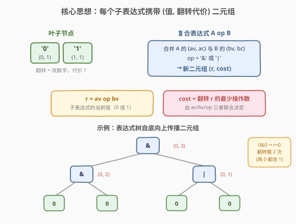
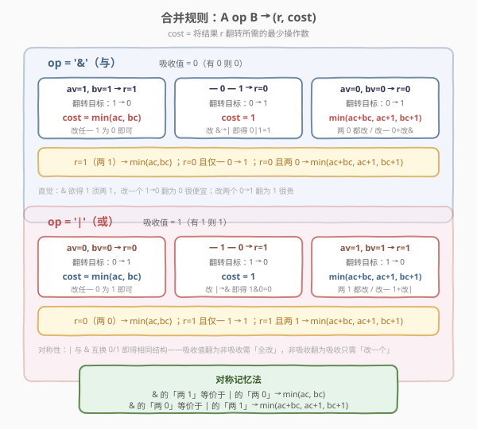
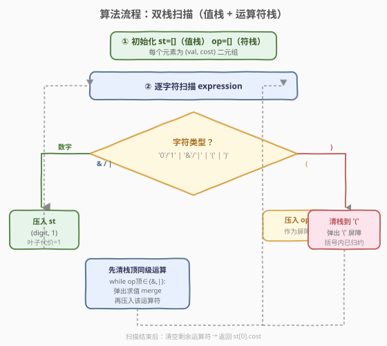
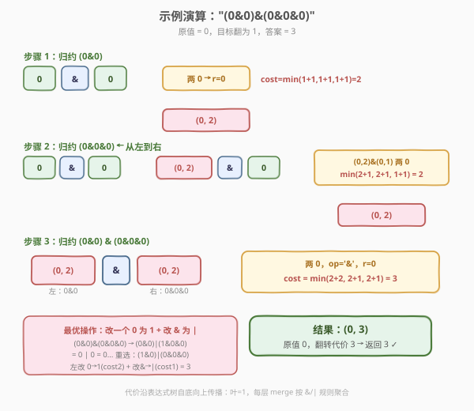

# LeetCode 反转表达式值的最少操作次数 题解

## 1. 题目概述

- **标题 / 题号**：反转表达式值的最少操作次数（#2008，hard）
- **链接**：https://leetcode.cn/problems/minimum-cost-to-change-the-final-value-of-expression/
- **难度**：困难
- **标签**：栈、动态规划、字符串、数学

**题意**：给定一个**有效的**布尔表达式字符串 `expression`，其中包含字符 `'1'`、`'0'`、`'&'`（与运算）、`'|'`（或运算）、`'('` 和 `')'`。`'&'` 与 `'|'` 的**运算优先级相同**，计算时括号优先级最高，然后按**从左到右**的顺序运算。

你的目标是将表达式的**值反转**（`0` 变 `1`，或 `1` 变 `0`），返回所需的最少操作次数。可执行的操作（每次代价 1）：

- 将 `'1'` 变成 `'0'`，或将 `'0'` 变成 `'1'`；
- 将 `'&'` 变成 `'|'`，或将 `'|'` 变成 `'&'`。

> ⚠️ 三点审题关键：① `&` 与 `|` **优先级相同**——没有「先 `&` 后 `|`」的规则，纯从左到右，括号最高；② 操作可以作用于表达式中的**任意一个**字符（数字或运算符），不是只能改根运算符；③ 表达式保证有效且括号两两匹配，**不含空括号** `"()"`。

**示例 1**：

```text
输入：expression = "1&(0|1)"
输出：1
解释：将 '|' 变成 '&' 得 "1&(0&1)"，新值 = 1&0 = 0，翻转成功，1 次操作。
```

**示例 2**：

```text
输入：expression = "(0&0)&(0&0&0)"
输出：3
解释：可变为 "(0|1)|(0&0&0)"：改第二个 0→1、改第一个 &→|、改第一个 0→... 共 3 次操作使值为 1。
```

**示例 3**：

```text
输入：expression = "(0|(1|0&1))"
输出：1
解释：将 '1' 变成 '0' 得 "(0|(0|0&1))"，新值 = 0|(0|0) = 0，1 次操作。
```

**约束**：

- $1 \le \text{expression.length} \le 10^5$
- `expression` 只包含 `'1'`、`'0'`、`'&'`、`'|'`、`'('`、`')'`
- 所有括号都有匹配的对应括号，不会有空括号

## 2. 解题思路

### 2.1 暴力思路：枚举每个字符改/不改

最直观的做法是对表达式中的每个字符（数字或运算符）枚举「改/不改」，共 $2^n$ 种组合（$n$ 为字符数），对每种组合重新求值判断是否翻转。这显然指数级爆炸，$n \le 10^5$ 完全不可行。

> ⚠️ 暴力法的瓶颈在于「字符级别的组合爆炸」。突破口是注意到：**我们只关心翻转最终值的代价，不必关心改了哪个具体字符**——可以把「翻转一个子表达式的值」看作一个整体操作，用动态规划聚合代价。

### 2.2 核心观察：每个子表达式携带 (值, 翻转代价) 二元组



把表达式看作一棵树（叶子是数字，内部节点是运算符），自底向上为每个子表达式维护一个**二元组** `(val, cost)`：

- **`val`**：该子表达式的当前值（`0` 或 `1`）。
- **`cost`**：将该子表达式的值**翻转**（`val → 1-val`）所需的最少操作数。

> 💡 **为什么只跟踪这两个量就够了？** 因为翻转最终值只有两种方向（`0→1` 或 `1→0`），而 `cost` 恰好记录了「当前方向翻转的最小代价」。无论上层运算符如何组合，只要知道左右子树的 `(val, cost)` 和当前运算符，就能唯一确定合并后的 `(val, cost)`——这是把指数级搜索压缩为线性扫描的关键。

**叶子节点**：`'0'` → `(0, 1)`，`'1'` → `(1, 1)`。翻转一个数字代价为 1。

**复合节点** `A op B`：`val` 由 `av op bv` 直接算出；`cost` 需要分类讨论——这引出下文的合并规则。

### 2.3 合并规则：分类讨论运算符与操作数



合并 `A op B` 时，设左子为 `(av, ac)`、右子为 `(bv, bc)`，结果 `r = av op bv`。**翻转 `r`** 的代价取决于「需要改变哪些操作数/运算符才能让结果翻转」。穷举所有单/双操作组合后取最小，可归纳为以下规则：

> 💡 **关键直觉——吸收值**：`&` 的吸收值是 `0`（有 0 则 0），`|` 的吸收值是 `1`（有 1 则 1）。当结果等于吸收值时，翻转「很便宜」（改一个吸收操作数即可）；当结果等于非吸收值（两操作数都是非吸收值）时，翻转「较贵」（须让至少一个变成吸收值）。

**`op = '&'`（吸收值 0）**，`r = av & bv`：

| 情形 | 条件 | `r` | 翻转代价 `cost` | 说明 |
|------|------|-----|-----------------|------|
| 两 1 | `av=1, bv=1` | 1 | $\min(ac, bc)$ | 改任一 1→0 即可，`&→|` 无效（1\|1=1） |
| 一 0 一 1 | `av≠bv` | 0 | $\min(\text{零侧}ac, 1) = 1$ | 改 `&→|` 得 `0\|1=1`，或改那个 0→1 |
| 两 0 | `av=0, bv=0` | 0 | $\min(ac+bc,\ ac+1,\ bc+1)$ | 须两 0 都变 1，或改一个 0 + 改 `&→\|` |

**`op = '|'`（吸收值 1）**，`r = av | bv`（与 `&` 关于 0/1 完全对称）：

| 情形 | 条件 | `r` | 翻转代价 `cost` | 说明 |
|------|------|-----|-----------------|------|
| 两 0 | `av=0, bv=0` | 0 | $\min(ac, bc)$ | 改任一 0→1 即可 |
| 一 1 一 0 | `av≠bv` | 1 | $\min(\text{一侧}ac, 1) = 1$ | 改 `\|→&` 得 `1&0=0`，或改那个 1→0 |
| 两 1 | `av=1, bv=1` | 1 | $\min(ac+bc,\ ac+1,\ bc+1)$ | 须两 1 都变 0，或改一个 1 + 改 `\|→&` |

> ⚠️ **「一 0 一 1」情形的代价恒为 1**：因为改运算符（`&↔|`）恰好翻转结果——`0&1=0` 改 `&→|` 得 `0|1=1`，`0|1=1` 改 `|→&` 得 `0&1=0`。这一步代价 1 是所有情形的下界，故 `min(operand_cost, 1) = 1`（因 `cost ≥ 1` 恒成立）。

### 2.4 算法流程图



由于 `&` 和 `|` 优先级相同、从左到右运算，可用**双栈**（值栈 `st` + 运算符栈 `op`）在线性时间内完成归约，思路与「表达式求值」一致：

1. 遇到数字 `'0'`/`'1'`：压入 `st`，二元组为 `(digit, 1)`。
2. 遇到 `'('`：压入 `op` 作为**屏障**（阻止左结合提前归约跨过括号）。
3. 遇到 `'&'`/`'|'`：**先**把 `op` 栈顶同为 `&`/`|` 的运算符弹出归约（左结合：前一个同级运算符先算），再压入当前运算符。
4. 遇到 `')'`：把 `op` 栈顶到 `'('` 之间的运算符依次弹出归约，最后弹出 `'('`。
5. 扫描结束：把 `op` 中剩余运算符依次弹出归约。
6. 返回 `st[0].cost`。

> 💡 **为什么 `&`/`|` 入栈前要先清同级？** 因为它们优先级相同且左结合——`a & b | c` 应理解为 `(a & b) | c`。当读到 `|` 时，栈顶的 `&` 已经可以归约（左操作数 `a`、右操作数 `b` 都在 `st` 上），先归约再压 `|` 才能保证后续 `c` 与 `(a&b)` 正确结合。`'('` 屏障确保括号内的归约不会越过括号边界。

### 2.5 示例演算

以示例 2 `expression = "(0&0)&(0&0&0)"` 为例，演示双栈归约过程：



**步骤 1：归约 `(0&0)`**。两个叶子 `(0,1)` 与 `(0,1)` 做 `&`，两 0 情形：$\text{cost} = \min(1+1,\ 1+1,\ 1+1) = 2$，得 `(0, 2)`。

**步骤 2：归约 `(0&0&0)`**。括号内从左到右：先 `(0,1)&(0,1) → (0,2)`，再 `(0,2)&(0,1)`，两 0 情形：$\text{cost} = \min(2+1,\ 2+1,\ 1+1) = 2$，得 `(0, 2)`。

**步骤 3：归约 `(0&0) & (0&0&0)`**。左 `(0,2)`、右 `(0,2)` 做 `&`，两 0 情形：$\text{cost} = \min(2+2,\ 2+1,\ 2+1) = 3$，得 `(0, 3)`。

最终 `st[0] = (0, 3)`，原值为 0，翻转代价为 **3** ✓。

| 步骤 | 归约的子表达式 | 左子 `(av,ac)` | 右子 `(bv,bc)` | op | 结果 `(r, cost)` |
|------|---------------|----------------|----------------|----|-------------------|
| 1 | `0&0` | `(0, 1)` | `(0, 1)` | `&` | `(0, 2)` |
| 2a | `0&0`（右括号内第一段） | `(0, 1)` | `(0, 1)` | `&` | `(0, 2)` |
| 2b | `(0&0)&0` | `(0, 2)` | `(0, 1)` | `&` | `(0, 2)` |
| 3 | `(0&0)&(0&0&0)` | `(0, 2)` | `(0, 2)` | `&` | `(0, 3)` |

> 💡 **观察要点**：① 代价沿树自底向上**单调传播**——叶子代价 1，每层 merge 按 `&`/`|` 规则聚合，不回溯不搜索；② 步骤 2b 中 `min(2+1, 2+1, 1+1)=2`，说明「改右叶子 0→1（代价 1）+ 改 `&`→`|`（代价 1）」比「改两边的 0→1」更优；③ 最终代价 3 对应「改左边某 0→1（代价 2，即翻左子 `(0,2)`）+ 改根 `&`→`|`（代价 1）」，验证了 `ac+1` 分支胜出。

## 3. 参考代码

### C++

```cpp
class Solution {
  public:
    int minOperationsToFlip(string expression) {
        auto merge = [](pair<int, int> a, char op, pair<int, int> b) -> pair<int, int> {
            int av = a.first, ac = a.second, bv = b.first, bc = b.second;
            int r, cost;
            if (op == '&') {
                r = av & bv;
                if (r == 1) {                 // 两 1，翻为 0：改任一 1
                    cost = min(ac, bc);
                } else if (av == 0 && bv == 0) { // 两 0，翻为 1
                    cost = min({ac + bc, ac + 1, bc + 1});
                } else {                      // 一 0 一 1，改 &→| 即可
                    cost = 1;
                }
            } else {                          // op == '|'
                r = av | bv;
                if (r == 0) {                 // 两 0，翻为 1：改任一 0
                    cost = min(ac, bc);
                } else if (av == 1 && bv == 1) { // 两 1，翻为 0
                    cost = min({ac + bc, ac + 1, bc + 1});
                } else {                      // 一 1 一 0，改 |→& 即可
                    cost = 1;
                }
            }
            return {r, cost};
        };

        vector<pair<int, int>> st;            // 值栈：(val, cost)
        vector<char> op;                      // 运算符栈：'&' '|' '('

        for (char c : expression) {
            if (c == '0' || c == '1') {
                st.push_back({c - '0', 1});
            } else if (c == '(') {
                op.push_back(c);
            } else if (c == '&' || c == '|') {
                // 左结合：先清同级运算符
                while (!op.empty() && op.back() != '(') {
                    auto b = st.back(); st.pop_back();
                    auto a = st.back(); st.pop_back();
                    char o = op.back(); op.pop_back();
                    st.push_back(merge(a, o, b));
                }
                op.push_back(c);
            } else { // ')'
                while (!op.empty() && op.back() != '(') {
                    auto b = st.back(); st.pop_back();
                    auto a = st.back(); st.pop_back();
                    char o = op.back(); op.pop_back();
                    st.push_back(merge(a, o, b));
                }
                op.pop_back();                // 弹出 '('
            }
        }
        while (!op.empty()) {
            auto b = st.back(); st.pop_back();
            auto a = st.back(); st.pop_back();
            char o = op.back(); op.pop_back();
            st.push_back(merge(a, o, b));
        }
        return st[0].second;
    }
};
```

### Python

```python
class Solution:
    def minOperationsToFlip(self, expression: str) -> int:
        def merge(a, op, b):
            av, ac = a
            bv, bc = b
            if op == '&':
                r = av & bv
                if r == 1:                     # 两 1，翻为 0
                    cost = min(ac, bc)
                elif av == 0 and bv == 0:      # 两 0，翻为 1
                    cost = min(ac + bc, ac + 1, bc + 1)
                else:                          # 一 0 一 1
                    cost = 1
            else:                              # op == '|'
                r = av | bv
                if r == 0:                     # 两 0，翻为 1
                    cost = min(ac, bc)
                elif av == 1 and bv == 1:      # 两 1，翻为 0
                    cost = min(ac + bc, ac + 1, bc + 1)
                else:                          # 一 1 一 0
                    cost = 1
            return (r, cost)

        st = []   # 值栈：(val, cost)
        op = []   # 运算符栈
        for c in expression:
            if c in '01':
                st.append((int(c), 1))
            elif c == '(':
                op.append(c)
            elif c in '&|':
                while op and op[-1] != '(':
                    b = st.pop(); a = st.pop(); o = op.pop()
                    st.append(merge(a, o, b))
                op.append(c)
            else:  # ')'
                while op and op[-1] != '(':
                    b = st.pop(); a = st.pop(); o = op.pop()
                    st.append(merge(a, o, b))
                op.pop()  # 弹出 '('
        while op:
            b = st.pop(); a = st.pop(); o = op.pop()
            st.append(merge(a, o, b))
        return st[0][1]
```

> 💡 **写法对照**：C++ 与 Python 逻辑完全一致——双栈扫描 + `merge` 分类讨论。Python 版用元组 `(val, cost)` 更轻量，C++ 用 `pair<int,int>`。注意 `merge` 中「一 0 一 1」分支直接返回 `1`（因 `min(operand_cost, 1) = 1` 恒成立），省去一次 `min` 调用，代码更清晰。

## 4. 复杂度分析

| 维度 | 复杂度 | 说明 |
|------|--------|------|
| 时间复杂度 | $O(n)$ | 每个字符入栈/出栈各一次，每次 `merge` 为 $O(1)$ 分类讨论，总计线性 |
| 空间复杂度 | $O(n)$ | 最坏情况下值栈与运算符栈各存 $O(n)$ 个元素（如 `"0&0&0&...&0"` 无括号时运算符栈暂存 $n/2$ 个 `&`） |

> 💡 $n \le 10^5$，$O(n)$ 单趟扫描十分宽裕。本题的精妙之处在于把「翻转表达式值」这一看似需要搜索的问题，通过 `(val, cost)` 二元组的设计，转化为线性的栈式归约——代价信息在表达式树上自底向上一次传递即得答案。

## 5. 扩展：合并规则的对称性与统一公式

`&` 与 `|` 的合并规则关于 0/1 完全对称，可统一表述。定义运算符的**吸收值** $s$（`&` 时 $s=0$，`|` 时 $s=1$），非吸收值 $\bar{s} = 1-s$：

- **结果为 $\bar{s}$**（两操作数均为 $\bar{s}$）：翻转代价 $= \min(ac, bc)$——改任一操作数为 $s$ 即可让结果变 $s$。
- **结果为 $s$ 且两操作数均为 $s$**：翻转代价 $= \min(ac+bc,\ ac+1,\ bc+1)$——须让两操作数都变 $\bar{s}$，或改一个操作数 + 改运算符。
- **结果为 $s$ 且仅一操作数为 $s$**：翻转代价 $= 1$——改运算符 $s\text{-absorbing} \leftrightarrow \bar{s}\text{-absorbing}$ 恰好翻转结果。

$$
\text{cost} = \begin{cases} \min(ac, bc) & \text{if } r = \bar{s} \\ \min(ac+bc,\ ac+1,\ bc+1) & \text{if } r = s \text{ 且 } av=bv=s \\ 1 & \text{if } r = s \text{ 且 } av \neq bv \end{cases}
$$

> ⚠️ 这一统一公式说明：`&` 和 `|` 本质是同一个运算的 0/1 对偶。若用 De Morgan 律把 `&` 全部转成 `|`（取反操作数），代价结构不变——这也是为什么代码中两个分支写法对称、仅 0/1 互换。

> 💡 **为何不直接枚举 8 种操作组合？** 对每个 `merge` 枚举「翻 A? 翻 op? 翻 B?」的 $2^3=8$ 种组合取最小也能得到正确答案，且代码更短（无需分类讨论）。但分类讨论版省去了 8 次条件判断与临时计算，常数更小，且能直观揭示「吸收值」的对称结构，利于面试讲解。两种写法的复杂度均为 $O(n)$。

## 6. 面试要点

**Q1：为什么要同时记录 `val` 和 `cost`，只记录翻转代价不够吗？**

> 不够。`cost` 是「翻转当前值的代价」，但合并时需要知道当前值才能算出合并后的值与翻转代价——例如 `A & B` 中 `A=0` 时结果必为 0（吸收），`A=1` 时结果取决于 `B`。没有 `val` 就无法判断走哪个合并分支。二者缺一不可，构成最小完备的状态。

**Q2：为什么 `&` 和 `|` 优先级相同时用左结合（入栈前清同级）？**

> 题目明确「从左到右运算」，即左结合。`a & b | c` = `(a & b) | c`。读到 `|` 时栈顶 `&` 已可归约（左右操作数都在值栈上），先归约再压 `|` 保证后续 `c` 与 `(a&b)` 正确结合。若不清栈直接压 `|`，会变成 `a & (b | c)`（右结合），与题意相悖。

**Q3：「一 0 一 1」情形的代价为什么恒为 1？**

> 当 `av ≠ bv` 时，`A & B` 的结果为 0，`A | B` 的结果为 1——两者恰好相反。因此改运算符（`&→|` 或 `|→&`）一步即可翻转结果，代价 1。由于任何子表达式的翻转代价 $cost \ge 1$（至少改一个字符），`min(operand_cost, 1) = 1` 恒成立。

**Q4：如果允许改数字的同时改运算符，会不会有更优解被遗漏？**

> 不会。合并规则中的 $\min(ac+bc,\ ac+1,\ bc+1)$ 已穷举了所有有效的操作组合：「改两操作数」(ac+bc)、「改左操作数+改运算符」(ac+1)、「改右操作数+改运算符」(bc+1)。三种是让结果翻转的全部最小组合（单改运算符在「两同」情形下无效，单改一操作数也无效，故不在候选中）。代价沿树向上传递时，每层都取局部最优，全局最优性由最优子结构保证。

**Q5：括号在双栈中如何处理？能否去掉所有括号预处理？**

> 括号作为 `'('` 屏障压入运算符栈，阻止左结合归约跨过括号边界；`')'` 触发括号内全部归约后弹出 `'('`。**不能去掉括号**——`&`/`|` 同优先级左结合，去括号会改变结合顺序。例如 `0&(1|1)`：有括号时先算 `1|1=1`，再 `0&1=0`；去括号变 `0&1|1`，左结合得 `(0&1)|1 = 0|1 = 1`，结果完全不同。括号的存在正是为了在同级运算中强行改变结合顺序。

> 💡 **一句话总结**：`&`/`|` 同优先级左结合 → 双栈归约 → 每个子表达式带 `(val, cost)` → `merge` 按吸收值分类讨论 → 线性 $O(n)$ 一趟搞定。

## 同类练习题

| # | 题目 | 与本题的关联 |
|---|------|-------------|
| 224 | [基本计算器](https://leetcode.cn/problems/basic-calculator/)（[题解](../0201-0300/224_基本计算器.md)） | 双栈表达式求值的母题，对比「求值」与「求翻转代价」在栈式归约中的共性与差异 |
| 1106 | [解析布尔表达式](https://leetcode.cn/problems/parse-boolean-expression/)（[题解](../1101-1200/1106_解析布尔表达式.md)） | 同样处理 `&`/`\|`/`!` 布尔表达式，对比「递归解析求值」与本题「栈式归约 + 代价传播」 |
| 394 | [字符串解码](https://leetcode.cn/problems/decode-string/)（[题解](../0301-0400/394_字符串解码.md)） | 栈处理嵌套结构（数字+括号），对比「嵌套展开」与本题「括号屏障 + 同级归约」的栈运用 |
| 877 | [石子游戏](https://leetcode.cn/problems/stone-game/)（[题解](../0801-0900/877_石子游戏.md)） | 博弈型区间 DP，对比「每个状态携带多维信息向上传递」的 DP 设计范式 |
| 1541 | [平衡括号字符串的最少插入次数](https://leetcode.cn/problems/minimum-insertions-to-balance-a-parentheses-string/)（[题解](../1501-1600/1541_平衡括号字符串的最少插入次数.md)） | 括号匹配 + 贪心计数，对比本题双栈中 `'('` 屏障的括号处理机制 |
