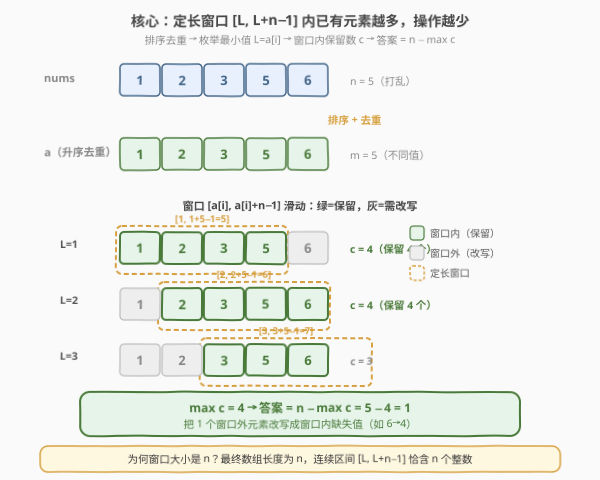
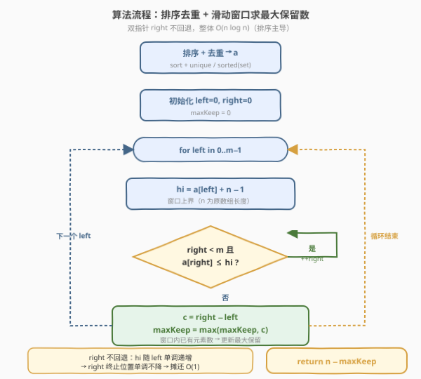
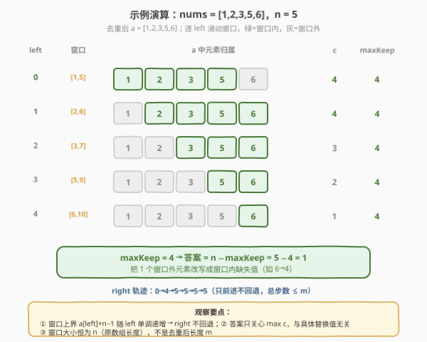

# LeetCode 使数组连续的最少操作数 题解

## 1. 题目概述

- **标题 / 题号**：使数组连续的最少操作数（#2009，hard）
- **链接**：https://leetcode.cn/problems/minimum-number-of-operations-to-make-array-continuous/
- **难度**：困难
- **标签**：数组、排序、滑动窗口、二分查找

**题意**：给定一个整数数组 `nums`。一次操作可以将任意一个元素替换为**任意整数**。当 `nums` 同时满足以下两个条件时，称其为**连续的**：

1. 所有元素**互不相同**（唯一）；
2. $\max(\text{nums}) - \min(\text{nums}) = \text{nums.length} - 1$（即排序后恰好是公差为 1 的等差数列）。

返回使 `nums` 连续的**最少操作数**。

**示例 1**：

```text
输入：nums = [4,2,5,3]
输出：0
解释：排序后 [2,3,4,5]，唯一且 max-min = 5-2 = 3 = 4-1，已连续。
```

**示例 2**：

```text
输入：nums = [1,2,3,5,6]
输出：1
解释：把 5 换成 4 → [1,2,3,4,6]，max-min = 6-1 = 5 = 5-1，唯一。
```

**示例 3**：

```text
输入：nums = [1,10,100,1000]
输出：3
解释：保留 1，把 10/100/1000 换成 2/3/4 → [1,2,3,4]。
```

**约束**：

- $1 \le \text{nums.length} \le 10^5$
- $1 \le \text{nums}[i] \le 10^9$

> 💡 **审题关键**：① 连续的等价定义是「排序后恰为 $[\min, \min+1, \dots, \min+n-1]$ 这 $n$ 个连续整数」；② 操作可以替换成**任意整数**，所以那些不在目标窗口里的元素都能被「改写」成窗口缺的值——真正稀缺的是「窗口里已经存在的不同值」，**保留越多，操作越少**；③ 唯一性意味着重复值天然只能保留一个，**先去重再处理**。

## 2. 解题思路

### 2.1 暴力思路：枚举最小值 + 计数

连续数组的形态由「最小值 $L$」唯一确定：目标集合为 $\{L, L+1, \dots, L+n-1\}$。若枚举所有可能的 $L$（候选范围由 `nums` 的值域决定），对每个 $L$ 数一数 `nums` 中有多少个**不同**值落在 $[L, L+n-1]$ 内，记为 $c$，则需要操作 $n - c$ 次（把其余位置改写成窗口里缺的值）。取所有 $L$ 的最小值即可。

- **正确性**：覆盖所有可能的最小值。
- **效率**：$L$ 的取值范围可达 $10^9$，逐个枚举不可行；即便只枚举 `nums` 中的值作 $L$，每次 $O(n)$ 计数也要 $O(n^2)$，对 $n \le 10^5$ 太慢。

> ⚠️ 暴力的瓶颈在于「计数」是线性的。但若把数组**排序去重**，落在任意区间 $[L, L+n-1]$ 内的不同值个数就能用**二分**或**双指针**在 $O(\log n)$ / 摊还 $O(1)$ 内得到——这就是优化的切入点。

### 2.2 核心观察：排序去重 + 定长窗口内的「最多保留」



关键洞察分三步：

**第一步：去重。** 操作可改写成任意整数，重复值最多保留一个（唯一性要求）。把 `nums` 排序去重得到升序数组 `a`，长度 $m \le n$。后续只需考虑 `a` 中的不同值。

**第二步：最小值只可能是 `a` 中某元素。** 设最终连续数组的最小值为 $L$。若 $L$ 不在 `a` 中，可以把 $L$ 向右滑动到 `a` 中第一个 $\ge L$ 的元素 $a[i]$ 而不丢失任何已保留值（因为 $[L, L+n-1]$ 与 $[a[i], a[i]+n-1]$ 相比，左侧丢掉的值都不在 `a` 中，右侧可能多覆盖一些 `a` 中的值）。因此**只需枚举 $L = a[i]$**，候选数从值域 $10^9$ 降到 $m \le n$。

**第三步：定长窗口内的「最多保留」即最优解。** 当 $L = a[i]$ 时，目标窗口为 $[a[i], a[i]+n-1]$。在这个窗口里，`a` 中已经存在的元素个数 $c_i$ 就是「无需操作就能保留」的数量；其余 $n - c_i$ 个位置必须靠操作改写。我们要最小化操作数，等价于**最大化 $c_i$**：

$$\boxed{\text{答案} = n - \max_{i} c_i, \quad c_i = \#\{a[j] \in [a[i],\, a[i]+n-1]\}}$$

> 💡 **为什么窗口大小是 $n$ 而不是 $m$？** 题目要求最终数组长度仍为 $n$（操作是「替换」不是「删除」），所以连续数组覆盖的整数区间长度恒为 $n$，即 $[L, L+n-1]$。去重后的 $m$ 只是「可用不同值」的数量，窗口大小始终用 $n$。

> ⚠️ **最高频陷阱**：混淆 $n$ 和 $m$。窗口端点写 $a[i]+m-1$ 会漏掉正确答案（窗口太窄，保留数偏少）；用 $m$ 而非 $n$ 计算操作数会得到错误结果。记住：**窗口大小 = 原数组长度 $n$**。

### 2.3 算法流程图



1. **排序去重**：对 `nums` 排序并去重，得到升序数组 `a`，长度 $m$。
2. **滑动窗口**：双指针 `left` / `right`，初始均指向 $0$。维护窗口 `[a[left], a[left]+n-1]` 内的元素集合。
   - 对每个 `left`，推进 `right` 直到 `a[right] > a[left] + n - 1`（或 `right == m`）。
   - 此时窗口内已有元素数 $c = \text{right} - \text{left}$。
   - 更新 $\text{maxKeep} = \max(\text{maxKeep}, c)$。
   - `left` 右移一格（`right` 不回退，利用单调性）。
3. **返回** $n - \text{maxKeep}$。

> 💡 **为什么 `right` 不回退？** 当 `left` 右移时，窗口下界 $a[\text{left}]$ 单调递增，上界 $a[\text{left}]+n-1$ 也单调递增，故 `right` 的终止位置单调不降。这是经典**定长窗口双指针**的摊还 $O(1)$ 性质，整体 $O(m)$。

### 2.4 示例演算

以示例 2 `nums = [1,2,3,5,6]`（$n=5$）演示窗口滑动过程：



| 步骤 | `left` | 窗口 $[a[\text{left}],\, a[\text{left}]+4]$ | 窗口内 `a` 的元素 | $c$ | $\text{maxKeep}$ |
|------|--------|------------------------------------------|------------------|-----|------------------|
| 初始 | 0 | $[1, 5]$ | $\{1,2,3,5\}$ | 4 | 4 |
| 1 | 1 | $[2, 6]$ | $\{2,3,5,6\}$ | 4 | 4 |
| 2 | 2 | $[3, 7]$ | $\{3,5,6\}$ | 3 | 4 |
| 3 | 3 | $[5, 9]$ | $\{5,6\}$ | 2 | 4 |
| 4 | 4 | $[6, 10]$ | $\{6\}$ | 1 | 4 |

$\text{maxKeep} = 4$，答案 $= n - 4 = 5 - 4 = 1$（把 5 改成 4，或把 6 改成 4 等）。

> 💡 **观察要点**：① 窗口右端 $a[\text{left}]+n-1$ 随 `left` 单调递增，`right` 只前进不回退；② 重复元素已去重，$c = \text{right}-\text{left}$ 即窗口内不同值数；③ 答案只关心「最大保留数」，与具体替换成哪些值无关——只要窗口内有 $c$ 个已存在值，剩余 $n-c$ 个空位总能被操作填满。

## 3. 参考代码

### C++

```cpp
class Solution {
public:
    int minOperations(vector<int>& nums) {
        int n = nums.size();
        sort(nums.begin(), nums.end());
        nums.erase(unique(nums.begin(), nums.end()), nums.end());
        int m = nums.size();
        int maxKeep = 0, right = 0;
        for (int left = 0; left < m; ++left) {
            int hi = nums[left] + n - 1;
            while (right < m && nums[right] <= hi) ++right;
            maxKeep = max(maxKeep, right - left);
        }
        return n - maxKeep;
    }
};
```

### Python

```python
class Solution:
    def minOperations(self, nums: List[int]) -> int:
        n = len(nums)
        a = sorted(set(nums))
        m = len(a)
        max_keep = 0
        right = 0
        for left in range(m):
            hi = a[left] + n - 1
            while right < m and a[right] <= hi:
                right += 1
            max_keep = max(max_keep, right - left)
        return n - max_keep
```

> 💡 **写法对照**：两版逻辑完全一致——`sort + unique`（C++）/ `sorted(set(...))`（Python）去重，双指针 `right` 滑动求每个 `left` 的窗口内元素数。`right` 不回退是关键，保证整体 $O(m)$。注意 `hi = a[left] + n - 1` 用的是**原数组长度 $n$**，不是去重后的 $m$。

> ⚠️ **溢出提示**：$a[i] \le 10^9$，$a[i] + n - 1$ 最大约 $10^9 + 10^5$，未超过 `int` 上界 $2.1 \times 10^9$，C++ 用 `int` 安全；若值域更大可换 `long long`。

## 4. 复杂度分析

| 维度 | 复杂度 | 说明 |
|------|--------|------|
| 时间复杂度 | $O(n \log n)$ | 排序 $O(n \log n)$ 主导；去重 $O(n)$，双指针滑动 $O(m) \le O(n)$ |
| 空间复杂度 | $O(\log n)$ | 排序栈空间（C++ `sort` / Python `sorted` 的递归栈）；若语言排序为原地则 $O(1)$ 额外 |

> 💡 $n \le 10^5$，$O(n \log n)$ 完全宽裕。本题的优雅在于把「枚举最小值 + 线性计数」的 $O(n^2)$ 暴力，借助排序去重 + 单调双指针降到 $O(n \log n)$——关键洞察是「最小值只需取数组中的不同值」与「窗口上界单调递增」。

## 5. 扩展：二分解法与滑动窗口的等价性

除了双指针，还可以用**二分查找**求每个 `left` 的窗口内元素数：

1. 排序去重得 `a`。
2. 对每个 `left`，用 `upper_bound` 在 `a` 中找首个 $> a[\text{left}] + n - 1$ 的位置 `right`，则 $c = \text{right} - \text{left}$。
3. 答案 $= n - \max c$。

```python
def minOperations(self, nums: List[int]) -> int:
    n = len(nums)
    a = sorted(set(nums))
    max_keep = 0
    for i, lo in enumerate(a):
        hi = lo + n - 1
        j = bisect.bisect_right(a, hi)
        max_keep = max(max_keep, j - i)
    return n - max_keep
```

**正确性**：`bisect_right` 返回首个 $> \text{hi}$ 的下标，恰是双指针解法中 `right` 的终止位置，$c = j - i$ 完全一致。

**复杂度**：$O(n \log n)$（排序）+ $O(m \log m)$（$m$ 次二分），整体仍是 $O(n \log n)$。与双指针解法同阶，但常数略大（每次二分 $O(\log m)$ vs 摊还 $O(1)$）。面试中先讲双指针，再提二分作为对照，体现「单调性 → 双指针可替二分」的优化意识。

> 💡 **何时选二分？** 若窗口端点不单调（例如窗口大小随 `left` 变化非线性），双指针失效，二分是通用兜底。本题窗口端点 $a[\text{left}]+n-1$ 随 `left` 严格递增，双指针天然适用。

## 6. 面试要点

**Q1：为什么最终连续数组的最小值一定是去重后数组 `a` 中的某个元素？**

> 反证：若最优解的最小值 $L \notin a$，令 $a[i]$ 为 `a` 中第一个 $> L$ 的元素。把窗口从 $[L, L+n-1]$ 右移到 $[a[i], a[i]+n-1]$，左侧丢掉的 $[L, a[i]-1]$ 这些值本就不在 `a` 中（无保留值损失），右侧可能多覆盖 `a` 中的值。因此 $a[i]$ 作最小值时保留数 $\ge$ $L$ 作最小值时，不劣于最优解。故只需枚举 `a` 中元素。

**Q2：为什么窗口大小用原数组长度 $n$，而不是去重后的长度 $m$？**

> 题目要求最终数组长度为 $n$（操作是「替换」不改变长度），连续数组覆盖的整数区间长度恒为 $n$，即 $[\min, \min+n-1]$。去重后的 $m$ 只是「可用不同值」数，与窗口大小无关。若误用 $m$，窗口偏窄会漏掉正确答案。

**Q3：双指针为什么是 $O(m)$？`right` 不回退的依据是什么？**

> 当 `left` 递增时，窗口下界 $a[\text{left}]$ 单调递增，上界 $a[\text{left}]+n-1$ 也单调递增（因为 `a` 升序，$a[\text{left}]$ 递增）。故满足 `a[right] <= hi` 的 `right` 终止位置单调不降，`right` 总共最多前进 $m$ 次，摊还每次 $O(1)$，整体 $O(m)$。

**Q4：如何处理重复元素？为什么去重不影响答案？**

> 唯一性要求最终数组无重复，所以重复值最多保留一个。去重把「重复值」折叠成一个，操作时仍需把多余的副本改写成窗口内缺的值。去重后的 $c$ 是「窗口内不同值数」，剩余 $n - c$ 恰好是需要改写的位置数（包括原重复值副本和窗口外的值），与不去重枚举的结果一致，但避免了重复计数。

**Q5：本题与「最长连续序列」（128）有何异同？**

> 两者都涉及「连续整数」概念。128 是找数组中**已存在**的最长连续序列长度（不改值），用哈希集合 $O(n)$；2009 是要通过**改值**让整个数组变成连续的，求最少操作数。2009 的核心是「最大化窗口内已存在值数」，128 是「最大化已存在连续段长度」，目标函数相似但 2009 允许改写、窗口大小固定为 $n$，故用排序 + 双指针而非哈希。

> 💡 **一句话总结**：排序去重 → 枚举最小值 $a[i]$ → 定长窗口 $[a[i], a[i]+n-1]$ 内已有元素数 $c$ → 答案 $= n - \max c$，双指针 $O(n \log n)$。

## 同类练习题

| # | 题目 | 与本题的关联 |
|---|------|-------------|
| 128 | [最长连续序列](https://leetcode.cn/problems/longest-consecutive-sequence/)（[题解](../0001-0100/128_最长连续序列.md)） | 同为「连续整数」概念，但不改值只找最长已存在连续段，哈希集合 $O(n)$；对照 2009 允许改写、窗口固定为 $n$ |
| 424 | [替换后的最长重复字符](https://leetcode.cn/problems/longest-repeating-character-replacement/) | 定长窗口 + 双指针求「最多保留」的同类骨架，窗口内非主字符数 $\le k$ 即合法，与 2009「窗口内已有值越多操作越少」目标函数同源 |
| 209 | [长度最小的子数组](https://leetcode.cn/problems/minimum-size-subarray-sum/)（[题解](../0201-0300/209_长度最小的子数组.md)） | 正数单调性下的滑动窗口模板，对照 2009「窗口上界单调递增 → `right` 不回退」的双指针优化范式 |
| 719 | [找出第 K 小的数对距离](https://leetcode.cn/problems/find-k-th-smallest-pair-distance/)（[题解](../0601-0700/719_找出第K小的数对距离.md)） | 排序 + 双指针在单调区间内计数，与 2009「窗口内元素数计数」共用排序双指针计数套路 |
