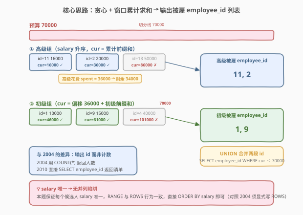
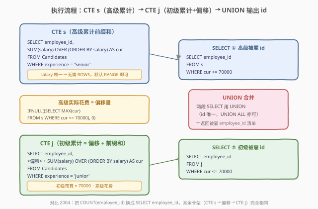
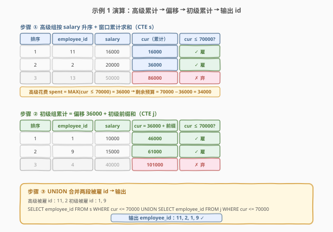

# LeetCode 职员招聘人数 II 题解

## 1. 题目概述

- **标题 / 题号**：职员招聘人数 II（#2010，hard）
- **链接**：https://leetcode.cn/problems/the-number-of-seniors-and-juniors-to-join-the-company-ii/
- **难度**：困难
- **标签**：SQL、窗口函数、累计求和（Running Sum）、ORDER BY、IFNULL、CTE、UNION、贪心

**题意**：给定 `Candidates` 表，记录每位候选人的 `employee_id`、经验层级（`Senior` / `Junior`）和期望月薪 `salary`。公司工资预算为 **70000 美元**，招聘标准按优先级如下：

1. **继续雇佣薪水最低的高级职员**，直到不能再雇佣更多的高级职员；
2. **用剩下的预算雇佣薪水最低的初级职员**；
3. **继续以最低的工资雇佣初级职员**，直到不能再雇佣更多的初级职员。

编写 SQL 查询，返回最终**被雇佣职员的 `employee_id`**，**任意顺序**返回。

> ⚠️ 本题是 LeetCode **Plus 会员专享题（🔒）**，是 [2004. 职员招聘人数](../2001-2100/2004_职员招聘人数.md) 的姊妹题：2004 输出**每层级的雇佣人数**，本题输出**被雇职员的 id 清单**。

**表结构**：

```text
Table: Candidates
+-------------+------+
| Column Name | Type |
+-------------+------+
| employee_id | int  |  ← 唯一值列
| experience  | enum |  ← 取值 'Senior' / 'Junior'
| salary      | int  |
+-------------+------+
employee_id 是该表中具有唯一值的列。
experience 是一个枚举，包含一个值（"Senior"、"Junior"）。
每行显示候选人的 id、月薪和经验。
每个候选人的 salary 保证是 唯一 的。
```

**示例 1**：

```text
输入：
Candidates 表:
+-------------+------------+--------+
| employee_id | experience | salary |
+-------------+------------+--------+
| 1           | Junior     | 10000  |
| 9           | Junior     | 15000  |
| 2           | Senior     | 20000  |
| 11          | Senior     | 16000  |
| 13          | Senior     | 50000  |
| 4           | Junior     | 40000  |
+-------------+------------+--------+

输出：
+-------------+
| employee_id |
+-------------+
| 11          |
| 2           |
| 1           |
| 9           |
+-------------+
```

**解释**：

| 步骤 | 操作 | 预算变化 |
|------|------|----------|
| ① 雇高级 | 雇佣 ID 11（16000）、2（20000），累计花费 36000 ≤ 70000 | 剩余 34000 |
| ② 再雇高级？ | ID 13 薪水 50000，36000 + 50000 = 86000 > 70000，雇不起 | 剩余 34000 |
| ③ 雇初级 | 雇佣 ID 1（10000）、9（15000），累计花费 34000 + 25000 = 59000 ≤ 70000 | 剩余 9000 |
| ④ 再雇初级？ | ID 4 薪水 40000，59000 + 40000 = 99000 > 70000，雇不起 | 剩余 9000 |

最终被雇职员 id 为 **11、2、1、9**。

**示例 2**：

```text
输入：
Candidates 表:
+-------------+------------+--------+
| employee_id | experience | salary |
+-------------+------------+--------+
| 1           | Junior     | 25000  |
| 9           | Junior     | 10000  |
| 2           | Senior     | 85000  |
| 11          | Senior     | 80000  |
| 13          | Senior     | 90000  |
| 4           | Junior     | 30000  |
+-------------+------------+--------+

输出：
+-------------+
| employee_id |
+-------------+
| 9           |
| 1           |
| 4           |
+-------------+
```

**解释**：所有高级员工月薪都 ≥ 80000 > 70000，一个都雇不起（高级 0 人）。全部 70000 预算留给初级：10000 + 25000 + 30000 = 65000 ≤ 70000，雇佣全部 3 名初级员工（ID 9、1、4）。

**约束**：

- `employee_id` 是唯一值列
- `experience` 取值为 `'Senior'` 或 `'Junior'`
- `salary` 为正整数，且**每个候选人的 `salary` 保证唯一**
- 预算固定为 70000

> 💡 **审题关键**：① 输出的是**被雇职员的 `employee_id` 清单**，而非 2004 的人数计数——把 `COUNT(employee_id)` 换成 `SELECT employee_id` 即可；② `salary` 保证**唯一**——不会有并列薪水，因此 `SUM() OVER (ORDER BY salary)` 的默认 `RANGE` 框架与显式 `ROWS` 行为一致，无需像 2004 那样强制写 `ROWS`；③ 雇佣有**优先级**——高级先雇、初级后雇，预算在两级之间**传递**；④ 用 `UNION` 合并高级与初级两段 id 清单。

## 2. 解题思路

### 2.1 暴力思路：逐人贪心模拟

最直觉的过程式思路是：把候选人分成高级、初级两组，各自按薪水升序排序；先从高级组逐个雇（累计花费 ≤ 70000 即雇），再从初级组接着雇（累计花费 ≤ 70000 即雇），最后把所有被雇者的 `employee_id` 收集起来。

```text
budget = 70000
sort seniors by salary ASC
spent = 0
hired = []
for s in seniors:
    if spent + s.salary <= budget:
        spent += s.salary
        hired.append(s.employee_id)
    else:
        break

sort juniors by salary ASC
for j in juniors:
    if spent + j.salary <= budget:
        spent += j.salary
        hired.append(j.employee_id)
    else:
        break

return hired
```

模拟完全正确，但 SQL 是集合式语言，没有显式循环。「逐个累加并判断 ≤ 预算」在 SQL 中对应**窗口函数的累计求和（Running Sum）**——`SUM(salary) OVER (ORDER BY salary)` 一步算出每人的「前缀累计花费」，再 `WHERE cur <= 70000` 筛选可雇用者，直接 `SELECT employee_id` 即得清单。

> ⚠️ **关键转换**：把「逐人循环累加」翻译成「一次性算出所有人的累计前缀和」。窗口函数 `SUM() OVER (ORDER BY ...)` 正是为此而生——它对排序后的每一行，计算从第一行到当前行的累计和，等价于循环中的 `spent += salary`。

### 2.2 核心观察：贪心 + 窗口函数累计求和 → 输出 id 清单



**问题本质**：这是一道**贪心 + 累计前缀和**题，骨架与 2004 完全相同，仅输出列不同。核心观察有三点：

**观察 ①：贪心策略——薪水升序，低薪优先**

$$\text{最大化雇用人数} \iff \text{优先选择薪水最低的候选人}$$

要让雇用人数最多，就应贪心地从薪水最低的开始雇。同样花 30000，雇 3 个 10000 的比雇 1 个 30000 的人多。因此对高级和初级**分别按 `salary` 升序排序**，从前到后依次雇用。

**观察 ②：窗口累计求和——前缀和判断可雇用性**

$$\text{cur}(i) = \sum_{k=1}^{i} \text{salary}[k]$$

对排序后的第 $i$ 位候选人，其累计前缀和 $\text{cur}(i)$ 表示「雇用前 $i$ 人的总花费」。若 $\text{cur}(i) \le 70000$，则前 $i$ 人全部可雇；若 $\text{cur}(i) > 70000$，则第 $i$ 人及之后都雇不起（薪水升序，后面只会更贵）。用 SQL 窗口函数一步算出：

```sql
SUM(salary) OVER (ORDER BY salary) AS cur
```

> 💡 **与 2004 的关键区别——无需 `ROWS` 框架**：本题保证 `salary` **唯一**，没有并列值。`SUM() OVER (ORDER BY salary)` 默认使用 `RANGE` 框架——当存在并列薪水时，并列行会共享累计值（含所有并列行之和），可能导致「本可雇一人、却判定全员超预算」的错误（详见 2004 第 5 节反例）。但本题无并列，`RANGE` 与 `ROWS` 行为完全一致，直接写 `ORDER BY salary` 即可，代码更简洁。

**观察 ③：预算传递——高级花费作为初级的「起点偏移」**

$$\text{cur}_{\text{Junior}}(i) = \text{spent}_{\text{Senior}} + \sum_{k=1}^{i} \text{salary}_{\text{Junior}}[k]$$

高级和初级不是独立的——初级使用的预算是 70000 **减去**高级已花费的部分。因此初级的累计前缀和需要加上一个**起点偏移量** $\text{spent}_{\text{Senior}}$：

$$\text{spent}_{\text{Senior}} = \max\{\text{cur}_{\text{Senior}}(i) \mid \text{cur}_{\text{Senior}}(i) \le 70000\}$$

即高级组中所有 $\text{cur} \le 70000$ 的最大累计值（最后一个可雇用者的累计值）。若高级无人可雇或无高级候选人，`MAX` 返回 `NULL`，用 `IFNULL(NULL, 0)` 补 0。

**观察 ④：输出 id 清单——`SELECT employee_id` 替代 `COUNT`**

2004 的末步是 `SELECT 'Senior', COUNT(employee_id) FROM s WHERE cur <= 70000`（计数）；本题只需把 `COUNT(employee_id)` 换成 `employee_id`，直接返回被雇者的 id：

```sql
SELECT employee_id FROM s WHERE cur <= 70000
UNION
SELECT employee_id FROM j WHERE cur <= 70000
```

> 💡 **为什么用 `UNION` 而非 `UNION ALL`？** 每位候选人要么是 Senior 要么是 Junior，不会同时出现在 CTE `s` 与 CTE `j` 中，两段 id 天然无重复，理论上 `UNION ALL` 与 `UNION` 结果相同。`UNION ALL` 少一次去重排序、效率略高，是更优选择（见解法 A 注释）；`UNION` 写法与官方题解一致，语义上更保险。两者均可 AC。

### 2.3 算法流程图



**逻辑执行步骤**：

| 步骤 | 子句 | 作用 |
|------|------|------|
| ① | `CTE s`：`WHERE experience='Senior'` + `SUM(salary) OVER (ORDER BY salary)` | 高级组按薪水升序，算出每人的累计前缀和 `cur` |
| ② | 求偏移：`IFNULL((SELECT MAX(cur) FROM s WHERE cur <= 70000), 0)` | 查高级实际花费作为初级累计的起点偏移 |
| ③ | `CTE j`：`偏移 + SUM(salary) OVER (ORDER BY salary)` | 初级组累计前缀和 = 高级花费 + 初级前缀和 |
| ④ | `SELECT employee_id FROM s WHERE cur <= 70000` | 返回被雇的高级 id |
| ⑤ | `UNION SELECT employee_id FROM j WHERE cur <= 70000` | 合并被雇的初级 id |

> 💡 **与 2004 流程的对照**：唯一差异在步骤 ④⑤——2004 用 `COUNT(employee_id)` 返回每级人数（一行），本题用 `SELECT employee_id` 返回每级被雇者清单（多行）。CTE `s`、偏移量、CTE `j` 的骨架完全相同。

> ⚠️ **空集处理**：当某层级无人可雇（如示例 2 的高级，所有 `cur > 70000`），`SELECT employee_id FROM s WHERE cur <= 70000` 返回**空结果集**（零行）——不像 2004 那样靠 `COUNT` 对空集返回 0 来凑行，本题直接不输出任何高级 id，`UNION` 自然只拼初级部分。这是「输出清单」与「输出计数」在边界情形上的语义差异。

### 2.4 示例演算

以示例 1 数据为例，逐步观察贪心 + 窗口累计求和的完整过程：



**第一步：高级组按薪水升序 + 窗口累计求和（CTE s）**

| 排序后顺序 | employee_id | salary | cur（累计前缀和） | cur ≤ 70000？ |
|-----------|-------------|--------|-------------------|---------------|
| 1 | 11 | 16000 | 16000 | ✓ 雇 |
| 2 | 2 | 20000 | 36000 | ✓ 雇 |
| 3 | 13 | 50000 | 86000 | ✗ 弃 |

> 💡 三位高级薪水 16000、20000、50000 **互不相同**——这正是本题 `salary` 唯一约束的体现，无需 `ROWS` 框架也能保证累计值逐行递增。

**第二步：计算高级实际花费（偏移量）**

$$\text{spent}_{\text{Senior}} = \max\{16000, 36000\} = 36000 \quad (\text{86000 > 70000 排除})$$

```sql
IFNULL((SELECT MAX(cur) FROM s WHERE cur <= 70000), 0)  →  36000
```

**第三步：初级组按薪水升序 + 窗口累计求和 + 偏移（CTE j）**

| 排序后顺序 | employee_id | salary | 初级前缀和 | cur = 36000 + 前缀和 | cur ≤ 70000？ |
|-----------|-------------|--------|-----------|----------------------|---------------|
| 1 | 1 | 10000 | 10000 | 46000 | ✓ 雇 |
| 2 | 9 | 15000 | 25000 | 61000 | ✓ 雇 |
| 3 | 4 | 40000 | 65000 | 101000 | ✗ 弃 |

**第四步：UNION 合并 id 清单**

| 来源 | 被雇 employee_id |
|------|------------------|
| CTE s（高级） | 11, 2 |
| CTE j（初级） | 1, 9 |

**最终输出**：

| employee_id |
|-------------|
| 11 |
| 2 |
| 1 |
| 9 |

> 💡 **观察要点**：① 代价信息沿排序后的序列**单调传播**——叶子薪水逐行累加，无需回溯搜索；② 偏移量 36000 把「高级花费」无缝衔接到初级累计中，实现了预算在两级间的传递；③ `UNION` 把两段 id 拼成一份清单，顺序任意，题目允许任意顺序返回。

## 3. 参考代码

### SQL（解法 A：CTE + 窗口函数累计求和，推荐）

```sql
WITH
    s AS (
        SELECT
            employee_id,
            SUM(salary) OVER (ORDER BY salary) AS cur
        FROM Candidates
        WHERE experience = 'Senior'
    ),
    j AS (
        SELECT
            employee_id,
            IFNULL(
                (SELECT MAX(cur) FROM s WHERE cur <= 70000),
                0
            ) + SUM(salary) OVER (ORDER BY salary) AS cur
        FROM Candidates
        WHERE experience = 'Junior'
    )
SELECT employee_id
FROM s
WHERE cur <= 70000
UNION
SELECT employee_id
FROM j
WHERE cur <= 70000;
```

> 💡 **写法要点**：
> - **CTE `s`**：筛出高级候选人，`SUM(salary) OVER (ORDER BY salary)` 算累计前缀和 `cur`。本题 `salary` 唯一，无需显式 `ROWS` 框架，默认 `RANGE` 即正确。
> - **CTE `j`**：筛出初级候选人，累计前缀和 = `IFNULL((SELECT MAX(cur) FROM s WHERE cur <= 70000), 0)`（高级花费偏移）+ 初级自身前缀和。`IFNULL` 兜底：若无高级可雇或无高级候选人，偏移为 0。
> - **末段**：`SELECT employee_id ... WHERE cur <= 70000` 直接返回被雇者 id（对照 2004 把 `employee_id` 换成 `COUNT(employee_id)` 即可）。
> - ⚠️ `IFNULL` 的子查询必须用**括号包裹**：`IFNULL((SELECT ...), 0)`，否则语法错误。
> - **`UNION` vs `UNION ALL`**：每位候选人只属于一级，两段 id 无重复，`UNION ALL` 省去一次去重排序、更高效；`UNION` 语义更保险。二者均 AC，本题选用 `UNION`。

### SQL（解法 B：子查询 + 窗口函数，无 CTE）

```sql
SELECT employee_id
FROM (
    SELECT
        employee_id,
        SUM(salary) OVER (ORDER BY salary) AS cur
    FROM Candidates
    WHERE experience = 'Senior'
) s
WHERE cur <= 70000
UNION
SELECT employee_id
FROM (
    SELECT
        employee_id,
        IFNULL(
            (SELECT MAX(cur) FROM (
                SELECT SUM(salary) OVER (ORDER BY salary) AS cur
                FROM Candidates
                WHERE experience = 'Senior'
            ) s WHERE cur <= 70000),
            0
        ) + SUM(salary) OVER (ORDER BY salary) AS cur
    FROM Candidates
    WHERE experience = 'Junior'
) j
WHERE cur <= 70000;
```

> 💡 **与解法 A 的区别**：把 CTE `s` 内联到初级子查询中（求 `MAX(cur)` 时重复写一遍高级累计求和），不使用 `WITH`。逻辑完全相同，但高级累计求和的 SQL 重复出现两次——可读性较差。MySQL 5.7 及以下不支持 CTE（`WITH`）时可用此写法；MySQL 8.0+ 优先用解法 A。

### Python（pandas）

```python
import pandas as pd

def find_hired_employees(candidates: pd.DataFrame) -> pd.DataFrame:
    budget = 70000

    seniors = candidates[candidates['experience'] == 'Senior'].sort_values('salary')
    seniors['cum'] = seniors['salary'].cumsum()
    senior_hired = seniors[seniors['cum'] <= budget]

    spent = int(senior_hired['cum'].max()) if not senior_hired.empty else 0

    juniors = candidates[candidates['experience'] == 'Junior'].sort_values('salary')
    juniors['cum'] = spent + juniors['salary'].cumsum()
    junior_hired = juniors[juniors['cum'] <= budget]

    hired_ids = pd.concat([senior_hired['employee_id'], junior_hired['employee_id']])
    return pd.DataFrame({'employee_id': hired_ids})
```

> 💡 **pandas 对照**：`sort_values('salary')` 对应 `ORDER BY salary`；`cumsum()` 对应 `SUM() OVER (ORDER BY ...)` 累计前缀和；`seniors[seniors['cum'] <= budget]` 对应 `SELECT employee_id FROM s WHERE cur <= 70000`——直接筛出被雇行而非计数；`spent = senior_hired['cum'].max()` 对应 `SELECT MAX(cur) FROM s WHERE cur <= 70000`；`if not senior_hired.empty` 对应 `IFNULL(..., 0)` 兜底空集；`pd.concat` 对应 `UNION` 合并两段 id。

## 4. 复杂度分析

| 维度 | 解法 A（CTE + 窗口函数） | 解法 B（子查询） | pandas |
|------|-------------------------|------------------|--------|
| **时间** | $O(n \log n)$ | $O(n \log n)$ | $O(n \log n)$ |
| **空间** | $O(n)$ | $O(n)$ | $O(n)$ |
| **扫描次数** | 2 次过滤 + 1 次子查询 | 3 次过滤（高级算两遍） | 2 次过滤 |
| **可读性** | ✓ **最佳**（CTE 分层清晰） | 差（子查询嵌套深） | ✓ 清晰 |

> - $n$ = `Candidates` 表行数
> - **时间**：对高级、初级各做一次 `ORDER BY salary` 排序 $O(n \log n)$，窗口函数累计求和 $O(n)$（排序后线性扫描），子查询求 `MAX` $O(n)$。总体由排序主导 $O(n \log n)$。
> - **空间**：CTE / 子查询需物化排序后的中间表 $O(n)$。
> - 解法 B 的高级累计求和写了两次（外层取 id + 内层求 `MAX`），若数据库不做 CTE 物化缓存，可能多一次排序；解法 A 用 CTE 复用 `s`，更高效。

> 💡 **与 2004 复杂度对比**：两题复杂度完全相同——输出 `employee_id` 清单 vs `COUNT(employee_id)` 仅影响最终投影列，不改变排序与累计求和的主导开销。差异只在结果行数：2004 固定输出 2 行（Senior/Junior 各一行计数），2010 输出被雇者总数行（0 ~ n 行）。

## 5. 扩展：与 2004 的对照——从「计数」到「清单」

### 5.1 输出语义的差异

| 维度 | 2004 职员招聘人数 | 2010 职员招聘人数 II |
|------|-------------------|---------------------|
| **输出列** | `(experience, accepted_candidates)` | `employee_id` |
| **聚合方式** | `COUNT(employee_id)` 聚合 | 无聚合，直接投影 `employee_id` |
| **结果行数** | 固定 2 行（Senior、Junior 各一行） | 0 ~ n 行（每个被雇者一行） |
| **空集行为** | `COUNT` 对空集返回 0，仍输出 `(Senior, 0)` | 空集返回零行，不输出该级任何 id |
| **合并方式** | `UNION ALL`（两行计数天然不同） | `UNION`（两段 id 清单天然不交） |

### 5.2 SQL 骨架的复用

两题的 CTE `s`、偏移量、CTE `j` **完全相同**，仅末段投影不同。把 2004 的末段：

```sql
SELECT 'Senior' AS experience, COUNT(employee_id) AS accepted_candidates
FROM s WHERE cur <= 70000
UNION ALL
SELECT 'Junior' AS experience, COUNT(employee_id) AS accepted_candidates
FROM j WHERE cur <= 70000;
```

替换为：

```sql
SELECT employee_id FROM s WHERE cur <= 70000
UNION
SELECT employee_id FROM j WHERE cur <= 70000;
```

即得 2010 的解。这是「同一骨架、不同投影」的典型范式——面试中遇到变体题，先识别可复用的骨架，再调整投影列。

### 5.3 `salary` 唯一性对窗口框架的影响

2004 的 `salary` **可能并列**，默认 `RANGE` 框架会让并列行共享累计值，导致「少雇」错误，必须显式写 `ROWS BETWEEN UNBOUNDED PRECEDING AND CURRENT ROW`。本题 `salary` **保证唯一**，无并列值，`RANGE` 与 `ROWS` 行为一致，直接 `ORDER BY salary` 即可。

> ⚠️ **面试提醒**：即使本题 `salary` 唯一让 `RANGE` 安全，仍建议主动提及 `ROWS` vs `RANGE` 的区别（参见 2004 第 5 节），体现对窗口函数的深入理解。生产环境中薪水并列是常态，`RANGE` 会系统性少雇——「逐人贪心累加」一律用 `ROWS` 是更稳健的默认习惯。

> 💡 **一句话总结**：2010 = 2004 的骨架 + 「输出 `employee_id` 清单」的投影变更 + 「`salary` 唯一」简化窗口框架。识别变体题的可复用骨架、调整投影列，是 SQL 题举一反三的核心能力。

## 6. 面试要点

1. **本题与 2004 的核心区别是什么？**

   > 仅在输出：2004 用 `COUNT(employee_id)` 返回**每级人数**（固定 2 行），本题直接 `SELECT employee_id` 返回**被雇者 id 清单**（0~n 行）。CTE `s`、偏移量、CTE `j` 的骨架完全相同——这是「同一骨架、不同投影」的变体题。

2. **为什么本题不需要显式写 `ROWS BETWEEN UNBOUNDED PRECEDING AND CURRENT ROW`？**

   > 本题保证 `salary` **唯一**，没有并列值。`SUM() OVER (ORDER BY salary)` 默认 `RANGE` 框架在无并列时与 `ROWS` 行为完全一致——每一行都获得独立递增的累计值。而 2004 的 `salary` 可能并列，`RANGE` 会让并列行共享累计值（含所有并列行之和），导致「本可雇一人、却判定全员超预算」的错误，必须显式 `ROWS`。本题省去 `ROWS` 是 `salary` 唯一约束带来的简化。

3. **初级组的累计前缀和为什么要加偏移量？**

   > 预算在高级和初级之间**传递**——高级花剩的才给初级。初级的累计花费 = 高级已花费总额 + 初级自身前缀和。若不加偏移，初级组会从 0 开始累计，可能「雇了过多初级」超出总预算。偏移量 = `MAX(cur) FROM s WHERE cur <= 70000`，即高级组最后一个可雇用者的累计值。

4. **`IFNULL((SELECT MAX(cur) ...), 0)` 的 `0` 兜底什么情况？**

   > 两种情况返回 `NULL`：① 所有高级候选人的 `cur` 都 > 70000（一个高级都雇不起，如示例 2）；② `Candidates` 表中根本没有高级候选人（CTE `s` 为空集，`MAX` 返回 `NULL`）。两种情况下高级花费为 0，全部 70000 预算留给初级。`IFNULL(NULL, 0)` 把 `NULL` 补 0 作为偏移。

5. **当某层级无人可雇时，输出有何不同（对比 2004）？**

   > 2004 靠 `COUNT` 对空集返回 0 的特性，仍输出一行 `(Senior, 0)`——「0 人也输出该行」。本题 `SELECT employee_id FROM s WHERE cur <= 70000` 对空集返回**零行**——不输出任何高级 id，`UNION` 自然只拼初级部分。这是「输出清单」与「输出计数」在边界情形上的语义差异，无需额外兜底。

> 💡 **一句话总结**：2010 的核心是「**贪心 + 窗口累计求和 + 输出 id 清单**」——按薪水升序排序，用 `SUM() OVER (ORDER BY salary)` 算前缀和（`salary` 唯一免 `ROWS` 陷阱）；高级花费作为初级累计的偏移量实现预算传递；`UNION` 合并两段被雇 id 即得答案。骨架与 2004 完全一致，仅投影列与 `salary` 唯一性不同。

## 同类练习题

| # | 题目 | 与本题的关联 |
|---|------|-------------|
| 2004 | [职员招聘人数 🔒](https://leetcode.cn/problems/the-number-of-seniors-and-juniors-to-join-the-company/)（[题解](../2001-2100/2004_职员招聘人数.md)） | 本题的姊妹题——输出**每级雇佣人数**而非 id 清单，骨架完全相同，对比 `COUNT(employee_id)` 与 `SELECT employee_id` 的投影差异；且 2004 的 `salary` 可并列，须显式 `ROWS` 框架 |
| 534 | [游戏玩法分析 III](https://leetcode.cn/problems/game-play-analysis-iii/) | `SUM OVER (ORDER BY date)` 累计求和的经典题——按玩家分组算累计游戏数，与本题的窗口累计求和同源，但无需偏移传递 |
| 1321 | [餐馆营业额变化](https://leetcode.cn/problems/restaurant-growth/) | `AVG OVER (ORDER BY date ROWS 6 PRECEDING)` 7 天滑动窗口均值——窗口函数 `ROWS N PRECEDING` 框架的运用，与本题的 `ORDER BY salary` 同一框架家族 |
| 184 | [部门工资最高的员工](https://leetcode.cn/problems/department-highest-salary/)（[题解](../0101-0200/184_部门工资最高的员工.md)） | `GROUP BY` + 子查询定位最高薪——对比本题的窗口函数方案，理解「分组取最值」的窗口函数 vs 子查询两种范式 |
| 1194 | [锦标赛优胜者](https://leetcode.cn/problems/tournament-winners/)（[题解](../1101-1200/1194_锦标赛优胜者.md)） | `UNION ALL + ROW_NUMBER OVER (PARTITION BY ...)` 分组排名——同为 SQL Hard 题，窗口函数排名 vs 本题的窗口函数累计求和，互补巩固窗口函数范式 |
