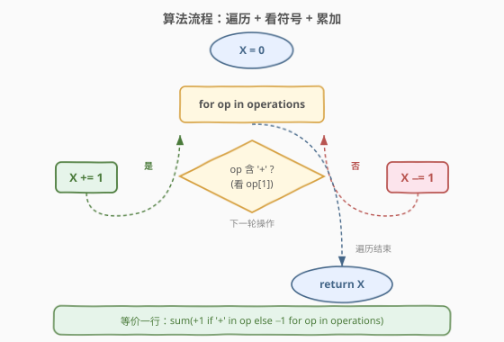

# 执行操作后的变量值

- **题目名称**：执行操作后的变量值
- **链接**：[2011. 执行操作后的变量值](https://leetcode.cn/problems/final-value-of-variable-after-performing-operations/)
- **难度**：简单
- **标签**：数组、字符串、模拟

## 1. 题目概述

存在一种仅支持 4 种操作和 1 个变量 `X` 的编程语言：

- `++X` 和 `X++` 使变量 `X` 的值 **加** `1`
- `--X` 和 `X--` 使变量 `X` 的值 **减** `1`

最初，`X` 的值是 `0`。给你一个字符串数组 `operations`，这是由操作组成的一个列表，返回执行所有操作后，`X` 的 **最终值**。

**示例 1**：

```text
输入：operations = ["--X","X++","X++"]
输出：1
解释：操作按下述步骤执行：
最初，X = 0
--X：X 减 1 ，X =  0 - 1 = -1
X++：X 加 1 ，X = -1 + 1 =  0
X++：X 加 1 ，X =  0 + 1 =  1
```

**示例 2**：

```text
输入：operations = ["++X","++X","X++"]
输出：3
解释：操作按下述步骤执行：
最初，X = 0
++X：X 加 1 ，X = 0 + 1 = 1
++X：X 加 1 ，X = 1 + 1 = 2
X++：X 加 1 ，X = 2 + 1 = 3
```

**示例 3**：

```text
输入：operations = ["X++","++X","--X","X--"]
输出：0
解释：操作按下述步骤执行：
最初，X = 0
X++：X 加 1 ，X = 0 + 1 = 1
++X：X 加 1 ，X = 1 + 1 = 2
--X：X 减 1 ，X = 2 - 1 = 1
X--：X 减 1 ，X = 1 - 1 = 0
```

**约束条件**：

- $1 \le \text{operations.length} \le 100$
- `operations[i]` 将会是 `"++X"`、`"X++"`、`"--X"` 或 `"X--"`

> 💡 操作种类固定为 4 种，且每种操作字符串长度均为 3。这意味着无需真正的「语法解析」——只需区分操作是「加 1」还是「减 1」即可，位置信息（前缀/后缀）对结果没有任何影响。

---

## 2. 解题思路

### 2.1 暴力思路：逐条解析操作字符串

最直观的做法是遍历 `operations`，对每个字符串判断它属于 4 种操作中的哪一种，再相应地 `X += 1` 或 `X -= 1`。判断方式可以是字符串相等比较：

```text
for op in operations:
    if op == "++X" or op == "X++": X += 1
    else:                           X -= 1
```

时间复杂度 $O(n)$，已经是最优。但这种写法把 4 种操作当作「4 个分支」处理，没有利用题目隐藏的对称性——`++X` 与 `X++` 行为完全相同、`--X` 与 `X--` 也完全相同，真正决定结果的只有「符号是 `+` 还是 `-`」。

### 2.2 核心观察：只需看符号字符


关键观察：

- **4 种操作的字符串都恰好包含 2 个相同的符号字符**：`++X` 和 `X++` 含两个 `'+'`；`--X` 和 `X--` 含两个 `'-'`。
- 因此**无需区分前缀/后缀**，只需检测操作中是否含有 `'+'`（或 `'-'`）即可判定加减。
- 进一步地，由于操作字符串长度固定为 3，符号字符必然出现在下标 `0` 或 `1` 处（`++X` 的符号在 `0,1`；`X++` 的符号在 `1,2`）。检查 **`op[1]`** 这一个字符就足以区分所有情况：
  - `op[1] == '+'` → `++X` 或 `X++`（中间位都是 `'+'`）→ `X += 1`
  - `op[1] == '-'` → `--X` 或 `X--`（中间位都是 `'-'`）→ `X -= 1`

> 💡 **为什么看 `op[1]` 一定对？** 4 种操作的第 2 个字符（下标 1）分别是：`++X`→`'+'`、`X++`→`'+'`、`--X`→`'-'`、`X--`→`'-'`。即中间字符与操作加减方向一一对应，无歧义。也可以用 `'+' in op` 更直观但常数略大；用 `op[1]` 最简洁高效。

> ⚠️ 题目保证 `operations[i]` 只会是 4 种合法操作之一，因此无需处理非法输入或边界长度（长度必为 3）。若输入不保证此约束，则需先校验长度再取下标。

### 2.3 算法流程图



流程是一个单层循环：初始化 `X = 0`，遍历每个操作，看 `op[1]` 是 `'+'` 还是 `'-'`，相应 `+1` 或 `−1`，遍历结束返回 `X`。整个算法等价于对操作序列做一次「归约为 ±1 后求和」。

### 2.4 示例演算

以 `operations = ["--X","X++","X++"]` 为例逐步演算：


| 步骤 | 操作 | 符号判定 | X 变化 |
|------|------|----------|--------|
| 初始 | — | — | `0` |
| 1 | `--X` | `op[1]='-'` → 减 1 | `-1` |
| 2 | `X++` | `op[1]='+'` → 加 1 | `0` |
| 3 | `X++` | `op[1]='+'` → 加 1 | `1` |

最终 $X = 0 - 1 + 1 + 1 = 1$，与示例一致。

对照示例 3 `["X++","++X","--X","X--"]`：4 个操作归约为 `[+1, +1, -1, -1]`，求和为 $0$，正好抵消，最终 `X = 0`。这也印证了「只看符号、不看位置」的正确性——两加两减必然归零，与操作顺序无关。

---

## 3. 参考代码

### C++

```cpp
class Solution {
  public:
    int finalValueAfterOperations(vector<string>& operations) {
        int x = 0;
        for (const string& op : operations) {
            if (op[1] == '+') x += 1;   // ++X 或 X++，中间字符必为 '+'
            else              x -= 1;   // --X 或 X--，中间字符必为 '-'
        }
        return x;
    }
};
```

### Python

```python
class Solution:
    def finalValueAfterOperations(self, operations: List[str]) -> int:
        x = 0
        for op in operations:
            if op[1] == '+':   # ++X 或 X++，中间字符必为 '+'
                x += 1
            else:              # --X 或 X--，中间字符必为 '-'
                x -= 1
        return x
```

> 💡 **一行写法**：利用「含 `'+'` 则 `+1` 否则 `−1`」的归约，可直接求和：
>
> ```python
> return sum(1 if '+' in op else -1 for op in operations)
> ```
>
> 这种写法更贴合「归约为 ±1 再求和」的本质，但 `'+' in op` 会扫描整个字符串（长度仅 3，常数可忽略）；若追求极致常数，用 `op[0] == '+'` 或 `op[1] == '+'` 单字符比较更省。

> ⚠️ **避免的写法**：`if op == "++X" or op == "X++"` 虽然正确，但把对称的 4 种操作拆成 4 个分支，冗余且未体现题目本质。面试中若写出此版，可主动提一句「可优化为单字符判定」展示对对称性的洞察。

---

## 4. 复杂度分析

| 维度 | 复杂度 | 说明 |
|------|--------|------|
| 时间复杂度 | $O(n)$ | 遍历一次 `operations`，每次只做一次字符比较与一次加减，总操作数为 $2n$ |
| 空间复杂度 | $O(1)$ | 仅用常数变量 `x`，不随输入规模增长 |

> 💡 本题 $n \le 100$，任何 $O(n)$ 写法都能轻松通过。复杂度优势不体现在「能不能过」，而体现在「写法是否抓住了问题本质」——单字符判定比 4 分支字符串比较更简洁、常数更小，也更便于在面试中讲清「为什么这么做」。

---

## 5. 扩展：从模拟到归约求和

本题可以看作「模拟」与「归约」两种思维的对照：

- **模拟思维**：忠实复现每一步操作，逐条解析字符串、执行加减。正确但啰嗦，把 4 种操作当作 4 个独立分支。
- **归约思维**：观察操作的共同结构（都含 2 个相同符号字符），把 4 种操作归约为 $\pm 1$，问题退化为「对 $\pm 1$ 序列求和」。一行 `sum(...)` 即可解决。

归约思维的威力在于：当操作种类增多时（假设题目扩展为 `++X`、`X++`、`+=2X`、`X-=3` 等），模拟写法的分支数线性增长，而归约写法只需调整「如何从操作提取增量」这一步，主循环（求和）不变。这是「把变化封装在映射里、把稳定留给主流程」的常见设计思路。

> 💡 类比 [162. 寻找峰值](https://leetcode.cn/problems/find-peak-element/) 中「任意峰值都可作为答案」的性质归约、[136. 只出现一次的数字](https://leetcode.cn/problems/single-number/) 中「异或自抵消」的归约，本题的归约点是「符号字符决定一切」。识别这类「看似多分支、实则单一判据」的结构，是简化代码的关键直觉。

---

## 6. 面试要点

1. **为什么看 `op[1]` 就能区分所有操作？**

   - 4 种操作的第 2 个字符（下标 1）分别为 `'+'`、`'+'`、`'-'`、`'-'`，与加减方向一一对应，无歧义。且题目保证操作长度恒为 3，下标 1 必在范围内，无需额外边界检查。

2. **为什么不用 `op == "++X" || op == "X++"` 这种完整字符串比较？**

   - 虽然正确，但把对称的 4 种操作拆成多分支，冗余且未利用「符号决定一切」的洞察。单字符比较 `op[1]` 把 4 分支降为 2 分支，常数更小、代码更短，也更能体现对问题本质的理解。

3. **如果操作种类扩展（如增加 `+=2X`、`X-=3`），算法如何调整？**

   - 主循环（遍历求和）不变，只需把「单字符判定」换成「解析出增量」的映射函数。这体现了归约思维的好处：把变化封装在映射里，主流程稳定。若操作种类很多，可用哈希表 `op → delta` 预处理映射，主循环查表累加。

4. **`'+' in op` 和 `op[1] == '+'` 有区别吗？**

   - 结果上都对。`'+' in op` 会扫描整个字符串（本题长度仅 3，常数可忽略）；`op[1] == '+'` 只比较一个字符，常数最小。在长度更长的变体里，单字符比较更优。本题两种写法的实际运行差异可忽略，选 `op[1]` 主要是代码简洁。

5. **能否用数学方法直接算出答案，不遍历？**

   - 不行。答案取决于「加 1 操作数 − 减 1 操作数」，而这必须通过遍历统计（或等价的哈希计数）才能得到。没有比 $O(n)$ 更优的解法，因为至少要读入全部输入。$O(n)$ 已是下界。

---

## 7. 同类练习题

- [136. 只出现一次的数字](https://leetcode.cn/problems/single-number/)：异或归约，把「找唯一」退化为「全部异或」，同属「识别结构、归约简化」的思路
- [1523. 在区间范围内统计奇数数目](https://leetcode.cn/problems/count-odd-numbers-in-an-interval-range/)：数学归约，把逐个枚举奇数简化为公式 $O(1)$，对照本题的「模拟 vs 归约」
- [258. 各位相加](https://leetcode.cn/problems/add-digits/)：数字根数学归约（数根 = 1 + (n−1) mod 9），把逐位累加循环简化为 $O(1)$ 公式
- [1672. 最富有客户的资产总量](https://leetcode.cn/problems/richest-customer-wealth/)：二维数组求行和再取最大，同属「遍历 + 归约累加」的简单模拟
