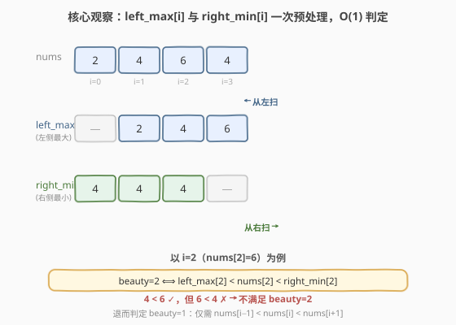
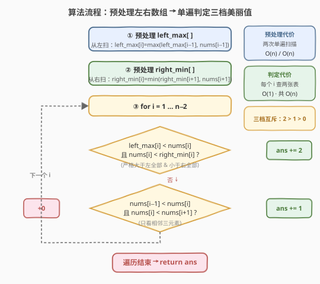

# 数组美丽值求和

- **题目名称**：数组美丽值求和
- **链接**：[2012. 数组美丽值求和](https://leetcode.cn/problems/sum-of-beauty-in-the-array/)
- **难度**：中等
- **标签**：数组、前缀最值、预处理

## 1. 题目概述

给定一个下标从 0 开始的整数数组 `nums`。对于每个下标 `i`（`1 <= i <= nums.length - 2`），`nums[i]` 的**美丽值**等于：

- **2**：对所有 `0 <= j < i` 且 `i < k <= nums.length - 1`，满足 `nums[j] < nums[i] < nums[k]`（即 `nums[i]` 严格大于它**左侧所有**元素，且严格小于它**右侧所有**元素）；
- **1**：若不满足上面的条件，但满足 `nums[i - 1] < nums[i] < nums[i + 1]`（仅看相邻三元素）；
- **0**：上述条件都不满足。

返回符合 `1 <= i <= nums.length - 2` 的所有 `nums[i]` 的美丽值之**总和**。

**示例 1**：

```text
输入：nums = [1,2,3]
输出：2
解释：i=1：nums[1]=2 严格大于左侧 [1]、严格小于右侧 [3] → 美丽值 2。
```

**示例 2**：

```text
输入：nums = [2,4,6,4]
输出：1
解释：
- i=1：nums[1]=4，左侧最大 2 < 4 ✓，但右侧最小 4，4 < 4 ✗ → 非 2 档；
        相邻 2 < 4 < 6 ✓ → 美丽值 1。
- i=2：nums[2]=6，左侧最大 4 < 6 ✓，但右侧最小 4，6 < 4 ✗ → 非 2 档；
        相邻 4 < 6 < 4 ✗ → 美丽值 0。
总和 = 1。
```

**示例 3**：

```text
输入：nums = [3,2,1]
输出：0
解释：i=1：nums[1]=2，左侧最大 3 < 2 ✗ → 非 2 档；相邻 3 < 2 ✗ → 美丽值 0。
```

**约束条件**：

- `3 <= nums.length <= 10^5`
- `1 <= nums[i] <= 10^5`

---

## 2. 解题思路

### 2.1 暴力思路：对每个 i 两侧线性扫描

最直观的做法：对每个 `i ∈ [1, n-2]`，向左扫一遍取最大值、向右扫一遍取最小值，再判断是否满足 `2` 档条件；不满足再查相邻三元素判 `1` 档。

```text
for i in 1..n-2:
    left_max  = max(nums[0..i-1])     # O(i)
    right_min = min(nums[i+1..n-1])   # O(n-i-1)
    if left_max < nums[i] < right_min: ans += 2
    elif nums[i-1] < nums[i] < nums[i+1]: ans += 1
```

时间复杂度 $O(n^2)$。本题 $n \le 10^5$，约 $10^{10}$ 次操作会**超时**。瓶颈在于：每个 `i` 都重复扫描左右两侧，而这些"左侧最大""右侧最小"信息其实可以**一次性预处理**出来，之后每个 `i` 只需 $O(1)$ 查表。

### 2.2 核心观察：前缀最大值 + 后缀最小值，O(1) 判定 2 档



判定 `2` 档需要两个全局信息：

- `nums[i]` **严格大于左侧所有元素** ⟺ `nums[i] > max(nums[0..i-1])`，即 `nums[i] > left_max[i]`；
- `nums[i]` **严格小于右侧所有元素** ⟺ `nums[i] < min(nums[i+1..n-1])`，即 `nums[i] < right_min[i]`。

把这两组信息预处理成两个数组：

- `left_max[i]`：`nums[0..i-1]` 的最大值。可从左向右递推：`left_max[i] = max(left_max[i-1], nums[i-1])`。
- `right_min[i]`：`nums[i+1..n-1]` 的最小值。可从右向左递推：`right_min[i] = min(right_min[i+1], nums[i+1])`。

> 💡 **为什么"严格大于左侧所有"等价于"大于左侧最大"？** 因为 `max` 已经把左侧所有元素压缩成一个代表值——只要 `nums[i]` 比这个代表值大，就一定比左侧每一个都大。这正是前缀最值能把 $O(n)$ 比较降到 $O(1)$ 的本质：**用空间换时间，把"扫描一侧"的结果缓存复用**。与 [238. 除自身以外数组的乘积](https://leetcode.cn/problems/product-of-array-except-self/) 用前缀/后缀乘积如出一辙，只是把"乘积"换成了"最值"。

预处理完成后，每个 `i` 的 `2` 档判定变成两次比较：`left_max[i] < nums[i]` 且 `nums[i] < right_min[i]`。若不满足，再用相邻三元素判 `1` 档（这步本就 $O(1)$）。整个判定阶段降为 $O(n)$。

### 2.3 算法流程图



整体分两阶段：**预处理**（两次单遍扫描得到 `left_max`、`right_min`）+ **判定**（单遍扫 `i = 1…n-2`，按 `2 > 1 > 0` 的优先级查表）。三档条件**互斥**——先判高档 `2`，命中即加分跳过；不命中再判 `1` 档；都不命中默认 `0`。预处理与判定均为 $O(n)$，总计 $O(n)$。

### 2.4 示例演算

![逐步演算 nums=[2,4,6,4]](../images/sobia_example_walkthrough.svg)

以 `nums=[2,4,6,4]` 为例：

- **预处理**：`left_max = [—, 2, 4, 6]`，`right_min = [4, 4, 4, —]`（端点 `—` 表示无左/右元素，不参与判定）。
- **i=1, nums[1]=4**：`left_max[1]=2 < 4` ✓，但 `4 < right_min[1]=4` ✗ → 非 2 档；相邻 `2 < 4 < 6` ✓ → **beauty=1**。
- **i=2, nums[2]=6**：`left_max[2]=4 < 6` ✓，但 `6 < right_min[2]=4` ✗ → 非 2 档；相邻 `4 < 6 < 4` ✗ → **beauty=0**。
- **总和** = 1 + 0 = **1**，与示例一致。

> ⚠️ **注意"严格"二字**：`2` 档要求 `nums[i] < right_min[i]`，是**严格小于**。例 2 中 `nums[1]=4` 与右侧最小值 `4` 相等，`4 < 4` 为假，故不满足 2 档。若误写成 `<=` 会把相等情形判成 2 档导致多加分。

---

## 3. 参考代码

### C++（预处理 + 单遍判定）

```cpp
class Solution {
  public:
    int sumOfBeauties(vector<int>& nums) {
        int n = nums.size();
        vector<int> left_max(n);    // left_max[i] = max(nums[0..i-1])
        vector<int> right_min(n);   // right_min[i] = min(nums[i+1..n-1])

        left_max[0] = INT_MIN;      // i=0 无左侧元素，置极小值不影响判定
        for (int i = 1; i < n; ++i)
            left_max[i] = max(left_max[i - 1], nums[i - 1]);

        right_min[n - 1] = INT_MAX; // i=n-1 无右侧元素
        for (int i = n - 2; i >= 0; --i)
            right_min[i] = min(right_min[i + 1], nums[i + 1]);

        int ans = 0;
        for (int i = 1; i <= n - 2; ++i) {
            if (left_max[i] < nums[i] && nums[i] < right_min[i])
                ans += 2;                       // 严格大于左全部、小于右全部
            else if (nums[i - 1] < nums[i] && nums[i] < nums[i + 1])
                ans += 1;                       // 仅相邻三元素递增
        }
        return ans;
    }
};
```

### Python

```python
class Solution:
    def sumOfBeauties(self, nums: List[int]) -> int:
        n = len(nums)
        left_max = [0] * n
        right_min = [0] * n

        left_max[0] = float("-inf")
        for i in range(1, n):
            left_max[i] = max(left_max[i - 1], nums[i - 1])

        right_min[n - 1] = float("inf")
        for i in range(n - 2, -1, -1):
            right_min[i] = min(right_min[i + 1], nums[i + 1])

        ans = 0
        for i in range(1, n - 1):
            if left_max[i] < nums[i] < right_min[i]:
                ans += 2
            elif nums[i - 1] < nums[i] < nums[i + 1]:
                ans += 1
        return ans
```

> 💡 端点 `left_max[0]`、`right_min[n-1]` 赋极值是"哨兵"思想：让递推边界统一、判定时端点天然不满足 2 档（端点不在 `i ∈ [1, n-2]` 内，本身也不参与判定），代码无需特判。

---

## 4. 复杂度分析

| 维度 | 复杂度 | 说明 |
|------|--------|------|
| 时间复杂度 | $O(n)$ | 三次单遍扫描：预处理 `left_max`、`right_min` 各一遍，判定一遍，每步 $O(1)$ |
| 空间复杂度 | $O(n)$ | 额外两个长度为 $n$ 的辅助数组 `left_max`、`right_min` |

> 💡 空间可优化为 $O(1)$：`right_min` 仍需预存（因为判定从左向右走，而它是后缀信息）；但 `left_max` 可用一个滚动变量 `lm` 边走边更新，省去一个数组。不过 $n \le 10^5$ 下 $O(n)$ 空间完全可接受，保留两个数组更清晰对称。

---

## 5. 扩展：空间优化到 O(1) 的滚动左最大

`left_max` 是前缀信息，判定阶段本就从左向右遍历，可直接用一个变量 `lm` 滚动维护，无需数组：

```cpp
class Solution {
  public:
    int sumOfBeauties(vector<int>& nums) {
        int n = nums.size();
        vector<int> right_min(n); // 仅留后缀最小数组
        right_min[n - 1] = INT_MAX;
        for (int i = n - 2; i >= 0; --i)
            right_min[i] = min(right_min[i + 1], nums[i + 1]);

        int ans = 0, lm = nums[0]; // 滚动左最大，初始为 nums[0]
        for (int i = 1; i <= n - 2; ++i) {
            if (lm < nums[i] && nums[i] < right_min[i])
                ans += 2;
            else if (nums[i - 1] < nums[i] && nums[i] < nums[i + 1])
                ans += 1;
            lm = max(lm, nums[i]); // 进入下一 i 前，把 nums[i] 并入左侧最大
        }
        return ans;
    }
};
```

**两种实现对比**：

| 实现 | 时间 | 空间 | 说明 |
|------|------|------|------|
| 双辅助数组 | $O(n)$ | $O(n)$ | 对称清晰，易读易调试 |
| 滚动左最大 | $O(n)$ | $O(n)$（仅 `right_min`） | 省一个数组；`right_min` 无法滚动因判定方向与之相反 |

> ⚠️ `right_min` 是后缀信息，判定从左向右遍历时无法边走边算（它依赖"尚未到达"的右侧元素），故至少需 $O(n)$ 空间存它。若把判定改成从右向左，则可反过来滚动 `right_min`、留存 `left_max`——方向不影响结论：总有一个前缀/后缀数组必须预存。

---

## 6. 面试要点

1. **为什么暴力 $O(n^2)$ 会超时？预处理如何降到 $O(n)$？**

   - 暴力对每个 `i` 都重新扫描左右两侧求最值，共 $n$ 个 `i`、每次 $O(n)$，总 $O(n^2)$；$n=10^5$ 时约 $10^{10}$ 次操作超时。预处理把"左侧最大""右侧最小"分别用一次从左、一次从右的递推扫描缓存成两个数组，之后每个 `i` 查表 $O(1)$，总计 $O(n)$。

2. **`left_max[i]` 和 `right_min[i]` 的递推边界如何处理？**

   - `left_max[0]` 无左侧元素，置 `INT_MIN`（`-inf`）；`right_min[n-1]` 无右侧元素，置 `INT_MAX`（`+inf`）。这样递推 `left_max[i] = max(left_max[i-1], nums[i-1])` 对 `i=1` 也成立，且端点天然不满足 2 档（端点不在判定区间 `[1, n-2]` 内）。这是哨兵思想，免去特判。

3. **2 档和 1 档的判定顺序能调换吗？为什么必须先判 2 档？**

   - 不能。题目规定 1 档的前提是"**不满足**前面的 2 档条件"。若先判 1 档，一个本该得 2 分的位置可能因满足相邻递增而被误判为 1 分。三档**互斥且优先级递减**：先判最高档，命中即加分并跳过本位，不命中再降级判定。

4. **"严格大于左侧所有"为什么等价于"大于左侧最大"？相等情形怎么处理？**

   - `max` 把左侧所有元素压缩成一个代表值，比代表值大就一定比每一个都大。注意题目要求**严格**：`nums[i] < right_min[i]` 用严格小于，相等不算。例 2 中 `nums[1]=4` 与右侧最小 `4` 相等，`4 < 4` 为假，故不满足 2 档。误写成 `<=` 会导致多加分。

5. **能否把空间优化到 $O(1)$？为什么至少需要一个辅助数组？**

   - `left_max` 可用一个滚动变量 `lm` 边走边更新（判定从左向右，前缀信息可顺带维护），省一个数组。但 `right_min` 是后缀信息，依赖"尚未遍历到"的右侧元素，判定方向与它相反，无法边走边算，必须预存。因此无论如何至少需 $O(n)$ 空间存其中一个。$n \le 10^5$ 下 $O(n)$ 空间完全可接受，工程上优先保证可读性。

---

## 7. 同类练习题

- [238. 除自身以外数组的乘积](https://leetcode.cn/problems/product-of-array-except-self/)：前缀积 + 后缀积，本题把"乘积"换成"最值"的同构母题
- [739. 每日温度](https://leetcode.cn/problems/daily-temperatures/)：右侧下一个更大元素，另一种"利用右侧信息"的预处理（单调栈视角）
- [907. 子数组的最小值之和](https://leetcode.cn/problems/sum-of-subarray-minimums/)：左右两侧最近更小元素预处理，同属"前缀/后缀最值"家族
- [42. 接雨水](https://leetcode.cn/problems/trapping-rain-water/)：左侧最高 + 右侧最高取 min 减自身，本题"左右最值夹击"思想的水位版
