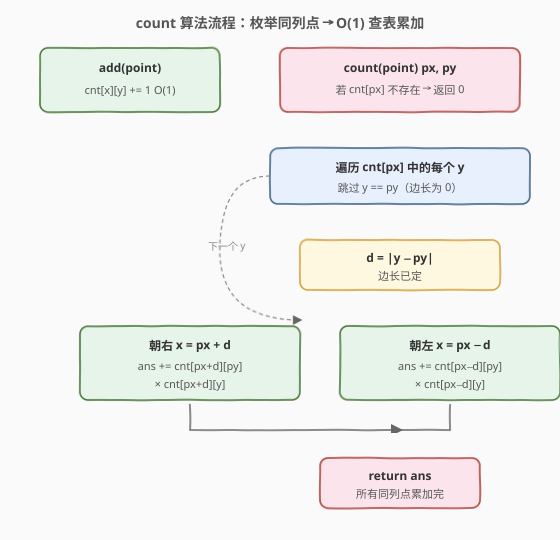

# 检测正方形

- **题目名称**：检测正方形
- **链接**：[2013. 检测正方形](https://leetcode.cn/problems/detect-squares/)
- **难度**：中等
- **标签**：设计、哈希表、计数、几何

## 1. 题目概述

在 X-Y 平面上有一个**点流**，要求设计一个数据结构 `DetectSquares` 支持两类操作：

- `add(point)`：向数据结构中添加一个点 `[x, y]`。**允许重复**——同一坐标可被多次添加，每次都视作不同的点。
- `count(point)`：给定查询点 `[x, y]`，从已添加的点中**选出三个点**，使这三个点与查询点共同构成一个**面积为正的轴对齐正方形**，返回满足该要求的方案数。

**轴对齐正方形**：四条边等长，且每条边都与 x 轴或 y 轴平行/垂直。

**示例 1**：

```text
输入：
["DetectSquares", "add", "add", "add", "count", "count", "add", "count"]
[[], [[3, 10]], [[11, 2]], [[3, 2]], [[11, 10]], [[14, 8]], [[11, 2]], [[11, 10]]]
输出：
[null, null, null, null, 1, 0, null, 2]

解释：
detectSquares.add([3, 10]);   // 点 A
detectSquares.add([11, 2]);   // 点 B
detectSquares.add([3, 2]);    // 点 C
detectSquares.count([11, 10]);// 1 。查询点 D 与 A、B、C 构成正方形 ABCD
detectSquares.count([14, 8]); // 0 。无法构成正方形
detectSquares.add([11, 2]);   // 再次添加 B（重复点）
detectSquares.count([11, 10]);// 2 。可选 {A,B,C} 或 {A,C,B'}
```

**约束条件**：

- `point.length == 2`
- `0 <= x, y <= 1000`
- `add` 与 `count` 的**总调用次数**最多为 `5000`

> 💡 **审题关键**：① 查询点本身**不算**在「三个点」内——它是第四个角；② 重复点视作不同点，因此 `(x, y)` 出现 $k$ 次时，选择它的方案数要乘 $k$；③ 必须**面积为正**，即边长 $> 0$，故与查询点重合的点（同列同行且距离 0）不参与；④「轴对齐」意味着正方形的四条边只可能是水平/垂直方向，对角点与查询点的关系被严格约束（见 2.2）。

---

## 2. 解题思路

### 2.1 暴力思路：每次查询枚举所有三元组

`count` 时从已添加点中任选 3 个，加上查询点共 4 个，判定是否构成轴对齐正方形。设已添加 $n$ 个点，组合数为 $C(n, 3) = O(n^3)$，每次 `count` 都要枚举一遍。

- **正确性**：穷举所有三元组并判定，显然正确。
- **效率**：调用总数上限 $5000$，若 $n$ 接近 $5000$，单次 `count` 约 $10^{11}$ 次操作，**远超时限**。

> ⚠️ 暴力法的浪费在于「把查询点当成普通一角去乱试组合」。事实上，**轴对齐正方形一旦固定一个角，另外三个角的位置就由一条边长唯一确定**——这正是优化突破口。

### 2.2 核心观察：固定查询点为角，枚举同列点定边长


**关键转换**分三步：

**第一步：把查询点 $(p_x, p_y)$ 当作正方形的一个角。** 轴对齐正方形从该角出发有一条水平边和一条垂直边，两条边等长（设为 $d$）。因此另外三个角的位置只有两类可能：

- 以 $(p_x, p_y)$ 为「左下角」：其余角为 $(p_x+d, p_y)$、$(p_x, p_y+d)$、$(p_x+d, p_y+d)$；
- 类似地可作左上 / 右下 / 右上角，本质都是「沿 x 方向偏移 $\pm d$、沿 y 方向偏移 $\pm d$」。

**第二步：用「对角点」统一四种朝向。** 注意到无论查询点是哪个角，**对角点**（与查询点共享正方形对角线的那个点）坐标恒为 $(p_x \pm d, p_y \pm d)$，其中 x、y 两方向的偏移**绝对值相等**（都为 $d$）。换句话说：**对角点与查询点的横纵坐标差绝对值相等**，即 $|x - p_x| = |y - p_y| = d > 0$。

> 💡 **为什么直接枚举对角点不划算？** 对角点散布在整个平面，枚举需遍历所有已添加点（$O(n)$）。但若改枚举**与查询点同列的点**（即 $x = p_x$ 的点），由于「同列点 + 查询点」构成正方形的一条**垂直边**，边长 $d$ 立刻被确定为 $|y - p_y|$，剩下两个角的坐标也随之固定——只需 $O(1)$ 查表即可。

**第三步：枚举同列点，O(1) 查另外两角。** 设与查询点同列的某点为 $(p_x, y)$（$y \ne p_y$），令边长 $d = |y - p_y|$。则正方形的另外两个角在 $x = p_x \pm d$ 处：

- 朝右：$(p_x + d, p_y)$ 与 $(p_x + d, y)$；
- 朝左：$(p_x - d, p_y)$ 与 $(p_x - d, y)$。

方案数 = 这两角各自的点数之积，再对所有同列点 $y$ 求和：

$$
\text{count}(p_x, p_y) = \sum_{y \ne p_y} \Big[ \text{cnt}(p_x{+}d, p_y) \cdot \text{cnt}(p_x{+}d, y) + \text{cnt}(p_x{-}d, p_y) \cdot \text{cnt}(p_x{-}d, y) \Big]
$$

其中 $d = |y - p_y|$，$\text{cnt}(x, y)$ 表示坐标 $(x, y)$ 处已添加的点数（支持重复点）。

> ⚠️ **为何不重不漏？** 每个合法正方形**恰好有一对「同列角」**包含查询点——即查询点与和它同 $x$ 的那个角。枚举所有同列点 $y$ 就等价于枚举所有「查询点参与的正方形」，再分别尝试朝左、朝右两种朝向，覆盖完整且不重复。

### 2.3 算法流程图



**数据结构**：二维哈希表 `cnt[x][y]`，表示坐标 $(x, y)$ 处的点数。`add` 时把 `cnt[x][y]` 加一即可，$O(1)$。

**count 流程**：

1. 取出与查询点同列的所有点 `cnt[p_x]`（一个 `y → 次数` 的映射）。
2. 对其中每个 $y \ne p_y$，算边长 $d = |y - p_y|$（$d = 0$ 跳过，保证面积为正）。
3. 查 $(p_x + d, p_y)$ 与 $(p_x + d, y)$ 的点数，相乘累加；对 $p_x - d$ 同理。
4. 返回累加和。

### 2.4 示例演算

![示例演算：count([11, 10]) = 2](../images/detectsq_walkthrough.svg)

以题目示例逐步演算。添加完 `A(3,10), B(11,2), C(3,2), B'(11,2)` 后，频次表为：

| 坐标 | 次数 |
|------|------|
| (3, 10) | 1 |
| (11, 2) | 2 |
| (3, 2)  | 1 |

查询 `count([11, 10])`，即 $p_x = 11, p_y = 10$：

- **同列点枚举**：`cnt[11]` 中只有 $y = 2$（次数 2），$y \ne 10$。
- 边长 $d = |2 - 10| = 8$。
- 朝左：$x = 11 - 8 = 3$。查 `cnt[3][10] = 1`、`cnt[3][2] = 1`，贡献 $1 \times 1 = 1$。
- 朝右：$x = 11 + 8 = 19$。查 `cnt[19][10] = 0`，贡献 $0$。
- 合计 $1 + 0 = 1$。

**再次 add([11, 2]) 后**（B' 出现第二次，使 `cnt[11][2]` 由 1 变 2），同样的查询：

- 同列点 $y = 2$，次数现为 2，边长 $d = 8$。
- 朝左：`cnt[3][10] = 1`、`cnt[3][2] = 1`，贡献 $1 \times 1 = 1$（与 $y=2$ 这条目的次数 2 相乘反映「同列点的不同副本」选择数）。

> 💡 注意乘法因子的含义：`cnt[p_x][y]` 是**同列点**的副本数（决定「选哪一个同列点」），`cnt[p_x±d][p_y]` 与 `cnt[p_x±d][y]` 是**另外两角**的副本数。三个副本数相乘才是该 $y$、该朝向下的总方案数。最终 $1 \times 1 \times 2 = 2$，与示例输出一致 ✅。

---

## 3. 参考代码

### C++

```cpp
class DetectSquares {
    unordered_map<int, unordered_map<int, int>> cnt; // cnt[x][y] = (x,y) 处的点数
  public:
    DetectSquares() {}

    void add(vector<int> point) {
        int x = point[0], y = point[1];
        cnt[x][y]++;
    }

    int count(vector<int> point) {
        int px = point[0], py = point[1];
        int ans = 0;
        if (!cnt.count(px)) return 0;                 // 同列无点，直接返回 0
        for (auto& [y, ny] : cnt[px]) {              // 枚举同列点 (px, y)
            if (y == py) continue;                   // 跳过查询点自身，保证边长 > 0
            int d = abs(y - py);                     // 边长
            // 朝右：另外两角在 x = px + d
            ans += ny * cnt[px + d][py] * cnt[px + d][y];
            // 朝左：另外两角在 x = px - d
            ans += ny * cnt[px - d][py] * cnt[px - d][y];
        }
        return ans;
    }
};
```

### Python

```python
class DetectSquares:
    def __init__(self):
        self.cnt = defaultdict(lambda: defaultdict(int))  # cnt[x][y] = (x,y) 处的点数

    def add(self, point: List[int]) -> None:
        x, y = point
        self.cnt[x][y] += 1

    def count(self, point: List[int]) -> int:
        px, py = point
        ans = 0
        if px not in self.cnt:                  # 同列无点，直接返回 0
            return 0
        for y, ny in self.cnt[px].items():      # 枚举同列点 (px, y)
            if y == py:
                continue                        # 跳过查询点自身，保证边长 > 0
            d = abs(y - py)                     # 边长
            # 朝右：另外两角在 x = px + d
            ans += ny * self.cnt[px + d][py] * self.cnt[px + d][y]
            # 朝左：另外两角在 x = px - d
            ans += ny * self.cnt[px - d][py] * self.cnt[px - d][y]
        return ans
```

> ⚠️ **跳过 `y == py` 的两种写法等价**：C++ 中 `cnt[px+d][py]` 用 `operator[]` 会在缺失时插入 0（不影响正确性，但会令 `cnt` 略微膨胀）；若想避免插入，可改用 `cnt[px+d].count(py) ? cnt[px+d][py] : 0`。Python 的 `defaultdict` 访问也会插入默认 0，但通常无害。

---

## 4. 复杂度分析

| 维度 | 复杂度 | 说明 |
|------|--------|------|
| `add` 时间 | $O(1)$ | 两次哈希操作 |
| `count` 时间 | $O(n)$ | $n$ 为已添加的**不同坐标**数；最坏枚举所有同列点，每个 $O(1)$ 查表 |
| 空间 | $O(n)$ | 存所有不同坐标的点数，$n \le$ 总调用数 $5000$ |

> 💡 由于坐标范围 $[0, 1000]$，也可用 `int cnt[1001][1001]` 二维数组代替嵌套哈希，常数更小但空间固定 $10^6$。本题调用总数仅 $5000$，哈希表更省空间且足够快。`count` 的实际开销取决于与查询点同列的不同 $y$ 数量，远小于 $n$。

---

## 5. 扩展：查询点不作角的情形？

本题限定查询点必须是正方形的**一个角**（题面「这三个点和查询点一同构成正方形」，结合「轴对齐」语义，约定查询点为四角之一）。若放宽为「查询点可在正方形任意位置（含边上、内部）」，则需额外枚举查询点作为边中点、对角线交点等情形，复杂度显著上升。本题主考「固定一角 + 枚举同列点」这一经典套路，无需扩展。

---

## 6. 面试要点

1. **为什么枚举「同列点」而非「对角点」？**

   - 对角点 $(p_x \pm d, p_y \pm d)$ 要求两方向偏移绝对值相等，散布全平面，枚举需遍历所有点 $O(n)$ 且仍要验证相等性。而同列点 $(p_x, y)$ 与查询点天然共线，**边长 $d = |y - p_y|$ 直接确定**，剩下两角坐标随之固定，每次只需 $O(1)$ 查表。两者总复杂度都是 $O(n)$，但同列点写法更简洁、常数更小。

2. **为什么必须跳过 $y = p_y$？**

   - $y = p_y$ 意味着同列点与查询点重合，边长 $d = 0$，构成「退化正方形」面积为 0。题目要求**面积为正**，必须排除。同时这也避免了把查询点自身算进方案数。

3. **重复点如何被正确计数？**

   - `cnt[x][y]` 存的是 $(x, y)$ 处点的**副本数**。方案数 = 同列点副本数 × 另外两角副本数之积。任一副本数翻倍，方案数即翻倍，符合「重复点视作不同点」的语义。

4. **会不会重复计数同一个正方形？**

   - 不会。每个含查询点的轴对齐正方形**恰有一个**与查询点同 $x$ 的角（即查询点本身外的那个垂直边端点）。枚举所有同列 $y$ 恰好遍历每个正方形一次；朝左/朝右是对不同 $x$ 位置的互斥分支，也不会重叠。

5. **坐标范围 $[0,1000]$ 对实现有什么影响？**

   - 既可用嵌套哈希表（空间 $O(n)$，省内存），也可用 $1001 \times 1001$ 二维数组（空间固定 $10^6$，常数小）。调用总数 $5000$ 时哈希表更优；若调用次数大幅增加且坐标范围仍小，数组实现更快。

---

## 7. 同类练习题

- [2352. 相等行列对](https://leetcode.cn/problems/equal-row-and-column-pairs/)：行列元组哈希计数，同属「坐标/元组 → 频次」设计范式
- [1814. 统计一个数组中好对子的数目](https://leetcode.cn/problems/count-nice-pairs-in-an-array/)：rev(x)−x 归一化后哈希计数，同属「边查边加」计数套路
- [146. LRU 缓存](https://leetcode.cn/problems/lru-cache/)（[题解](../0001-0100/146_LRU缓存.md)）：哈希 + 结构设计经典题，本题的设计题面同源
- [2288. 价格减免](https://leetcode.cn/problems/apply-discount-to-prices/)：字符串模拟设计题，对比本题的数值哈希设计风格
