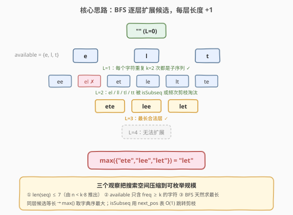
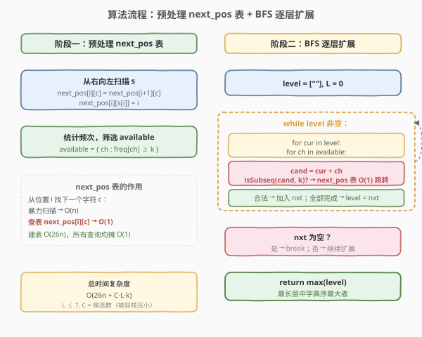
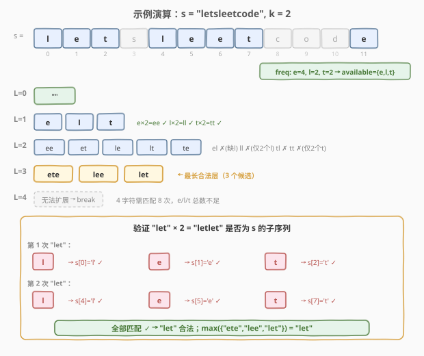

# LeetCode 重复 K 次的最长子序列 题解

## 1. 题目概述

- **标题 / 题号**：重复 K 次的最长子序列（#2014，hard）
- **链接**：https://leetcode.cn/problems/longest-subsequence-repeated-k-times/
- **难度**：困难
- **标签**：字符串、贪心、广度优先搜索、子序列匹配

**题意**：给定长度为 `n` 的字符串 `s` 和整数 `k`，找出 `s` 中**重复 `k` 次的最长子序列** `seq`——即 `seq` 串联 `k` 次（记作 `seq * k`）后仍是 `s` 的子序列。若有多个等长解，返回**字典序最大**的；若不存在，返回空字符串。

> 💡 **子序列**：由原字符串删除若干（或不删除）字符得到，不要求连续，但保持相对顺序。

**示例 1**：

```text
输入：s = "letsleetcode", k = 2
输出："let"
解释："let" 串联 2 次 = "letlet"，是 "letsleetcode" 的子序列：
      l(0) e(1) t(2) l(4) e(5) t(7) ✓
      "ete" 也满足（eteete），但 "let" 字典序更大。
```

**示例 2**：

```text
输入：s = "bb", k = 2
输出："b"
解释："b" * 2 = "bb" 是 "bb" 的子序列；"bb" * 2 = "bbbb" 不是。
```

**示例 3**：

```text
输入：s = "ab", k = 2
输出：""
解释：a、b 各出现 1 次 < k=2，无法组成任何重复 2 次的子序列。
```

**约束**：

- `n == s.length`
- `2 <= k <= 2000`
- `2 <= n < min(2001, k * 8)`
- `s` 由小写英文字母组成

> ⚠️ **关键约束**：`n < k * 8` 意味着 `len(seq) * k <= n < k * 8`，故 `len(seq) <= 7`。这个极小的上界是本题的突破口。

## 2. 解题思路

### 2.1 暴力思路：枚举所有子序列

最朴素的做法是枚举 `s` 的所有子序列，对每个子序列 `seq` 检查 `seq * k` 是否为 `s` 的子序列，在所有合法解中取最长且字典序最大者。

但 `s` 的子序列数量高达 $2^n$（$n$ 可达 2000），完全不可行。必须利用约束条件大幅缩小搜索空间。

### 2.2 核心观察：长度上界 ≤ 7，用 BFS 逐层扩展候选



三个关键观察将搜索空间从指数级压缩到可枚举规模：

**观察 1：候选长度极短。** 由 `n < k * 8` 得 `len(seq) < 8`，即 `seq` 最多 7 个字符。这把搜索树的深度限制在 7 层以内。

**观察 2：可用字符极少。** `seq` 中的每个字符在 `seq * k` 中出现 `k` 次，而 `seq * k` 是 `s` 的子序列，故 `seq` 中的每个字符在 `s` 中至少出现 `k` 次。先统计频次，只保留 `freq[ch] >= k` 的字符作为扩展字母表 `available`——通常不超过 7 个。

**观察 3：BFS 天然求最长。** 广度优先搜索逐层扩展，第 `L` 层的所有候选长度均为 `L`。当某层无法再扩展时，上一层的候选就是最长的合法解。在同一层中取 `max()` 即得字典序最大者。

> 💡 **为什么不用 DFS + 回溯？** DFS 需要维护全局最优解并处理剪枝，而 BFS 逐层推进天然保证「最后到达的层 = 最长长度」，逻辑更清晰。且每层候选数被 `is_subsequence` 检验大幅剪枝，实际规模很小。

### 2.3 算法流程图



整体流程分为两阶段：

1. **预处理**：构建 `next_pos` 表——`next_pos[i][c]` 表示从位置 `i` 开始，字符 `c` 最早出现的位置（不存在则记 `n`）。这张表把子序列匹配中「找下一个字符」从 $O(n)$ 线性扫描降为 $O(1)$ 查表。
2. **BFS 扩展**：从 `level = [""]` 出发，对每个候选 `cur` 尝试追加 `available` 中每个字符 `ch`，用 `next_pos` 表快速检验 `(cur + ch) * k` 是否为 `s` 的子序列。合法者进入下一层。无法扩展时停止，返回最后一层的字典序最大值。

### 2.4 示例演算



以 `s = "letsleetcode", k = 2` 为例：

**预处理**：`available = ['e', 'l', 't']`（频次 e=4, l=2, t=2，均 ≥ 2；s/c/o/d 频次 1 被排除）

| 层 | 候选 | 合法的扩展 | 说明 |
|----|------|-----------|------|
| 0 | `""` | `e`, `l`, `t` | 单字符重复 2 次都是子序列 |
| 1 | `e, l, t` | `ee, et, le, lt, te` | `el` 不合法（"elel" 中第二个 l 无处匹配）；`ll/tl/tt` 被频次剪枝 |
| 2 | `ee, et, le, lt, te` | `ete, lee, let` | `let`×2 = "letlet" 匹配 l(0)e(1)t(2)l(4)e(5)t(7) ✓ |
| 3 | `ete, lee, let` | （无） | 4 字符候选需 8 次匹配，但 e/l/t 总数不足 |
| 4 | — | 停止 | — |

**结果**：第 3 层 `["ete", "lee", "let"]`，`max = "let"` ✓

## 3. 参考代码

### C++（BFS + next_pos 预处理）

```cpp
class Solution {
  public:
    string longestSubsequenceRepeatedK(string s, int k) {
        int n = s.size();
        // next_pos[i][c] = 从位置 i 起字符 c 最早出现的位置，不存在记 n
        vector<vector<int>> next_pos(n + 1, vector<int>(26, n));
        for (int i = n - 1; i >= 0; --i) {
            for (int c = 0; c < 26; ++c)
                next_pos[i][c] = next_pos[i + 1][c];
            next_pos[i][s[i] - 'a'] = i;
        }

        // 检验 cand 重复 k 次后是否为 s 的子序列
        auto isSubseq = [&](const string& cand) -> bool {
            int pos = 0;
            for (int rep = 0; rep < k; ++rep) {
                for (char ch : cand) {
                    int c = ch - 'a';
                    pos = next_pos[pos][c];
                    if (pos == n) return false;
                    ++pos;
                }
            }
            return true;
        };

        // 只保留频次 >= k 的字符
        int freq[26] = {0};
        for (char ch : s) freq[ch - 'a']++;
        string available;
        for (int c = 0; c < 26; ++c)
            if (freq[c] >= k)
                available += char('a' + c);

        // BFS 逐层扩展
        vector<string> level = {""};
        while (true) {
            vector<string> nxt;
            for (const string& cur : level) {
                for (char ch : available) {
                    string cand = cur + ch;
                    if (isSubseq(cand))
                        nxt.push_back(cand);
                }
            }
            if (nxt.empty()) break;
            level = move(nxt);
        }

        // 返回最长层中字典序最大者
        string ans;
        for (const string& s : level)
            if (s > ans) ans = s;
        return ans;
    }
};
```

### Python

```python
class Solution:
    def longestSubsequenceRepeatedK(self, s: str, k: int) -> str:
        n = len(s)
        # next_pos[i][c] = 从位置 i 起字符 c 最早出现的位置，不存在记 n
        next_pos = [[n] * 26 for _ in range(n + 1)]
        for i in range(n - 1, -1, -1):
            for c in range(26):
                next_pos[i][c] = next_pos[i + 1][c]
            next_pos[i][ord(s[i]) - 97] = i

        def is_subseq(cand: str) -> bool:
            pos = 0
            for _ in range(k):
                for ch in cand:
                    c = ord(ch) - 97
                    pos = next_pos[pos][c]
                    if pos == n:
                        return False
                    pos += 1
            return True

        # 只保留频次 >= k 的字符
        from collections import Counter
        freq = Counter(s)
        available = [chr(c) for c in range(97, 123) if freq[chr(c)] >= k]

        # BFS 逐层扩展
        level = [""]
        while level:
            nxt = []
            for cur in level:
                for ch in available:
                    cand = cur + ch
                    if is_subseq(cand):
                        nxt.append(cand)
            if not nxt:
                break
            level = nxt

        return max(level) if level else ""
```

> ⚠️ **子序列检验的写法**：`isSubseq` 直接对 `cand` 重复匹配 `k` 轮（而非先拼接 `cand * k` 再匹配），避免构造长字符串的内存开销。每轮内层循环用 `next_pos` 表 $O(1)$ 跳转，单次检验 $O(|cand| \cdot k)$。

## 4. 复杂度分析

| 维度 | 复杂度 | 说明 |
|------|--------|------|
| 时间复杂度 | $O(n \cdot 26 + C \cdot L \cdot k)$ | 预处理 $O(26n)$；BFS 共 $L \le 7$ 层，每层至多 $C$ 个候选，每次检验 $O(L \cdot k)$；$C$ 受 `available` 大小与子序列约束双重剪枝，实际很小 |
| 空间复杂度 | $O(26n)$ | `next_pos` 表占主要空间；BFS 队列规模 $O(C \cdot L)$，可忽略 |

> 💡 **剪枝强度**：`available` 通常 ≤ 7 个字符，且每层扩展时大量候选因 `isSubseq` 失败被淘汰。最坏情况下第 $L$ 层候选数 $\le |\text{available}|^L$，但子序列约束的剪枝使实际规模远小于此上界。

## 5. 扩展：next_pos 表的其他应用

`next_pos` 表（又称「后继位置表」）是子序列问题的通用预处理工具，适用于**同一字符串上多次子序列查询**的场景：

- **多次模式匹配**：给定一个长字符串和多个短模式，用 `next_pos` 表将每个模式的匹配降到 $O(|pattern|)$。
- **子序列自动机**：`next_pos` 表本质上是一张 DFA 转移表——状态 = 当前位置，输入 = 字符，转移 = 跳到下一个匹配位置。可用于子序列计数、最短超串等问题。
- **编辑距离变体**：当只允许删除操作时，`next_pos` 表可加速 DP 转移。

```python
# 通用模板：判断 t 是否为 s 的子序列
def is_subsequence(s: str, t: str) -> bool:
    n = len(s)
    nxt = [[n] * 26 for _ in range(n + 1)]
    for i in range(n - 1, -1, -1):
        for c in range(26):
            nxt[i][c] = nxt[i + 1][c]
        nxt[i][ord(s[i]) - 97] = i
    pos = 0
    for ch in t:
        pos = nxt[pos][ord(ch) - 97]
        if pos == n:
            return False
        pos += 1
    return True
```

> 💡 若只需**单次**判断子序列，直接用双指针 $O(|s|)$ 即可，不必建表。`next_pos` 表的优势在于**批量查询**时均摊 $O(1)$ 每字符。

## 6. 面试要点

1. **为什么 `len(seq) <= 7`？这个上界从哪个约束推出？**

   - 由 `seq * k` 是 `s` 的子序列得 $|\text{seq}| \cdot k \le n$。又由 `n < k * 8` 得 $|\text{seq}| \cdot k < k \cdot 8$，即 $|\text{seq}| < 8$，故 $|\text{seq}| \le 7$。这个极小上界是 BFS 枚举可行性的基石。

2. **为什么只保留 `freq >= k` 的字符？**

   - `seq` 中每个字符在 `seq * k` 中出现 $k$ 次。`seq * k` 是 `s` 的子序列意味着 `s` 中该字符至少出现 $k$ 次。频次 $< k$ 的字符不可能出现在任何合法 `seq` 中，提前排除可大幅缩小扩展字母表。

3. **BFS 为什么天然得到最长解？如何保证字典序最大？**

   - BFS 逐层扩展，第 $L$ 层所有候选长度均为 $L$。当某层无法扩展（`nxt` 为空）时，上一层就是最长合法候选集合。同层候选等长，Python/C++ 的字符串比较即字典序比较，`max()` 直接取字典序最大者。

4. **`next_pos` 表的作用是什么？不建表会怎样？**

   - `next_pos[i][c]` 把「从位置 $i$ 找下一个字符 $c$」从 $O(n)$ 线性扫描降为 $O(1)$ 查表。不建表则每次 `isSubseq` 检验需 $O(|s|)$，总时间从 $O(C \cdot L \cdot k)$ 退化为 $O(C \cdot L \cdot n)$，在 $n = 2000$ 时可能超时。建表代价 $O(26n)$，一次性付出后所有查询均摊 $O(1)$ 每字符。

5. **如果题目改为求「重复至少 k 次」而非「恰好 k 次」，思路如何调整？**

   - 「恰好 k 次」的定义是 `seq * k` 是子序列（不要求 `seq * (k+1)` 不是）。若改为「至少 k 次」，则只需在 BFS 中检验 `seq * k` 即可——与原题完全一致，因为 `seq * k` 是子序列就保证至少重复 k 次。真正的区别在于「至多 k 次」需要额外验证 `seq * (k+1)` 不是子序列。

## 同类练习题

| # | 题目 | 与本题的关联 |
|---|------|-------------|
| 392 | [判断子序列](https://leetcode.cn/problems/is-subsequence/) | 双指针贪心匹配子序列，本题 `isSubseq` 检验的母题；进阶版也用 `next_pos` 表批量查询 |
| 792 | [匹配子序列的单词数](https://leetcode.cn/problems/number-of-matching-subsequences/) | 多模式子序列匹配，`next_pos` 表的经典应用场景——批量查询时均摊 $O(1)$ 每字符 |
| 1055 | [形成字符串的最短路径](https://leetcode.cn/problems/shortest-way-to-form-string/) | 贪心 + `next_pos` 表求最少子序列拼接次数，同属子序列自动机家族 |
| 727 | [最小窗口子序列](https://leetcode.cn/problems/minimum-window-subsequence/) | 在 `s` 中找包含 `t` 作为子序列的最短连续窗口，`next_pos` 表加速 DP 转移 |
