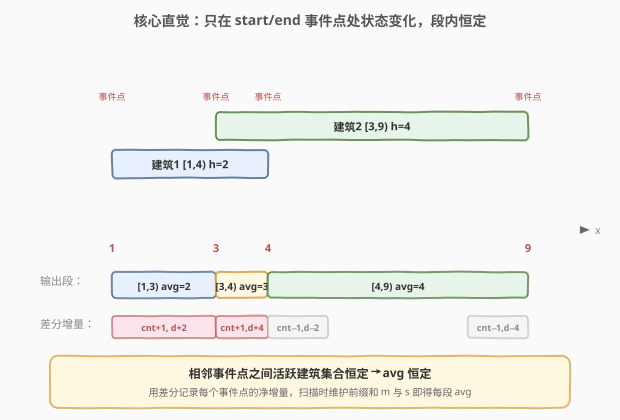
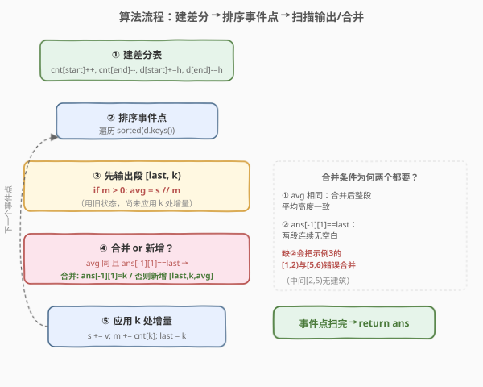

# LeetCode 每段建筑物的平均高度 题解

## 1. 题目概述

- **标题 / 题号**：每段建筑物的平均高度（#2015，medium）
- **链接**：https://leetcode.cn/problems/average-height-of-buildings-in-each-segment/
- **难度**：中等
- **标签**：数组、前缀和、排序、差分

**题意**：一条笔直的街道用数轴表示。街道上有若干建筑物，由二维整数数组 `buildings` 给出，其中 `buildings[i] = [start_i, end_i, height_i]` 表示在**半闭区间** `[start_i, end_i)` 上有一座高度为 `height_i` 的建筑。

要求用**最少**数量的不重叠**段**来描述街道上建筑物的高度，返回二维数组 `street`，其中 `street[j] = [left_j, right_j, average_j]` 描述半闭区间 `[left_j, right_j)`，该段内建筑物的**平均**高度为 `average_j`。

- **平均高度** = 段内所有活跃建筑高度之和 ÷ 活跃建筑数，采用**整数除法**（向下取整）。
- **不含**街道上没有建筑物的区域。
- 相邻段若平均高度相同且**连续**（前段右端 = 后段左端），需合并为一段。
- 输出顺序任意。

**示例 1**：

```text
输入：buildings = [[1,4,2],[3,9,4]]
输出：[[1,3,2],[3,4,3],[4,9,4]]
解释：
- [1,3)：只有第 1 栋建筑，平均高度 = 2 / 1 = 2
- [3,4)：两栋建筑都在，平均高度 = (2+4) / 2 = 3
- [4,9)：只有第 2 栋建筑，平均高度 = 4 / 1 = 4
```

**示例 2**：

```text
输入：buildings = [[1,3,2],[2,5,3],[2,8,3]]
输出：[[1,3,2],[3,8,3]]
解释：
- [1,2)：只有第 1 栋，avg = 2/1 = 2
- [2,3)：三栋都在，avg = (2+3+3)/3 = 2
- [3,5)：第 2、3 栋在，avg = (3+3)/2 = 3
- [5,8)：只有第 3 栋，avg = 3/1 = 3
[1,3) 与 [3,8) 平均高度各自相同且连续，分别合并为两段。
```

**示例 3**：

```text
输入：buildings = [[1,2,1],[5,6,1]]
输出：[[1,2,1],[5,6,1]]
解释：[2,5) 之间没有建筑，形成空白断点，两段不能合并。
```

**约束**：

- `1 <= buildings.length <= 10^5`
- `buildings[i].length == 3`
- `0 <= start_i < end_i <= 10^8`
- `1 <= height_i <= 10^5`

## 2. 解题思路

### 2.1 暴力思路：逐位置扫描

最直观的做法是枚举数轴上每一个整数位置 `p`，统计覆盖 `p` 的建筑数量 `m` 与高度和 `s`，算出 `avg = s / m`（`m > 0` 时），再把相邻同 `avg` 的位置合并成段。

问题在于坐标范围高达 `10^8`，逐位置扫描不可行。但建筑物只有 `10^5` 个，能改变「活跃建筑集合」的位置最多 `2 × 10^5` 个——只有每栋建筑的 `start` 与 `end`。其余位置上活跃集合不变，`avg` 也不变。

### 2.2 核心观察：差分事件点 + 段内不变性



关键观察有两层：

1. **段内不变性**：在任意两个相邻「事件点」之间，活跃建筑的集合、数量 `m`、高度和 `s` 都恒定不变，因此 `avg = s / m` 也恒定。我们只需在事件点处更新状态，每个相邻事件点对 `[last, k)` 就是一个候选段。

2. **差分记录增量**：每栋建筑 `[start, end, height]` 在 `start` 处让「建筑数 +1、高度和 +height」，在 `end` 处让「建筑数 −1、高度和 −height」。用两个哈希表 `cnt`（建筑数增量）和 `d`（高度和增量）记录每个事件点的净变化，扫描时维护前缀和即可得到任意位置的 `m` 与 `s`。

> 💡 **为什么是半闭区间 `[start, end)`？** 这正好契合差分的"左加右减"：`start` 处加 1 表示建筑从 `start` 开始活跃，`end` 处减 1 表示建筑在 `end` 处停止活跃（`end` 本身不再被覆盖）。差分的边界语义与半闭区间天然一致，无需额外偏移。

> ⚠️ **输出段 vs 更新状态的顺序**：扫描到事件点 `k` 时，`[last, k)` 这段的 `m`、`s` 是**上一段的状态**（尚未应用 `k` 处的增量）。因此必须**先用当前 `m/s` 输出段 `[last, k)`，再应用 `k` 处的增量**更新到下一段的状态。顺序颠倒会导致段的边界与平均值错位。

### 2.3 算法流程图



整体是「建差分 → 排序事件点 → 扫描维护前缀和 → 输出/合并段」四步。其中**合并条件**是精髓：只有当新段与上一段**平均高度相同**且**右端衔接**（`ans[-1][1] == last`）时才合并，保证不跨越无建筑的空白区。

### 2.4 示例演算

![示例 1 演算：buildings=[[1,4,2],[3,9,4]]](../images/ahob_example_walkthrough.svg)

以 `buildings = [[1,4,2],[3,9,4]]` 为例：

- **建差分**：`cnt={1:+1, 3:+1, 4:−1, 9:−1}`，`d={1:+2, 3:+4, 4:−2, 9:−4}`。
- **排序事件点**：`[1, 3, 4, 9]`。
- **扫描**（`last=-1, s=0, m=0`）：
  - **k=1**：`m=0` 跳过输出。应用增量 → `s=2, m=1`。`last=1`。
  - **k=3**：`m=1>0`，`avg=2//1=2`。`ans` 空 → 新增 `[1,3,2]`。应用增量 → `s=6, m=2`。`last=3`。
  - **k=4**：`m=2>0`，`avg=6//2=3`。与上段 `avg=2` 不同 → 新增 `[3,4,3]`。应用增量 → `s=4, m=1`。`last=4`。
  - **k=9**：`m=1>0`，`avg=4//1=4`。与上段 `avg=3` 不同 → 新增 `[4,9,4]`。应用增量 → `s=0, m=0`。`last=9`。
- **结果**：`[[1,3,2],[3,4,3],[4,9,4]]` ✅

## 3. 参考代码

### C++（差分 + 有序 map 扫描）

```cpp
class Solution {
  public:
    vector<vector<int>> averageHeightOfBuildings(vector<vector<int>>& buildings) {
        unordered_map<int, int> cnt; // 位置 -> 建筑数增量
        map<int, int> d;             // 位置 -> 高度和增量（map 自动按 key 排序）

        for (const auto& e : buildings) {
            int start = e[0], end = e[1], height = e[2];
            cnt[start]++;
            cnt[end]--;
            d[start] += height;
            d[end] -= height;
        }

        int s = 0, m = 0;   // 当前段的高度和 / 活跃建筑数
        int last = -1;
        vector<vector<int>> ans;

        for (const auto& [k, v] : d) {
            if (m > 0) {                                 // 先用旧状态输出段 [last, k)
                int avg = s / m;
                if (!ans.empty() && ans.back()[2] == avg && ans.back()[1] == last) {
                    ans.back()[1] = k;                   // 平均高度相同且衔接 → 合并
                } else {
                    ans.push_back({last, k, avg});
                }
            }
            s += v;            // 再应用 k 处增量，进入下一段
            m += cnt[k];
            last = k;
        }
        return ans;
    }
};
```

### Python

```python
class Solution:
    def averageHeightOfBuildings(self, buildings: List[List[int]]) -> List[List[int]]:
        cnt = defaultdict(int)  # 位置 -> 建筑数增量
        d = defaultdict(int)    # 位置 -> 高度和增量
        for start, end, height in buildings:
            cnt[start] += 1
            cnt[end] -= 1
            d[start] += height
            d[end] -= height

        s = m = 0    # 当前段的高度和 / 活跃建筑数
        last = -1
        ans = []
        for k, v in sorted(d.items()):
            if m > 0:                                    # 先用旧状态输出段 [last, k)
                avg = s // m
                if ans and ans[-1][2] == avg and ans[-1][1] == last:
                    ans[-1][1] = k                       # 平均高度相同且衔接 → 合并
                else:
                    ans.append([last, k, avg])
            s += v            # 再应用 k 处增量，进入下一段
            m += cnt[k]
            last = k
        return ans
```

> ⚠️ **三个易错点**：
> 1. **先输出后更新**：`if (m > 0)` 分支必须在 `s += v; m += cnt[k]` **之前**，否则会把 `k` 处的增量错误地算进 `[last, k)` 段。
> 2. **合并需同时满足两条件**：`avg` 相同 **且** `ans.back()[1] == last`（前段右端 = 当前段左端）。缺第二个条件会把被空白隔开的同 `avg` 段错误合并（如示例 3）。
> 3. **`m > 0` 才输出**：`m == 0` 表示该段无建筑，跳过不输出，自然形成空白断点。

## 4. 复杂度分析

| 维度 | 复杂度 | 说明 |
|------|--------|------|
| 时间复杂度 | $O(n \log n)$ | 事件点最多 $2n$ 个，排序主导；扫描 $O(n)$ |
| 空间复杂度 | $O(n)$ | 两个哈希表 / 有序 map 各存至多 $2n$ 个事件点 |

> 💡 C++ 用 `std::map` 可省去单独排序（插入即有序，$O(n \log n)$）；Python 用 `defaultdict` + `sorted()` 显式排序，常数更小。坐标虽达 $10^8$，但用哈希表/有序 map 只存事件点，不随坐标范围增长。

## 5. 扩展：扫描线视角与同步事件处理

本题本质是**扫描线（sweep line）**的经典应用：把每栋建筑拆成 `start` 处的「+事件」与 `end` 处的「−事件」，按坐标排序后从左到右扫描，维护活跃集合的聚合量（这里是计数 `m` 与高度和 `s`）。

一个值得注意的边界情形：**同一位置同时发生多个事件**（某建筑结束、另一建筑开始）。由于差分把同位置的所有增量累加到同一键，扫描时一次性应用净增量，`[last, k)` 段用的是变化前的状态、`[k, next)` 段用的是变化后的状态——半闭区间的语义天然正确，无需像闭区间那样纠结「先加后减还是先减后加」的顺序。

> 💡 **对比 [56. 合并区间](../0001-0100/56_合并区间.md)**：56 题只关心「是否重叠」做并集，而本题关心「重叠后建筑集合的聚合量（平均高度）」，且要在聚合量不变时进一步合并相邻段——是区间合并的"带权增量版"。

## 6. 面试要点

1. **为什么不用差分数组（数组下标法）而用哈希表/有序 map？**

   - 坐标范围高达 $10^8$，开数组会爆内存。建筑物只有 $10^5$ 个，事件点至多 $2 \times 10^5$ 个，用哈希表只存"有变化的位置"，空间 $O(n)$。这是**稀疏差分**的典型用法。

2. **为什么扫描时"先输出段，再应用增量"？**

   - 事件点 `k` 处的增量描述的是"从 `k` 开始的新状态"，而 `[last, k)` 段的状态是增量**应用前**的旧状态。若先应用增量再输出，会把 `k` 处的变化错误计入 `[last, k)` 段，导致段边界和平均值都错位。

3. **合并条件为什么需要两个（`avg` 相同且 `ans[-1][1] == last`）？**

   - `avg` 相同保证合并后整段平均高度一致；`ans[-1][1] == last` 保证两段**连续无空白**。示例 3 中 `[1,2)` 与 `[5,6)` 虽 `avg` 都是 1，但中间 `[2,5)` 无建筑形成断点，不能合并——只判 `avg` 会把断点吞掉。

4. **同一位置同时有建筑开始和结束，顺序会影响结果吗？**

   - 不会。差分把同位置所有增量累加成净变化，一次性应用。`[last, k)` 段用旧状态、`[k, next)` 段用新状态，半闭区间 `[start, end)` 的语义保证 `end` 处建筑已不活跃、`start` 处建筑已活跃，无需排序事件先后。

5. **如果要求平均高度保留小数（非整数除法），算法需要改动吗？**

   - 主体逻辑不变，只是 `avg` 改用浮点除法、输出类型改为浮点。但**合并条件**会受影响：浮点相等比较需引入误差阈值 $\varepsilon$（`abs(a-b) < 1e-9`），否则因舍入误差本应合并的段可能被拆开。

## 同类练习题

| # | 题目 | 与本题的关联 |
|---|------|-------------|
| 1109 | [航班预订统计](https://leetcode.cn/problems/corporate-flight-bookings/)（[题解](../1101-1200/1109_航班预订统计.md)） | 差分模板母题，"左加右减 + 前缀和还原"，本题差分思想的基础 |
| 1094 | [拼车](https://leetcode.cn/problems/car-pooling/)（[题解](../1001-1100/1094_拼车.md)） | 差分 + 事件扫描判定容量，同属"稀疏差分扫描"家族 |
| 1854 | [人口最多的年份](https://leetcode.cn/problems/maximum-population-year/)（[题解](../1801-1900/1854_人口最多的年份.md)） | 差分事件扫描求最大值，本题求分段平均值，同为"区间→事件点"转换 |
| 732 | [我的日程安排表 III](https://leetcode.cn/problems/my-calendar-iii/)（[题解](../0701-0800/732_我的日程安排表III.md)） | 有序 map 维护差分事件求最大重叠数，本题维护计数与加权和两个聚合量 |
| 56 | [合并区间](https://leetcode.cn/problems/merge-intervals/)（[题解](../0001-0100/56_合并区间.md)） | 区间合并基础题，本题在其上增加"带权聚合 + 同值合并"维度 |
