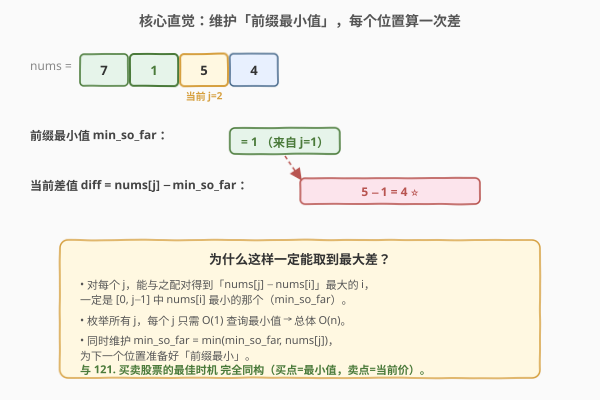
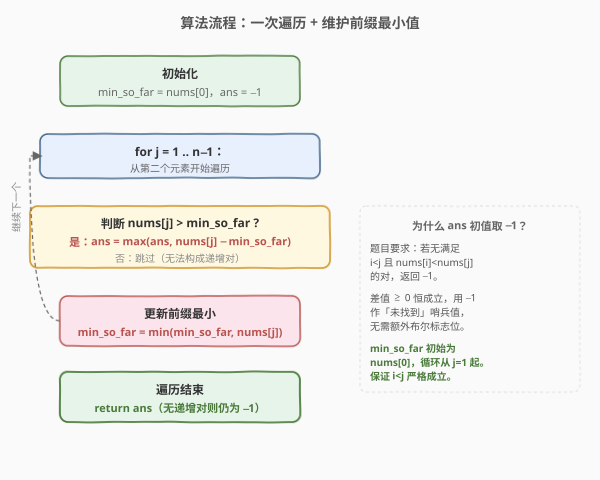

# LeetCode 增量元素之间的最大差值 题解

## 1. 题目概述

- **标题 / 题号**：增量元素之间的最大差值（#2016，easy）
- **链接**：https://leetcode.cn/problems/maximum-difference-between-increasing-elements/
- **难度**：简单
- **标签**：数组、一次遍历、维护前缀最小值

**题意**：给定一个下标从 0 开始的整数数组 `nums`，找出满足 `i < j` 且 `nums[i] < nums[j]` 的**最大差值** `nums[j] - nums[i]`。若不存在这样的 `(i, j)` 对，则返回 `-1`。

**示例 1**：

```text
输入：nums = [7,1,5,4]
输出：4
解释：最大差值出现在 i = 1（nums[i] = 1）和 j = 2（nums[j] = 5），5 - 1 = 4。
```

**示例 2**：

```text
输入：nums = [9,4,3,2]
输出：-1
解释：数组单调递减，不存在满足 nums[i] < nums[j] 的对。
```

**示例 3**：

```text
输入：nums = [1,5,2,10]
输出：9
解释：最大差值出现在 i = 0（nums[i] = 1）和 j = 3（nums[j] = 10），10 - 1 = 9。
```

**约束**：

- `n == nums.length`
- `2 <= n <= 1000`
- `1 <= nums[i] <= 10^9`

## 2. 解题思路

### 2.1 暴力思路：两层循环枚举所有数对

最直观的做法是用两层循环枚举所有 `(i, j)` 数对（`i < j`），逐个判断 `nums[i] < nums[j]`，命中则用 `nums[j] - nums[i]` 更新最大差值。

```text
for i in 0..n-1:
    for j in i+1..n-1:
        if nums[i] < nums[j]:
            ans = max(ans, nums[j] - nums[i])
```

时间复杂度 $O(n^2)$。本题 `n ≤ 1000`，约 $10^6$ 次操作能通过，但忽略了题目结构——**对每个 `j`，能与它配出最大差值的 `i` 一定是 `[0, j-1]` 中 `nums[i]` 最小的那个**。一旦想清楚这点，就能把内层"找最小值"从 $O(n)$ 降为 $O(1)$。

### 2.2 核心观察：维护「前缀最小值」，每个位置算一次差



关键直觉：把 `nums[j] - nums[i]` 拆成"被减数 `nums[j]` 固定 + 减数 `nums[i]` 越小越好"。对每个位置 `j`，能与之配对得到最大差的 `i` 必然是 `[0, j-1]` 中的最小值，记为 `min_so_far`。

于是只需一次遍历：

- 维护 `min_so_far` = 当前位置**之前**所有元素的最小值（初始为 `nums[0]`）。
- 对每个 `j`（从 1 起），若 `nums[j] > min_so_far`，则 `diff = nums[j] - min_so_far` 是以 `j` 为"卖出点"能拿到的最大差，用它更新 `ans`。
- 随后 `min_so_far = min(min_so_far, nums[j])`，为下一个位置准备好前缀最小。

> 💡 **为什么这样一定取到全局最大差？** 对任意最优解 `(i*, j*)`，当遍历到 `j*` 时，`min_so_far ≤ nums[i*]`（因为 `min_so_far` 是 `[0, j*-1]` 的最小值），因此 `nums[j*] - min_so_far ≥ nums[j*] - nums[i*]`，即"用 `min_so_far` 当减数"得到的差**至少不劣于**真正的最优配对。又因为所有 `j` 都被枚举过，全局最大差必然在某一步被捕获。

> 💡 **与 [121. 买卖股票的最佳时机](https://leetcode.cn/problems/best-time-to-buy-and-stock/) 完全同构**：`nums[i]` 即"买入价"，`nums[j]` 即"卖出价"，`min_so_far` 即"到目前为止的最低买入价"，`nums[j] - min_so_far` 即"今天卖出的利润"。本题就是披着"找差值"外衣的买卖股票。

### 2.3 算法流程图



整个流程是单层循环：判断递增 → 算差更新答案 → 更新前缀最小。每个元素只查一次、更新一次，总时间 $O(n)$。注意 `min_so_far` 初始为 `nums[0]`、循环从 `j=1` 起，天然保证 `i < j` 严格成立；`ans` 初值取 `-1` 作"未找到"哨兵，因差值恒 `≥ 0`，不会与合法答案冲突。

### 2.4 示例演算

![逐步演算 nums=[7,1,5,4]](../images/mdie_example_walkthrough.svg)

以 `nums=[7,1,5,4]` 为例逐步演算：

- **j=0, nums[0]=7**：初始化 `min_so_far=7`，`ans=-1`。
- **j=1, nums[1]=1**：`min_so_far=7`，`1 - 7 = -6 ≤ 0`，跳过。更新 `min_so_far = min(7, 1) = 1`。`ans=-1`。
- **j=2, nums[2]=5**：`min_so_far=1`，`5 - 1 = 4 > 0` ⭐，更新 `ans=4`。`min_so_far` 不变（`5 > 1`）。`ans=4`。
- **j=3, nums[3]=4**：`min_so_far=1`，`4 - 1 = 3 < ans=4`，不更新。`ans=4`。

最终 `ans=4`，对应配对 `i=1, j=2`。

## 3. 参考代码

### C++（一次遍历维护前缀最小）

```cpp
class Solution {
  public:
    int maximumDifference(vector<int>& nums) {
        int min_so_far = nums[0];
        int ans = -1;
        for (int j = 1; j < (int)nums.size(); ++j) {
            if (nums[j] > min_so_far) {
                ans = max(ans, nums[j] - min_so_far);
            }
            min_so_far = min(min_so_far, nums[j]);
        }
        return ans;
    }
};
```

### Python

```python
class Solution:
    def maximumDifference(self, nums: List[int]) -> int:
        min_so_far = nums[0]
        ans = -1
        for j in range(1, len(nums)):
            if nums[j] > min_so_far:
                ans = max(ans, nums[j] - min_so_far)
            min_so_far = min(min_so_far, nums[j])
        return ans
```

> ⚠️ **顺序无关性**：本题 `ans` 更新（用旧 `min_so_far`）与 `min_so_far` 更新可以放在同一轮，且先后顺序不影响正确性——因为只要 `nums[j]` 大于旧 `min_so_far` 就该计入差值；若 `nums[j]` 更小，它不能当"卖出点"但会让 `min_so_far` 变小。把"算差"放在"更新 min"之前更直观：先以当前 `nums[j]` 为卖出点算差，再把它纳入前缀最小的候选。

## 4. 复杂度分析

| 维度 | 复杂度 | 说明 |
|------|--------|------|
| 时间复杂度 | $O(n)$ | 遍历一次数组，每步仅 $O(1)$ 的比较与赋值 |
| 空间复杂度 | $O(1)$ | 只用 `min_so_far`、`ans` 两个额外变量 |

> 💡 相比暴力 $O(n^2)$，关键在于把"对每个 `j` 找最优 `i`"这一步从"重新扫描前缀"优化为"复用上一轮的 `min_so_far`"——典型的**用空间换时间 + 增量维护**思想。

## 5. 扩展：与买卖股票家族的对照

本题与 [121. 买卖股票的最佳时机](https://leetcode.cn/problems/best-time-to-buy-and-sell-stock/) 是同一道题的两种表述。把买卖股票系列放在一起看，能快速定位每题的增量：

| 题号 | 题目 | 与本题的差异 | 套路增量 |
|------|------|--------------|----------|
| 2016 | 增量元素之间的最大差值 | — | 维护前缀最小值（母题） |
| 121 | 买卖股票的最佳时机 | 完全同构 | 同一模板，换叙述 |
| 122 | 买卖股票的最佳时机 II | 允许多次买卖 | 贪心：累加所有上升段 `max(0, nums[j]-nums[j-1])` |
| 123 | 买卖股票的最佳时机 III | 至多 2 次交易 | 状态机 DP：4 个状态轮转 |
| 188 | 买卖股票的最佳时机 IV | 至多 k 次交易 | 状态机 DP 泛化到 k 维 |
| 714 | 买卖股票的最佳时机含手续费 | 每笔交易扣手续费 | 状态机 DP + 卖出时减手续费 |

> 💡 买卖股票系列是经典的"**同一模型逐层加约束**"训练：从单次（121/2016）到多次（122）再到限次 + 附加成本（123/188/714）。先吃透 2016 这版最简形态，后续题只需在状态转移里"加一维"。

## 6. 面试要点

1. **为什么对每个 `j`，最优的 `i` 一定是前缀最小值？**

   - 因为 `nums[j]` 固定，要最大化 `nums[j] - nums[i]` 等价于最小化 `nums[i]`。在 `i ∈ [0, j-1]` 范围内，`nums[i]` 的最小值即 `min_so_far`，用它与 `nums[j]` 配对得到的差是以 `j` 为右端点能取到的最大值。

2. **`ans` 初值为什么取 `-1` 而不是 `0`？**

   - 合法的差值 `nums[j] - nums[i]` 在 `nums[i] < nums[j]` 时严格大于 0，故 0 不会是合法答案；但若数组单调递减（示例 2），不存在递增对，需返回 `-1`。用 `-1` 作"未找到"哨兵最契合题意。若用 `0` 作初值则无法区分"差值恰为 0"与"未找到"（虽然本题差值不可能为 0，但 `-1` 更稳健）。

3. **为什么"算差"和"更新 `min_so_far`"的先后顺序不影响正确性？**

   - 算差用的是"当前 `j` 之前"的最小值，而 `nums[j]` 自身能否进入 `min_so_far` 取决于它和旧 `min_so_far` 的大小比较。若 `nums[j] > min_so_far`，算差时用旧 `min_so_far` 正确，且 `nums[j]` 不会更新 `min_so_far`；若 `nums[j] ≤ min_so_far`，算差结果 `≤ 0` 不计入，之后 `min_so_far` 更新为 `nums[j]`。两条分支互不干扰，先后顺序无影响。但习惯上"先算差再更新 min"更符合"先以 j 为卖出点，再让它进入买入候选"的语义。

4. **如果允许 `i == j`（即同一元素自差），算法要怎么改？**

   - 题目要求 `i < j` 严格小于，所以 `min_so_far` 初始化为 `nums[0]` 且循环从 `j=1` 起。若放宽到 `i ≤ j`，只需让 `min_so_far` 在算差之前先与 `nums[j]` 比较更新一次——但差值恒 `≥ 0`，最大差必然出现在 `i < j` 的合法对上（除非整个数组每个元素都自成一组），所以题目这样约束既保留了"找递增对"的语义，又避免了 `i == j` 退化为 0 的平凡情况。

5. **这个"维护前缀最值"的套路还能用在哪里？**

   - 凡是"对每个位置找前缀中满足某条件的元素"型问题都可套用：前缀最大值（求最大递减差）、前缀第二大值、前缀和（区间和查询）、前缀最大下标等。本质是**用 $O(1)$ 增量更新代替 $O(n)$ 重新扫描**，是降低复杂度的通用武器。

## 同类练习题

| # | 题目 | 与本题的关联 |
|---|------|-------------|
| 121 | [买卖股票的最佳时机](https://leetcode.cn/problems/best-time-to-buy-and-sell-stock/) | 与本题完全同构，"买入价/卖出价"换皮版，同一套维护前缀最小模板 |
| 122 | [买卖股票的最佳时机 II](https://leetcode.cn/problems/best-time-to-buy-and-sell-stock-ii/) | 允许多次买卖，贪心累加所有上升段，从"单次最大差"进阶到"多次累加差" |
| 53 | [最大子数组和](https://leetcode.cn/problems/maximum-subarray/) | 同样"一次遍历 + 增量维护"思想，维护的是"以当前位置结尾的最大子段和"而非前缀最小 |
| 739 | [每日温度](https://leetcode.cn/problems/daily-temperatures/) | 对每个位置往后找首个更大值，对照本题"往前找最小值"，方向相反但同属"配对型"问题（本题可用单调栈，也可用前缀最小） |
| 2865 | [美丽塔 I](https://leetcode.cn/problems/beautiful-towers-i/) | 对每个位置作峰顶，需快速算左右两侧"受山型限制的最小前缀和"，前缀最值维护的进阶应用 |
