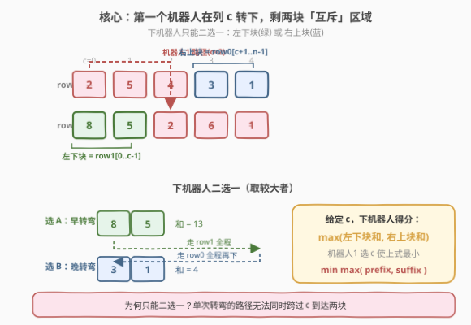
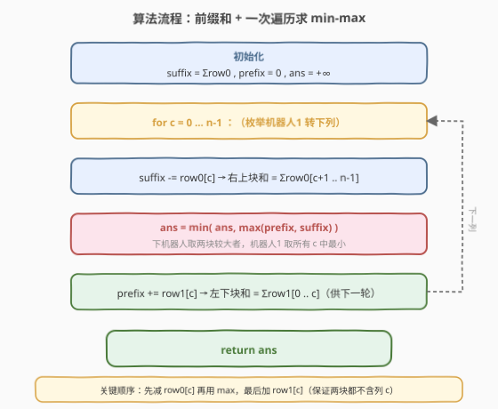
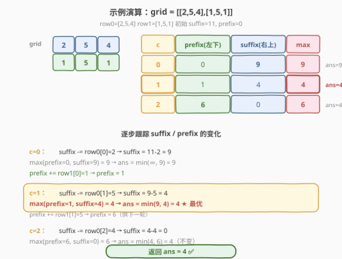

# LeetCode 网格游戏 题解

## 1. 题目概述

- **标题 / 题号**：网格游戏（#2017，medium）
- **链接**：https://leetcode.cn/problems/grid-game/
- **难度**：中等
- **标签**：数组、前缀和、贪心、博弈

**题意**：给定一个 $2 \times n$ 的网格 `grid`，两个机器人都要从 $(0,0)$ 走到 $(1,n-1)$，每步只能**向右**或**向下**。

- **第一个机器人**先走，收集路径上所有点数，途经的格子随后**重置为 0**。
- **第二个机器人**后走，在被清零后的网格上收集点数。
- 第一个机器人想让第二个机器人**得分最小**；第二个机器人想让自己**得分最大**。双方都发挥最佳水平。

返回**第二个机器人**最终收集到的点数。

**示例 1**：

```text
输入：grid = [[2,5,4],[1,5,1]]
输出：4
解释：第一个机器人按列 c=1 转下（走 2→5→下→5→1），清零后第二个机器人最多只能拿到 4。
```

**示例 2**：

```text
输入：grid = [[3,3,1],[8,5,2]]
输出：4
```

**示例 3**：

```text
输入：grid = [[1,3,1,15],[1,3,3,1]]
输出：7
```

**约束**：

- `grid.length == 2`
- `n == grid[r].length`
- $1 \le n \le 5 \times 10^4$
- $1 \le \text{grid}[r][c] \le 10^5$

## 2. 解题思路

### 2.1 暴力思路：枚举两条路径

最直观的做法是枚举第一个机器人的所有可能路径（即转下列 `c`，共 $n$ 种），对每种情况模拟清零，再枚举第二个机器人的所有路径取最大值，最后在所有 `c` 中取最小。两层枚举加上模拟，时间 $O(n^2)$，$n = 5\times 10^4$ 时约 $2.5 \times 10^9$ 次操作，会超时。

突破口在于：**两个机器人的路径形状是固定的**——都是「在 row0 向右走若干步、在某列向下、再在 row1 向右走到终点」。因此第一个机器人的策略完全由**一个转下列 $c$** 决定，第二个机器人亦然。把路径参数化后，可以消去第二层枚举。

### 2.2 核心观察：转下列决定两块「互斥」区域



第一个机器人转下列为 $c$ 时，它走过了 **row0 的 $[0..c]$** 和 **row1 的 $[c..n-1]$**，这些格子全部清零。剩下的非零格子恰好分成两块：

- **左下块**：row1 的 $[0..c-1]$（转下列左侧、第二行）
- **右上块**：row0 的 $[c+1..n-1]$（转下列右侧、第一行）

> 💡 **为什么第二个机器人只能二选一？** 它的路径只有一次「向下」转弯。若在 $\le c$ 处转弯，能吃到左下块（row1 上 $c$ 左侧的部分），但无法回到 row0 去 $c$ 右侧；若在 $> c$ 处转弯，能吃到右上块，但已离开 row1 无法回头拿左下块。**单次转弯的路径结构决定了两块互斥**——要么全取左下，要么全取右上。

要最大化得分，第二个机器人必然整块取走：

- 取左下块：在 $c'=0$ 处直接转弯，走完 row1 全程，拿到 $\sum \text{row1}[0..c-1]$。
- 取右上块：在 $c'=n-1$ 处才转弯，走完 row0 全程再下，拿到 $\sum \text{row0}[c+1..n-1]$。

因此给定 $c$，第二个机器人得分为：

$$\text{score}(c) = \max\Big(\underbrace{\sum_{i=0}^{c-1}\text{row1}[i]}_{\text{左下块 prefix}},\ \underbrace{\sum_{i=c+1}^{n-1}\text{row0}[i]}_{\text{右上块 suffix}}\Big)$$

第一个机器人要选 $c$ 使 $\text{score}(c)$ 最小：

$$\text{ans} = \min_{c=0}^{n-1} \text{score}(c) = \min_{c=0}^{n-1} \max\big(\text{prefix}(c),\ \text{suffix}(c)\big)$$

这是经典的 **min-max（最小化最大值）** 模型：随着 $c$ 增大，左下块 prefix 单调递增、右上块 suffix 单调递减，两条曲线的「较低交点」即为答案。

### 2.3 算法流程图



用前缀和 / 后缀和把每步求和降到 $O(1)$：

- `suffix` 初始化为 $\sum \text{row0}$，代表「row0 还未消耗的右侧总和」。
- `prefix` 初始化为 $0$，代表「row1 已积累的左侧总和」。
- 遍历 $c = 0 \dots n-1$：先把 $\text{row0}[c]$ 从 `suffix` 减掉（第一个机器人在 $c$ 转下会吃掉 row0 的 $[0..c]$，于是右上块缩减为 $[c+1..]$）；再用 $\max(\text{prefix}, \text{suffix})$ 更新答案；最后把 $\text{row1}[c]$ 加进 `prefix`（供下一列的左下块使用）。

> ⚠️ **顺序很重要**：必须「先减 row0[c]、再取 max、最后加 row1[c]」。这样在计算 $\max$ 时，prefix 对应 $[0..c-1]$、suffix 对应 $[c+1..n-1]$，两块都不含被清零的列 $c$，与公式严格一致。若颠倒加减顺序，会把本应清零的 $\text{row0}[c]$ 或 $\text{row1}[c]$ 误算入某一块。

### 2.4 示例演算

以 `grid = [[2,5,4],[1,5,1]]` 为例（row0=[2,5,4], row1=[1,5,1]，初始 `suffix=11, prefix=0`）：



| c | prefix（左下 $\sum$row1[0..c-1]） | suffix（右上 $\sum$row0[c+1..]） | max | ans |
|---|---|---|---|---|
| 0 | 0 | $5+4=9$ | 9 | 9 |
| 1 | 1 | 4 | 4 | **4** ★ |
| 2 | $1+5=6$ | 0 | 6 | 4 |

$c=1$ 时 prefix 与 suffix 最接近（1 与 4），max 取到最小值 4，与示例一致。此后 $c$ 继续增大，prefix 涨到 6 而 suffix 归 0，max 反弹到 6，不会再更优——这正是 min-max 曲线的「V 形」特征。

> 💡 **直觉理解**：第一个机器人若转弯太早（$c$ 小），右上块几乎完整，第二个机器人吃右上块大赚；若转弯太晚（$c$ 大），左下块几乎完整，第二个机器人吃左下块大赚。最优 $c$ 在中间某处，让两块「都不太大」，较大的那个尽可能小。

## 3. 参考代码

### C++

```cpp
class Solution {
  public:
    long long gridGame(vector<vector<int>>& grid) {
        int n = grid[0].size();
        long long suffix = 0; // 右上块和 = Σrow0[c+1 .. n-1]
        for (int x : grid[0]) suffix += x;
        long long prefix = 0; // 左下块和 = Σrow1[0 .. c-1]
        long long ans = LLONG_MAX;
        for (int c = 0; c < n; ++c) {
            suffix -= grid[0][c];          // row0[c] 被第一个机器人吃掉，退出右上块
            ans = min(ans, max(prefix, suffix));
            prefix += grid[1][c];          // row1[c] 进入左下块，供下一轮
        }
        return ans;
    }
};
```

### Python

```python
class Solution:
    def gridGame(self, grid: List[List[int]]) -> int:
        n = len(grid[0])
        suffix = sum(grid[0])   # 右上块和
        prefix = 0              # 左下块和
        ans = float('inf')
        for c in range(n):
            suffix -= grid[0][c]            # row0[c] 被吃掉
            ans = min(ans, max(prefix, suffix))
            prefix += grid[1][c]            # row1[c] 进入左下块
        return ans
```

> ⚠️ **注意用 `long long`**：$n \le 5\times 10^4$、$\text{grid}[r][c] \le 10^5$，前缀和最大约 $5 \times 10^9$，超出 32 位 `int` 范围（约 $2.1 \times 10^9$）。C++ 必须用 `long long`，Python 无需担心。

## 4. 复杂度分析

| 维度 | 复杂度 | 说明 |
|------|--------|------|
| 时间复杂度 | $O(n)$ | 一次遍历，每列常数次加减与比较 |
| 空间复杂度 | $O(1)$ | 仅维护 `prefix`、`suffix`、`ans` 三个变量 |

> 💡 相比暴力 $O(n^2)$，关键在于把「第二个机器人的最优路径」从 $n$ 种枚举压缩为「两块取较大」的 $O(1)$ 判断——这得益于路径结构固定后两块互斥的观察。

## 5. 扩展：min-max 模型的单调性

`prefix` 随 $c$ 单调递增、`suffix` 随 $c$ 单调递减，因此 $\max(\text{prefix}, \text{suffix})$ 呈「先减后增」的 V 形（更准确地说是不降—不升转折）。理论上可在「prefix 首次超过 suffix」的位置用二分找到转折点，把求解做到 $O(\log n)$。但本题 $n \le 5\times 10^4$，$O(n)$ 已绰绰有余，二分反而增加代码复杂度、常数未必更优，**面试与竞赛均首选 $O(n)$ 扫描**。

二分思路仅供拓展：在 $c \in [0, n-1]$ 上二分找最小的 $c$ 使 $\text{prefix}(c) \ge \text{suffix}(c)$，答案就在 $c$ 与 $c-1$ 附近取 $\max$ 的较小者。

## 6. 面试要点

1. **为什么第二个机器人只能整块取走左下或右上，不能各取一部分？**
   - 它的路径只有一次向下转弯。转弯点 $\le c$ 时全程在 row1，只能拿左下块（且转弯越早拿得越多，$c'=0$ 时拿满）；转弯点 $> c$ 时全程在 row0，只能拿右上块（转弯越晚拿得越多，$c'=n-1$ 时拿满）。无法跨过 $c$ 同时触及两块。

2. **为什么是 min-max 而不是 min-min？**
   - 第一个机器人先手、**最小化**第二个机器人的得分；第二个机器人后手、在自己的回合里**最大化**得分。博弈顺序决定外层 min、内层 max。先手要假设后手总会选对自己最优的回应。

3. **为什么要用 `long long`？**
   - 前缀和最坏 $\sum \text{grid}[r][c] \approx 5\times10^4 \times 10^5 = 5\times10^9$，超 32 位有符号 `int` 上限 $2.1\times10^9$。C++ 用 `long long`；Python 整数任意精度无需处理。

4. **加减顺序写反会怎样？**
   - 若先 `prefix += row1[c]` 再取 max，prefix 会包含 $\text{row1}[c]$，而该格已被第一个机器人清零，不应计入左下块——结果偏大。若先减 row0[c] 之前取 max，suffix 会包含 $\text{row0}[c]$（同样被清零）——结果偏大。正确顺序保证两块都不含列 $c$。

5. **如果改成 $m$ 行网格怎么做？**
   - 路径变为多次向下转弯，剩余非零区域结构更复杂，第二个机器人的最优路径需 DP 求解（在清零网格上做最大路径和）。本题的「两块互斥」结论依赖 $m=2$ 时路径只有一次转弯，不能直接推广。

## 同类练习题

| # | 题目 | 与本题的关联 |
|---|------|-------------|
| 42 | [接雨水](https://leetcode.cn/problems/trapping-rain-water/)（[题解](../0001-0100/42_接雨水.md)） | 前缀/后缀最大值的最小化思想，左右扫描求短板，与本题 min-max 同构 |
| 410 | [分割数组的最大值](https://leetcode.cn/problems/split-array-largest-sum/)（[题解](../1001-1100/1011_在D天内送达包裹的能力.md)） | min-max 经典模型，二分答案 + 贪心验证，对照本题的前缀和扫描法 |
| 1011 | [在 D 天内送达包裹的能力](https://leetcode.cn/problems/capacity-to-ship-packages-within-d-days/)（[题解](../1001-1100/1011_在D天内送达包裹的能力.md)） | 二分答案求最小化最大分段和，与本题同为 min-max 家族 |
| 64 | [最小路径和](https://leetcode.cn/problems/minimum-path-sum/) | 网格路径最优化基础题，对照本题的路径结构分析 |
| 174 | [地下城游戏](https://leetcode.cn/problems/dungeon-game/)（[题解](../0101-0200/174_地下城游戏.md)） | 反向网格 DP，从终点倒推，对照本题的前向贪心 min-max |
