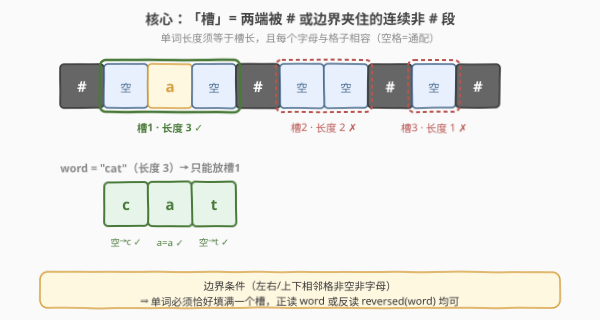
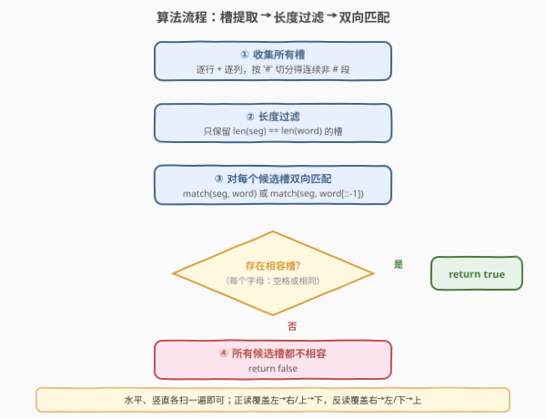
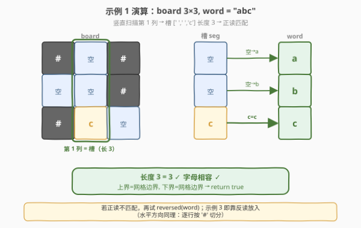

# 判断单词是否能放入填字游戏内

- **题目名称**：判断单词是否能放入填字游戏内
- **链接**：[2018. 判断单词是否能放入填字游戏内](https://leetcode.cn/problems/check-if-word-can-be-placed-in-crossword/)
- **难度**：中等
- **标签**：数组、矩阵、字符串匹配、枚举

## 1. 题目概述

给定一个 `m x n` 的矩阵 `board` 表示填字游戏的当前状态，格子取值为小写字母（已填入）、`' '`（空格）或 `'#'`（障碍）。判断字符串 `word` 能否被放入棋盘——可**水平**（左→右 或 右→左）或**竖直**（上→下 或 下→上）放置，需同时满足：

1. 单词不占据任何 `'#'` 格；
2. 每个字母对应格要么是 `' '`，要么与已有字母**相同**；
3. 水平放置时，单词**左右相邻格**不能是 `' '` 或字母（即必须是 `'#'` 或越界）；
4. 竖直放置时，单词**上下相邻格**同理。

**示例 1**：

```text
输入：board = [["#", " ", "#"], [" ", " ", "#"], ["#", "c", " "]], word = "abc"
输出：true
解释：单词 "abc" 可竖直放入第 1 列（从上到下）：空→a，空→b，c→c。
```

**示例 2**：

```text
输入：board = [[" ", "#", "a"], [" ", "#", "c"], [" ", "#", "a"]], word = "ac"
输出：false
解释：无法放置——任何长度为 2 的放置都会让上下/左右相邻格出现空格或字母。
```

**示例 3**：

```text
输入：board = [["#", " ", "#"], [" ", " ", "#"], ["#", " ", "c"]], word = "ca"
输出：true
解释：单词 "ca" 可水平放入第 2 行第 1-2 列（从右到左）：c→c，空→a。
```

**约束条件**：

- `m == board.length`，`n == board[i].length`
- `1 <= m * n <= 2 * 10^5`
- `board[i][j]` 为 `' '`、`'#'` 或小写字母
- `1 <= word.length <= max(m, n)`
- `word` 只包含小写字母

---

## 2. 解题思路

### 2.1 暴力思路：枚举起点与方向

最直观的做法是枚举每个格子 `(i, j)` 作为起点、每个方向（右、左、下、上 共 4 种）依次尝试：沿方向走出 `len(word)` 步，逐格检查「在界内、非 `'#'`、字母相容（`' '` 或相同）」，再单独校验起点前一格、终点后一格是否为 `'#'` 或越界。

时间复杂度 $O(m \cdot n \cdot 4 \cdot L)$，其中 $L = \text{len(word)} \le \max(m, n)$。最坏情况约 $2 \times 10^5 \times 4 \times \sqrt{2 \times 10^5} \approx 10^9$，偏慢。而且四个方向、起止边界判断繁琐易错。题目给的 `'#'` 切分结构其实暗示了更简洁的视角——按"槽"聚合。

### 2.2 核心观察：「槽」= 两端被 `#`/边界夹住的连续非 `#` 段



关键洞察来自边界条件 ③④：单词首尾相邻格必须是 `'#'` 或越界，而单词自身所占格又必须非 `'#'`。这意味着——**单词恰好填满一个"槽"**：即某行或某列里一段两端被 `'#'` 或棋盘边界夹住的连续非 `'#'` 格子。

于是问题归约为：

> 在所有行槽与列槽中，找到一个**长度等于 `len(word)`** 的槽，使得槽中每个字母与 `word`（或 `word` 的逆序）相容——`seg[k] == ' '` 或 `seg[k] == word[k]`。

- **正读** `match(seg, word)`：覆盖 左→右 / 上→下；
- **反读** `match(seg, word[::-1])`：覆盖 右→左 / 下→上。

> 💡 为何"恰好填满"？若槽比单词长，单词尾部相邻格必是空格或字母（违反 ③④）；若槽比单词短，单词必踩到 `'#'`（违反 ①）。故槽长必须**精确等于** `len(word)`。这一步把"枚举起点 + 校验边界"简化成"按 `'#'` 切分 + 比长度"。

### 2.3 算法流程图



整个流程对每一行、每一列各做一次：用 `'#'` 作分隔符切出若干连续非 `'#'` 段 → 只保留长度等于 `len(word)` 的段 → 对其正读、反读各试一次匹配，任一命中即返回 `true`；全部扫完仍未命中返回 `false`。

> 💡 **水平与竖直统一处理**：把"列"看成转置后的"行"即可复用同一套 `check(line)` 逻辑。一次遍历收集，逻辑零分叉。

### 2.4 示例演算



以示例 1 `board = [["#"," ","#"],[" "," ","#"],["#","c"," "]]`、`word = "abc"` 为例：

- **逐行切分**：第 0 行 `# _ #` → 槽 `[' ']`(长 1)；第 1 行 `_ _ #` → 槽 `[' ',' ']`(长 2)；第 2 行 `# c _` → 槽 `['c',' ']`(长 2)。长度都不等于 3。
- **逐列切分**：第 0 列 `# _ #` → 槽 `[' ']`(长 1)；**第 1 列 `_ _ c`** → 槽 `[' ',' ','c']`(长 3) ✓；第 2 列 `# # _` → 槽 `[' ']`(长 1)。
- **匹配第 1 列槽** vs `"abc"`：`' '?a` ✓、`' '?b` ✓、`c==c` ✓ → 命中，返回 `true`。

> ⚠️ 示例 3 靠**反读**命中：第 2 行槽 `[' ','c']` vs `"ca"` 正读失败（`' '?c`✓ 但 `c≠a`），改为反读 `"ac"`：`' '?a` ✓、`c==c` ✓ → 命中。这正是"双向匹配"存在的意义——一个槽同时承载正反两种放置方向。

---

## 3. 参考代码

### C++

```cpp
class Solution {
  public:
    bool placeWordInCrossword(vector<vector<char>>& board, string word) {
        int m = board.size(), n = board[0].size();
        string rw = word;
        reverse(rw.begin(), rw.end());

        // 逐行
        for (int i = 0; i < m; ++i)
            if (check(board[i], word, rw)) return true;
        // 逐列（转置后复用同一逻辑）
        for (int j = 0; j < n; ++j) {
            vector<char> col;
            col.reserve(m);
            for (int i = 0; i < m; ++i) col.push_back(board[i][j]);
            if (check(col, word, rw)) return true;
        }
        return false;
    }
  private:
    // 按 '#' 切分 line，找长度为 L 且正读/反读相容的段
    bool check(const vector<char>& line, const string& word, const string& rw) {
        int n = line.size(), L = word.size();
        int start = 0;
        for (int i = 0; i <= n; ++i) {           // i==n 触发末段收尾
            if (i == n || line[i] == '#') {
                if (i - start == L &&
                    (match(line, start, word) || match(line, start, rw)))
                    return true;
                start = i + 1;                    // 跳过 '#'，开启下一段
            }
        }
        return false;
    }
    // seg[start .. start+L) 是否与 w 相容（空格=通配）
    bool match(const vector<char>& line, int start, const string& w) {
        for (int k = 0; k < (int)w.size(); ++k) {
            char c = line[start + k];
            if (c != ' ' && c != w[k]) return false;
        }
        return true;
    }
};
```

### Python

```python
class Solution:
    def placeWordInCrossword(self, board: List[List[str]], word: str) -> bool:
        m, n = len(board), len(board[0])
        L = len(word)
        rw = word[::-1]

        def match(seg: list, w: str) -> bool:
            return all(c == ' ' or c == w[k] for k, c in enumerate(seg))

        def check(line: list) -> bool:
            seg = []
            for ch in line:
                if ch == '#':
                    if len(seg) == L and (match(seg, word) or match(seg, rw)):
                        return True
                    seg = []
                else:
                    seg.append(ch)
            # 末段收尾
            return len(seg) == L and (match(seg, word) or match(seg, rw))

        for row in board:
            if check(row):
                return True
        for j in range(n):
            if check([board[i][j] for i in range(m)]):
                return True
        return False
```

> 💡 末段收尾的小技巧：C++ 里循环条件写 `i <= n`，让 `i == n` 时也进入切分分支，省去循环外再补一次判断；Python 里在循环后补一句 `return len(seg) == L and ...`。两者等价，都是为处理「行/列末尾不以 `'#'` 结尾」的尾部段。

---

## 4. 复杂度分析

| 维度 | 复杂度 | 说明 |
|------|--------|------|
| 时间复杂度 | $O(m \cdot n)$ | 每个格子在行切分、列切分中各被访问常数次；匹配工作只发生在长度恰为 $L$ 的槽上，这些槽的总长 $\le 2mn$ |
| 空间复杂度 | $O(\max(m, n))$ | 列扫描时复用单列缓冲；若就地按列读取可降至 $O(1)$ 额外空间 |

> ⚠️ 注意：虽然对每个候选槽都做了「正读 + 反读」两次匹配，但这只是常数因子 2，不改变 $O(mn)$ 量级。把"4 方向枚举起点"压成"行/列各一遍 + 双向匹配"，是本题把常数从 ~4L 降到 ~2 的关键。

---

## 5. 扩展：就地按列扫描省去缓冲

上面 C++ 为复用 `check` 而为每列构造了 `vector<char> col`，空间 $O(m)$。可改为就地版：把 `check` 写成接受 `(board, is_row, idx)` 的形式，行扫描时 `line[k]=board[idx][k]`，列扫描时 `line[k]=board[k][idx]`，匹配与切分逻辑不变。这样额外空间降到 $O(1)$，但代码会多一个 `is_row` 分支。权衡之下，$m \le 2 \times 10^5$ 的列缓冲完全可接受，本文优先可读性。

---

## 6. 面试要点

1. **为什么要"恰好填满一个槽"？边界条件如何推出这一点？**
   - 条件 ③④ 要求单词首尾相邻格必须是 `'#'` 或越界；条件 ① 要求单词所占格非 `'#'`。两者合起来：单词占据的连续非 `'#'` 段两端都被 `'#'`/边界封死，即它本身是一个完整的槽，槽长 = 单词长。这一步把"枚举起点 + 双向校验边界"简化成"按 `'#'` 切分 + 比长度"。

2. **正读和反读各覆盖哪些方向？为什么只需要这两个？**
   - 正读 `match(seg, word)` 覆盖左→右、上→下；反读 `match(seg, word[::-1])` 覆盖右→左、下→上。因为槽是从行/列里抽出的有序序列，反向放置等价于把单词逆序后正向比较，无需为四个方向写四套代码。

3. **时间复杂度为什么是 $O(mn)$ 而非 $O(mn \cdot L)$？**
   - 匹配只在长度恰为 $L$ 的槽上发生，所有这类槽的长度之和不超过全体格子数 $2mn$（每个格子至多属于一个行槽、一个列槽）。切分本身每个格子访问常数次。故总功 $O(mn)$。

4. **若把题目改成"单词可以占据槽的一部分（不必填满）"会怎样？**
   - 边界条件 ③④ 正是禁止此事——若单词比槽短，尾部相邻格会是空格/字母，违反规则。若放宽此规则，则退化为"在矩阵中搜索子串"，用 KMP / 字符串哈希可在 $O(mn)$ 完成，但本题并非此题。

5. **为什么按行、按列各扫一遍就够，不需要扫对角线？**
   - 题目只允许水平或竖直放置，对角线方向不在规则内。若题目扩展为允许 8 方向，则需对每个方向单独切槽或回到暴力枚举。

---

## 7. 同类练习题

- [79. 单词搜索](https://leetcode.cn/problems/word-search/)（[题解](../0001-0100/79_单词搜索.md)）：矩阵中搜索单词，DFS 回溯四方向连通；本题是"放置"而非"搜索"，无需 DFS
- [212. 单词搜索 II](https://leetcode.cn/problems/word-search-ii/)：Trie + DFS 批量搜词，进一步练习矩阵字符串匹配
- [73. 矩阵置零](https://leetcode.cn/problems/set-matrix-zeroes/)：矩阵按行/按列扫描 + 标记，练习"行扫描、列扫描"基本功
- [422. 有效的单词方块](https://leetcode.cn/problems/valid-word-square/)：校验单词列表能否构成行列对称的方块，填字游戏主题姊妹题
