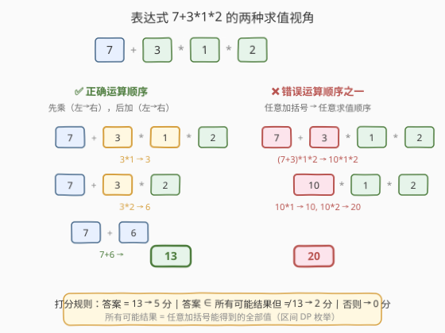
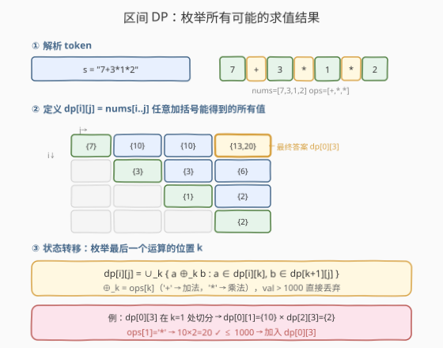
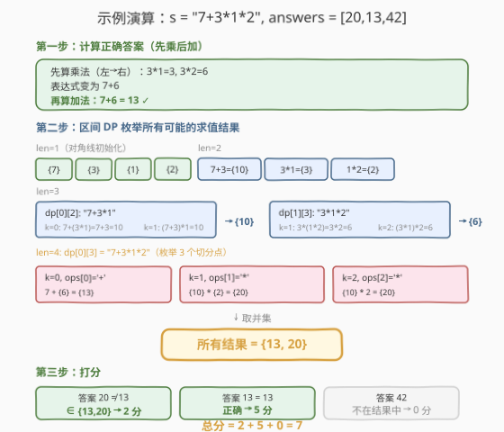

# LeetCode 解出数学表达式的学生分数 题解

## 1. 题目概述

- **标题 / 题号**：解出数学表达式的学生分数（#2019，hard）
- **链接**：https://leetcode.cn/problems/the-score-of-students-solving-math-expression/
- **难度**：困难
- **标签**：数组、数学、字符串、动态规划、区间 DP

**题意**：给定一个字符串 `s`，它**只**包含数字 `0-9`、加法运算符 `'+'` 和乘法运算符 `'*'`，表示一个**合法**的只含**个位数**的数学表达式（如 `3+5*2`）。有 `n` 位小学生计算该表达式，但遵循如下**特殊运算顺序**：

1. 按照**从左到右**的顺序计算**所有乘法**，然后
2. 按照**从左到右**的顺序计算**所有加法**。

再给定长度为 `n` 的数组 `answers`，表示每位学生的答案。打分规则：

- 答案**等于**正确结果 → **5 分**；
- 否则，若答案可由**一处或多处错误的运算顺序**计算得到 → **2 分**；
- 否则 → **0 分**。

返回所有学生的分数之和。

> ⚠️ 审题关键：①"正确顺序"是题目自定义的「先乘后加」，**不是**常规的运算符优先级（常规优先级也是先乘后加，但本题的"先乘后加"是严格的从左到右依次处理同优先级运算符，不含括号）；②"错误运算顺序"指**任意**加括号方式能得到的结果——即表达式在**任意二元运算树**下的求值结果；③若错误顺序碰巧得到正确值，仍按 5 分计（见示例 3）。

**示例 1**：

```text
输入：s = "7+3*1*2", answers = [20,13,42]
输出：7
解释：正确结果为 13。学生答案 20 可由错误顺序得到：7+3=10, 10*1=10, 10*2=20 → 2 分。
得分：[2, 5, 0]，总和 = 7。
```

**示例 2**：

```text
输入：s = "3+5*2", answers = [13,0,10,13,13,16,16]
输出：19
解释：正确结果为 13。错误顺序 3+5=8, 8*2=16 → 16 得 2 分。
得分：[5,0,0,5,5,2,2]，总和 = 19。
```

**示例 3**：

```text
输入：s = "6+0*1", answers = [12,9,6,4,8,6]
输出：10
解释：正确结果为 6。错误顺序 6+0=6, 6*1=6 也得 6，但因等于正确结果 → 5 分。
得分：[0,0,5,0,0,5]，总和 = 10。
```

**约束**：

- $3 \le \text{s.length} \le 31$
- `s` 只包含 `0-9`、`'+'`、`'*'`，是合法表达式
- 表达式中所有运算数为 $[0, 9]$ 内的个位数
- $1 \le$ 运算符数目 $\le 15$
- 正确结果在 $[0, 1000]$ 以内
- 乘法中间步骤的值不超过 $10^9$
- $1 \le n \le 10^4$，$0 \le \text{answers}[i] \le 1000$

## 2. 解题思路

### 2.1 暴力思路：枚举所有运算顺序

表达式的运算符数目 $\le 15$，运算符之间的不同执行顺序对应不同的括号化方案。对于 $m$ 个运算符，括号化方案数为**卡特兰数** $C_m$。当 $m = 15$ 时 $C_{15} = 9694845 \approx 10^7$，每种方案求值 $O(m)$，总计约 $1.5 \times 10^8$。虽可行但较慢，且需要去重。

> ⚠️ 更重要的是，我们**不需要列出每种方案**——只需知道「哪些值是可达的」。这正是区间 DP 的拿手好戏：同一子表达式的结果会被多种括号方案重复计算，DP 天然去重。

### 2.2 核心观察：正确答案 + 所有可能结果 = 两阶段求解



打分需要两个信息：

1. **正确答案 `correct`**：按题目定义的「先乘后加」顺序求值——一遍扫描即可，$O(m)$。
2. **所有可能结果集合 `all_possible`**：表达式在**任意加括号方式**下能得到的所有值——这是经典的**区间 DP**（与 [241. 为运算表达式设计优先级](https://leetcode.cn/problems/different-ways-to-add-parentheses/) 同构）。

> 💡 **为何「任意加括号」等价于「错误运算顺序」？** 表达式不含括号，运算符优先级由括号化方案决定。题目定义的「先乘后加」是**一种**特定方案；其余所有方案都是「错误顺序」。因此 `all_possible` 恰好覆盖了所有「错误顺序可达的值」。若某值 $= \text{correct}$，说明它虽由错误顺序得到但碰巧等于正确值，按规则记 5 分（示例 3）。

**打分逻辑**（`correct` 必然 $\in$ `all_possible`，因为正确顺序也是一种括号方案）：

$$
\text{score}(a) = \begin{cases} 5 & a = \text{correct} \\ 2 & a \ne \text{correct} \;\wedge\; a \in \text{all\_possible} \\ 0 & \text{otherwise} \end{cases}
$$

### 2.3 算法流程图



**第一阶段——正确答案**：

1. 将 `s` 解析为 `nums`（个位数数组）和 `ops`（运算符数组），`nums` 与 `ops` 交错排列。
2. 用一个栈模拟「先乘后加」：遇 `+` 将右操作数压栈，遇 `*` 将栈顶与右操作数相乘更新栈顶。
3. 栈中剩余元素全做加法，求和即 `correct`。

**第二阶段——区间 DP**：

1. `dp[i][j]` = `nums[i..j]`（含 `ops[i..j-1]`）在任意加括号下能得到的所有值集合。
2. 初始化：`dp[i][i] = {nums[i]}`。
3. 转移：按区间长度 `len` 从 2 到 $m$（$m$ = `nums` 长度）枚举，对每个 `[i, j]` 枚举切分点 $k \in [i, j)$，用 `ops[k]` 合并 `dp[i][k]` 与 `dp[k+1][j]` 的笛卡尔积。
4. **剪枝**：任何 $> 1000$ 的值直接丢弃（`answers[i] ≤ 1000`，且所有运算为非负数的 `+`/`*`，大值只会更大不会变小）。

### 2.4 示例演算



以 `s = "7+3*1*2"` 为例：`nums = [7,3,1,2]`，`ops = [+,*,*]`，$m = 4$。

**正确答案**：先乘 $3 \times 1 = 3$，$3 \times 2 = 6$，后加 $7 + 6 = 13$。

**区间 DP** 逐层填充：

| 区间 | 表达式 | 切分 | 结果 |
|------|--------|------|------|
| `[0,1]` | `7+3` | k=0: `7+3` | `{10}` |
| `[1,2]` | `3*1` | k=1: `3*1` | `{3}` |
| `[2,3]` | `1*2` | k=2: `1*2` | `{2}` |
| `[0,2]` | `7+3*1` | k=0: `7+{3}={10}`；k=1: `{10}*1={10}` | `{10}` |
| `[1,3]` | `3*1*2` | k=1: `3*{2}={6}`；k=2: `{3}*2={6}` | `{6}` |
| `[0,3]` | `7+3*1*2` | k=0: `7+{6}={13}`；k=1: `{10}*{2}={20}`；k=2: `{10}*2={20}` | `{13, 20}` |

最终 `all_possible = {13, 20}`。打分：`20 → 2`，`13 → 5`，`42 → 0`，总分 = 7。

> 💡 注意 `dp[0][3]` 在 k=1 和 k=2 两处切分都得到 20（对应两种不同的错误括号方案），但集合天然去重，20 只出现一次。

## 3. 参考代码

### C++

```cpp
class Solution {
public:
    int scoreOfStudents(string s, vector<int>& answers) {
        int slen = s.size();
        vector<int> nums;
        vector<char> ops;
        for (int i = 0; i < slen; ++i) {
            if (i % 2 == 0) nums.push_back(s[i] - '0');
            else ops.push_back(s[i]);
        }
        int m = nums.size();

        // 1. 正确答案：先乘后加
        vector<long long> stk = {nums[0]};
        for (int i = 0; i < (int)ops.size(); ++i) {
            if (ops[i] == '*')
                stk.back() *= nums[i + 1];
            else
                stk.push_back(nums[i + 1]);
        }
        int correct = accumulate(stk.begin(), stk.end(), 0LL);

        // 2. 区间 DP：枚举所有可能的求值结果
        vector<vector<unordered_set<int>>> dp(m, vector<unordered_set<int>>(m));
        for (int i = 0; i < m; ++i) dp[i][i] = {nums[i]};

        for (int len = 2; len <= m; ++len) {
            for (int i = 0; i + len <= m; ++i) {
                int j = i + len - 1;
                for (int k = i; k < j; ++k) {
                    char op = ops[k];
                    for (int a : dp[i][k]) {
                        for (int b : dp[k + 1][j]) {
                            int val = (op == '*') ? a * b : a + b;
                            if (val <= 1000) dp[i][j].insert(val);
                        }
                    }
                }
            }
        }

        // 3. 打分
        int score = 0;
        auto& all = dp[0][m - 1];
        for (int ans : answers) {
            if (ans == correct) score += 5;
            else if (all.count(ans)) score += 2;
        }
        return score;
    }
};
```

### Python

```python
class Solution:
    def scoreOfStudents(self, s: str, answers: List[int]) -> int:
        nums = [int(s[i]) for i in range(0, len(s), 2)]
        ops = [s[i] for i in range(1, len(s), 2)]
        m = len(nums)

        # 1. 正确答案：先乘后加
        stk = [nums[0]]
        for i, op in enumerate(ops):
            if op == '*':
                stk[-1] *= nums[i + 1]
            else:
                stk.append(nums[i + 1])
        correct = sum(stk)

        # 2. 区间 DP：枚举所有可能的求值结果
        dp = [[set() for _ in range(m)] for _ in range(m)]
        for i in range(m):
            dp[i][i] = {nums[i]}

        for length in range(2, m + 1):
            for i in range(m - length + 1):
                j = i + length - 1
                for k in range(i, j):
                    op = ops[k]
                    for a in dp[i][k]:
                        for b in dp[k + 1][j]:
                            val = a * b if op == '*' else a + b
                            if val <= 1000:
                                dp[i][j].add(val)

        all_possible = dp[0][m - 1]

        # 3. 打分
        score = 0
        for ans in answers:
            if ans == correct:
                score += 5
            elif ans in all_possible:
                score += 2
        return score
```

> 💡 **正确答案为何用 `long long`（C++）？** 题目保证乘法中间步骤 $\le 10^9$，`int` 在某些平台可能溢出（$10^9 < 2^{31} - 1$ 实际不会溢出，但用 `long long` 更稳妥）。Python 无此问题。

## 4. 复杂度分析

| 维度 | 复杂度 | 说明 |
|------|--------|------|
| 时间复杂度 | $O(m^3 \cdot S^2)$ | $m$ = 运算数个数 $\le 16$；$S$ = 单个区间集合大小 $\le 1001$（剪枝后远小于此）；枚举 $O(m^2)$ 个区间 × $O(m)$ 个切分点 × $O(S^2)$ 笛卡尔积 |
| 空间复杂度 | $O(m^2 \cdot S)$ | DP 表共 $m^2$ 个集合，每个 $\le S$ |

> ⚠️ 实际运行远快于理论上界：个位数运算数 + 剪枝使集合 $S$ 通常远小于 1001。最坏 $m = 16$、$S = 1001$ 时约 $16^3 \times 1001^2 \approx 4 \times 10^9$，但实测集合均值约几十到几百，LeetCode 时限内可过。

> 💡 **剪枝 `val ≤ 1000` 为何安全？** 所有运算数为 $[0, 9]$ 非负整数，`+`/`*` 均单调不减（乘以 0 时归零，但归零后不再增长）。若某中间值 $> 1000$，后续运算要么保持 $> 1000$（无法匹配任何 `answers[i] ≤ 1000`），要么乘 0 归零（归零结果也可由其他不含大中间值的括号方案得到）。故丢弃 $> 1000$ 的值不影响最终集合中 $\le 1000$ 部分的正确性。

## 5. 扩展：bitset 优化加法转移

当集合较大时，加法转移可用 **bitset 卷积**加速：将 `dp[i][k]` 表示为位掩码（Python 的 `int` 天然支持任意位宽），则 `a + b` 的全体结果为：

```python
result = 0
for b in bits_of(dp[k+1][j]):
    result |= (dp[i][k] << b)
```

每个 `<<` + `|` 操作在 $O(S / 64)$ 时间内完成（大整数底层按 64 位字处理），总复杂度从 $O(S^2)$ 降至 $O(S^2 / 64)$。乘法转移因无法用移位表达，仍需枚举笛卡尔积。本题 $m \le 16$、集合较小，朴素 set 已足够；bitset 优化适用于更大规模的变体。

## 6. 面试要点

1. **"错误运算顺序"如何形式化？**
   - 表达式不含括号，任意运算顺序 $\leftrightarrow$ 任意加括号方案 $\leftrightarrow$ 任意二元运算树。题目定义的「先乘后加」是其中一种特定方案，其余均为「错误顺序」。因此「所有错误顺序可达的值」=「所有括号方案可达的值」$\setminus$ {正确值}，但打分时正确值优先判 5 分。

2. **正确答案为何单独算而不从 DP 结果里取？**
   - DP 给出的是「所有括号方案」的并集，其中包含正确顺序的值。但打分规则要求：等于正确答案 → 5 分，而非 2 分。若直接从 DP 取，无法区分「正确顺序得到的值」与「错误顺序碰巧得到的值」。故需单独计算 `correct` 并优先判定。

3. **剪枝 `val > 1000` 丢弃的安全性如何论证？**
   - 运算数均为 $[0, 9]$ 非负数，`+`/`*` 单调不减。$> 1000$ 的值经后续 `+`/`*` 只会更大或乘 0 归零。乘 0 归零的结果可由其他「先做 *0」的括号方案得到（将 0 尽早结合，避免大中间值产生）。故丢弃 $> 1000$ 的值不影响 $\le 1000$ 结果的完备性。

4. **区间 DP 的切分点 k 枚举什么？**
   - k 枚举的是 `ops[k]` 作为「整个子表达式 `[i,j]` 最后一次执行的运算」的位置。左子表达式 `nums[i..k]` 和右子表达式 `nums[k+1..j]` 各自独立求值后，用 `ops[k]` 合并。这覆盖了所有可能的运算树根节点选择。

5. **与 [241. 为运算表达式设计优先级](https://leetcode.cn/problems/different-ways-to-add-parentheses/) 的异同？**
   - 241 题返回所有可能结果的**列表**（含重复），本题返回**集合**（去重）并用于打分。两者核心 DP 结构完全相同，区别在于 241 不含 `/` 运算符且不需剪枝，本题增加了 `val ≤ 1000` 的值域剪枝和「正确答案单独计算」的预处理。

## 同类练习题

| # | 题目 | 与本题的关联 |
|---|------|-------------|
| 241 | [为运算表达式设计优先级](https://leetcode.cn/problems/different-ways-to-add-parentheses/) | 区间 DP 枚举所有括号化结果，本题的直接原型 |
| 224 | [基本计算器](https://leetcode.cn/problems/basic-calculator/)（[题解](../0201-0300/224_基本计算器.md)） | 表达式求值 + 栈处理，对比「按特定优先级求值」与「枚举所有优先级」 |
| 375 | [猜数字大小 II](https://leetcode.cn/problems/guess-number-higher-or-lower-ii/) | 区间 DP 枚举所有切分点取最小化最坏代价，同构的区间 DP 框架 |
| 96 | [不同的二叉搜索树](https://leetcode.cn/problems/unique-binary-search-trees/)（[题解](../0001-0100/96_不同的二叉搜索树.md)） | 卡特兰数计数 DP，对应本题括号化方案数的数学背景 |
