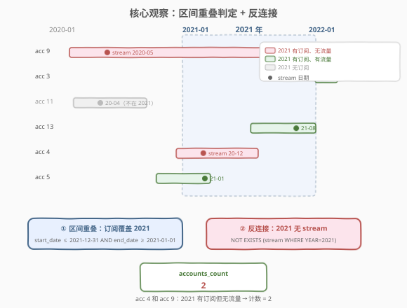
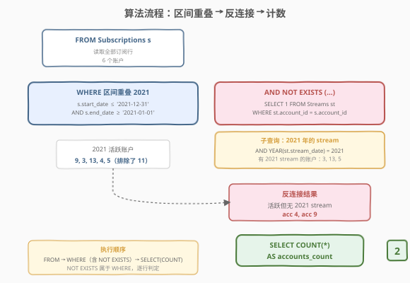
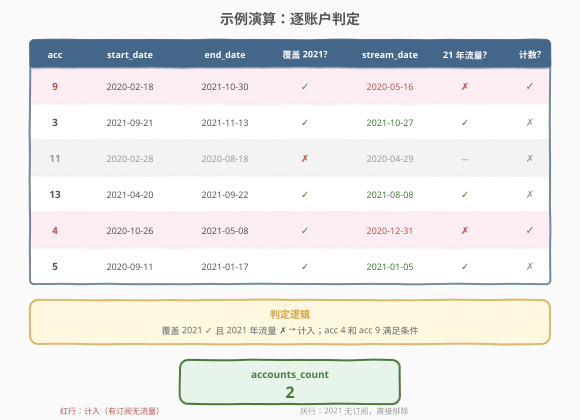

# 无流量的帐户数

- **题目名称**：无流量的帐户数
- **链接**：[2020. 无流量的帐户数](https://leetcode.cn/problems/number-of-accounts-that-did-not-stream/)
- **难度**：中等
- **标签**：数据库、SQL、区间重叠、反连接（anti-join）、`NOT EXISTS`、`NOT IN`、`LEFT JOIN` + `IS NULL`、`YEAR()` 函数、LeetCode 锁题

## 1. 题目概述

给定 `Subscriptions`（订阅表）和 `Streams`（流量会话表）两张表，编写 SQL 查询，报告**在 2021 年有订阅但没有任何会话**的帐户数。

**表结构**：

```text
Table: Subscriptions
+-------------+------+
| Column Name | Type |
+-------------+------+
| account_id  | int  |  ← 主键
| start_date  | date |
| end_date    | date |
+-------------+------+
每行表示帐户订阅的开始和结束日期。始终 start_date < end_date。

Table: Streams
+-------------+------+
| Column Name | Type |
+-------------+------+
| session_id  | int  |  ← 主键
| account_id  | int  |  ← 指向 Subscriptions 的外键
| stream_date | date |
+-------------+------+
每行包含与会话相关联的帐户和日期。
```

**示例 1**：

```text
输入：
Subscriptions 表:
+------------+------------+------------+
| account_id | start_date | end_date   |
+------------+------------+------------+
| 9          | 2020-02-18 | 2021-10-30 |
| 3          | 2021-09-21 | 2021-11-13 |
| 11         | 2020-02-28 | 2020-08-18 |
| 13         | 2021-04-20 | 2021-09-22 |
| 4          | 2020-10-26 | 2021-05-08 |
| 5          | 2020-09-11 | 2021-01-17 |
+------------+------------+------------+

Streams 表:
+------------+------------+-------------+
| session_id | account_id | stream_date |
+------------+------------+-------------+
| 14         | 9          | 2020-05-16  |
| 16         | 3          | 2021-10-27  |
| 18         | 11         | 2020-04-29  |
| 17         | 13         | 2021-08-08  |
| 19         | 4          | 2020-12-31  |
| 13         | 5          | 2021-01-05  |
+------------+------------+-------------+

输出:
+----------------+
| accounts_count |
+----------------+
| 2              |
+----------------+

解释：用户 4 和 9 在 2021 没有会话。用户 11 在 2021 没有订阅。
```

**约束条件**：

- `account_id` 是 `Subscriptions` 表的主键
- `session_id` 是 `Streams` 表的主键
- `Streams.account_id` 是指向 `Subscriptions.account_id` 的外键
- 始终 `start_date < end_date`

> 💡 本题是 SQL **"区间重叠 + 反连接"招牌题**——核心两步：① 用区间重叠判定「订阅是否覆盖 2021 年」（`start_date ≤ '2021-12-31' AND end_date ≥ '2021-01-01'`）；② 用反连接（`NOT EXISTS`）排除「2021 年有会话」的账户。难点在于理解订阅是一个**跨年区间**，不能简单用 `YEAR(start_date) = 2021` 判断——2020 年开始的订阅若延续到 2021 年也算"2021 年有订阅"。

---

## 2. 解题思路

### 2.1 暴力思路：逐年枚举 + 排除

最直觉的过程式思路：对每个订阅，枚举其覆盖的所有年份，看 2021 是否在其中；再检查该账户在 2021 年是否有 stream。伪代码：

```text
count = 0
for sub in Subscriptions:
    years = set(range(year(sub.start_date), year(sub.end_date) + 1))
    if 2021 in years:
        has_stream_2021 = any(year(s.stream_date) == 2021 and s.account_id == sub.account_id for s in Streams)
        if not has_stream_2021:
            count += 1
```

> ⚠️ 有人据此写出**递归 CTE** 逐年展开再筛选 2021——可行但大材小用。实际上「区间是否覆盖 2021」只需一次**区间重叠判定**，无需展开每年。递归 CTE 在订阅跨数年时会产生多行，还需 `COUNT(DISTINCT)` 去重，徒增复杂度。

### 2.2 核心观察：区间重叠 + 反连接



**问题拆解为两个子问题**：

1. **订阅是否覆盖 2021 年**——这是经典的**区间重叠判定**：区间 $[\text{start\_date}, \text{end\_date}]$ 与 $[\text{2021-01-01}, \text{2021-12-31}]$ 有交集，当且仅当：

$$
\text{start\_date} \le \text{2021-12-31} \;\wedge\; \text{end\_date} \ge \text{2021-01-01}
$$

   > 💡 **等价写法**：`YEAR(start_date) <= 2021 AND YEAR(end_date) >= 2021`。两者完全等价——`YEAR(d) ≤ 2021` 当且仅当 `d ≤ '2021-12-31'`，`YEAR(d) ≥ 2021` 当且仅当 `d ≥ '2021-01-01'`。但**日期比较版本更推荐**：① 索引友好（可走 `start_date` 上的 B-tree 索引，`YEAR()` 函数会阻止索引使用）；② 跨方言通用（`YEAR()` 是 MySQL 专属函数）。

2. **2021 年是否有会话**——这是**反连接**：找出「在 2021 年的 Streams 中不存在的账户」。标准写法三选一：`NOT EXISTS`（推荐）、`NOT IN`（注意 NULL 陷阱）、`LEFT JOIN ... IS NULL`。

> ⚠️ **审题关键**：① "在 2021 年购买订阅"指订阅**覆盖** 2021 年（区间重叠），**不是** `YEAR(start_date) = 2021`——2020 年开始、2021 年结束的订阅也算；② "没有任何会话"指 2021 年**全年无 stream**，不是"订阅期内无 stream"——只需 `YEAR(stream_date) = 2021` 过滤即可，无需判定 stream 是否在订阅区间内。

### 2.3 算法流程图



**逻辑执行步骤**：

| 步骤 | 子句 | 作用 |
|------|------|------|
| ① | `FROM Subscriptions s` | 读取全部订阅行（6 个账户） |
| ② | `WHERE s.start_date <= '2021-12-31' AND s.end_date >= '2021-01-01'` | 区间重叠判定，筛出 2021 活跃账户（5 个，排除 acc 11） |
| ③ | `AND NOT EXISTS (SELECT 1 FROM Streams st WHERE st.account_id = s.account_id AND YEAR(st.stream_date) = 2021)` | 反连接，排除 2021 有 stream 的账户（排除 acc 3、13、5） |
| ④ | `SELECT COUNT(*) AS accounts_count` | 计剩余行数（acc 4、9 → 2） |

> 💡 **SQL 子句执行顺序**：`FROM` → `WHERE`（含 `NOT EXISTS` 子查询）→ `SELECT`（含 `COUNT`）。`NOT EXISTS` 是 `WHERE` 子句的一部分，对外层每行逐一判定——对当前订阅行 `s`，检查 `Streams` 中是否存在 `account_id` 相同且 `YEAR(stream_date) = 2021` 的行；不存在则保留。

### 2.4 示例演算



以示例 1 的 6 个账户为例，逐步判定：

**步骤 ①②：区间重叠——筛出 2021 活跃账户**

| account_id | start_date | end_date | 覆盖 2021? | 判定 |
|------------|-----------|----------|-----------|------|
| 9 | 2020-02-18 | 2021-10-30 | ✓（end ≥ 2021-01-01） | 保留 |
| 3 | 2021-09-21 | 2021-11-13 | ✓ | 保留 |
| 11 | 2020-02-28 | 2020-08-18 | ✗（end < 2021-01-01） | **排除** |
| 13 | 2021-04-20 | 2021-09-22 | ✓ | 保留 |
| 4 | 2020-10-26 | 2021-05-08 | ✓ | 保留 |
| 5 | 2020-09-11 | 2021-01-17 | ✓ | 保留 |

> 💡 acc 11 的订阅在 2020-08-18 结束，不覆盖 2021 年——被区间重叠条件排除。acc 9 虽 2020 年开始，但 end_date 2021-10-30 ≥ 2021-01-01，故覆盖 2021。

**步骤 ③：反连接——排除 2021 有 stream 的账户**

2021 年有 stream 的账户：acc 3（2021-10-27）、acc 13（2021-08-08）、acc 5（2021-01-05）。排除后剩余：

| account_id | 2021 stream? | 计入? |
|------------|-------------|-------|
| 9 | ✗（stream 在 2020-05-16） | ✓ |
| 4 | ✗（stream 在 2020-12-31） | ✓ |

**步骤 ④：COUNT(*) = 2**

> ⚠️ **acc 9 的 stream 在 2020-05-16**——虽然他有 stream，但不在 2021 年，故判定为"2021 无流量"。acc 4 同理（stream 在 2020-12-31）。这揭示了反连接的精确语义：不是"从未 stream"，而是"2021 年内未 stream"。

---

## 3. 参考代码

### SQL（解法 A：`NOT EXISTS`，推荐）

```sql
SELECT COUNT(*) AS accounts_count
FROM Subscriptions s
WHERE s.start_date <= '2021-12-31'
  AND s.end_date >= '2021-01-01'
  AND NOT EXISTS (
      SELECT 1
      FROM Streams st
      WHERE st.account_id = s.account_id
        AND YEAR(st.stream_date) = 2021
  );
```

> 💡 **写法要点**：
> - **区间重叠**：`start_date <= '2021-12-31' AND end_date >= '2021-01-01'` 判定订阅覆盖 2021 年。等价于 `YEAR(start_date) <= 2021 AND YEAR(end_date) >= 2021`，但日期比较更索引友好。
> - **`NOT EXISTS`**：对每个订阅行 `s`，检查 `Streams` 中不存在 `account_id` 相同且 `YEAR(stream_date) = 2021` 的行。天然 `NULL` 安全（不依赖 `NOT IN` 的值比较语义）。
> - **`COUNT(*)`**：`account_id` 是 `Subscriptions` 主键（唯一非空），无需 `COUNT(DISTINCT)`。
> - ✓ **最推荐**：语义清晰、`NULL` 安全、标准 SQL 通用。

### SQL（解法 B：`NOT IN` 子查询，注意 NULL 陷阱）

```sql
SELECT COUNT(*) AS accounts_count
FROM Subscriptions s
WHERE s.start_date <= '2021-12-31'
  AND s.end_date >= '2021-01-01'
  AND s.account_id NOT IN (
      SELECT account_id
      FROM Streams
      WHERE YEAR(stream_date) = 2021
        AND account_id IS NOT NULL
  );
```

> 💡 **解法 B 的思路**：子查询取出所有"2021 年有 stream"的 `account_id`，外层用 `NOT IN` 筛出不在其中的账户。
>
> ⚠️ **`NOT IN` 的 NULL 陷阱**：若子查询结果含 `NULL`，则 `x NOT IN (..., NULL)` 等价于 `... AND x <> NULL`，而 `x <> NULL` 为 UNKNOWN，导致整个条件为 UNKNOWN——查询返回空集！本题 `Streams.account_id` 作为外键理论上非空，但加 `AND account_id IS NOT NULL` 是防御性的好习惯。
>
> **与解法 A 的关系**：`NOT EXISTS` 天然 `NULL` 安全（`EXISTS` 只判断行是否存在，不比较值与 `NULL`），且多数现代优化器会将其优化为与 `NOT IN` 相同的反连接执行计划。优先选 A。

### SQL（解法 C：`LEFT JOIN` + `IS NULL`）

```sql
SELECT COUNT(*) AS accounts_count
FROM Subscriptions s
LEFT JOIN (
    SELECT DISTINCT account_id
    FROM Streams
    WHERE YEAR(stream_date) = 2021
) t ON s.account_id = t.account_id
WHERE s.start_date <= '2021-12-31'
  AND s.end_date >= '2021-01-01'
  AND t.account_id IS NULL;
```

> 💡 **解法 C 的思路**：先用子查询取出 2021 年有 stream 的去重 `account_id` 集合，再 `LEFT JOIN` 到 `Subscriptions`——无匹配时 `t.account_id` 为 `NULL`，用 `IS NULL` 筛出"2021 无 stream"的账户。
>
> **与解法 A/B 的关系**：三者逻辑等价。`LEFT JOIN ... IS NULL` 是反连接的第三种标准写法，与 1581「进店却未进行过交易的顾客」的 `LEFT JOIN + IS NULL` 骨架相同。区别在于本题多了一层**区间重叠过滤**（`WHERE` 前两个条件）和**子查询内先过滤 2021**（避免一对多展开导致计数错误）。
>
> ⚠️ 若不先在子查询中 `DISTINCT`，直接 `LEFT JOIN Streams` 会导致一个账户的多条 stream 记录展开为多行——虽然 `IS NULL` 的行不受影响（无匹配才 NULL），但 `COUNT(*)` 会因有匹配的行展开而多计。本题用 `COUNT(*)` 计的是 `IS NULL` 行，故不受影响；但 `DISTINCT` 使语义更清晰。

### Python（pandas）

```python
import pandas as pd

def count_accounts(subscriptions: pd.DataFrame, streams: pd.DataFrame) -> int:
    active_2021 = subscriptions[
        (subscriptions['start_date'] <= pd.Timestamp('2021-12-31')) &
        (subscriptions['end_date'] >= pd.Timestamp('2021-01-01'))
    ]
    stream_2021_accounts = set(
        streams[streams['stream_date'].dt.year == 2021]['account_id']
    )
    no_stream = ~active_2021['account_id'].isin(stream_2021_accounts)
    return int(no_stream.sum())
```

> 💡 **pandas 对照**：
> - `subscriptions['start_date'] <= pd.Timestamp('2021-12-31')` 对应 SQL 的 `start_date <= '2021-12-31'`。用 `pd.Timestamp()` 确保类型一致（LeetCode 的 date 列在 pandas 中为 `datetime64`）。
> - `streams['stream_date'].dt.year == 2021` 对应 SQL 的 `YEAR(stream_date) = 2021`。`.dt` 访问器是 pandas 的 datetime 属性访问方式。
> - `~active_2021['account_id'].isin(stream_2021_accounts)` 对应 `NOT IN`（或 `NOT EXISTS`）——`.isin()` 对 `NULL`/`NaN` 安全，无 SQL 的 `NOT IN` 陷阱。
> - `.sum()` 对布尔 Series 求和，等价于 `COUNT(*)`（`True` 计 1，`False` 计 0）。

---

## 4. 复杂度分析

| 维度 | 解法 A（`NOT EXISTS`） | 解法 B（`NOT IN`） | 解法 C（`LEFT JOIN`） | pandas |
|------|----------------------|--------------------|-----------------------|--------|
| **时间** | $O(n + m)$（哈希半连接） | $O(n + m)$（哈希半连接） | $O(n + m)$（哈希连接） | $O(n + m)$ |
| **空间** | $O(m)$（子查询结果） | $O(m)$（子查询结果） | $O(m)$（去重集合） | $O(n + m)$ |
| **NULL 安全** | ✓ 天然 | ✗ 需手动 `IS NOT NULL` | ✓ 天然 | ✓ `isin` 安全 |
| **推荐度** | ✓ **首选** | ✓ 需谨慎 | ✓ 语义对照 | ✓ 验证用 |

> - $n$ = `Subscriptions` 表行数，$m$ = `Streams` 表行数
> - **时间**：三种 SQL 解法的 `NOT EXISTS`/`NOT IN`/`LEFT JOIN` 在现代优化器中通常被优化为**哈希半连接**或**反连接**，$O(n + m)$ 一次扫描完成。`NOT EXISTS` 的相关子查询若 `Streams(account_id, stream_date)` 上有复合索引，可走索引查找降到 $O(n \cdot \log m)$。
> - **空间**：子查询需物化 2021 年的 `account_id` 集合，$O(m)$；pandas 需 $O(n + m)$ 存 DataFrame。
> - **索引优化**：在 `Streams(account_id, stream_date)` 上建复合索引可让 `NOT EXISTS` 的相关子查询走索引查找；`Subscriptions(start_date, end_date)` 上的索引可加速区间重叠过滤（日期比较版本可走索引，`YEAR()` 版本不可）。

---

## 5. 扩展：区间重叠判定与跨方言日期处理

### 5.1 区间重叠的通用模板

本题的核心是判定区间 $[A_s, A_e]$（订阅）与区间 $[B_s, B_e]$（2021 年）是否有交集。通用判定条件为：

$$
A_s \le B_e \;\wedge\; A_e \ge B_s
$$

| 场景 | $A_s$ | $A_e$ | $B_s$ | $B_e$ | 重叠? |
|------|-------|-------|-------|-------|-------|
| acc 9 | 2020-02-18 | 2021-10-30 | 2021-01-01 | 2021-12-31 | ✓（$A_e \ge B_s$） |
| acc 11 | 2020-02-28 | 2020-08-18 | 2021-01-01 | 2021-12-31 | ✗（$A_e < B_s$） |
| acc 3 | 2021-09-21 | 2021-11-13 | 2021-01-01 | 2021-12-31 | ✓（完全包含在 2021 内） |

> 💡 **反直觉但正确**：两区间重叠的条件是「左端取大、右端取小，左 ≤ 右」。等价地，两区间**不**重叠的条件是 $A_e < B_s \;\vee\; A_s > B_e$，对其取反（德摩根律）即得重叠条件。

### 5.2 跨方言日期处理

`YEAR()` 是 MySQL 专属函数。要在多方言间可移植，用日期算术或标准函数：

| 方言 | 提取年份 | 2021 年判定 |
|------|---------|------------|
| MySQL | `YEAR(d)` | `YEAR(d) = 2021` |
| PostgreSQL | `EXTRACT(YEAR FROM d)` | `EXTRACT(YEAR FROM d) = 2021` |
| SQL Server | `YEAR(d)` 或 `DATEPART(YEAR, d)` | `YEAR(d) = 2021` |
| Oracle | `EXTRACT(YEAR FROM d)` | `EXTRACT(YEAR FROM d) = 2021` |

> 💡 **更通用的写法**：用日期比较代替 `YEAR()`——`d >= '2021-01-01' AND d <= '2021-12-31'` 在所有方言中都有效，且可走索引。本题的区间重叠判定已用此写法；stream 的 2021 过滤也可改为 `st.stream_date >= '2021-01-01' AND st.stream_date <= '2021-12-31'` 替代 `YEAR(st.stream_date) = 2021`。

### 5.3 递归 CTE 方案（不推荐但可参考）

有人用递归 CTE 逐年展开订阅区间再筛选 2021：

```sql
WITH RECURSIVE years AS (
    SELECT account_id, YEAR(start_date) AS yr FROM Subscriptions
    UNION ALL
    SELECT y.account_id, y.yr + 1
    FROM years y
    JOIN Subscriptions s ON y.account_id = s.account_id
    WHERE y.yr < YEAR(s.end_date)
)
SELECT COUNT(DISTINCT account_id) AS accounts_count
FROM years
WHERE yr = 2021
  AND account_id NOT IN (
      SELECT account_id FROM Streams WHERE YEAR(stream_date) = 2021
  );
```

> ⚠️ **不推荐**：递归 CTE 将每个跨年订阅展开为多行（如 acc 9 的 2020-2021 展开为 2 行），再筛 2021——逻辑正确但**过度复杂**。区间重叠判定一步即可替代逐年展开，且无需 `COUNT(DISTINCT)` 去重。递归 CTE 适用于「需要逐年间隔分析」的场景（如计算每年活跃天数），本题只需「是否覆盖 2021」，重叠判定足矣。

---

## 6. 面试要点

1. **"在 2021 年购买订阅"如何理解？能用 `YEAR(start_date) = 2021` 吗？**

   > 不能。"在 2021 年有订阅"指订阅区间**覆盖** 2021 年的任意一天，即 $[\text{start\_date}, \text{end\_date}]$ 与 $[\text{2021-01-01}, \text{2021-12-31}]$ 有交集。acc 9 的 `start_date` 是 2020-02-18，但 `end_date` 是 2021-10-30，订阅延续到 2021 年——也算"2021 年有订阅"。正确判定：`start_date <= '2021-12-31' AND end_date >= '2021-01-01'`。`YEAR(start_date) = 2021` 会漏掉所有跨年订阅。

2. **`NOT EXISTS` 和 `NOT IN` 有什么区别？**

   > `NOT EXISTS` 天然 `NULL` 安全——`EXISTS` 只判断子查询是否返回行，不比较值与 `NULL`。`NOT IN` 有 `NULL` 陷阱——若子查询结果含 `NULL`，`x NOT IN (..., NULL)` 等价于 `... AND x <> NULL`，而 `x <> NULL` 为 UNKNOWN，导致整个条件为 UNKNOWN，查询返回空集。本题 `Streams.account_id` 作为外键非空，`NOT IN` 不加 `IS NOT NULL` 也能通过，但生产环境推荐 `NOT EXISTS` 或加防御性 `IS NOT NULL`。

3. **为什么用日期比较而非 `YEAR()` 函数？**

   > 两个原因：① **索引友好**——`start_date <= '2021-12-31'` 可走 B-tree 索引范围扫描，而 `YEAR(start_date) <= 2021` 对列施加函数，阻止索引使用（函数索引除外）；② **跨方言通用**——`YEAR()` 是 MySQL 专属函数，日期比较在所有 SQL 方言中都有效。

4. **区间重叠的通用判定条件是什么？**

   > 两区间 $[A_s, A_e]$ 和 $[B_s, B_e]$ 重叠当且仅当 $A_s \le B_e \;\wedge\; A_e \ge B_s$。直觉理解：A 的起点不晚于 B 的终点，且 A 的终点不早于 B 的起点。等价地，不重叠的条件是 $A_e < B_s \;\vee\; A_s > B_e$，取反即得重叠条件。这是区间调度、日程冲突检测等场景的基础模板。

5. **递归 CTE 展开年份的方案有何利弊？**

   > 优点：直观地表达"订阅覆盖哪些年份"。缺点：① 将每个跨年订阅展开为多行，产生不必要的中间结果；② 需要 `COUNT(DISTINCT)` 去重（同一账户展开多行）；③ 递归 CTE 在某些数据库版本中性能不佳。本题只需"是否覆盖 2021"的布尔判定，区间重叠一步即可，无需逐年展开。递归 CTE 适用于需要逐年间隔分析的场景（如计算每年活跃天数）。

> 💡 **一句话总结**：2020 是 SQL **"区间重叠 + 反连接"招牌题**——核心模板「`start_date ≤ 年末 AND end_date ≥ 年初`（区间重叠判定 2021 活跃）+ `NOT EXISTS (stream WHERE YEAR=2021)`（反连接排除有流量者）+ `COUNT(*)`」。最大要点：**"有订阅"是区间重叠不是 `YEAR(start)=2021`**；**反连接优先 `NOT EXISTS`（NULL 安全）**；**日期比较比 `YEAR()` 函数更索引友好且跨方言通用**。

---

## 7. 同类练习题

- [1581. 进店却未进行过交易的顾客](https://leetcode.cn/problems/customer-who-visited-but-did-not-make-any-transactions/)（[题解](../1501-1600/1581_进店却未进行过交易的顾客.md)）：反连接**经典母题**——`LEFT JOIN + IS NULL` 找无交易的访问，与 2020 共享反连接骨架，但不涉及区间重叠
- [183. 从不订购的客户](https://leetcode.cn/problems/customers-who-never-order/)（[题解](../0101-0200/183_从不订购的客户.md)）：反连接**最简原型**——`LEFT JOIN ... IS NULL` 找从未订购的客户，反连接入门必做
- [197. 上升的温度](https://leetcode.cn/problems/rising-temperature/)（[题解](../0101-0200/197_上升的温度.md)）：日期函数 + 自连接——`DATEDIFF` 跨行日期比较，巩固 SQL 日期处理能力
- [1174. 即时食物配送 II](https://leetcode.cn/problems/immediate-food-delivery-ii/)：日期比较 + 子查询 + 百分比——`JOIN` + 首单日期判定，SQL 日期综合题
- [1173. 即时食物配送 I](https://leetcode.cn/problems/immediate-food-delivery-i/)：`ROUND` + `AVG` + `CASE WHEN` 日期比较——即时配送占比，与 2020 同属日期/订阅类 SQL 题
