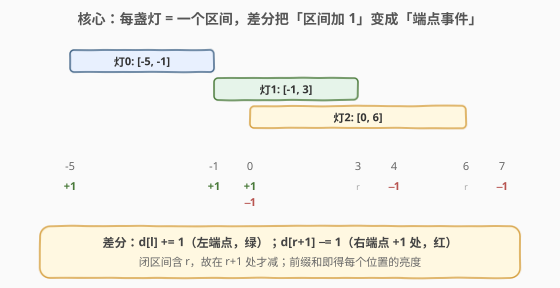
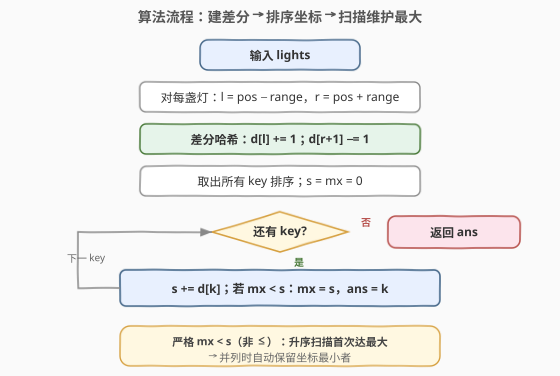
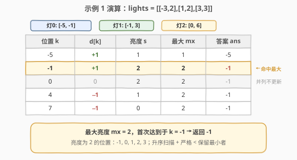

# 街上最亮的位置

- **题目名称**：街上最亮的位置
- **链接**：[2021. 街上最亮的位置](https://leetcode.cn/problems/brightest-position-on-street/)
- **难度**：中等
- **标签**：数组、差分数组、排序、扫描线、前缀和

## 1. 题目概述

一条街上有若干路灯，路灯信息由数组 `lights` 给出。每个 `lights[i] = [position_i, range_i]` 表示坐标为 `position_i` 的路灯照亮的范围为闭区间 `[position_i - range_i, position_i + range_i]`。某位置 `p` 的**亮度**定义为能够照到 `p` 的路灯**数量**。给定 `lights`，返回最亮的位置；若有多个位置亮度相同，返回**坐标最小**的那个。

**示例 1**：

```text
输入：lights = [[-3,2],[1,2],[3,3]]
输出：-1
解释：
第一盏灯照亮 [(-3)-2, (-3)+2] = [-5, -1]
第二盏灯照亮 [1-2, 1+2] = [-1, 3]
第三盏灯照亮 [3-3, 3+3] = [0, 6]
坐标 -1 被第一、二盏灯照亮，亮度为 2；
坐标 0、1、2 被第二、三盏灯照亮，亮度也为 2。
这些亮度为 2 的位置中 -1 最小，故返回 -1。
```

**示例 2**：

```text
输入：lights = [[1,0],[0,1]]
输出：1
解释：第一盏灯照亮 [1,1]，第二盏灯照亮 [-1,1]。坐标 1 被两盏灯同时照亮，亮度为 2，最大，故返回 1。
```

**示例 3**：

```text
输入：lights = [[1,2]]
输出：-1
解释：只有一盏灯照亮 [-1, 3]，该区间内每个位置亮度均为 1，取坐标最小者 -1。
```

**约束条件**：

- `1 <= lights.length <= 10^5`
- `lights[i].length == 2`
- `-10^8 <= position_i <= 10^8`
- `0 <= range_i <= 10^8`

---

## 2. 解题思路

### 2.1 暴力思路：枚举每个位置

最直观的过程式思维：找出所有路灯照亮范围的**最小左端点** `minL` 与**最大右端点** `maxR`，逐个枚举区间内的整数位置 `p`，对每个 `p` 再遍历所有灯统计覆盖它的灯数，取最大者。

时间复杂度 $O(R \cdot n)$，其中 $R = \text{maxR} - \text{minL}$ 为坐标跨度，$n$ 为灯数。然而约束给出坐标范围 $[-10^8, 10^8]$，跨度可达 $2 \times 10^8$，光枚举位置就远超时限，空间上也无法开这么大的数组。

> ⚠️ 暴力思路的真正陷阱不是「两层循环慢」，而是**坐标范围巨大**——即便用差分数组，直接按下标开数组也会爆内存。这把本题从「普通差分」逼到「坐标压缩差分」。

### 2.2 核心观察：差分数组 + 坐标压缩



关键洞察分两层：

**第一层：区间加 → 差分端点事件。** 每盏灯把一段闭区间 $[l, r]$（$l = \text{pos}-\text{range}$，$r = \text{pos}+\text{range}$）整体亮度 $+1$。这是经典的「区间加」问题，标准套路是**差分数组**：

$$d[l] \mathrel{+}= 1,\quad d[r+1] \mathrel{-}= 1$$

随后对 $d$ 求前缀和即得每个位置的亮度。之所以在 $r+1$ 而非 $r$ 处减 $1$，是因为区间**含右端点** $r$——$r$ 仍被照亮，亮度从 $r+1$ 起才下降。

**第二层：坐标压缩 → 哈希表存稀疏事件。** 坐标范围虽大，但真正发生变化的「事件点」只有每盏灯的两个端点，共 $2n$ 个（$n \le 10^5$）。其余位置亮度恒定，无需表示。因此用**哈希表**（`map` / `dict`）只记录有变化的位置及其累计增量，再把这些位置**排序**后扫描，等价于在「压缩后的坐标轴」上求前缀和。

> 💡 这正是「扫描线 / 事件排序」视角：每盏灯拆成两个事件——左端点 $+1$、右端点 $+1$ 处 $-1$。按位置排序后，维护一个「当前亮度」游标 $s$，遇到 $+1$ 事件就升一档、遇到 $-1$ 事件就降一档。任意两个相邻事件之间的亮度恒定，最大值必在某个事件点刚处理完后达到。

**并列取最小**：扫描按位置**升序**进行，更新答案用**严格小于** `mx < s`。这样同一最大亮度只记录最先遇到的位置，即坐标最小者。

### 2.3 算法流程图



整体三段：① 建差分哈希 → ② 取键排序 → ③ 顺扫维护最大。其中「严格 `<`」是并列取最小的关键。

### 2.4 示例演算



以示例 1 `lights = [[-3,2],[1,2],[3,3]]` 为例，三盏灯对应区间 $[-5,-1]$、$[-1,3]$、$[0,6]$，拆成差分事件：

| 位置 $k$ | $d[k]$ | 累加亮度 $s$ | 当前最大 $mx$ | 答案 $ans$ |
|----------|--------|--------------|---------------|------------|
| $-5$ | $+1$ | $1$ | $1$ | $-5$ |
| $-1$ | $+1$ | $2$ | $2$ | $-1$ ← 命中最大 |
| $0$  | $0$  | $2$ | $2$ | $-1$（并列，不更新）|
| $4$  | $-1$ | $1$ | $2$ | $-1$ |
| $7$  | $-1$ | $0$ | $2$ | $-1$ |

> ⚠️ 注意位置 $0$ 的 $d[0]=0$：第三盏灯在 $0$ 处 $+1$、第一盏灯在 $r+1=0$ 处 $-1$，正负抵消。哈希表仍保留该键（值为 $0$），扫描时 $s$ 不变——这正确反映了「位置 $0$ 亮度与位置 $-1$ 相同（均为 $2$）」。由于用严格 `<`，$0$ 不会覆盖 $-1$ 的答案，保证并列取最小。

最终最大亮度 $mx = 2$，答案 $ans = -1$，与示例一致。

---

## 3. 参考代码

### C++

```cpp
class Solution {
  public:
    int brightestPosition(vector<vector<int>>& lights) {
        map<int, int> d;                 // 位置 -> 差分增量（map 自动按 key 升序）
        for (auto& x : lights) {
            int l = x[0] - x[1], r = x[0] + x[1];
            ++d[l];
            --d[r + 1];                  // 闭区间：右端点 r 仍亮，从 r+1 起减
        }
        int ans = 0, s = 0, mx = 0;
        for (auto& [k, v] : d) {
            s += v;
            if (mx < s) {                // 严格小于：并列时只保留最先（坐标最小）者
                mx = s;
                ans = k;
            }
        }
        return ans;
    }
};
```

### Python

```python
class Solution:
    def brightestPosition(self, lights: List[List[int]]) -> int:
        d = defaultdict(int)             # 位置 -> 差分增量
        for pos, rng in lights:
            l, r = pos - rng, pos + rng
            d[l] += 1
            d[r + 1] -= 1                # 闭区间：从 r+1 起减
        ans = s = mx = 0
        for k in sorted(d):              # 取键排序 = 坐标压缩后的扫描顺序
            s += d[k]
            if mx < s:                   # 严格小于：并列取最小坐标
                mx = s
                ans = k
        return ans
```

> 💡 **`map` vs `unordered_map` + `sort`**：C++ 用 `std::map` 可一步到位（插入即有序），常数稍大；改用 `unordered_map` 收集再 `sort(keys)` 通常更快，对应 Python 的 `defaultdict + sorted(d)`。两者复杂度同为 $O(n \log n)$，本解法优先可读性用 `map` / `sorted`。

---

## 4. 复杂度分析

| 维度 | 复杂度 | 说明 |
|------|--------|------|
| 时间复杂度 | $O(n \log n)$ | $2n$ 个端点插入哈希 $O(n)$ + 排序 $O(n \log n)$ + 扫描 $O(n)$；瓶颈在排序 |
| 空间复杂度 | $O(n)$ | 哈希表至多存 $2n$ 个端点 |

> ⚠️ 若误用按下标开数组的普通差分，空间将达 $O(\max R - \min R)$，在 $[-10^8, 10^8]$ 范围下直接爆内存。坐标压缩是本题把空间从 $O(10^8)$ 压回 $O(n)$ 的关键。

---

## 5. 扩展：从「最大重叠数」看同类模型

本题本质是**「区间最大重叠数」**问题——求被最多区间覆盖的点（及其重叠数）。不同约束下有不同最优解法：

| 场景 | 坐标范围 | 推荐解法 | 代表题 |
|------|----------|----------|--------|
| 坐标范围巨大（本题） | $\pm 10^8$ | 差分 + 哈希 + 排序（坐标压缩） | 2021 |
| 坐标范围有限 | 如年份 $1950\sim2050$ | 直接开数组差分 $O(R+n)$ | 1854. 人口最多的年份 |
| 只需判断是否超容量 | — | 差分 + 前缀和 + 阈值比较 | 1094. 拼车 |
| 需要区间查询/单点更新 | — | 线段树 / 树状数组（离散化） | 307. 区域和检索 |

本题只需全局最大值、无需区间查询，扫描线比线段树更轻量。若进一步改成「动态增删灯并实时查询最亮位置」，才需上离散化线段树。

---

## 6. 面试要点

1. **为什么用差分而不是直接枚举位置？**
   - 亮度 = 覆盖该位置的灯数，本质是「区间加 1」的批量操作。差分把 $O(R \cdot n)$ 的逐位置统计压缩为 $O(n)$ 个端点事件，再前缀和还原。配合坐标压缩避开巨大坐标范围。

2. **为什么在 $r+1$ 处减 $1$ 而不是 $r$？**
   - 区间是**闭区间** $[l, r]$，右端点 $r$ 仍被照亮。若在 $r$ 处减 $1$，会把 $r$ 的亮度算少一档。必须在其后一位 $r+1$ 处减，表示「从 $r+1$ 起不再被这盏灯覆盖」。

3. **坐标范围 $10^8$ 为什么不能直接开差分数组？**
   - 跨度可达 $2 \times 10^8$，`int` 数组约 800MB，远超内存限制。但实际有变化的端点只有 $2n \le 2 \times 10^5$ 个，用哈希表只存这些「稀疏事件」即可——这就是坐标压缩。

4. **并列时如何保证返回坐标最小？**
   - 扫描按位置升序进行，更新答案用**严格小于** `mx < s`（而非 `<=`）。这样同一最大亮度只记录第一次达到它的位置，由于升序，第一次即为最小坐标。

5. **`map` 与 `unordered_map + sort` 如何取舍？**
   - `std::map` 插入即有序，代码简洁但常数大（红黑树）；`unordered_map` 收集后再对键排序，平均更快。两者均为 $O(n \log n)$。面试中先写 `map` 讲清思路，再提「可换 `unordered_map + sort` 优化常数」即可。

---

## 7. 同类练习题

- [1109. 航班预订统计](https://leetcode.cn/problems/corporate-flight-bookings/)（[题解](../1101-1200/1109_航班预订统计.md)）：差分数组招牌题，区间加 + 前缀和还原；坐标范围有限可直接开数组
- [1094. 拼车](https://leetcode.cn/problems/car-pooling/)（[题解](../1001-1100/1094_拼车.md)）：差分 + 前缀和判定容量是否超限，本题的「判容量」变体
- [1854. 人口最多的年份](https://leetcode.cn/problems/maximum-population-year/)（[题解](../1801-1900/1854_人口最多的年份.md)）：扫描线求最大重叠年份，坐标范围极小（年份），本题的「小范围」特例
- [56. 合并区间](https://leetcode.cn/problems/merge-intervals/)（[题解](../0001-0100/56_合并区间.md)）：区间排序 + 扫描基础，所有区间题的铺垫
- [253. 会议室 II](https://leetcode.cn/problems/meeting-rooms-ii/)（[题解](../0201-0300/253_会议室II.md)）：扫描线求最大同时重叠数，与本题同构（求重叠数最大值而非位置）
