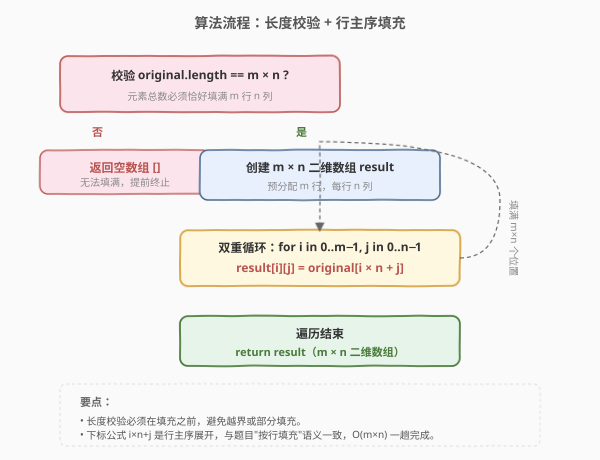

# LeetCode 将一维数组转变成二维数组 题解

## 1. 题目概述

- **标题 / 题号**：将一维数组转变成二维数组（#2022，easy）
- **链接**：https://leetcode.cn/problems/convert-1d-array-into-2d-array/
- **难度**：简单
- **标签**：数组、模拟、索引映射

**题意**：给你一个下标从 **0** 开始的一维整数数组 `original` 和两个整数 `m` 和 `n`。你需要使用 `original` 中**所有**元素创建一个 `m` 行 `n` 列的二维数组。

`original` 中下标从 `0` 到 `n - 1`（都**包含**）的元素构成二维数组的第一行，下标从 `n` 到 `2 * n - 1`（都**包含**）的元素构成二维数组的第二行，依此类推。

请你根据上述过程返回一个 `m x n` 的二维数组。如果无法构成这样的二维数组，请你返回一个空的二维数组。

**示例 1**：

```text
输入：original = [1,2,3,4], m = 2, n = 2
输出：[[1,2],[3,4]]
解释：构造出的二维数组应该包含 2 行 2 列。
original 中第一个 n=2 的部分为 [1,2]，构成二维数组的第一行。
original 中第二个 n=2 的部分为 [3,4]，构成二维数组的第二行。
```

**示例 2**：

```text
输入：original = [1,2,3], m = 1, n = 3
输出：[[1,2,3]]
解释：构造出的二维数组应该包含 1 行 3 列。
将 original 中所有三个元素放入第一行中，构成要求的二维数组。
```

**示例 3**：

```text
输入：original = [1,2], m = 1, n = 1
输出：[]
解释：original 中有 2 个元素。
无法将 2 个元素放入到一个 1x1 的二维数组中，所以返回一个空的二维数组。
```

**示例 4**：

```text
输入：original = [3], m = 1, n = 2
输出：[]
解释：original 中只有 1 个元素。
无法将 1 个元素放满一个 1x2 的二维数组中，所以返回一个空的二维数组。
```

**约束**：

- $1 \le \text{original.length} \le 5 \times 10^4$
- $1 \le \text{original[i]} \le 10^5$
- $1 \le m, n \le 4 \times 10^4$

> 💡 题目本质是把一维数组「重塑（reshape）」为 `m × n` 的二维数组。能重塑的唯一前提是元素总数恰好等于 $m \times n$；而填充顺序被明确指定为「按行主序」——前 $n$ 个成第 0 行，接下来 $n$ 个成第 1 行。

## 2. 解题思路

### 2.1 暴力思路：逐行切片拼接

最直观的做法是模拟题目描述的过程：用 `n` 作为步长，把 `original` 切成 $m$ 段长度为 $n$ 的子数组，每段作为一行拼到结果里。

```text
ans = []
for i in 0..m-1:
    row = original[i*n : (i+1)*n]
    ans.append(row)
return ans
```

但这里有个前置陷阱：**如果 `original.length ≠ m × n`，切片会让最后一行短缺或溢出**，此时题目要求返回空数组。所以必须先做长度校验。校验通过后，上面的切片法就能直接工作。

### 2.2 核心观察：下标映射公式 `idx = i × n + j`

![核心观察：一维下标 idx = i × n + j 映射到二维 [i][j]](../images/c1d2d_concept.svg)

关键观察：

- 题目规定的填充方式正是**行主序（row-major）**——逐行填满 $n$ 列再进入下一行。而行主序下，二维下标 $(i, j)$ 与一维下标 `idx` 的换算关系是一个固定代数公式：

$$\text{idx} = i \times n + j$$

- 因此无需任何「切片」或「搬运」，只需一次双重循环，对每个 $(i, j)$ 直接用公式取 `original[i * n + j]` 写入 `result[i][j]`。

- **前置条件**：能这样一一对应的前提是 `original` 的元素总数恰好等于 $m \times n$。所以算法第一步必须是长度校验：`original.length == m * n`，不等则直接返回空数组 `[]`。

> 💡 **为什么公式一定对？** 行主序存储的二维数组在内存中就是「第 0 行 $n$ 个、第 1 行 $n$ 个……」连续铺开。第 $i$ 行第 $j$ 列前面已经铺了 $i \times n + j$ 个元素，所以它对应一维下标 $i \times n + j$。题目描述的「前 $n$ 个成第 0 行，接下来 $n$ 个成第 1 行」与行主序完全一致，公式成立。

> ⚠️ 注意 $m, n$ 可达 $4 \times 10^4$，乘积 $m \times n$ 最大约 $1.6 \times 10^9$，在 C++/Python 中用 `int` 存储已可能溢出（C++ `int` 通常 32 位，上界约 $2.1 \times 10^9$，本题刚好不溢出但接近上限）。题目同时保证 `original.length ≤ 5×10^4`，因此实际有效的 $m \times n$ 不会超过 $5 \times 10^4$，校验时先比较长度即可避免大数运算的风险。

### 2.3 算法流程图



流程分为两个阶段：

1. **校验阶段**：判断 `original.length == m × n`，不等则返回 `[]`，提前终止。
2. **填充阶段**：创建 `m × n` 二维数组，双重循环遍历 $(i, j)$，用 `result[i][j] = original[i * n + j]` 填充，遍历结束返回 `result`。

### 2.4 示例演算

以 `original = [1,2,3,4], m = 2, n = 2` 为例逐步演算：

![示例演算：original=[1,2,3,4], m=2, n=2](../images/c1d2d_example_walkthrough.svg)

| 步骤 | $(i, j)$ | $\text{idx} = i \times n + j$ | $\text{original[idx]}$ | $\text{result[i][j]}$ |
|------|----------|-------------------------------|------------------------|------------------------|
| 1 | $(0, 0)$ | $0 \times 2 + 0 = 0$ | $1$ | $1$ |
| 2 | $(0, 1)$ | $0 \times 2 + 1 = 1$ | $2$ | $2$ |
| 3 | $(1, 0)$ | $1 \times 2 + 0 = 2$ | $3$ | $3$ |
| 4 | $(1, 1)$ | $1 \times 2 + 1 = 3$ | $4$ | $4$ |

最终 `result = [[1,2],[3,4]]`，与示例一致。

对照反例 `original = [1,2], m = 1, n = 1`：长度校验 $2 \neq 1 \times 1 = 1$，校验失败，直接返回 `[]`，无需进入填充阶段。

## 3. 参考代码

### C++

```cpp
class Solution {
  public:
    vector<vector<int>> construct2DArray(vector<int>& original, int m, int n) {
        if ((int)original.size() != m * n) {
            return {};
        }
        vector<vector<int>> result(m, vector<int>(n));
        for (int i = 0; i < m; ++i) {
            for (int j = 0; j < n; ++j) {
                result[i][j] = original[i * n + j];
            }
        }
        return result;
    }
};
```

### Python

```python
class Solution:
    def construct2DArray(self, original: List[int], m: int, n: int) -> List[List[int]]:
        if len(original) != m * n:
            return []
        result = [[0] * n for _ in range(m)]
        for i in range(m):
            for j in range(n):
                result[i][j] = original[i * n + j]
        return result
```

> 💡 **Python 切片一行写法**：校验通过后，可直接用切片按行取，避免显式双重循环：
>
> ```python
> if len(original) != m * n:
>     return []
> return [original[i * n : (i + 1) * n] for i in range(m)]
> ```
>
> 这等价于「每行取连续 $n$ 个」，底层仍是行主序映射，但更贴合 Python 习惯。两种写法复杂度一致，切片版常数更小（C 层批量拷贝）。

> ⚠️ **避免的写法**：不做长度校验直接按 `m` 行切片，当 `original.length < m × n` 时会产生不足 $n$ 个的「短行」，与题目「无法构成返回空数组」的要求矛盾。校验必须前置。

## 4. 复杂度分析

| 维度 | 复杂度 | 说明 |
|------|--------|------|
| 时间复杂度 | $O(m \times n)$ | 双重循环遍历 $m \times n$ 个位置，每步 $O(1)$ 取值赋值；由于 $m \times n = \text{original.length} \le 5 \times 10^4$，即 $O(\text{len})$ |
| 空间复杂度 | $O(m \times n)$ | 输出数组本身占 $m \times n$，不计输出则为 $O(1)$ 额外空间 |

> 💡 本题时间复杂度已是下界——至少要把 $m \times n$ 个元素都读一遍、写一遍，无法比 $O(m \times n)$ 更优。长度校验是 $O(1)$，不影响整体复杂度。

## 5. 扩展：reshape 的通用视角

本题是 NumPy `reshape` 操作的最简形态：把一个形状为 `(m*n,)` 的一维数组重塑为 `(m, n)` 的二维数组。理解它的关键在于「**存储顺序**」与「**下标代数**」的对应：

- **行主序（C order，默认）**：`idx = i × n + j`，最后一维变化最快。C/C++、NumPy 默认、本题均采用此序。
- **列主序（Fortran order）**：`idx = j × m + i`，第一维变化最快。Fortran、MATLAB、部分 BLAS 库采用。

推广到更高维：一个形状为 $(d_0, d_1, \dots, d_{k-1})$ 的 $k$ 维数组按行主序展开为一维时，下标 $(i_0, i_1, \dots, i_{k-1})$ 对应：

$$\text{idx} = \sum_{t=0}^{k-1} i_t \prod_{s=t+1}^{k-1} d_s$$

即「逐维累乘」。本题 $k=2$ 时退化为 $i \times n + j$。

> 💡 类比 [566. 重塑矩阵](https://leetcode.cn/problems/reshape-the-matrix/)：那题是反向操作——把 `m×n` 矩阵重塑为 `r×c`，同样需要先校验 `m×n == r×c`，再用行主序公式 `mat[i][j] → ans[i*n+j / c][i*n+j % c]` 映射。两题互为逆操作，核心都是「行主序下标代数」。

## 6. 面试要点

1. **为什么必须先做长度校验？**

   - 题目要求「无法构成返回空数组」。若 `original.length ≠ m × n`，按行主序填充必然出现最后一行短缺或元素剩余，无法构成完整的 `m × n` 网格。校验前置既满足题意，又避免后续越界访问。

2. **下标公式 `i × n + j` 是怎么推导出来的？**

   - 行主序下，第 $i$ 行之前已有 $i$ 个完整行（每行 $n$ 个），共 $i \times n$ 个元素；再加上当前行内第 $j$ 列之前的 $j$ 个，总偏移即为 $i \times n + j$。这与题目「前 $n$ 个成第 0 行」的描述完全吻合。

3. **能否不创建新数组，原地完成？**

   - 不能。一维数组与二维数组的内存布局不同（一维连续 vs. 二维需 $m$ 个独立行指针），无法原地「重解释」。必须分配新的二维结构并逐元素复制。

4. **`m × n` 乘积可能很大，会有溢出风险吗？**

   - 题目约束 $m, n \le 4 \times 10^4$，乘积最大约 $1.6 \times 10^9$，C++ 32 位 `int`（上界约 $2.1 \times 10^9$）刚好能容纳。但若约束更宽松，建议先比较 `original.length` 与 $m$、$n$ 的关系（如 `original.length % n == 0` 且 `original.length / n == m`），用除法/取模代替乘法校验，规避溢出。

5. **切片写法（Python）和双重循环写法有何区别？**

   - 结果等价，复杂度一致。切片 `original[i*n:(i+1)*n]` 在 CPython 底层走 C 层批量内存拷贝，常数更小；双重循环更显式，便于跨语言迁移。面试中 Python 可优先切片版，同时能讲清「行主序」本质即可。

## 同类练习题

| # | 题目 | 与本题的关联 |
|---|------|-------------|
| 566 | [重塑矩阵](https://leetcode.cn/problems/reshape-the-matrix/) | 本题的逆操作，把 `m×n` 重塑为 `r×c`，同样需长度校验 + 行主序下标映射 |
| 1883 | [准时抵达会议现场的最小跳过休息次数](https://leetcode.cn/problems/minimum-skips-to-arrive-at-meeting-on-time/) | 一维前缀与分段处理的思路对照（不同模型但同样涉及「按段划分」的索引计算） |
| 54 | [螺旋矩阵](https://leetcode.cn/problems/spiral-matrix/) | 二维到一维的反向重塑，但遍历顺序为螺旋而非行主序，对照理解「存储顺序」对下标映射的影响 |
| 59 | [螺旋矩阵 II](https://leetcode.cn/problems/spiral-matrix-ii/) | 一维生成填入二维但按螺旋序，与本题的行主序填充形成对照 |
