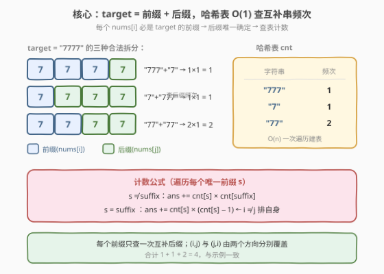
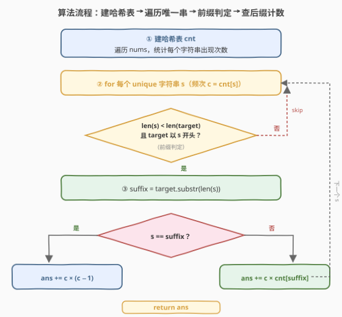
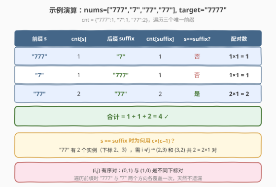

# LeetCode 连接后等于目标字符串的字符串对 题解

## 1. 题目概述

- **标题 / 题号**：连接后等于目标字符串的字符串对（#2023，medium）
- **链接**：https://leetcode.cn/problems/number-of-pairs-of-strings-with-concatenation-equal-to-target/
- **难度**：中等
- **标签**：哈希表、字符串、计数

**题意**：给定一个**数字**字符串数组 `nums` 和一个**数字**字符串 `target`，返回满足 `nums[i] + nums[j]`（字符串连接）等于 `target` 且 `i != j` 的下标对 `(i, j)` 的数目。

**示例 1**：

```text
输入：nums = ["777","7","77","77"], target = "7777"
输出：4
解释：符合要求的下标对包括：
- (0, 1)："777" + "7"
- (1, 0)："7" + "777"
- (2, 3)："77" + "77"
- (3, 2)："77" + "77"
```

**示例 2**：

```text
输入：nums = ["123","4","12","34"], target = "1234"
输出：2
解释：符合要求的下标对包括：
- (0, 1)："123" + "4"
- (2, 3)："12" + "34"
```

**示例 3**：

```text
输入：nums = ["1","1","1"], target = "11"
输出：6
解释：6 个有序对 (0,1),(1,0),(0,2),(2,0),(1,2),(2,1) 均满足 "1"+"1"="11"
```

**约束**：

- $2 \le \text{nums.length} \le 100$
- $1 \le \text{nums[i].length} \le 100$
- $2 \le \text{target.length} \le 100$
- `nums[i]` 和 `target` 只包含数字
- `nums[i]` 和 `target` 不含有任何前导 0

> 💡 **审题关键**：① 下标对 $(i, j)$ 是**有序**的——$(0,1)$ 与 $(1,0)$ 算两对；② $i \neq j$，同一元素不能与自身配对；③ 连接是**字符串拼接**而非数值相加——`"7"+"777"="7777"` 而非 $7+777=784$。

## 2. 解题思路

### 2.1 暴力思路：双重循环枚举所有下标对

最直觉的做法是枚举所有 $i \neq j$ 的下标对，逐对拼接 `nums[i] + nums[j]` 并与 `target` 比较：

```text
ans = 0
for i in range(n):
    for j in range(n):
        if i != j and nums[i] + nums[j] == target:
            ans += 1
return ans
```

$n \le 100$，$O(n^2 \cdot L) \approx 100 \times 100 \times 100 = 10^6$，完全可以 AC。但每对都要做一次长度至多 100 的字符串拼接与比较，常数偏大。突破口在于：**`target` 是固定的**——若 `nums[i]` 是 `target` 的前缀，则 `nums[j]` 必须等于 `target` 去掉该前缀后的后缀，二者一一对应，可用哈希表 $O(1)$ 查出后缀出现次数。

### 2.2 核心观察：哈希表 + 前缀拆分



**问题本质**：这是一道**字符串版两数之和**——把「数值相加等于 target」替换为「字符串拼接等于 target」。核心观察有三点：

**观察 ①：前缀唯一确定后缀**

$$\text{nums}[i] + \text{nums}[j] = \text{target} \iff \text{nums}[i] \text{ 是 target 的前缀，且 } \text{nums}[j] = \text{target}[\text{len}(\text{nums}[i]):]$$

若 `nums[i]` 长度为 $k$ 且是 `target` 的前 $k$ 个字符，则 `nums[j]` **必须**等于 `target` 的第 $k$ 位之后的后缀子串。前缀一旦确定，后缀就唯一确定——无需枚举 $j$，直接查哈希表即可。

> ⚠️ **前置条件**：`nums[i]` 的长度必须**小于** `target` 的长度，否则拼接后总长度 $> \text{len}(\text{target})$，不可能相等。同时 `target` 必须以 `nums[i]` 开头（前缀匹配）。

**观察 ②：哈希表频次计数——一次查表代替一层循环**

先用一次 $O(n)$ 遍历建立哈希表 `cnt`，记录每个字符串的出现次数。之后对每个唯一前缀 $s$，只需查一次 `cnt[suffix]` 即得到所有可配对 $j$ 的数目：

- 若 $s \neq \text{suffix}$：配对数 $= \text{cnt}[s] \times \text{cnt}[\text{suffix}]$（$s$ 的每个实例作 $i$，$\text{suffix}$ 的每个实例作 $j$，全部合法因为 $i$、$j$ 来自不同字符串值）。
- 若 $s = \text{suffix}$：配对数 $= \text{cnt}[s] \times (\text{cnt}[s] - 1)$（同一字符串值，需排除 $i = j$，即排列数 $A(n,2) = n(n-1)$）。

**观察 ③：有序对天然覆盖——遍历前缀不重复**

下标对 $(i, j)$ 是**有序**的。遍历每个唯一字符串作为前缀时：
- $s = \text{"777"}, \text{suffix} = \text{"7"}$：覆盖所有 `nums[i]="777", nums[j]="7"` 的对，如 $(0,1)$。
- $s = \text{"7"}, \text{suffix} = \text{"777"}$：覆盖所有 `nums[i]="7", nums[j]="777"` 的对，如 $(1,0)$。

两个方向各遍历一次，$(i,j)$ 与 $(j,i)$ **天然分别覆盖**，无需额外乘 2。当 $s = \text{suffix}$ 时，$c \times (c-1)$ 本身就是有序排列数（已含两个方向）。

> 💡 **与两数之和的对照**：经典两数之和（第 1 题）找**无序**对 $\{i, j\}$（$i < j$），故查表时只看「之前见过」的元素；本题找**有序**对 $(i, j)$（$i \neq j$），故遍历所有唯一串作前缀，两个方向各覆盖一次。这是有序 vs 无序在计数策略上的核心差异。

### 2.3 算法流程图



**逻辑执行步骤**：

| 步骤 | 操作 | 作用 |
|------|------|------|
| ① | 遍历 `nums`，建哈希表 `cnt` | $O(n)$ 统计每个字符串频次 |
| ② | 遍历每个唯一字符串 $s$（频次 $c$） | 作为候选前缀 |
| ③ | 判定 `len(s) < len(target)` 且 `target` 以 $s$ 开头 | 前缀匹配，不满足则 skip |
| ④ | `suffix = target.substr(len(s))` | 截取互补后缀 |
| ⑤ | $s = \text{suffix}$？`ans += c×(c−1)` : `ans += c×cnt[suffix]` | 累加配对数 |
| ⑥ | 返回 `ans` | — |

> ⚠️ **前缀判定的两道闸门**：① 长度闸——`len(s) >= len(target)` 时拼接后必定更长，直接 skip；② 匹配闸——`target` 不以 $s$ 开头则后缀无意义，skip。两道闸门把大多数候选串在 $O(1)$ 内排除。

### 2.4 示例演算

以示例 1 `nums = ["777","7","77","77"], target = "7777"` 为例，逐步观察哈希表 + 前缀拆分的完整过程：



**第一步：建哈希表**

| 字符串 | 频次 |
|--------|------|
| `"777"` | 1 |
| `"7"` | 1 |
| `"77"` | 2 |

**第二步：遍历唯一前缀，逐个查互补后缀**

| 前缀 $s$ | $\text{cnt}[s]$ | 后缀 $\text{suffix}$ | $\text{cnt}[\text{suffix}]$ | $s = \text{suffix}$？ | 配对数 |
|----------|-----------------|----------------------|----------------------------|----------------------|--------|
| `"777"` | 1 | `"7"` | 1 | 否 | $1 \times 1 = 1$ |
| `"7"` | 1 | `"777"` | 1 | 否 | $1 \times 1 = 1$ |
| `"77"` | 2 | `"77"` | 2 | 是 | $2 \times 1 = 2$ |

**第三步：合计**

$$\text{ans} = 1 + 1 + 2 = 4$$

> 💡 **观察要点**：① `"777"` 与 `"7"` 互为前后缀，两个方向各贡献 1 对——有序对的两个方向被遍历前缀天然覆盖；② `"77"` 的 $s = \text{suffix}$，2 个实例（下标 2、3）产生有序排列 $A(2,2) = 2 \times 1 = 2$ 对，即 $(2,3)$ 与 $(3,2)$；③ `"4"` 等不在 `target` 前缀中的字符串被前缀判定闸门直接跳过。

## 3. 参考代码

### C++（哈希表 + 前缀拆分，推荐）

```cpp
class Solution {
  public:
    int numOfPairs(vector<string>& nums, string target) {
        unordered_map<string, int> cnt;
        for (string& s : nums) cnt[s]++;

        int ans = 0;
        int n = target.size();
        for (auto& [s, c] : cnt) {
            int len = s.size();
            if (len >= n) continue;                       // 长度闸：拼接后必超 target
            if (target.compare(0, len, s) != 0) continue; // 匹配闸：target 不以 s 开头
            string suffix = target.substr(len);
            auto it = cnt.find(suffix);
            if (it == cnt.end()) continue;
            if (s == suffix) ans += c * (c - 1);          // 同串：排列数 A(c,2)
            else ans += c * it->second;                   // 异串：直接乘
        }
        return ans;
    }
};
```

> 💡 **写法要点**：
> - **`target.compare(0, len, s)`**：比较 `target` 的前 `len` 个字符与 `s`，相等返回 0。比 `target.substr(0, len) == s` 少一次子串构造，更高效。
> - **遍历 `cnt` 的唯一键**：每个字符串值只处理一次，避免重复。`c = cnt[s]` 是该字符串的出现次数。
> - **`s == suffix` 分支**：同一字符串值自我配对时，需排除 $i = j$，用排列数 $c \times (c-1)$ 而非 $c \times c$。

### C++（暴力双重循环，对照）

```cpp
class Solution {
  public:
    int numOfPairs(vector<string>& nums, string target) {
        int ans = 0, n = nums.size();
        for (int i = 0; i < n; ++i)
            for (int j = 0; j < n; ++j)
                if (i != j && nums[i] + nums[j] == target)
                    ++ans;
        return ans;
    }
};
```

> 💡 $n \le 100$ 时暴力 $O(n^2 L)$ 约 $10^6$ 次操作即可 AC，代码极简。哈希表法的优势在 $n$ 更大时（本题数据范围小，两种写法均可）。

### Python

```python
class Solution:
    def numOfPairs(self, nums: List[str], target: str) -> int:
        from collections import Counter
        cnt = Counter(nums)
        ans = 0
        n = len(target)
        for s, c in cnt.items():
            if len(s) >= n or not target.startswith(s):
                continue
            suffix = target[len(s):]
            if suffix not in cnt:
                continue
            if s == suffix:
                ans += c * (c - 1)
            else:
                ans += c * cnt[suffix]
        return ans
```

> 💡 **pandas 对照**：`Counter(nums)` 对应 C++ 的 `unordered_map` 建表；`target.startswith(s)` 对应 `target.compare(0, len, s) == 0` 前缀判定；`target[len(s):]` 对应 `target.substr(len)` 后缀截取。逻辑完全同构。

## 4. 复杂度分析

| 维度 | 哈希表 + 前缀拆分 | 暴力双重循环 |
|------|-------------------|-------------|
| **时间** | $O(n \cdot L)$ | $O(n^2 \cdot L)$ |
| **空间** | $O(n \cdot L)$ | $O(1)$ |
| **哈希操作** | $n$ 次插入 + 至多 $n$ 次查找 | 无 |
| **适用场景** | $n$ 大时优势明显 | $n$ 小时代码最简 |

> - $n$ = `nums` 数组长度，$L$ = 字符串最大长度（$\le 100$）
> - **时间**：建表 $O(n \cdot L)$（$n$ 次插入，每次哈希计算 $O(L)$）；遍历唯一键至多 $n$ 个，每次前缀判定 $O(L)$ + 后缀截取 $O(L)$ + 哈希查找 $O(L)$。总体 $O(n \cdot L)$。
> - **空间**：哈希表存储至多 $n$ 个键值对，每键长度 $\le L$，总计 $O(n \cdot L)$。
> - 暴力法无需额外空间，但时间多一个 $n$ 因子。本题 $n \le 100$，两种写法均远在时限内。

## 5. 扩展：有序对 vs 无序对——与两数之和的范式对照

### 5.1 计数策略的差异

| 维度 | 第 1 题 两数之和 | 本题 连接后等于目标串 |
|------|-----------------|---------------------|
| **配对类型** | 无序对 $\{i, j\}$，$i < j$ | 有序对 $(i, j)$，$i \neq j$ |
| **查表时机** | 边遍历边查「之前见过」的元素 | 先建全表，再遍历唯一键查互补 |
| **查表方向** | 单向：当前元素查 complement | 双向：$s$ 查 suffix、suffix 查 $s$ 各一次 |
| **同值处理** | 同值互补时（如 $x + x = \text{target}$）需小心 | $s = \text{suffix}$ 时用 $c \times (c-1)$ 排自身 |
| **输出** | 返回任一合法下标对 | 返回合法对的总数 |

### 5.2 为什么本题先建全表再查？

两数之和找**无序**对，只需对每个 $j$ 查「之前是否出现过 $\text{target} - \text{nums}[j]$」，保证 $i < j$ 不重不漏。本题找**有序**对，$(i, j)$ 与 $(j, i)$ 都要算。若沿用「边遍历边查」策略，每个方向需遍历两遍（一次作前缀、一次作后缀），不如先建全表、再统一遍历唯一键来得清晰——每个唯一字符串作前缀时，其后缀的出现次数直接从表中读出，两个方向天然由不同的前缀覆盖。

> 💡 **一句话总结**：有序对计数 → 先建全表 + 遍历唯一键查互补；无序对查找 → 边遍历边查前驱。配对有序性决定查表策略。

## 6. 面试要点

1. **为什么遍历哈希表的唯一键而非原数组？**

   > 遍历唯一键保证每个字符串值只处理一次。若遍历原数组，相同字符串会重复计算——例如 `"77"` 出现 2 次，遍历到第 2 个时会重复加 `cnt["77"] × (cnt["77"]-1)`。遍历 `cnt.items()` 天然去重，每个前缀只算一次。

2. **$s = \text{suffix}$ 时为什么用 $c \times (c-1)$ 而非 $c \times c$？**

   > $s = \text{suffix}$ 意味着前缀和后缀是同一个字符串值，如 `"77"` + `"77"` = `"7777"`。此时 $i$ 和 $j$ 可能指向同一下标（同一元素），但题目要求 $i \neq j$。$c$ 个实例中选有序不重复对 $(i, j)$ 的数目是排列数 $A(c, 2) = c \times (c-1)$，而非 $c^2$（后者包含了 $i = j$ 的 $c$ 个非法对）。

3. **前缀判定的两道闸门分别排除什么？**

   > ① **长度闸** `len(s) >= len(target)`：拼接两个非空字符串后总长度 $> \text{len}(\text{target})$（因 `nums[j]` 至少 1 字符），不可能相等，直接 skip。② **匹配闸** `target` 不以 $s$ 开头：即使长度合法，若 `target` 的前 `len(s)` 位与 $s$ 不同，拼接后前缀就不匹配，后缀再正确也无用，skip。

4. **有序对 $(i, j)$ 的两个方向如何保证不遗漏不重复？**

   > 遍历每个唯一字符串 $s$ 作前缀时，只统计 `nums[i] = s` 且 `nums[j] = suffix` 的对。当 $s \neq \text{suffix}$ 时，$s$ 与 $\text{suffix}$ 是不同的字符串值，$(i \in s\text{组}, j \in \text{suffix组})$ 与 $(i \in \text{suffix组}, j \in s\text{组})$ 由两次不同的前缀遍历分别覆盖。当 $s = \text{suffix}$ 时，$c \times (c-1)$ 已含两个方向的有序排列。每个唯一键只遍历一次，不重复。

5. **暴力法和哈希表法在本题数据范围下的取舍？**

   > $n \le 100$，暴力 $O(n^2 L) \approx 10^6$ 完全可 AC，代码仅 5 行。哈希表法 $O(nL)$ 更优但代码稍长。面试中可先写暴力说清思路，再主动优化到哈希表——展示从 $O(n^2)$ 到 $O(n)$ 的优化意识，这正是面试官想看到的。

> 💡 **一句话总结**：本题核心是「**字符串版两数之和 + 有序对计数**」——前缀确定后缀、哈希表查频次；$s = \text{suffix}$ 时用排列数 $c(c-1)$ 排自身；遍历唯一键保证有序对两个方向不重不漏。

## 同类练习题

| # | 题目 | 与本题的关联 |
|---|------|-------------|
| 1 | [两数之和](https://leetcode.cn/problems/two-sum/)（[题解](../0001-0100/1_两数之和.md)） | 哈希表找数对的母题——本题的字符串拼接版，对比有序对（本题）与无序对（第 1 题）在查表策略上的差异 |
| 454 | [四数相加 II](https://leetcode.cn/problems/4sum-ii/)（[题解](../0401-0500/454_四数相加%20II.md)） | 分组 + 哈希计数配对（Meet in the Middle），与本题同属「哈希表统计互补对数目」范式 |
| 2001 | [可互换矩形的数对](https://leetcode.cn/problems/number-of-pairs-of-interchangeable-rectangles/)（[题解](../2001-2100/2001_可互换矩形的数对.md)） | 哈希表统计可配对数对——同目录姊妹题，对比「比例化简后查频次」与本题的「前缀拆分后查后缀」 |
| 1512 | [好数对的数目](https://leetcode.cn/problems/number-of-good-pairs/)（[题解](../1501-1600/1512_好数对的数目.md)） | 计数满足 `nums[i] == nums[j]` 的下标对——最简洁的哈希计数配对题，承接本题的 $c \times (c-1)$ 排列计数 |
| 2341 | [数组能形成多少数对](https://leetcode.cn/problems/maximum-number-of-pairs-in-array/) | 哈希频次统计配对数——同为「频次表 + 配对计数」家族，对比无序配对（凑对后消耗）与本题的有序排列计数 |
