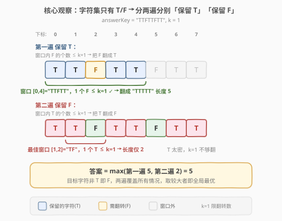
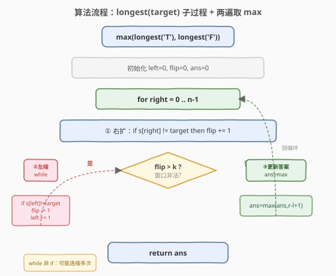
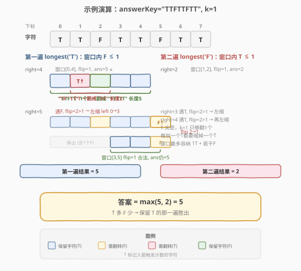

# LeetCode 考试的最大困惑度 题解

## 1. 题目概述

- **标题 / 题号**：考试的最大困惑度（#2024，medium）
- **链接**：https://leetcode.cn/problems/maximize-the-confusion-of-an-exam/
- **难度**：中等
- **标签**：字符串、滑动窗口、双指针

**题意**：一场考试有 `n` 道题，每道题的答案是 `'T'`（True）或 `'F'`（False）。一位老师正在批阅，但他想知道：如果允许学生**修改最多 `k` 道题的答案**（把 `'T'` 改成 `'F'` 或反之），学生能获得的**最长连续同答案子串**的长度是多少？这个长度即"考试的最大困惑度"。

**示例 1**：

```text
输入：answerKey = "TTFF", k = 2
输出：4
解释：可以把两个 F 都改成 T（或两个 T 都改成 F），整串变成 "TTTT"（或 "FFFF"），长度 4。
```

**示例 2**：

```text
输入：answerKey = "TFFT", k = 1
输出：3
解释：取子串 "TFF"（下标 0..2），把唯一的 T 改成 F → "FFF"，长度 3。
      或取子串 "FFT"（下标 1..3），把唯一的 T 改成 F → "FFF"，长度 3。
```

**示例 3**：

```text
输入：answerKey = "TTFTTFTT", k = 1
输出：5
解释：取子串 "TTFTT"（下标 0..4），把中间的 F 改成 T → "TTTTT"，长度 5。
```

**约束**：

- `n == answerKey.length`
- $1 \leq n \leq 5 \times 10^4$
- `answerKey[i]` 为 `'T'` 或 `'F'`
- $1 \leq k \leq n$

> 💡 **直觉转化**：「修改至多 `k` 道题使一段全相同」等价于「**选一段连续子串，其中少数派字符的个数不超过 `k`**」——把这些少数派全改成多数派即可。于是问题归约为：**求「少数派个数 $\leq k$」的最长子串**。

## 2. 解题思路

### 2.1 暴力思路：枚举所有子串

枚举所有子串 `[i, j]`，统计其中 `T` 与 `F` 的个数，若 $\min(\text{cntT}, \text{cntF}) \leq k$（即少数派不超过 `k`），则用其长度更新答案。三重循环（枚举两端 + 内部计数），最坏 $O(n^3)$；即便用前缀和把计数降到 $O(1)$，枚举两端仍 $O(n^2)$，在 $n = 5 \times 10^4$ 时超时。

> 💡 暴力的浪费在于：相邻子串的字符计数高度重叠，每次重新统计。其实只需维护一个**滑动窗口**内的少数派个数，右扩 / 左缩各 $O(1)$ 增量更新即可。

### 2.2 核心观察：两遍「至多 K 型」滑动窗口



关键观察：本题字符集**只有 `T` 与 `F` 两种**。要把一段子串改成「全相同」，目标字符非 `T` 即 `F`。于是可以**分两遍**独立求解，再取最大值：

- **第一遍（保留 `T`）**：求最长窗口，使其中 `F` 的个数 $\leq k$（把这些 `F` 全改成 `T`）。
- **第二遍（保留 `F`）**：求最长窗口，使其中 `T` 的个数 $\leq k$（把这些 `T` 全改成 `F`）。

两遍各自就是一道 [1004. 最大连续1的个数III](../1001-1100/1004_最大连续1的个数III.md)——把 `F`（或 `T`）当作需要"翻转"的对象，限制翻转次数 $\leq k$，求最长窗口。

> 💡 **为什么两遍就够了？** 一段全相同的子串，其目标字符要么是 `T` 要么是 `F`，别无第三种。若最优解是把某段改成全 `T`，那它一定在第一遍被找到；若是全 `F`，则第二遍被找到。取两者最大即为全局最优。这比 [424. 替换后的最长重复字符](../0401-0500/424_替换后的最长重复字符.md) 的通用「`maxFreq` + 窗口长度」写法更直观——因为字符集只有两种，**枚举目标字符**（$O(|\Sigma|) = O(2)$）比维护最大频率更简单清晰。

### 2.3 算法流程图



抽出一个公共子过程 `longest(target)`：求最长窗口，使窗口内**非 `target` 字符**的个数 $\leq k$。

维护变量：

- `left`：窗口左端点，初始 `0`；
- `flip`：当前窗口内需要翻转（即非 `target`）的字符个数，初始 `0`；
- `ans`：本遍已找到的最长长度，初始 `0`。

**主循环**（`right` 从 `0` 到 `n-1`）：

1. 右扩：若 `answerKey[right] != target`，`flip += 1`。
2. **当** `flip > k` 时（窗口非法）：
   - 若 `answerKey[left] != target`，`flip -= 1`；
   - `left += 1`；
   - 重复本步直到 `flip <= k`。
3. 更新 `ans = max(ans, right - left + 1)`。

最终答案 = `max(longest('T'), longest('F'))`。

> ⚠️ **注意是 `while` 不是 `if`**：一次右扩可能让 `flip` 远超 `k`（连续遇到多个需翻转的字符），需要连续左缩多次才能让窗口重新合法。

### 2.4 示例演算

以 `answerKey = "TTFTTFTT", k = 1` 为例，下表给出两遍滑窗的关键步（省略未触发左缩的步）：



**第一遍 `longest('T')`**（窗口内 `F` 的个数 $\leq 1$）：

| right | 字符 | flip（入窗后） | 左缩过程 | 窗口 | ans |
|-------|------|----------------|----------|------|-----|
| 0 | T | 0 | — | [0, 0] | 1 |
| 1 | T | 0 | — | [0, 1] | 2 |
| 2 | F | 1 | — | [0, 2] | 3 |
| 4 | T | 1 | — | [0, 4] | 5 ⭐ |
| 5 | F | 2 | left 0→3，flip 2→1 | [3, 5] | 5 |
| 7 | T | 1 | — | [3, 7] | 5 |

`right = 4` 时窗口 `[0, 4] = "TTFTT"` 内仅 1 个 `F`，长度 5 达到峰值。`right = 5` 再遇 `F`，`flip` 升到 2 超过 `k`，`left` 一路右移到 3（把下标 0、1、2 依次移出，移出下标 2 的 `F` 时 `flip` 降回 1）。**第一遍结果 `5`**。

**第二遍 `longest('F')`**（窗口内 `T` 的个数 $\leq 1`）：

| right | 字符 | flip（入窗后） | 左缩过程 | 窗口 | ans |
|-------|------|----------------|----------|------|-----|
| 0 | T | 1 | — | [0, 0] | 1 |
| 1 | T | 2 | left 0→1，flip 2→1 | [1, 1] | 1 |
| 2 | F | 1 | — | [1, 2] | 2 |
| 3 | T | 2 | left 1→2，flip 2→1 | [2, 3] | 2 |
| 5 | F | 1 | — | [4, 5] | 2 |
| 7 | T | 2 | left 5→7，flip 2→1 | [7, 7] | 2 |

`T` 太密集，`k=1` 只够翻一个，第二遍最长仅 2。**第二遍结果 `2`**。

**最终答案** = `max(5, 2) = 5` ✅。

> 💡 **两遍结果可能悬殊**：本题 `T` 多 `F` 少，第一遍（保留 `T`）远胜第二遍。这正是「分两遍取 max」的意义——让算法自动挑出更优的目标字符，无需人为判断。

## 3. 参考代码

### C++（两遍滑动窗口）

```cpp
class Solution {
  public:
    int maxConsecutiveAnswers(string answerKey, int k) {
        return max(longest(answerKey, 'T', k),
                   longest(answerKey, 'F', k));
    }

  private:
    // 求最长窗口：窗口内「非 target 字符」的个数 <= k
    int longest(const string& s, char target, int k) {
        int left = 0, flip = 0, ans = 0;
        for (int right = 0; right < (int)s.size(); ++right) {
            if (s[right] != target) ++flip;        // 右扩：需翻转则计数
            while (flip > k) {                      // 非法就左缩
                if (s[left] != target) --flip;
                ++left;
            }
            ans = max(ans, right - left + 1);       // 合法即更新
        }
        return ans;
    }
};
```

### Python

```python
class Solution:
    def maxConsecutiveAnswers(self, answerKey: str, k: int) -> int:
        def longest(target: str) -> int:
            left = flip = ans = 0
            for right, ch in enumerate(answerKey):
                if ch != target:
                    flip += 1                       # 右扩：需翻转则计数
                while flip > k:                     # 非法就左缩
                    if answerKey[left] != target:
                        flip -= 1
                    left += 1
                ans = max(ans, right - left + 1)    # 合法即更新
            return ans
        return max(longest('T'), longest('F'))
```

> 💡 **两种字符对称**：`longest('T')` 与 `longest('F')` 共用同一段逻辑，只是 `target` 不同。提取公共子过程避免代码重复，也凸显「字符集仅两种→枚举目标」的结构。

## 4. 复杂度分析

| 维度 | 复杂度 | 说明 |
|------|--------|------|
| 时间复杂度 | $O(n)$ | 两遍各扫一次，每遍 `right` 走 $n$ 步、`left` 累计最多 $n$ 步，总操作 $\leq 4n$ |
| 空间复杂度 | $O(1)$ | 仅用 `left`/`flip`/`ans` 等常数个变量，与输入规模无关 |

> ⚠️ 两遍看似翻倍，但常数因子很小（每遍仅线性扫描），$n = 5 \times 10^4$ 时远在限内。相比单遍通用解法（第 5 节），两遍写法更直观且常数相当。

## 5. 扩展：单遍通用解法（424 模板）

如果字符集不止两种（如 [424. 替换后的最长重复字符](../0401-0500/424_替换后的最长重复字符.md) 是 26 个大写字母），枚举每个目标字符就要跑 $|\Sigma|$ 遍，不够高效。通用做法是**单遍滑动窗口 + 维护窗口内最大频率 `maxFreq`**：

- 窗口合法条件：`窗口长度 - maxFreq <= k`（即「少数派总数」$\leq k$）。
- `maxFreq` 可在右扩时增量更新：`cnt[s[right]] += 1; maxFreq = max(maxFreq, cnt[s[right]])`。
- 不合法时左缩（左缩时 `maxFreq` **不必递减**——因为答案只增不减，保留历史最大值不会错过更优解）。

```cpp
class Solution {
  public:
    int maxConsecutiveAnswers(string answerKey, int k) {
        int cnt[2] = {0}, left = 0, maxFreq = 0, ans = 0;
        for (int right = 0; right < (int)answerKey.size(); ++right) {
            int idx = (answerKey[right] == 'T');
            maxFreq = max(maxFreq, ++cnt[idx]);
            while (right - left + 1 - maxFreq > k) {
                --cnt[(answerKey[left] == 'T')];
                ++left;
            }
            ans = max(ans, right - left + 1);
        }
        return ans;
    }
};
```

> ⚠️ **`maxFreq` 不递减的技巧**：左缩移出字符时，`cnt[移出字符]` 会减一，但 `maxFreq` 保持不变。这看似会让窗口「假装合法」，实则无害——因为 `ans` 只在窗口长度**超过**历史最优时才更新，而一个过期的 `maxFreq` 只会让窗口**更容易被判定合法**、从而 `left` 不必缩那么多，窗口长度偏大但不影响正确性（偏大的窗口对应一个曾经真实存在的 `maxFreq`，其历史最优已被记录）。详见 [424 题解](../0401-0500/424_替换后的最长重复字符.md)。

**两种解法对比**：

| 实现 | 遍数 | 时间 | 空间 | 适用场景 |
|------|------|------|------|----------|
| 两遍滑窗（枚举目标） | 2 | $O(n)$ | $O(1)$ | 字符集小（如 T/F 两种），逻辑直观 |
| 单遍 + `maxFreq` | 1 | $O(n)$ | $O(|\Sigma|)$ | 字符集大（如 26 字母），避免多遍扫描 |

> 💡 本题 $|\Sigma| = 2$，两遍解法更简洁；若把题意推广到任意字符集，则 `maxFreq` 解法更优。两套写法的复杂度都是 $O(n)$。

## 6. 面试要点

1. **为什么「修改至多 k 道」等价于「窗口内少数派个数 ≤ k」？**
   - 一段子串要变成「全相同」，只需把少数派字符全部改成多数派。若少数派个数为 $c$ 且 $c \leq k$，则 `k` 次修改够用，整段可全相同；若 $c > k$ 则改不完，必留异类。故「能改全的最长子串」=「少数派个数 $\leq k$ 的最长窗口」。

2. **为什么要分两遍？一遍不行吗？**
   - 一遍也可以（见第 5 节 `maxFreq` 解法），但分两遍更直观：目标字符非 `T` 即 `F`，枚举两种目标各跑一遍滑窗，取最大值即全局最优。两遍写法把「选哪个字符做多数派」的决策外化为「枚举 target」，逻辑清晰、不易出错。

3. **如何证明两遍取 max 就是全局最优？**
   - 任何一段「修改后全相同」的子串，其目标字符要么 `T` 要么 `F`。若是全 `T`，它满足「`F` 个数 $\leq k`」，必在 `longest('T')` 中被覆盖（且不短于它）；若是全 `F`，同理被 `longest('F')` 覆盖。故 `max(longest('T'), longest('F'))` 不遗漏任何情况。

4. **为什么内层是 `while` 而非 `if`？时间复杂度为何是 $O(n)$？**
   - 一次右扩可能让 `flip` 一次超过 `k` 多个，需连续左缩多次。**平摊分析**：`left` 全程从 `0` 单调右移到至多 `n`，`while` 的累计左缩次数 $\leq n$；`right` 走 $n$ 步。两指针都不回退，总操作 $2n$，故 $O(n)$。

5. **本题和 [1004. 最大连续1的个数III](../1001-1100/1004_最大连续1的个数III.md) 是什么关系？**
   - 1004 是「窗口内 `0` 的个数 $\leq k` 求最长」，本题 `longest('T')` 就是把 `F` 当作 `0`、`T` 当作 `1` 的 1004。区别仅在于本题有两种目标，需跑两遍取 max；1004 只有一种目标（翻 `0` 为 `1`），单遍即可。

6. **`k >= n` 时会怎样？**
   - 整串的少数派个数 $\leq n \leq k$，两遍窗口均不非法，`ans` 取到 `n`，即整串可改成全同。代码无需特判，自然返回 `n`。

## 同类练习题

| # | 题目 | 与本题的关联 |
|---|------|-------------|
| 424 | [替换后的最长重复字符](https://leetcode.cn/problems/longest-repeating-character-replacement/)（[题解](../0401-0500/424_替换后的最长重复字符.md)） | 本题的「大字符集」泛化版，单遍滑窗 + `maxFreq` 模板的母题 |
| 1004 | [最大连续1的个数III](https://leetcode.cn/problems/max-consecutive-ones-iii/)（[题解](../1001-1100/1004_最大连续1的个数III.md)） | `longest('T')` 的同构题，翻转至多 `k` 个 `0` 求最长连续 `1` |
| 487 | [最大连续1的个数 II](https://leetcode.cn/problems/max-consecutive-ones-ii/)（[题解](../0401-0500/487_最大连续1的个数II.md)） | 1004 的 `k=1` 特例，可用 `prev/cur` 状态机 $O(1)$ 空间 |
| 485 | [最大连续1的个数](https://leetcode.cn/problems/max-consecutive-ones/)（[题解](../0401-0500/485_最大连续1的个数.md)） | `k=0` 的退化版，直接扫最长全 `1` 段，作为本系列的基线 |
| 209 | [长度最小的子数组](https://leetcode.cn/problems/minimum-size-subarray-sum/)（[题解](../0201-0300/209_长度最小的子数组.md)） | 同骨架滑动窗口，但求「最短」且满足即左缩，与本题求「最长」且不满足才左缩形成镜像 |
