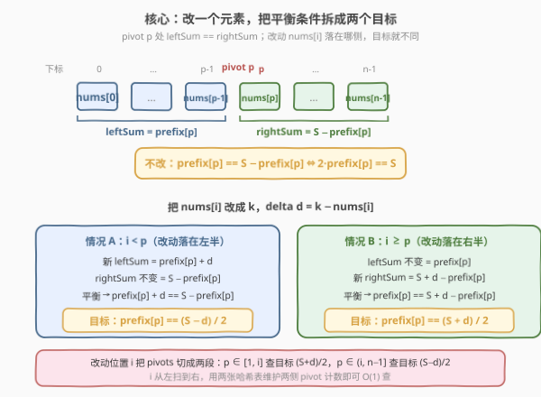
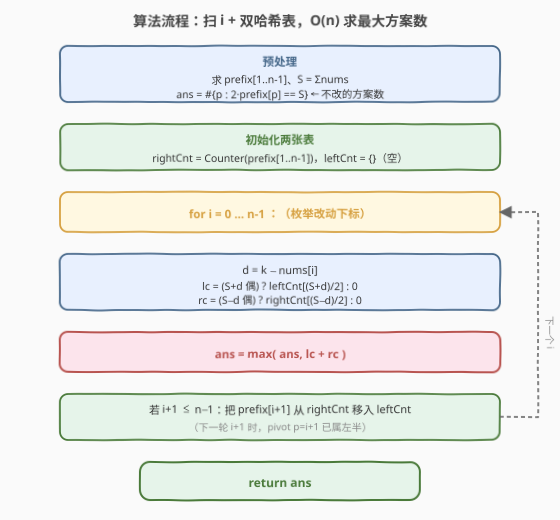

# 分割数组的最多方案数

- **题目名称**：分割数组的最多方案数
- **链接**：[2025. 分割数组的最多方案数](https://leetcode.cn/problems/maximum-number-of-ways-to-partition-an-array/)
- **难度**：困难
- **标签**：数组、前缀和、哈希表

## 1. 题目概述

给定长度为 $n$、下标从 0 开始的整数数组 `nums`。称 `pivot` 是一个合法**分割**，当且仅当：

- $1 \le \text{pivot} < n$
- $\text{nums}[0] + \text{nums}[1] + \dots + \text{nums}[\text{pivot}-1] = \text{nums}[\text{pivot}] + \dots + \text{nums}[n-1]$

即「pivot 左侧之和」等于「pivot 及右侧之和」。再给一个整数 $k$，你可以**至多**把 `nums` 中一个元素改成 $k$（也可以不改）。求在至多改一个元素的前提下，**最多**有多少种合法分割方案。

**示例 1**：

```text
输入：nums = [2,-1,2], k = 3
输出：1
解释：把 nums[0] 改成 3，数组变为 [3,-1,2]。
pivot = 2：3 + (-1) = 2 == 2，合法。共 1 种。
```

**示例 2**：

```text
输入：nums = [0,0,0], k = 1
输出：2
解释：不改数组。pivot = 1：0 == 0+0；pivot = 2：0+0 == 0。共 2 种。
```

**示例 3**：

```text
输入：nums = [22,4,-25,-20,-15,15,-16,7,19,-10,0,-13,-14], k = -33
输出：4
解释：把 nums[2] 改成 -33 后，有 4 个 pivot 满足左右和相等。
```

**约束条件**：

- $n = \text{nums.length}$
- $2 \le n \le 10^5$
- $-10^5 \le k,\ \text{nums}[i] \le 10^5$

---

## 2. 解题思路

### 2.1 暴力思路：枚举改动位置 + 枚举 pivot

最直观的做法：枚举「不改」或「把某个 `nums[i]` 改成 $k$」（共 $n+1$ 种选择），对每种选择重新求前缀和，再枚举 $n-1$ 个 pivot 判断左右和是否相等。时间 $O(n^2)$。$n = 10^5$ 时约 $10^{10}$ 次操作，超时。

突破口在于：**分割是否合法只取决于 pivot 处的前缀和与总和的关系**，而改动一个元素对总和与前缀和的影响是「可加的增量」，可以把"重新求和"消去，转化成「在原始前缀和上查满足某个目标值 pivot 的个数」。

### 2.2 核心观察：前缀和 + 双目标哈希计数



记总和 $S = \sum \text{nums}$，前缀和 $\text{pref}[p] = \sum_{j=0}^{p-1}\text{nums}[j]$（即 pivot $p$ 左侧之和，$p \in [1, n-1]$）。右侧之和为 $S - \text{pref}[p]$。

**不改数组**时，pivot $p$ 合法当且仅当：

$$\text{pref}[p] = S - \text{pref}[p] \iff 2 \cdot \text{pref}[p] = S$$

**把 `nums[i]` 改成 $k$**，令增量 $d = k - \text{nums}[i]$。改动后总和变为 $S + d$。对 pivot $p$，改动落在左半还是右半决定平衡条件的形式：

- **$i < p$（`nums[i]` 在左半）**：左侧多了 $d$，右侧不变。合法 $\Rightarrow \text{pref}[p] + d = S - \text{pref}[p]$，即

  $$\text{pref}[p] = \dfrac{S - d}{2}$$

- **$i \ge p$（`nums[i]` 在右半）**：左侧不变，右侧多了 $d$。合法 $\Rightarrow \text{pref}[p] = S + d - \text{pref}[p]$，即

  $$\text{pref}[p] = \dfrac{S + d}{2}$$

> 💡 **关键转化**：改动位置 $i$ 把所有 pivot 切成两段——$p \in [1, i]$ 段查目标 $\dfrac{S+d}{2}$，$p \in (i, n-1]$ 段查目标 $\dfrac{S-d}{2}$。每段内的 pivot 是否合法，归结为「该段前缀和等于某固定值的 pivot 有几个」，可用哈希表 $O(1)$ 查询。前缀和用的是**原始数组**的，因为增量 $d$ 已被代数分离出去。

> ⚠️ **奇偶性**：$S+d$ 与 $S-d$ 同奇偶（相差 $2d$）。若为奇数，对应段目标不是整数，该段贡献 0；只需在偶数时查表。

### 2.3 算法流程图



用两张哈希表随 $i$ 从 $0$ 扫到 $n-1$：

- `leftCnt`：当前 $p \in [1, i]$ 的前缀和频次（查目标 $\frac{S+d}{2}$）。
- `rightCnt`：当前 $p \in [i+1, n-1]$ 的前缀和频次（查目标 $\frac{S-d}{2}$）。

初始化时 `rightCnt` 装入全部 $\text{pref}[1..n-1]$，`leftCnt` 为空。每轮算完 $i$ 后，把 pivot $p = i+1$ 从 `rightCnt` 挪到 `leftCnt`——因为下一轮 $i$ 增 1 后，$p = i+1$ 满足 $p \le i_{\text{新}}$，归入左半。「不改」的方案数单独算一次（$2\cdot\text{pref}[p]=S$ 的 pivot 个数），作为初始答案。

### 2.4 示例演算

以示例 3 演算最优改动 $i=2$：

![示例演算：nums[2] 改为 -33 得 4 种分割](../images/partw_example_walkthrough.svg)

`nums = [22,4,-25,-20,-15,15,-16,7,19,-10,0,-13,-14]`，$S = -46$，$k = -33$。改 `nums[2] = -25 → -33`，$d = -33 - (-25) = -8$。

- 左半目标 $\frac{S+d}{2} = \frac{-54}{2} = -27$；右半目标 $\frac{S-d}{2} = \frac{-38}{2} = -19$。
- $i=2$：左半 $p \in [1,2]$，前缀和 $\{22, 26\}$，命中 $-27$ 的有 **0** 个。
- 右半 $p \in [3,12]$，前缀和 $\{1,-19,-34,-19,-35,-28,-9,-19,-19,-32\}$，命中 $-19$ 的有 $p=4,6,10,11$ 共 **4** 个。
- 合计 $0 + 4 = 4$，即答案。

---

## 3. 参考代码

### C++

```cpp
class Solution {
  public:
    int waysToPartition(vector<int>& nums, int k) {
        int n = nums.size();
        vector<long long> pref(n);          // pref[p] = Σnums[0..p-1]
        long long S = 0;
        for (int i = 0; i < n; ++i) {
            pref[i] = S;
            S += nums[i];
        }
        // 不改：统计 2·pref[p] == S 的 pivot 数
        int ans = 0;
        unordered_map<long long, int> rightCnt, leftCnt;
        for (int p = 1; p < n; ++p) rightCnt[pref[p]]++;          // 初始右半 = 全部 pivot
        for (int p = 1; p < n; ++p)
            if (2 * pref[p] == S) ++ans;                          // 不改的方案数

        for (int i = 0; i < n; ++i) {
            long long d = (long long)k - nums[i];
            long long lc = 0, rc = 0;
            if ((S + d) % 2 == 0) {                               // 左半目标 (S+d)/2
                long long lt = (S + d) / 2;
                auto it = leftCnt.find(lt);
                if (it != leftCnt.end()) lc = it->second;
            }
            if ((S - d) % 2 == 0) {                               // 右半目标 (S-d)/2
                long long rt = (S - d) / 2;
                auto it = rightCnt.find(rt);
                if (it != rightCnt.end()) rc = it->second;
            }
            ans = max(ans, (int)(lc + rc));
            if (i + 1 < n) {                                      // pivot p=i+1 从右挪到左
                long long v = pref[i + 1];
                if (--rightCnt[v] == 0) rightCnt.erase(v);
                ++leftCnt[v];
            }
        }
        return ans;
    }
};
```

### Python

```python
from collections import Counter

class Solution:
    def waysToPartition(self, nums: List[int], k: int) -> int:
        n = len(nums)
        pref = [0] * n                       # pref[p] = Σnums[0..p-1]
        s = 0
        for i in range(n):
            pref[i] = s
            s += nums[i]

        ans = sum(1 for p in range(1, n) if 2 * pref[p] == s)   # 不改的方案数
        right = Counter(pref[p] for p in range(1, n))           # 初始右半 = 全部 pivot
        left = Counter()

        for i in range(n):
            d = k - nums[i]
            lc = left[(s + d) // 2] if (s + d) % 2 == 0 else 0  # 左半目标 (S+d)/2
            rc = right[(s - d) // 2] if (s - d) % 2 == 0 else 0  # 右半目标 (S-d)/2
            ans = max(ans, lc + rc)
            if i + 1 < n:                                        # pivot p=i+1 从右挪到左
                v = pref[i + 1]
                right[v] -= 1
                left[v] += 1
        return ans
```

> ⚠️ **必须用 64 位整数**：$n \le 10^5$、$|\text{nums}[i]| \le 10^5$，前缀和与总和最坏约 $10^{10}$，超 32 位 `int`（约 $2.1 \times 10^9$）。C++ 用 `long long`；Python 整数任意精度无需处理。

> 💡 **「不改」可被 $d=0$ 覆盖**：若存在 `nums[i] == k`，则 $d=0$，两段目标都是 $S/2$，合计恰等于「不改」的方案数。但若没有任何元素等于 $k$，必须单独算一次「不改」才能纳入选择——所以代码把「不改」方案数作为初始 `ans`，保证「至多改一个」的两种情形都被考虑。

---

## 4. 复杂度分析

| 维度 | 复杂度 | 说明 |
|------|--------|------|
| 时间复杂度 | $O(n)$ | 预处理前缀和一次；主循环 $n$ 轮，每轮哈希表查询/更新均 $O(1)$ |
| 空间复杂度 | $O(n)$ | 两张哈希表合计存 $n-1$ 个前缀和；前缀和数组 $O(n)$ |

> 💡 相比暴力 $O(n^2)$，关键在于把「改动后重新求和判断」转化为「在原始前缀和上查固定目标值的频次」，并用滑动双哈希表把「按 $i$ 分段的计数」降到每次 $O(1)$。

---

## 5. 扩展：对偶视角与边界讨论

### 对偶视角：按 pivot 看「需要改哪个值」

换个方向，固定 pivot $p$，问「改哪个 `nums[i]` 能让 $p$ 合法」：

- 若 $i < p$：需 $\text{pref}[p] = \frac{S-d}{2}$，解得 $d = S - 2\cdot\text{pref}[p]$，即 `nums[i] = k - d = k - S + 2·pref[p]`，且 $i < p$。
- 若 $i \ge p$：需 $d = 2\cdot\text{pref}[p] - S$，即 `nums[i] = k - 2·pref[p] + S`，且 $i \ge p$。

于是也可对「下标按值分桶 + 前缀/后缀频次」统计每个 pivot 能被多少个 $i$ 救活，再取最大。这与本题解法是对偶的：一个按 $i$ 扫、维护 pivot 频次；一个按 $p$ 扫、维护下标值频次。两者复杂度同为 $O(n)$，思路互通——**「改动落在哪侧」决定目标」**这一核心观察不变。

### 奇偶性边界

$S+d$ 与 $S-d$ 恒同奇偶。当 $S$ 与 $d$ 奇偶不同时，两段目标均非整数，改这个 $i$ 毫无贡献（包括「不改」时若 $S$ 为奇数，则 $2\cdot\text{pref}[p] = S$ 必不成立，不改方案数为 0）。代码用 `% 2 == 0` 守门，避免非整数目标污染查询。

---

## 6. 面试要点

1. **为什么改动一个元素后，判断 pivot 合法还能用原始前缀和？**

   - 因为增量 $d = k - \text{nums}[i]$ 是「整体平移」：若 `nums[i]` 在 pivot 左半，左和加 $d$、右和不变；在右半则右和加 $d$、左和不变。把 $d$ 代入平衡等式后，$\text{pref}[p]$ 仍是原始前缀和，只是目标从 $S/2$ 变成 $\frac{S \pm d}{2}$。无需重算前缀和。

2. **为什么需要两张哈希表随 $i$ 滑动，而不是一张全局表？**

   - 同一个前缀值 $\text{pref}[p]$ 在 $p \le i$ 段查目标 $\frac{S+d}{2}$、在 $p > i$ 段查目标 $\frac{S-d}{2}$，两段目标不同。$i$ 扫动时分界线移动，pivot 归属在两段间转移，所以用 `leftCnt`/`rightCnt` 动态维护「左段 / 右段各自的前缀值频次」，每轮 $O(1)$ 查询与迁移。

3. **「不改」为什么单独算一次？**

   - 「至多改一个」含「不改」选项。不改时 pivot 合法条件是 $2\cdot\text{pref}[p] = S$。若数组中存在等于 $k$ 的元素，改它（$d=0$）的效果与不改相同，会被主循环覆盖；但若无元素等于 $k$，主循环不会产生 $d=0$ 的情形，必须单独把「不改」方案数纳入 `ans` 才不漏。

4. **为什么 C++ 必须用 `long long`？哪些量会超 32 位？**

   - 总和 $S$ 与前缀和最坏 $10^5 \times 10^5 = 10^{10}$，目标值 $\frac{S \pm d}{2}$ 同量级，都超 32 位有符号 `int` 上限 $2.1 \times 10^9$。`d` 本身在 $[-2\times10^5, 2\times10^5]$ 不超，但参与 $S \pm d$ 运算必须整体用 64 位，故 `pref`、`S`、`d`、目标值都声明 `long long`。

5. **$n=2$ 这种最小情况算法还成立吗？**

   - 成立。$n=2$ 时唯一 pivot 是 $p=1$。`pref[1] = nums[0]`，`rightCnt` 初始含 `pref[1]`。$i=0$：左段空、右段 $\{p=1\}$ 查 $\frac{S-d}{2}$（$d=k-\text{nums}[0]$）；算完把 `pref[1]` 挪入左段。$i=1$：左段 $\{p=1\}$ 查 $\frac{S+d}{2}$（$d=k-\text{nums}[1]$）、右段空。两个改动选项与「不改」都覆盖，逻辑无误。

---

## 7. 同类练习题

- [560. 和为 K 的子数组](https://leetcode.cn/problems/subarray-sum-equals-k/)（[题解](../0501-0600/560_和为K的子数组.md)）：前缀和 + 哈希计数的母题，把"区间和等于定值"转为"查前缀和频次"，与本题查目标前缀值同构
- [525. 连续数组](https://leetcode.cn/problems/contiguous-array/)（[题解](../0501-0600/525_连续数组.md)）：前缀和 + 哈希存最早下标，把"两段相等"化为"两前缀相等"，与本题平衡条件 $2\cdot\text{pref}[p]=S$ 同源
- [974. 和可被 K 整除的子数组](https://leetcode.cn/problems/subarray-sums-divisible-by-k/)（[题解](../0901-1000/974_和可被K整除的子数组.md)）：前缀和 + 同余分组计数，同属"前缀和频次表查目标"家族
- [1248. 统计「优美子数组」](https://leetcode.cn/problems/count-number-of-nice-subarrays/)（[题解](../1201-1300/1248_统计优美子数组.md)）：至多 K 转化 + 前缀哈希计数，与本题"按段查固定目标频次"思路一致
