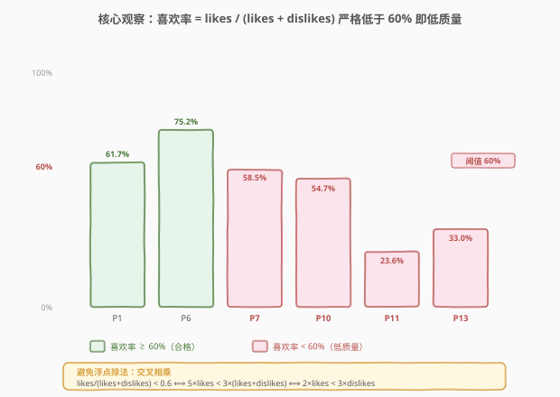
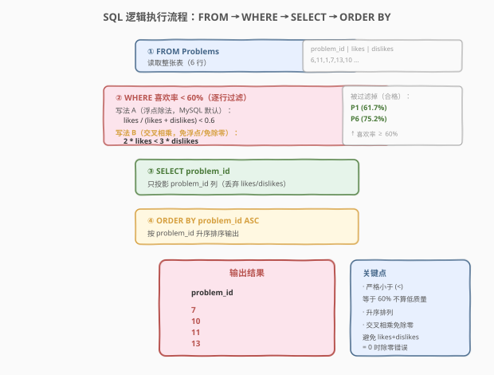
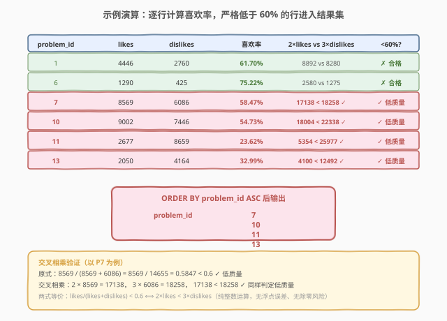

# LeetCode 低质量的问题 题解

## 1. 题目概述

- **标题 / 题号**：低质量的问题（#2026，easy）
- **链接**：https://leetcode.cn/problems/low-quality-problems/
- **难度**：简单
- **标签**：数据库、SQL、`WHERE` 过滤、比率计算、交叉相乘（免除零/免浮点）、`ORDER BY`

**题意**：给定 `Problems` 表，记录每道力扣题目的 `problem_id`、喜欢数 `likes` 和不喜欢数 `dislikes`。一个问题的**喜欢率**定义为：

$$\text{喜欢率} = \frac{\text{likes}}{\text{likes} + \text{dislikes}}$$

如果一个问题的喜欢率**严格低于** $60\%$，则该问题为**低质量**问题。要求找出所有低质量问题的 `problem_id`，按升序排列返回。

> ⚠️ 本题是 LeetCode **Plus 会员专享题（🔒）**，题面与示例来自力扣中文站。

**表结构**：

```text
Table: Problems
+-------------+------+
| Column Name | Type |
+-------------+------+
| problem_id  | int  |  ← 主键
| likes       | int  |
| dislikes    | int  |
+-------------+------+
problem_id 是这张表的主键。
该表的每一行都表示一个力扣问题的喜欢和不喜欢的数量。
```

**示例 1**：

```text
输入：
Problems 表:
+------------+-------+----------+
| problem_id | likes | dislikes |
+------------+-------+----------+
| 6          | 1290  | 425      |
| 11         | 2677  | 8659     |
| 1          | 4446  | 2760     |
| 7          | 8569  | 6086     |
| 13         | 2050  | 4164     |
| 10         | 9002  | 7446     |
+------------+-------+----------+

输出：
+------------+
| problem_id |
+------------+
| 7          |
| 10         |
| 11         |
| 13         |
+------------+
```

**解释**：各问题的喜欢率如下：

| problem_id | 喜欢率 | 是否 < 60% |
|------------|--------|-----------|
| 1 | 4446 / 7206 = 61.70% | ✗ 合格 |
| 6 | 1290 / 1715 = 75.22% | ✗ 合格 |
| 7 | 8569 / 14655 = 58.47% | ✓ 低质量 |
| 10 | 9002 / 16448 = 54.73% | ✓ 低质量 |
| 11 | 2677 / 11336 = 23.62% | ✓ 低质量 |
| 13 | 2050 / 6214 = 32.99% | ✓ 低质量 |

**约束**：

- `problem_id` 是主键，每道题目唯一
- `likes`、`dislikes` 为非负整数

> 💡 **审题关键**：① 「**严格低于**」——等于 $60\%$ 不算低质量（用 `<` 而非 `<=`）；② 喜欢率的分母是「喜欢数 + 不喜欢数」（总投票数），不是单独的 `likes` 或 `dislikes`；③ 结果按 `problem_id` **升序**排列。

## 2. 解题思路

### 2.1 暴力思路：直接浮点除法

最直觉的写法是直接把喜欢率算出来，和 $0.6$ 比较：

```sql
SELECT problem_id
FROM Problems
WHERE likes / (likes + dislikes) < 0.6
ORDER BY problem_id;
```

在 **MySQL** 中这个写法可以直接通过——因为 MySQL 的 `/` 运算符对 `INT / INT` 返回的是**浮点数**（而非整数除法），例如 `1290 / 1715 = 0.7522`，比较 `0.7522 < 0.6` 得 `FALSE`，正确。

> ⚠️ **但有两个隐患**：
> 1. **整数除法陷阱**：在某些 SQL 方言（如 SQL Server、PostgreSQL 的 `INT / INT`）中，`/` 是**整数除法**，`1290 / 1715 = 0`（截断小数），导致 `0 < 0.6` 恒为 `TRUE`——所有问题都被误判为低质量。需改写为 `CAST(likes AS FLOAT) / (likes + dislikes)` 或 `likes * 1.0 / (likes + dislikes)`。
> 2. **除零风险**：若某行 `likes + dislikes = 0`（无人投票），分母为 0 会触发除零错误。虽然题目隐含每题都有投票，但生产环境中应防御。

### 2.2 核心观察：交叉相乘——免除零、免浮点



为了同时规避**浮点精度**和**除零**两个隐患，可以用**交叉相乘**把除法不等式等价转化为整数乘法不等式：

$$\frac{\text{likes}}{\text{likes} + \text{dislikes}} < 0.6$$

两边同乘正数 $(\text{likes} + \text{dislikes})$（前提：总票数 $> 0$）：

$$\text{likes} < 0.6 \times (\text{likes} + \text{dislikes})$$

把 $0.6$ 写成分数 $\frac{3}{5}$，两边同乘 $5$ 消分母：

$$5 \times \text{likes} < 3 \times (\text{likes} + \text{dislikes})$$

展开右边并合并同类项：

$$5 \cdot \text{likes} < 3 \cdot \text{likes} + 3 \cdot \text{dislikes} \implies 2 \cdot \text{likes} < 3 \cdot \text{dislikes}$$

最终得到一个**纯整数乘法**的判定：

$$\boxed{2 \times \text{likes} < 3 \times \text{dislikes}}$$

> 💡 **三个优势**：
> 1. **无浮点误差**：整数乘法精确，不存在 `0.5847...` 的舍入问题。
> 2. **无除零风险**：没有除法运算，`likes + dislikes = 0` 也不会报错（此时 `2*0 < 3*0` 即 `0 < 0` 为 `FALSE`，该行不被选中——语义上「无人投票」既非高质量也非低质量，跳过合理）。
> 3. **跨方言通用**：纯整数运算在任何 SQL 方言中行为一致，不依赖 `/` 的除法语义。

> ⚠️ **等价性前提**：交叉相乘要求两边同乘的 $(\text{likes} + \text{dislikes}) > 0$。若总票数为 0，原式分母为 0（未定义），而交叉相乘式 `2*likes < 3*dislikes` 退化为 `0 < 0` 即 `FALSE`——虽数学上不严格等价，但「跳过无投票题」的工程语义是合理的。

### 2.3 算法流程图



SQL 的**逻辑执行顺序**为 `FROM → WHERE → SELECT → ORDER BY`（与书写顺序不同）：

| 步骤 | 子句 | 作用 |
|------|------|------|
| ① | `FROM Problems` | 读取整张表 |
| ② | `WHERE 2 * likes < 3 * dislikes` | 逐行过滤，保留低质量行 |
| ③ | `SELECT problem_id` | 只投影 `problem_id` 列 |
| ④ | `ORDER BY problem_id` | 按题号升序排序输出 |

### 2.4 示例演算



以示例 1 数据为例，逐行验证两种判定方式的一致性：

| problem_id | likes | dislikes | 喜欢率 | `2×likes` | `3×dislikes` | 判定 |
|------------|-------|----------|--------|-----------|--------------|------|
| 1 | 4446 | 2760 | 61.70% | 8892 | 8280 | 8892 ≥ 8280 → 合格 |
| 6 | 1290 | 425 | 75.22% | 2580 | 1275 | 2580 ≥ 1275 → 合格 |
| 7 | 8569 | 6086 | 58.47% | 17138 | 18258 | 17138 < 18258 → **低质量** |
| 10 | 9002 | 7446 | 54.73% | 18004 | 22338 | 18004 < 22338 → **低质量** |
| 11 | 2677 | 8659 | 23.62% | 5354 | 25977 | 5354 < 25977 → **低质量** |
| 13 | 2050 | 4164 | 32.99% | 4100 | 12492 | 4100 < 12492 → **低质量** |

两种判定完全一致，最终结果按 `problem_id` 升序排列为 `[7, 10, 11, 13]`。

## 3. 参考代码

### SQL（解法 A：交叉相乘，推荐）

```sql
SELECT problem_id
FROM Problems
WHERE 2 * likes < 3 * dislikes
ORDER BY problem_id;
```

> 💡 **写法要点**：
> - `WHERE 2 * likes < 3 * dislikes` 是交叉相乘后的等价整数判定，免除零、免浮点、跨方言通用。
> - `ORDER BY problem_id` 保证升序输出（`ORDER BY` 默认升序 `ASC`，可省略 `ASC`）。
> - 只 `SELECT problem_id` 一列，投影精确。

### SQL（解法 B：浮点除法，MySQL 可用）

```sql
SELECT problem_id
FROM Problems
WHERE likes / (likes + dislikes) < 0.6
ORDER BY problem_id;
```

> ⚠️ **限制**：仅在 `/` 返回浮点数的方言（如 MySQL）中正确。在 SQL Server / PostgreSQL 等整数除法方言中需改写为 `likes * 1.0 / (likes + dislikes) < 0.6` 或 `CAST(likes AS FLOAT) / (likes + dislikes) < 0.6`。且存在 `likes + dislikes = 0` 的除零风险。

### Python（pandas）

```python
import pandas as pd

def low_quality_problems(problems: pd.DataFrame) -> pd.DataFrame:
    mask = 2 * problems['likes'] < 3 * problems['dislikes']
    result = problems.loc[mask, ['problem_id']].sort_values('problem_id')
    return result
```

> 💡 **pandas 对照**：`2 * problems['likes'] < 3 * problems['dislikes']` 对应 SQL 的 `WHERE 2 * likes < 3 * dislikes`（逐行布尔掩码）；`.loc[mask, ['problem_id']]` 对应 `SELECT problem_id`（投影）；`.sort_values('problem_id')` 对应 `ORDER BY problem_id`。

## 4. 复杂度分析

| 维度 | 复杂度 | 说明 |
|------|--------|------|
| 时间复杂度 | $O(n \log n)$ | 全表扫描 $O(n)$ + `ORDER BY` 排序 $O(n \log n)$，排序主导 |
| 空间复杂度 | $O(n)$ | 排序需临时存储结果集 |

> - $n$ = `Problems` 表行数
> - 若 `problem_id` 上有索引且数据已按 `problem_id` 有序存储，`ORDER BY` 可降为 $O(n)$（索引有序扫描）。`WHERE` 条件涉及计算列（`2 * likes`、`3 * dislikes`），无法走索引，必须全表扫描。
> - 两种 SQL 写法（交叉相乘 / 浮点除法）的复杂度相同，差别仅在数值精度与跨方言兼容性。

## 5. 扩展：比率类过滤的通用技巧

本题是 SQL 中**比率过滤**的最简形态。实际面试中常遇到更复杂的比率题，核心思路一致——**把除法不等式交叉相乘转为乘法，规避浮点与除零**。

**通用模板**：判定 $\frac{a}{a+b} < r$（其中 $r = \frac{p}{q}$ 为有理数阈值）：

$$\frac{a}{a+b} < \frac{p}{q} \implies q \cdot a < p \cdot (a+b) \implies (q-p) \cdot a < p \cdot b$$

本题 $a = \text{likes}$, $b = \text{dislikes}$, $r = 0.6 = \frac{3}{5}$, $p=3, q=5$：

$$(5-3) \cdot \text{likes} < 3 \cdot \text{dislikes} \implies 2 \cdot \text{likes} < 3 \cdot \text{dislikes}$$

> 💡 **何时用浮点、何时用交叉相乘？**
> - **MySQL** 中 `/` 是浮点除法，直接写 `likes / (likes + dislikes) < 0.6` 即可，简洁可读。
> - **跨方言兼容**或**防御除零**时，优先交叉相乘。
> - 阈值是无理数（如 $\sqrt{2}$）时无法化为整数比，只能用浮点——但工程题中阈值几乎都是有理数。

> ⚠️ **对比 [1633. 各赛事的用户注册率](https://leetcode.cn/problems/percentage-of-users-attended-a-contest/)**：1633 题需要 `ROUND(COUNT(...) / COUNT(...) * 100, 2)` 输出百分比，那里关注的是**输出格式**（保留两位小数）；本题关注的是**过滤判定**（阈值比较）。前者用 `ROUND` + 浮点除法，后者用交叉相乘——场景不同，选型不同。

## 6. 面试要点

1. **「严格低于 60%」和「低于或等于 60%」有什么区别？**

   > 题目要求「严格低于」，用 `<` 而非 `<=`。喜欢率恰好等于 $60\%$ 的问题**不算**低质量，不会被选中。审题时要留意「严格」「至多」「至少」等限定词对应的运算符（`<` vs `<=`、`>` vs `>=`）。

2. **为什么推荐交叉相乘 `2 * likes < 3 * dislikes` 而非直接除法？**

   > 三个优势：① 避免**整数除法陷阱**——SQL Server / PostgreSQL 中 `INT / INT` 截断小数，`1290 / 1715 = 0`，导致 `0 < 0.6` 恒真，全表误判；② 避免**除零错误**——`likes + dislikes = 0` 时分母为 0；③ 避免**浮点精度误差**——整数乘法精确，浮点除法可能有舍入。交叉相乘把三个问题一次性解决。

3. **交叉相乘的等价性前提是什么？`likes + dislikes = 0` 时会怎样？**

   > 前提是两边同乘的 $(\text{likes} + \text{dislikes}) > 0$（正数，不改变不等号方向）。当总票数为 0 时，原式分母为 0（未定义），而交叉相乘式退化为 `2*0 < 3*0` 即 `0 < 0` = `FALSE`，该行不被选中。虽数学上不严格等价，但「无人投票的题跳过」在工程上合理。

4. **SQL 的逻辑执行顺序和书写顺序有什么不同？**

   > 书写顺序是 `SELECT → FROM → WHERE → ORDER BY`，但**逻辑执行顺序**是 `FROM → WHERE → SELECT → ORDER BY`：先确定数据源（FROM），再逐行过滤（WHERE），然后投影列（SELECT），最后排序（ORDER BY）。理解这一点能避免在 `WHERE` 中引用 `SELECT` 别名的常见错误。

5. **`ORDER BY problem_id` 不写 `ASC` 会怎样？**

   > `ORDER BY` 默认升序（`ASC`），不写 `ASC` 效果相同。降序需显式写 `DESC`。本题要求升序，省略 `ASC` 是惯用简写。

> 💡 **一句话总结**：2026 的核心是「**比率过滤 + 交叉相乘**」——把 $\frac{\text{likes}}{\text{likes}+\text{dislikes}} < 0.6$ 等价转化为 $2 \times \text{likes} < 3 \times \text{dislikes}$，一次性规避整数除法陷阱、除零错误和浮点精度问题，再用 `ORDER BY` 升序输出。

## 同类练习题

| # | 题目 | 与本题的关联 |
|---|------|-------------|
| 1633 | [各赛事的用户注册率](https://leetcode.cn/problems/percentage-of-users-attended-a-contest/)（[题解](../1601-1700/1633_各赛事的用户注册率.md)） | `COUNT / COUNT * 100` 计算百分比 + `ROUND` 保留小数 + `ORDER BY` 排序，与 2026 同属比率计算家族，但关注输出格式而非过滤判定——对照「浮点除法 + ROUND」vs「交叉相乘整数判定」两种场景的选型 |
| 1757 | [可回收且低脂的产品](https://leetcode.cn/problems/find-products-that-are-recyclable-and-low-fat/)（[题解](../1701-1800/1757_可回收且低脂的产品.md)） | 最简 `WHERE` + `AND` 谓词过滤 + 投影，与 2026 同为单表行级过滤题，适合巩固 `FROM → WHERE → SELECT` 基础执行流 |
| 1683 | [无效的推文](https://leetcode.cn/problems/invalid-tweets/)（[题解](../1601-1700/1683_无效的推文.md)） | `WHERE` + `CHAR_LENGTH` 字符计数过滤，同为单表条件过滤 + `ORDER BY`，巩固「计算列作为 WHERE 谓词」的范式 |
| 584 | [寻找用户推荐人](https://leetcode.cn/problems/find-customer-referee/)（[题解](../0501-0600/584_寻找用户推荐人.md)） | `WHERE` 过滤 + `NULL` 三值逻辑处理，同为简单行级过滤题，补充 `NULL` 比较的陷阱知识——与 2026 的整数除法陷阱并列为 SQL 过滤题两大常见坑 |
