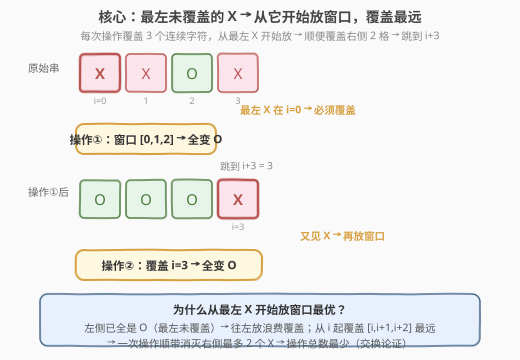
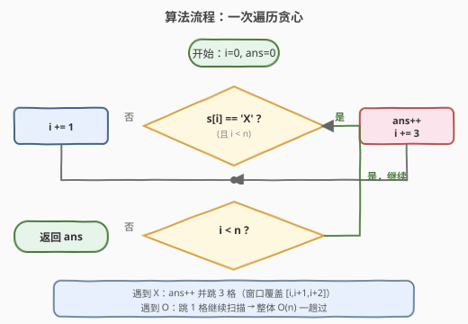
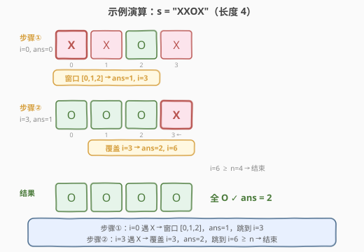

# 转换字符串的最少操作次数

- **题目名称**：转换字符串的最少操作次数
- **链接**：[2027. 转换字符串的最少操作次数](https://leetcode.cn/problems/minimum-moves-to-convert-string/)
- **难度**：简单
- **标签**：贪心、字符串、一次遍历

## 1. 题目概述

给定一个由 `'X'` 和 `'O'` 组成的字符串 `s`（长度为 $n$）。一次**操作**定义为从 `s` 中选出**三个连续字符**，将选中的每个字符都转换为 `'O'`（已是 `'O'` 的保持不变）。

返回将 `s` 中**所有**字符均转换为 `'O'` 需要执行的**最少**操作次数。

**示例 1**：

```text
输入：s = "XXX"
输出：1
解释：XXX -> OOO，一次操作选中全部 3 个字符。
```

**示例 2**：

```text
输入：s = "XXOX"
输出：2
解释：XXOX -> OOOX -> OOOO
第一次操作选择前 3 个字符；第二次操作选择后 3 个字符。
```

**示例 3**：

```text
输入：s = "OOOO"
输出：0
解释：s 中不存在需要转换的 'X'。
```

**约束条件**：

- $3 \le \text{s.length} \le 1000$
- `s[i]` 为 `'X'` 或 `'O'`

---

## 2. 解题思路

### 2.1 暴力思路：枚举所有窗口组合

最直观的做法是枚举每次操作的起始位置（共 $n - 2$ 种选择），用 DFS/BFS 搜索将所有 `'X'` 转为 `'O'` 的最少操作数。状态空间是 $2^n$（每个字符是否已转换），当 $n = 1000$ 时完全不可行。

突破口在于：**操作的顺序无关紧要，关键是每个 `'X'` 是否被某个窗口覆盖**。一旦把问题从"搜索操作序列"转为"用最少的长度为 3 的区间覆盖所有 `'X'` 的位置"，贪心直觉就浮现了。

### 2.2 核心观察：最左未覆盖的 X → 从它开始放窗口



从左到右扫描字符串。当遇到一个尚未被覆盖的 `'X'`（位置 $i$）时，**必须执行一次操作来覆盖它**——这是硬性需求，无法回避。问题只剩：这次操作的窗口放在哪里？

窗口覆盖 $i$ 的起始位置 $j$ 满足 $j \le i \le j + 2$，即 $j \in [\max(0,\, i-2),\, \min(i,\, n-3)]$。为了让这一次操作**顺带覆盖尽可能多的右侧字符**（减少后续操作数），应当让窗口尽量靠右——即从 $i$ 开始放窗口 $[i,\, i+1,\, i+2]$。

> 💡 **为什么从最左 X 开始放窗口最优？** 扫描到位置 $i$ 时，$i$ 左侧的字符要么本就是 `'O'`、要么已被之前的窗口覆盖。若窗口往左偏（起始 $< i$），会把宝贵的覆盖名额浪费在已经搞定的地方，右侧覆盖范围反而缩短。从 $i$ 起覆盖 $[i, i+1, i+2]$ 是**最远**的——一次操作顺带消灭右侧最多 2 个 `'X'`，后续操作数自然最少。

> 💡 **交换论证**：设最优解 OPT 用窗口 $[j, j+1, j+2]$（$j < i$）覆盖最左未覆盖的 `'X'`。由于 $i$ 左侧已无未覆盖 `'X'`，$[j, i-1]$ 的覆盖是"浪费"的。把 OPT 的这个窗口替换为 $[i, i+1, i+2]$，不会遗漏任何 `'X'`（$i$ 左侧本就干净），反而可能多覆盖右侧的 `'X'`——操作数不增，与 OPT 最优性一致。归纳可知贪心解 $=$ 最优解。

### 2.3 算法流程图



只需一趟遍历：

- 初始化 `i = 0`、`ans = 0`。
- 若 `s[i] == 'X'`：`ans++`，`i += 3`（窗口 $[i, i+1, i+2]$ 一并覆盖，跳过这 3 格）。
- 若 `s[i] == 'O'`：`i += 1`（无需操作，继续扫描）。
- 循环至 `i >= n` 结束，返回 `ans`。

> ⚠️ **末尾 X 的处理**：若最左未覆盖 `'X'` 出现在 $i > n - 3$（即倒数前 2 格），窗口无法从 $i$ 起放（越界）。但贪心的**计数**仍然正确——此时必然存在一个合法窗口 $[n-3, n-2, n-1]$ 覆盖 $i$，操作数仍为 1，而 `i += 3` 后 $i \ge n$ 自然终止循环。贪心统计的是"需要几次操作"，而非"窗口精确落在哪"。

### 2.4 示例演算

以 `s = "XXOX"` 为例逐步演算：



| 步骤 | 位置 $i$ | `s[i]` | 动作 | `ans` | 下一 $i$ |
|------|---------|--------|------|-------|---------|
| ① | 0 | `X` | 放窗口 $[0,1,2]$，`ans++` | 1 | 3 |
| ② | 3 | `X` | 覆盖 $i=3$，`ans++` | 2 | 6 |
| — | 6 | — | $i \ge n=4$，循环结束 | **2** | — |

步骤①后字符串变为 `"OOOX"`，步骤②覆盖位置 3（实际窗口 $[1,2,3]$），最终 `"OOOO"`，答案 2。

---

## 3. 参考代码

### C++

```cpp
class Solution {
  public:
    int minimumMoves(string s) {
        int ans = 0;
        int i = 0, n = s.size();
        while (i < n) {
            if (s[i] == 'X') {
                ans++;
                i += 3;
            } else {
                i++;
            }
        }
        return ans;
    }
};
```

### Python

```python
class Solution:
    def minimumMoves(self, s: str) -> int:
        ans = i = 0
        n = len(s)
        while i < n:
            if s[i] == 'X':
                ans += 1
                i += 3
            else:
                i += 1
        return ans
```

> 💡 **为什么不用真的修改字符串？** 贪心只关心"哪些位置已被覆盖"，而 `i += 3` 已经隐含了"当前位置及右侧 2 格被本次操作覆盖"这一信息。无需把 `'X'` 改成 `'O'` 再重新扫描——跳过 3 格等价于"这 3 格已搞定"。这也是本题能做到 $O(1)$ 空间的关键。

---

## 4. 复杂度分析

| 维度 | 复杂度 | 说明 |
|------|--------|------|
| 时间复杂度 | $O(n)$ | `i` 每步至少前进 1，至多前进 3，总体至多遍历 $n$ 个位置 |
| 空间复杂度 | $O(1)$ | 仅维护 `i`、`ans` 两个变量，不修改原串 |

> 💡 严格来说，遇到 `'X'` 时 `i` 跳 3 格、遇到 `'O'` 时跳 1 格，因此循环总步数 $\le n$，时间复杂度为 $O(n)$。相比暴力搜索的指数级状态空间，关键在于把"覆盖所有 X 的最少区间数"这一组合问题，用贪心降到了线性扫描。

---

## 5. 扩展：区间覆盖贪心的通用范式

本题的本质是**用最少数量的固定长度区间覆盖给定点集**——经典的区间覆盖贪心的一个特例。通用范式如下：

| 变体 | 区间长度 | 覆盖目标 | 贪心策略 |
|------|---------|---------|---------|
| **本题** | 固定 3 | 字符串中所有 `'X'` 的位置 | 从最左未覆盖点起放区间，跳 $L$ 格 |
| **1024. 视频拼接** | 可变长度 | $[0, T]$ 整段 | 按左端点排序，每轮选右端最远的区间 |
| **45. 跳跃游戏 II** | 可变长度 | 到达末尾 | 维护当前步能到达的最远位置 |
| **1326. 灌溉花园** | 固定 $2 \cdot range$ | 覆盖 $[0, n]$ | 从左到右，每段选覆盖最远的喷头 |

> 💡 本题是这一家族中**最简单**的形态：区间长度固定、点集在一维直线上有序。只需"遇到必覆盖的点就放一个区间"即可，无需排序或维护候选集。理解了本题，再看 1024/1326 就会发现它们只是在"区间长度可变"时多了"选最远右端"这一步。

---

## 6. 面试要点

1. **为什么贪心是正确的？能用交换论证说明吗？**

   - 最左未覆盖的 `'X'` 必须被某次操作覆盖。若最优解用更靠左的窗口覆盖它，由于左侧已无未覆盖 `'X'`，靠左窗口的左侧覆盖是浪费的；替换为从该 `'X'` 起的窗口不遗漏任何 `'X'` 且可能多覆盖右侧——操作数不增。归纳可知贪心 $=$ 最优。

2. **遇到 `'X'` 时 `i += 3`，但如果 $i + 2 \ge n$（窗口越界）怎么办？**

   - 计数仍然正确。$i > n - 3$ 时实际窗口从 $n - 3$ 起放（$[n-3, n-2, n-1]$），仍能覆盖 $i$。`i += 3` 后 $i \ge n$ 自然终止循环，不影响 `ans` 的值。题目保证 $n \ge 3$，末尾的 `'X'` 总能被某个合法窗口覆盖。

3. **为什么不需要真的把 `'X'` 改成 `'O'`？**

   - `i += 3` 已隐含"当前位置及右侧 2 格被覆盖"。后续扫描从 $i + 3$ 开始，不会重复检查这 3 格。修改字符串需要 $O(n)$ 额外空间且不影响答案，纯属多余。

4. **如果操作长度从 3 改为 $k$，算法怎么变？**

   - 只需把 `i += 3` 改为 `i += k`。贪心逻辑完全不变——从最左未覆盖点起放长度为 $k$ 的窗口，跳 $k$ 格。时间复杂度仍为 $O(n)$。

5. **这个贪心和"跳跃游戏 II"有什么关系？**

   - 两者都是"用最少的固定/可变长度区间覆盖一维目标"。跳跃游戏 II 中每个位置的"跳跃长度"可变，需要维护当前步能到达的最远位置；本题区间长度固定为 3，更简单——遇到必覆盖点直接放区间即可，无需维护候选集。

---

## 7. 同类练习题

- [1024. 视频拼接](https://leetcode.cn/problems/video-stitching/)：区间覆盖贪心的可变长度版，按左端点排序后每轮选右端最远，对照本题固定长度的简化形态
- [1326. 灌溉花园](https://leetcode.cn/problems/minimum-number-of-taps-to-open-to-water-a-garden/)：固定覆盖半径的区间覆盖，从左到右每段选覆盖最远的喷头，思路同构
- [45. 跳跃游戏 II](https://leetcode.cn/problems/jump-game-ii/)（[题解](../0001-0100/45_跳跃游戏II.md)）：用最少跳跃到达末尾，贪心维护当前步最远可达，同为"最少数区间覆盖"家族
- [55. 跳跃游戏](https://leetcode.cn/problems/jump-game/)：判定能否到达末尾，贪心维护最远可达，是 45 的判定版（不求最少次数）
- [621. 任务调度器](https://leetcode.cn/problems/task-scheduler/)：贪心调度 + 冷却期，虽非区间覆盖但同为"贪心安排最少批次"思想
