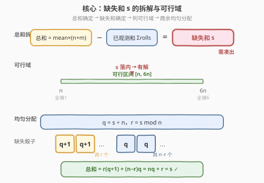
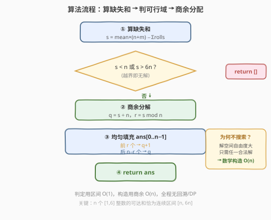

# LeetCode 找出缺失的观测数据 题解

## 1. 题目概述

- **标题 / 题号**：找出缺失的观测数据（#2028，medium）
- **链接**：https://leetcode.cn/problems/find-missing-observations/
- **难度**：中等
- **标签**：数组、数学、模拟

**题意**：你有 $n + m$ 次六面骰子的投掷观测。每次投掷结果为 $1$ 到 $6$ 的整数。已知其中 $m$ 次的观测结果（数组 `rolls`，长度为 $m$），以及所有 $n + m$ 次投掷的**平均值** `mean`。请还原缺失的 $n$ 次投掷结果。

具体来说：返回一个长度为 $n$ 的数组 `ans`，使得 `rolls` 与 `ans` 拼接后共 $n + m$ 个数的**平均值**恰好等于 `mean`。若存在多个合法答案，返回任意一个；若无解，返回空数组。

**示例 1**：

```text
输入：rolls = [3,2,4,3], mean = 4, n = 2
输出：[6,6]
解释：共 4+2=6 次投掷，平均值为 4 → 总和 = 4×6 = 24。
      已观测和 = 3+2+4+3 = 12，缺失和 = 24−12 = 12。
      缺失 2 个骰子之和为 12 → [6,6]。
```

**示例 2**：

```text
输入：rolls = [1,5,6], mean = 3, n = 4
输出：[1,2,3,3]
解释：共 3+4=7 次投掷，总和 = 3×7 = 21。
      已观测和 = 1+5+6 = 12，缺失和 = 21−12 = 9。
      缺失 4 个骰子之和为 9 → [1,2,3,3]（或 [2,2,2,3] 等，任意合法即可）。
```

**示例 3**：

```text
输入：rolls = [1,2,3,4], mean = 6, n = 4
输出：[]
解释：共 4+4=8 次投掷，总和 = 6×8 = 48。
      已观测和 = 1+2+3+4 = 10，缺失和 = 48−10 = 38。
      缺失 4 个骰子最大和为 6×4 = 24 < 38，无解。
```

**约束**：

- $m == \text{rolls.length}$
- $1 \le n, m \le 10^5$
- $1 \le \text{rolls}[i] \le 6$
- $1 \le \text{mean} \le 6$

> 💡 **审题关键**：① 平均值 = 总和 ÷ 个数，故**总和是确定的**：$\text{total} = \text{mean} \times (n + m)$，不涉及浮点；② 缺失部分的和 = 总和 − 已观测和，记为 $s$；③ 问题转化为「用 $n$ 个 $[1,6]$ 的整数凑出和 $s$」，这是一道**可行性判定 + 构造**题，而非搜索题。

## 2. 解题思路

### 2.1 暴力思路：回溯搜索凑和

最直觉的做法是：把缺失的 $n$ 个骰子当成待填的格子，每个格子取 $1$ 到 $6$，用回溯枚举所有组合，找到第一个使和等于 $s$ 的方案。

- **正确性**：穷举所有可能，必然能找到解（若存在）。
- **效率**：每个格子 $6$ 种选择，共 $6^n$ 种组合，$n$ 可达 $10^5$，完全不可行。

> ⚠️ 暴力的根源在于「把凑和当成组合搜索」。但本题**不需要具体哪种组合**——任意合法方案即可。这意味着我们可以先判定可行性，再直接**构造**一个方案，省去搜索。

### 2.2 核心观察：凑和的可行性 + 均匀构造



关键洞察分三步：

**第一步：缺失和 $s$ 是确定的。** 平均值不涉及小数（约束 $1 \le \text{mean} \le 6$，$n + m$ 为整数，乘积即总和），故：

$$s = \text{mean} \times (n + m) - \sum_{i}\text{rolls}[i]$$

**第二步：可行性判定——$s$ 必须落在 $[n, 6n]$。** 缺失部分是 $n$ 个骰子，每个最小 $1$、最大 $6$，所以缺失和的理论下界为 $n \times 1 = n$，上界为 $n \times 6 = 6n$：

$$\boxed{n \le s \le 6n \iff \text{有解}}$$

若 $s < n$（缺失和太小，即便全填 $1$ 也超）或 $s > 6n$（缺失和太大，即便全填 $6$ 也不够），直接返回空数组。

**第三步：均匀构造——商作底，余数加一。** 设 $s = n \times q + r$，其中 $q = \lfloor s / n \rfloor$，$r = s \bmod n$（$0 \le r < n$）。令前 $r$ 个骰子取 $q + 1$，其余 $n - r$ 个取 $q$。这样总和恰为 $r(q+1) + (n-r)q = nq + r = s$。

> 💡 **为什么这样填一定合法（每个值都在 $[1,6]$）？** 因为可行性条件 $n \le s \le 6n$ 保证了：
> - $q = \lfloor s/n \rfloor \ge \lfloor n/n \rfloor = 1$，所以 $q \ge 1$；
> - $q \le \lfloor 6n/n \rfloor = 6$，所以 $q \le 6$；
> - 当 $q = 6$ 时 $s \ge 6n$，结合 $s \le 6n$ 得 $s = 6n$，故 $r = 0$，没有骰子需要取 $q + 1 = 7$；
> - 当 $q \le 5$ 时 $q + 1 \le 6$，加一的骰子也合法。
>
> 综上，构造出的每个值都落在 $[1, 6]$ 内，无需额外校验。

### 2.3 算法流程图



1. **算缺失和**：$s = \text{mean} \times (n + m) - \sum\text{rolls}$，其中 $m = \text{len(rolls)}$。
2. **判可行域**：若 $s < n$ 或 $s > 6n$，返回 `[]`。
3. **均匀分配**：$q = s // n$，$r = s \bmod n$。构造 `ans`：前 $r$ 个填 $q + 1$，后 $n - r$ 个填 $q$。
4. **返回** `ans`。

> 💡 **为什么不用回溯？** 因为「凑和」在有解时是高度自由的——只要总和达标、每个值在范围内即可。「商余分配」直接给出一个最均匀的解，无需搜索。这是「**判定 + 构造**」范式优于「搜索」的典型场景：当解空间自由度大、只需任一解时，数学构造完胜枚举。

### 2.4 示例演算

以示例 2 `rolls = [1,5,6]`, `mean = 3`, `n = 4` 演算构造过程：

![示例演算：缺失和 9 → 均匀分配为 [2,2,2,3]](../images/2028_example_walkthrough.svg)

| 步骤 | 计算 | 结果 |
|------|------|------|
| ① 算总和 | $\text{mean} \times (n+m) = 3 \times (4+3) = 21$ | 总和 $= 21$ |
| ② 算已观测和 | $1 + 5 + 6 = 12$ | 已观测和 $= 12$ |
| ③ 算缺失和 | $s = 21 - 12 = 9$ | $s = 9$ |
| ④ 判可行域 | $n = 4 \le 9 \le 24 = 6n$ ✅ | 有解 |
| ⑤ 商余分解 | $q = 9 // 4 = 2$，$r = 9 \bmod 4 = 1$ | $q=2, r=1$ |
| ⑥ 均匀分配 | 前 $r=1$ 个填 $q+1=3$，后 $3$ 个填 $q=2$ | $[3,2,2,2]$ |

验证：$3 + 2 + 2 + 2 = 9$ ✅，每个值 $\in [1,6]$ ✅。注意示例输出 `[1,2,3,3]` 也是合法的（和为 $9$），构造解 `[3,2,2,2]` 同样正确——题目允许任意合法答案。

> 💡 **观察要点**：① 「商余分配」产生的是**最均匀**的解（最大值 − 最小值 ≤ 1），但题目不要求均匀，任何和为 $s$、值域合法的数组都对；② 可行域判定 $[n, 6n]$ 是充要条件——$n$ 个 $[1,6]$ 整数能凑出的和恰是 $[n, 6n]$ 中的每个整数（连续无空洞，因为相邻可互换 $+1$）。

## 3. 参考代码

### C++

```cpp
class Solution {
public:
    vector<int> missingRolls(vector<int>& rolls, int mean, int n) {
        int m = rolls.size();
        long long total = (long long)mean * (n + m);
        long long obs = 0;
        for (int x : rolls) obs += x;
        long long s = total - obs;
        if (s < n || s > 6LL * n) return {};
        int q = s / n, r = s % n;
        vector<int> ans(n);
        for (int i = 0; i < n; ++i) {
            ans[i] = q + (i < r ? 1 : 0);
        }
        return ans;
    }
};
```

### Python

```python
class Solution:
    def missingRolls(self, rolls: List[int], mean: int, n: int) -> List[int]:
        m = len(rolls)
        total = mean * (n + m)
        s = total - sum(rolls)
        if s < n or s > 6 * n:
            return []
        q, r = divmod(s, n)
        return [q + 1] * r + [q] * (n - r)
```

> 💡 **写法对照**：两版逻辑一致——先算缺失和 $s$，判可行域 $[n, 6n]$，再用商 $q$ + 余 $r$ 均匀分配。Python 用 `divmod` 一步得商余，`[q+1]*r + [q]*(n-r)` 一行完成构造；C++ 显式循环填值。两者都是 $O(n)$ 时间。

> ⚠️ **溢出提示**：$n, m \le 10^5$，$\text{mean} \le 6$，$\text{total} = \text{mean} \times (n + m) \le 6 \times 2 \times 10^5 = 1.2 \times 10^6$，未超过 `int` 上界，C++ 用 `int` 理论可行。但为稳妥（尤其 `6 * n` 在判定时若 $n$ 较大），用 `long long` 承载中间量更安全，避免边界踩坑。

## 4. 复杂度分析

| 维度 | 复杂度 | 说明 |
|------|--------|------|
| 时间复杂度 | $O(n + m)$ | 求已观测和 $O(m)$，构造答案 $O(n)$；总体线性于输出规模 |
| 空间复杂度 | $O(1)$ 额外 | 除返回的答案数组外仅用常数变量（不计输出空间） |

> 💡 本题的优雅在于把「组合搜索」降维成「数学构造」：可行性用区间判定 $O(1)$，构造用商余分配 $O(n)$，无需任何搜索或 DP。关键洞察是「$n$ 个 $[1,6]$ 整数的可达和恰为连续区间 $[n, 6n]$」。

## 5. 扩展：可达和的连续性证明

为什么 $n$ 个 $[1,6]$ 的整数能凑出 $[n, 6n]$ 中的**每一个**整数（无空洞）？这是均匀构造合法性的理论基础。

**证明**：$n$ 个骰子全取 $1$ 时和最小为 $n$；全取 $6$ 时和最大为 $6n$。对于区间内任意目标 $s \in [n, 6n]$，设 $s = n + d$（$0 \le d \le 5n$）。把 $d$ 拆成 $n$ 份「增量」，每份增量 $\in [0, 5]$（对应骰值 $1 + \text{增量} \in [1, 6]$）。由 $d \le 5n$，平均每份增量 $\le 5$，恰好可用商余分配：每份至少 $\lfloor d/n \rfloor$，前 $d \bmod n$ 份多 $1$。所有增量 $\le 5$，故骰值 $\le 6$，合法。

这等价于本题的构造：$q = \lfloor s/n \rfloor$，$r = s \bmod n$，前 $r$ 个取 $q + 1$、其余取 $q$。增量视角下 $q - 1 = \lfloor d/n \rfloor \le 5$，$q + 1 \le 6$，一致。

> 💡 **推广**：若骰子面数改为 $k$（值域 $[1, k]$），则 $n$ 个骰子的可达和为连续区间 $[n, kn]$，构造方法完全相同（商余分配）。这解释了为什么可行性判定只需上下界，无需担心「空洞」。

## 6. 面试要点

**Q1：为什么缺失和 $s$ 一定是整数，不会出现小数？**

> 平均值 `mean` 是整数（约束 $1 \le \text{mean} \le 6$），总个数 $n + m$ 是整数，故总和 $\text{mean} \times (n + m)$ 是整数。已观测和 $\sum\text{rolls}$ 也是整数。两者之差 $s$ 必为整数，全程无浮点运算。这也是题目给 `mean` 为整数的用意——避免精度问题。

**Q2：可行性判定 $n \le s \le 6n$ 为什么是充要的？**

> 必要性：$n$ 个 $[1,6]$ 整数之和最小为 $n \times 1 = n$、最大为 $n \times 6 = 6n$，故 $s$ 必在此区间。充分性：区间内任一整数 $s$ 都可由商余分配构造（$q = \lfloor s/n \rfloor \in [1,6]$，加一后仍 $\le 6$），故可达。区间连续无空洞是关键——若值域不连续（如只能取 $\{1,4,6\}$），则可达和可能有空洞，判定会复杂得多。

**Q3：商余分配为什么保证每个值都在 $[1,6]$？**

> 由 $s \ge n$ 得 $q = \lfloor s/n \rfloor \ge 1$；由 $s \le 6n$ 得 $q \le 6$。当 $q = 6$ 时 $s \ge 6n$，结合 $s \le 6n$ 知 $s = 6n$，$r = 0$，无骰子取 $q+1 = 7$；当 $q \le 5$ 时 $q + 1 \le 6$。故所有骰值 $\in [1, 6]$，无需额外校验。

**Q4：如果题目要求返回字典序最小的解，怎么调整？**

> 商余分配产生的 $[q+1, \dots, q+1, q, \dots, q]$ 已接近字典序最大（大值靠前）。字典序最小应把小值靠前：令后 $r$ 个取 $q + 1$、前 $n - r$ 个取 $q$，即 `[q]*(n-r) + [q+1]*r`。和不变、值域不变，仅顺序调整。本题不要求顺序，故任意排布均可。

**Q5：为什么不考虑用动态规划或回溯？**

> DP/回溯适用于「求方案数」或「求特定约束下的最优解」，本题只需「任一合法解」。当解空间自由度大（缺失和的分配方式极多）且只需任一解时，数学构造 $O(n)$ 远优于搜索 $O(6^n)$。识别「判定 + 构造」型问题是关键——若题目改成「求合法方案数」，则需 DP（背包计数），复杂度升至 $O(n \cdot s)$。

> 💡 **一句话总结**：缺失和 $s = \text{mean}\times(n+m) - \sum\text{rolls}$ → 判 $n \le s \le 6n$ → 商余均匀分配 $[q+1]\times r + [q]\times(n-r)$，$O(n)$ 构造。

## 同类练习题

| # | 题目 | 与本题的关联 |
|---|------|-------------|
| 3190 | [使所有元素都可以被 3 整除的最小操作数](https://leetcode.cn/problems/minimum-operations-to-make-all-elements-divisible-by-three/) | 同为「数学构造 + 一次遍历」型，用取模判定最小操作，无需搜索 |
| 1828 | [统计一个圆中点的数目](https://leetcode.cn/problems/queries-on-number-of-points-inside-a-circle/) | 几何 + 暴力枚举查询，对照本题「判定优先于搜索」的构造思路 |
| 2315 | [统计星号](https://leetcode.cn/problems/count-asterisks/) | 简单模拟 + 状态切换，同属「观察性质后直接计算」的数学/模拟题型 |
| 415 | [字符串相加](https://leetcode.cn/problems/add-strings/)（[题解](../0401-0500/415_字符串相加.md)） | 大数逐位模拟，与本题「商余分配」共享「除法/取模逐位构造」的数学技巧 |
