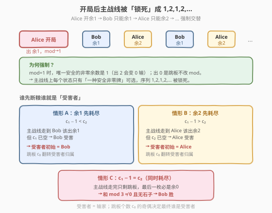
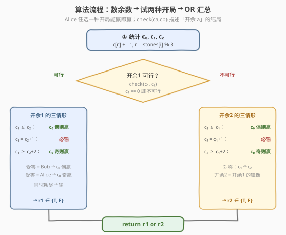
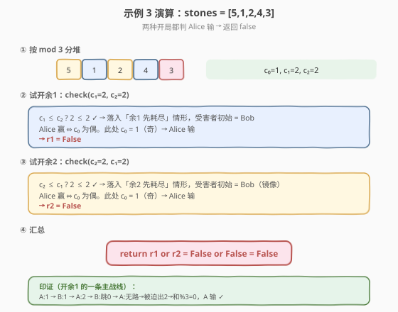

# LeetCode 石子游戏 IX 题解

## 1. 题目概述

- **标题 / 题号**：石子游戏 IX（#2029，medium）
- **链接**：https://leetcode.cn/problems/stone-game-ix/
- **难度**：中等
- **标签**：博弈、数学、贪心、数组

**题意**：给定一行 $n$ 个石子，每个石子有一个价值 `stones[i]`。Alice 和 Bob 轮流从中移除一个石子，**Alice 先手**。每一回合：

- 若玩家移除石子后，**所有已移除石子的价值总和**可以被 $3$ 整除，则该玩家**输**；
- 若上一条不成立，且移除后已无剩余石子，则 **Bob 直接获胜**（即便该回合轮到 Alice）。

双方都采用**最佳决策**。Alice 胜返回 `true`，Bob 胜返回 `false`。

**示例 1**：

```text
输入：stones = [2,1]
输出：true
解释：Alice 移除任一石子，Bob 移除剩下的。总和 = 1+2 = 3 可被 3 整除 → Bob 输，Alice 胜。
```

**示例 2**：

```text
输入：stones = [2]
输出：false
解释：Alice 移除唯一石子，总和 = 2，不被 3 整除；但石子已尽 → Bob 胜。
```

**示例 3**：

```text
输入：stones = [5,1,2,4,3]
输出：false
解释：Bob 总能赢。一种过程：A:1 → B:3 → A:4 → B:2 → A:5，总和 = 15 被 3 整除，Alice 输。
```

**约束**：

- $1 \le \text{stones.length} \le 10^5$
- $1 \le \text{stones}[i] \le 10^4$

> 💡 **审题关键**：① 判定条件只关心「总和能否被 $3$ 整除」，故**只有 $\text{stones}[i] \bmod 3$ 有意义**——价值 $5$ 与 $2$ 在游戏中完全等价；② 「移除后总和 $\bmod 3 = 0$ 即输」等价于「当前累加和 $\bmod 3$ 为 $m$ 时，不能打出余数为 $(3 - m) \bmod 3$ 的牌」；③ 石子被双方共享，是**公平博弈**，但先手有「选开局」的优势。

## 2. 解题思路

### 2.1 暴力思路：极小化极大回溯

最直觉的做法：把局面记成 `(剩余石子多重集, 当前累加和 mod 3, 当前轮到谁)`，用记忆化搜索枚举当前玩家所有合法移除，递归判断是否存在「无论对手怎么应对，当前玩家都能赢」的开局选择。

- **正确性**：博弈树完整覆盖，能给出确切答案。
- **效率**：状态空间是「剩余石子的可重集」，即便只看余数类别，也是 $c_0 \times c_1 \times c_2$ 级别，而 $c_0+c_1+c_2 \le 10^5$，状态数爆炸，完全不可行。

> ⚠️ 暴力的根源在于「把每颗石子当独立个体」。但题目只关心总和 $\bmod 3$，所有同余数的石子在游戏中**完全等价**。把石子按 $\bmod 3$ 归类后，局面可压缩为 $(c_0, c_1, c_2, \text{mod})$，但仍需进一步洞察把博弈化为闭合形式。

### 2.2 核心观察：余数分堆 + 跳板机制 + 强制主战线


**第一步：石子按 $\bmod 3$ 分三堆。** 设 $c_0, c_1, c_2$ 分别为价值余 $0, 1, 2$ 的石子个数。累加和 $\bmod 3$ 的转移只取决于打出的余数：

| 当前 $\bmod 3$ | 打出余 $0$ | 打出余 $1$ | 打出余 $2$ |
|---|---|---|---|
| $1$ | $1$（安全） | $2$（安全） | $0$（**输**） |
| $2$ | $2$（安全） | $0$（**输**） | $1$（安全） |

> 💡 **关键洞察：余 $0$ 的石子是「跳板」。** 它不改变累加和 $\bmod 3$，只是把出牌权交给对手——等价于「跳过自己的这一回合」。它不参与主战线，只在关键时刻用来**翻转谁是受害者**。所以 $c_0$ 的作用被压缩为「**奇偶性**」。

**第二步：开局后主战线被「锁死」成 $1,2,1,2,\dots$。** Alice 的开局只能选余 $1$ 或余 $2$（开局打余 $0$ 会立即让总和 $\bmod 3 = 0$，自爆）。设 Alice 开局打余 $a$（$a \in \{1,2\}$），则累加和 $\bmod 3 = a$。此后每个状态只有**一种安全的非零牌**可打：

- $\bmod = 1$ 时只能打余 $1$（打余 $2$ 会变 $0$ 输）；
- $\bmod = 2$ 时只能打余 $2$（打余 $1$ 会变 $0$ 输）。

于是主战线被锁死为交替序列 $a, \bar a, a, \bar a, \dots$（其中 $\bar a = 3 - a$），交替归属 Bob、Alice、Bob、Alice……唯一的「自由度」是任何时候都可以用一张跳板（余 $0$）换人，但这不改 $\bmod$，只翻转后续归属。



**第三步：谁先「断粮」谁就是受害者，跳板奇偶翻转归属。** 主战线上余 $1$ 与余 $2$ 的消耗速率由 $c_1, c_2$ 决定。以「Alice 开局打余 $1$」为例，开局消耗 $1$ 张余 $1$，记剩余 $c_1' = c_1 - 1$、$c_2' = c_2$。主战线序列为 $1, 2, 1, 2, \dots$，三种结局：

- **情形 A（余 $1$ 先耗尽，$c_1' < c_2'$，即 $c_1 \le c_2$）**：主战线走到「Bob 该出余 $1$」时 $c_1$ 已空，Bob 无安全非零牌 → 受害者初始为 **Bob**。Bob 此时只能出跳板换人，把受害者推给 Alice；Alice 再出跳板推回……形成**跳板争夺战**。跳板 $c_0$ 个，双方轮流消耗，**最后一个出跳板的人把受害者推给对方**：
  - $c_0$ 偶 → 受害者仍是 Bob → **Bob 输 → Alice 胜**；
  - $c_0$ 奇 → 受害者翻成 Alice → **Alice 输 → Bob 胜**。
- **情形 B（余 $2$ 先耗尽，$c_1' > c_2'$，即 $c_1 \ge c_2 + 2$）**：主战线走到「Alice 该出余 $2$」时 $c_2$ 已空 → 受害者初始为 **Alice**。同理跳板争夺：
  - $c_0$ 偶 → 受害者仍 Alice → **Alice 输**；
  - $c_0$ 奇 → 受害者翻成 Bob → **Bob 输 → Alice 胜**。
- **情形 C（同时耗尽，$c_1' = c_2'$，即 $c_1 = c_2 + 1$）**：主战线走完时余 $1$、余 $2$ 双空，只剩跳板。最后一枚被打出的必是跳板，总和 $\bmod 3 \ne 0$ 且石子耗尽 → 触发「Bob 直接获胜」规则 → **Alice 输**（与 $c_0$ 奇偶无关）。

> 💡 **为何跳板只在「被迫」时才用？** 当玩家手里**还有安全非零牌**时，主动出跳板只会白消耗一张跳板、把当前强制牌的归属推给对手；但对手完全可以接着打出这张牌（石子是共享池，谁来打消耗的是同一颗）。所以主动出跳板不改变非零石子的消耗序列，只改「最终谁是受害者」的奇偶——而这个奇偶已被跳板总数 $c_0$ 决定。故主战线必然走完，跳板只在断粮处的争夺战里消耗，结论仅依赖 $c_0 \bmod 2$ 与 $c_1, c_2$ 的大小关系。

把 Alice 开局打余 $a$ 的判定封装为 `check(ca, cb)`（`ca` 是开局余数的计数，`cb` 是另一种余数的计数），三种情形汇总：

| 条件（开局打余 $a$） | Alice 胜？ |
|---|---|
| $c_a = 0$（无法开局） | 必败 → `False` |
| $c_a \le c_b$（情形 A） | $c_0$ 为偶则胜 |
| $c_a = c_b + 1$（情形 C） | 必败 → `False` |
| $c_a \ge c_b + 2$（情形 B） | $c_0$ 为奇则胜 |

Alice 只要有**任一**开局能赢就赢，故 `check(c₁, c₂) or check(c₂, c₁)`。

### 2.3 算法流程图



1. **数余数**：一次遍历统计 $c_0, c_1, c_2$。
2. **试开余 1**：用 `check(c₁, c₂)` 按上表判定，得布尔 $r_1$。
3. **试开余 2**：用 `check(c₂, c₁)`（镜像，把 $c_1, c_2$ 对调），得 $r_2$。
4. **汇总**：`return r₁ or r₂`。

> 💡 `check(c₂, c₁)` 不是新函数，而是把参数对调复用同一个 `check(ca, cb)`——开余 $2$ 是开余 $1$ 的**完全镜像**（把 $1$ 与 $2$ 互换、受害者归属互换，但奇偶判据同构）。

### 2.4 示例演算

以示例 3 `stones = [5,1,2,4,3]` 演算：



| 步骤 | 计算 | 结果 |
|------|------|------|
| ① 分堆 | 余数：$5\to2,\ 1\to1,\ 2\to2,\ 4\to1,\ 3\to0$ | $c_0=1,\ c_1=2,\ c_2=2$ |
| ② 试开余 1 | `check(c₁=2, c₂=2)`：$c_1 \le c_2$ ✓（情形 A），Alice 胜 $\iff c_0$ 偶；$c_0=1$ 奇 | $r_1 = \text{False}$ |
| ③ 试开余 2 | `check(c₂=2, c₁=2)`：$c_2 \le c_1$ ✓（镜像情形 A），$c_0=1$ 奇 | $r_2 = \text{False}$ |
| ④ 汇总 | $r_1 \lor r_2 = \text{False} \lor \text{False}$ | `False` |

**印证**（开余 1 的一条主战线）：Alice 出 $1$（$\to1$）→ Bob 出 $1$（$\to2$）→ Alice 出 $2$（$\to1$）→ Bob 跳板 $0$（$\to1$）→ Alice 无安全非零牌，被迫出余 $2$（$\to0$）输。与公式结论一致。

> 💡 **观察要点**：① 两种开局都落入情形 A/B 的「$c_a \le c_b$」分支，受害者初始是 Bob，但 $c_0=1$（奇）把受害者翻给 Alice——这正是单颗价值 $3$（跳板）的「翻盘」作用；② 若把那颗 $3$ 换成 $6$（仍余 $0$），$c_0$ 不变，结论不变——再次印证只有余数与奇偶起作用。

## 3. 参考代码

### C++

```cpp
class Solution {
public:
    bool stoneGameIX(vector<int>& stones) {
        int cnt[3] = {0, 0, 0};
        for (int s : stones) cnt[s % 3]++;
        int c0 = cnt[0];
        auto check = [&](int ca, int cb) -> bool {
            if (ca == 0) return false;            // 无法以此余数开局
            if (ca <= cb)      return c0 % 2 == 0; // 情形 A：受害 Bob，c0 偶则 Alice 胜
            if (ca == cb + 1)  return false;       // 情形 C：同时耗尽，Bob 胜
            return c0 % 2 == 1;                    // 情形 B：受害 Alice，c0 奇则 Alice 胜
        };
        return check(cnt[1], cnt[2]) || check(cnt[2], cnt[1]);
    }
};
```

### Python

```python
class Solution:
    def stoneGameIX(self, stones: List[int]) -> bool:
        cnt = [0, 0, 0]
        for s in stones:
            cnt[s % 3] += 1
        c0 = cnt[0]

        def check(ca: int, cb: int) -> bool:
            if ca == 0:
                return False                # 无法以此余数开局
            if ca <= cb:
                return c0 % 2 == 0          # 情形 A：受害 Bob，c0 偶则 Alice 胜
            if ca == cb + 1:
                return False                # 情形 C：同时耗尽，Bob 胜
            return c0 % 2 == 1              # 情形 B：受害 Alice，c0 奇则 Alice 胜

        return check(cnt[1], cnt[2]) or check(cnt[2], cnt[1])
```

> 💡 **写法对照**：两版逻辑一致——`check(ca, cb)` 用三个分支覆盖情形 A/B/C，`check(c₁,c₂) or check(c₂,c₁)` 镜像复用。`ca == cb + 1` 必败分支可省略（落入最后的 `c0 % 2 == 1` 也会算错），必须显式拦截。

> ⚠️ **常见坑**：① 直接贪心模拟「能出非零就出非零，否则出跳板，否则认输」在多数情况下等价，但**漏了「石子耗尽 → Bob 胜」规则**会在示例 2（只剩一颗余 $2$）误判为 Alice 胜；② 把 $c_0$ 当成「可以无限跳板」而忽略奇偶，会漏掉情形 A/B 的奇偶翻转；③ 忘记尝试**两种开局**——只试开余 $1$ 会漏掉镜像获胜的情形（如 $c_0=0, c_1=2, c_2=1$，开余 $1$ 输但开余 $2$ 赢）。

## 4. 复杂度分析

| 维度 | 复杂度 | 说明 |
|------|--------|------|
| 时间复杂度 | $O(n)$ | 一次遍历统计 $c_0, c_1, c_2$；`check` 为 $O(1)$ 常数次比较 |
| 空间复杂度 | $O(1)$ | 仅用三个计数变量与常数中间量 |

> 💡 本题的优雅在于把指数级博弈树压缩成「三个计数 + 奇偶」的闭合形式：$10^5$ 颗石子的信息全被 $\bmod 3$ 抹平，跳板的奇偶决定受害者归属，开局选择提供两个对称的获胜机会。识别「公平博弈 + 共享池 + 余数不变量」这三要素，是把博弈题降维为数学判定的关键。

## 5. 扩展：跳板奇偶翻转的形式化证明

为何跳板 $c_0$ 的**奇偶**而非数量决定结局？把「断粮点」的局面包成单一状态：当前玩家 $P$ 面对余数 $a$ 的强制牌，但 $c_a = 0$，手里只有跳板。$P$ 不出跳板则被迫打出余 $\bar a$（$\to 0$，输），所以 $P$ 必出跳板（若还有）换人。

设受害者归属为变量 $V \in \{P, Q\}$（$Q$ 为对手），初始 $V = P$。每出一张跳板，$V$ 翻转一次（出牌权交对手，对手面对同一强制牌、同一断粮局面）。跳板共 $c_0$ 张，全部耗尽后 $V$ 翻转 $c_0$ 次：

$$V_{\text{final}} = \begin{cases} P & c_0 \text{ 为偶} \\ Q & c_0 \text{ 为奇} \end{cases}$$

最终受害者 $V_{\text{final}}$ 无跳板可出，被迫打余 $\bar a$ → 总和 $\bmod 3 = 0$ → 输。故 $c_0$ 偶则初始受害者 $P$ 输，$c_0$ 奇则对手 $Q$ 输。**数量无关、只看奇偶**的根源是：跳板的作用是「翻转归属」，而翻转的累积效果只取决于次数的奇偶。

> 💡 **推广**：若把「输」的模数从 $3$ 改为 $k$，则石子按 $\bmod k$ 分 $k$ 堆，余 $0$ 仍是跳板，主战线变为在 $\{1,\dots,k-1\}$ 上的强制游走（每个 $\bmod$ 状态的安全余数唯一：$m \to (k-m) \bmod k$ 被禁，其余可走）。但 $k > 3$ 时安全余数不唯一，主战线不再锁死，结论需用一般博弈 DP，不再有闭合形式——$k=3$ 的精巧之处正在于「每个状态恰有一种安全非零牌」。

## 6. 面试要点

**Q1：为什么只看 `stones[i] % 3`，价值本身不重要？**

> 判定条件是「总和能否被 $3$ 整除」，即 $\sum \text{stones}[i] \bmod 3$。由同余性质，$\sum \text{stones}[i] \bmod 3 = \sum (\text{stones}[i] \bmod 3) \bmod 3$。故每颗石子只有它对 $3$ 的余数参与计算，价值 $5$ 与 $2$（都余 $2$）在游戏中完全等价。把石子按余数归为三堆后，$10^5$ 颗石子的信息被压缩成三个计数。

**Q2：为什么说主战线被「锁死」？玩家难道没有选择？**

> 在 $\bmod = 1$ 时，安全非零牌只有余 $1$（打余 $2$ 会变 $0$ 输）；在 $\bmod = 2$ 时，安全非零牌只有余 $2$。所以一旦 Alice 选定开局余数 $a$，后续每个状态的「安全非零牌」唯一，序列被锁成 $a, \bar a, a, \bar a, \dots$。玩家唯一的自由度是「出跳板换人」，但跳板不改 $\bmod$、只翻转归属，且其翻转效果只看奇偶，故主战线的非零消耗顺序不变，结局由 $c_0 \bmod 2$ 与 $c_1, c_2$ 大小关系唯一决定。

**Q3：情形 C（$c_a = c_b + 1$）为何必败、与 $c_0$ 奇偶无关？**

> 此时余 $1$、余 $2$ 在主战线走完时同时耗尽，只剩跳板。最后一枚被打出的必是跳板，总和 $\bmod 3 \ne 0$（跳板不改 $\bmod$，而主战线维持 $\bmod \in \{1,2\}$），且石子耗尽 → 触发「无剩余石子 → Bob 胜」的规则。无论 $c_0$ 奇偶，最后一颗都是跳板、总和都非 $0$，故 Alice 必败。

**Q4：为什么必须尝试两种开局（开余 1 和开余 2）？**

> 两种开局对应不同的受害者初始归属与 $c_1, c_2$ 大小关系。例如 $c_0 = 0, c_1 = 2, c_2 = 1$：开余 $1$ 落入情形 C（$c_1 = c_2 + 1$）必败；开余 $2$ 落入情形 A（$c_2 \le c_1$）且 $c_0$ 偶 → Alice 胜。只试一种会漏掉镜像获胜机会。Alice 的先手优势正体现在「有两个对称的开局可选，任一能赢即赢」。

**Q5：能否用「贪心模拟」代替闭合形式判定？**

> 可以，但需补上两条规则：① 主战线玩家「能出安全非零牌就出，否则出跳板，否则认输」；② **每次出牌后若石子耗尽且总和 $\bmod 3 \ne 0$，判 Bob 胜**（这条最易漏，示例 2 即此坑）。补全后贪心模拟与闭合形式等价（因跳板主动出不出不影响非零消耗序列，只影响奇偶，而奇偶已被 $c_0$ 决定）。闭合形式 $O(n)$ 更简洁，且避免模拟实现里的边界 bug。

> 💡 **一句话总结**：数 $c_0, c_1, c_2$ → 对两种开局分别用 `check(ca, cb)` 查三情形表（$c_a \le c_b$ 看 $c_0$ 偶；$c_a = c_b+1$ 必败；$c_a \ge c_b+2$ 看 $c_0$ 奇）→ `or` 汇总，$O(n)$ 判定。

## 同类练习题

| # | 题目 | 与本题的关联 |
|---|------|-------------|
| 877 | [石子游戏](https://leetcode.cn/problems/stone-game/) | 同属石子游戏系列，但取两端、求先手必胜的数学判定（总和为偶则 Alice 必胜），对照本题「闭合形式博弈」的化归思路 |
| 1140 | [石子游戏 II](https://leetcode.cn/problems/stone-game-ii/) | 取前若干堆、剩余堆数变化，需区间 DP / 记忆化博弈，对照本题「能化为闭合形式」的稀有情形 |
| 1406 | [石子游戏 III](https://leetcode.cn/problems/stone-game-iii/) | 从一端取、值有正负，博弈 DP 求先手最大分差，与本题共享「公平博弈 + 最优决策」框架 |
| 810 | [黑板异或游戏](https://leetcode.cn/problems/chalkboard-xor-game/) | 另一道「按位运算 + 奇偶性 + 闭合形式」的博弈题，本题「跳板奇偶翻转归属」与彼「异或为零即输 + 数量奇偶」异曲同工 |
| 292 | [Nim 游戏](https://leetcode.cn/problems/nim-game/) | 博弈闭合形式的鼻祖（$n \bmod 4 \ne 0$ 先手胜），对照本题「$c_0 \bmod 2$ + $c_1, c_2$ 关系」的奇偶判定范式 |
