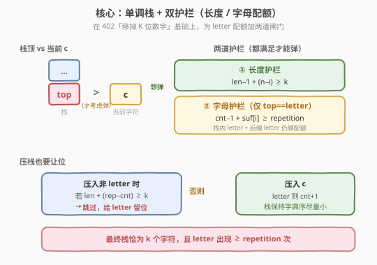
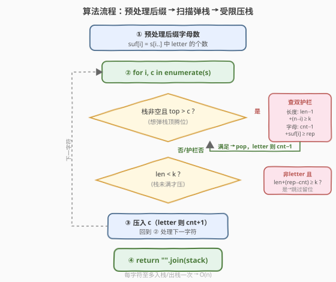
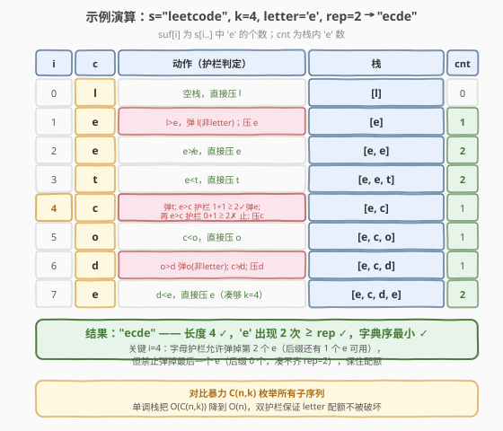

# LeetCode 含特定字母的最小子序列 题解

## 1. 题目概述

- **标题 / 题号**：含特定字母的最小子序列（#2030，hard）
- **链接**：https://leetcode.cn/problems/smallest-k-length-subsequence-with-occurrences-of-a-letter/
- **难度**：困难
- **标签**：栈、贪心、单调栈、字符串

**题意**：给定字符串 `s`、整数 `k`、字符 `letter` 与整数 `repetition`。返回 `s` 中长度为 `k` 且**字典序最小**的子序列，同时该子序列中 `letter` 出现**至少** `repetition` 次。保证 `letter` 在 `s` 中至少出现 `repetition` 次。

**子序列**：由原字符串删除一些（或不删除）字符、不改变剩余字符顺序得到。

**示例 1**：

```text
输入：s = "leet", k = 3, letter = "e", repetition = 1
输出："eet"
解释：长度为 3 且含至少 1 个 'e' 的子序列有 "lee"/"let"/"let"/"eet"，
      其中 "eet" 字典序最小。
```

**示例 2**：

```text
输入：s = "leetcode", k = 4, letter = "e", repetition = 2
输出："ecde"
解释："ecde" 是长度为 4、含至少 2 个 'e' 的字典序最小子序列。
```

**示例 3**：

```text
输入：s = "bb", k = 2, letter = "b", repetition = 2
输出："bb"
```

**约束**：

- $1 \le \text{repetition} \le k \le \text{s.length} \le 5 \times 10^4$
- `s` 由小写英文字母组成
- `letter` 是小写英文字母，在 `s` 中至少出现 `repetition` 次

> 💡 **审题关键**：① 「字典序最小的长度为 $k$ 的子序列」正是 [402. 移掉 K 位数字](https://leetcode.cn/problems/remove-k-digits/) 的经典单调栈模型——能弹就弹掉较大的栈顶；② 额外约束「`letter` 至少 `repetition` 次」意味着**不能无脑弹掉 `letter`**，必须给 `letter` 预留配额；③ $n \le 5\times10^4$，暴力枚举 $\binom{n}{k}$ 不可行，需 $O(n)$ 的栈贪心。

## 2. 解题思路

### 2.1 暴力思路：枚举所有长度为 k 的子序列

最直觉的做法：从 $n$ 个位置中选 $k$ 个（保持顺序），枚举所有 $\binom{n}{k}$ 个子序列，过滤出 `letter` 次数 $\ge \text{repetition}$ 的，再取字典序最小。

- **正确性**：穷举所有可能，必然得到最优解。
- **效率**：$\binom{n}{k}$ 在 $n=5\times10^4$、$k=n/2$ 时是天文数字，完全不可行。

> ⚠️ 暴力的根源在于「把选子序列当成组合枚举」。但字典序最小有**贪心结构**：越靠前的位置越小越好。这正是单调栈的用武之地——只需线性扫描，遇到更小的字符就尝试弹掉栈顶较大的字符。

### 2.2 核心观察：单调栈 + 双护栏



本题是 [402. 移掉 K 位数字](https://leetcode.cn/problems/remove-k-digits/) 的升级版。先回顾 402 的单调栈框架：维护一个栈，扫描 `s`，当栈顶字符 `top` 大于当前字符 `c` 时，弹出 `top`（让更小的 `c` 靠前，字典序更小），直到栈顶不再大于 `c` 或不能再弹，然后压入 `c`。最终栈中保留的就是字典序最小的子序列。

**402 的弹栈条件**只有一道护栏——「长度护栏」：弹掉栈顶后，剩余可用字符（栈内 + 后缀）仍够凑出 $k$ 个，否则不能弹。即

$$\text{len}(\text{stack}) - 1 + (n - i) \ge k$$

（栈弹一个剩 $\text{len}-1$，后缀含当前位置共 $n-i$ 个，总和需 $\ge k$。）

本题多了一个「`letter` 至少 `repetition` 次」的约束，需要再加一道护栏——「字母护栏」：当要弹的栈顶**恰好是 `letter`** 时，弹掉后剩余可达的 `letter` 数（栈内 `letter` + 后缀 `letter`）仍要 $\ge \text{repetition}$。设 `cnt` 为当前栈内 `letter` 数，`suf[i]` 为 `s[i..]` 中 `letter` 的个数，则弹 `letter` 的条件是

$$\text{cnt} - 1 + \text{suf}[i] \ge \text{repetition}$$

> 💡 **为什么是 `suf[i]` 而不是 `suf[i+1]`？** 因为判定弹栈发生在压入 `c` 之前，此时 `c` 尚未入栈，后缀可用的 `letter` 包含当前位置 `s[i]` 及其之后，即 `suf[i]`。栈内 `letter`（弹掉一个后剩 `cnt-1`）加上后缀全部 `letter`（`suf[i]`）就是「最多还能凑到的 `letter` 数」，必须 $\ge \text{repetition}$ 才允许弹。

**还有一道「压栈让位」护栏**：仅靠弹栈护栏还不够。考虑 `s = "aab"`, $k=2$, `letter='b'`, $\text{repetition}=1$——若两个 `'a'` 都压入，栈满后 `'b'` 无处安放，结果错误地变成 `"aa"`。原因是非 `letter` 字符**占用了本该留给 `letter` 的名额**。因此压入一个**非 `letter`** 字符前，要确认栈里还留有足够名额给必需的 `letter`：

$$\text{len}(\text{stack}) + (\text{repetition} - \text{cnt}) < k \quad \text{才压入非 letter}$$

（`len` 是压入前栈长，`repetition - cnt` 是还需的 `letter` 数；二者之和 $< k$ 表示压入这个非 `letter` 后仍有空位留给 `letter`。若 $\ge k$，则此名额必须留给 `letter`，跳过该非 `letter` 字符。）`letter` 字符本身不受此限——它压入既占一个名额又贡献一个 `letter`，总是有益。

三道护栏合在一起，既保证字典序尽量小（能弹就弹），又保证最终恰好 $k$ 个字符且 `letter` 不少于 `repetition` 次。

> ⚠️ **不变量**：扫描过程中始终维持 $\text{cnt} + \text{suf}[i] \ge \text{repetition}$（栈内 `letter` + 后缀 `letter` 足够凑配额）。初始 `cnt=0`、`suf[0]` 为 `letter` 总数 $\ge \text{repetition}$ 成立；压入/弹出 `letter` 时 `cnt` 与 `suf` 此消彼长，不变量保持。这正是字母护栏判定可靠的理论基础。

### 2.3 算法流程图



1. **预处理后缀**：`suf[i]` = `s[i..n-1]` 中 `letter` 的个数，逆序递推 $O(n)$。
2. **扫描 `s`**：对每个 `c = s[i]`：
   - **弹栈**：当栈非空且栈顶 `> c` 时，依次检查两道护栏——
     - 长度护栏：`len-1 + (n-i) >= k` 否则 `break`；
     - 字母护栏：若栈顶是 `letter`，需 `cnt-1 + suf[i] >= repetition` 否则 `break`；
     - 都满足则弹出栈顶（若弹的是 `letter`，`cnt -= 1`），继续循环。
   - **压栈**：若 `len < k`：
     - 若 `c != letter` 且 `len + (repetition - cnt) >= k`，则**跳过**（给 `letter` 留名额）；
     - 否则压入 `c`（若 `c == letter`，`cnt += 1`）。
3. **返回** `"".join(stack)`。

> 💡 **为什么栈最终恰好 $k$ 个？** 长度护栏保证不会因弹栈导致凑不够 $k$；压栈时 `len < k` 才压，且非 `letter` 仅在有余地时压入。问题保证有解（`letter` 出现 $\ge \text{repetition}$ 次、$k \le n$），不变量 `cnt + suf[i] >= repetition` 与长度护栏共同保证扫描结束时栈恰好填满 $k$ 个且 `letter` 数 $\ge \text{repetition}$。

### 2.4 示例演算

以示例 2 `s = "leetcode"`, $k=4$, `letter='e'`, $\text{repetition}=2$ 演算，后缀 `e` 计数 `suf = [3,3,2,1,1,1,1,1,0]`：



| 步骤 | $i$ / $c$ | 动作（护栏判定） | 栈 | cnt |
|------|-----------|------------------|----|-----|
| ① | 0 / `l` | 空栈，直接压 `l` | `[l]` | 0 |
| ② | 1 / `e` | `l>e` 弹 `l`（非 letter）；压 `e` | `[e]` | 1 |
| ③ | 2 / `e` | `e≯e`，直接压 `e` | `[e,e]` | 2 |
| ④ | 3 / `t` | `e<t`，直接压 `t` | `[e,e,t]` | 2 |
| ⑤ | 4 / `c` | 弹 `t`；`e>c` 护栏 $1+1\ge2$ ✓ 弹 `e`；再 `e>c` 护栏 $0+1\ge2$ ✗ 止；压 `c` | `[e,c]` | 1 |
| ⑥ | 5 / `o` | `c<o`，直接压 `o` | `[e,c,o]` | 1 |
| ⑦ | 6 / `d` | `o>d` 弹 `o`（非 letter）；`c≯d`；压 `d` | `[e,c,d]` | 1 |
| ⑧ | 7 / `e` | `d<e`，直接压 `e`（凑够 $k=4$） | `[e,c,d,e]` | 2 |

验证：长度 $4$ ✓，`'e'` 出现 $2$ 次 $\ge \text{repetition}=2$ ✓。关键在第 ⑤ 步——字母护栏**允许**弹掉第 2 个 `e`（后缀 `suf[4]=1`，$1+1\ge2$），但**禁止**弹掉最后一个 `e`（$0+1<2$），从而在压小字符 `c` 的同时保住配额。

> 💡 **若没有字母护栏会怎样？** 第 ⑤ 步会连弹两个 `e` 压入 `c`，得到 `[e,c,...]` 后最终只有 1 个 `e`，违反配额。字母护栏的作用正是在「贪心求小」与「保住配额」之间划下红线。

## 3. 参考代码

### C++

```cpp
class Solution {
public:
    string smallestSubsequence(string s, int k, char letter, int repetition) {
        int n = s.size();
        vector<int> suf(n + 1, 0);
        for (int i = n - 1; i >= 0; --i)
            suf[i] = suf[i + 1] + (s[i] == letter);
        string stk;
        int cnt = 0;
        for (int i = 0; i < n; ++i) {
            char c = s[i];
            while (!stk.empty() && stk.back() > c) {
                if ((int)stk.size() - 1 + n - i < k) break;          // 长度护栏
                if (stk.back() == letter && cnt - 1 + suf[i] < repetition) break; // 字母护栏
                if (stk.back() == letter) --cnt;
                stk.pop_back();
            }
            if ((int)stk.size() < k) {
                if (c != letter && (int)stk.size() + (repetition - cnt) >= k) continue; // 让位给 letter
                stk.push_back(c);
                if (c == letter) ++cnt;
            }
        }
        return stk;
    }
};
```

### Python

```python
class Solution:
    def smallestSubsequence(self, s: str, k: int, letter: str, repetition: int) -> str:
        n = len(s)
        suf = [0] * (n + 1)
        for i in range(n - 1, -1, -1):
            suf[i] = suf[i + 1] + (1 if s[i] == letter else 0)
        stack = []
        cnt = 0
        for i, c in enumerate(s):
            while stack and stack[-1] > c:
                if len(stack) - 1 + n - i < k:          # 长度护栏
                    break
                if stack[-1] == letter and cnt - 1 + suf[i] < repetition:  # 字母护栏
                    break
                if stack.pop() == letter:
                    cnt -= 1
            if len(stack) < k:
                if c != letter and len(stack) + (repetition - cnt) >= k:   # 让位给 letter
                    continue
                stack.append(c)
                if c == letter:
                    cnt += 1
        return "".join(stack)
```

> 💡 **写法对照**：两版逻辑完全一致——`suf` 后缀计数 $O(n)$，单趟扫描中每字符至多入栈、出栈各一次。C++ 用 `string` 当栈（`back()`/`push_back`/`pop_back`），省去额外容器；Python 用 `list` 当栈。注意 `cnt` 与 `suf` 的下标对齐：判定弹栈时用 `suf[i]`（含当前位），因为 `c` 尚未入栈。

> ⚠️ **溢出/边界**：$n \le 5\times10^4$，`cnt`、`suf[i]`、`repetition` 均 $\le n$，`int` 足够，无溢出风险。`(int)stk.size()` 显式转换避免 `size_t` 与有符号比较的编译警告。

## 4. 复杂度分析

| 维度 | 复杂度 | 说明 |
|------|--------|------|
| 时间复杂度 | $O(n)$ | 后缀预处理 $O(n)$；扫描中每字符至多入栈一次、出栈一次，栈操作总共 $O(n)$ |
| 空间复杂度 | $O(n)$ | `suf` 数组 $O(n)$ + 栈 $O(k) \le O(n)$；可滚动维护后缀计数降至 $O(k)$ 额外空间 |

> 💡 本题的精髓在于把「带配额的字典序最小子序列」纳入单调栈框架，仅用两道 $O(1)$ 判定（长度护栏、字母护栏）和一道压栈让位判定，就把指数级组合枚举降为线性。配额约束没有破坏贪心的最优性——因为护栏只「阻止弹掉必需的 `letter`」，不阻止任何能真正让字典序变小的合法弹栈。

## 5. 扩展：为何贪心+护栏保证全局最优

带配额的单调栈为何仍能得到**全局字典序最小**？核心是「护栏只挡非法弹栈，不挡合法弹栈」。

**合法性**：长度护栏保证最终能凑够 $k$ 个；字母护栏 + 压栈让位保证 `letter` 不少于 `repetition`。不变量 $\text{cnt} + \text{suf}[i] \ge \text{repetition}$ 贯穿全程，且压栈让位确保非 `letter` 不挤占 `letter` 名额，故结果合法。

**最优性**：对任意位置 $i$，若栈顶 $> c$ 且两道护栏通过，则弹掉栈顶、用 $c$ 替代它产生的子序列在该位置更小，且不损害后续可行性（护栏保证）。这与 402 的最优性论证同构——单调栈在「能弹则弹」下产生的就是字典序最小的合法栈内容。护栏只是把「能弹」的边界从「凑得够 $k$」收紧到「凑得够 $k$ 且保得住配额」，在合法解集合内仍取到字典序极小。

> 💡 **变体**：若把「至少 `repetition` 次」改为「恰好 `repetition` 次」，可在压入 `letter` 时额外限制 `cnt < repetition`（超过则不让压），其余逻辑不变；若改为「至多 `repetition` 次」，则压入 `letter` 前 `cnt < repetition`、且弹栈时不再保护 `letter`（可随意弹）。

## 6. 面试要点

**Q1：为什么用单调栈而不是动态规划？**

> 字典序最小子序列有强贪心结构：越靠前的位置越小越好。单调栈在线性扫描中「能弹则弹」，把更小字符推到前面，$O(n)$ 得到最优解。DP 需 $O(n^2 k)$ 状态（位置 × 已选长度 × 已用 letter 数），$n=5\times10^4$ 不可行。识别「字典序最小 + 子序列」→ 单调栈，是本题的第一层洞察。

**Q2：三道护栏分别防什么？能否去掉其中一道？**

> ① 长度护栏防「弹过头导致凑不够 $k$ 个」；② 字母护栏防「弹掉 `letter` 导致配额凑不齐」；③ 压栈让位防「非 `letter` 抢占 `letter` 名额」。三道缺一不可：去掉①会凑不够长度；去掉②会 `letter` 不足（如示例 2 连弹两个 `e`）；去掉③会 `letter` 名额被挤占（如 `s="aab", k=2` 错成 `"aa"`）。它们共同维护合法不变量。

**Q3：字母护栏为何用 `suf[i]` 而非 `suf[i+1]`？**

> 判定弹栈发生在压入 `c` 之前，`c` 尚未入栈，故「后缀可用 `letter`」包含当前位置 `s[i]`，即 `suf[i]`（含 `c`）。栈内 `letter`（弹一个后剩 `cnt-1`）+ 后缀 `letter`（`suf[i]`）= 最多还能凑到的 `letter` 数，需 $\ge \text{repetition}$ 才允许弹。若误用 `suf[i+1]` 会漏算当前位 `letter`，过度保守。

**Q4：压栈让位判定 `len + (repetition - cnt) >= k` 怎么理解？**

> `len` 是压入前栈长，`repetition - cnt` 是还需的 `letter` 数。二者之和 $\ge k$ 表示「现有字符 + 必需 `letter` 已填满 $k$ 个名额」，此时压入一个非 `letter` 会挤占 `letter` 名额，故跳过；$< k$ 表示还有空位，可以压入非 `letter`。`letter` 字符不受此限，因为它既占名额又贡献 `letter`，净效益为正。

**Q5：栈最终一定恰好 $k$ 个吗？会不会少？**

> 不会少。长度护栏保证弹栈不会使可达长度跌破 $k$；压栈在 `len < k` 时尽量压入（仅非 `letter` 在名额紧张时让位，而让位后该名额留给后续 `letter`）。问题保证有解（`letter` 出现 $\ge \text{repetition}$ 次、$k \le n$），结合不变量 $\text{cnt} + \text{suf}[i] \ge \text{repetition}$，扫描结束时栈恰好填满 $k$ 个且 `letter` 数 $\ge \text{repetition}$。

> 💡 **一句话总结**：单调栈框架（同 402）+ 长度护栏 + 字母护栏（弹 `letter` 需 `cnt-1+suf[i] >= repetition`）+ 压栈让位（非 `letter` 需 `len+(repetition-cnt) < k`），三道 $O(1)$ 判定，$O(n)$ 产出带配额的字典序最小子序列。

## 同类练习题

| # | 题目 | 与本题的关联 |
|---|------|-------------|
| 402 | [移掉 K 位数字](https://leetcode.cn/problems/remove-k-digits/) | 单调栈求字典序最小子序列的母题，本题即在其弹栈条件上加「字母护栏」与「压栈让位」 |
| 316 | [去除重复字母](https://leetcode.cn/problems/remove-duplicate-letters/) | 单调栈 + 每字符恰好保留一次的约束，同为「单调栈 + 额外配额护栏」范式 |
| 321 | [拼接最大数](https://leetcode.cn/problems/create-maximum-number/) | 从两数组拼出长度最大的子序列，单调栈 + 长度护栏的双数组扩展 |
| 1673 | [找出最具竞争力的子序列](https://leetcode.cn/problems/find-the-most-competitive-subsequence/) | 求长度为 k 的字典序最小子序列，即 402 的「选 k 个」版，本题无 letter 约束时的退化形态 |
| 1081 | [不同字符的最小子序列](https://leetcode.cn/problems/smallest-subsequence-of-distinct-characters/) | 与 316 同题，单调栈 + 去重约束，巩固「护栏保配额」思想 |
