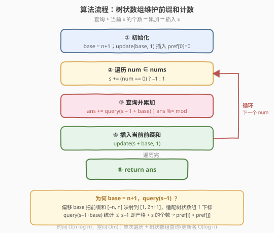
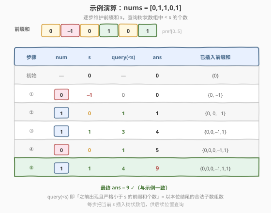

# LeetCode 1 比 0 多的子数组个数 题解

## 1. 题目概述

- **标题 / 题号**：1 比 0 多的子数组个数（#2031，medium）
- **链接**：https://leetcode.cn/problems/count-subarrays-with-more-ones-than-zeros/
- **难度**：中等
- **标签**：树状数组、前缀和、分治、归并排序

**题意**：给你一个只包含 `0` 和 `1` 的数组 `nums`，请返回 `1` 的数量**大于** `0` 的数量的**子数组**的个数。由于答案可能很大，请返回答案对 $10^9 + 7$ **取余**的结果。

一个**子数组**指的是原数组中连续的一个子序列。

**示例 1**：

```text
输入：nums = [0,1,1,0,1]
输出：9
解释：
长度为 1 的合法子数组有：[1], [1], [1]
长度为 2 的合法子数组有：[1,1]
长度为 3 的合法子数组有：[0,1,1], [1,1,0], [1,0,1]
长度为 4 的合法子数组有：[1,1,0,1]
长度为 5 的合法子数组有：[0,1,1,0,1]
```

**示例 2**：

```text
输入：nums = [0]
输出：0
解释：没有子数组的 1 的数量大于 0 的数量。
```

**示例 3**：

```text
输入：nums = [1]
输出：1
解释：长度为 1 的合法子数组有：[1]。
```

**约束**：

- $1 \le \text{nums.length} \le 10^5$
- $0 \le \text{nums}[i] \le 1$

> 💡 **审题关键**：① 「1 多于 0」即子数组中 $1$ 的个数 $-$ $0$ 的个数 $> 0$，这是一个**符号判定**而非精确计数；② 答案取模说明合法子数组数量级可达 $O(n^2)$，必须用 $O(n \log n)$ 量级算法，不能 $O(n^2)$ 枚举；③ 「个数差」启发把 $0$ 看作 $-1$，问题立刻归约为「子数组和 $> 0$」。

## 2. 解题思路

### 2.1 暴力思路：枚举所有子数组

枚举所有子数组 `nums[i..j]`，统计其中 $1$ 和 $0$ 的个数，若 $1$ 的个数严格大于 $0$ 的个数则计数加一。

- **正确性**：穷举所有 $O(n^2)$ 个子数组，逐个判定，必然得到正确答案。
- **效率**：每个子数组重新数 $1/0$ 个数需 $O(n)$，总 $O(n^3)$；即便用前缀和优化到 $O(1)$ 判定，仍是 $O(n^2)$ 个子数组，$n = 10^5$ 时约 $10^{10}$ 次操作，必然超时。

> ⚠️ 暴力的根源在于「逐个枚举子数组」。但合法子数组的判定条件「$1$ 多于 $0$」本质是一个**前缀和的大小关系**——若能把它转化为「统计满足某关系的前缀和对数」，就能用树状数组/归并排序把 $O(n^2)$ 降为 $O(n \log n)$。

### 2.2 核心观察：0 转 −1 + 前缀和

![核心：0 转 −1 → 前缀和 → 统计 pref[j] > pref[i]](../images/2031_concept.svg)

关键洞察分三步：

**第一步：把 0 看作 −1，问题归约为「子数组和 > 0」。** 子数组中 $1$ 的个数 $-$ $0$ 的个数，恰等于「把每个 $0$ 换成 $-1$、每个 $1$ 保持 $1$ 后的子数组元素和」。因此：

$$\text{合法} \iff \#1 - \#0 > 0 \iff \sum_{k=i}^{j-1} a_k > 0,\quad a_k = \begin{cases}1 & \text{nums}[k]=1 \\ -1 & \text{nums}[k]=0\end{cases}$$

**第二步：用前缀和表示子数组和。** 令 $\text{pref}[0] = 0$，$\text{pref}[k] = \sum_{t=0}^{k-1} a_t$，则子数组 `nums[i..j-1]` 的和为 $\text{pref}[j] - \text{pref}[i]$。于是：

$$\text{合法} \iff \text{pref}[j] - \text{pref}[i] > 0 \iff \text{pref}[j] > \text{pref}[i],\quad i < j$$

**第三步：统计对数——有多少对 $(i, j)$ 满足 $i < j$ 且 $\text{pref}[i] < \text{pref}[j]$。** 这正是「前缀和序列中，前面比后面小的对数」。我们边遍历边维护「已出现的前缀和」，对于当前的 $\text{pref}[j]$，查询已出现且**严格小于** $\text{pref}[j]$ 的前缀和个数，累加即为以 $j$ 为右端点的合法子数组数。

> 💡 **为何用树状数组？** 「查询已出现且 $< x$ 的个数 + 单点插入」是树状数组（BIT）的招牌操作，单次 $O(\log n)$。前缀和取值范围 $[-n, n]$，加偏移 $\text{base} = n + 1$ 映射到 $[1, 2n+1]$ 即可适配 BIT 的 1 下标。也可用归并排序或有序集合替代，思路一致。

### 2.3 算法流程图



1. **初始化**：建大小为 $2n+2$ 的树状数组，偏移 $\text{base} = n + 1$；执行 `update(base, 1)` 插入 $\text{pref}[0] = 0$，表示「前缀和为 $0$ 已出现 $1$ 次」。
2. **遍历** `nums`：维护当前前缀和 $s$，每读入一个数执行 $s \mathrel{+}= (\text{num}==0\;?\;-1:1)$。
3. **查询累加**：`ans += query(s - 1 + base)`，即统计此前出现且严格小于 $s$ 的前缀和个数（这些就是满足 $\text{pref}[i] < s = \text{pref}[j]$ 的左端点 $i$）；`ans %= mod`。
4. **插入**：`update(s + base, 1)`，把当前前缀和登记进树状数组，供后续位置查询。
5. 遍历结束，返回 `ans`。

> 💡 **细节：为什么先插入 $\text{pref}[0]=0$？** 因为子数组可以从下标 $0$ 开始，对应的左端点前缀和正是 $\text{pref}[0]=0$。提前插入它，才能在右端点 $j$ 处把「从 $0$ 开始的子数组」计入。`query(s-1)` 而非 `query(s)` 是为了**严格小于**（$\text{pref}[j] > \text{pref}[i]$，等于不算合法）。

### 2.4 示例演算

以示例 1 `nums = [0,1,1,0,1]` 演算（$\text{base} = n+1 = 6$）：



前缀和序列 $\text{pref} = [0, -1, 0, 1, 0, 1]$。逐步执行（初始已插入 $\{0\}$）：

| 步骤 | num | $s$ | query($<s$) | ans | 已插入前缀和 |
|------|-----|-----|------------|-----|-------------|
| 初始 | — | 0 | — | 0 | $\{0\}$ |
| ① | 0 | $-1$ | 0 | 0 | $\{0, -1\}$ |
| ② | 1 | 0 | 1（$-1$） | 1 | $\{0, 0, -1\}$ |
| ③ | 1 | 1 | 3（两个 $0$ + $-1$） | 4 | $\{0,0,-1,1\}$ |
| ④ | 0 | 0 | 1（$-1$） | 5 | $\{0,0,0,-1,1\}$ |
| ⑤ | 1 | 1 | 4（三个 $0$ + $-1$） | **9** | $\{0,0,0,-1,1,1\}$ |

验证：最终 `ans = 9`，与示例一致 ✅。

> 💡 **观察要点**：① 每步 `query(<s)` 得到的是「以当前位置为右端点的合法子数组数」，因为每个更小的前缀和 $\text{pref}[i]$ 对应一个合法子数组 `nums[i..j-1]`；② 当 $s$ 增大（读到 $1$）时查询结果通常变大（更多前缀和落在它下方），读到 $0$ 使 $s$ 减小时查询结果变小——这直观反映了「$1$ 越多越容易合法」。

## 3. 参考代码

### C++

```cpp
class BinaryIndexedTree {
private:
    int n;
    vector<int> c;

public:
    BinaryIndexedTree(int n)
        : n(n)
        , c(n + 1, 0) {}

    void update(int x, int v) {
        for (; x <= n; x += x & -x) {
            c[x] += v;
        }
    }

    int query(int x) {
        int s = 0;
        for (; x > 0; x -= x & -x) {
            s += c[x];
        }
        return s;
    }
};

class Solution {
public:
    int subarraysWithMoreZerosThanOnes(vector<int>& nums) {
        int n = nums.size();
        int base = n + 1;
        BinaryIndexedTree tree(n + base);
        tree.update(base, 1);
        const int mod = 1e9 + 7;
        int ans = 0, s = 0;
        for (int x : nums) {
            s += (x == 0) ? -1 : 1;
            ans += tree.query(s - 1 + base);
            ans %= mod;
            tree.update(s + base, 1);
        }
        return ans;
    }
};
```

### Python

```python
class BinaryIndexedTree:
    __slots__ = ("n", "c")

    def __init__(self, n: int):
        self.n = n
        self.c = [0] * (n + 1)

    def update(self, x: int, v: int):
        while x <= self.n:
            self.c[x] += v
            x += x & -x

    def query(self, x: int) -> int:
        s = 0
        while x:
            s += self.c[x]
            x -= x & -x
        return s


class Solution:
    def subarraysWithMoreZerosThanOnes(self, nums: List[int]) -> int:
        n = len(nums)
        base = n + 1
        tree = BinaryIndexedTree(n + base)
        tree.update(base, 1)
        mod = 10**9 + 7
        ans = s = 0
        for x in nums:
            s += x or -1
            ans += tree.query(s - 1 + base)
            ans %= mod
            tree.update(s + base, 1)
        return ans
```

> 💡 **写法对照**：两版逻辑完全一致——建 BIT、预插 $\text{pref}[0]=0$、遍历时「更新 $s$ → 查询 $<s$ → 累加取模 → 插入 $s$」。Python 中 `x or -1` 巧用「`0` 为假、`1` 为真」把 $0 \to -1$、$1 \to 1$ 一行表达；C++ 用三元运算符更显式。

> ⚠️ **溢出说明**：`query` 返回值 $\le n \le 10^5$，`ans` 每步取模故 $< 10^9+7$，累加前 `ans + query` $< 10^9 + 7 + 10^5 \approx 1.0001 \times 10^9$，未超过 `int` 上界（$\approx 2.147 \times 10^9$），故 C++ 用 `int` 安全。若担心可改 `long long` 承载中间量，返回前转回 `int`。偏移 `base = n+1` 把前缀和 $[-n, n]$ 平移到 $[1, 2n+1]$，树状数组大小开 $n + \text{base} = 2n+1$ 即可覆盖。

## 4. 复杂度分析

| 维度 | 复杂度 | 说明 |
|------|--------|------|
| 时间复杂度 | $O(n \log n)$ | 单次遍历 $O(n)$，每步树状数组查询 + 更新各 $O(\log n)$ |
| 空间复杂度 | $O(n)$ | 树状数组大小 $2n+2$ |

> 💡 本题的优雅在于「符号判定归约为大小关系」：把「$1$ 多于 $0$」翻译成「子数组和 $> 0$」再翻译成「前缀和的大小对数」，于是 $O(n^2)$ 的枚举变成 $O(n \log n)$ 的对数统计。这是**前缀和 + 树状数组**计数家族的招牌套路。

## 5. 扩展：有序集合与归并排序两种等价实现

「统计 $i<j$ 且 $\text{pref}[i] < \text{pref}[j]$ 的对数」不依赖树状数组，任何能做「查询 $<x$ 的个数 + 插入」的数据结构都可行。

### 5.1 有序集合（Python `SortedList`）

维护一个有序列表，每次用二分 `bisect_left(s)` 查询严格小于 $s$ 的个数，再 `add(s)` 插入。逻辑与树状数组版逐行对应，免去手写 BIT：

```python
from sortedcontainers import SortedList

class Solution:
    def subarraysWithMoreZerosThanOnes(self, nums: List[int]) -> int:
        sl = SortedList([0])
        mod = 10**9 + 7
        ans = s = 0
        for x in nums:
            s += x or -1
            ans += sl.bisect_left(s)
            ans %= mod
            sl.add(s)
        return ans
```

> ⚠️ `SortedList.bisect_left` $O(\log n)$，但 `add` 在 `sortedcontainers` 实现下均摊 $O(\log n)$，总体仍是 $O(n \log n)$。LeetCode Python 环境预装 `sortedcontainers`，可直接使用。

### 5.2 归并排序（求「非逆序对」数）

所求「$\text{pref}[i] < \text{pref}[j],\, i<j$」恰是**逆序对**（$\text{pref}[i] > \text{pref}[j],\, i<j$）的对偶。总对数 $\binom{n+1}{2} = \frac{n(n+1)}{2}$，因此：

$$\text{ans} = \frac{n(n+1)}{2} - \text{逆序对数} - \text{相等对数}$$

其中「相等对数」可在归并时一并统计（$\text{pref}[i] = \text{pref}[j]$ 的对数）。直接在归并过程中统计「左半 $<$ 右半」的对数亦可，与 [315. 计算右侧小于当前元素的个数](https://leetcode.cn/problems/count-of-smaller-numbers-after-self/) 的归并写法同构。归并法 $O(n \log n)$ 时间、$O(n)$ 空间，无需偏移映射，是树状数组的等价替代。

> 💡 **三种实现对比**：树状数组最紧凑、常数小；有序集合最易写、依赖第三方库；归并排序不依赖值域偏移、对负数天然友好。面试中任选一种讲清即可，树状数组版最推荐（通用、可扩展到区间计数，见 [327. 区间和的个数](https://leetcode.cn/problems/count-of-range-sum/)）。

## 6. 面试要点

**Q1：为什么把 0 换成 −1 就能转化问题？**

> 子数组中 $1$ 的个数 $-$ $0$ 的个数，等价于「把 $0$ 视作 $-1$、$1$ 视作 $+1$ 后的子数组元素和」。因为每个 $1$ 贡献 $+1$，每个 $0$ 贡献 $-1$，求和恰好是 $\#1 - \#0$。于是「$1$ 多于 $0$」$\iff$「子和 $>0$」。这种「把二值数组的计数差转成权和」是前缀和家族的标准起手式（参见 [525. 连续数组](https://leetcode.cn/problems/contiguous-array/) 把 $0$ 当 $-1$ 求最长等值子数组）。

**Q2：为什么统计前缀和的「小于对数」就得到答案？**

> 子数组 `nums[i..j-1]` 的和 $= \text{pref}[j] - \text{pref}[i]$。合法 $\iff$ 该和 $> 0 \iff \text{pref}[j] > \text{pref}[i]$。固定右端点 $j$，合法左端点 $i$（$i<j$）的个数就是「已出现且 $< \text{pref}[j]$ 的前缀和个数」。对所有 $j$ 求和即总合法子数组数。这把「数子数组」转成「数前缀和对」，从 $O(n^2)$ 降到 $O(n \log n)$。

**Q3：偏移 `base = n+1` 的作用是什么？能否去掉？**

> 树状数组的下标从 $1$ 开始，而前缀和取值在 $[-n, n]$ 含负数，无法直接作下标。加 `base = n+1` 把 $[-n, n]$ 平移到 $[1, 2n+1]$，全部落到正下标。若用归并排序或 `SortedList`（支持任意可比较值），则不需要偏移，负数天然可比较——这是归并法的一个优势。

**Q4：`query(s-1)` 为什么是 `s-1` 而不是 `s`？**

> 题目要求「$1$ **严格**多于 $0$」，即子和 $>0$，对应 $\text{pref}[j] > \text{pref}[i]$（严格大于）。`query(x)` 统计的是 $\le x$ 的个数，所以查询 $\le s-1$ 即「严格 $< s$」，恰好对应 $\text{pref}[i] < \text{pref}[j]$。若误用 `query(s)` 会把 $\text{pref}[i] = \text{pref}[j]$（子和为 $0$，即 $\#1 = \#0$）的错误情况计入。

**Q5：为什么初始化时要先 `update(base, 1)` 插入 $\text{pref}[0]=0$？**

> 子数组允许从原数组下标 $0$ 开始，此时左端点的前缀和正是 $\text{pref}[0]=0$。若不预插，第一个位置就查不到「$0$ 作为左端点」的情况，会漏掉所有从开头起始的合法子数组。预插一次 $0$ 表示「前缀和为 $0$ 已出现 $1$ 次」，保证右端点 $j$ 能正确匹配到 $i=0$。

> 💡 **一句话总结**：$0 \to -1$ 归约 → 前缀和 $\text{pref}$ → 统计 $i<j$ 且 $\text{pref}[i]<\text{pref}[j]$ 的对数 → 树状数组查询 $<s$ 的个数并插入 $s$，$O(n \log n)$。

## 同类练习题

| # | 题目 | 与本题的关联 |
|---|------|-------------|
| 525 | [连续数组](https://leetcode.cn/problems/contiguous-array/)（[题解](../0501-0600/525_连续数组.md)） | 同样把 $0$ 当 $-1$ + 前缀和，但用哈希存最早下标求**最长长度**，对照本题用树状数组求**计数** |
| 974 | [和可被 K 整除的子数组](https://leetcode.cn/problems/subarray-sums-divisible-by-k/)（[题解](../0901-1000/974_和可被K整除的子数组.md)） | 前缀和 + 同余定理计数，前缀和计数家族的另一经典 |
| 315 | [计算右侧小于当前元素的个数](https://leetcode.cn/problems/count-of-smaller-numbers-after-self/)（[题解](../0301-0400/315_计算右侧小于当前元素的个数.md)） | 树状数组/归并排序计数对数，与本题「统计 $\text{pref}[i]<\text{pref}[j]$ 对数」同构 |
| 327 | [区间和的个数](https://leetcode.cn/problems/count-of-range-sum/) | 统计子数组和 $\in [\text{lower}, \text{upper}]$ 的个数，归并/树状数组求解；本题即其区间 $(0, +\infty)$ 的特例 |
| 53 | [最大子数组和](https://leetcode.cn/problems/maximum-subarray/)（[题解](../0001-0100/53_最大子数组和.md)） | 前缀和求**最值**，对照本题前缀和求**计数**，同一工具不同目标 |
