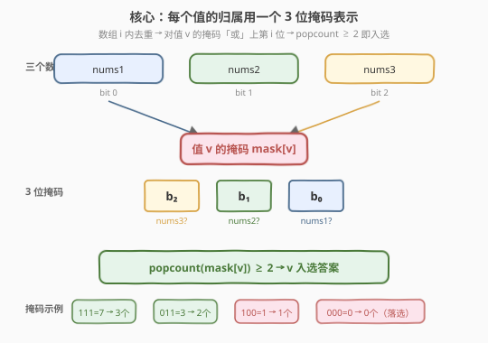
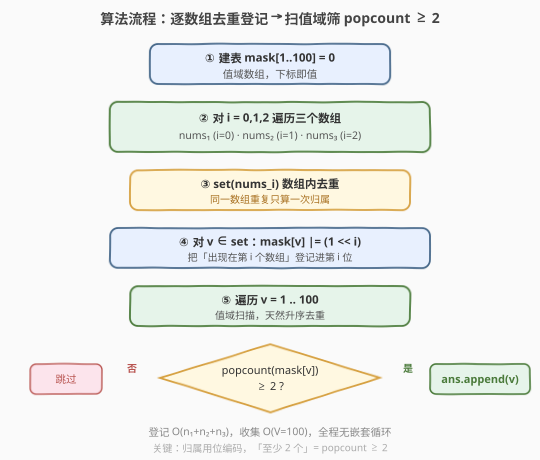
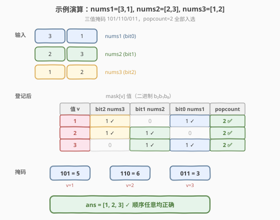

# 至少在两个数组中出现的值

- **题目名称**：至少在两个数组中出现的值
- **链接**：[2032. 至少在两个数组中出现的值](https://leetcode.cn/problems/two-out-of-three/)
- **难度**：简单
- **标签**：数组、哈希表、位运算、计数

## 1. 题目概述

给定三个整数数组 `nums1`、`nums2` 和 `nums3`，请你构造并返回一个**元素各不相同**的数组，且由**至少在两个数组中出现过**的所有值组成。返回顺序任意。

> 💡 **审题关键**：①「至少在两个数组中出现」按**数组归属**计数，而非按出现次数——同一数组内重复出现仍只算「出现在这一个数组」；② 结果元素各不相同，需去重；③ 值域 `nums[i] ∈ [1, 100]`，极小，可按值聚合。

**示例 1**：

```text
输入：nums1 = [1,1,3,2], nums2 = [2,3], nums3 = [3]
输出：[3,2]
解释：
- 3 在全部三个数组中都出现过 → 计 3
- 2 在 nums1、nums2 中出现过 → 计 2
- 1 仅在 nums1 中出现 → 不计
```

**示例 2**：

```text
输入：nums1 = [3,1], nums2 = [2,3], nums3 = [1,2]
输出：[2,3,1]
解释：每个值恰好出现在两个数组中，全部计入。
```

**示例 3**：

```text
输入：nums1 = [1,2,2], nums2 = [4,3,3], nums3 = [5]
输出：[]
解释：三个数组互不相交，没有值出现在 ≥2 个数组中。
```

**约束条件**：

- $1 \le \text{nums1.length}, \text{nums2.length}, \text{nums3.length} \le 100$
- $1 \le \text{nums1}[i], \text{nums2}[j], \text{nums3}[k] \le 100$

---

## 2. 解题思路

### 2.1 暴力思路：枚举值 × 逐数组线性查找

最直观的做法是：把三个数组里的所有值收集成一个候选集合（去重），然后对每个候选值 $v$，分别在 `nums1`、`nums2`、`nums3` 里线性扫描判断是否出现，统计命中的数组个数，$\ge 2$ 即收入答案。

```text
candidates = set(nums1) | set(nums2) | set(nums3)
for v in candidates:
    cnt = (v in nums1) + (v in nums2) + (v in nums3)
    if cnt >= 2: ans.append(v)
```

- **正确性**：穷举所有候选值并逐一判定，必然不漏。
- **效率**：候选值至多 $300$ 个，每次判定 $O(n_1+n_2+n_3)$，总体 $O(U \cdot (n_1+n_2+n_3))$，其中 $U$ 为候选规模。能通过，但每次「$v \in \text{nums}$」都要线性扫描，重复劳动多。

> ⚠️ 暴力的浪费在于：对每个候选值都重新扫描三个数组。其实「某个值出现在哪些数组」这一信息在遍历数组时就能一次性记录下来——把「逐值查数组」反过来变成「逐数组登记值」。

### 2.2 核心观察：按值聚合 + 位掩码登记归属



关键洞察分两步：

**第一步：归属即集合，重复不算数。** 题目问的是「值 $v$ 出现在几个数组」，而非「值 $v$ 总共出现几次」。所以对每个数组应先**去重**（当作集合），再登记。例如 `nums1 = [1,1,3,2]` 中 `1` 重复两次，但归属仅记「`1` 在数组 1 出现」一次。

**第二步：三个数组 → 3 位掩码。** 令数组编号为 $0, 1, 2$（对应 `nums1`、`nums2`、`nums3`）。对每个值 $v$ 维护一个掩码 $\text{mask}[v]$，第 $i$ 位为 $1$ 表示 $v$ 出现在第 $i$ 个数组中：

$$\text{mask}[v] = \sum_{i=0}^{2} \mathbb{1}[v \in \text{nums}_{i+1}] \cdot 2^i$$

遍历每个数组的去重集合，把对应位「或」进掩码。「至少出现在两个数组」等价于**掩码中 $1$ 的个数 $\ge 2$**，即 $\text{popcount}(\text{mask}[v]) \ge 2$。

> 💡 **为什么用位掩码？** 因为只有 $3$ 个数组，$3$ 位即可编码全部归属组合（共 $2^3 = 8$ 种状态）。掩码天然去重（同一数组多次「或」同一 bit 不变），且「至少 $k$ 个」用 popcount 一句话判定。这是「**少量集合的归属判定**」通用范式：$k$ 个集合用 $k$ 位掩码，判定「恰好/至少/至多 $m$ 个」皆转化为 popcount 比较。

### 2.3 算法流程图



1. **建表**：开辟长度 $101$ 的整数数组 `mask`（下标即值，下标 $0$ 不用），初始全 $0$。
2. **逐数组登记**：对 `nums1`、`nums2`、`nums3`（编号 $i = 0, 1, 2$），先转集合去重，再对其中每个值 $v$ 执行 `mask[v] |= (1 << i)`。
3. **收集答案**：遍历 $v \in [1, 100]$，若 $\text{popcount}(\text{mask}[v]) \ge 2$，把 $v$ 加入答案。
4. **返回** `ans`。

> 💡 **值域扫描代替候选集**：因为值域仅 $[1,100]$，最后直接扫一遍 $1$ 到 $100$ 比维护候选集合更简单，且天然升序、天然去重——结果「元素各不相同」由值域扫描天然保证，无需额外去重。

### 2.4 示例演算

以示例 2 `nums1 = [3,1]`, `nums2 = [2,3]`, `nums3 = [1,2]` 演算：



| 值 $v$ | nums1 (bit0) | nums2 (bit1) | nums3 (bit2) | 掩码（二进制） | popcount | 入选？ |
|--------|--------------|--------------|--------------|----------------|----------|--------|
| 1 | ✓ | — | ✓ | `101` = 5 | 2 | ✅ |
| 2 | — | ✓ | ✓ | `110` = 6 | 2 | ✅ |
| 3 | ✓ | ✓ | — | `011` = 3 | 2 | ✅ |

最终 `ans = [1, 2, 3]`（按值域升序，与示例 `[2,3,1]` 顺序不同但内容一致——题目允许任意顺序）。

> 💡 **观察要点**：① 每个值的掩码恰好有 $2$ 位为 $1$，对应「出现在恰好两个数组」；② 若某值出现在全部三个数组，掩码为 `111 = 7`，popcount $= 3 \ge 2$ 同样入选（如示例 1 中的 `3`）；③ 若仅出现在一个数组，掩码为 `001/010/100`，popcount $= 1$ 不入选。

---

## 3. 参考代码

### C++（值域数组 + 位掩码）

```cpp
class Solution {
public:
    vector<int> twoOutOfThree(vector<int>& nums1, vector<int>& nums2, vector<int>& nums3) {
        int mask[101] = {0};
        vector<vector<int>*> arrs = {&nums1, &nums2, &nums3};
        for (int i = 0; i < 3; ++i) {
            unordered_set<int> seen(arrs[i]->begin(), arrs[i]->end()); // 数组内去重
            for (int v : seen) mask[v] |= (1 << i);
        }
        vector<int> ans;
        for (int v = 1; v <= 100; ++v) {
            if (__builtin_popcount(mask[v]) >= 2) ans.push_back(v);
        }
        return ans;
    }
};
```

### Python

```python
class Solution:
    def twoOutOfThree(self, nums1: List[int], nums2: List[int], nums3: List[int]) -> List[int]:
        mask = [0] * 101
        for i, arr in enumerate((nums1, nums2, nums3)):
            for v in set(arr):          # 数组内去重
                mask[v] |= (1 << i)
        return [v for v in range(1, 101) if mask[v].bit_count() >= 2]
```

> ⚠️ **去重不可省**：若不先 `set(arr)` 而直接遍历原数组，同一数组内重复元素会把同一位反复「或」——结果虽不变（`x |= x` 幂等），但会多做无用功。更关键的是：若题目改为「按出现次数计数」（如至少出现 $2$ 次而非至少 $2$ 个数组），去重与否会导致完全不同的结果。本题是「按数组归属」，必须先去重。

> 💡 **Python 版本提示**：`int.bit_count()` 自 Python 3.10 起内置（对应 C++ 的 `__builtin_popcount`）。若环境低于 3.10，可用 `bin(mask[v]).count('1')` 替代，因值域仅 $100$ 性能无碍。

---

## 4. 复杂度分析

| 维度 | 复杂度 | 说明 |
|------|--------|------|
| 时间复杂度 | $O(n_1 + n_2 + n_3 + V)$ | 三个数组各遍历一次去重登记 $O(n_1+n_2+n_3)$；最后扫值域 $V=100$ 判 popcount |
| 空间复杂度 | $O(V)$ | 长度 $101$ 的掩码数组；$V=100$ 为常数，可视作 $O(1)$ 额外空间 |

> 💡 由于值域 $V = 100$ 是常数，时间实为 $O(n_1+n_2+n_3)$，空间实为 $O(1)$。即便数组总长 $3 \times 100 = 300$，整体运算量在千次量级，极轻量。

---

## 5. 扩展：通用化——k 个集合的归属判定

本题是「$3$ 个集合中至少 $2$ 个包含」的特例。推广到 $k$ 个集合、判定「至少 $m$ 个包含」：

- **掩码位宽**：$k$ 位（$k \le$ 机器字长时一个整数即可，更大可用 `bitset`）。
- **登记**：第 $i$ 个集合去重后，对每个元素 `mask[v] |= (1 << i)`。
- **判定**：`popcount(mask[v]) >= m`。

```python
def at_least_m_of_k(arrs, m):
    mask = defaultdict(int)
    for i, arr in enumerate(arrs):
        for v in set(arr):
            mask[v] |= (1 << i)
    return [v for v, bits in mask.items() if bits.bit_count() >= m]
```

> 💡 当 $k$ 较大（如 $k > 64$）时，位掩码不再适用，可退化为「按值计数出现于几个集合」——对每个值维护一个计数器，第 $i$ 个集合的去重元素计数 $+1$，最后筛 `cnt[v] >= m`。本质上 popcount 就是对掩码做「按位计数」，二者等价。

---

## 6. 面试要点

1. **「至少在两个数组出现」和「至少出现两次」有何区别？**

   - 前者按**数组归属**计数：同一数组内重复只算一个数组。后者按**出现次数**计数：同一数组内重复也算。本题属前者，必须先对每个数组去重再登记归属。例如 `nums1 = [1,1]` 单独一个数组，按归属 `1` 只在 $1$ 个数组出现；按次数 `1` 出现 $2$ 次。判定标准不同，结果不同。

2. **为什么用位掩码而不是直接计数？**

   - 三个集合的归属组合仅 $2^3 = 8$ 种，$3$ 位掩码即可完整编码。掩码天然幂等（同位重复「或」不变），隐式完成了「同一数组去重」；且 popcount 直接给出归属数，判定「$\ge 2$」一目了然。计数法也行，但掩码在集合数少时更紧凑、可读性更好，且能区分「具体出现在哪几个数组」（掩码本身即答案），信息量更大。

3. **为什么最后扫值域 $[1,100]$ 而不是遍历候选集合？**

   - 值域仅 $100$，扫描成本可忽略，且天然产出升序、去重的结果，无需额外排序/去重。若值域很大（如 $10^9$），则应遍历候选集合（三个数组去重后的并集），用哈希表存掩码，避免空扫大量未出现的值。

4. **如果值域放大到 $10^9$，算法如何调整？**

   - 把 `mask` 数组换成 `dict[int, int]`（哈希表），只在「实际出现过的值」上存掩码。最后遍历哈希表的键判 popcount。时间仍为 $O(n_1+n_2+n_3)$，空间 $O(U)$（$U$ 为三数组去重并集大小）。值域数组与哈希表的选择正是「值域小用数组、值域大用哈希」的经典取舍。

5. **`__builtin_popcount` / `bit_count()` 的作用？能否手写？**

   - 它统计一个整数的二进制中 $1$ 的个数（population count）。本题掩码仅 $3$ 位，手写也简单——如 `((m>>0)&1) + ((m>>1)&1) + ((m>>2)&1)`，或查表 `int pop[8] = {0,1,1,2,1,2,2,3}` 取 `pop[m]`。但内置 intrinsic 通常编译为单条机器指令（如 x86 的 `POPCNT`），最快。位运算题中善用 popcount 是基本素养。

> 💡 **一句话总结**：按值聚合，每个值用 $3$ 位掩码登记出现在哪几个数组（去重后「或」进对应位），最后筛 `popcount ≥ 2` 的值——$O(n)$ 一次遍历完成。

---

## 7. 同类练习题

- [349. 两个数组的交集](https://leetcode.cn/problems/intersection-of-two-arrays/)：两集合求交集，本题 $k=2, m=2$ 的退化版（用哈希集合而非掩码，因仅 $2$ 个集合无需编码归属）
- [1002. 查找共用字符](https://leetcode.cn/problems/find-common-characters/)：多集合求逐元素最小频次交集，同属「按值/字符聚合 + 跨集合判定」家族，频次版而非归属版
- [448. 找到所有数组中消失的数字](https://leetcode.cn/problems/find-all-numbers-disappeared-in-an-array/)（[题解](../0401-0500/448_找到所有数组中消失的数字.md)）：值域 $[1,n]$ 按下标聚合标记存在性，同属「值域小→按下标/值登记」范式
- [191. 位 1 的个数](https://leetcode.cn/problems/number-of-1-bits/)（[题解](../0001-0100/191_位1的个数.md)）：popcount 母题，本题判定 `popcount(mask) ≥ 2` 的底层工具
- [136. 只出现一次的数字](https://leetcode.cn/problems/single-number/)：异或找唯一，对照本题「按归属掩码而非按异或」——当需区分「出现在哪几个集合」时掩码优于异或
