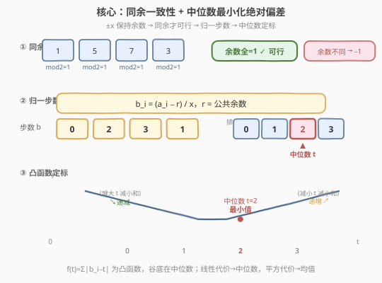
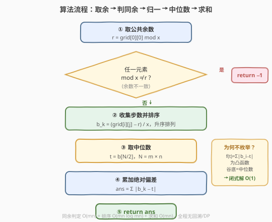
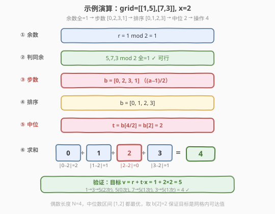

# 使网格单值的最少操作次数

- **题目名称**：使网格单值的最少操作次数
- **链接**：[2033. 使网格单值的最少操作次数](https://leetcode.cn/problems/minimum-operations-to-make-a-univalue-grid/)
- **难度**：中等
- **标签**：数组、数学、排序、矩阵

## 1. 题目概述

给定一个 $m \times n$ 的二维整数网格 `grid` 和一个正整数 $x$。每次操作你可以选择网格中的**任意一个元素**，使其**加上 $x$ 或减去 $x$**。请返回使网格中**所有元素相等**（成为单值网格）所需的**最少操作次数**；若不可能，返回 $-1$。

**示例 1**：

```text
输入：grid = [[2,4],[6,8]], x = 2
输出：4
解释：所有元素对 2 取余均为 0，可行。
      排序后 [2,4,6,8]，中位数 = 4。
      操作数 = |2−4|/2 + |4−4|/2 + |6−4|/2 + |8−4|/2 = 1+0+1+2 = 4。
```

**示例 2**：

```text
输入：grid = [[1,5],[7,3]], x = 2
输出：4
解释：所有元素对 2 取余均为 1，可行（都可到达奇数）。
      排序后 [1,3,5,7]，中位数 = 4（任取中间两数间任意值，
      但目标必须是可达值 → 取中位数本身 3 或 5）。
      取中位数 3：|1−3|/2 + |3−3|/2 + |5−3|/2 + |7−3|/2 = 1+0+1+2 = 4。
```

**示例 3**：

```text
输入：grid = [[1,2],[3,4]], x = 2
输出：-1
解释：1 mod 2 = 1，2 mod 2 = 0，余数不同 → 无法通过 ±2 到达同一值。
```

**约束条件**：

- $m == \text{grid.length}$
- $n == \text{grid}[i].\text{length}$
- $1 \le m, n \le 10^5$
- $1 \le m \times n \le 10^5$
- $1 \le \text{grid}[i][j] \le 10^9$
- $1 \le x \le 10^9$

> 💡 **审题关键**：① 每次操作是 $\pm x$，意味着一个元素 $a$ 只能变成 $a + kx$（$k \in \mathbb{Z}$），即**所有可达值与 $a$ 同余**（模 $x$）；② 要让全部元素相等，所有元素必须**模 $x$ 同余**，否则无解；③ 在同余前提下，把每个元素除以 $x$（减去公共余数再除），问题归约为经典的「**使所有数相等的最少移动**」，最优目标是**中位数**。

---

## 2. 解题思路

### 2.1 暴力思路：枚举目标值

最直觉的做法：枚举所有可能的「目标值」$v$，对每个 $v$ 检查每个元素能否到达（即 $a_i \equiv v \pmod{x}$），能则累计 $\frac{|a_i - v|}{x}$，取所有合法 $v$ 中的最小操作数。

- **正确性**：穷举所有可达目标值，必然找到最优。
- **效率**：元素值可达 $10^9$，候选 $v$ 太多；即便只枚举「现有元素的可达值」也有 $m \times n$ 个候选，每个验证 $O(mn)$，总计 $O((mn)^2)$，$mn \le 10^5$ 时约 $10^{10}$，不可行。

> ⚠️ 暴力的根源在于「把目标当成待搜索量」。但本题的最优目标有**确定的结构**——它就是中位数。识别出这一点，就能跳过枚举直接定位。

### 2.2 核心观察：同余筛选 + 中位数定标



关键洞察分三步：

**第一步：同余是可行性的充要条件。** 元素 $a$ 经若干次 $\pm x$ 后变为 $a + kx$，始终满足 $\equiv a \pmod{x}$。要让所有元素到达同一值 $v$，必须所有 $a_i \equiv v \pmod{x}$，即所有 $a_i$ **模 $x$ 同余**。

$$\boxed{\exists\,\text{公共目标} \iff \forall i,j:\ a_i \bmod x = a_j \bmod x}$$

任取第一个元素的余数 $r = \text{grid}[0][0] \bmod x$，扫描全网格，发现任一元素余数 $\ne r$ 即返回 $-1$。

**第二步：归约为「最小化绝对偏差和」。** 设公共余数为 $r$，令 $b_i = \frac{a_i - r}{x}$（整数，表示元素到「基准 $r$」的步数）。目标值 $v = r + t \cdot x$，对应步数 $t$。总操作数为：

$$\text{ops}(t) = \sum_{i} |b_i - t|$$

问题变成：**选一个整数 $t$，使 $\sum |b_i - t|$ 最小**——这是经典的「最小化绝对偏差和」问题。

**第三步：中位数最小化绝对偏差和。** 对 $b$ 排序后，**中位数**使 $\sum |b_i - t|$ 取最小。直观理解：绝对偏差函数 $\sum |b_i - t|$ 是关于 $t$ 的**分段线性凸函数**，谷底（导数变号处）恰在中位数位置——左侧元素数 $<$ 右侧时导数为负（增大 $t$ 减小总和），右侧元素数 $<$ 左侧时导数为正（减小 $t$ 减小总和），两侧元素数相等时中位数区间内任意值都最优。

> 💡 **为什么中位数而不是均值？** 均值最小化的是**平方偏差和** $\sum(b_i - t)^2$（L2 范数）；中位数最小化的是**绝对偏差和** $\sum|b_i - t|$（L1 范数）。本题每次操作移动一步、代价是线性的 $|b_i - t|$，故对应 L1，选**中位数**。这是「**代价函数决定最优目标**」的典型体现：线性代价→中位数，平方代价→均值。

> ⚠️ **中位数取哪个？** $b$ 长度 $N = mn$。若 $N$ 为奇数，中位数唯一取 $b[N/2]$；若 $N$ 为偶数，$b[N/2 - 1]$ 与 $b[N/2]$ 之间任意整数都最优（凸函数平台段）。但本题要求目标值是某元素的**可达值**（即 $t$ 必须是某个 $b_i$），所以直接取 $b[N/2]$（下取整中位数）即可——它本身是数组中的元素，天然可达，且落在最优平台段内。

### 2.3 算法流程图



1. **取公共余数**：$r = \text{grid}[0][0] \bmod x$。
2. **扫描判同余**：遍历所有元素，若任一 $\text{grid}[i][j] \bmod x \ne r$，返回 $-1$；同时收集 $b_k = (\text{grid}[i][j] - r) / x$。
3. **排序取中位数**：对 $b$ 升序排序，$t = b[N/2]$（$N = mn$，下取整中位数）。
4. **求操作数**：$\text{ans} = \sum_{k} |b_k - t|$。
5. **返回** `ans`。

> 💡 **为什么不用枚举？** 因为「最小化绝对偏差和」的最优解有**闭式答案**——中位数。识别问题的数学结构（凸优化 + L1 代价），就能从「搜索最优」降维为「直接计算最优」。这是「**数学性质优先于枚举**」的范式：当目标函数有凸性、代价对称时，最优解往往有解析形式。

### 2.4 示例演算

以示例 2 `grid = [[1,5],[7,3]]`, `x = 2` 演算全过程：



| 步骤 | 计算 | 结果 |
|------|------|------|
| ① 取公共余数 | $r = 1 \bmod 2 = 1$ | $r = 1$ |
| ② 扫描判同余 | $5\bmod 2=1$，$7\bmod 2=1$，$3\bmod 2=1$ ✅ | 全同余 |
| ③ 归一步数 | $b = \frac{a-r}{x}$：$(1-1)/2=0$，$(5-1)/2=2$，$(7-1)/2=3$，$(3-1)/2=1$ | $b = [0,2,3,1]$ |
| ④ 排序 | 升序排列 | $b = [0,1,2,3]$ |
| ⑤ 取中位数 | $N=4$，$t = b[4/2] = b[2] = 2$ | $t = 2$ |
| ⑥ 求操作数 | $\|0-2\| + \|1-2\| + \|2-2\| + \|3-2\| = 2+1+0+1 = 4$ | $\text{ans} = 4$ |

验证：目标值 $v = r + t \cdot x = 1 + 2 \times 2 = 5$。各元素到 $5$ 的操作：$1 \xrightarrow{+2} 3 \xrightarrow{+2} 5$（2 次），$5$（0 次），$7 \xrightarrow{-2} 5$（1 次），$3 \xrightarrow{+2} 5$（1 次），共 $4$ 次 ✅。

> 💡 **观察要点**：① 归一后步数 $b$ 与原值是一一对应的，排序不破坏可达性——中位数 $t$ 对应的目标 $v = r + tx$ 一定是某元素的可达值；② 偶数长度时 $b[1]=1$ 与 $b[2]=2$ 之间任取都最优（平台段），但取 $b[2]=2$ 保证目标是网格中已有的值，省去额外校验；③ 同余判定 $O(mn)$ + 排序 $O(mn \log mn)$ + 求和 $O(mn)$，全程无回溯。

---

## 3. 参考代码

### C++

```cpp
class Solution {
public:
    int minOperations(vector<vector<int>>& grid, int x) {
        int m = grid.size(), n = grid[0].size();
        int r = grid[0][0] % x;
        vector<int> b;
        b.reserve(m * n);
        for (int i = 0; i < m; ++i) {
            for (int j = 0; j < n; ++j) {
                if (grid[i][j] % x != r) return -1;
                b.push_back((grid[i][j] - r) / x);
            }
        }
        sort(b.begin(), b.end());
        int N = b.size();
        int t = b[N / 2];
        long long ans = 0;
        for (int v : b) ans += abs(v - t);
        return ans;
    }
};
```

### Python

```python
class Solution:
    def minOperations(self, grid: List[List[int]], x: int) -> int:
        r = grid[0][0] % x
        b = []
        for row in grid:
            for v in row:
                if v % x != r:
                    return -1
                b.append((v - r) // x)
        b.sort()
        t = b[len(b) // 2]
        return sum(abs(v - t) for v in b)
```

> 💡 **写法对照**：两版逻辑一致——取公共余数 $r$ → 扫描判同余并收集步数 $b$ → 排序取下取整中位数 $b[N/2]$ → 累加绝对偏差。C++ 用 `long long` 防 $|b_k - t|$ 求和溢出（$mn \le 10^5$，单步可达 $10^9/x$，和最坏约 $10^{14}$）；Python 大整数天然安全。两者都是 $O(mn \log mn)$ 时间。

> ⚠️ **溢出提示**：$b_k = (a - r)/x \le 10^9$，$N \le 10^5$，和 $\sum|b_k - t| \le 10^{14}$，超过 `int` 上界（约 $2.1 \times 10^9$）。C++ 必须用 `long long` 累加，否则样例可能过但大数 WA。Python 无此顾虑。

---

## 4. 复杂度分析

| 维度 | 复杂度 | 说明 |
|------|--------|------|
| 时间复杂度 | $O(mn \log(mn))$ | 扫描判同余 $O(mn)$ + 排序 $O(mn \log mn)$ + 求和 $O(mn)$；瓶颈在排序 |
| 空间复杂度 | $O(mn)$ | 存储归一步数数组 $b$（不计输入） |

> 💡 本题的优雅在于把「网格单值」问题拆成两层：**可行性层**用同余判定 $O(mn)$，**最优性层**归约为中位数 $O(mn \log mn)$。两层都无需搜索——可行性靠模运算的封闭性，最优性靠凸函数的解析解。关键洞察是「$\pm x$ 操作保持余数不变」与「绝对偏差和的最小化点在中位数」。

---

## 5. 扩展：中位数最优性的凸性证明

为什么中位数最小化 $\sum |b_i - t|$？给出基于凸函数的简洁证明。

**函数性质**：$f(t) = \sum_i |b_i - t|$ 是关于 $t$ 的分段线性函数。在每个 $b_i$ 处有一个「拐点」，两拐点之间是斜率为常数的线段。

**导数分析**：对 $t$ 不等于任何 $b_i$ 时，$f$ 可导，导数为：

$$f'(t) = \sum_i \text{sgn}(t - b_i) = (\text{小于 } t \text{ 的元素个数}) - (\text{大于 } t \text{ 的元素个数})$$

- 当 $t$ 小于中位数时，大于 $t$ 的元素多于小于的，$f'(t) < 0$，$f$ 单调递减（增大 $t$ 减小总和）；
- 当 $t$ 大于中位数时，小于 $t$ 的元素多于大于的，$f'(t) > 0$，$f$ 单调递增（减小 $t$ 减小总和）；
- 在中位数处导数变号，$f$ 取最小值。

**偶数长度的平台**：$N$ 为偶数时，在 $b[N/2 - 1]$ 与 $b[N/2]$ 之间，小于 $t$ 与大于 $t$ 的元素数相等，$f'(t) = 0$，$f$ 为常数（平台段）。故此区间内任一值都最优，取 $b[N/2]$ 是合法且方便的选择。

> 💡 **推广到加权情形**：若每个元素的「单位代价」不同（权重 $w_i$），即最小化 $\sum w_i |b_i - t|$，最优解变为**加权中位数**（按 $w$ 累积到一半处的 $b_i$）。本题权重全为 $1/x$（相同），退化为普通中位数。加权中位数在「带权选址」问题中是核心工具。

---

## 6. 面试要点

**Q1：为什么同余是可行性的充要条件？**

> 必要性：$\pm x$ 操作不改变元素模 $x$ 的余数（$(a \pm x) \bmod x = a \bmod x$），故若两元素余数不同，无论操作多少次都无法相等。充分性：若所有元素余数同为 $r$，则每个 $a_i = r + b_i x$，取任意 $b_j$ 对应的目标 $v = r + b_j x$，每个 $a_i$ 经 $|b_i - b_j|$ 次 $\pm x$ 即可到达 $v$，必然可行。故同余 $\iff$ 可行。

**Q2：为什么最优目标是中位数而不是均值？**

> 因为代价函数是**绝对偏差**（L1），不是平方偏差（L2）。$\sum |b_i - t|$ 是关于 $t$ 的凸函数，谷底在导数变号处，即「小于 $t$ 的个数 = 大于 $t$ 的个数」的位置——这正是中位数。均值最小化的是 $\sum (b_i - t)^2$（求导令其为零得 $t = \overline{b}$）。代价形态决定最优目标：线性代价→中位数，平方代价→均值。

**Q3：偶数长度时中位数取 $b[N/2]$ 还是 $b[N/2-1]$？**

> 两者都最优——$b[N/2-1]$ 与 $b[N/2]$ 之间是凸函数的平台段，$\sum|b_i - t|$ 取相同最小值。但本题要求目标是网格中某元素的可达值，$b[N/2]$ 和 $b[N/2-1]$ 都是数组中的元素，都合法。习惯上取 $b[N/2]$（下取整中位数），实现简洁。若题目额外要求「目标值最小」，则取 $b[N/2-1]$。

**Q4：为什么要把元素归一为步数 $b_i = (a_i - r)/x$？**

> 归一有两个好处：① 把「$\pm x$ 的操作次数」直接变成 $|b_i - t|$，省去每次除以 $x$；② 把值域从 $[1, 10^9]$ 压缩到 $[0, 10^9/x]$，虽然不影响复杂度，但让中位数与操作数的语义更清晰。不归一直接对原数组取中位数 $v$ 再算 $\sum |a_i - v|/x$ 也可，结果相同——因为 $v = r + tx$，$|a_i - v|/x = |b_i - t|$。

**Q5：如果操作允许 $\pm 1$ 到 $\pm x$ 的任意步长，问题如何变化？**

> 若每次操作可加任意 $[-x, x]$ 内的整数，则每个元素一步即可到达任意同余值，问题退化为「使所有元素模 $x$ 同余的最少操作」——只需检查同余性，操作数 $\le N$（每个元素至多改一次）。此时不再需要中位数，因为单步代价不再线性于距离。这说明「代价函数的形式」决定算法选择：线性代价→中位数，常数代价→可行性判定。

> 💡 **一句话总结**：同余判定可行性 $O(mn)$ → 归一步数 $b$ → 排序取中位数 $b[N/2]$ → $\sum|b_i - b[N/2]|$ 即答案，$O(mn \log mn)$。

---

## 7. 同类练习题

- [462. 最小操作使数组相等](https://leetcode.cn/problems/minimum-moves-to-equal-array-elements-ii/)（[题解](../0401-0500/462_最小操作使数组相等.md)）：中位数最小化绝对偏差和的母题，无 $\pm x$ 限制，本题是其「带步长约束 + 网格」泛化
- [453. 最小操作次数使数组元素相等](https://leetcode.cn/problems/minimum-moves-to-equal-array-elements/)：n−1 个元素 +1 等价于 1 个元素 −1，归约后仍是中位数问题，对照「操作语义转换」技巧
- [1685. 有序数组中绝对差之和](https://leetcode.cn/problems/sum-of-absolute-differences-in-a-sorted-array/)：对每个位置求「到所有元素的绝对差之和」，本质是中位数最优性的逐点版，用前缀和 $O(n)$ 求解
- [2968. 执行操作可获得的最大奖励](https://leetcode.cn/problems/apply-operations-to-maximize-frequency-score/)：选定目标使频率最大化，二分答案 + 滑动窗口判定，同为「中位数 + 区间代价」思路的延伸应用
- [2448. 使数组相等的最小代价](https://leetcode.cn/problems/minimum-cost-to-make-array-equal/)：带权版本 $\sum w_i |b_i - t|$，最优解为加权中位数，承接第 5 节扩展
