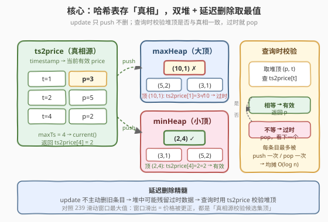
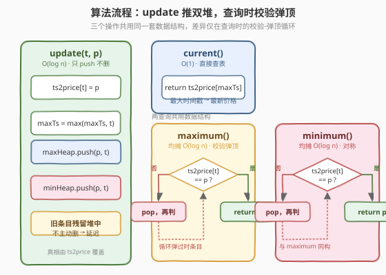
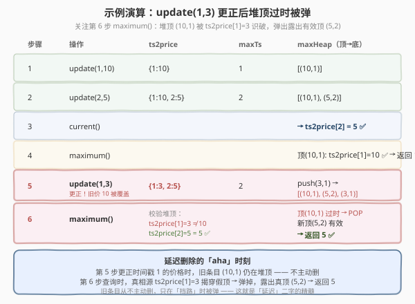

# 股票价格波动

- **题目名称**：股票价格波动
- **链接**：[2034. 股票价格波动](https://leetcode.cn/problems/stock-price-fluctuation/)
- **难度**：中等
- **标签**：设计、堆、哈希表、延迟删除

## 1. 题目概述

给你一支股票价格的**数据流**，每条记录包含一个**时间戳** `timestamp` 和该时刻对应的**价格** `price`。记录不按时间顺序到达，且可能出现**重复时间戳**——此时**后到的记录更正前一条**（前一条视为错误记录）。

要求设计 `StockPrice` 类支持四种操作：

- `void update(timestamp, price)`：在 `timestamp` 时刻更新价格为 `price`；若该时间戳已有记录，则**更正**之前的错误价格。
- `int current()`：返回**最新价格**（时间戳最大的那条记录的价格）。
- `int maximum()`：返回当前所有记录中的**最高价格**。
- `int minimum()`：返回当前所有记录中的**最低价格**。

**示例 1**：

```text
输入：
["StockPrice","update","update","current","maximum","update","maximum","update","minimum"]
[[],[1,10],[2,5],[],[],[1,3],[],[4,2],[]]
输出：
[null,null,null,5,10,null,5,null,2]

解释：
update(1,10)   // 时间戳 [1]，价格 [10]
update(2,5)    // 时间戳 [1,2]，价格 [10,5]
current()      // 返回 5  （最新时间戳 2 → 价格 5）
maximum()      // 返回 10 （最高价格对应时间戳 1）
update(1,3)    // 更正时间戳 1 的价格为 3 → 时间戳 [1,2]，价格 [3,5]
maximum()      // 返回 5  （更正后最高价格为 5）
update(4,2)    // 时间戳 [1,2,4]，价格 [3,5,2]
minimum()      // 返回 2  （最低价格对应时间戳 4）
```

**约束条件**：

- $1 \le \text{timestamp}, \text{price} \le 10^9$
- `update` / `current` / `maximum` / `minimum` 的**总调用次数**不超过 $10^5$
- `current` / `maximum` / `minimum` 被调用时，`update` 至少已被调用过一次

> 💡 **审题关键**：① **更正**意味着同一时间戳只保留**最新一次** `update` 的价格，旧价格需从最值统计中**剔除**；② 时间戳乱序到达，"最新"=**最大时间戳**而非最后调用顺序；③ 价格范围高达 $10^9$，不能开值域数组，必须用基于比较的结构（堆 / 平衡树）。

---

## 2. 解题思路

### 2.1 暴力思路：每次查询遍历全部记录

用一个哈希表 `ts2price` 存「时间戳 → 当前有效价格」。`update` 直接覆盖；`current` 扫一遍找最大时间戳；`maximum` / `minimum` 扫一遍所有值取最值。

- **正确性**：显然正确。
- **效率**：`current` / `maximum` / `minimum` 每次 $O(n)$，总调用 $10^5$ 时整体可达 $O(n^2) \approx 10^{10}$，**超时**。
- `current` 可通过单独维护 `maxTs` 变量降到 $O(1)$，但 `maximum` / `minimum` 仍卡在 $O(n)$。

> ⚠️ 瓶颈在于「更正」操作：旧价格被替换后，**必须从最值候选集中剔除**。堆只支持 $O(\log n)$ 取顶/插入，不支持高效任意删除；平衡树则能 $O(\log n)$ 删除但 C++ 标准库的 `priority_queue` / Python 的 `heapq` 都不是平衡树。突破口是**延迟删除**。

### 2.2 核心观察：哈希表存"真相"，双堆 + 延迟删除



**三件套分工**：

| 结构 | 作用 | 维护方式 |
|------|------|----------|
| `ts2price`（哈希表） | **唯一真相源**：`timestamp → 当前有效价格` | `update` 时直接覆盖 |
| `maxTs`（标量） | 记录目前为止见过的最大时间戳 | `update` 时取 `max` |
| `maxHeap` / `minHeap` | 候选最值池，堆顶即候选最大/最小 | `update` 时**只 push 不删**；查询时**校验堆顶** |

**延迟删除（Lazy Deletion）思想**：

`update` 修正旧价格时，**不主动去堆里删旧条目**（堆不支持高效任意删除），而是直接 push 新条目 `(price, timestamp)`。旧条目仍然残留在堆中，但它们已是"**过时数据**"。查询 `maximum` / `minimum` 时，取出堆顶 `(p, t)`，用 `ts2price[t]` 校验：

- 若 `ts2price[t] == p`：堆顶是**有效**的，直接返回 $p$；
- 若 `ts2price[t] != p`：堆顶是**过时**条目（$t$ 的价格已被更正为别的值），**弹掉**继续看下一个堆顶。

> 💡 **为什么不会漏、不会错？** 同一时间戳的旧价格条目迟早被新 `update` 的条目"盖过"——校验时 `ts2price[t]` 永远指向最新值，旧条目的 $p$ 必然对不上，必然被弹。每个被 push 进堆的条目**最多被 pop 一次**，所以均摊开销 $O(\log n)$。这正是 [239. 滑动窗口最大值](https://leetcode.cn/problems/sliding-window-maximum/) 单调队列"过期就弹出"思想的同类迁移：把"窗口滑出"换成"价格被更正"，本质都是**用真相源校验候选集顶部的时效性**。

### 2.3 算法流程图



**`update(timestamp, price)`**：

1. `ts2price[timestamp] = price`（覆盖旧值，确立新真相）
2. `maxTs = max(maxTs, timestamp)`
3. `maxHeap.push((-price, timestamp))`（Python 用负数模拟大顶堆）
4. `minHeap.push((price, timestamp))`

**`current()`**：返回 `ts2price[maxTs]`，$O(1)$。

**`maximum()`**：

```
while 堆顶 (-p, t) 满足 ts2price[t] != p:   // 过时条目
    maxHeap.pop()
return -maxHeap.top().first
```

**`minimum()`**：对称地校验 `minHeap` 堆顶，返回 `minHeap.top().first`。

> ⚠️ **校验条件不是 `!= price` 而是 `!= ts2price[t]`**：必须拿堆顶条目自己的时间戳 $t$ 去查 `ts2price[t]`，再和堆顶条目自带的价格 $p$ 比。不能拿"当前要查的价格"去比——查询前并不知道答案。

### 2.4 示例演算



按题目示例逐步演算，关注 `update(1,3)` 这步更正操作：

| 步骤 | 操作 | `ts2price` | `maxTs` | `maxHeap`（内容，省略负号） | `minHeap` |
|------|------|-----------|---------|-------------------------|-----------|
| 1 | `update(1,10)` | `{1:10}` | 1 | `[(10,1)]` | `[(10,1)]` |
| 2 | `update(2,5)`  | `{1:10, 2:5}` | 2 | `[(10,1), (5,2)]` | `[(5,2), (10,1)]` |
| 3 | `current()`    | — | — | 返回 `ts2price[2] = 5` ✅ | — |
| 4 | `maximum()`    | — | — | 堆顶 `(10,1)`，`ts2price[1]==10` ✅ → 返回 10 | — |
| 5 | `update(1,3)`  | `{1:3, 2:5}` | 2 | push `(3,1)` → `[(10,1), (5,2), (3,1)]` | push `(3,1)` |
| 6 | `maximum()`    | — | — | 堆顶 `(10,1)`，但 `ts2price[1]==3 ≠ 10` ❌ → **pop**；新堆顶 `(5,2)`，`ts2price[2]==5` ✅ → 返回 5 | — |

> 💡 **关键瞬间在第 6 步**：堆顶 `(10,1)` 是第 1 步残留的**过时条目**（时间戳 1 的价格已被第 5 步更正为 3）。延迟删除机制识别出 `ts2price[1]=3 ≠ 10`，将其弹出，露出有效堆顶 `(5,2)`，正确返回 5。**旧条目从不主动删，只在挡路时被弹**——这就是"延迟"二字的精髓。

后续 `update(4,2)` 后 `minimum()` 查询：`minHeap` 堆顶为 `(2,4)`，`ts2price[4]==2` ✅，直接返回 2。

---

## 3. 参考代码

### C++

```cpp
class StockPrice {
    unordered_map<int, int> ts2price;          // 时间戳 -> 当前有效价格（真相源）
    int maxTs = 0;                              // 目前见过的最大时间戳
    priority_queue<pair<int,int>> maxHeap;      // 大顶堆 (price, timestamp)
    priority_queue<pair<int,int>, vector<pair<int,int>>, greater<>> minHeap; // 小顶堆
public:
    void update(int timestamp, int price) {
        ts2price[timestamp] = price;            // 覆盖，确立新真相
        maxTs = max(maxTs, timestamp);
        maxHeap.emplace(price, timestamp);      // 只 push 不删
        minHeap.emplace(price, timestamp);
    }

    int current() {
        return ts2price[maxTs];                 // O(1)
    }

    int maximum() {
        while (!maxHeap.empty()) {
            auto [p, t] = maxHeap.top();
            if (ts2price[t] == p) return p;     // 堆顶有效
            maxHeap.pop();                      // 过时条目，弹出丢弃
        }
        return -1;                              // 不会到达
    }

    int minimum() {
        while (!minHeap.empty()) {
            auto [p, t] = minHeap.top();
            if (ts2price[t] == p) return p;
            minHeap.pop();
        }
        return -1;
    }
};
```

### Python

```python
class StockPrice:
    def __init__(self):
        self.ts2price = {}                       # 时间戳 -> 当前有效价格（真相源）
        self.max_ts = 0                          # 目前见过的最大时间戳
        self.max_heap = []                       # 大顶堆：存 (-price, timestamp)
        self.min_heap = []                       # 小顶堆：存 (price, timestamp)

    def update(self, timestamp: int, price: int) -> None:
        self.ts2price[timestamp] = price         # 覆盖，确立新真相
        self.max_ts = max(self.max_ts, timestamp)
        heapq.heappush(self.max_heap, (-price, timestamp))   # 只 push 不删
        heapq.heappush(self.min_heap, (price, timestamp))

    def current(self) -> int:
        return self.ts2price[self.max_ts]        # O(1)

    def maximum(self) -> int:
        while self.max_heap:
            neg_p, t = self.max_heap[0]
            p = -neg_p
            if self.ts2price[t] == p:            # 堆顶有效
                return p
            heapq.heappop(self.max_heap)         # 过时条目，弹出丢弃
        return -1                                # 不会到达

    def minimum(self) -> int:
        while self.min_heap:
            p, t = self.min_heap[0]
            if self.ts2price[t] == p:
                return p
            heapq.heappop(self.min_heap)
        return -1
```

> ⚠️ **Python 大顶堆写法**：标准库 `heapq` 只提供小顶堆，用 `-price` 取反模拟大顶堆。取出时再取反还原。C++ 的 `priority_queue<pair<int,int>>` 默认按 `pair.first` 大顶，`greater<>` 模板参数切小顶，无需取反。

---

## 4. 复杂度分析

| 维度 | 复杂度 | 说明 |
|------|--------|------|
| `update` 时间 | $O(\log n)$ | 两次堆 push，$n$ 为堆中条目数 |
| `current` 时间 | $O(1)$ | 一次哈希查表 |
| `maximum` / `minimum` 时间 | 均摊 $O(\log n)$ | 每个条目**至多被 push 一次、pop 一次**；单次查询可能连续 pop 多个过时条目，但总 pop 次数 $\le$ 总 push 次数，均摊到每次操作 $O(\log n)$ |
| 空间 | $O(n)$ | `ts2price` 存不同时间戳数；两堆存所有 `update` 调用产生的条目（含未清理的过时条目） |

> 💡 **均摊分析**：设总调用次数为 $N$。`update` 共 push $O(N)$ 个条目入每个堆，`maximum` / `minimum` 累计 pop $\le$ push 数，故所有堆操作总量 $O(N)$，均摊每次 $O(\log N)$。即便每次查询都触发连续 pop，整体仍在限额内。

---

## 5. 扩展：平衡树 / 有序哈希表实现

若语言标准库提供平衡树（C++ 的 `std::map`、Java 的 `TreeMap`），可用「`ts2price` + 价格频次表 `priceCnt: map<price, count>`」实现，**无需延迟删除**：

- `update(t, p)`：若 `t` 已有旧价格 `oldP`，把 `priceCnt[oldP]--`（减到 0 则 erase）；然后 `priceCnt[p]++`、`ts2price[t]=p`、更新 `maxTs`。
- `maximum()`：`priceCnt.rbegin()->first`（最大键）。
- `minimum()`：`priceCnt.begin()->first`（最小键）。

每次操作严格 $O(\log n)$，无均摊、无残留条目，空间也更省（`priceCnt` 只存当前有效价格的不同值）。Python 无标准平衡树，可用 `sortedcontainers.SortedDict`（第三方库）或在力扣环境用 `SortedList`（已内置）。两种实现思路对照：

| 维度 | 双堆 + 延迟删除 | 平衡树 / 有序频次表 |
|------|----------------|-------------------|
| 单次最坏复杂度 | 查询可达 $O(k \log n)$（$k$=积压过时条目数） | 严格 $O(\log n)$ |
| 均摊复杂度 | $O(\log n)$ | $O(\log n)$ |
| 空间 | $O(\text{update 次数})$（含过时条目） | $O(\text{不同时间戳数})$ |
| 实现难度 | 中（需理解延迟删除） | 低（直接调库） |
| 适用场景 | 语言无平衡树 / 面试强调手撕堆 | 有 `map` / `TreeMap` 可用 |

> 💡 面试中两种解法都应能说出。先讲双堆 + 延迟删除（展示对堆本质的理解），再提平衡树方案作为优化对比，体现"先正确后优化"的工程思维。

---

## 6. 面试要点

1. **为什么不能直接用堆 + 删除？**

   - 标准库的堆（`priority_queue` / `heapq`）只支持 $O(\log n)$ 取顶和插入，**不支持高效任意位置删除**。要删堆中指定条目需先线性查找再重建，$O(n)$。延迟删除绕开这一限制：**不主动删，查询时校验堆顶时效性，过时就 pop**。

2. **延迟删除的校验条件为什么是 `ts2price[t] == p`？**

   - 堆顶条目自带 `(price, timestamp)`，但该 `timestamp` 的**当前有效价格**可能已被后续 `update` 更正。用 `ts2price[timestamp]` 查"真相"再和条目自带 `price` 比：相等说明条目仍有效；不等说明是过时残留，必须弹掉。校验必须用**条目自己的时间戳**，不能用别的时间戳。

3. **均摊 $O(\log n)$ 怎么保证不超时？**

   - 每个条目**最多被 push 一次、pop 一次**。总调用 $N \le 10^5$，两堆累计 push $\le 2N$、累计 pop $\le 2N$，总堆操作 $\le 4N = O(N)$，均摊每次 $O(\log N)$。即便某次查询连续 pop 很多积压条目，这些 pop 也是"偿还"之前 push 的债务，整体不超额。

4. **`current()` 为什么是 $O(1)$？**

   - 单独维护 `maxTs` 标量，`update` 时 `maxTs = max(maxTs, timestamp)`。"最新价格"=最大时间戳对应的当前有效价格，即 `ts2price[maxTs]`，一次哈希查表 $O(1)$。无需遍历或堆操作。注意时间戳**乱序到达**，所以必须用 `max` 而非"最后调用的时间戳"。

5. **两堆会不会存很多过时条目导致内存爆？**

   - 不会爆。总条目数 $\le$ `update` 调用次数 $\le 10^5$，每条目几十字节，总内存量在 MB 级，完全可接受。若极端在意内存可用平衡树方案（`priceCnt` 只存当前有效价格的不同值），空间降到 $O(\text{不同时间戳数})$。本题数据规模下双堆方案已足够。

---

## 7. 同类练习题

- [239. 滑动窗口最大值](https://leetcode.cn/problems/sliding-window-maximum/)：单调队列 + 过期弹出，延迟删除思想的母题（窗口滑出对应本题价格被更正，都是"用真相源校验候选集顶部"）
- [460. LFU 缓存](https://leetcode.cn/problems/lfu-cache/)：频率桶 + 哈希的双向链表设计，同属"高频 update + 高频查询最值"的设计题家族
- [146. LRU 缓存](https://leetcode.cn/problems/lru-cache/)：哈希 + 双向链表的经典设计题，对比本题"哈希 + 双堆"的设计选型
- [295. 数据流的中位数](https://leetcode.cn/problems/find-median-from-data-stream/)：双堆协作（大顶堆存小一半 + 小顶堆存大一半），同属堆设计题招牌
- [1801. 积压订单中的订单总数](https://leetcode.cn/problems/number-of-orders-in-the-backlog/)：双堆 + 延迟/条件弹出，本题的进阶变体（堆顶按价格匹配成交后弹出）
