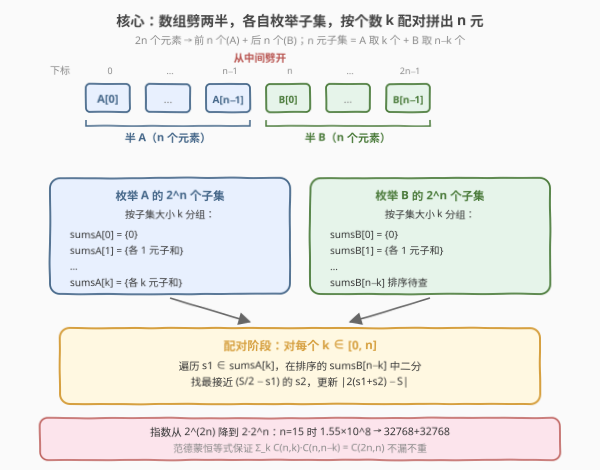
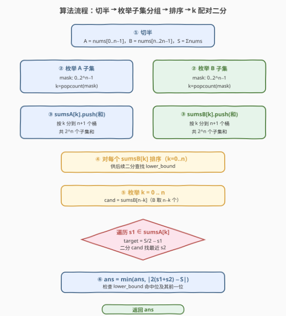

# 将数组分成两个数组并最小化数组和的差值

- **题目名称**：将数组分成两个数组并最小化数组和的差值
- **链接**：[2035. 将数组分成两个数组并最小化数组和的差值](https://leetcode.cn/problems/partition-array-into-two-arrays-to-minimize-sum-difference/)
- **难度**：困难
- **标签**：数组、分治、Meet in the Middle、二分查找

## 1. 题目概述

给定一个长度为 $2n$ 的整数数组 `nums`，请你将它分成两个长度均为 $n$ 的子数组 `part1` 和 `part2`（每个元素恰好归入其中一个），使得 $|\sum \text{part1} - \sum \text{part2}|$ **最小**。返回这个最小绝对差。

**示例 1**：

```text
输入：nums = [3,9,7,3]
输出：2
解释：最优分组为 part1 = [3,9]，part2 = [7,3]。
  12 − 10 = 2。（任何分组的差都不小于 2）
```

**示例 2**：

```text
输入：nums = [-36,36]
输出：72
解释：只能 part1 = [-36]，part2 = [36]，差为 72。
```

**示例 3**：

```text
输入：nums = [2,-1,0,4,-2,-9]
输出：0
解释：part1 = [2,4,-9]，part2 = [-1,0,-2]，两组和都是 −3，差为 0。
```

**约束条件**：

- $1 \le n \le 15$
- $\text{nums.length} = 2n$
- $-10^7 \le \text{nums}[i] \le 10^7$

> 💡 关键约束是 $n \le 15$，于是 $2n \le 30$。这暗示了 $2^n$ 量级的搜索是可行的——直接枚举 $\binom{2n}{n}$ 会到 $\binom{30}{15} \approx 1.55 \times 10^8$ 太大，而把数组从中间劈开各做 $2^n$ 恰好落在 $32768$ 的甜区，这就是 **Meet in the Middle**。

---

## 2. 解题思路

### 2.1 暴力思路：枚举所有 n 元子集

记总和 $S = \sum \text{nums}$。任取一个长度为 $n$ 的子集作为 `part1`，其和记为 $s_1$，则 `part2` 的和为 $S - s_1$，差为：

$$|s_1 - (S - s_1)| = |2 s_1 - S|$$

要使差最小，等价于让 $s_1$ 尽可能接近 $\dfrac{S}{2}$。暴力做法是枚举所有 $\binom{2n}{n}$ 个 $n$ 元子集，对每个算和并更新答案。$n = 15$ 时 $\binom{30}{15} \approx 1.55 \times 10^8$，每个子集求和还要 $O(n)$，总量超 $2 \times 10^9$，**超时**。

突破口在于：**子集不必整体枚举**——把数组从中间劈成两半，两侧各自枚举子集，再在"中间"按元素个数配对拼出 $n$ 元子集。

### 2.2 核心观察：Meet in the Middle



把 `nums` 按**前 n 个 / 后 n 个**切成两半 $A$、$B$（各 $n$ 个元素）。任一 $n$ 元子集必然从 $A$ 取 $k$ 个、从 $B$ 取 $n - k$ 个（$0 \le k \le n$）。

对每一半独立枚举**所有** $2^n$ 个子集，并**按子集大小分组**：

$$\text{sums}_A[k] = \{A \text{ 中大小为 } k \text{ 的子集的和}\},\quad k = 0, 1, \dots, n$$

$$\text{sums}_B[k] = \{B \text{ 中大小为 } k \text{ 的子集的和}\}$$

于是"从 $A$ 取 $k$ 个、从 $B$ 取 $n-k$ 个拼成 $n$ 元子集"的总和就是 $s_1 \in \text{sums}_A[k]$ 与 $s_2 \in \text{sums}_B[n-k]$ 的任意配对之和 $s_1 + s_2$。我们要让 $s_1 + s_2$ 尽可能接近 $\dfrac{S}{2}$。

> 💡 **为什么这样能省？** 把 $\binom{2n}{n}$ 拆成 $\sum_{k=0}^{n}\binom{n}{k}\binom{n}{n-k} = \binom{2n}{n}$（范德蒙恒等式），但每半只需枚举 $2^n$ 个子集（而非 $\binom{n}{k}$ 逐个算），且配对阶段用**排序 + 二分**把"找最接近"降到对数级。两半各 $2^n = 32768$，配对阶段 $\sum_k \binom{n}{k} \log \binom{n}{k} \le 2^n \cdot n \approx 5 \times 10^5$，总量从 $10^8$ 降到 $10^5$。

### 2.3 配对阶段：排序 + 二分找最近

对每个 $k \in [0, n]$：

1. 把 $\text{sums}_B[n-k]$ **排序**。
2. 遍历每个 $s_1 \in \text{sums}_A[k]$，目标值 $\text{target} = \dfrac{S}{2} - s_1$。
3. 在排序后的 $\text{sums}_B[n-k]$ 中**二分**找最接近 $\text{target}$ 的元素 $s_2$（即 `lower_bound` 后比较它和前一个元素）。
4. 用 $s_1 + s_2$ 更新答案 $|2(s_1 + s_2) - S|$。

> ⚠️ **为何用浮点 $\frac{S}{2}$ 不影响整数答案？** 目标 $\frac{S}{2}$ 可能是半整数（$S$ 为奇数时），但二分比较的是"谁离 target 更近"，最终答案 $|2(s_1+s_2) - S|$ 一定是整数。实现里用 `target = S/2.0` 做浮点比较即可，或等价地用 $s_1 + s_2$ 与 $\frac{S}{2}$ 比较转化为比较 $2(s_1+s_2)$ 与 $S$，全程整数。本解采用浮点 `target`，因为 $n \le 15$ 下数值在 $10^8$ 量级，`double` 53 位尾数完全精确。

### 2.4 算法流程图



**完整步骤**：

1. **切半**：$A = \text{nums}[0..n-1]$，$B = \text{nums}[n..2n-1]$；算 $S = \sum \text{nums}$。
2. **枚举子集**：对 $A$ 用位掩码 $0 \ldots 2^n - 1$ 枚举所有子集，按 `popcount`（子集大小 $k$）把和追加到 $\text{sums}_A[k]$；对 $B$ 同理得 $\text{sums}_B[k]$。
3. **排序**：对每个 $\text{sums}_B[k]$ 排序（$k = 0..n$），供二分查找。
4. **配对**：枚举 $k = 0..n$，遍历 $\text{sums}_A[k]$ 每个 $s_1$，在排序的 $\text{sums}_B[n-k]$ 中二分找最接近 $\frac{S}{2} - s_1$ 的 $s_2$，更新 $\text{ans} = \min(\text{ans}, |2(s_1+s_2) - S|)$。
5. 返回 `ans`。

### 2.5 示例演算

以示例 1 `nums = [3,9,7,3]`，$n = 2$ 演算：

![示例演算：A=[3,9], B=[7,3]，k 配对二分得最小差 2](../images/2035_example_walkthrough.svg)

切半 $A = [3,9]$，$B = [7,3]$，$S = 22$，目标 $\frac{S}{2} = 11$。

**第一步：枚举各半子集，按大小分组**

| $k$ | $\text{sums}_A[k]$（A 的子集和） | $\text{sums}_B[k]$（B 的子集和） |
|-----|----------------------------------|----------------------------------|
| 0   | $\{0\}$                          | $\{0\}$                          |
| 1   | $\{3, 9\}$                       | $\{7, 3\}$ → 排序 $\{3, 7\}$     |
| 2   | $\{12\}$                         | $\{10\}$                         |

**第二步：按 $k$ 配对，二分找最接近 $\frac{S}{2}$**

| $k$ | $s_1 \in \text{sums}_A[k]$ | target $= 11 - s_1$ | $\text{sums}_B[n-k]$ 中最近 $s_2$ | $s_1+s_2$ | $\|2(s_1+s_2)-S\|$ |
|-----|----------------------------|---------------------|-----------------------------------|-----------|---------------------|
| 0   | 0                          | 11                  | $\text{sums}_B[2]=\{10\}$ → 10    | 10        | $\|20-22\| = 2$     |
| 1   | 3                          | 8                   | $\text{sums}_B[1]=\{3,7\}$ → 7    | 10        | 2                   |
| 1   | 9                          | 2                   | $\{3,7\}$ → 3                     | 12        | $\|24-22\| = 2$     |
| 2   | 12                         | −1                  | $\text{sums}_B[0]=\{0\}$ → 0      | 12        | 2                   |

所有配对的最小差为 **2**，对应分组 `part1 = [3,7]`（和 10）、`part2 = [9,3]`（和 12），差 $|10-12| = 2$。

---

## 3. 参考代码

### C++

```cpp
class Solution {
  public:
    int minimumDifference(vector<int>& nums) {
        int n = nums.size() / 2;
        vector<int> A(nums.begin(), nums.begin() + n);
        vector<int> B(nums.begin() + n, nums.end());

        long long S = 0;
        for (int x : nums) S += x;

        // sumsA[k] / sumsB[k]：A/B 中大小为 k 的子集的和
        vector<vector<int>> sumsA(n + 1), sumsB(n + 1);
        for (int mask = 0; mask < (1 << n); ++mask) {
            int sumA = 0, sumB = 0, k = __builtin_popcount(mask);
            for (int i = 0; i < n; ++i) {
                if (mask >> i & 1) {
                    sumA += A[i];
                    sumB += B[i];
                }
            }
            sumsA[k].push_back(sumA);
            sumsB[k].push_back(sumB);
        }

        // sumsB[k] 排序，供二分
        for (int k = 0; k <= n; ++k) sort(sumsB[k].begin(), sumsB[k].end());

        long long ans = LLONG_MAX;
        double half = S / 2.0;
        for (int k = 0; k <= n; ++k) {
            auto& cand = sumsB[n - k];            // B 取 n-k 个
            for (int s1 : sumsA[k]) {
                double target = half - s1;        // 想让 s1+s2 接近 S/2
                auto it = lower_bound(cand.begin(), cand.end(), target);
                // 检查 it 与 it-1 两个候选
                if (it != cand.end()) {
                    long long sum = (long long)s1 + *it;
                    ans = min(ans, llabs(2 * sum - S));
                }
                if (it != cand.begin()) {
                    --it;
                    long long sum = (long long)s1 + *it;
                    ans = min(ans, llabs(2 * sum - S));
                }
            }
        }
        return (int)ans;
    }
};
```

### Python

```python
import bisect

class Solution:
    def minimumDifference(self, nums: List[int]) -> int:
        n = len(nums) // 2
        A, B = nums[:n], nums[n:]
        S = sum(nums)

        sumsA = [[] for _ in range(n + 1)]
        sumsB = [[] for _ in range(n + 1)]
        for mask in range(1 << n):
            k = mask.bit_count()
            sa = sb = 0
            for i in range(n):
                if mask >> i & 1:
                    sa += A[i]
                    sb += B[i]
            sumsA[k].append(sa)
            sumsB[k].append(sb)

        for k in range(n + 1):
            sumsB[k].sort()

        ans = float('inf')
        half = S / 2.0
        for k in range(n + 1):
            cand = sumsB[n - k]                   # B 取 n-k 个
            for s1 in sumsA[k]:
                target = half - s1                # 想让 s1+s2 接近 S/2
                idx = bisect.bisect_left(cand, target)
                # 检查 idx 与 idx-1 两个候选
                if idx < len(cand):
                    tot = s1 + cand[idx]
                    ans = min(ans, abs(2 * tot - S))
                if idx > 0:
                    tot = s1 + cand[idx - 1]
                    ans = min(ans, abs(2 * tot - S))
        return ans
```

> ⚠️ **数值范围与溢出**：$2n \le 30$，每个 $|\text{nums}[i]| \le 10^7$，故 $|S| \le 3 \times 10^8$，$s_1 + s_2$ 也在 $[-3 \times 10^8, 3 \times 10^8]$。C++ 中子集和 `sumA`/`sumB` 用 `int` 足够（上限 $1.5 \times 10^8 < 2.1 \times 10^9$），但 $2 \times \text{sum} - S$ 用 `int` 也安全（上限约 $9 \times 10^8$）。本解把 `S`、`ans`、`sum` 提升为 `long long` 以稳妥；Python 整数任意精度无需操心。

> 💡 **`__builtin_popcount` / `bit_count`**：GCC 提供 `__builtin_popcount(mask)` 数二进制 1 的个数即子集大小；Python 3.10+ 有 `int.bit_count()`。这是把位掩码映射到"子集大小 $k$"的最快方式。

---

## 4. 复杂度分析

| 维度 | 复杂度 | 说明 |
|------|--------|------|
| 时间复杂度 | $O(2^n \cdot n)$ | 枚举子集 $2^n$ 个每个 $O(n)$ 求和；排序 $\sum_k \binom{n}{k}\log\binom{n}{k} \le 2^n \cdot n$；配对阶段遍历 $\sum_k \binom{n}{k} = 2^n$ 个 $s_1$ 每次二分 $O(\log \binom{n}{k}) \le O(n)$ |
| 空间复杂度 | $O(2^n)$ | $\text{sums}_A$、$\text{sums}_B$ 各存 $2^n$ 个子集和 |

> 💡 $n = 15$ 时 $2^n = 32768$，时间约 $32768 \times 15 \approx 5 \times 10^5$ 量级（外加子集枚举的 $2^n \cdot n \approx 5 \times 10^5$），远低于暴力 $\binom{30}{15} \cdot n \approx 2 \times 10^9$。空间约存 $2 \times 32768$ 个 `int`，几十 KB。

---

## 5. 扩展：为何不从同一半选 k 个做朴素双指针

理论上配对阶段也可对 $\text{sums}_A[k]$ 与 $\text{sums}_B[n-k]$ **同时排序**后用双指针夹逼（类似两数之和最近），整体仍 $O(2^n \log 2^n)$。但本题用"一边排序、另一边遍历 + 二分"更简洁：只需排序一次 $\text{sums}_B$（所有 $k$ 组），$\text{sums}_A$ 不排序直接遍历。两者复杂度同阶，二分版常数更小且实现更不易错。

另一个边界：**$n = 1$**（数组长度 2）。此时 $2^1 = 2$，$k \in \{0, 1\}$，配对结果恰为 $|nums[0] - nums[1]|$，算法自然成立，无需特判。

---

## 6. 面试要点

1. **为什么 $\binom{2n}{n}$ 暴力会超时，而劈两半各 $2^n$ 就行？**

   - $\binom{30}{15} \approx 1.55 \times 10^8$，每个子集求和 $O(n)$，总量超 $2 \times 10^9$。劈两半后每半只 $2^{15} = 32768$ 个子集，配对阶段用二分降到 $2^n \cdot n \approx 5 \times 10^5$。关键是把"整体枚举 n 元子集"拆成"两侧各枚举任意大小子集、再按个数配对"，指数从 $2^{2n}$ 降到 $2 \cdot 2^n$。

2. **为什么要按子集大小 $k$ 分组？**

   - 最终要凑出恰好 $n$ 个元素的子集。若从 $A$ 取 $k$ 个，就必须从 $B$ 取 $n-k$ 个。若不分组、直接把两半所有子集和混在一起配对，会凑出元素个数 $\ne n$ 的子集，违反"两组各 $n$ 个"的约束。按 $k$ 分组保证了配对 $(s_1, s_2)$ 对应的子集大小恰为 $k + (n-k) = n$。

3. **二分时为什么只检查 `lower_bound` 命中位置和它前一个？**

   - 排序数组中离 `target` 最近的元素必然是"第一个 $\ge \text{target}$ 的元素"或"它前一个"（最后一个 $< \text{target}$ 的元素），这两者之一就是全局最近。检查这两个即可覆盖最优，无需扫描整个数组。

4. **浮点 `target = S/2.0 - s1` 会有精度问题吗？**

   - $|S| \le 3 \times 10^8$，$\frac{S}{2}$ 最多 $1.5 \times 10^8$，`double` 有 53 位尾数（约 $9 \times 10^{15}$ 精确整数范围），表示这些值完全无误差。且二分只用于"比较谁更近"的相对判断，最终答案由整数式 $|2(s_1+s_2)-S|$ 计算，无浮点参与输出。

5. **能改成纯整数比较避免浮点吗？**

   - 可以。让 $s_1 + s_2$ 接近 $\frac{S}{2}$ 等价于让 $2(s_1+s_2)$ 接近 $S$。二分时比较 $2(s_1+s_2)$ 与 $S$ 即可，全程 `long long`。但 `S` 为奇数时 $\frac{S}{2}$ 是半整数，最近距离可能是 0.5（对应差为 1），整数比较同样能正确选出更近者，逻辑等价。浮点版可读性更好，故本解保留。

---

## 7. 同类练习题

- [454. 四数相加 II](https://leetcode.cn/problems/4sum-ii/)（[题解](../0401-0500/454_四数相加%20II.md)）：Meet in the Middle 的经典入门，四个数组劈成两组各预计算两数和，思路与本题"劈两半各枚举子集"同源
- [1755. 最接近目标值的子序列和](https://leetcode.cn/problems/closest-subsequence-sum/)（[题解](../1701-1800/1755_最接近目标值的子序列和.md)）：同样是子集和 + Meet in the Middle + 排序二分找最近，但无"个数约束"，是本题的简化版（不必按 $k$ 分组）
- [1049. 最后一块石头的重量 II](https://leetcode.cn/problems/last-stone-weight-ii/)（[题解](../1001-1100/1049_最后一块石头的重量II.md)）：同样是"最小化两组和之差"，但不要求两组等长 → 可用 0-1 背包 $O(n \cdot \sum)$；对比本题"必须各 $n$ 个"的等长约束如何逼出 Meet in the Middle
- [16. 最接近的三数之和](https://leetcode.cn/problems/3sum-closest/)（[题解](../0001-0100/16_最接近的三数之和.md)）：排序 + 双指针找最近和的母题，与本题配对阶段"二分找最近"目的一致，可对比两种"找最近"的实现
