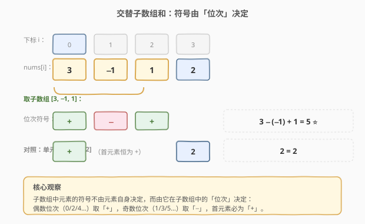
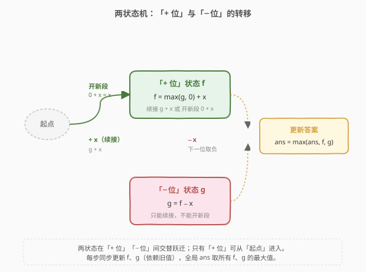

# 最大交替子数组和

- **题目名称**：最大交替子数组和
- **链接**：[2036. 最大交替子数组和](https://leetcode.cn/problems/maximum-alternating-subarray-sum/)
- **难度**：中等
- **标签**：数组、动态规划、状态机 DP、Kadane 变体

## 1. 题目概述

给定一个下标从 0 开始的整数数组 `nums`。从 `i` 到 `j`（`0 <= i <= j < nums.length`）的**子数组交替和**定义为：

$$\text{altSum}(i, j) = nums[i] - nums[i+1] + nums[i+2] - \cdots \pm nums[j]$$

即子数组从左端起，第 0、2、4… 个元素取「+」号，第 1、3、5… 个元素取「−」号。返回**所有可能子数组**的交替和中的**最大值**。

**示例 1**：

```text
输入：nums = [3,-1,1,2]
输出：5
解释：子数组 [3,-1,1] 的交替和为 3 - (-1) + 1 = 5，为最大值。
```

**示例 2**：

```text
输入：nums = [2,2,2,2,2]
输出：2
解释：
[2]            → 2
[2,2,2]        → 2 - 2 + 2 = 2
[2,2,2,2,2]    → 2 - 2 + 2 - 2 + 2 = 2
```

**示例 3**：

```text
输入：nums = [1]
输出：1
```

**约束条件**：

- `1 <= nums.length <= 10^5`
- `-10^5 <= nums[i] <= 10^5`

> ⚠️ 本题为 LeetCode Plus 会员专享题（🔒），题面来自官方描述。注意数据规模：`n` 达 `10^5`，朴素枚举子数组会超时，必须做到 $O(n)$；而最坏情况下答案量级为 $n \times \max|nums| \approx 10^{10}$，**C++ 需用 `long long`** 防 `int` 溢出。

---

## 2. 解题思路

### 2.1 暴力思路：枚举所有子数组

最直观的做法是双重循环枚举所有 `(i, j)`，对每个子数组按定义累加交替和，取最大：

```text
for i in 0..n-1:
    s = 0
    for j in i..n-1:
        s += (j - i 为偶数 ? +nums[j] : -nums[j])
        ans = max(ans, s)
```

内层可在 $O(1)$ 增量更新（正负号随长度翻转），总时间 $O(n^2)$。但 `n ≤ 10^5`，$10^{10}$ 次操作远超时限。突破口在于：**子数组的交替和具备「以位置结尾」的最优子结构**——和 [53. 最大子数组和](https://leetcode.cn/problems/maximum-subarray/) 的 Kadane 算法同源，只是每个元素的正负号取决于它在子数组中的**奇偶位次**，需要把单一状态拆成两个。

### 2.2 核心观察：状态机 DP（「+ 位」与「− 位」两状态）



关键观察：把任意子数组从左到右看，**第 0、2、4… 个元素取「+」，第 1、3、5… 个元素取「−」**。因此当我们从左到右扫描 `nums` 时，当前元素 `x = nums[i]` 进入某个子数组只有两种身份：

- **「+ 位」**：它在该子数组中处于偶数位次（0/2/4…），贡献 `+x`；
- **「− 位」**：它处于奇数位次（1/3/5…），贡献 `−x`。

于是定义两个状态（均表示「以当前元素结尾」的子数组交替和最大值）：

| 状态 | 含义 |
|------|------|
| `f` | 以当前元素为**「+ 位」结尾**的交替子数组最大和（当前元素贡献 `+x`） |
| `g` | 以当前元素为**「− 位」结尾**的交替子数组最大和（当前元素贡献 `−x`） |

**状态转移**（从左到右扫到 `x`）：

- 进入「+ 位」有两种来路：
  1. **开新段**：`x` 作为新子数组的第一个元素（首元素必为「+ 位」），此时前缀贡献为 `0`，和为 `0 + x = x`；
  2. **续接**：接在一个「− 位」结尾的子数组后面，前缀和为 `g`，再加 `+x`，和为 `g + x`。
  
  取较优：$f_{\text{new}} = \max(g_{\text{old}},\ 0) + x$。

- 进入「− 位」只有一种来路：**必须续接**一个「+ 位」结尾的子数组（因为子数组首元素只能是「+ 位」，不能凭空以「−」开头），故 $g_{\text{new}} = f_{\text{old}} - x$。这里**没有 `max(…, 0)` 的开新段选项**。

> 💡 **为什么 `f` 里要 `max(g, 0)` 而 `g` 里不要？** 因为「+ 位」可以做子数组的**起点**（空前缀贡献 0），「− 位」**不能**做起点——子数组第一个元素按定义必为「+」。所以 `f` 多了「抛弃旧前缀、从 `x` 重新开始」这一分支，`g` 只能老老实实续接。这正是该 DP 与普通 Kadane 的关键差异：普通 Kadane 只有一个状态、一个 `max(prev, 0)`，这里把「能否开新段」的差异拆到了两个状态里。

> ⚠️ **同时更新的顺序陷阱**：`g_new = f_old − x` 用的是**旧 `f`**，而 `f_new` 又依赖**旧 `g`**，二者相互依赖。Python 的 `f, g = max(g, 0) + x, f - x` 是右侧先整体求值再赋值，天然正确；C++ 必须用临时变量 `ff` 暂存旧 `f`，否则先覆盖 `f` 会污染 `g` 的计算。

答案为扫描过程中所有 `f` 与 `g` 的最大值（`g` 在合法续接时也可能是最优，例如 `nums = [3,-1,1,2]` 中 `[3,-1]` 的交替和 `3 - (-1) = 4` 就是一个 `g` 值）。

### 2.3 算法流程图（两状态机）



整个流程是单层循环：每步读入 `x`，用旧 `f`、旧 `g` 同步推出新 `f`、新 `g`，并更新全局 `ans`。两状态在「+ 位」「− 位」之间交替跃迁，且只有「+ 位」可从「起点」进入。每元素 $O(1)$，总时间 $O(n)$。

### 2.4 示例演算

![示例演算 nums=[3,-1,1,2]](../images/mass_example_walkthrough.svg)

以 `nums = [3,-1,1,2]` 为例，初始 `f = g = -∞`、`ans = -∞`：

| i | x | 旧 f, 旧 g | f_new = max(g,0)+x | g_new = f−x | ans |
|---|----|-----|-----|-----|-----|
| 0 | 3  | −∞, −∞ | max(−∞,0)+3 = **3** | −∞−3 = −∞ | 3 |
| 1 | −1 | 3, −∞  | max(−∞,0)+(−1) = **−1** | 3−(−1) = **4** | 4 |
| 2 | 1  | −1, 4  | max(4,0)+1 = **5** ⭐ | −1−1 = −2 | 5 |
| 3 | 2  | 5, −2  | max(−2,0)+2 = **2** | 5−2 = **3** | 5 |

最终 `ans = 5`，对应子数组 `[3,-1,1]`（`3 - (-1) + 1 = 5`），正是 `i=2` 步的 `f_new`。注意 `i=1` 步的 `g_new = 4` 对应子数组 `[3,-1]`，也是一个合法候选，被 `ans` 一并跟踪。

---

## 3. 参考代码

### C++（两状态滚动 DP，注意 `long long` 与暂存）

```cpp
class Solution {
  public:
    long long maximumAlternatingSubarraySum(vector<int>& nums) {
        using ll = long long;
        const ll INF = 1LL << 60;
        ll ans = -INF, f = -INF, g = -INF;
        for (int x : nums) {
            ll ff = max(g, 0LL) + x;   // 先用旧 g 算新 f
            g = f - x;                 // 再用旧 f 算新 g
            f = ff;                    // 最后落盘新 f
            ans = max({ans, f, g});
        }
        return ans;
    }
};
```

### Python（元组赋值天然同步）

```python
class Solution:
    def maximumAlternatingSubarraySum(self, nums: List[int]) -> int:
        ans = f = g = float('-inf')
        for x in nums:
            f, g = max(g, 0) + x, f - x   # 右侧用旧值整体求值
            ans = max(ans, f, g)
        return ans
```

> ⚠️ **两处易错点**：
> 1. **C++ 暂存 `ff`**：`g = f - x` 必须在 `f` 被覆盖之前执行，否则 `g` 会用到新 `f` 导致转移错误。Python 的多重赋值无此问题。
> 2. **`0LL` 而非 `0`**：`max(g, 0LL)` 显式指定 `long long` 字面量，避免 `g` 为 `long long` 时与 `int` 的 `0` 触发符号/类型歧义；返回类型也必须 `long long`，因为答案可达 $\approx 10^{10}$，超过 `INT_MAX`。

---

## 4. 复杂度分析

| 维度 | 复杂度 | 说明 |
|------|--------|------|
| 时间复杂度 | $O(n)$ | 单趟扫描，每步仅 2 次状态更新 + 1 次比较，均 $O(1)$ |
| 空间复杂度 | $O(1)$ | 只维护 `f`、`g`、`ans` 三个滚动变量，无额外数组 |

> 💡 相比暴力 $O(n^2)$，关键在于把「以每个位置结尾的最优子数组」从「重新枚举起点」优化为「复用上一位置的两个状态」——这正是 Kadane 思想的**状态机泛化**：把单一前缀和拆成按位次奇偶分流的两个状态。

---

## 5. 扩展：与 Kadane 家族的对照与前缀和变形

本题本质是 [53. 最大子数组和](https://leetcode.cn/problems/maximum-subarray/) 的**两状态推广**。把相关题目放一起，能看清「状态数」如何随约束递增：

| 题号 | 题目 | 状态数 | 增量约束 |
|------|------|--------|----------|
| 53 | 最大子数组和 | 1 | 单一前缀和，`max(prev, 0) + x` |
| 2036 | 最大交替子数组和 | 2 | 符号按位次奇偶翻转，拆 `f`/`g` 两状态 |
| 152 | 乘积最大子数组 | 2 | 负数翻转最值，同时维护 `maxP`/`minP` |
| 918 | 环形子数组的最大和 | 2 | 环形→`max(普通Kadane, total − minKadane)` |
| 2606 | 找到最大开销的子字符串 | 2 | 字符代价可加可减，两状态切换 |

**前缀和变形视角**：子数组 `[l..r]` 的交替和可改写为

$$\text{altSum}(l, r) = \sum_{k=l}^{r} nums[k] \cdot (-1)^{k-l} = (-1)^{l} \sum_{k=l}^{r} nums[k] \cdot (-1)^{k}$$

令 $P[i] = \sum_{k=0}^{i} nums[k] \cdot (-1)^{k}$，则 $\text{altSum}(l, r) = (-1)^{l}\,(P[r] - P[l-1])$。对 $l$ 的奇偶分类后求「最大差」即可，同样 $O(n)$。这一视角把问题归约为「带符号前缀和上的区间最值」，与 [918. 环形子数组的最大和](https://leetcode.cn/problems/maximum-sum-circular-subarray/) 的前缀和做法同源，但实现比两状态 DP 略繁，面试中以状态机 DP 为主答即可。

---

## 6. 面试要点

1. **为什么 `f` 的转移里有 `max(g, 0)`，而 `g` 的转移里没有？**

   - 「+ 位」可以做子数组的**起点**：当前元素 `x` 单独成段时前缀为空、贡献 `0`，故 `f` 多一个 `0 + x` 的「开新段」分支，与「续接 `g + x`」取较大。而「− 位」**不能**做起点——按定义子数组首元素必取「+」号，所以 `g` 只能由 `f − x` 续接而来，没有「从 `−x` 开新段」的选项。这条不对称是本题与普通 Kadane 的核心区别。

2. **C++ 为什么必须用临时变量 `ff` 暂存新 `f`？**

   - `g_new = f_old − x` 依赖**旧** `f`，`f_new = max(g_old, 0) + x` 依赖**旧** `g`，两者相互依赖。若直接写 `f = max(g,0)+x; g = f - x;`，第二条会用已被覆盖的新 `f`，导致 `g` 错误（变成 `f_new - x` 而非 `f_old - x`）。Python 的 `f, g = ..., ...` 是右侧整体求值再赋值，天然规避此问题。

3. **为什么返回类型必须是 `long long`？**

   - `n ≤ 10^5` 且 `|nums[i]| ≤ 10^5`，最坏情况（全部正数同号且交替累加）答案量级可达 $n \times 10^5 = 10^{10}$，远超 32 位有符号 `int` 上限 $\approx 2.1 \times 10^9`。用 `long long`（或 Python 的任意精度整数）才能安全承载。

4. **本题与 [53. 最大子数组和](https://leetcode.cn/problems/maximum-subarray/) 的 Kadane 是什么关系？**

   - 53 只有一个状态：`dp = max(prev, 0) + x`，因为每个元素贡献恒为 `+x`。本题每个元素贡献取决于位次奇偶（`+x` 或 `−x`），单一状态无法表达「当前元素到底取正还是取负」，于是拆成 `f`（取正）和 `g`（取负）两个状态，转移在两者间交替。可视为**带符号翻转的 Kadane**，是状态机 DP 的典型样例。

5. **能否不用 DP，改用前缀和？**

   - 可以。利用 $\text{altSum}(l, r) = (-1)^l (P[r] - P[l-1])$，其中 $P[i] = \sum_{k=0}^{i} nums[k](-1)^k$。对 `l` 的奇偶分别维护「最小的 $(-1)^l P[l-1]$」，扫到 `r` 时用 $P[r]$ 减去它即得以 `r` 结尾的最大交替和。时间空间同样 $O(n)/O(1)$，但需处理奇偶分类与边界，实现略繁。面试中先给状态机 DP，再提此变形作进阶亮点即可。

---

## 7. 同类练习题

- [53. 最大子数组和](https://leetcode.cn/problems/maximum-subarray/)：单状态 Kadane 母题，`max(prev, 0) + x`，本题是其「符号按位次翻转」的两状态推广
- [152. 乘积最大子数组](https://leetcode.cn/problems/maximum-product-subarray/)：同样两状态（`maxP`/`minP`），因乘负数会让最值翻转而需同时维护，对照本题「+ 位/− 位」拆分动机
- [918. 环形子数组的最大和](https://leetcode.cn/problems/maximum-sum-circular-subarray/)：Kadane 在环形约束下的变体，`max(普通Kadane, total − minKadane)`，承接 53 的进阶
- [2606. 找到最大开销的子字符串](https://leetcode.cn/problems/find-the-substring-with-maximum-cost/)：字符代价可加可减的两状态切换 DP，与本题同框架
- [1746. 经过一次操作后的最大子数组和](https://leetcode.cn/problems/maximum-subarray-sum-after-one-operation/)：在 Kadane 上叠加「一次修改」状态，状态机维度的进一步扩展
