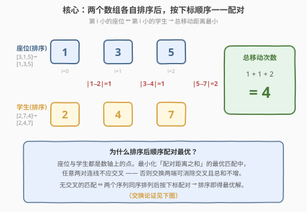
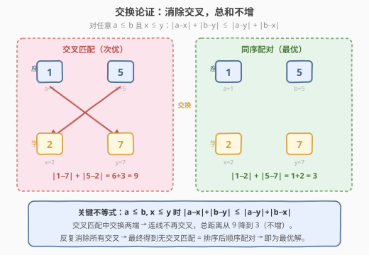
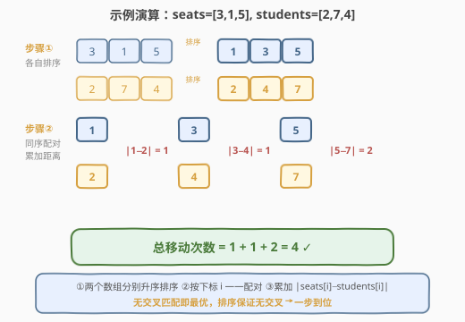

# 使每位学生都有座位的最少移动次数

- **题目名称**：使每位学生都有座位的最少移动次数
- **链接**：[2037. 使每位学生都有座位的最少移动次数](https://leetcode.cn/problems/minimum-number-of-moves-to-seat-everyone/)
- **难度**：简单
- **标签**：贪心、排序、数组

## 1. 题目概述

一个房间里有 $n$ 个空闲座位和 $n$ 名站着的学生，房间用一个数轴表示。给定长度为 $n$ 的数组 `seats`（`seats[i]` 是第 $i$ 个座位的位置）和长度为 $n$ 的数组 `students`（`students[j]` 是第 $j$ 位学生的位置）。

一次**操作**可以将任意一位学生从位置 $x$ 移动到 $x+1$ 或 $x-1$（即每次变化量为 1）。要求每位学生最终坐在**互不相同**的座位上，返回所需的最少移动次数。

> 💡 **位置可重复**：初始时可能有多个座位或多位学生在同一位置，但最终每个座位恰好坐一人。从位置 $a$ 移到位置 $b$ 的移动次数即 $|a - b|$。

**示例 1**：

```text
输入：seats = [3,1,5], students = [2,7,4]
输出：4
解释：
- 学生 2 → 座位 1，移动 1 次
- 学生 7 → 座位 5，移动 2 次
- 学生 4 → 座位 3，移动 1 次
总计 1 + 2 + 1 = 4
```

**示例 2**：

```text
输入：seats = [4,1,5,9], students = [1,3,2,6]
输出：7
解释：
- 学生 1 → 座位 1，移动 0 次
- 学生 3 → 座位 4，移动 1 次
- 学生 2 → 座位 5，移动 3 次
- 学生 6 → 座位 9，移动 3 次
总计 0 + 1 + 3 + 3 = 7
```

**示例 3**：

```text
输入：seats = [2,2,6,6], students = [1,3,2,6]
输出：4
解释：
- 学生 1 → 座位 2，移动 1 次
- 学生 3 → 座位 6，移动 3 次
- 学生 2 → 座位 2，移动 0 次
- 学生 6 → 座位 6，移动 0 次
总计 1 + 3 + 0 + 0 = 4
```

**约束条件**：

- $n = \text{seats.length} = \text{students.length}$
- $1 \le n \le 100$
- $1 \le \text{seats}[i],\, \text{students}[j] \le 100$

---

## 2. 解题思路

### 2.1 暴力思路：枚举所有座位分配

最直观的做法是枚举学生到座位的所有**全排列**分配方案。对每一种排列 $\sigma$，计算总移动距离 $\sum_i |\text{seats}[\sigma(i)] - \text{students}[i]|$，取最小值。排列数为 $n!$，当 $n = 100$ 时完全不可行。

突破口在于：问题本质是**两个点集在数轴上的最小权匹配**，而数轴（一维）上的最小权匹配有极其优美的性质——**排序后同序配对即最优**，无需搜索。

### 2.2 核心观察：排序后同序配对



将 `seats` 和 `students` **分别升序排序**，然后按下标 $i$ 一一配对：第 $i$ 小的座位分配给第 $i$ 小的学生。总移动次数即为：

$$
\text{ans} = \sum_{i=0}^{n-1} \big|\,\text{seats}[i] - \text{students}[i]\,\big|
$$

> 💡 **为什么同序配对最优？** 座位与学生都是数轴上的点，我们要找一个**双射**（每位学生恰好匹配一个座位）使距离之和最小。关键事实是：**最优匹配中任意两对连线不应交叉**。若存在交叉（座位 $a \le b$ 匹配学生 $y \ge x$，即 $a \leftrightarrow y$ 与 $b \leftrightarrow x$ 交叉），交换两端得到 $a \leftrightarrow x$、$b \leftrightarrow y$，总距离**不增**。



上述交换的正确性依赖一个经典不等式：对任意 $a \le b$ 且 $x \le y$，

$$
|a - x| + |b - y| \le |a - y| + |b - x|
$$

> ⚠️ **直觉理解**：交叉连线意味着"远的学生跑去近的座位、近的学生跑去远的座位"，造成来回折返的浪费；解交叉后"近配近、远配远"，路径不交叉、总距离更短。反复消除所有交叉，最终得到一个**无交叉的匹配**——而无交叉匹配恰等价于两个序列同序排列后按下标配对。因此排序 + 顺序配对就是最优解。

### 2.3 算法流程

算法极其简洁，只有「排序 + 一趟累加」两步：

1. 对 `seats` 升序排序。
2. 对 `students` 升序排序。
3. 初始化 `ans = 0`，遍历 $i = 0, 1, \dots, n-1$，累加 `ans += abs(seats[i] - students[i])`。
4. 返回 `ans`。

> 💡 排序消除了下标顺序的干扰，使配对在数值大小意义上"就近匹配"——这正是贪心成立的根源。

### 2.4 示例演算

以 `seats = [3,1,5]`、`students = [2,7,4]` 为例：



| 步骤 | 操作 | 结果 |
|------|------|------|
| ① | 排序 `seats = [3,1,5]` | `[1,3,5]` |
| ① | 排序 `students = [2,7,4]` | `[2,4,7]` |
| ② | 配对 $i=0$：`1 ↔ 2` | $|1-2| = 1$ |
| ② | 配对 $i=1$：`3 ↔ 4` | $|3-4| = 1$ |
| ② | 配对 $i=2$：`5 ↔ 7` | $|5-7| = 2$ |
| — | 累加 | $1 + 1 + 2 = \mathbf{4}$ |

---

## 3. 参考代码

### C++

```cpp
class Solution {
  public:
    int minMovesToSeat(vector<int>& seats, vector<int>& students) {
        sort(seats.begin(), seats.end());
        sort(students.begin(), students.end());
        int ans = 0;
        for (int i = 0; i < seats.size(); ++i) {
            ans += abs(seats[i] - students[i]);
        }
        return ans;
    }
};
```

### Python

```python
class Solution:
    def minMovesToSeat(self, seats: List[int], students: List[int]) -> int:
        seats.sort()
        students.sort()
        return sum(abs(s - t) for s, t in zip(seats, students))
```

> 💡 Python 版用 `zip` + 生成器一行完成累加，既简洁又高效；C++ 版手动循环避免额外容器分配。

---

## 4. 复杂度分析

| 维度 | 复杂度 | 说明 |
|------|--------|------|
| 时间复杂度 | $O(n \log n)$ | 两次排序主导，各 $O(n \log n)$；一趟累加 $O(n)$ |
| 空间复杂度 | $O(\log n)$ | 排序的递归栈空间（原地排序，无额外数组） |

> 💡 本题 $n \le 100$、值域 $\le 100$，$O(n \log n)$ 绰绰有余。下一节给出利用小值域进一步降到 $O(n + V)$ 的计数排序变体。

---

## 5. 扩展：计数排序优化到 $O(n + V)$

题目约束 $\text{seats}[i],\, \text{students}[j] \le 100$，值域 $V = 100$ 极小。可用**计数排序**避开比较排序的 $O(n \log n)$：

- 用两个长度 $101$ 的计数数组 `cnt_seat`、`cnt_stu` 统计各位置出现次数。
- 用双指针从位置 $1$ 扫到 $100$，每当某位置同时有剩余座位和学生就配对消耗，距离即为位置之差。

```cpp
class Solution {
  public:
    int minMovesToSeat(vector<int>& seats, vector<int>& students) {
        int cntSeat[101] = {0}, cntStu[101] = {0};
        for (int s : seats) cntSeat[s]++;
        for (int s : students) cntStu[s]++;
        int ans = 0, i = 1, j = 1;
        while (i <= 100 && j <= 100) {
            while (i <= 100 && cntSeat[i] == 0) i++;
            while (j <= 100 && cntStu[j] == 0) j++;
            if (i > 100 || j > 100) break;
            ans += abs(i - j);
            cntSeat[i]--;
            cntStu[j]--;
        }
        return ans;
    }
};
```

| 维度 | 复杂度 | 说明 |
|------|--------|------|
| 时间复杂度 | $O(n + V)$ | 计数 $O(n)$ + 双指针扫描 $O(V)$，$V = 100$ |
| 空间复杂度 | $O(V)$ | 两个长度 $101$ 的计数数组 |

> 💡 双指针扫描时，两个计数数组的"非零位置序列"天然升序——这与排序后配对完全等价，只是用计数把排序隐式完成了。当 $V \ll n \log n$ 时计数排序更优。

---

## 6. 面试要点

1. **为什么排序后顺序配对是最优的？能用交换论证说明吗？**

   - 设最优匹配中存在两对交叉：座位 $a \le b$ 分别匹配学生 $y \ge x$（$a \leftrightarrow y$、$b \leftrightarrow x$）。由不等式 $|a-x| + |b-y| \le |a-y| + |b-x|$，交换为 $a \leftrightarrow x$、$b \leftrightarrow y$ 后总距离不增。反复消除所有交叉，最终得到无交叉匹配，而无交叉匹配恰等价于两序列同序配对。故排序 + 顺序配对即最优。

2. **为什么不用全排列枚举？复杂度差多少？**

   - 全排列枚举是 $O(n!)$，$n=100$ 时约 $10^{157}$ 种方案，完全不可行；排序配对仅 $O(n \log n)$。关键在于把"组合搜索"问题转化为"利用数轴一维结构直接构造最优解"。

3. **示例 3 中座位有重复（两个位置 2、两个位置 6），排序配对还成立吗？**

   - 完全成立。重复值排序后相邻，配对时允许两个学生坐到相同位置的两个座位（题目允许座位同位置，只要求学生最终座位互不相同——而座位本身就是不同的个体）。排序配对天然处理重复，无需特殊判断。

4. **如果题目改成「最大化」总移动距离，怎么做？**

   - 仍然排序，但改为**首尾交叉配对**：最小座位配最大学生、次小配次大……这对应"制造最大交叉"，由同一个交换不等式反向理解——交叉比不交叉距离更大。本题是同一不等式的两极应用。

5. **计数排序版和比较排序版各适合什么场景？**

   - 值域 $V$ 小（如本题 $V \le 100$）时计数排序 $O(n+V)$ 更快且常数小；值域大（如 $10^9$）时只能用比较排序 $O(n \log n)$。面试中先给 $O(n \log n)$ 主解，再提计数排序优化，体现对约束的敏感度。

---

## 7. 同类练习题

- [462. 最小操作使数组元素相等 II](https://leetcode.cn/problems/minimum-moves-to-equal-array-elements-ii/)：同一贪心家族，排序后取中位数使各点到中位距离之和最小，同为「排序 + 绝对差求和」范式
- [561. 数组拆分](https://leetcode.cn/problems/array-partition/)：$2n$ 个数配成 $n$ 对最大化各对最小值之和，排序后取偶数下标，同属「排序后顺序配对」贪心
- [1685. 有序数组中差绝对值之和](https://leetcode.cn/problems/sum-of-absolute-differences-in-a-sorted-array/)：有序数组每个点到其余各点距离之和，前缀和优化，承接排序 + 绝对差主题
- [453. 最小操作使数组元素相等](https://leetcode.cn/problems/minimum-moves-to-equal-array-elements/)：与 462 对照——每次操作给 $n-1$ 个元素 +1，逆向思考等价于单点 -1，最终数学公式 $O(n)$，可对比两种"使元素相等"的模型
- [881. 救生艇](https://leetcode.cn/problems/boats-to-save-people/)：排序 + 双指针贪心（首尾配对判超重），同为排序后基于大小关系配对决策
