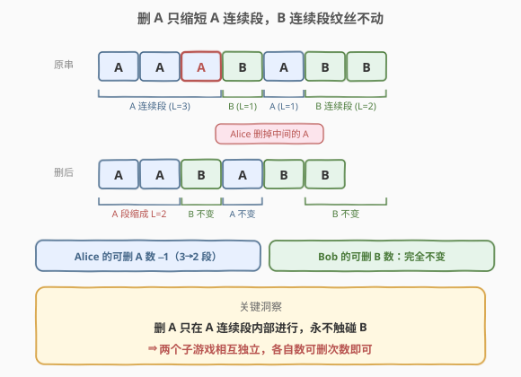
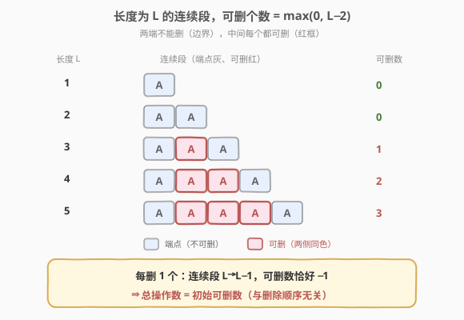
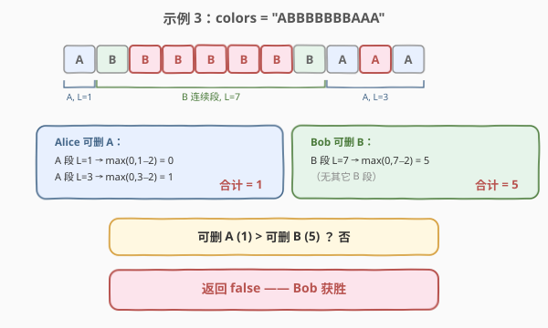

# 如果相邻两个颜色均相同则删除当前颜色

- **题目名称**：如果相邻两个颜色均相同则删除当前颜色
- **链接**：[2038. 如果相邻两个颜色均相同则删除当前颜色](https://leetcode.cn/problems/remove-colored-pieces-if-both-neighbors-are-the-same-color/)
- **难度**：中等
- **标签**：贪心、博弈、字符串、计数

## 1. 题目概述

共有 $n$ 个颜色片段排成一列，每个片段要么是 `'A'` 要么是 `'B'`。给定字符串 `colors`，Alice 和 Bob 轮流删除片段，**Alice 先手**：

- Alice 只能删除一个 `'A'`，且该 `'A'` **左右相邻**必须都是 `'A'`；
- Bob 只能删除一个 `'B'`，且该 `'B'` **左右相邻**必须都是 `'B'`；
- **不能**从字符串两端删除（即被删片段必须有左、右两个邻居）；
- 谁无法操作谁就**输**，对方获胜。

两人都采用最优策略，Alice 胜返回 `true`，否则返回 `false`。

**示例 1**：

```text
输入：colors = "AAABABB"
输出：true
解释：Alice 删除从左数第 2 个 'A'（唯一左右都是 'A' 的 'A'），串变 "AABABB"。
      轮到 Bob，没有任何 'B' 左右都是 'B'，Bob 输，Alice 胜。
```

**示例 2**：

```text
输入：colors = "AA"
输出：false
解释：只有 2 个 'A' 且都在两端，Alice 无法操作，Alice 输。
```

**示例 3**：

```text
输入：colors = "ABBBBBBBAAA"
输出：false
解释：Alice 唯一选择是删除右数第 2 个 'A'，串变 "ABBBBBBBAA"。
      Bob 可删任意一个中间的 'B'（7 个连号 'B' 中有 5 个可选）。
      之后 Alice 再无可删 'A'，Bob 胜。
```

**约束条件**：

- $1 \le \text{colors.length} \le 10^5$
- `colors` 只包含字母 `'A'` 和 `'B'`

---

## 2. 解题思路

### 2.1 暴力思路：搜索博弈树

最直白的做法是写一个 `dfs(colors, turn)` 模拟双方轮流操作：枚举当前玩家所有可删位置，递归调用下一回合，用 Minimax 判定胜负。但每步可能产生 $O(n)$ 个分支，字符串长达 $10^5$，搜索树爆炸，完全不可行。

突破口在于识别本题的**结构性不变量**：删 `A` 与删 `B` 是**两个互不干扰的独立子游戏**。

### 2.2 核心观察：子游戏相互独立



将 `colors` 按颜色切成若干**连续段**（run），如 `"AAABABB"` → `AAA | B | A | BB`。关键事实有两条：

1. **删 `A` 只在某个 `A` 连续段内部发生**，删完后该段长度 $L \to L-1$，仍是 `A` 连续段，**边界与 `B` 段的相对位置完全不变**；
2. 因此**删 `A` 永远不会改变 Bob 可删的 `B` 数量**，反之亦然。

> 💡 也就是说，Alice 的"可删 `A` 池"和 Bob 的"可删 `B` 池"是**两个独立递减的计数器**，谁先归零谁输——这是一个纯粹的"比谁的家底厚"的游戏，**先后手只体现在比较方向上**（Alice 先手，故需严格大于）。

### 2.3 子游戏内：可删总数 = 初始可删数

进一步观察单个 `A` 连续段：长度为 $L$ 的连续段中，**两端不能删**（一个端点无左邻居、另一个无右邻居），中间 $L-2$ 个每个都左右皆 `A`、都可删。所以单段贡献 $\max(0,\, L-2)$ 个可删位置。



更重要的是：**每删一个 `A`，该段 $L \to L-1$，可删数恰好 $-1$**（中间少一格、端点仍不可删），且不会跨段影响其它 `A` 段。所以无论 Alice 以何种顺序删 `A`，她**整局能删的 `A` 总数** 恰好等于**初始可删 `A` 数**，与策略无关。Bob 同理。

> ⚠️ 这一步把"博弈"消解成了"计数"：不必关心谁在哪一步删哪个，只要比较双方**初始可删总数**即可。Alice 先手，她能撑到第 $c_A$ 轮，Bob 能撑到第 $c_B$ 轮；Alice 胜当且仅当她**严格**比 Bob 多撑一轮，即 $c_A > c_B$。

### 2.4 算法流程

1. 一趟扫描 `colors`，统计：
   - `cntA` = 满足 `colors[i-1]=='A' && colors[i+1]=='A' && colors[i]=='A'` 的下标 $i$ 个数；
   - `cntB` = 满足 `colors[i-1]=='B' && colors[i+1]=='B' && colors[i]=='B'` 的下标 $i$ 个数。
2. 返回 `cntA > cntB`。

> 💡 也可按"连续段"实现：扫一遍合并同色段，对每段长度 $L$ 累加 $\max(0, L-2)$ 到对应颜色计数。两种写法等价，下标判定法代码更短。

### 2.5 示例演算

以示例 3 `colors = "ABBBBBBBAAA"` 为例：



| 步骤 | 操作 | 结果 |
|------|------|------|
| ① | 切分连续段 | `A(L=1) \| B(L=7) \| A(L=3)` |
| ② | 计算 `cntA` | $\max(0,1-2) + \max(0,3-2) = 0 + 1 = 1$ |
| ② | 计算 `cntB` | $\max(0,7-2) = 5$ |
| — | 比较 | $1 > 5$？否 → 返回 `false` |

---

## 3. 参考代码

### C++

```cpp
class Solution {
  public:
    bool winnerOfGame(string colors) {
        int cntA = 0, cntB = 0;
        for (int i = 1; i + 1 < colors.size(); ++i) {
            if (colors[i] == 'A' && colors[i - 1] == 'A' && colors[i + 1] == 'A') {
                ++cntA;
            } else if (colors[i] == 'B' && colors[i - 1] == 'B' && colors[i + 1] == 'B') {
                ++cntB;
            }
        }
        return cntA > cntB;
    }
};
```

### Python

```python
class Solution:
    def winnerOfGame(self, colors: str) -> bool:
        cnt_a = cnt_b = 0
        for i in range(1, len(colors) - 1):
            if colors[i] == 'A' and colors[i - 1] == 'A' and colors[i + 1] == 'A':
                cnt_a += 1
            elif colors[i] == 'B' and colors[i - 1] == 'B' and colors[i + 1] == 'B':
                cnt_b += 1
        return cnt_a > cnt_b
```

> 💡 也可用 `colors[i-1:i+2]` 切片比较：`cnt_a += colors[i-1:i+2] == 'AAA'`，更 Pythonic 但常数略大。下面扩展给出"连续段"写法。

---

## 4. 复杂度分析

| 维度 | 复杂度 | 说明 |
|------|--------|------|
| 时间复杂度 | $O(n)$ | 单趟扫描，每个位置 $O(1)$ 判定 |
| 空间复杂度 | $O(1)$ | 仅两个计数变量，原地处理字符串 |

> 💡 本题 $n \le 10^5$，$O(n)$ 单趟扫描毫无压力。瓶颈不在算法而在**洞察**——把博弈归约成计数。

---

## 5. 扩展：连续段写法与正确性证明

### 5.1 连续段写法

按 run 合并同色段，对每段累加 $\max(0, L-2)$，代码同样简洁：

```cpp
class Solution {
  public:
    bool winnerOfGame(string colors) {
        int cntA = 0, cntB = 0;
        for (int i = 0, n = colors.size(); i < n; ) {
            int j = i;
            while (j < n && colors[j] == colors[i]) ++j;
            int len = j - i;
            if (colors[i] == 'A') cntA += max(0, len - 2);
            else cntB += max(0, len - 2);
            i = j;
        }
        return cntA > cntB;
    }
};
```

两种写法完全等价：下标判定法统计"中间可删位置"，连续段法统计"每段长度减 2"，二者逐段一一对应。

### 5.2 为什么"总操作数 = 初始可删数"与策略无关

设初始有 $c_A$ 个可删 `A`。归纳证明 Alice 整局恰好删 $c_A$ 次：

- **每次删一个 `A`，$c_A$ 恰好 $-1$**：被删位置来自某段长度 $L \ge 3$，删后该段变 $L-1$，可删数从 $L-2$ 变 $L-3$，净减 $1$；其它段不受影响。
- **游戏结束时 $c_A = 0$**：Alice 无法操作当且仅当没有可删 `A`，即 $c_A = 0$。

因此删减次数 = 初值 $-$ 终值 $= c_A - 0 = c_A$，与删除顺序、Bob 的行为均无关。Bob 侧对称。最终 Alice 走 $c_A$ 步、Bob 走 $c_B$ 步，Alice 先手需**严格更多**才能在 Bob 无棋可走时仍轮到 Bob 输，故判 $c_A > c_B$。

---

## 6. 面试要点

1. **为什么不用 Minimax 搜索博弈树？**

   - 每步可删位置可达 $O(n)$，搜索树深度 $O(n)$、分支 $O(n)$，最坏 $O(n!)$ 量级；$n=10^5$ 完全不可行。关键在于识别"两个子游戏独立"的结构，把博弈归约为计数。

2. **怎么看出删 `A` 不影响 Bob？**

   - 删 `A` 必发生在某 `A` 连续段内部，删后该段只是变短、仍全是 `A`，与相邻 `B` 段的边界不变；`B` 段长度未变，故 Bob 的可删 `B` 数不变。两个子游戏互不干扰是本题的核心不变量。

3. **为什么"总操作数 = 初始可删数"，与删除顺序无关？**

   - 每删一个，该段长度 $L \to L-1$、可删数 $L-2 \to L-3$，净减 $1$；终态可删数为 $0$。故总删减数 = 初值，顺序无关。这让"博弈"退化为"比家底"。

4. **Alice 先手，为什么是 `cntA > cntB` 而不是 `>=`？**

   - Alice 走第 1、3、5… 步，Bob 走第 2、4、6… 步。Alice 走完第 $c_A$ 步后若 $c_A \le c_B$，Bob 还能走第 $c_A+1$ 步（如 $c_A = c_B$，Bob 走完后 Alice 无棋可走即输）。只有 $c_A > c_B$，Alice 走完第 $c_B+1$ 步后 Bob 已无棋，Bob 输。

5. **下标判定法和连续段法哪个更好？**

   - 两者等价、均 $O(n)/O(1)$。下标判定法代码更短、常数更小（单趟逐位判定）；连续段法更直观地体现"按 run 贡献 $L-2$"的思路，便于讲解。面试先讲连续段思路再落下标代码最佳。

---

## 7. 同类练习题

- [292. Nim 游戏](https://leetcode.cn/problems/nim-game/)：经典博弈，"家底厚者胜"范式，用数学归纳直接判 $n \bmod 4 \neq 0$，与本题同为"博弈归约为计数/公式"
- [877. 石子游戏](https://leetcode.cn/problems/stone-game/)：博弈型区间 DP，Alice 总能赢的数学结论，对照本题"先手需严格大于"的边界条件
- [1025. 除数博弈](https://leetcode.cn/problems/divisor-game/)：选除数减法的博弈，最终归约到偶数判胜负，与本题同属"博弈伪装下藏着的简单计数/奇偶结论"
- [486. 预测赢家](https://leetcode.cn/problems/predict-the-winner/)：区间 DP + Minimax，对比本题如何用结构不变量避免搜索
- [553. 最优除法](https://leetcode.cn/problems/optimal-division/)：一道"看似博弈实则贪心/数学"的题，与本题同属"识破伪装后一行代码"的类型
