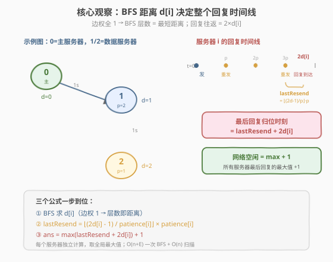
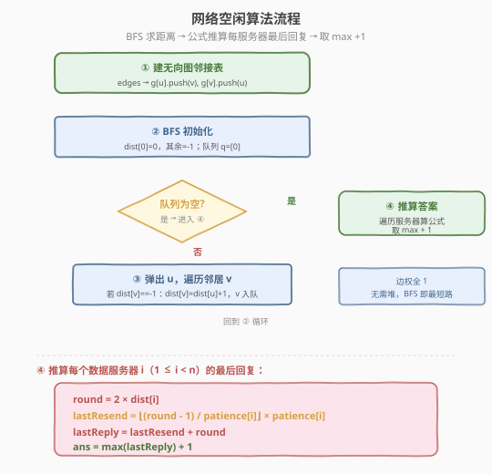
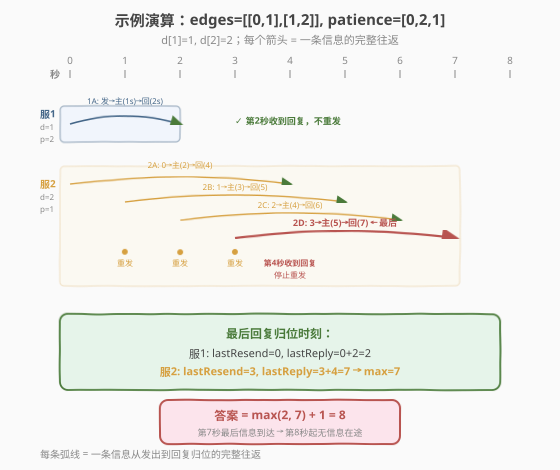

# LeetCode 网络空闲的时刻 题解

## 1. 题目概述

- **标题 / 题号**：网络空闲的时刻（#2039，medium）
- **链接**：https://leetcode.cn/problems/the-time-when-the-network-becomes-idle/
- **难度**：中等
- **标签**：图、BFS、最短路径、数学

**题意**：有 `n` 个服务器（编号 `0` 到 `n-1`），通过无向边 `edges` 连成一张**连通**图。每条边传输信息耗时 **1 秒**，一秒内可传输任意数目信息。编号 `0` 的服务器是**主服务器**，其余为**数据服务器**。

每个数据服务器在 **0 秒**初向主服务器发出一条信息，并等待回复。信息按**最优线路**（最短路径）传输。主服务器收到信息后**立即**沿原路**反向**回复。

从第 **1 秒**开始，每秒最**开始**时，每个数据服务器检查是否已收到回复：

- **未收到**：每隔 `patience[i]` 秒**重发**一条信息（即上次发送后第 `patience[i]` 秒重发）。
- **已收到**：**不再重发**。

当网络上没有任何信息在传输或到达时，网络变为**空闲**。求网络空闲的**最早秒数**。

> 💡 一句话：每个数据服务器独立地向主服务器「发信息→等回复」，期间可能重发若干次；所有信息回合结束后，网络才空闲。

**示例 1**：

```text
输入：edges = [[0,1],[1,2]], patience = [0,2,1]
输出：8
解释：
  服务器 1：d=1，首次回复在第 2 秒到达；patience=2，不会重发（第 2 秒恰好收到回复）。
  服务器 2：d=2，首次回复在第 4 秒到达；patience=1，在第 1、2、3 秒各重发一次。
           最后一次重发（第 3 秒）的回复在第 7 秒到达 → 网络第 8 秒空闲。
```

**示例 2**：

```text
输入：edges = [[0,1],[0,2],[1,2]], patience = [0,10,10]
输出：3
解释：服务器 1、2 距离均为 1，回复第 2 秒到达；patience=10 远大于 2，不重发 → 第 3 秒空闲。
```

**约束**：

- $2 \le n \le 10^5$
- `patience[0] == 0`，对 $1 \le i < n$ 满足 $1 \le \text{patience}[i] \le 10^5$
- $1 \le \text{edges.length} \le \min(10^5,\ n(n-1)/2)$
- 无重边，图连通

## 2. 解题思路

### 2.1 暴力思路：逐秒模拟

最直观的基线是**逐秒模拟**：维护每条在途信息的位置与方向，每秒推进所有信息一步，检查服务器是否收到回复、是否触发重发，直到没有任何信息在途。

- **正确性**：可以正确还原题意。
- **效率**：问题在于 `n` 高达 $10^5$，且每个服务器可能重发多次（`patience[i]` 可小到 1），重发次数与往返时间都可达 $O(n)$ 量级，总信息条数与模拟时长可能达到 $O(n^2)$，**必然超时**。

> ⚠️ 暴力模拟的瓶颈在于「逐条信息、逐秒推进」。突破口是意识到：**每个服务器的行为只取决于它到主服务器的距离**——距离决定了回复到达时间，进而决定了重发次数与最后一条信息的归位时间。把这些量算出来，就能直接得到答案，无需模拟。

### 2.2 核心观察：BFS 求距离 + 公式推算最后回复时刻



三个关键观察把问题从「模拟」降为「计算」：

**观察 1：所有边权为 1 → BFS 求最短距离**

每条边耗时 1 秒，信息走最短路径。从主服务器 `0` 做 **BFS**，得到每个数据服务器 $i$ 到主服务器的最短距离 $d[i]$。这正是 [743. 网络延迟时间](../0701-0800/743_网络延迟时间.md) 的退化版——边权全为 1 时，BFS 层数即最短距离，无需 Dijkstra。

**观察 2：首次回复到达时间 = $2 \times d[i]$**

信息从 $i$ 出发，经 $d[i]$ 秒到主服务器；主服务器立即回复，再经 $d[i]$ 秒返回 $i$。所以**首次回复在第 $2d[i]$ 秒到达**。从这一秒起，服务器 $i$ 不再重发。

**观察 3：最后一次重发 = 小于 $2d[i]$ 的最大 `patience[i]` 倍数**

重发发生在第 $p, 2p, 3p, \dots$ 秒（$p = \text{patience}[i]$），但**仅当此刻尚未收到回复**。由于回复在第 $2d[i]$ 秒到达，该秒起不再重发。因此最后一次重发时刻为：

$$\text{lastResend} = \left\lfloor \frac{2d[i] - 1}{p} \right\rfloor \times p$$

> 💡 用 $2d[i] - 1$ 而非 $2d[i]$：因为第 $2d[i]$ 秒回复已到达，那一秒不重发。若 $p \ge 2d[i]$，则 $\lfloor (2d[i]-1)/p \rfloor = 0$，`lastResend = 0`，即只有第 0 秒的首条信息，无重发——与示例 2 一致。

**推算最后回复归位时刻**：

最后一次重发（时刻 `lastResend`）发出的信息，经 $d[i]$ 秒到主服务器，回复再经 $d[i]$ 秒返回，归位时刻为：

$$\text{lastReply} = \text{lastResend} + 2d[i]$$

**网络空闲时刻** = 所有服务器最后回复归位时刻的**最大值** $+ 1$（最后一条信息到达的那一秒仍有信息到达，下一秒才真正空闲）：

$$\text{ans} = \max_{i=1}^{n-1}(\text{lastResend}_i + 2d[i]) + 1$$

### 2.3 算法流程图



### 2.4 示例演算

以示例 1 `edges = [[0,1],[1,2]], patience = [0,2,1]` 为例，BFS 从节点 0 出发：$d[0]=0,\ d[1]=1,\ d[2]=2$。



| 服务器 | $d[i]$ | $2d[i]$ | $p$ | 重发时刻（$< 2d[i]$ 的 $p$ 倍数） | lastResend | lastReply = lastResend + $2d[i]$ |
|--------|--------|---------|-----|----------------------------------|------------|----------------------------------|
| 1 | 1 | 2 | 2 | —（$p=2$，$2d=2$，第 2 秒回复到达，不重发） | 0 | 0 + 2 = **2** |
| 2 | 2 | 4 | 1 | 1, 2, 3 | 3 | 3 + 4 = **7** |

$\max(2, 7) = 7$，答案 $= 7 + 1 = \mathbf{8}$。

> 💡 服务器 2 的时间线：第 0 秒发 2A → 第 2 秒到主服务器、回复出发 → 第 4 秒首次回复到达（但第 1、2、3 秒已各重发一条 2B/2C/2D）。最后一条 2D 第 3 秒发出 → 第 5 秒到主服务器 → 第 7 秒回复到达。第 8 秒起无信息在途。

## 3. 参考代码

### C++

```cpp
class Solution {
  public:
    int networkBecomesIdle(vector<vector<int>>& edges, vector<int>& patience) {
        int n = patience.size();
        // 建无向图邻接表
        vector<vector<int>> g(n);
        for (auto& e : edges) {
            g[e[0]].push_back(e[1]);
            g[e[1]].push_back(e[0]);
        }

        // BFS 从主服务器 0 出发求最短距离
        vector<int> dist(n, -1);
        dist[0] = 0;
        queue<int> q;
        q.push(0);
        while (!q.empty()) {
            int u = q.front(); q.pop();
            for (int v : g[u]) {
                if (dist[v] == -1) {
                    dist[v] = dist[u] + 1;
                    q.push(v);
                }
            }
        }

        // 逐个数据服务器推算最后回复归位时刻
        int ans = 0;
        for (int i = 1; i < n; ++i) {
            int d = dist[i];
            int round = 2 * d;                       // 首次回复到达时间
            int p = patience[i];
            int lastResend = ((round - 1) / p) * p;  // < round 的最大 p 倍数
            int lastReply = lastResend + round;      // 最后一条回复归位
            ans = max(ans, lastReply);
        }
        return ans + 1;                              // 最后一秒仍有信息到达，+1 才空闲
    }
};
```

### Python

```python
class Solution:
    def networkBecomesIdle(self, edges: List[List[int]], patience: List[int]) -> int:
        n = len(patience)
        g = [[] for _ in range(n)]
        for u, v in edges:
            g[u].append(v)
            g[v].append(u)

        # BFS 从主服务器 0 出发求最短距离
        dist = [-1] * n
        dist[0] = 0
        q = deque([0])
        while q:
            u = q.popleft()
            for v in g[u]:
                if dist[v] == -1:
                    dist[v] = dist[u] + 1
                    q.append(v)

        # 逐个数据服务器推算最后回复归位时刻
        ans = 0
        for i in range(1, n):
            d = dist[i]
            round_t = 2 * d                        # 首次回复到达时间
            p = patience[i]
            last_resend = ((round_t - 1) // p) * p  # < round_t 的最大 p 倍数
            last_reply = last_resend + round_t      # 最后一条回复归位
            ans = max(ans, last_reply)
        return ans + 1                             # 最后一秒仍有信息到达，+1 才空闲
```

> 💡 **为什么用 `2d - 1` 而不是 `2d`？** 第 $2d[i]$ 秒回复已到达，那一秒不会重发。用 $2d[i] - 1$ 向下取整恰好跳过该秒，保证 `lastResend < 2d[i]`。当 $p \ge 2d[i]$ 时结果为 0，即无重发，公式自然适配。

## 4. 复杂度分析

| 维度 | 复杂度 | 说明 |
|------|--------|------|
| 时间复杂度 | $O(n + E)$ | BFS 遍历每个节点和边各一次 $O(n+E)$；线性扫描所有服务器推算公式 $O(n)$ |
| 空间复杂度 | $O(n + E)$ | 邻接表 $O(n+E)$、`dist` 数组 $O(n)$、BFS 队列 $O(n)$ |

> ⚠️ 本题 $n, E$ 均可达 $10^5$，$O(n+E)$ 的 BFS 是最优复杂度。若误用 Dijkstra（$O(E \log n)$）虽也能过但多余——边权全 1 时 BFS 已给出精确最短路。

## 5. 扩展：若边权不等

本题所有边权为 1，BFS 足矣。若把题意改为「每条边传输耗时不同」（加权无向图），则：

- BFS → **堆优化 Dijkstra**，求主服务器到各数据服务器的最短距离 $d[i]$。
- 后续公式（重发时刻、最后回复、$+1$）完全不变，因为它们只依赖 $d[i]$ 与 $\text{patience}[i]$。

| 场景 | 距离算法 | 复杂度 |
|------|----------|--------|
| 边权全 1（本题） | BFS | $O(n + E)$ |
| 边权不等、非负 | 堆优化 Dijkstra | $O(E \log n)$ |
| 边权含负值 | Bellman-Ford / SPFA | $O(nE)$ |

## 6. 面试要点

1. **为什么可以用 BFS 而不用 Dijkstra？**

   - 所有边权均为 1（每条边传输耗时 1 秒），BFS 的「层数 = 最短距离」成立。Dijkstra 的贪心优势在边权不等时才需要；边权全 1 时 BFS 更快（$O(n+E)$ vs $O(E \log n)$）且实现更简。

2. **最后一次重发时刻的公式怎么推出来的？**

   - 重发发生在第 $p, 2p, 3p, \dots$ 秒，但第 $2d[i]$ 秒回复到达后不再重发。所以取严格小于 $2d[i]$ 的最大 $p$ 倍数：$\lfloor (2d[i]-1)/p \rfloor \times p$。用 $2d[i]-1$ 是因为第 $2d[i]$ 秒本身已收到回复、不重发。

3. **答案为什么要 $+1$？**

   - 最后一条回复在第 `lastReply` 秒**到达**服务器，该秒仍有信息到达，网络不算空闲。从下一秒起才无信息在途，故答案 $= \max(\text{lastReply}) + 1$。

4. **每个服务器是独立计算的吗？为什么可以取 max？**

   - 是。各数据服务器的发送/重发/回复互不干扰（信息沿各自最短路径走，边可同时传任意多条信息）。网络空闲要求**所有**信息回合结束，故取所有服务器最后回复时刻的最大值。

5. **`patience[i]` 很大时会怎样？**

   - 若 $p \ge 2d[i]$，则首次回复到达前不会触发任何重发（第一次重发应发生在第 $p$ 秒，但第 $2d[i]$ 秒已收到回复）。公式中 $\lfloor (2d[i]-1)/p \rfloor = 0$，`lastResend = 0`，最后回复 $= 2d[i]$，自然正确。

## 同类练习题

| # | 题目 | 与本题的关联 |
|---|------|-------------|
| 743 | [网络延迟时间](https://leetcode.cn/problems/network-delay-time/) | 单源最短路求所有节点收到信号的最短时间（边权不等时用 Dijkstra，本题的加权版） |
| 994 | [腐烂的橘子](https://leetcode.cn/problems/rotting-oranges/) | 多源 BFS 求最远感染时间，同为「边权 1 取最大距离」范式 |
| 1926 | [迷宫中离入口最近的出口](https://leetcode.cn/problems/nearest-exit-from-entrance-in-maze/) | BFS 在网格图中求最短出口距离 |
| 542 | [01 矩阵](https://leetcode.cn/problems/01-matrix/) | 多源 BFS 求每个格子到最近 0 的距离，与本题「从主服务器 BFS」思路一致 |
| 787 | [K 站中转内最便宜的航班](https://leetcode.cn/problems/cheapest-flights-within-k-stops/) | 带步数限制的最短路（Bellman-Ford / 分层 BFS），对比本题无步数限制的纯 BFS |
