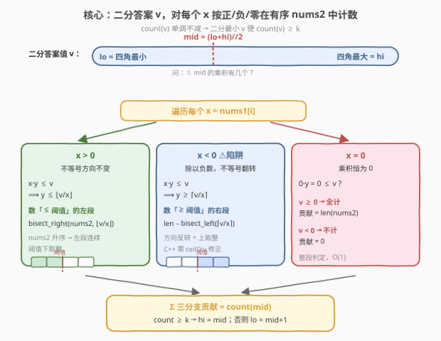
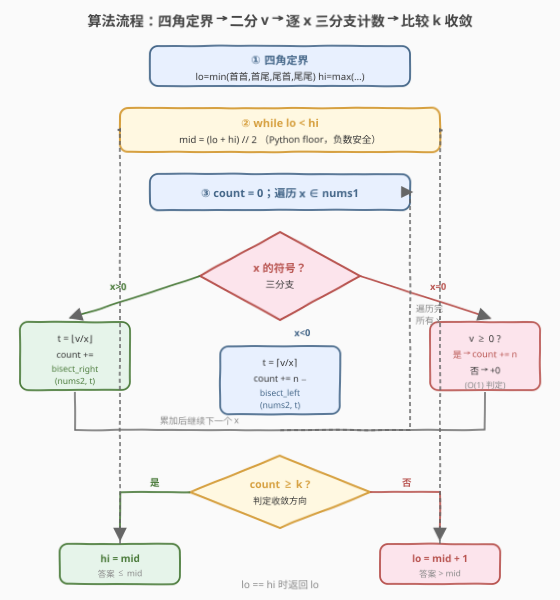
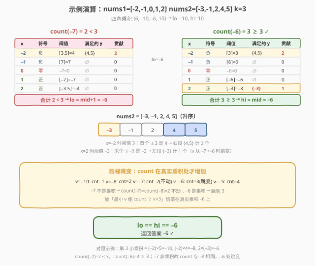

# LeetCode 两个有序数组的第 K 小乘积 题解

## 1. 题目概述

- **标题 / 题号**：两个有序数组的第 K 小乘积（#2040，hard）
- **链接**：https://leetcode.cn/problems/kth-smallest-product-of-two-sorted-arrays/
- **难度**：困难
- **标签**：数组、二分查找、二分答案

**题意**：给定两个**从小到大排好序**的整数数组 `nums1` 和 `nums2` 以及一个整数 `k`，返回所有 `nums1[i] * nums2[j]` 乘积中**第 `k` 小**的那个（`k` 从 1 开始）。

**示例 1**：

```text
输入：nums1 = [2,5], nums2 = [3,4], k = 2
输出：8
解释：乘积集合 {6, 8, 15, 20}，第 2 小为 8。
```

**示例 2**：

```text
输入：nums1 = [-4,-2,0,3], nums2 = [2,4], k = 6
输出：0
解释：乘积排序后 {-16,-8,-8,-4,0,0,6,12}，第 6 小为 0。
```

**示例 3**：

```text
输入：nums1 = [-2,-1,0,1,2], nums2 = [-3,-1,2,4,5], k = 3
输出：-6
解释：乘积排序后 {-10,-8,-6,-5,-4,-4,-3,-2,-2,-1,0,…}，第 3 小为 -6。
```

**约束**：

- $1 \le \text{nums1.length}, \text{nums2.length} \le 5 \times 10^4$
- $-10^5 \le \text{nums1}[i], \text{nums2}[j] \le 10^5$
- $1 \le k \le \text{nums1.length} \times \text{nums2.length}$
- `nums1` 和 `nums2` 均已升序排序

> 💡 关键约束是数组长度可达 $5 \times 10^4$，乘积总数达 $2.5 \times 10^9$，**不可能枚举所有乘积再排序**。但元素值域仅 $[-10^5, 10^5]$，乘积值域 $[-10^{10}, 10^{10}]$，配合「数组有序」可对**答案值**做二分——这是「二分答案 + 计数验证」的经典场景。

## 2. 解题思路

### 2.1 暴力思路：枚举所有乘积

双重循环枚举所有 $n_1 \times n_2$ 个乘积，排序后取第 $k$ 个。时间 $O(n_1 n_2 \log(n_1 n_2))$，最坏 $2.5 \times 10^9$ 量级，**超时且内存爆炸**。

突破口：题目只问「第 k 小的值是多少」，不需要列出所有乘积。于是把问题转化为——**给定一个候选值 $v$，能否在 $O(n_1 \log n_2)$ 内统计出「$\le v$ 的乘积个数」**？若能，再对 $v$ 二分即可。

### 2.2 核心观察：二分答案 + 按符号分情况计数



设 $\text{count}(v)$ 为满足 $\text{nums1}[i] \times \text{nums2}[j] \le v$ 的数对个数。$\text{count}(v)$ 关于 $v$ **单调不减**，因此「第 k 小乘积」就是**最小的 $v$ 使得 $\text{count}(v) \ge k$**——标准的二分下界模型。

难点在快速计算 $\text{count}(v)$。固定 $x = \text{nums1}[i]$，要在**升序**的 `nums2` 中数有多少 $y$ 满足 $x \cdot y \le v$。$x$ 的符号决定了不等式方向，分三种情况：

| $x$ 的符号 | 不等式变形 | `nums2` 中要数的元素 | 计数方式 |
|------------|------------|----------------------|----------|
| $x > 0$ | $y \le \lfloor v / x \rfloor$（方向不变） | $\le$ 阈值 | `bisect_right(nums2, ⌊v/x⌋)` |
| $x < 0$ | $y \ge \lceil v / x \rceil$（除以负数，方向反转） | $\ge$ 阈值 | `len - bisect_left(nums2, ⌈v/x⌉)` |
| $x = 0$ | $0 \le v$？ | $v \ge 0$ 则全计，否则不计 | 整段判定 |

> ⚠️ **负数除法是本题最大陷阱**：$x < 0$ 时除以负数会使不等号翻转，阈值变为「上取整」而非「下取整」，且计数从「左段 $\le$」变为「右段 $\ge$」。若直接套用正数模板会把方向搞反。Python 的 `//` 是**向负无穷取整（floor）**，C++ 的 `/` 是**向零截断（trunc）**，两者对负数行为不同——下取整/上取整必须用专门的整数函数实现，不能直接用语言原生除法。

> 💡 **二分上下界来自四角乘积**：两个升序数组的乘积极值必出现在「首×首、首×尾、尾×首、尾×尾」四个角落。取四者最小为 `lo`、最大为 `hi`，即覆盖所有可能乘积。值域约 $[-10^{10}, 10^{10}]$，二分迭代 $\log_2(2 \times 10^{10}) \approx 35$ 次。

### 2.3 算法流程图



**完整步骤**：

1. **定界**：由四角乘积得 `lo = min`、`hi = max`。
2. **二分**：`while lo < hi`，取 `mid = (lo + hi) // 2`（Python floor，负数安全）。
3. **计数 `count(mid)`**：遍历每个 $x \in \text{nums1}$，按 $x > 0 / x < 0 / x = 0$ 三分支累加。
4. **收敛**：若 $\text{count}(\text{mid}) \ge k$，令 `hi = mid`；否则 `lo = mid + 1`。
5. 返回 `lo`。

> 💡 **为何 `lo` 一定是真实乘积？** $\text{count}(v)$ 是阶梯函数，只在「真实乘积值」处跳变。最小的使 $\text{count} \ge k$ 的整数 $v$，必然恰好落在某个真实乘积上（否则把它减 1 仍 $\ge k$，与最小性矛盾）。所以二分整数域直接得到答案，无需额外校验。

### 2.4 示例演算

以示例 3 `nums1 = [-2,-1,0,1,2]`、`nums2 = [-3,-1,2,4,5]`、`k = 3` 演算：



四角乘积：$(-2)\times(-3)=6$、$(-2)\times5=-10$、$2\times(-3)=-6$、$2\times5=10$，故 `lo = -10`、`hi = 10`。

**计数 `count(-7)`**（应 $< 3$）：

| $x$ | 符号 | 阈值 | `nums2` 中满足的 $y$ | 贡献 |
|-----|------|------|----------------------|------|
| $-2$ | 负 | $\lceil -7/-2 \rceil = \lceil 3.5 \rceil = 4$ | $\{4,5\}$（$\ge 4$） | 2 |
| $-1$ | 负 | $\lceil -7/-1 \rceil = 7$ | $\ge 7$：无 | 0 |
| $0$  | 零 | $-7 < 0$ | 无 | 0 |
| $1$  | 正 | $\lfloor -7/1 \rfloor = -7$ | $\le -7$：无 | 0 |
| $2$  | 正 | $\lfloor -7/2 \rfloor = -4$ | $\le -4$：无 | 0 |

合计 $\text{count}(-7) = 2 < 3$，故答案 $> -7$，`lo = -6`。

**计数 `count(-6)`**（应 $\ge 3$）：

| $x$ | 符号 | 阈值 | `nums2` 中满足的 $y$ | 贡献 |
|-----|------|------|----------------------|------|
| $-2$ | 负 | $\lceil -6/-2 \rceil = 3$ | $\{4,5\}$（$\ge 3$） | 2 |
| $-1$ | 负 | $\lceil 6 \rceil = 6$ | 无 | 0 |
| $0$  | 零 | $-6 < 0$ | 无 | 0 |
| $1$  | 正 | $\lfloor -6 \rfloor = -6$ | 无 | 0 |
| $2$  | 正 | $\lfloor -3 \rfloor = -3$ | $\{-3\}$（$\le -3$） | 1 |

合计 $\text{count}(-6) = 3 \ge 3$，`hi = -6`。`lo == hi`，返回 **`-6`**。

> 💡 注意 $x = -2$ 时阈值从 4 降到 3 但贡献仍为 2（`nums2` 中没有 3，首个 $\ge 3$ 的还是 4）；而 $x = 2$ 时阈值从 $-4$ 升到 $-3$，`nums2` 的 $-3$ 被纳入，贡献由 0 变 1——这正是阶梯函数在真实乘积 $2 \times (-3) = -6$ 处跳变。

## 3. 参考代码

### C++

```cpp
class Solution {
  public:
    long long kthSmallestProduct(vector<int>& nums1, vector<int>& nums2, long long k) {
        // 让 nums1 作外层（较小者），减少计数循环次数；乘法可交换
        if (nums1.size() > nums2.size()) swap(nums1, nums2);

        long long a0 = nums1.front(), a1 = nums1.back();
        long long b0 = nums2.front(), b1 = nums2.back();
        long long lo = min({a0 * b0, a0 * b1, a1 * b0, a1 * b1});
        long long hi = max({a0 * b0, a0 * b1, a1 * b0, a1 * b1});

        while (lo < hi) {
            long long mid = lo + (hi - lo) / 2; // 避免 lo+hi 溢出
            if (countLE(nums1, nums2, mid) >= k) hi = mid;
            else lo = mid + 1;
        }
        return lo;
    }

  private:
    // floor(a / b)，b 可正可负；C++ 原生 / 向零截断，需修正为向负无穷取整
    static long long floorDiv(long long a, long long b) {
        long long q = a / b, r = a % b;
        if (r != 0 && ((r < 0) != (b < 0))) q -= 1;
        return q;
    }
    // ceil(a / b) = -floor(-a / b)
    static long long ceilDiv(long long a, long long b) {
        return -floorDiv(-a, b);
    }

    // 统计 nums1[i] * nums2[j] <= v 的数对数
    static long long countLE(const vector<int>& nums1, const vector<int>& nums2, long long v) {
        long long cnt = 0;
        int n = nums2.size();
        for (int x : nums1) {
            if (x > 0) {
                long long t = floorDiv(v, x);              // y <= floor(v/x)
                cnt += upper_bound(nums2.begin(), nums2.end(), t) - nums2.begin();
            } else if (x < 0) {
                long long t = ceilDiv(v, x);               // y >= ceil(v/x)
                cnt += nums2.end() - lower_bound(nums2.begin(), nums2.end(), t);
            } else {                                        // x == 0
                if (v >= 0) cnt += n;
            }
        }
        return cnt;
    }
};
```

### Python

```python
import bisect


class Solution:
    def kthSmallestProduct(self, nums1: List[int], nums2: List[int], k: int) -> int:
        # 让 nums1 作外层（较小者）；乘法可交换
        if len(nums1) > len(nums2):
            nums1, nums2 = nums2, nums1

        a0, a1 = nums1[0], nums1[-1]
        b0, b1 = nums2[0], nums2[-1]
        corners = (a0 * b0, a0 * b1, a1 * b0, a1 * b1)
        lo, hi = min(corners), max(corners)

        def count_le(v: int) -> int:
            cnt = 0
            n = len(nums2)
            for x in nums1:
                if x > 0:
                    t = v // x                       # floor（Python // 向负无穷取整）
                    cnt += bisect.bisect_right(nums2, t)
                elif x < 0:
                    t = -(-v // x)                   # ceil(v / x)
                    cnt += n - bisect.bisect_left(nums2, t)
                else:                                # x == 0
                    if v >= 0:
                        cnt += n
            return cnt

        while lo < hi:
            mid = (lo + hi) // 2
            if count_le(mid) >= k:
                hi = mid
            else:
                lo = mid + 1
        return lo
```

> ⚠️ **整数除法的语言差异**：Python 的 `//` 向负无穷取整，`v // x`（$x>0$）直接得下取整；上取整用 `-(-v // x)`。C++ 的 `/` 向零截断，必须用 `floorDiv`/`ceilDiv` 修正，否则负数阈值会差 1 导致计数错位。`upper_bound`/`lower_bound` 的阈值用 `long long` 接收，可与 `int` 数组正确比较（值域外自动判全计/全不计）。

> 💡 **`mid = lo + (hi - lo) / 2`**：C++ 中 `lo + hi` 可能达 $2 \times 10^{10}$，超过 `int` 但本解全程 `long long` 安全；写 `lo + (hi-lo)/2` 是预防溢出的习惯写法。Python 大整数无此问题。

## 4. 复杂度分析

| 维度 | 复杂度 | 说明 |
|------|--------|------|
| 时间复杂度 | $O(n_1 \log n_2 \log R)$ | 二分 $\log R \approx 35$ 轮（$R$ 为乘积值域宽 $\approx 2 \times 10^{10}$），每轮遍历 $n_1$ 个元素各做一次 `bisect`/`lower_bound` $O(\log n_2)$；交换使 $n_1 = \min(n_1, n_2)$ |
| 空间复杂度 | $O(1)$ | 仅若干变量，原地计数（不计输入） |

> 💡 最坏 $n_1 = n_2 = 5 \times 10^4$：$5 \times 10^4 \times 16 \times 35 \approx 2.8 \times 10^7$ 次基本运算，`bisect`/`lower_bound` 为底层 C 实现常数极小，可在时限内通过。

## 5. 扩展：为何不直接用堆或归并

理论上「两有序数组第 k 小配对」也有**小顶堆多路归并**解法（如 [373. 查找和最小的 K 对数字](https://leetcode.cn/problems/find-k-pairs-with-smallest-sums/)）：把每行首元素入堆，弹出后推入同行下一个。但本题乘积**不具单调性**——`nums1[i]` 升序、`nums2[j]` 升序时，`nums1[i] * nums2[j]` 因符号正负混杂**不再关于 `(i, j)` 单调**（负×正随 $i$ 增大反而变小），多路归并的「每行单调」前提被破坏，堆法失效。

而「二分答案 + 计数」只依赖 $\text{count}(v)$ 关于 $v$ 单调（这与乘积本身是否单调无关），因此能绕过乘积非单调的障碍。这是本题选择二分答案而非堆/归并的根本原因，也是面试中常被追问的「为什么不能用 373 的堆法」。

> 💡 另一种思路是**按符号分桶**后分别归并（正×正、负×负、含零三段各自单调），再用多路归并合并——可行但实现繁琐、边界多。二分答案以统一框架覆盖所有符号组合，是更简洁的选择。

## 6. 面试要点

1. **为什么对答案二分而不是对下标二分？**

   - 第 k 小的「值」天然构成单调判定：$\text{count}(v)$ 随 $v$ 单调不减，故可二分。而对下标 $(i, j)$ 二分需要乘积关于下标单调，但负数参与时乘积非单调，下标二分无依据。二分答案把「找值」转化为「判可行性」，绕开了乘积的非单调性。

2. **`x < 0` 时为什么阈值是上取整且计数方向反转？**

   - $x \cdot y \le v$，$x < 0$ 时两边除以 $x$ 不等号翻转：$y \ge v / x$。$y$ 是整数，故 $y \ge \lceil v/x \rceil$。计数从「$\le$ 阈值的左段」变为「$\ge$ 阈值的右段」，用 `len - bisect_left(⌈v/x⌉)`。漏掉这一步是本题最常见的 WA 来源。

3. **二分上下界为什么取四角乘积？**

   - 两个升序数组的乘积最大/最小值必落在「首×首、首×尾、尾×首、尾×尾」四个组合之一（正负号交错时极值出现在交叉配对）。取四者 min/max 即可紧致覆盖所有乘积，避免用 $[-10^{10}, 10^{10}]$ 的宽松界多跑几轮二分。

4. **为什么交换 `nums1`、`nums2` 不影响答案？**

   - 乘法可交换：$\text{nums1}[i] \times \text{nums2}[j] = \text{nums2}[j] \times \text{nums1}[i]$，所有 $n_1 n_2$ 个乘积构成的多重集与数组角色无关。把较小者放外层可将计数循环从 $n_1$ 降到 $\min(n_1, n_2)$，是常数优化。

5. **`count(v) >= k` 的判定会不会把不存在的乘积值当成答案？**

   - 不会。$\text{count}(v)$ 是阶梯函数，仅在真实乘积处跳变。最小的满足 $\text{count} \ge k$ 的整数 $v$ 必落在某次跳变上，即某个真实乘积。反证：若 $v$ 不是乘积且 $\text{count}(v) \ge k$，则 $\text{count}(v-1) = \text{count}(v) \ge k$，与 $v$ 的最小性矛盾。

## 同类练习题

| # | 题目 | 与本题的关联 |
|---|------|-------------|
| 719 | [找出第 K 小的数对距离](https://leetcode.cn/problems/find-k-th-smallest-pair-distance/)（[题解](../0701-0800/719_找出第K小的数对距离.md)） | 同框架「二分答案 + 计数函数」，计数用双指针（距离非负单调），对照本题计数用二分（乘积有正负需按符号分支） |
| 378 | [有序矩阵中第 K 小的元素](https://leetcode.cn/problems/kth-smallest-element-in-a-sorted-matrix/)（[题解](../0301-0400/378_有序矩阵中第K小的元素.md)） | 二分值域 + 计数验证的母题，计数用左下角游标 $O(n)$，结构同本题但无负数陷阱 |
| 410 | [分割数组的最大值](https://leetcode.cn/problems/split-array-largest-sum/)（[题解](../0401-0500/410_分割数组的最大值.md)） | 二分答案 + 贪心验证的经典，验证函数为「能分段则计」，与本题「计数后比 k」同为二分答案范式 |
| 373 | [查找和最小的 K 对数字](https://leetcode.cn/problems/find-k-pairs-with-smallest-sums/)（[题解](../0301-0400/373_查找和最小的K对数字.md)） | 两有序数组第 k 小配对（求和），用堆多路归并；对照本题为何不能堆法（乘积非单调），理解「单调性决定解法选择」 |
