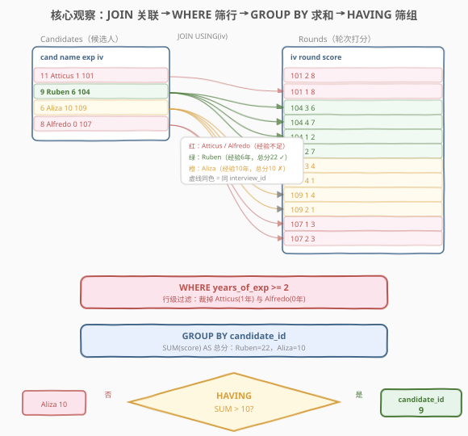
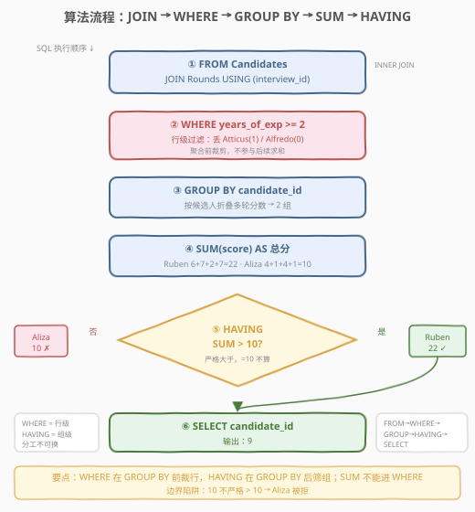
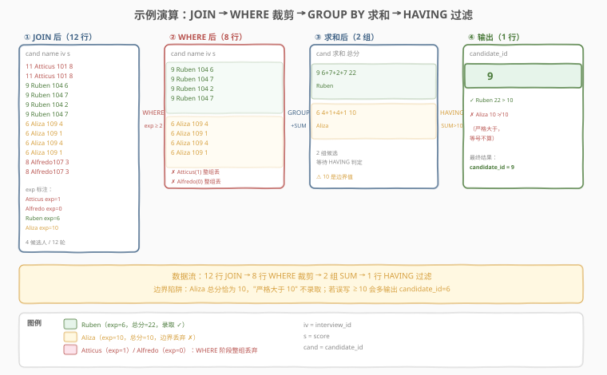

# 面试中被录取的候选人

- **题目名称**：面试中被录取的候选人
- **链接**：[2041. 面试中被录取的候选人 🔒](https://leetcode.cn/problems/accepted-candidates-from-the-interviews/)
- **难度**：中等
- **标签**：数据库、SQL、`JOIN`、`GROUP BY`、`SUM`、`HAVING`、`WHERE` 与 `HAVING` 分工、LeetCode 锁题

## 1. 题目概述

给定 `Candidates`（候选人名册）与 `Rounds`（面试轮次打分）两张表，编写 SQL 查询，找出**同时满足以下两个条件**的候选人的 `candidate_id`：

1. 工作经验**至少 2 年**（`years_of_exp >= 2`）。
2. 其面试所有轮次的分数之和**严格大于 10**（`SUM(score) > 10`）。

结果可按任意顺序返回，只需输出 `candidate_id` 列。

**表结构**：

```text
Table: Candidates
+---------------------+---------+
| Column Name         | Type    |
+---------------------+---------+
| candidate_id        | int     |  ← 主键
| name                | varchar |
| years_of_exp        | int     |
| interview_id        | int     |  → Rounds.interview_id
+---------------------+---------+
candidate_id 是该表主键。
每行包含一位候选人的编号、姓名、工作年限与其参加的面试编号。

Table: Rounds
+---------------+---------+
| Column Name   | Type    |
+---------------+---------+
| interview_id  | int     |  → Candidates.interview_id
| round_id      | int     |
| score         | int     |
+---------------+---------+
(interview_id, round_id) 是该表联合主键。
每行记录某场面试中某一轮的分数。
```

**输出列**：`candidate_id`。结果无顺序要求。

**示例 1**：

```text
输入：
Candidates 表:
+--------------+----------+-------------+--------------+
| candidate_id | name     | years_of_exp| interview_id |
+--------------+----------+-------------+--------------+
| 11           | Atticus  | 1           | 101          |
| 9            | Ruben    | 6           | 104          |
| 6            | Aliza    | 10          | 109          |
| 8            | Alfredo  | 0           | 107          |
+--------------+----------+-------------+--------------+

Rounds 表:
+--------------+----------+-------+
| interview_id | round_id | score |
+--------------+----------+-------+
| 109          | 3        | 4     |
| 101          | 2        | 8     |
| 109          | 4        | 1     |
| 107          | 1        | 3     |
| 104          | 3        | 6     |
| 109          | 1        | 4     |
| 104          | 4        | 7     |
| 104          | 1        | 2     |
| 109          | 2        | 1     |
| 104          | 2        | 7     |
| 107          | 2        | 3     |
| 101          | 1        | 8     |
+--------------+----------+-------+

输出：
+--------------+
| candidate_id |
+--------------+
| 9            |
+--------------+
```

**解释**：

| candidate_id | name | years_of_exp | interview_id | 各轮 score | 总分 $\sum$ | 经验 $\geq 2$? | 总分 $> 10$? | 录取? |
|--------------|------|--------------|--------------|-----------|------|----------------|--------------|-------|
| 11 | Atticus | 1 | 101 | 8, 8 | $16$ | ✗（1 < 2） | ✓ | ✗ 丢弃 |
| 9 | Ruben | 6 | 104 | 6, 7, 2, 7 | $22$ | ✓ | ✓ | ✓ **录取** |
| 6 | Aliza | 10 | 109 | 4, 1, 4, 1 | $10$ | ✓ | ✗（10 不严格 > 10） | ✗ 丢弃 |
| 8 | Alfredo | 0 | 107 | 3, 3 | $6$ | ✗（0 < 2） | ✗ | ✗ 丢弃 |

> 💡 本题是 SQL **"双条件分工：WHERE 过滤行 + HAVING 过滤组"招牌题**——核心三步：① `JOIN` 把 `Candidates` 与 `Rounds` 按 `interview_id` 关联；② `WHERE years_of_exp >= 2` 在聚合前剔除经验不足的候选人；③ `GROUP BY candidate_id` + `HAVING SUM(score) > 10` 在聚合后筛掉总分不达标的组。难点在于识别两个过滤条件分别作用于「行」和「组」，必须分别交给 `WHERE` 与 `HAVING`，且"严格大于"的边界（`=10` 不算）容易踩坑。

---

## 2. 解题思路

### 2.1 暴力思路：逐候选人枚举验证

最直觉的过程式思路：对每位候选人，先查其经验年限是否 $\geq 2$，再遍历 `Rounds` 表累加该面试的所有分数，判断总和是否 $> 10$。伪代码：

```text
result = []
for c in Candidates:
    if c.years_of_exp < 2:
        continue
    total = sum(r.score for r in Rounds if r.interview_id == c.interview_id)
    if total > 10:
        result.append(c.candidate_id)
```

逻辑正确，但 SQL 表达「逐行累加」最自然的方式是**分组聚合**——按 `candidate_id`（等价于按 `interview_id`，因每场面试唯一对应一位候选人）分组后 `SUM`。关键是两个过滤条件**作用层级不同**：经验年限是候选人级属性（每行相同，聚合前即可判），总分是聚合结果（必须 `SUM` 后才存在），这就需要 `WHERE` 与 `HAVING` 分工。

### 2.2 核心观察：JOIN 关联 + WHERE 筛行 + HAVING 筛组



**关键洞察**：`Rounds` 表的每行通过 `interview_id` **直接归属一场面试**，而每场面试又唯一对应一位候选人，因此：

1. **`JOIN`** 即可把候选人属性与轮次分数关联——`Candidates JOIN Rounds USING (interview_id)`。
2. **`WHERE years_of_exp >= 2`**：经验年限是**行级属性**（同一候选人的所有轮次行都有相同的 `years_of_exp`），在 `GROUP BY` 之前过滤即可，提前裁剪数据量。
3. **`GROUP BY candidate_id`**：把同一候选人的多轮分数折叠成一组。
4. **`HAVING SUM(score) > 10`**：总分是**聚合结果**，只能在 `GROUP BY` 之后用 `HAVING` 过滤。

> 💡 **为何用 `INNER JOIN` 而非 `LEFT JOIN`？** 题目要找总分 $> 10$ 的候选人。没有任何轮次的候选人 `SUM(score)` 为 `NULL`，`NULL > 10` 为 `UNKNOWN`（不满足），天然被排除。`INNER JOIN` 只保留有轮次的候选人，结果正确且更高效。若题目改为「列出所有候选人及其总分（无轮次记 0）」，才需 `LEFT JOIN` + `IFNULL(SUM, 0)`。

> ⚠️ **"严格大于"边界陷阱**：条件是 `SUM(score) > 10` 而非 `>= 10`。示例中 Aliza 总分恰好 $10$，**不**被录取。若误写 `>= 10` 会多输出 `candidate_id = 6`。面试中"严格大于 / 至少 / 不超过"等措辞要逐字抠。

> ⚠️ **`WHERE` vs `HAVING` 是本题核心考点**：`years_of_exp >= 2` 是行级条件（聚合前可判）→ `WHERE`；`SUM(score) > 10` 是聚合条件（依赖分组求和）→ `HAVING`。若把经验条件误写进 `HAVING` 也能跑通（因 `years_of_exp` 函数依赖于 `candidate_id`，每组取值唯一），但**语义上应在 `WHERE` 提前过滤**以减少参与分组的数据量；若把 `SUM` 条件误写进 `WHERE` 则直接报错。口诀：**筛行用 `WHERE`（聚合前），筛组用 `HAVING`（聚合后）**。

### 2.3 算法流程图



**逻辑执行步骤**：

| 步骤 | 子句 | 作用 |
|------|------|------|
| ① | `FROM Candidates JOIN Rounds USING (interview_id)` | 关联候选人与轮次分数（INNER JOIN，丢弃无轮次者） |
| ② | `WHERE years_of_exp >= 2` | 聚合前剔除经验不足的行（行级过滤） |
| ③ | `GROUP BY candidate_id` | 按候选人折叠轮次行 |
| ④ | `SUM(score)` | 每组分数求和 = 面试总分 |
| ⑤ | `HAVING SUM(score) > 10` | 聚合后过滤总分严格大于 10 的组（组级过滤） |
| ⑥ | `SELECT candidate_id` | 输出候选人编号 |

> 💡 **SQL 子句执行顺序**：`FROM`（含 `JOIN`/`ON`）→ `WHERE` → `GROUP BY` → `HAVING` → `SELECT` → `ORDER BY` → `LIMIT`。`WHERE` 在 `GROUP BY` 之前、`HAVING` 在 `GROUP BY` 之后——这正是「经验条件进 `WHERE`、总分条件进 `HAVING`」的根本原因。理解此顺序即可解释为何 `SUM` 不能写进 `WHERE`（执行 `WHERE` 时尚未分组，`SUM` 无从计算）。

### 2.4 示例演算

以示例 1 的 4 位候选人、12 轮打分为例，观察「JOIN → WHERE 裁剪 → GROUP BY 求和 → HAVING 过滤」的逐步过程：



**步骤 ①：JOIN（按 interview_id 关联）**

| candidate_id | name | years_of_exp | interview_id | round_id | score |
|--------------|------|--------------|--------------|----------|-------|
| 11 | Atticus | 1 | 101 | 2 | 8 |
| 11 | Atticus | 1 | 101 | 1 | 8 |
| 9 | Ruben | 6 | 104 | 3 | 6 |
| 9 | Ruben | 6 | 104 | 4 | 7 |
| 9 | Ruben | 6 | 104 | 1 | 2 |
| 9 | Ruben | 6 | 104 | 2 | 7 |
| 6 | Aliza | 10 | 109 | 3 | 4 |
| 6 | Aliza | 10 | 109 | 4 | 1 |
| 6 | Aliza | 10 | 109 | 1 | 4 |
| 6 | Aliza | 10 | 109 | 2 | 1 |
| 8 | Alfredo | 0 | 107 | 1 | 3 |
| 8 | Alfredo | 0 | 107 | 2 | 3 |

**步骤 ②：WHERE years_of_exp >= 2（裁掉 Atticus 与 Alfredo）**

| candidate_id | name | years_of_exp | interview_id | 保留的轮次 score |
|--------------|------|--------------|--------------|------------------|
| 9 | Ruben | 6 | 104 | 6, 7, 2, 7（4 行） |
| 6 | Aliza | 10 | 109 | 4, 1, 4, 1（4 行） |

> Atticus（1 年）与 Alfredo（0 年）的所有行在聚合前被整体丢弃。

**步骤 ③④：GROUP BY candidate_id + SUM(score)**

| candidate_id | name | 求和表达式 | 总分 |
|--------------|------|-----------|------|
| 9 | Ruben | $6 + 7 + 2 + 7$ | $22$ |
| 6 | Aliza | $4 + 1 + 4 + 1$ | $10$ |

**步骤 ⑤：HAVING SUM(score) > 10**

- Ruben $22 > 10$ → ✓ 录取
- Aliza $10 \not> 10$（严格大于，等号不算） → ✗ 丢弃

最终输出 1 行：`candidate_id = 9`，与示例一致。

> 💡 **Aliza 是本题的"边界陷阱"**：经验 10 年达标、总分恰好 10，却因"严格大于"被拒。这正提醒阅读题面措辞要精确——`> 10` 与 `>= 10` 在边界处差一人。

---

## 3. 参考代码

### SQL（解法 A：JOIN + WHERE + GROUP BY + HAVING，推荐）

```sql
SELECT candidate_id
FROM Candidates
JOIN Rounds USING (interview_id)
WHERE years_of_exp >= 2
GROUP BY candidate_id
HAVING SUM(score) > 10;
```

> 💡 **写法要点**：
> - **`JOIN ... USING (interview_id)`**：`interview_id` 两表同名，用 `USING` 比 `ON c.interview_id = r.interview_id` 更简洁（MySQL/PostgreSQL 支持）。等价于 `INNER JOIN`。
> - **`WHERE years_of_exp >= 2`**：行级过滤，在 `GROUP BY` 之前裁掉经验不足的候选人，**减少参与分组与求和的行数**。
> - **`GROUP BY candidate_id`**：按候选人分组。`candidate_id` 是主键，分组键唯一；`SELECT` 只输出 `candidate_id` 这一聚合键，无需额外 `GROUP BY` 其他列。
> - **`HAVING SUM(score) > 10`**：组级过滤，聚合后筛总分严格大于 10 的组。✓ **必须用 `HAVING`**，不可用 `WHERE`。
> - ✓ **最推荐**：一句搞定、`WHERE`/`HAVING` 分工清晰、标准 SQL 通用。

### SQL（解法 B：CTE 预聚合总分再过滤，职责分离）

```sql
WITH InterviewTotal AS (
    SELECT interview_id, SUM(score) AS total_score
    FROM Rounds
    GROUP BY interview_id
)
SELECT c.candidate_id
FROM Candidates c
JOIN InterviewTotal t ON c.interview_id = t.interview_id
WHERE c.years_of_exp >= 2
  AND t.total_score > 10;
```

> 💡 **解法 B 的思路**：先在 CTE 中按 `interview_id` 预聚合出每场面试的总分 `total_score`，再 `JOIN` 回 `Candidates`，把"总分 > 10"变成对**普通列** `t.total_score` 的 `WHERE` 过滤——此时无需 `HAVING`。
>
> **与解法 A 的关系**：逻辑等价。区别在于聚合的"粒度对象"——解法 A 按 `candidate_id` 分组（候选人视角），解法 B 按 `interview_id` 分组（面试视角）。因每场面试唯一对应一位候选人，两者等价；但解法 B 把"算总分"与"筛候选人"解耦，**层次更清晰**，适合后续复用 `InterviewTotal` 做更多分析（如算平均分、最高单轮分）。
>
> **可读性**：解法 A 更简洁；解法 B 分层更分明，复杂查询中更易维护。MySQL 8.0+ 支持 CTE。

### SQL（解法 C：相关子查询，对照思路）

```sql
SELECT candidate_id
FROM Candidates c
WHERE years_of_exp >= 2
  AND (SELECT SUM(score) FROM Rounds r
       WHERE r.interview_id = c.interview_id) > 10;
```

> 💡 **解法 C 的思路**：对每位候选人用相关子查询累加其面试总分，外层 `WHERE` 同时判经验与总分。无需 `JOIN`/`GROUP BY`，最贴近 2.1 节的暴力伪代码。
>
> **与解法 A/B 的对比**：
> - **NULL 安全性**：若某候选人无任何轮次，子查询 `SUM` 返回 `NULL`，`NULL > 10` 为 `UNKNOWN`（不满足），该候选人被正确排除——与 `INNER JOIN` 行为一致。
> - **性能**：相关子查询对每位候选人执行一次 `SUM`，最坏 $O(C \cdot R)$（$C$ 候选人数、$R$ 轮次数）；解法 A/B 用哈希连接 + 哈希分组为 $O(C + R)$。数据量大时解法 A/B 更优。
> - **何时用**：仅当需要"逐候选人视角"且数据量小时，或作为对照写法帮助理解。生产环境优先 A/B。

### Python（pandas）

```python
import pandas as pd

def accepted_candidates(candidates: pd.DataFrame, rounds: pd.DataFrame) -> pd.DataFrame:
    total = rounds.groupby('interview_id', as_index=False)['score'].sum()
    merged = candidates.merge(total, on='interview_id', how='inner')
    mask = (merged['years_of_exp'] >= 2) & (merged['score'] > 10)
    return merged.loc[mask, ['candidate_id']]
```

> 💡 **pandas 对照**：
> - `.groupby('interview_id')['score'].sum()`——对应 `GROUP BY interview_id` + `SUM(score)`（解法 B 的 CTE）。
> - `.merge(total, on='interview_id', how='inner')`——对应 `JOIN ... ON interview_id`（`INNER JOIN` 丢弃无轮次者）。
> - `(years_of_exp >= 2) & (score > 10)`——聚合后 `score` 已是普通列，两个条件同为行级布尔索引过滤，等价于解法 B 的 `WHERE`。pandas 中无 `HAVING` 概念，聚合结果即普通列。
> - 返回 `[['candidate_id']]` 对齐输出列要求。

---

## 4. 复杂度分析

| 维度 | 解法 A（HAVING） | 解法 B（CTE） | 解法 C（子查询） | pandas |
|------|-----------------|--------------|------------------|--------|
| **时间** | $O(C + R)$ | $O(C + R)$ | $O(C \cdot R)$（最坏） | $O(C + R)$ |
| **空间** | $O(C + R)$ | $O(C)$（CTE 物化） | $O(1)$（无中间表） | $O(C + R)$ |
| **扫表次数** | 各表 1 次 | 各表 1 次 | `Rounds` 最多 $C$ 次 | 各表 1 次 |
| **可读性** | ✓ 简洁 | ✓ 分层 | ✓ 逐候选人视角 | ✓ 清晰 |
| **推荐度** | ✓ **首选** | ✓ 复杂场景 | ✓ 对照/小数据 | ✓ 验证用 |

> - $C$ = `Candidates` 行数，$R$ = `Rounds` 行数。
> - **解法 A/B 时间复杂度**：`JOIN` 用哈希连接 $O(C + R)$，`GROUP BY` 哈希分组 $O(R)$，过滤 $O(C)$，总体线性。
> - **解法 C**：相关子查询对每位候选人独立扫一次 `Rounds`，最坏 $O(C \cdot R)$；若 `Rounds(interview_id)` 上有索引可降为 $O(C \cdot \log R)$，但仍劣于 A/B。
> - **空间**：解法 A 的连接中间表含 $R$ 行（每轮一行），分组后缩为 $C$ 行；解法 B 需额外物化 $C$ 行 `InterviewTotal`；解法 C 无中间表。
> - **索引优化**：在 `Rounds(interview_id)` 上建索引可加速 `JOIN`（嵌套循环连接走索引查找）；现代优化器通常用哈希连接，对索引依赖较小。

---

## 5. 扩展：WHERE 与 HAVING 的分工边界

### 5.1 本题两个条件为何分属不同子句

| 条件 | 表达式 | 作用对象 | 是否含聚合 | 应放子句 | 原因 |
|------|--------|----------|-----------|----------|------|
| 经验 ≥ 2 | `years_of_exp >= 2` | 候选人级（行级） | 否 | `WHERE` | 聚合前即可判定，提前裁剪 |
| 总分 > 10 | `SUM(score) > 10` | 面试级（组级） | 是 | `HAVING` | 依赖 `GROUP BY` 后的求和结果 |

> 💡 **判定口诀**：条件里**含聚合函数**（`SUM`/`COUNT`/`AVG`/`MAX`/`MIN`）→ 必须用 `HAVING`；**不含聚合**且为原始列比较 → 用 `WHERE`（更高效，提前过滤）。

### 5.2 经验条件写进 HAVING 也能跑通，为何仍推荐 WHERE？

`years_of_exp` 函数依赖于 `candidate_id`（主键），同一组内取值唯一，故 `HAVING years_of_exp >= 2` 语义上也正确：

```sql
SELECT candidate_id
FROM Candidates
JOIN Rounds USING (interview_id)
GROUP BY candidate_id
HAVING SUM(score) > 10 AND years_of_exp >= 2;   -- 可跑通但不推荐
```

但不推荐，原因有二：

1. **性能**：`WHERE` 在 `GROUP BY` 之前过滤，经验不足者的轮次行**不参与分组与求和**；`HAVING` 则先对所有候选人求和、再过滤，多做无用功。
2. **语义清晰度**：`WHERE` 表达"原始行级过滤"，`HAVING` 表达"分组聚合后过滤"——把行级条件放进 `HAVING` 混淆了职责分层。

> ⚠️ **MySQL 严格模式（`ONLY_FULL_GROUP_BY`）注意**：`HAVING years_of_exp >= 2` 中 `years_of_exp` 未聚合也未出现在 `GROUP BY` 中，严格模式下会报错（除非 `GROUP BY candidate_id, years_of_exp`）。而 `WHERE years_of_exp >= 2` 不受此限制。这也是推荐写 `WHERE` 的额外理由。

### 5.3 若题目改为"至少有 3 轮且平均分 > 3"

```sql
SELECT candidate_id
FROM Candidates
JOIN Rounds USING (interview_id)
WHERE years_of_exp >= 2
GROUP BY candidate_id
HAVING COUNT(round_id) >= 3 AND AVG(score) > 3;
```

> 💡 这里 `HAVING` 同时用 `COUNT`（轮数）和 `AVG`（平均分）两个聚合条件——两者都依赖分组结果，必须进 `HAVING`。经验条件仍在 `WHERE`。这展示了 `HAVING` 可叠加多个聚合谓词。

### 5.4 与"GROUP BY interview_id"的等价性

本题按 `candidate_id` 还是 `interview_id` 分组？两者等价，因为题目保证每场 `interview_id` 唯一对应一位 `candidate_id`（`Candidates` 中 `interview_id` 不重复）。若改为按 `interview_id` 分组：

```sql
SELECT c.candidate_id
FROM Candidates c
JOIN Rounds r ON c.interview_id = r.interview_id
WHERE c.years_of_exp >= 2
GROUP BY c.interview_id, c.candidate_id
HAVING SUM(r.score) > 10;
```

> 💡 仍需 `GROUP BY candidate_id` 以满足严格模式（`SELECT` 输出 `candidate_id`）。因 `candidate_id` 函数依赖于 `interview_id`，二者分组粒度一致。优先按 `SELECT` 输出的列 `candidate_id` 分组，更直观。

---

## 6. 面试要点

1. **`HAVING` 和 `WHERE` 有什么区别？本题两个条件分别放哪里？**

   > `WHERE` 在 `GROUP BY` 之前执行，过滤原始行，不能引用聚合函数；`HAVING` 在 `GROUP BY` 之后执行，过滤分组，可以引用聚合函数。本题经验条件 `years_of_exp >= 2` 是行级属性 → `WHERE`；总分条件 `SUM(score) > 10` 是聚合结果 → `HAVING`。若把 `SUM` 写进 `WHERE` 会报错（执行 `WHERE` 时尚未分组）。

2. **为什么用 `INNER JOIN` 而不是 `LEFT JOIN`？**

   > 题目要找总分 $> 10$ 的候选人。无任何轮次的候选人 `SUM(score)` 为 `NULL`，`NULL > 10` 为 `UNKNOWN`（不满足），天然被排除。`INNER JOIN` 只保留有轮次的候选人，结果正确且更高效。若改为"列出所有候选人总分（无轮次记 0）"，才需 `LEFT JOIN` + `IFNULL(SUM, 0)`。

3. **"严格大于 10"和"大于等于 10"在本题有何差别？**

   > 示例中 Aliza 总分恰好 $10$。"严格大于"（`> 10`）不录取她，"大于等于"（`>= 10`）会录取。本题用 `> 10`，故 Aliza 被拒、只输出 Ruben。面试中"严格大于 / 至少 / 不超过 / 不多于"等措辞必须逐字抠，边界值往往是出题人故意设的陷阱。

4. **经验条件写进 `HAVING` 也能跑通，为何仍推荐 `WHERE`？**

   > 两个原因：① **性能**——`WHERE` 在分组前裁掉经验不足者的所有轮次行，不参与求和；`HAVING` 先全部求和再过滤，多做无用功。② **语义**——`WHERE` 表达行级过滤、`HAVING` 表达组级过滤，行级条件放 `HAVING` 混淆职责。此外 MySQL 严格模式 `ONLY_FULL_GROUP_BY` 下 `HAVING years_of_exp >= 2`（未 `GROUP BY` 该列）会报错，而 `WHERE` 不受限。

5. **解法 B（CTE 预聚合）相比解法 A 有何优势？**

   > 解法 B 把"按面试算总分"与"按候选人筛条件"解耦——CTE `InterviewTotal` 可被复用做更多分析（平均分、最高单轮分等）。当行级表达式复杂或需多步聚合时，CTE 分层更易维护。但单看本题，解法 A 一句搞定更简洁。两者逻辑等价，复杂度相同。

> 💡 **一句话总结**：2041 是 SQL **"WHERE 与 HAVING 分工"招牌题**——核心模板「`Candidates JOIN Rounds USING (interview_id)` → `WHERE years_of_exp >= 2`（行级）→ `GROUP BY candidate_id` → `HAVING SUM(score) > 10`（组级）」。最大要点：**行级条件进 `WHERE` 提前裁剪、聚合条件进 `HAVING` 组后过滤；`INNER JOIN` 足矣（无轮次者 `SUM` 为 `NULL` 天然排除）；"严格大于"边界要抠字眼（$=10$ 不算）**。

---

## 7. 同类练习题

- [1587. 银行账户概要 II](https://leetcode.cn/problems/bank-account-summary-ii/)（[题解](../1501-1600/1587_银行账户概要II.md)）：`JOIN` + `GROUP BY` + `HAVING SUM > 阈值`，同为"聚合后过滤"骨架（2041 多了行级 `WHERE` 分工）
- [1511. 消费者下单频率](https://leetcode.cn/problems/customer-order-frequency/)（[题解](../1501-1600/1511_消费者下单频率.md)）：`WHERE`（行级日期）+ `HAVING`（组级 `SUM`）同时使用，2041 的进阶——多表 JOIN + 双条件分工
- [570. 至少有 5 名直接下属的经理](https://leetcode.cn/problems/managers-with-at-least-5-direct-reports/)：`JOIN` + `GROUP BY` + `HAVING COUNT(*) >= 5`，同为"聚合后过滤"骨架（2041 是 `SUM`，570 是 `COUNT`）
- [1045. 买下所有产品的客户](https://leetcode.cn/problems/customers-who-bought-all-the-products/) 🔒：`GROUP BY` + `HAVING COUNT(DISTINCT) = 全部产品数`，巩固 `HAVING` 配合聚合计数过滤
- [1070. 产品销售分析 III](https://leetcode.cn/problems/product-sales-analysis-iii/)：`GROUP BY` + `HAVING` 取每组满足条件的行，巩固"分组后过滤"范式
