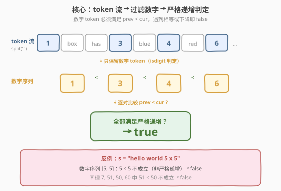
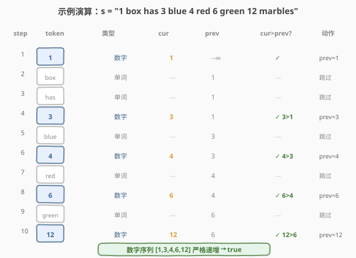

# 检查句子中的数字是否递增

- **题目名称**：检查句子中的数字是否递增
- **链接**：[2042. 检查句子中的数字是否递增](https://leetcode.cn/problems/check-if-numbers-are-ascending-in-a-sentence/)
- **难度**：简单
- **标签**：字符串、模拟、单次遍历

## 1. 题目概述

给定一个表示句子的字符串 `s`。句子由若干 **token** 组成，token 之间用**单个**空格分隔，**没有前导或尾随空格**。每个 token 要么是一个由数字 `0-9` 组成且**不含前导零**的正整数，要么是一个由小写英文字母组成的单词。

要求检查 `s` 中的**全部数字**是否从左到右**严格递增**（即除了最后一个数字外，每个数字都严格小于它右侧的数字）。满足返回 `true`，否则返回 `false`。

> 💡 **关键约束**：题目保证每个数字 token 都是**无前导零的正整数**且**小于 100**，因此首字符即能判定 token 类型（`isdigit` 即可），无需复杂的合法性校验。

**示例 1**：

```text
输入：s = "1 box has 3 blue 4 red 6 green and 12 yellow marbles"
输出：true
解释：句子中的数字依次为 1, 3, 4, 6, 12，严格递增 1 < 3 < 4 < 6 < 12。
```

**示例 2**：

```text
输入：s = "hello world 5 x 5"
输出：false
解释：数字为 5, 5，不满足严格递增（5 不小于 5）。
```

**示例 3**：

```text
输入：s = "sunset is at 7 51 pm overnight lows will be in the low 50 and 60 s"
输出：false
解释：数字为 7, 51, 50, 60，其中 51 不小于 50，不满足严格递增。
```

**示例 4**：

```text
输入：s = "4 5 11 26"
输出：true
解释：数字为 4, 5, 11, 26，严格递增。
```

**约束条件**：

- $3 \le \text{s.length} \le 200$
- `s` 由小写英文字母、空格和数字 `0`-`9` 组成
- `s` 中数字 token 的数目在 $2$ 到 $100$ 之间（含两端）
- `s` 中 token 之间由单个空格分隔
- `s` 中至少有两个数字
- `s` 中每个数字都是小于 $100$ 的正数，且不含前导零
- `s` 不含前导或尾随空格

---

## 2. 解题思路

### 2.1 暴力思路：两遍扫描

最直观的做法是先**第一遍**遍历所有 token，把数字 token 全部挑出来存进一个列表 `nums`；**第二遍**再遍历 `nums`，检查是否严格递增（`nums[i] <= nums[i-1]` 即返回 `false`）。

这种做法正确但多用了一个 $O(k)$ 的辅助数组（$k$ 为数字个数）。事实上，"过滤数字"与"判定递增"两件事可以在**同一次遍历**中合并完成——只要维护一个变量 `prev` 记录"上一个见到的数字"即可。

### 2.2 核心观察：单次遍历 + 滚动前驱



关键观察：

1. **数字判定 O(1)**：题目保证数字 token 无前导零且只含 `0-9`，单词 token 只含小写字母——两类字符**互不相交**，因此只需看 token 的**首字符**是否为数字即可区分（`token[0].isdigit()`）。
2. **递增判定只需前驱**：严格递增的判定本质是"每个数字严格大于上一个数字"，无需访问整个数组，只要保留 `prev`（上一个数字）即可。遇到新数字 `cur` 时：
   - 若 `cur > prev`：更新 `prev = cur`，继续；
   - 否则：立即返回 `false`。
3. **哨兵简化首元素处理**：把 `prev` 初始化为 $-1$（或 $-\infty$）。由于题目保证所有数字都是正整数（$\ge 1$），首个数字一定 `> -1`，无需对"第一个数字"做特殊判断。

> 💡 **为什么可以用 `prev = -1`？** 题目明确"每个数字都是小于 100 的正数"，正数 $\ge 1$，故 $-1$ 是一个安全的下界哨兵，使首个数字的比较天然成立，避免 `if prev is None` 的分支。

### 2.3 算法流程


1. 用 `split(' ')` 将句子切成 token 列表（题目保证单空格分隔、无前后空格，可直接 split）。
2. 初始化 `prev = -1`（哨兵）。
3. 遍历每个 `token`：
   - 若 `token[0]` 不是数字（是字母）：**跳过**；
   - 否则解析 `cur = int(token)`：
     - 若 `cur > prev`：`prev = cur`，继续；
     - 否则：`return false`。
4. 遍历结束未返回 `false`，则 `return true`。

> ⚠️ **注意"严格"二字**：题目要求严格递增（`<` 而非 `<=`），相等也算 `false`，如示例 2 的 `5, 5`。代码中判条件必须用 `cur > prev`（不能取等）。

### 2.4 示例演算

以 `s = "1 box has 3 blue 4 red 6 green 12 marbles"` 为例，初始 `prev = -1`：



| 步骤 | token | 类型 | cur | prev | cur > prev? | 动作 |
|------|-------|------|-----|------|------------|------|
| 1 | `1`    | 数字 | 1  | −1 | ✓ 1 > −1  | prev = 1 |
| 2 | `box`  | 单词 | —  | 1  | —         | 跳过 |
| 3 | `has`  | 单词 | —  | 1  | —         | 跳过 |
| 4 | `3`    | 数字 | 3  | 1  | ✓ 3 > 1   | prev = 3 |
| 5 | `blue` | 单词 | —  | 3  | —         | 跳过 |
| 6 | `4`    | 数字 | 4  | 3  | ✓ 4 > 3   | prev = 4 |
| 7 | `red`  | 单词 | —  | 4  | —         | 跳过 |
| 8 | `6`    | 数字 | 6  | 4  | ✓ 6 > 4   | prev = 6 |
| 9 | `green`| 单词 | —  | 6  | —         | 跳过 |
| 10 | `12`  | 数字 | 12 | 6  | ✓ 12 > 6  | prev = 12 |

最终数字序列 `[1, 3, 4, 6, 12]` 严格递增，返回 `true`。

---

## 3. 参考代码

### C++

```cpp
class Solution {
  public:
    bool areNumbersAscending(string s) {
        stringstream ss(s);
        string token;
        int prev = -1;
        while (ss >> token) {
            if (isdigit(token[0])) {
                int cur = stoi(token);
                if (cur <= prev) return false;
                prev = cur;
            }
        }
        return true;
    }
};
```

### Python

```python
class Solution:
    def areNumbersAscending(self, s: str) -> bool:
        prev = -1
        for token in s.split(' '):
            if token[0].isdigit():
                cur = int(token)
                if cur <= prev:
                    return False
                prev = cur
        return True
```

> 💡 C++ 用 `stringstream >> token` 自动按空白切分；Python 用 `s.split(' ')`（题目保证单空格，也可用 `s.split()` 更稳妥）。两者都只看 `token[0]` 判定类型，常数极小。

---

## 4. 复杂度分析

| 维度 | 复杂度 | 说明 |
|------|--------|------|
| 时间复杂度 | $O(n)$ | 一次遍历，每个 token 解析为整数 $O(|token|)$，总字符数 $n = |\text{s}| \le 200$ |
| 空间复杂度 | $O(n)$ 或 $O(1)$ | C++ `stringstream` / Python `split` 会产生 token 数组 $O(n)$；若改用手动扫描可降到 $O(1)$ |

> 💡 本题 $n \le 200$ 极小，任何合理实现都能通过。空间开销主要来自 `split` 产生的 token 列表；若面试要求 $O(1)$ 额外空间，可手动维护一个指针在原字符串上扫描，边走边积累当前 token 的字符，命中空格即处理上一个 token。

---

## 5. 扩展：手动双指针做到 $O(1)$ 空间

若要求**原地**扫描、不分配 token 数组，可用双指针 `[i, j)` 标记当前 token 区间：

```cpp
class Solution {
  public:
    bool areNumbersAscending(string s) {
        int prev = -1, n = s.size(), i = 0;
        while (i < n) {
            int j = i;
            while (j < n && s[j] != ' ') j++;      // [i, j) 为一个 token
            if (isdigit(s[i])) {
                int cur = 0;
                for (int k = i; k < j; ++k) cur = cur * 10 + (s[k] - '0');
                if (cur <= prev) return false;
                prev = cur;
            }
            i = j + 1;                              // 跳过空格
        }
        return true;
    }
};
```

| 维度 | 复杂度 | 说明 |
|------|--------|------|
| 时间复杂度 | $O(n)$ | 每个字符访问常数次 |
| 空间复杂度 | $O(1)$ | 仅用 `prev`、`i`、`j` 等几个整型变量 |

> 💡 手动解析整数时利用了"数字无前导零"的约束，从高位向低位 `cur = cur * 10 + d` 累加即可，无需 `stoi` 的额外开销。这是嵌入式 / 系统编程中常见的"零分配字符串解析"范式。

---

## 6. 面试要点

1. **如何区分数字 token 和单词 token？需要遍历整个 token 吗？**

   - 不需要。题目保证数字 token 只含 `0-9` 且无前导零，单词 token 只含小写字母，两类字符集不相交。因此只看 token 的**首字符**是否为数字（`isdigit(token[0])`）即可判定，$O(1)$ 时间。

2. **"严格递增"和"非降"的区别在代码里如何体现？**

   - 严格递增要求 `cur > prev`（不允许相等）；非降（递增非减）允许 `cur >= prev`。代码中的判定条件 `cur <= prev` 返回 `false` 等价于"必须严格大于才继续"。若误写成 `cur < prev` 才返回 `false`，就会把相等情况（如示例 2 的 `5, 5`）错误判为 `true`。

3. **为什么用 `prev = -1` 作为哨兵？可以用 0 吗？**

   - 题目保证数字都是正整数（$\ge 1$），所以 $-1$ 是安全的下界。**不能**用 `0`——若有数字 `0` 出现会被错误判为"不大于 prev"。虽然本题约束数字为正数（不存在 0），但选 $-1$ 更鲁棒，能兼容"非负整数"场景。

4. **题目约束对解法有什么帮助？哪些是陷阱？**

   - 帮助：①单空格分隔、无前后空格 → 可直接 `split`；②数字无前导零 → 首字符即可判类型、手动解析无需去前导零；③数字 $\le 99$ → 不涉及大数、`int` 完全够用。陷阱：①"严格"二字易被忽略，写成 `<=` 判定导致相等被放过；②数字 token 数量 $\ge 2$ 保证至少比较一次，但代码仍应处理"少于 2 个数字"的退化情况以防约束变化。

5. **如果允许数字带前导零（如 `"01"`），你的判定还成立吗？**

   - 类型判定仍成立（首字符仍是数字），但 `int("01")` 会解析为 `1`，可能造成 `"01"` 与 `"1"` 被视为相等从而返回 `false`——这取决于题意是否把前导零视为"不同数字"。若题目改成"按字符串字典序严格递增"，则需直接比较 token 字符串而非数值，解法分支会不同。这是面试官常追问的边界变体。

---

## 7. 同类练习题

- [1859. 将句子排序](https://leetcode.cn/problems/sorting-the-sentence/)：同为"按空格切分 token + 解析尾部数字"的字符串模拟，本题判递增、彼题用数字还原原序
- [2047. 句子中的有效单词数](https://leetcode.cn/problems/number-of-valid-words-in-a-sentence/)：同 token 切分范式，但每个 token 需做更复杂的合法性校验（连字符/标点规则），可作为本题"判类型"逻辑的扩展练习
- [2114. 句子中的最多单词数](https://leetcode.cn/problems/maximum-number-of-words-found-in-sentences/)：句子切分 + 统计 token 数取最大，同为 split 模拟家族
- [819. 最常见的单词](https://leetcode.cn/problems/most-common-word/)：句子切分 + 词频统计 + 排除禁用词，token 流处理的进阶版（含标点清理）
- [1805. 字符串中不同整数的数目](https://leetcode.cn/problems/number-of-different-integers-in-string/)：在字符串中识别数字子串并去重计数，与本题"识别数字 token"的判定逻辑同源，但需处理大数（字符串比较）
