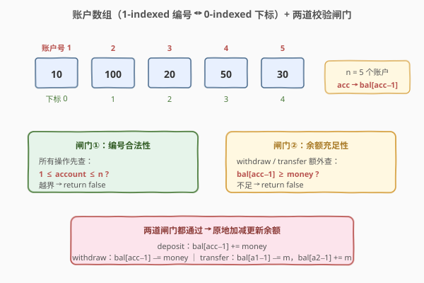
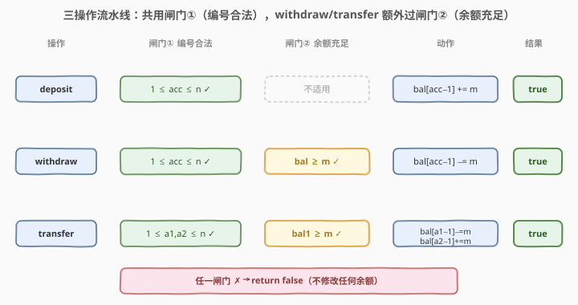
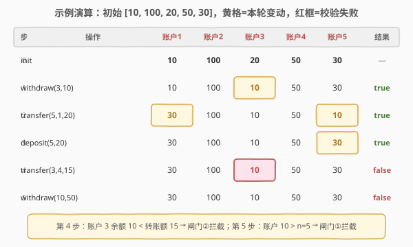

# LeetCode 简易银行系统 题解

## 1. 题目概述

- **标题 / 题号**：简易银行系统（#2043，medium）
- **链接**：https://leetcode.cn/problems/simple-bank-system/
- **难度**：中等
- **标签**：设计、数组、模拟

**题意**：为一个有 `n` 个账户的银行设计程序，自动化执行**转账、存款、取款**三类交易。账户编号从 `1` 到 `n`，初始余额存放在下标从 **0** 开始的数组 `balance` 中，第 `(i+1)` 个账户的初始余额是 `balance[i]`。

只有满足以下**全部条件**的交易才视为**有效**，需执行并返回 `true`；否则不修改任何余额，返回 `false`：

- 指定账户编号在 `1` 到 `n` 之间；
- 取款或转账所需金额 **小于或等于** 账户余额。

要求实现 `Bank` 类：

- `Bank(vector<long long>& balance)`：用 `balance` 初始化对象。
- `bool transfer(int account1, int account2, long long money)`：从 `account1` 向 `account2` 转账 `money`。
- `bool deposit(int account, long long money)`：向 `account` 存款 `money`。
- `bool withdraw(int account, long long money)`：从 `account` 取款 `money`。

**示例**：

```text
输入：
["Bank", "withdraw", "transfer", "deposit", "transfer", "withdraw"]
[[[10, 100, 20, 50, 30]], [3, 10], [5, 1, 20], [5, 20], [3, 4, 15], [10, 50]]
输出：
[null, true, true, true, false, false]

解释：
Bank bank = new Bank([10, 100, 20, 50, 30]);   // n = 5
bank.withdraw(3, 10);     // true，账户 3：20 → 10
bank.transfer(5, 1, 20);  // true，账户 5：30 → 10，账户 1：10 → 30
bank.deposit(5, 20);      // true，账户 5：10 → 30
bank.transfer(3, 4, 15);  // false，账户 3 当前余额 10 < 15，闸门②拦截
bank.withdraw(10, 50);    // false，账户 10 不存在（n=5），闸门①拦截
```

**约束**：

- $n = \text{balance.length}$
- $1 \le n \le 10^5$
- $1 \le \text{account},\, \text{account1},\, \text{account2} \le 10^5$
- $0 \le \text{balance}[i],\, \text{money} \le 10^{12}$
- `transfer` / `deposit` / `withdraw` 每个最多调用 $10^4$ 次

> 💡 **审题关键**：① 账户**编号从 1 开始**，而 `balance` 数组**下标从 0 开始**——访问账户 `acc` 的余额要用 `balance[acc - 1]`；② 余额和金额高达 $10^{12}$，必须用 64 位整数（`long long` / `long`），`int` 会溢出；③ 交易**失败时不修改任何状态**（不能「先扣后补」），故校验必须**先于**更新完成；④ `deposit` 只需校验编号合法性，`withdraw` / `transfer` 才需额外校验余额充足性。

## 2. 解题思路

### 2.1 暴力思路：每次操作遍历查找账户

把 `(账户号, 余额)` 存成无序列表或哈希表，每次操作先遍历查找对应账户再校验、更新。

- **正确性**：正确，但完全没必要。
- **效率**：账户号是 $1$ 到 $n$ 的**连续整数**，天然可作数组下标，直接 $O(1)$ 寻址，无需任何查找结构。

> ⚠️ 本题的「暴力」其实是**选错数据结构**：用哈希表存连续整数键是浪费。连续整数编号 + 高频读写 = 数组直接寻址的最佳场景。

### 2.2 核心观察：数组直接寻址 + 两道校验闸门



**核心转换**分两步：

**第一步：把账户号直接映射成数组下标。** 账户编号 $1 \dots n$ 是连续整数，余额数组 `balance` 下标 $0 \dots n-1$ 一一对应。访问账户 `acc` 的余额 = `balance[acc - 1]`，**一次寻址 $O(1)$**，无需哈希、无需查找。

**第二步：用「两道闸门」统一三类操作的校验逻辑。** 所有操作都要过**闸门①（编号合法）**；`withdraw` / `transfer` 额外过**闸门②（余额充足）**。两道闸门都通过才更新余额，否则立即返回 `false` 且**不修改任何账户**。

| 闸门 | 判定 | 适用操作 | 失败后果 |
|------|------|----------|----------|
| ① 编号合法 | $1 \le \text{account} \le n$ | 全部三类 | `return false` |
| ② 余额充足 | $\text{bal}[\text{acc}-1] \ge \text{money}$ | `withdraw` / `transfer` | `return false` |

> 💡 **为什么「先校验后更新」是必须的？** `transfer` 涉及两个账户：先扣 `account1` 再加 `account2`。若先扣后发现 `account2` 不存在，就必须「回滚」`account1` 的扣减——既繁琐又易错。正确做法是**先完成全部校验（`account1`、`account2` 编号都合法 + `account1` 余额充足），再一次性更新两个账户**，保证失败时状态零变更。

### 2.3 算法流程图



三类操作的流水线对照（横向为执行顺序）：

- **`deposit(acc, money)`**：闸门① → 动作 `bal[acc-1] += money` → `true`（无需闸门②，存款不消耗余额）。
- **`withdraw(acc, money)`**：闸门① → 闸门② → 动作 `bal[acc-1] -= money` → `true`。
- **`transfer(a1, a2, money)`**：闸门①（同时校验 `a1`、`a2`）→ 闸门②（校验 `a1` 余额）→ 动作 `bal[a1-1] -= money` 且 `bal[a2-1] += money` → `true`。

任一闸门不通过，立即 `return false`，**不触碰任何余额**。

> ⚠️ **`transfer` 的闸门①要校验两个账户**：`account2` 也可能越界（如示例第 5 步 `withdraw(10, 50)` 中账户 10 超出 $n=5$）。若只校验 `account1` 而漏掉 `account2`，会在写入 `bal[account2-1]` 时越界访问数组，导致未定义行为。

### 2.4 示例演算



按题目示例逐步演算（初始 `balance = [10, 100, 20, 50, 30]`，$n=5$）：

| 步 | 操作 | 账户1 | 账户2 | 账户3 | 账户4 | 账户5 | 结果 |
|----|------|-------|-------|-------|-------|-------|------|
| 0 | `init` | 10 | 100 | 20 | 50 | 30 | — |
| 1 | `withdraw(3, 10)` | 10 | 100 | **10** | 50 | 30 | true |
| 2 | `transfer(5, 1, 20)` | **30** | 100 | 10 | 50 | **10** | true |
| 3 | `deposit(5, 20)` | 30 | 100 | 10 | 50 | **30** | true |
| 4 | `transfer(3, 4, 15)` | 30 | 100 | 10 | 50 | 30 | **false** |
| 5 | `withdraw(10, 50)` | 30 | 100 | 10 | 50 | 30 | **false** |

> 💡 **关键看第 4、5 步的拦截**：第 4 步 `transfer(3, 4, 15)`，账户 3 当前余额仅 10，闸门②判定 $10 < 15$ 拦截，余额原样不动；第 5 步 `withdraw(10, 50)`，账户号 10 超出 $n=5$，闸门①拦截。两步都**先校验后判定**，从不修改状态，体现「失败即零变更」的设计契约。

## 3. 参考代码

### C++

```cpp
class Bank {
    vector<long long> bal;          // bal[acc-1] = 账户 acc 的余额
    int n;
public:
    Bank(vector<long long>& balance) {
        bal = balance;              // 拷贝一份，避免外部修改污染内部状态
        n = (int)bal.size();
    }

    bool transfer(int account1, int account2, long long money) {
        if (account1 < 1 || account1 > n || account2 < 1 || account2 > n)
            return false;                                   // 闸门①：两个账户都要合法
        if (bal[account1 - 1] < money)
            return false;                                   // 闸门②：转出方余额充足
        bal[account1 - 1] -= money;
        bal[account2 - 1] += money;
        return true;
    }

    bool deposit(int account, long long money) {
        if (account < 1 || account > n)
            return false;                                   // 闸门①：编号合法
        bal[account - 1] += money;
        return true;                                        // deposit 无需闸门②
    }

    bool withdraw(int account, long long money) {
        if (account < 1 || account > n)
            return false;                                   // 闸门①：编号合法
        if (bal[account - 1] < money)
            return false;                                   // 闸门②：余额充足
        bal[account - 1] -= money;
        return true;
    }
};
```

### Python

```python
class Bank:
    def __init__(self, balance: List[int]):
        self.bal = list(balance)        # 拷贝一份，避免外部修改污染内部状态
        self.n = len(self.bal)

    def transfer(self, account1: int, account2: int, money: int) -> bool:
        if not (1 <= account1 <= self.n and 1 <= account2 <= self.n):
            return False                                   # 闸门①：两个账户都要合法
        if self.bal[account1 - 1] < money:
            return False                                   # 闸门②：转出方余额充足
        self.bal[account1 - 1] -= money
        self.bal[account2 - 1] += money
        return True

    def deposit(self, account: int, money: int) -> bool:
        if not (1 <= account <= self.n):
            return False                                   # 闸门①：编号合法
        self.bal[account - 1] += money
        return True                                        # deposit 无需闸门②

    def withdraw(self, account: int, money: int) -> bool:
        if not (1 <= account <= self.n):
            return False                                   # 闸门①：编号合法
        if self.bal[account - 1] < money:
            return False                                   # 闸门②：余额充足
        self.bal[account - 1] -= money
        return True
```

> ⚠️ **构造函数务必拷贝 `balance`**：C++ 用 `bal = balance`（`vector` 逐元素拷贝）、Python 用 `list(balance)`。若直接保存外部引用（`self.bal = balance`），调用方在外部修改原数组会穿透到 `Bank` 内部，破坏封装。力扣判题框架通常不会这么做，但工程实践中拷贝是好习惯。
>
> ⚠️ **Python 的整数天然任意精度**，无溢出顾虑；C++ 必须用 `long long`（64 位）。`balance[i]` 和 `money` 都可达 $10^{12}$，转账后单个账户余额理论上可达 $2 \times 10^{12}$，仍在 `long long`（约 $9.2 \times 10^{18}$）安全范围内。

## 4. 复杂度分析

| 维度 | 复杂度 | 说明 |
|------|--------|------|
| 构造 | $O(n)$ | 拷贝 `balance` 数组，$n$ 为账户数 |
| `transfer` 时间 | $O(1)$ | 两次边界判定 + 一次余额比较 + 两次数组加减 |
| `deposit` 时间 | $O(1)$ | 一次边界判定 + 一次数组加 |
| `withdraw` 时间 | $O(1)$ | 一次边界判定 + 一次余额比较 + 一次数组减 |
| 空间 | $O(n)$ | 仅存长度为 $n$ 的余额数组，无额外结构 |

> 💡 本题复杂度已是最优：每个操作仅常数次数组访问与比较，无法再降。账户编号连续是 $O(1)$ 寻址的前提；若编号稀疏（如任意 64 位整数），则需改用哈希表，单次操作退化为 $O(1)$ 均摊但常数更大。

## 5. 扩展：并发安全与事务性（可选）

本题是单线程串行调用的简化模型。真实银行系统需额外考虑：

- **并发安全**：多线程同时 `transfer` 时，`读-改-写` 三步之间可能被插入，导致丢更新。需对每个账户加锁（细粒度）或用 CAS 原子操作。注意 `transfer` 同时操作两个账户，加锁顺序需全局一致（如按账户号升序），避免死锁。
- **事务原子性**：`bal[a1-1] -= money` 与 `bal[a2-1] += money` 必须原子完成。若中间崩溃，需 WAL（预写日志）+ 回放恢复。本题「先校验后更新」的契约是事务正确性的雏形——校验全部通过才允许任何写入。
- **持久化**：余额应落库（如关系型数据库的账户表），用 `UPDATE ... WHERE balance >= money` 一条 SQL 借助行锁完成「校验 + 扣减」原子化。

> 💡 题面「自动化执行所有传入的交易」正是现实清算系统的缩影：把校验逻辑下沉到数据结构内部，对外只暴露「成功/失败」的布尔语义。对照 [1555. 银行账户概要](../1501-1600/1555_银行账户概要.md) 的 SQL 视角，可看到同一业务在应用层与数据层的不同实现。

## 6. 面试要点

1. **为什么用数组而不是哈希表存账户？**

   - 账户编号是 $1$ 到 $n$ 的**连续整数**，天然作为数组下标。数组寻址 $O(1)$ 且常数远小于哈希（无哈希函数、无冲突、缓存友好）。哈希表只在键稀疏或不连续时才划算。

2. **`transfer` 为什么要同时校验 `account2` 的编号？**

   - `transfer` 末尾要写 `bal[account2 - 1] += money`。若 `account2` 越界，这一步会数组越界（C++ 未定义行为，Python 抛 `IndexError`）。闸门①必须**同时**校验两个账户，任一越界即 `return false`，绝不能进入写阶段。

3. **为什么必须「先校验后更新」，不能边校验边更新？**

   - `transfer` 涉及两次写入。若先扣 `account1`、再加 `account2` 时才发现 `account2` 越界，已扣的钱无处安放，需回滚 `account1`——既繁琐又易错。**先完成全部校验再一次性更新**，保证失败时状态零变更，是事务正确性的基本要求。

4. **余额上限 $10^{12}$，C++ 用 `int` 会怎样？**

   - `int` 通常 32 位，上限约 $2.1 \times 10^9$，$10^{12}$ 直接溢出。且转账后余额可能达 $2 \times 10^{12}$。必须用 `long long`（64 位，上限约 $9.2 \times 10^{18}$）。Python 整数任意精度，无需担心。

5. **构造函数为什么要拷贝 `balance` 而不是直接引用？**

   - 直接保存外部引用会让外部修改穿透到 `Bank` 内部，破坏封装与一致性。拷贝一份使 `Bank` 拥有独立状态，是面向对象封装的基本实践。力扣用例通常不会外部修改，但工程代码应养成拷贝习惯。

## 同类练习题

| # | 题目 | 与本题的关联 |
|---|------|-------------|
| 1555 | [银行账户概要](https://leetcode.cn/problems/bank-account-summary-ii/) | 同一银行业务的 SQL 视角，用 `UNION ALL` + 分组求和统计余额，对照本题应用层数组实现（[题解](../1501-1600/1555_银行账户概要.md)） |
| 146 | [LRU 缓存](https://leetcode.cn/problems/lru-cache/) | 哈希 + 双向链表的设计题招牌，对比本题「数组直接寻址」的选型差异（[题解](../0001-0100/146_LRU缓存.md)） |
| 729 | [我的日程安排表 I](https://leetcode.cn/problems/my-calendar-i/) | 设计类题目，用有序结构维护区间，对比本题「连续编号 → 数组」的简单场景 |
| 981 | [基于时间的键值存储](https://leetcode.cn/problems/time-based-key-value-store/) | HashMap + 有序数组二分的设计，对比本题无需查找的 $O(1)$ 寻址（[题解](../0901-1000/981_基于时间的键值存储.md)） |
| 1396 | [设计 Underground 系统](https://leetcode.cn/problems/design-underground-system/) | 多哈希表协作的设计题，对比本题单一数组的极简结构 |
