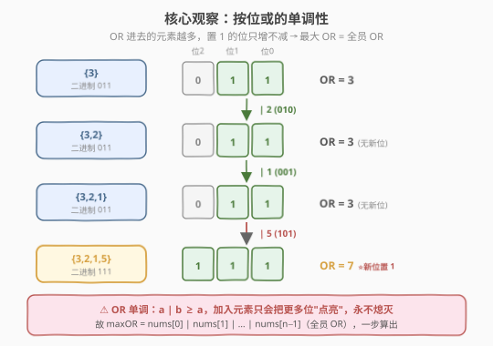
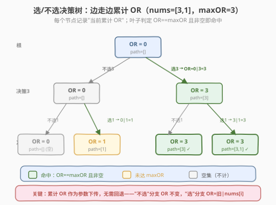

# LeetCode 统计按位或能得到最大值的子集数目 题解

## 1. 题目概述

- **标题 / 题号**：统计按位或能得到最大值的子集数目（#2044，medium）
- **链接**：https://leetcode.cn/problems/count-number-of-maximum-bitwise-or-subsets/
- **难度**：中等
- **标签**：位运算、数组、回溯

**题意**：给定一个整数数组 `nums`，对它的每个**非空子集**求"子集内所有元素按位或"的值。设所有子集能得到的最大 OR 值为 `maxOR`，返回**能达到 `maxOR` 的非空子集数目**。

> **按位或的定义**：对子集 $S$，$\text{OR}(S) = s_1 \lor s_2 \lor \dots \lor s_k$（逐位取或，任一为 1 即得 1）。

**示例 1**：

```text
输入：nums = [3,1]
输出：2
解释：非空子集的 OR 值：
- {3}   → 3
- {1}   → 1
- {3,1} → 3 | 1 = 3
最大 OR = 3，有 {3} 与 {3,1} 两个子集达到，答案 2。
```

**示例 2**：

```text
输入：nums = [2,2,2]
输出：7
解释：所有元素都是 2（二进制 010），任意非空子集的 OR 都是 2。
非空子集共 2³−1 = 7 个，全部命中，答案 7。
```

**示例 3**：

```text
输入：nums = [3,2,1,5]
输出：6
解释：全员 OR = 3|2|1|5 = 7 = maxOR。
6 个子集达到 7：{3,5}、{2,5}、{3,2,5}、{3,1,5}、{2,1,5}、{3,2,1,5}。
```

**约束**：

- `1 <= nums.length <= 16`
- `1 <= nums[i] <= 10^5`

> 💡 `n ≤ 16` 是关键信号——$2^{16} = 65536$，子集总数在可枚举范围内。本题是「子集枚举 + 位运算」的招牌题，与 [78. 子集](../0001-0100/78_子集.md) 同属"选/不选二叉决策"家族，只是把"收集子集"换成"累计 OR 并计数"。

## 2. 解题思路

### 2.1 暴力思路：枚举所有子集，两遍扫描

最直白的做法分两步：

1. **求 `maxOR`**：枚举所有 $2^n$ 个子集，对每个算 OR，取最大。
2. **计数**：再枚举一遍所有**非空**子集，OR 等于 `maxOR` 的计入答案。

```text
maxOR = 0
for mask in 0 .. 2^n - 1:
    cur = 0
    for i in 0..n-1: if mask>>i & 1: cur |= nums[i]
    maxOR = max(maxOR, cur)
ans = 0
for mask in 1 .. 2^n - 1:        # 从 1 开始，跳过空集
    cur = 0
    for i in 0..n-1: if mask>>i & 1: cur |= nums[i]
    if cur == maxOR: ans += 1
```

时间 $O(n \cdot 2^n)$，能过（$n \le 16$）。但**第一步完全多余**——`maxOR` 不用枚举就能直接算出，这正是本题的核心观察。

### 2.2 核心观察：按位或的单调性



关键直觉：**按位或是单调递增的**。对任意子集 $S$ 和元素 $x$：

$$\text{OR}(S \cup \{x\}) = \text{OR}(S) \lor x \;\ge\; \text{OR}(S)$$

因为 OR 只会把更多位"置 1"，**永远不会把已有的 1 变回 0**。推到极致——把所有元素都 OR 进来，得到的值一定不小于任何子集的 OR。

> 💡 **一步求 maxOR**：$\text{maxOR} = \text{nums}[0] \lor \text{nums}[1] \lor \dots \lor \text{nums}[n-1]$，一次遍历 $O(n)$ 即得。第一阶段的 $2^n$ 枚举被压缩成一行代码，这是本题最重要的化简。

剩下的问题只有一个：**有多少个非空子集的 OR 等于 `maxOR`？** 这一步无法再化简（计数问题一般没有捷径），只能枚举 $2^n$ 个子集。但好消息是——$n \le 16$，$2^{16} = 65536$，完全可行。

> ⚠️ **"全员 OR 等于 maxOR"不代表只有全员这一个子集命中**。示例 3 中 `{3,5}` 只有两个元素，OR 也是 7（因为 3 补齐低位、5 补齐高位，合起来就全亮）。所以仍需逐个枚举计数，不能想当然地认为答案是 1。

### 2.3 算法流程图：DFS 累计 OR



用回溯法把"选/不选"二叉决策显式化，把**当前累计 OR** 作为参数下传。与 [78. 子集](../0001-0100/78_子集.md) 的关键区别：

| 维度 | 78 子集 | 2044 本题 |
|------|---------|-----------|
| 传递状态 | `path`（已选元素列表） | `curOR`（累计 OR 值） |
| 收集内容 | 每节点存一个子集 | 叶子判定 `curOR == maxOR` 计数 |
| 撤销操作 | `path.pop()` 回退元素 | **无需撤销**——OR 不可逆，"不选"分支天然继承旧 OR |
| 结果 | $2^n$ 个子集列表 | 一个整数（命中数） |

**DFS 步骤**（`dfs(i, curOR)`）：

1. **终止判定**：`i == n` 时，若 `curOR == maxOR` 则 `ans++`（注意空集 `curOR=0` 不会等于 `maxOR`，天然排除，无需额外判空）。
2. **左分支（不选 `nums[i]`）**：`dfs(i+1, curOR)`——OR 原样下传。
3. **右分支（选 `nums[i]`）**：`dfs(i+1, curOR | nums[i])`——累加新元素。

> 💡 **为什么不用回退？** 在 78 题里 `path` 是个栈，选了要 push、回来要 pop，因为"选"会修改共享状态。但这里的 `curOR` 是**值传递**（整数作参数每层各存一份），"不选"分支调用时直接用旧值，"选"分支用 `curOR | nums[i]` 产生新值传下去，互不干扰。这是"累计型状态"比"集合型状态"更省心的地方。

#### 等价写法：位枚举

回溯的"选/不选"与 `n` 位二进制数一一对应，可直接用 `mask` 从 $1$ 到 $2^n-1$ 枚举所有非空子集，对每个 `mask` 按位累加 OR。两种写法等价，复杂度相同；回溯版更易迁移到带剪枝的变体，位枚举版更紧凑。

### 2.4 示例演算

![位枚举演算 nums=[3,2,1,5]，maxOR=7](../images/cmbor_example_walkthrough.svg)

以 `nums=[3,2,1,5]` 为例，先求 `maxOR = 3|2|1|5 = 7`，再枚举 $2^4-1=15$ 个非空子集：

| mask（二进制） | 子集 | OR | 命中 maxOR=7？ |
|---------------|------|----|---------------|
| 0001 | {3} | 3 | ✗ |
| 0010 | {2} | 2 | ✗ |
| 0011 | {3,2} | 3 | ✗ |
| 0100 | {1} | 1 | ✗ |
| 0101 | {3,1} | 3 | ✗ |
| 0110 | {2,1} | 3 | ✗ |
| 0111 | {3,2,1} | 3 | ✗ |
| 1000 | {5} | 5 | ✗ |
| 1001 | {3,5} | 7 | ✓ |
| 1010 | {2,5} | 7 | ✓ |
| 1011 | {3,2,5} | 7 | ✓ |
| 1100 | {1,5} | 5 | ✗ |
| 1101 | {3,1,5} | 7 | ✓ |
| 1110 | {2,1,5} | 7 | ✓ |
| 1111 | {3,2,1,5} | 7 | ✓ |

共 **6** 个子集命中，与示例一致。

> 💡 **规律观察**：`5` 的二进制是 `101`，独占了"位 2"（值 4）这一位——只有包含 `5` 的子集才能把位 2 点亮，从而 OR 达到 7。不含 `5` 的子集最高只能 `3|2|1 = 3`（位 2 始终为 0）。这解释了为什么命中子集"必须含 5"。但这种规律只对特定数据成立，通用解法仍是全枚举。

## 3. 参考代码

### C++（DFS 回溯，累计 OR 下传）

```cpp
class Solution {
  public:
    int countMaxOrSubsets(vector<int>& nums) {
        int maxOR = 0;
        for (int x : nums) maxOR |= x;   // 一步求出最大 OR（单调性）
        int ans = 0;
        dfs(nums, 0, 0, maxOR, ans);
        return ans;
    }

  private:
    void dfs(vector<int>& nums, int i, int curOR, int maxOR, int& ans) {
        if (i == (int)nums.size()) {
            if (curOR == maxOR) ans++;   // 空集 curOR=0 ≠ maxOR，天然排除
            return;
        }
        dfs(nums, i + 1, curOR, maxOR, ans);             // 不选 nums[i]
        dfs(nums, i + 1, curOR | nums[i], maxOR, ans);   // 选 nums[i]
    }
};
```

### C++（位枚举版，等价）

```cpp
class Solution {
  public:
    int countMaxOrSubsets(vector<int>& nums) {
        int maxOR = 0;
        for (int x : nums) maxOR |= x;
        int n = nums.size(), ans = 0;
        for (int mask = 1; mask < (1 << n); ++mask) {   // 从 1 起，跳过空集
            int cur = 0;
            for (int i = 0; i < n; ++i)
                if (mask >> i & 1) cur |= nums[i];
            if (cur == maxOR) ans++;
        }
        return ans;
    }
};
```

### Python

```python
class Solution:
    def countMaxOrSubsets(self, nums: List[int]) -> int:
        max_or = 0
        for x in nums:
            max_or |= x
        ans = 0

        def dfs(i: int, cur_or: int) -> None:
            nonlocal ans
            if i == len(nums):
                if cur_or == max_or:
                    ans += 1
                return
            dfs(i + 1, cur_or)              # 不选
            dfs(i + 1, cur_or | nums[i])    # 选

        dfs(0, 0)
        return ans
```

> ⚠️ **空集处理**：空集的 OR 约定为 0。由于 `nums[i] >= 1`，`maxOR >= 1 > 0`，所以空集（`curOR=0`）永远不会命中，无需显式排除。位枚举版从 `mask=1` 起跳过空集，是双重保险；回溯版靠"OR 值不相等"自然过滤。若题目允许 `nums[i]=0`，则 `maxOR` 可能为 0，此时空集会误命中——本题约束 `nums[i] >= 1` 避开了这个边界。

## 4. 复杂度分析

| 维度 | DFS 回溯 | 位枚举 |
|------|---------|--------|
| **时间复杂度** | $O(2^n)$ | $O(n \cdot 2^n)$ |
| **空间复杂度** | $O(n)$（递归栈深度） | $O(1)$ |
| **求 maxOR** | $O(n)$（预处理） | $O(n)$（预处理） |
| **常数** | 小（无内层循环） | 中（每个 mask 内层扫 n 位） |

> ⚠️ **两版时间差异**：DFS 版每个叶子做一次比较，共 $2^n$ 个叶子，严格 $O(2^n)$；位枚举版每个 mask 要扫描 $n$ 位算 OR，$O(n \cdot 2^n)$。$n=16$ 时分别为 $65536$ 与约 $10^6$ 次，都在毫秒级。DFS 版略快，但位枚举版无递归、实现更短。空间上 DFS 的 $O(n)$ 是递归栈（最大深度 $n=16$），不计结果。

> 💡 这是**子集枚举问题的理论下界**——答案空间就有 $2^n$ 个子集要考察，无法比 $O(2^n)$ 更快。$n \le 16$ 正是"位枚举可接受"的甜区边界（$n=20$ 时 $2^{20} \approx 10^6$ 仍可，$n=30$ 则需另寻多项式算法）。

## 5. 扩展：剪枝与位运算优化

### 5.1 DFS 提前剪枝

当 `curOR == maxOR` 时，剩余元素"选或不选"都**不会改变 OR**（已经全亮，再 OR 也是 maxOR）。可提前统计剩余元素的组合数后直接返回，避免继续递归：

```cpp
void dfs(vector<int>& nums, int i, int curOR, int maxOR, int& ans) {
    if (curOR == maxOR) {
        // 剩余 n-i 个元素任选，共 2^(n-i) 种都命中
        ans += 1 << (nums.size() - i);
        return;
    }
    if (i == (int)nums.size()) return;
    dfs(nums, i + 1, curOR, maxOR, ans);
    dfs(nums, i + 1, curOR | nums[i], maxOR, ans);
}
```

> 💡 一旦 OR 达到 maxOR，剩下 $n-i$ 个元素无论怎么选都仍是 maxOR（单调性保证），共 $2^{n-i}$ 个子集全部命中，一次幂运算统计完。最坏情况（很晚才达到 maxOR）退化为 $O(2^n)$，但平均显著加速。注意此剪枝把"叶子计数"改为"内部节点批量计数"，逻辑等价但更高效。

### 5.2 位枚举的位运算加速

位枚举版可用 **Gosper's hack** 在 $O(1)$ 摊还时间内生成下一个含相同数量 1 的 mask，或用 `mask & -mask` 提取最低位跳过空转。但对 $n \le 16$ 收益有限，此处仅作思路拓展。

## 6. 面试要点

1. **为什么 maxOR 等于全员 OR？**

   - 按位或单调：$a \lor b \ge a$。把更多元素 OR 进来只会把更多位置 1，永远不会把 1 变 0。所以包含所有元素的集合的 OR 一定不小于任何子集的 OR，即 $\text{maxOR} = \text{nums}[0] \lor \dots \lor \text{nums}[n-1]$，一次遍历 $O(n)$ 求出。

2. **DFS 里"选"分支为什么不需要撤销（pop）？**

   - `curOR` 是**值传递**的整数参数，每层调用各有独立副本。"不选"分支用旧 `curOR`，"选"分支用 `curOR | nums[i]` 作为新参数传给下一层，两者互不干扰。相比之下，[78. 子集](../0001-0100/78_子集.md) 用共享的 `path` 列表，"选"会修改它所以必须 pop 撤销。累计型状态天然无副作用，比集合型状态更省心。

3. **空集会被误计入答案吗？**

   - 不会。空集的 OR 约定为 0，而约束 `nums[i] >= 1` 保证 `maxOR >= 1 > 0`，故 `curOR == maxOR` 对空集恒为假，天然过滤。位枚举版从 `mask=1` 起跳过空集，是双重保险。若题目放宽为 `nums[i]` 可为 0，则 `maxOR` 可能为 0，空集会误命中，需显式判非空。

4. **回溯版和位枚举版怎么选？**

   - 渐近复杂度同阶（$O(2^n)$ vs $O(n \cdot 2^n)$）。回溯版无内层循环、常数更小、且可加剪枝（见 5.1），适合追求性能或迁移到变体；位枚举版无递归、代码更短、直观体现"子集 ↔ 二进制数"的映射，适合快速实现。$n \le 16$ 两版都能 AC。

5. **剪枝"达到 maxOR 即批量统计 $2^{n-i}$"为什么正确？**

   - 单调性保证：一旦 `curOR == maxOR`，后续无论选哪些剩余元素，OR 都仍等于 maxOR（已全亮的位置不变，新位置只会从 0 变 1 但 maxOR 已是上界）。剩余 $n-i$ 个元素各有"选/不选"两种选择，共 $2^{n-i}$ 个子集全部命中，用 `1 << (n-i)` 一步统计。这是把"逐叶计数"升级为"内部节点批量计数"，等价但更快。

> 💡 **一句话总结**：本题 = 「OR 单调性求 maxOR（$O(n)$）」+「枚举 $2^n$ 子集计数命中」。核心观察是 OR 的单调性让求最大值从指数级降为线性；计数仍需 $O(2^n)$ 枚举，但 $n \le 16$ 在甜区内。DFS 把累计 OR 作参数下传、无需撤销，是"累计型状态"回溯的典型范式。

## 同类练习题

| # | 题目 | 与本题的关联 |
|---|------|-------------|
| 78 | [子集](https://leetcode.cn/problems/subsets/)（[题解](../0001-0100/78_子集.md)） | 选/不选二叉决策的母题，本题把"收集子集"换成"累计 OR 计数"，决策树结构同构 |
| 39 | [组合总和](https://leetcode.cn/problems/combination-sum/) | 回溯 + 累计和作参数下传，与本题"累计 OR 下传"同属"累计型状态"回溯范式 |
| 416 | [分割等和子集](https://leetcode.cn/problems/partition-equal-subset-sum/) | 子集求和问题，$n$ 较大时用背包 DP 替代枚举——对比本题 $n \le 16$ 可直接枚举的边界 |
| 2317 | [操作后的最大异或和](https://leetcode.cn/problems/maximum-xor-after-operations/) | 位运算 + 子集最值，与本题同属"位运算性质 + 最值"家族 |
