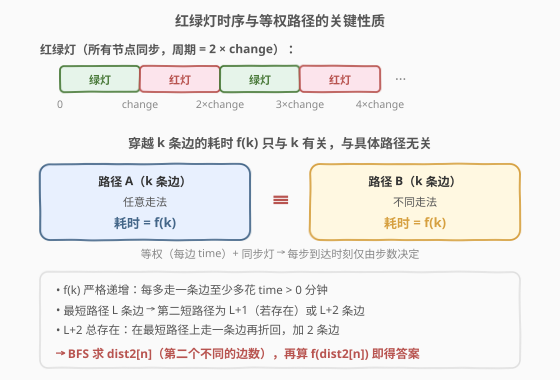
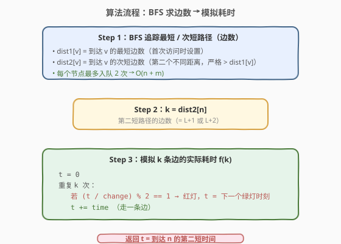
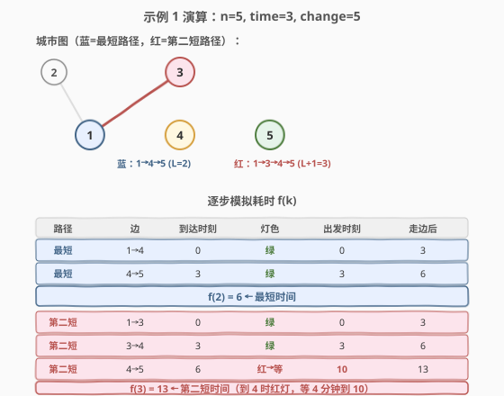

# LeetCode 到达目的地的第二短时间 题解

## 1. 题目概述

- **标题 / 题号**：到达目的地的第二短时间（#2045，hard）
- **链接**：https://leetcode.cn/problems/second-minimum-time-to-reach-destination/
- **难度**：困难
- **标签**：图、BFS、最短路径、第二短路径

**题意**：城市用一个 **双向连通** 的无向图表示，`n` 个节点编号 `1` 到 `n`。每条边 `edges[i] = [ui, vi]` 表示一条双向边，**穿过任意一条边都耗时 `time` 分钟**（所有边等权）。每个节点有一个交通信号灯，每 `change` 分钟切换一次（绿 → 红 → 绿 → …），**所有信号灯同步切换**。启程时（时刻 0）所有灯刚变绿。

规则：
- 可以**任意次**穿过任意顶点（包括 `1` 和 `n`）。
- 到达某节点后，**只能在绿灯时离开**；若到时是红灯，必须等到下一个绿灯才能走。
- 若到时是绿灯，**不能等待，必须立即离开**。

求从节点 `1` 到节点 `n` 的 **第二短时间**（严格大于最短时间的所有值中最小的那个）。

**示例 1**：

```text
输入：n = 5, edges = [[1,2],[1,3],[1,4],[3,4],[4,5]], time = 3, change = 5
输出：13

最短路径：1→4→5（2 条边），耗时 6 分钟
第二短：  1→3→4→5（3 条边），到达节点 4 时为红灯，等 4 分钟，耗时 13 分钟
```

**示例 2**：

```text
输入：n = 2, edges = [[1,2]], time = 3, change = 2
输出：11

最短路径：1→2（1 条边），耗时 3 分钟
第二短：  1→2→1→2（3 条边），耗时 11 分钟
```

**约束**：

- $2 \le n \le 10^4$
- $n - 1 \le \text{edges.length} \le \min(2 \times 10^4, \ n(n-1)/2)$
- $1 \le \text{time}, \text{change} \le 10^3$
- 图连通，无重边，无自环

> 💡 **审题关键**：① 所有边**等权**（都是 `time`），这是破题的钥匙；② 所有红绿灯**同步**，所以等待与否只取决于到达时刻，与具体在哪个节点无关；③ **第二短**是严格大于最小值的最小值，不是第二小的**不同路径**——路径不同但耗时相同只算一个值。

## 2. 解题思路

### 2.1 暴力思路：枚举所有路径

从节点 1 出发 DFS/BFS 枚举所有到节点 `n` 的路径，对每条路径模拟红绿灯等待并计算耗时，收集所有耗时后取第二小。

- **正确性**：显然正确。
- **效率**：路径数量随图规模**指数爆炸**，$n = 10^4$ 时完全不可行。

> ⚠️ 瓶颈在于路径数量无界。突破口是观察到**等权 + 同步灯**带来的结构性质，将问题从"枚举路径"降维到"枚举边数"。

### 2.2 核心观察：等权图 + 同步红绿灯 → k 条边的耗时与路径无关



本题有两个关键结构性质，将问题大幅简化：

**性质 1：所有边等权 → 路径的基础耗时只与边数有关。**

每条边耗时都是 `time`，所以一条 $k$ 条边的路径，"纯走路"耗时就是 $k \times \text{time}$。不同路径只要边数相同，纯走路耗时就相同。

**性质 2：所有红绿灯同步 → 等待也只与步数有关，与具体节点无关。**

所有信号灯同时切换，所以在**任何节点**、时刻 $t$ 的灯色都一样：

$$\text{灯色}(t) = \begin{cases} \text{绿} & \text{若 } \lfloor t / \text{change} \rfloor \bmod 2 = 0 \\ \text{红} & \text{若 } \lfloor t / \text{change} \rfloor \bmod 2 = 1 \end{cases}$$

- **绿灯**：立即出发，出发时刻 = 到达时刻 $t$。
- **红灯**：等到下一个绿灯，出发时刻 = $(\lfloor t / \text{change} \rfloor + 1) \times \text{change}$。

**推论：f(k) 只与 k 有关，与具体路径无关。**

把"到达某节点 → 判断灯色 → 可能等待 → 走一条边"看作一步。每一步的到达时刻完全由上一步的出发时刻决定（到达 = 出发 + time），而出发时刻又只由到达时刻决定（灯色只看时刻不看节点）。因此从时刻 0 出发走 $k$ 步，到达时刻是一个**确定性函数** $f(k)$，与走哪条路无关：

$$f(k) = \text{第 } k \text{ 步走完后的到达时刻}$$

> 💡 举例验证：示例 1 中 `time=3, change=5`。$f(2) = 0 \xrightarrow{\text{绿}} 3 \xrightarrow{\text{绿}} 6$。$f(3) = 0 \xrightarrow{\text{绿}} 3 \xrightarrow{\text{绿}} 6 \xrightarrow{\text{红，等到10}} 13$。无论走 `1→4→5` 还是 `1→3→4→5` 还是其他 3 条边的路径，只要边数 = 3，耗时都是 13。

**性质 3：f(k) 严格递增。**

每多走一条边至少多花 $\text{time} > 0$ 分钟（等待只会更多不会更少），所以 $f(0) < f(1) < f(2) < \cdots$。

**性质 4：第二短路径的边数 = L+1 或 L+2。**

设最短路径（边数最少）有 $L$ 条边。由于 $f$ 严格递增，第二短时间 = $f(\text{第二短边数})$。在无向等权图中：

- $L+1$ 条边的路径**可能存在也可能不存在**（取决于图的奇环结构；二分图不存在奇偶性不同的路径）。
- $L+2$ 条边的路径**一定存在**：在最短路径上任意位置走一条边再折回，就多了 2 条边。

所以第二短边数 $= L+1$（若存在）或 $L+2$，不会更大。BFS 追踪 `dist2[n]`（第二个不同的边数）天然找到它。

### 2.3 算法流程图



三步走：

1. **BFS 追踪 `dist1`/`dist2`**：对每个节点记录最短边数 `dist1[v]` 和次短边数 `dist2[v]`（严格大于 `dist1[v]` 的最小值）。BFS 按非递减距离顺序处理，首次到达设 `dist1`，第二个不同距离设 `dist2`。每个节点最多入队 2 次（一次 `dist1`，一次 `dist2`），总时间 $O(n + m)$。
2. **取 $k = \text{dist2}[n]$**：第二短路径的边数。
3. **模拟 $f(k)$**：从 $t = 0$ 出发，走 $k$ 条边，每步判断灯色并决定是否等待。

> ⚠️ **为什么 BFS 追踪 dist1/dist2 正确？** BFS 按非递减距离处理，首次到达必是最短（设 `dist1`），第二个不同的距离必是次短（设 `dist2`）。由于允许重访节点，第二短路径可能经过已访问的节点，但 BFS 处理 `dist2` 状态时仍会正确传播。关键不变式：第二短路径上的每个中间节点，其到起点的距离要么是 `dist1` 要么是 `dist2`（否则可用更短子段替换，矛盾）。

### 2.4 示例演算



以示例 1 为例，`n=5, time=3, change=5`：

**BFS 求边数**：

| 节点 | dist1（最短边数） | dist2（次短边数） |
|------|-------------------|-------------------|
| 1    | 0                 | 2                 |
| 2    | 1                 | 3                 |
| 3    | 1                 | 2                 |
| 4    | 1                 | 2                 |
| 5    | 2                 | 3                 |

$k = \text{dist2}[5] = 3$。

**模拟 $f(3)$**：

| 步 | 边    | 到达时刻 | $\lfloor t/5 \rfloor$ | 灯色 | 出发时刻 | 走边后 |
|----|-------|---------|----------------------|------|---------|--------|
| 0  | 1→3   | 0       | 0                    | 绿   | 0       | 3      |
| 1  | 3→4   | 3       | 0                    | 绿   | 3       | 6      |
| 2  | 4→5   | 6       | 1                    | 红   | 10      | 13     |

> 💡 **关键瞬间在第 2 步**：到达节点 4 时 $t=6$，$\lfloor 6/5 \rfloor = 1$（奇数 → 红灯），必须等到 $(1+1) \times 5 = 10$ 时刻才绿灯。这 4 分钟的等待正是第二短路径比最短路径多花的时间根源。最短路径 $f(2) = 6$ 恰好全绿通过，第二短 $f(3) = 13$ 撞上红灯。

**验证示例 2**：`n=2, time=3, change=2`。`dist1[2]=1, dist2[2]=3`（无 2 边路径，图是树/二分图，奇偶性锁定）。$f(3) = 0 \xrightarrow{\text{绿}} 3 \xrightarrow{\text{红→4}} 7 \xrightarrow{\text{红→8}} 11$。返回 11。✓

## 3. 参考代码

### C++

```cpp
class Solution {
public:
    int secondMinimum(int n, vector<vector<int>>& edges, int time, int change) {
        vector<vector<int>> adj(n + 1);
        for (auto& e : edges) {
            adj[e[0]].push_back(e[1]);
            adj[e[1]].push_back(e[0]);
        }

        // BFS 追踪最短 / 次短路径（边数）
        vector<int> dist1(n + 1, -1), dist2(n + 1, -1);
        dist1[1] = 0;
        queue<pair<int,int>> q;
        q.push({1, 0});

        while (!q.empty()) {
            auto [u, d] = q.front(); q.pop();
            for (int v : adj[u]) {
                int nd = d + 1;
                if (dist1[v] == -1) {
                    dist1[v] = nd;
                    q.push({v, nd});
                } else if (dist1[v] < nd && dist2[v] == -1) {
                    dist2[v] = nd;
                    q.push({v, nd});
                }
            }
        }

        int k = dist2[n];

        // 模拟 k 条边的实际耗时（含红绿灯等待）
        int t = 0;
        for (int i = 0; i < k; i++) {
            if ((t / change) % 2 == 1) {        // 红灯，等到下一个绿灯
                t = (t / change + 1) * change;
            }
            t += time;
        }
        return t;
    }
};
```

### Python

```python
class Solution:
    def secondMinimum(self, n: int, edges: List[List[int]], time: int, change: int) -> int:
        adj = [[] for _ in range(n + 1)]
        for u, v in edges:
            adj[u].append(v)
            adj[v].append(u)

        # BFS 追踪最短 / 次短路径（边数）
        dist1 = [-1] * (n + 1)
        dist2 = [-1] * (n + 1)
        dist1[1] = 0
        q = deque([(1, 0)])

        while q:
            u, d = q.popleft()
            for v in adj[u]:
                nd = d + 1
                if dist1[v] == -1:                       # 首次到达 → 最短
                    dist1[v] = nd
                    q.append((v, nd))
                elif dist1[v] < nd and dist2[v] == -1:   # 第二个不同距离 → 次短
                    dist2[v] = nd
                    q.append((v, nd))

        k = dist2[n]

        # 模拟 k 条边的实际耗时（含红绿灯等待）
        t = 0
        for _ in range(k):
            if (t // change) % 2 == 1:                   # 红灯，等到下一个绿灯
                t = (t // change + 1) * change
            t += time
        return t
```

> ⚠️ **BFS 条件 `dist1[v] < nd`**：必须严格小于，因为同一最短距离可能通过不同路径重复到达，此时 `nd == dist1[v]` 应跳过。只有 `nd` 严格大于 `dist1[v]` 且 `dist2[v]` 未设时，才记录为次短。BFS 按非递减距离处理，保证第二个不同距离就是次短。

## 4. 复杂度分析

| 维度 | 复杂度 | 说明 |
|------|--------|------|
| BFS 时间 | $O(n + m)$ | 每个节点最多入队 2 次（`dist1` + `dist2`），每条边最多被扫描 $2 \times 2 = 4$ 次（两端各两次状态） |
| 模拟时间 | $O(k)$ | $k = \text{dist2}[n] \le L + 2 \le n + 1$，最多走 $n+1$ 条边 |
| 总时间 | $O(n + m)$ | BFS 主导，模拟为线性 |
| 空间 | $O(n + m)$ | 邻接表 $O(n + m)$ + `dist1`/`dist2`/队列 $O(n)$ |

> 💡 **dist2[n] 为什么不超过 $L + 2$？** 最短路径 $L$ 条边。$L+1$ 若不存在（二分图奇偶性锁定），则 $L+2$ 一定存在（最短路径上走一条边再折回）。所以 $\text{dist2}[n] \in \{L+1, L+2\}$，模拟步数 $\le n + 1$。

## 5. 扩展：直接 BFS 追踪到达时间

本文解法将问题分解为"求边数"和"算时间"两步，利用了等权 + 同步灯的特殊结构。更通用的做法是**直接 BFS 追踪到达时刻** `dist1[v]`/`dist2[v]`（记录最短和次短的**时间**而非边数）：

```python
# dist1[v] / dist2[v] 存到达 v 的最短 / 次短时间
dist1 = [inf] * (n + 1)
dist2 = [inf] * (n + 1)
dist1[1] = 0
q = deque([(1, 0)])

while q:
    u, t = q.popleft()
    if t > dist2[u]:
        continue
    # 计算出发时刻（红灯则等待）
    if (t // change) % 2 == 1:
        depart = (t // change + 1) * change
    else:
        depart = t
    arrival = depart + time
    for v in adj[u]:
        if arrival < dist1[v]:
            dist2[v] = dist1[v]
            dist1[v] = arrival
            q.append((v, arrival))
        elif dist1[v] < arrival < dist2[v]:
            dist2[v] = arrival
            q.append((v, arrival))

return dist2[n]
```

**正确性保证**：出发时刻函数 `depart(t)` 是非递减的（绿灯段 $t$ 递增 → 出发递增；红灯段出发恒为周期边界 → 不减），所以 BFS 队列自然按非递减时间顺序处理，与 Dijkstra 的贪心正确性同理。

| 维度 | 本文解法（边数 + 模拟） | 通用解法（追踪时间） |
|------|------------------------|---------------------|
| 适用条件 | 等权 + 同步灯 | 任意边权 / 异步灯 |
| 实现复杂度 | 低（两步分离，逻辑清晰） | 中（需在 BFS 中处理等待） |
| 时间复杂度 | $O(n + m)$ | $O(n + m)$（等权时；带权用 Dijkstra 为 $O(m \log n)$） |
| 洞察深度 | 高（揭示 f(k) 与路径无关） | 通用但缺少结构洞察 |

> 💡 面试中先讲本文的"边数 + 模拟"解法（展示对等权 + 同步灯结构的洞察），再提通用解法作为扩展，体现"先利用结构性质简化，再考虑通用方案"的工程思维。

## 6. 面试要点

1. **为什么 f(k) 与具体路径无关？**

   - 所有边等权（都是 `time`），所有红绿灯同步切换。每一步的到达时刻 = 上一步出发时刻 + `time`，出发时刻由到达时刻和灯色决定，而灯色只看时刻不看节点。所以从 $t=0$ 出发走 $k$ 步，到达时刻是一个确定性递推 $f(k)$，与走哪条路完全无关。

2. **第二短路径为什么是 L+1 或 L+2 条边？**

   - $f(k)$ 严格递增，所以第二短时间对应第二短边数。最短路径 $L$ 条边。$L+1$ 条边的路径可能不存在（二分图奇偶性锁定）。$L+2$ 条边一定存在：在最短路径任意位置走一条邻边再折回，加 2 条边。所以第二短边数 $\in \{L+1, L+2\}$。

3. **BFS 追踪 dist1/dist2 为什么每个节点最多入队 2 次？**

   - BFS 按非递减距离处理。首次到达设 `dist1`（最短），第二个严格更大的距离设 `dist2`（次短）。之后所有到达的距离 $\ge \text{dist2}$，被条件 `dist2[v] == -1` 挡住不再入队。总入队次数 $\le 2n$，每条边最多被扫描 4 次，$O(n + m)$。

4. **红灯等待的时刻怎么算？**

   - 时刻 $t$ 的灯色由 $\lfloor t / \text{change} \rfloor \bmod 2$ 决定：0 为绿，1 为红。红灯时下一个绿灯始于 $(\lfloor t / \text{change} \rfloor + 1) \times \text{change}$。例如 `change=5, t=6`：$\lfloor 6/5 \rfloor = 1$（红），等到 $2 \times 5 = 10$。

5. **如果边权不同（每条边 time 不同），还能用这个方法吗？**

   - 不能直接用"边数 + 模拟"，因为 $f(k)$ 不再与路径无关（不同路径走相同边数耗时可能不同）。需退回到扩展节的"直接 BFS/Dijkstra 追踪到达时间"方案，用 `dist1`/`dist2` 存时间而非边数，复杂度 $O(m \log n)$（Dijkstra）。

## 同类练习题

| # | 题目 | 与本题的关联 |
|---|------|-------------|
| 743 | [网络延迟时间](https://leetcode.cn/problems/network-delay-time/) | 堆优化 Dijkstra 单源最短路径，本题的"父问题"——理解了最短路再升级到第二短路 |
| 787 | [K 站中转内最便宜的航班](https://leetcode.cn/problems/cheapest-flights-within-k-stops/) | 限制跳数的 Bellman-Ford，同样是"带约束的最短路"家族（本题约束是红绿灯，那题约束是跳数） |
| 994 | [腐烂的橘子](https://leetcode.cn/problems/rotting-oranges/) | 等权图多源 BFS，本题 BFS 追踪 dist1/dist2 的基础模板 |
| 1928 | [规定时间内到达终点的最小花费](https://leetcode.cn/problems/minimum-cost-to-reach-destination-in-time/) | 带时间约束的最小花费路径，另一维度"带约束最短路"的变体 |
| 2040 | [两个有序数组的第 K 小乘积](https://leetcode.cn/problems/kth-smallest-product-of-two-sorted-arrays/) | 第 K 小问题的二分答案思路，与本题"第二短"同为"第 K 个最值"家族（思路迁移：从第二短推广到第 K 短） |
