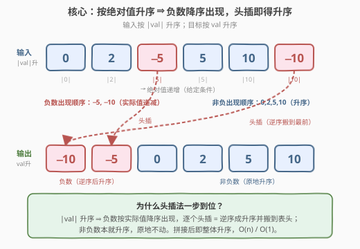
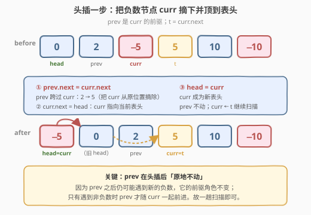

# 给按照绝对值排序的链表排序

- **题目名称**：给按照绝对值排序的链表排序
- **链接**：[2046. 给按照绝对值排序的链表排序 🔒](https://leetcode.cn/problems/sort-linked-list-already-sorted-using-absolute-values)
- **难度**：中等
- **标签**：链表、双指针、排序

## 1. 题目概述

给你一个链表的头结点 `head`，这个链表已经根据结点的**绝对值**进行**升序**排序。请你返回重新根据**结点的值**进行**升序**排序后的链表。

> ⚠️ 本题为 **Plus 会员专享题（🔒）**，题面来自 leetcode.cn。关键前提是「输入已按绝对值升序」——这是一切优化的根基。

**示例 1**：

```text
输入：head = [0,2,-5,5,10,-10]
输出：[-10,-5,0,2,5,10]
解释：
按绝对值排序的链表是 [0,2,-5,5,10,-10]（|val| = 0,2,5,5,10,10 递增）。
按值排序的链表是   [-10,-5,0,2,5,10]。
```

**示例 2**：

```text
输入：head = [0,1,2]
输出：[0,1,2]
解释：链表已经升序。
```

**示例 3**：

```text
输入：head = [1]
输出：[1]
解释：链表已经升序。
```

**约束条件**：

- 链表节点数的范围是 $[1, 10^5]$。
- $-5000 \le \text{Node.val} \le 5000$。
- `head` 是根据结点绝对值升序排列好的链表。

**进阶**：你能在 $O(n)$ 的时间复杂度之内解决这个问题吗？

---

## 2. 解题思路

### 2.1 暴力思路：取值排序再回填

最直接的做法是遍历链表，把所有 `val` 存入数组，对数组排序后依次写回节点：

- 时间 $O(n \log n)$，空间 $O(n)$。
- 只改值不改指针，本质是「伪排序」——一旦节点带额外信息（随机指针、附加域）就失效，面试官通常不满意。
- 更重要的是，它**完全忽略了「输入已按绝对值升序」这一强条件**，等同于把题目当成普通排序做，浪费了题目给的结构。

突破口在于挖掘这条隐含性质：绝对值升序的链表里，**负数与非负数各自呈现极有规律的次序**。

### 2.2 核心观察：负数降序出现，头插即得升序



因为链表按 $|\text{val}|$ 升序排列，所以：

- **非负数**按出现顺序天然就是**升序**（$|\text{val}| = \text{val}$，绝对值升序即值升序），无需移动。
- **负数**按出现顺序是**降序**的：绝对值越大，负数值越小。例如 $-2, -5, -10$ 的 $|\text{val}|$ 为 $2,5,10$ 递增，但实际值 $-2 > -5 > -10$ 递减。

而最终目标是整体升序 $\Rightarrow$ **所有负数应排在所有非负数之前**，且负数段自身要升序。把这两点合起来：

> 💡 只需把每个遇到的负数节点**摘下并头插到表头**。负数原本降序出现，逐个头插后恰好**逆序成升序**；又因为头插到最前，自然排到了所有非负数之前。非负数原地不动，整条链即刻升序。

这是一趟扫描、每个节点只处理一次的 $O(n)$ 原地算法，且只需 $O(1)$ 额外空间。

### 2.3 算法流程：头插一步的三次指针改写



维护两个指针：`prev`（已处理段的尾，即 `curr` 的前驱）与 `curr`（当前扫描节点）。从 `head.next` 开始扫描：

1. 若 `curr.val >= 0`：本就升序，`prev` 与 `curr` 各前进一步。
2. 若 `curr.val < 0`：记 `t = curr.next`，做三次指针改写——
   - **① `prev.next = curr.next`**（即 `= t`）：让前驱跨过 `curr`，把 `curr` 从原位置摘除；
   - **② `curr.next = head`**：让 `curr` 指向当前表头；
   - **③ `head = curr`**：`curr` 成为新表头。
   - 然后 `curr = t` 继续扫描，**`prev` 保持不动**（它仍是下一个可能负数的前驱）。

> ⚠️ **关键细节**：头插后 `prev` **不前进**。因为 `prev` 之后还可能遇到新的负数节点，它作为「前驱」的角色不变；只有遇到非负数时 `prev` 才随 `curr` 一起前进。正因如此，整条链一趟扫描即可完成，无需回溯。

### 2.4 示例演算

![示例演算：[0,2,−5,5,10,−10]](../images/sllaav_walkthrough.svg)

以 `head = [0,2,-5,5,10,-10]` 为例：

| 步骤 | 处理 `curr` | 动作 | 链表状态 | 指针 |
|------|------------|------|----------|------|
| 0 | — | 初始 | `0→2→−5→5→10→−10` | prev=0, curr=2 |
| 1 | 2 (≥0) | 前进 | `0→2→−5→5→10→−10` | prev=2, curr=−5 |
| 2 | −5 (<0) | 头插 | `−5→0→2→5→10→−10` | prev=2, curr=5 |
| 3 | 5, 10 (≥0) | 前进 | `−5→0→2→5→10→−10` | prev=10, curr=−10 |
| 4 | −10 (<0) | 头插 | `−10→−5→0→2→5→10` | curr=∅，结束 |

最终 `−10→−5→0→2→5→10`，升序完成。两次头插把负数段逆序搬到表头；非负段 `0,2,5,10` 全程未动。

---

## 3. 参考代码

### C++

```cpp
/**
 * Definition for singly-linked list.
 * struct ListNode {
 *     int val;
 *     ListNode *next;
 *     ListNode() : val(0), next(nullptr) {}
 *     ListNode(int x) : val(x), next(nullptr) {}
 *     ListNode(int x, ListNode *next) : val(x), next(next) {}
 * };
 */
class Solution {
  public:
    ListNode* sortLinkedList(ListNode* head) {
        ListNode* prev = head;
        ListNode* curr = head->next;
        while (curr) {
            if (curr->val < 0) {
                ListNode* t = curr->next; // 先存住下一个
                prev->next = t;           // ① 前驱跨过 curr
                curr->next = head;        // ② curr 指向当前表头
                head = curr;              // ③ curr 成为新表头
                curr = t;                 // prev 不动，继续扫描
            } else {
                prev = curr;
                curr = curr->next;
            }
        }
        return head;
    }
};
```

### Python

```python
# Definition for singly-linked list.
# class ListNode:
#     def __init__(self, val=0, next=None):
#         self.val = val
#         self.next = next
class Solution:
    def sortLinkedList(self, head: Optional[ListNode]) -> Optional[ListNode]:
        prev, curr = head, head.next
        while curr:
            if curr.val < 0:
                t = curr.next       # 先存住下一个
                prev.next = t       # ① 前驱跨过 curr
                curr.next = head    # ② curr 指向当前表头
                head = curr         # ③ curr 成为新表头
                curr = t            # prev 不动，继续扫描
            else:
                prev, curr = curr, curr.next
        return head
```

> 💡 注意 `prev` 的「惰性」：只在非负分支里前进，头插分支里原地不动——这是算法一趟完成的精髓。

---

## 4. 复杂度分析

| 维度 | 复杂度 | 说明 |
|------|--------|------|
| 时间复杂度 | $O(n)$ | `curr` 从第二个节点单向扫描到末尾，每个节点只访问一次；头插与前进均为 $O(1)$ |
| 空间复杂度 | $O(1)$ | 仅用 `prev`/`curr`/`t` 三个指针，原地修改指针，不开额外容器 |

> 💡 相比通用链表排序（如 148 题的归并排序 $O(n \log n)$），本题利用「绝对值升序」这一特例把复杂度压到 $O(n)$。这正是「特化优于通用」的典型例子。

---

## 5. 扩展：拆双链表法

头插法把「逆序负数」与「搬到表头」两件事合并成一次操作。若想更直观地体现「负数段 + 非负数段」的结构，也可显式拆成两条子链再拼接：

- 用哑节点 `negDummy`、`posDummy` 分别收集负数与非负数。
- 负数段采用**头插**（等价于逆序），使其从降序变升序；非负数段采用**尾插**（保持升序）。
- 最后把 `posHead` 接到负数段的尾即可。

```cpp
class Solution {
  public:
    ListNode* sortLinkedList(ListNode* head) {
        ListNode negDummy, posDummy;
        ListNode* negTail = &negDummy;   // 负数段头插，无需尾指针
        ListNode* posTail = &posDummy;   // 非负段尾插
        for (ListNode* cur = head; cur; ) {
            ListNode* nxt = cur->next;
            cur->next = nullptr;
            if (cur->val < 0) {          // 头插：逆序负数
                cur->next = negDummy.next;
                negDummy.next = cur;
            } else {                     // 尾插：保持非负升序
                posTail->next = cur;
                posTail = cur;
            }
            cur = nxt;
        }
        // 拼接：负数段尾（即最先插入的那个负数）-> 非负段头
        if (negDummy.next == nullptr) return posDummy.next;
        ListNode* tail = negDummy.next;
        while (tail->next) tail = tail->next;
        tail->next = posDummy.next;
        return negDummy.next;
    }
};
```

| 维度 | 复杂度 | 说明 |
|------|--------|------|
| 时间复杂度 | $O(n)$ | 一趟扫描分类；最后找负数段尾再扫一次负数段，仍为 $O(n)$ |
| 空间复杂度 | $O(1)$ | 两个哑节点在栈上，指针常数个 |

> 💡 两种写法等价：头插法把「逆序」与「搬到表头」融为一体、代码更短；拆双链表法逻辑更显式，便于讲清「负数需逆序、非负保持序」这一不变量。面试中先给头插主解，再提此变体体现思路厚度。

---

## 6. 面试要点

1. **为什么头插法是 $O(n)$ 而 148 题排序链表是 $O(n \log n)$？**

   - 本题输入已按绝对值升序，自带「负数降序、非负升序」的强结构，只需一趟扫描把负数头插即完成；148 题是完全无序的链表，必须用分治（归并）才能达到 $O(n \log n)$ 下界。利用题目给定的特殊结构是降复杂度的关键。

2. **头插后 `prev` 为什么不前进？**

   - `prev` 是 `curr` 的前驱。头插把 `curr` 摘走后，`prev.next` 被接到 `curr.next`（即 `t`），所以 `prev` 仍是下一个待处理节点 `t` 的前驱。只有遇到非负数（原地保留）时，`prev` 才随 `curr` 一起前进。若头插时也前进 `prev`，就会丢失正确的前驱关系。

3. **只改值不改指针能过吗？为什么不推荐？**

   - 取值排序后回填能通过判题，但属于「伪排序」：没真正重排链表结构，节点带额外域（如随机指针）时失效；且未利用绝对值升序条件，退化为 $O(n \log n)$。面试中应给出修改指针的原地解法。

4. **如果输入改成「按绝对值降序」呢？**

   - 对称地：负数会升序出现、非负数降序出现。可改用「尾插负数 + 头插非负数」或先整体反转再套用本题逻辑。关键仍是先分析两类数在新条件下的出现次序，再决定插法。

5. **负数头插为什么恰好得到升序而不是降序？**

   - 负数按绝对值升序出现 $\Rightarrow$ 实际值降序出现（$-2, -5, -10$）。头插把「先遇到的」放到后面、「后遇到的」放到前面，等价于**逆序**，于是降序变升序（$-10, -5, -2$）。这是「逆序反转降序」的直接推论。

---

## 7. 同类练习题

- [148. 排序链表](https://leetcode.cn/problems/sort-list/)（[题解](../0101-0200/148_排序链表.md)）：通用链表归并排序 $O(n \log n)$，对照本题利用绝对值升序结构降到 $O(n)$
- [206. 反转链表](https://leetcode.cn/problems/reverse-linked-list/)（[题解](../0201-0300/206_反转链表.md)）：三指针掉头，头插法的本质即「逐个反转负数段」
- [86. 分隔链表](https://leetcode.cn/problems/partition-list/)（[题解](../0001-0100/86_分隔链表.md)）：按值域拆成两条子链再拼接，与第 5 节拆双链表法同模板
- [147. 对链表进行插入排序](https://leetcode.cn/problems/insertion-sort-list/)（[题解](../0101-0200/147_对链表进行插入排序.md)）：链表插入排序，对照本题「头插」的特化版（已知结构 ⇒ 无需二分找位置）
- [92. 反转链表 II](https://leetcode.cn/problems/reverse-linked-list-ii/)（[题解](../0001-0100/92_反转链表 II.md)）：局部指针改写训练，强化对「摘节点—重接」的手感
