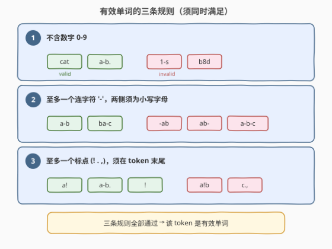
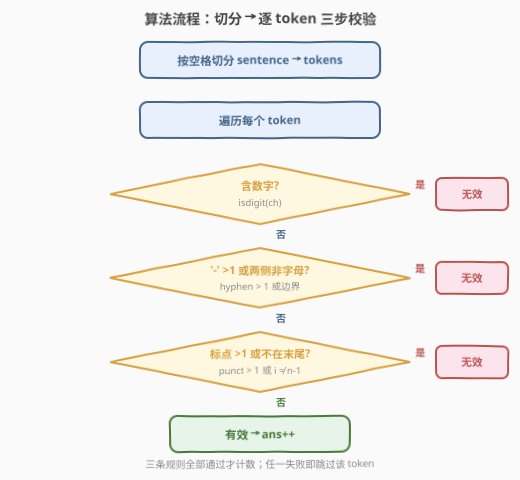
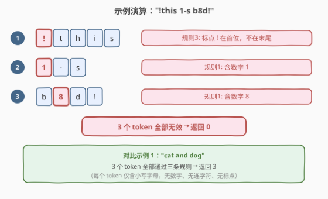

# 句子中的有效单词数

- **题目名称**：句子中的有效单词数
- **链接**：[2047. 句子中的有效单词数](https://leetcode.cn/problems/number-of-valid-words-in-a-sentence/)
- **难度**：简单
- **标签**：字符串、模拟

## 1. 题目概述

给定一个字符串 `sentence`，由小写字母（`'a'`–`'z'`）、数字（`'0'`–`'9'`）、连字符（`'-'`）、标点符号（`'!'`、`'.'`、`','`）和空格组成。句子按空格分隔成若干 **token**（token 之间由一个或多个空格分隔）。

一个 token 是**有效单词**当且仅当**同时**满足以下三条规则：

1. **不含数字**：仅由小写字母、连字符和/或标点组成。
2. **至多一个连字符** `'-'`：若存在，两侧必须都是小写字母（`"a-b"` 有效，`"-ab"` 和 `"ab-"` 无效）。
3. **至多一个标点**（`'!'`、`'.'`、`','`）：若存在，必须位于 token 的**末尾**。

返回 `sentence` 中有效单词的数目。

> 💡 有效单词的例子：`"a-b."`、`"afad"`、`"ba-c"`、`"a!"`、`"!"`。

**示例 1**：

```text
输入：sentence = "cat and  dog"
输出：3
解释：有效单词为 "cat"、"and"、"dog"
```

**示例 2**：

```text
输入：sentence = "!this  1-s b8d!"
输出：0
解释：
- "!this" 无效：标点 ! 不在末尾
- "1-s"   无效：含数字
- "b8d!"  无效：含数字
```

**示例 3**：

```text
输入：sentence = "alice and  bob are playing stone-game10"
输出：5
解释：有效单词为 "alice"、"and"、"bob"、"are"、"playing"
"stone-game10" 无效：含数字
```

**约束条件**：

- $1 \le \text{sentence.length} \le 1000$
- `sentence` 由小写字母、数字、`' '`、`'-'`、`'!'`、`'.'`、`','` 组成
- 句子中至少有 $1$ 个 token

---

## 2. 解题思路

### 2.1 暴力思路：分步校验

最直观的做法是：先按空格切分得到所有 token，再对每个 token **分三轮**检查三条规则——第一轮扫描数字、第二轮扫描连字符、第三轮扫描标点。三趟扫描逻辑清晰但每个 token 最多遍历三遍，效率不高。

另一种思路是用**正则表达式**匹配，但正则在表达"至多一个连字符且两侧须为字母"这类条件时写法复杂、可读性差，且调试不便。

### 2.2 核心观察：单趟扫描同时校验三条规则



三条规则的判断对象都是 token 中的**字符**，而字符类型互斥——一个字符要么是字母、要么是数字、要么是连字符、要么是标点。因此可以在**一次遍历**中同时校验全部规则：

- 维护 `hyphen_cnt` 和 `punct_cnt` 两个计数器；
- 遇到数字 → 立即判否；
- 遇到连字符 → 计数 +1，若超过 1 则判否；检查位置不在首尾且两侧为字母；
- 遇到标点 → 计数 +1，若超过 1 则判否；检查位于末尾。

> 💡 **关键洞察**：三条规则支持"短路"——遇到任何违规字符立即返回 `false`，无需完整扫描。大多数无效 token 在前几个字符处就会被淘汰，实际运行远快于理论上界。

### 2.3 算法流程图



流程为「切分 → 逐 token 三步校验」：先用空格切分 `sentence`，再对每个 token 依次检查三条规则，任一失败即跳过该 token，全部通过则计数 +1。

> 💡 Python 的 `str.split()` 无参数调用会自动合并连续空格，无需手动处理多空格情况；C++ 用 `istringstream >> token` 同理。

### 2.4 示例演算

以示例 2 `"!this  1-s b8d!"` 为例：



| token | 首个违规字符 | 违反规则 | 结果 |
|-------|------------|---------|------|
| `!this` | `!` 在首位，不在末尾 | ③ | 无效 |
| `1-s` | `1` 是数字 | ① | 无效 |
| `b8d!` | `8` 是数字 | ① | 无效 |

三个 token 全部无效，返回 $0$。

> ⚠️ 注意 `"!this"` 的 `!` 虽然是标点，但它在位置 0 而非末尾，违反规则 ③。这说明"至多一个标点"包含两层约束：**数量 $\le 1$** 且**位置在末尾**，缺一不可。同理，规则 ② 的连字符也同时约束了**数量**和**位置**（两侧须为字母）。

---

## 3. 参考代码

### C++

```cpp
class Solution {
  public:
    int countValidWords(string sentence) {
        int ans = 0;
        istringstream iss(sentence);
        string token;
        while (iss >> token)
            if (isValid(token)) ans++;
        return ans;
    }
  private:
    bool isValid(const string& t) {
        int hyphen = 0, punct = 0, n = t.size();
        for (int i = 0; i < n; ++i) {
            char ch = t[i];
            if (isdigit(ch)) return false;
            if (ch == '-') {
                if (++hyphen > 1) return false;
                if (i == 0 || i == n - 1) return false;
                if (!isalpha(t[i - 1]) || !isalpha(t[i + 1])) return false;
            }
            if (ch == '!' || ch == '.' || ch == ',') {
                if (++punct > 1 || i != n - 1) return false;
            }
        }
        return true;
    }
};
```

### Python

```python
class Solution:
    def countValidWords(self, sentence: str) -> int:
        def isValid(token: str) -> bool:
            hyphen_cnt = punct_cnt = 0
            for i, ch in enumerate(token):
                if ch.isdigit():
                    return False
                elif ch == '-':
                    hyphen_cnt += 1
                    if hyphen_cnt > 1:
                        return False
                    if i == 0 or i == len(token) - 1:
                        return False
                    if not (token[i - 1].isalpha() and token[i + 1].isalpha()):
                        return False
                elif ch in '!,.':
                    punct_cnt += 1
                    if punct_cnt > 1 or i != len(token) - 1:
                        return False
            return True

        return sum(isValid(t) for t in sentence.split())
```

> 💡 Python 的 `str.split()` 无参数时以任意连续空白符分隔并自动跳过空串，天然处理多空格场景。C++ 的 `istringstream >>` 同理。

---

## 4. 复杂度分析

| 维度 | 复杂度 | 说明 |
|------|--------|------|
| 时间复杂度 | $O(n)$ | $n$ 为 `sentence` 长度；切分 + 逐字符校验，每个字符访问一次 |
| 空间复杂度 | $O(n)$ | 切分后的 token 字符串数组；若就地扫描可降至 $O(1)$ |

> 💡 短路返回使实际运行远快于 $O(n)$ 上界——大多数无效 token 在前几个字符处即被淘汰。

---

## 5. 扩展：就地扫描省去切分

上述代码用 `split()` / `istringstream` 先切分再校验，空间 $O(n)$。可改为**就地双指针扫描**：用 `i` 跳过空格、`j` 找到 token 末尾，直接在原串上校验 `sentence[l..r]` 区间，额外空间降到 $O(1)$：

```cpp
class Solution {
  public:
    int countValidWords(string sentence) {
        int ans = 0, n = sentence.size(), i = 0;
        while (i < n) {
            while (i < n && sentence[i] == ' ') i++;
            if (i >= n) break;
            int j = i;
            while (j < n && sentence[j] != ' ') j++;
            if (isValid(sentence, i, j - 1)) ans++;
            i = j;
        }
        return ans;
    }
  private:
    bool isValid(const string& s, int l, int r) {
        int hyphen = 0, punct = 0;
        for (int i = l; i <= r; ++i) {
            char ch = s[i];
            if (isdigit(ch)) return false;
            if (ch == '-') {
                if (++hyphen > 1) return false;
                if (i == l || i == r) return false;
                if (!isalpha(s[i - 1]) || !isalpha(s[i + 1])) return false;
            }
            if (ch == '!' || ch == '.' || ch == ',') {
                if (++punct > 1 || i != r) return false;
            }
        }
        return true;
    }
};
```

| 维度 | 复杂度 | 说明 |
|------|--------|------|
| 时间复杂度 | $O(n)$ | 同主解 |
| 空间复杂度 | $O(1)$ | 无需切分，原地双指针扫描 |

> 💡 就地版的边界判断从 `i == 0 || i == n - 1` 改为 `i == l || i == r`——因为 token 在原串中不一定从 0 开始。这是切分版与就地版的唯一区别。

---

## 6. 面试要点

1. **三条规则各自的"至多一个"如何高效判断？**

   - 用计数器 `hyphen_cnt` / `punct_cnt`，遇到对应字符时 `++` 并检查是否超过 1。超过即返回 `false`，无需记录位置。

2. **连字符的"两侧须为字母"如何检查？有哪些边界情况？**

   - 连字符在位置 `i`，检查 `i != 0` 且 `i != n-1`（不在首尾），再检查 `t[i-1]` 和 `t[i+1]` 都是小写字母。边界情况：`"-ab"`（首位）、`"ab-"`（末位）、`"a--b"`（第二个连字符触发计数 >1）。

3. **为什么用 `str.split()` 而不是 `str.split(' ')`？**

   - `split()` 无参数时以任意连续空白符分隔，自动合并多个空格；`split(' ')` 以单个空格为分隔符，连续空格会产生空字符串 token，需要额外过滤。

4. **标点规则"位于末尾"和"至多一个"能否合并判断？**

   - 可以。遇到标点时同时检查 `punct_cnt > 1`（数量超限）和 `i != n-1`（不在末尾），任一为真即返回 `false`。代码中 `if (++punct > 1 || i != n - 1)` 即合并判断。

5. **时间复杂度为什么是 $O(n)$ 而非 $O(n \cdot k)$（$k$ 为 token 数）？**

   - 所有 token 的长度之和不超过 `sentence` 长度 $n$（空格不计入 token）。对每个 token 的扫描总字符数 $\le n$，故总体 $O(n)$。

---

## 7. 同类练习题

- [58. 最后一个单词的长度](https://leetcode.cn/problems/length-of-last-word/)：同样按空格切分句子取 token，从右向左扫描跳过尾随空格，本题切分逻辑的基础练习
- [8. 字符串转换整数 (atoi)](https://leetcode.cn/problems/string-to-integer-atoi/)：逐字符扫描 + 多条件校验 + 溢出处理，同属字符串模拟校验家族
- [125. 验证回文串](https://leetcode.cn/problems/valid-palindrome/)：逐字符扫描 + 条件过滤，更简单的字符串校验入门
- [65. 有效数字](https://leetcode.cn/problems/valid-number/)：DFA 状态机校验字符串合法性，本题的困难版——规则更多、状态更复杂
- [290. 单词规律](https://leetcode.cn/problems/word-pattern/)：按空格切分 token + 双射校验，切分逻辑与本题相同
