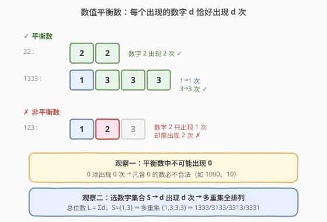
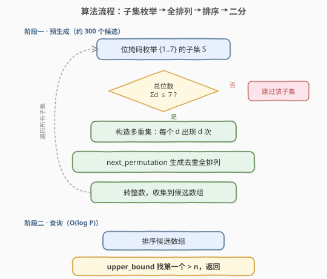
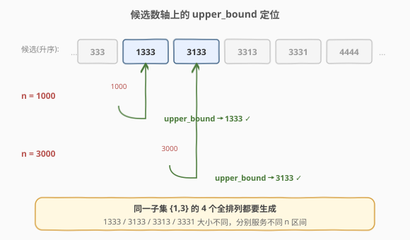

# LeetCode 下一个更大的数值平衡数 题解

## 1. 题目概述

- **标题 / 题号**：下一个更大的数值平衡数（#2048，medium）
- **链接**：https://leetcode.cn/problems/next-greater-numerically-balanced-number/
- **难度**：中等
- **标签**：数学、枚举、回溯、位运算

**题意**：如果一个整数 $x$ 的十进制表示中，**每一个出现的数字 $d$ 恰好出现 $d$ 次**，则称 $x$ 为**数值平衡数**。给定一个整数 $n$，返回**严格大于** $n$ 的最小数值平衡数。

> 💡 例如 `22` 是平衡数（数字 `2` 出现 `2` 次）；`1333` 也是（`1` 出现 `1` 次、`3` 出现 `3` 次）；而 `123` 不是（`1` 出现 $1$ 次 ✓，但 `2` 只出现 $1$ 次 ✗）。

**示例 1**：

```text
输入：n = 1
输出：22
解释：22 是严格大于 1 的最小数值平衡数（数字 2 出现 2 次）。
```

**示例 2**：

```text
输入：n = 1000
输出：1333
解释：1333 是严格大于 1000 的最小数值平衡数（1 出现 1 次，3 出现 3 次）。
```

**示例 3**：

```text
输入：n = 3000
输出：3133
解释：3133 是严格大于 3000 的最小数值平衡数（3 出现 3 次，1 出现 1 次）。
```

**约束**：

- $0 \le n \le 10^6$

## 2. 解题思路

### 2.1 暴力思路：逐个递增检查

最直观的做法是从 $n+1$ 开始逐个往上枚举，对每个数写一个 `isBalanced(x)` 判定函数：统计各位数字出现次数，若含有 `0`（`0` 须出现 $0$ 次，故凡含 `0` 必不合法）或存在数字 $d$ 出现次数 $\ne d$，则跳过，直到命中第一个平衡数。

问题在于**最大空隙过大**：在 $n \le 10^6$ 范围内，平衡数极其稀疏。例如 $n = 666666$ 之后，下一个平衡数是 $1224444$，二者相距约 $5.6 \times 10^5$。逐个检查需要迭代数十万次，虽能勉强通过，但既不优雅也不可推广。

### 2.2 核心观察：候选集合有限，预生成全排列



跳出「从 $n$ 出发往上找」的思维，反过来想：**所有可能的平衡数一共才多少个？**

- **观察一：平衡数中不可能出现 `0`。** 因为数字 `0` 要求出现 $0$ 次，即不能出现。所以平衡数只能由 `1`–`9` 组成。
- **观察二：数字 $d$ 一旦出现就必须出现 $d$ 次。** 因此一个平衡数的「数字多重集」完全由一个**数字集合** $S \subseteq \{1,2,\dots,9\}$ 决定——$d \in S$ 就贡献 $d$ 个 $d$，总位数 $L = \sum_{d \in S} d$。
- **观察三：$n \le 10^6$，答案至多 $7$ 位数。** 故只需考虑 $L \le 7$ 的子集。由于 $\sum_{d=1}^{7} d = 28$ 而 $L \le 7$，真正可选的 $d$ 上界是 $7$（选 $d=8$ 自身就占 $8$ 位，已超）。

满足 $\sum_{d \in S} d \le 7$ 且 $S \subseteq \{1,\dots,7\}$ 的子集只有约 $18$ 个。对每个子集，把「$d$ 个 $d$」拼成多重集，生成所有**互不相同的全排列**，全库候选数不到 $300$ 个。

> 💡 **关键转折**：与其在数轴上逐个试，不如把所有合法平衡数**一次性枚举出来**排序，再用二分查找回答任意 $n$。候选规模 $O(10^2)$，预生成后每次查询 $O(\log 300) \approx O(1)$。

### 2.3 算法流程图



整体分两阶段：

1. **预生成**：用位掩码枚举 $\{1,\dots,7\}$ 的所有子集；对总位数 $\le 7$ 的子集，构造数字多重集（$d$ 出现 $d$ 次），借助 `next_permutation`（C++）或 `permutations`（Python）生成去重全排列，转成整数收集。
2. **查询**：排序候选数组，`upper_bound` 找第一个 $> n$ 的元素。

### 2.4 示例演算



以 $n = 1000$ 为例，相关候选（按升序截取）：

| 候选 | 数字多重集 | 是否 > 1000 |
|------|-----------|------------|
| `333` | {3} | ✗ |
| `1333` | {1, 3} | ✓ ← 命中 |
| `3133` | {1, 3} | ✓ |
| `4444` | {4} | ✓ |

`upper_bound(1000)` 落在 `1333`，即答案。

以 $n = 3000$ 为例：`1333 < 3000 < 3133`，`upper_bound(3000)` 落在 `3133`，即答案。

> ⚠️ 注意 `{1,3}` 的全排列有 $4!/3! = 4$ 个：`1333`、`3133`、`3313`、`3331`。它们都是合法平衡数，只是大小不同，因此**必须生成全部排列**而非只取字典序最小的一个——否则会漏掉像 `3133` 这样介于 $3000$ 与 `4444` 之间的解。

## 3. 参考代码

### C++（位掩码枚举子集 + next_permutation 去重全排列）

```cpp
class Solution {
  public:
    int nextBeautifulNumber(int n) {
        vector<int> cand;
        // 枚举 {1..7} 的所有子集（位掩码）
        for (int mask = 1; mask < (1 << 7); mask++) {
            int total = 0;
            for (int d = 1; d <= 7; d++)
                if (mask & (1 << (d - 1))) total += d;
            if (total > 7) continue;            // 总位数超过 7，不可能 <= 10^6 量级的解

            // 构造数字多重集：d 出现 d 次
            string s;
            for (int d = 1; d <= 7; d++)
                if (mask & (1 << (d - 1))) s += string(d, '0' + d);

            sort(s.begin(), s.end());           // next_permutation 要求升序起点
            do {
                cand.push_back(stoi(s));        // 排除前导 0：多重集不含 0，天然无前导 0
            } while (next_permutation(s.begin(), s.end()));
        }
        sort(cand.begin(), cand.end());

        int idx = upper_bound(cand.begin(), cand.end(), n) - cand.begin();
        return cand[idx];
    }
};
```

### Python（itertools.permutations + 去重）

```python
from itertools import permutations
import bisect


class Solution:
    def nextBeautifulNumber(self, n: int) -> int:
        cand = []
        # 枚举 {1..7} 的所有子集
        for mask in range(1, 1 << 7):
            digits, total = [], 0
            for d in range(1, 8):
                if mask & (1 << (d - 1)):
                    digits.extend([str(d)] * d)
                    total += d
            if total > 7:
                continue                       # 总位数超过 7
            # 生成所有不同全排列（用 set 去重，规模极小）
            seen = set()
            for p in permutations(digits):
                val = int("".join(p))
                if val not in seen:
                    seen.add(val)
                    cand.append(val)
        cand.sort()
        i = bisect.bisect_right(cand, n)       # 第一个 > n 的下标
        return cand[i]
```

> 💡 **去重说明**：`next_permutation` 对含重复元素的序列天然只生成不同排列，无需额外去重；Python 的 `permutations` 按位置区分元素故会产出重复，但候选总量仅数百，用 `set` 去重即可。又因多重集不含 `0`，任何排列都不会有前导 $0$，`stoi` / `int()` 转换安全。

## 4. 复杂度分析

| 维度 | 复杂度 | 说明 |
|------|--------|------|
| 时间复杂度（预生成） | $O(P \log P)$ | $P$ 为候选平衡数总数，$P \approx 300$；全排列生成与排序均以 $P$ 为规模 |
| 时间复杂度（单次查询） | $O(\log P) \approx O(1)$ | 排序后二分查找 |
| 空间复杂度 | $O(P)$ | 存储候选数组，$P \approx 300$ |

> 💡 候选数 $P$ 的上界：所有 $\sum_{d \in S} d \le 7$ 的子集对应全排列数之和，最大单项来自 $\{1,2,4\}$（$\frac{7!}{1!\,2!\,4!}=105$），全库合计 $278$，远小于 $10^3$。

## 5. 扩展：暴力递增校验法

若不预生成候选，也可从 $n+1$ 起逐个校验，实现极简但最坏需迭代 $\sim 5.6 \times 10^5$ 次：

```cpp
class Solution {
  public:
    int nextBeautifulNumber(int n) {
        for (int x = n + 1;; x++)
            if (isBalanced(x)) return x;
    }
  private:
    bool isBalanced(int x) {
        int cnt[10] = {0};
        for (; x; x /= 10) cnt[x % 10]++;
        for (int d = 0; d <= 9; d++)
            if (cnt[d] && cnt[d] != d) return false;   // 含 0 时 cnt[0]>0 且 0!=cnt[0]，自动判否
        return true;
    }
};
```

| 维度 | 复杂度 | 说明 |
|------|--------|------|
| 时间复杂度 | $O(G \cdot \log n)$ | $G$ 为 $n$ 到下一平衡数的空隙，最坏 $G \approx 5.6 \times 10^5$ |
| 空间复杂度 | $O(1)$ | 仅一个 $10$ 槽计数数组 |

> ⚠️ 该法能通过本题数据，但当 $n$ 上界放大（如 $10^{9}$）时会超时。预生成法只要把子集上界从 $7$ 提到 $\sqrt{2 \cdot \text{位数}}$ 量级即可适配更大范围，扩展性远优于暴力。

## 6. 面试要点

1. **为什么平衡数里不可能出现 0？**

   - 定义要求「数字 $d$ 出现 $d$ 次」。若 $0$ 出现，则需出现 $0$ 次，矛盾。故凡含 $0$ 的数必不合法，等价于平衡数只能由 `1`–`9` 构成，且天然无前导 $0$ 问题。

2. **如何把「找一个平衡数」转化为「枚举一个子集」？**

   - 平衡数的每一位数字 $d$ 都「绑定」出现 $d$ 次，所以选定一个数字集合 $S$ 就唯一确定了数字多重集（$d$ 个 $d$）。再对该多重集做全排列即得到该集合下的所有平衡数。集合 $S$ 的选取用位掩码枚举即可。

3. **为什么总位数上界取 7？是否可能漏解？**

   - $n \le 10^6 = 1000000$（$7$ 位）。严格大于 $n$ 的最小平衡数若为 $7$ 位，则其 $\le 9999999$，而 $7$ 位平衡数的最大多重集 $\{1,2,4\}$ 生成最大排列 $4444221 < 10^7$，必被覆盖。若 $n$ 本身已是 $7$ 位上界附近的平衡数（如 $n = 4444221$），则答案会落到 $7$ 位的下一个候选或更大的 $7$ 位候选；所有 $7$ 位以内（$\sum d \le 7$）的子集均已枚举，故不漏。

4. **`next_permutation` 与 `permutations` 在去重上有何差别？**

   - C++ `next_permutation` 对含重复元素的**已排序**序列只产出字典序递增的不同排列，天然去重；Python `permutations` 按下标区分元素，重复元素会产出重复排列，需用 `set` 或 `more_itertools.distinct_permutations` 去重。本题规模小，`set` 足矣。

5. **如果 $n$ 上界放大到 $10^{18}$，思路如何调整？**

   - 平衡数总位数 $L = \sum_{d \in S} d \le 18$，可选 $d \in \{1,\dots,9\}$（$d \ge 10$ 不存在为单字符）。枚举 $\{1,\dots,9\}$ 中 $\sum d \le 18$ 的子集，全排列总数仍为有限（量级 $10^5$ 以内），预生成 + 二分依然适用，体现了「候选有限」思路的可扩展性。

## 同类练习题

| # | 题目 | 与本题的关联 |
|---|------|-------------|
| 507 | [完美数](https://leetcode.cn/problems/perfect-number/) | 用「数字固有性质」定义合法数并判定，同属数学定义型枚举/校验 |
| 868 | [二进制间距](https://leetcode.cn/problems/binary-gap/) | 按数位定义性质后在数位层面分析，与本题「按数字出现次数定义」思路呼应 |
| 263 | [丑数](https://leetcode.cn/problems/ugly-number/) | 用受限因子集合定义合法数，判定思路与「受限数字集合」类比 |
| 49 | [字母异位词分组](https://leetcode.cn/problems/group-anagrams/) | 多重集全排列思想的字符串版本——同一字母多重集对应一组异位词，与本题「同一数字多重集对应一组平衡数」同构 |
