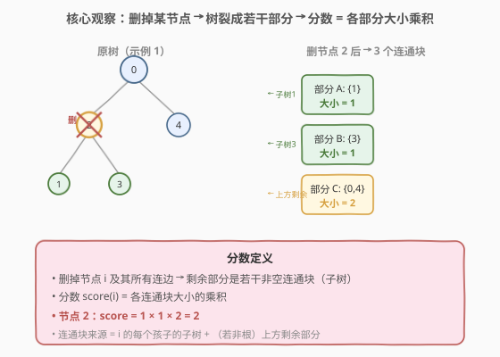
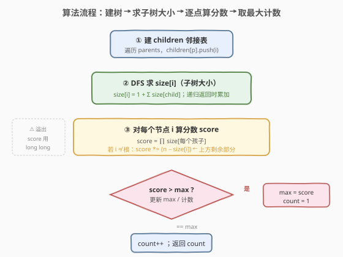
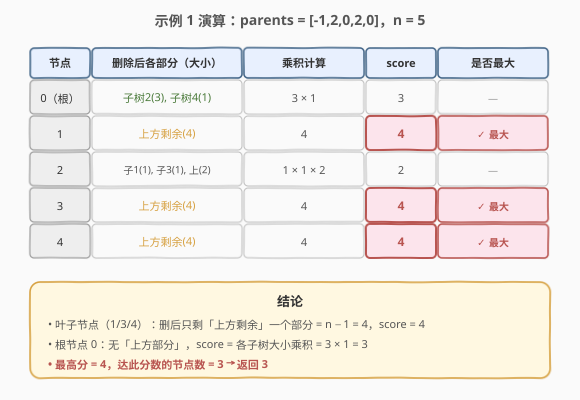

# LeetCode 统计最高分的节点数目 题解

## 1. 题目概述

- **标题 / 题号**：统计最高分的节点数目（#2049，medium）
- **链接**：https://leetcode.cn/problems/count-nodes-with-the-highest-score/
- **难度**：中等
- **标签**：树、深度优先搜索、二叉树

**题意**：给你一棵根节点为 `0` 的**二叉树**，共 `n` 个节点（编号 `0` 到 `n-1`）。给定 `parents`，其中 `parents[i]` 是节点 `i` 的父节点（`parents[0] == -1`）。

一个子树的**大小**为子树内节点数目。每个节点都有一个**分数**：将该节点及其所有连边**删除**后，剩余部分是若干个**非空**子树，分数 = 所有这些子树**大小的乘积**。返回有**最高得分**的节点的**数目**。

**示例 1**：

```text
输入：parents = [-1,2,0,2,0]
输出：3

        0
       / \
      2   4
     / \
    1   3
```

- 节点 0：删后剩子树 {2,1,3}(3) 与 {4}(1) → 3 × 1 = 3
- 节点 1：删后剩上方 {0,2,3,4}(4) → 4
- 节点 2：删后剩 {1}(1)、{3}(1)、上方 {0,4}(2) → 1 × 1 × 2 = 2
- 节点 3：删后剩上方 (4) → 4
- 节点 4：删后剩上方 (4) → 4

最高分 4，共 3 个节点（1、3、4）达到。

**示例 2**：

```text
输入：parents = [-1,2,0]
输出：2

        0
        |
        2
        |
        1
```

- 节点 0：删后剩子树 {2,1}(2) → 2
- 节点 1：删后剩上方 {0,2}(2) → 2
- 节点 2：删后剩 {1}(1)、上方 {0}(1) → 1 × 1 = 1

最高分 2，共 2 个节点（0、1）达到。

**约束**：

- `n == parents.length`
- $2 \leq n \leq 10^5$
- `parents[0] == -1`，其余 $0 \leq$ `parents[i]` $\leq n-1$
- `parents` 表示一棵**二叉树**（每个节点至多 2 个孩子）

> 💡 关键约束是「二叉树」——每个节点删掉后至多产生 **3 个部分**（左子树、右子树、上方剩余），乘积的因子个数固定且很小，只需一次 DFS 求出子树大小即可 $O(n)$ 完成。

## 2. 解题思路

### 2.1 暴力思路：逐节点 BFS/DFS 统计连通块

对每个节点 `i`，模拟「删除 `i`」后从其余节点出发做并查集或 BFS 计算各连通块大小再相乘。单节点 $O(n)$，全体 $O(n^2)$，$n = 10^5$ 必然超时，且**完全没有利用树结构与子树大小可复用的特性**。

### 2.2 核心观察：分数 = 子树大小乘积，一次 DFS 搞定



删掉节点 `i` 后，剩余的连通块**来源固定**：

1. **`i` 的每个孩子的子树**：这些子树原本就挂在 `i` 下，删边后各自独立成一个连通块，大小恰好 = 该孩子子树的大小 `size[child]`。
2. **上方剩余部分**（仅当 `i` 不是根）：整棵树除去 `i` 的子树后剩下的部分，大小 = $n - \text{size}[i]$。

> 💡 **为何上方剩余是一个整体？** 树只有一条路径连接任意两点。删掉 `i` 后，`i` 子树内的节点与子树外节点之间的唯一通道被切断，但子树外的所有节点仍通过根方向互相连通，构成单个连通块。

于是：

$$\text{score}(i) = \left(\prod_{c \in \text{children}(i)} \text{size}[c]\right) \times \begin{cases} 1, & i \text{ 是根} \\ n - \text{size}[i], & i \neq \text{根} \end{cases}$$

- 根节点没有「上方部分」，乘积只含孩子子树（叶子根的乘积为空积 1）。
- 叶子节点没有孩子，乘积只含上方部分（$= n - 1$）。

只需一次后序 DFS 求出所有 `size[i]`，再一次遍历算每个 `score`，最后取最大值并计数即可。

> ⚠️ **溢出陷阱**：$n = 10^5$ 时，三部分各约 $n/3$，乘积可达 $(3.3\times10^4)^3 \approx 3.7\times10^{13}$，**超出 32 位 `int` 范围**（约 $2.1\times10^{9}$）。`score` 与 `maxScore` 必须用 64 位整数 `long long`。

### 2.3 算法流程图



**完整步骤**：

1. **建树**：扫描 `parents`，构造 `children` 邻接表（`children[parents[i]].push(i)`）。
2. **后序 DFS 求 `size`**：从根 `0` 出发递归，`size[i] = 1 + Σ size[c]`；用 `long long` 或 `int` 存均可（$\leq 10^5$ 不溢出 `int`，但乘积需要 `long long`）。
3. **逐节点算 `score`**：
   - `score = 1`（空积初值）；
   - 对 `i` 的每个孩子 `c`：`score *= size[c]`；
   - 若 `i != 0`（非根）：`score *= (n - size[i])`。
4. **维护最大值与计数**：
   - `score > maxScore` → `maxScore = score; count = 1`；
   - `score == maxScore` → `count++`。
5. **返回** `count`。

> 💡 **递归栈深度**：$n = 10^5$ 时树可能退化为链，递归深度达 $10^5$，部分语言（如 Python）会触发默认递归上限。可调高 `sys.setrecursionlimit` 或改用迭代后序遍历。C++ 默认栈足够但也可迭代保平安。

### 2.4 示例演算

以示例 1 `parents = [-1,2,0,2,0]` 为例，树形与各节点分数如下：



| 节点 | 子树大小 size | 删除后各部分（大小） | 乘积 | score |
|------|--------------|---------------------|------|-------|
| 0（根） | 5 | 子树2(3), 子树4(1) | 3 × 1 | 3 |
| 1 | 1 | 上方剩余(4) | 4 | 4 ✓ |
| 2 | 3 | 子1(1), 子3(1), 上(2) | 1 × 1 × 2 | 2 |
| 3 | 1 | 上方剩余(4) | 4 | 4 ✓ |
| 4 | 1 | 上方剩余(4) | 4 | 4 ✓ |

`maxScore = 4`，达此分数的节点有 1、3、4 共 **3** 个，返回 `3` ✓。

> 💡 **观察规律**：叶子节点的分数恒为 $n - 1$（只剩上方部分）。当树存在大量叶子时，$n-1$ 往往就是最高分，本题示例 1 正是如此——三个叶子都拿到 4。

## 3. 参考代码

### C++

```cpp
class Solution {
  public:
    int countHighestScoreNodes(vector<int>& parents) {
        int n = parents.size();
        vector<vector<int>> children(n);
        for (int i = 1; i < n; ++i)
            children[parents[i]].push_back(i);

        vector<int> size(n, 0);
        // 迭代后序 DFS：求每个节点子树大小，避免链状树递归栈过深
        vector<pair<int,int>> stk;          // {node, childIdx}
        stk.push_back({0, 0});
        while (!stk.empty()) {
            auto& [u, idx] = stk.back();
            if (idx < (int)children[u].size()) {
                int c = children[u][idx++];
                stk.push_back({c, 0});
            } else {
                int s = 1;
                for (int c : children[u]) s += size[c];
                size[u] = s;
                stk.pop_back();
            }
        }

        long long maxScore = 0;
        int count = 0;
        for (int i = 0; i < n; ++i) {
            long long score = 1;
            for (int c : children[i]) score *= size[c];   // 各孩子子树
            if (i != 0) score *= (n - size[i]);            // 上方剩余
            if (score > maxScore) {
                maxScore = score;
                count = 1;
            } else if (score == maxScore) {
                ++count;
            }
        }
        return count;
    }
};
```

### Python

```python
class Solution:
    def countHighestScoreNodes(self, parents: List[int]) -> int:
        n = len(parents)
        children = [[] for _ in range(n)]
        for i in range(1, n):
            children[parents[i]].append(i)

        size = [0] * n
        # 迭代后序 DFS，规避链状树的递归深度问题
        stk = [(0, 0)]
        while stk:
            u, idx = stk[-1]
            if idx < len(children[u]):
                stk[-1] = (u, idx + 1)
                stk.append((children[u][idx], 0))
            else:
                s = 1
                for c in children[u]:
                    s += size[c]
                size[u] = s
                stk.pop()

        max_score = 0
        count = 0
        for i in range(n):
            score = 1
            for c in children[i]:
                score *= size[c]
            if i != 0:
                score *= (n - size[i])
            if score > max_score:
                max_score = score
                count = 1
            elif score == max_score:
                count += 1
        return count
```

> 💡 两版均用**迭代后序 DFS** 求子树大小，避免 $n = 10^5$ 链状树时递归栈溢出。`score` 用 `long long`/Python 大整数承接乘积防溢出。整体只遍历树两遍（求 size + 算 score），常数极小。

## 4. 复杂度分析

| 维度 | 复杂度 | 说明 |
|------|--------|------|
| 时间复杂度 | $O(n)$ | 建 `children` 一次 $O(n)$；后序 DFS 每个节点进出栈各一次 $O(n)$；算 score 时每个孩子被访问一次，所有孩子总数 = $n-1$，合计 $O(n)$ |
| 空间复杂度 | $O(n)$ | `children` 邻接表 $O(n)$、`size` 数组 $O(n)$、显式 DFS 栈最坏 $O(n)$（链状树） |
| 最坏情况 | 链状树 | 退化为链时递归/栈深 $n$，但无孩子分支，每节点 score 仅含上方部分，仍 $O(n)$ |

> ⚠️ 暴力法 $O(n^2)$ 的浪费在于「每次删除都重新跑一遍全树连通性」。本题做法把「删除后各部分大小」**预先计算并复用**——子树大小一次 DFS 求出后，任意节点的分数都能 $O(\text{度数})$ 直接组装，是「**预处理 + 组装**」思想在树上的典型应用。

## 5. 扩展：若不是二叉树会怎样？

题目限定为**二叉树**（每个节点至多 2 个孩子），这意味着删掉一个节点后至多产生 3 个部分（2 个孩子子树 + 上方剩余），乘积的因子个数 $\leq 3$，算法本身无需调整。

若**取消二叉树限制**（改为一般树，孩子数不固定）：

- **算法仍然成立**：`score(i)` 依然是「所有孩子子树大小乘积 × 上方剩余（若非根）」，只是因子个数 = 度数，可能很多。
- **溢出风险剧增**：$n = 10^5$ 时若某节点有 $k$ 个孩子各约 $n/k$，乘积 $\approx (n/k)^k$，$k$ 越大乘积越大（$k$ 个相等因子时 $(n/k)^k$ 在 $k \approx n/e$ 处取极大）。极端情况下乘积远超 `long long`，需用**对数比较**：$\log \text{score} = \sum \log(\text{size}_c) + [\text{非根}]\log(n - \text{size}[i])$，用 `double` 比较最大值即可避免大整数运算。
- **最高分节点结构变化**：二叉树下叶子分数恒为 $n-1$ 易成为最大；一般树下「星形树」（根挂 $n-1$ 个叶子）中根节点分数 = $(1)^{n-1} = 1$，叶子分数 = $n-1$，最高分仍集中在叶子。

> 💡 对数比较是处理「大乘积求最值」的通用技巧：当乘积可能溢出时，转为对数域求和再比较，把乘法变加法、把溢出问题转化为浮点精度问题（`double` 有 52 位尾数，本题规模下精度足够区分不同乘积）。

## 6. 面试要点

1. **删除节点后剩余部分具体是哪些？为什么上方剩余是一个整体？**

   > 剩余部分 = 该节点每个孩子的子树 + （若非根）上方剩余。上方剩余之所以是一个整体，是因为树中任意两点间只有一条路径：删除节点 `i` 切断了 `i` 子树内与子树外的连接，但子树外的所有节点仍经由根方向互相可达，构成单一连通块，大小 = $n - \text{size}[i]$。

2. **为什么分数可能溢出 32 位 int？如何处理？**

   > $n = 10^5$ 时三个部分各约 $n/3$，乘积 $\approx 3.7\times10^{13}$，远超 `int` 上界 $2.1\times10^{9}$。用 `long long`（C++）或 Python 自动大整数即可。若为一般树因子更多，可用对数比较避免大整数。

3. **为什么要用迭代 DFS？递归不行吗？**

   > 树可能退化为链，递归深度达 $n = 10^5$。C++ 默认栈通常能承受但仍有风险；Python 默认递归上限 1000，必须 `setrecursionlimit` 或改迭代。面试中写迭代后序更稳妥，体现对边界情况的把控。

4. **根节点和叶子节点的分数有什么特殊性？**

   > 根节点没有「上方部分」，分数 = 各孩子子树大小乘积（若根也是叶子即 $n=1$，但本题 $n\geq2$，根至少有一个孩子）。叶子节点没有孩子，分数 = 上方剩余 = $n - 1$。因此当树有很多叶子时，$n-1$ 常是最高分。

5. **如何避免对每个节点重复遍历其子树？**

   > 预处理 `size` 数组：一次后序 DFS 求出所有节点的子树大小。之后任意节点的分数只需 $O(\text{度数})$ 组装，所有节点的度数之和 = $n-1$，总计算量 $O(n)$。这是「预处理一次、查询多次」的典型模式。

> 💡 **一句话总结**：2049 的灵魂是「**把删点后的连通块大小归约为预处理好的子树大小**」——删点裂成的部分 = 各孩子子树 ∪ 上方剩余，子树大小一次 DFS 求出后，分数 $O(1)$ 组装，整体 $O(n)$。是「树形预处理 + 子树大小复用」的入门范本。

## 同类练习题

| # | 题目 | 与本题的关联 |
|---|------|-------------|
| 2003 | [每棵子树内缺失的最小基因值](https://leetcode.cn/problems/smallest-missing-genetic-value-in-each-subtree/)（[题解](../2001-2100/2003_每棵子树内缺失的最小基因值.md)） | 同样基于 `parents` 建树 + 子树 DFS，对照体会「子树大小/子树集合」的复用思想 |
| 226 | [翻转二叉树](https://leetcode.cn/problems/invert-binary-tree/)（[题解](../0201-0300/226_翻转二叉树.md)） | 二叉树后序遍历基础，承接本题 DFS 求子树属性的写法 |
| 236 | [二叉树的最近公共祖先](https://leetcode.cn/problems/lowest-common-ancestor-of-a-binary-tree/)（[题解](../0101-0200/236_二叉树最近公共祖先.md)） | 后序 DFS 返回子树信息向上汇总，与本题 `size` 自底向上累加同源 |
| 310 | [最小高度树](https://leetcode.cn/problems/minimum-height-trees/) | 树形 DP / 换根法，进一步练习「子树大小 + 上方部分」的分解思路 |
| 1512 | [好数对的数目](https://leetcode.cn/problems/number-of-good-pairs/) | 乘积计数思想对照（组合数 = 乘积/加和的退化形式），体会「大小乘积」在不同场景的体现 |
