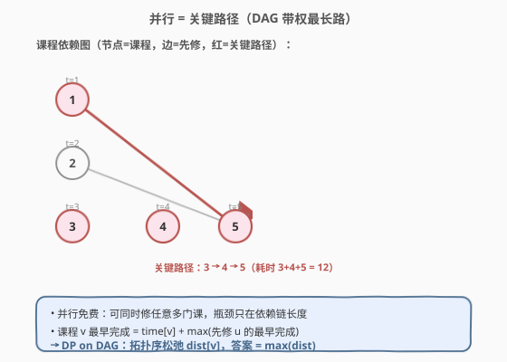
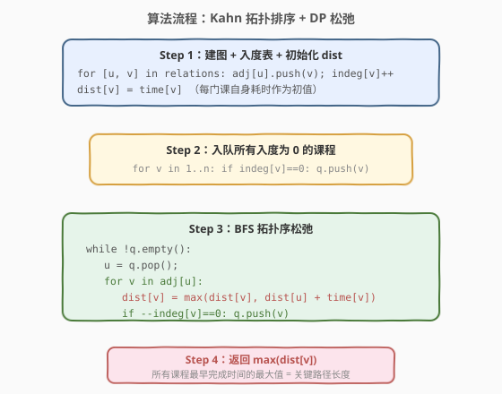
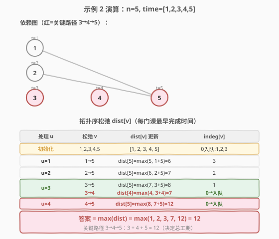

# 并行课程 III

- **题目名称**：并行课程 III
- **链接**：[2050. 并行课程 III](https://leetcode.cn/problems/parallel-courses-iii/)
- **难度**：困难
- **标签**：图、拓扑排序、动态规划、DAG 最长路

## 1. 题目概述

有 `n` 门课程，编号 `1` 到 `n`。数组 `relations[i] = [prevCourse, nextCourse]` 表示 `prevCourse` 是 `nextCourse` 的**先修课**——必须先修完 `prevCourse` 才能开始 `nextCourse`。数组 `time[i]` 表示完成第 `i+1` 门课程需要的**月份数**。

在一个学期里，可以**同时修任意多门**先修条件已满足的课程（并行免费）。每门课一旦开始就需要 `time[i]` 个月才能修完。求修完所有 `n` 门课的**最少月份数**。

**示例 1**：

```text
输入：n = 3, relations = [[1,3],[2,3]], time = [3,2,5]
输出：8

课程 1、2 无先修，可同时开始：
  课程 1 用 3 个月，3 月完成
  课程 2 用 2 个月，2 月完成
课程 3 先修为 {1, 2}，须等两者都完成（max(3,2)=3 月）才能开始
  3 月开始 + 5 个月 = 8 月完成
答案 = 8
```

**示例 2**：

```text
输入：n = 5, relations = [[1,5],[2,5],[3,5],[3,4],[4,5]], time = [1,2,3,4,5]
输出：12

课程 1→2→3 无先修，并行启动，分别在 1/2/3 月完成
课程 4 先修 {3}：3 月开始 + 4 = 7 月完成
课程 5 先修 {1,2,3,4}：须等 max(1,2,3,7)=7 月才能开始，7 + 5 = 12 月完成
答案 = 12（关键路径 3→4→5：3+4+5=12）
```

**约束条件**：

- $1 \le n \le 5 \times 10^4$
- $0 \le \text{relations.length} \le \min(n(n-1)/2, \ 5 \times 10^4)$
- `relations[j]` 中两数不等，无重复边
- `time.length == n`，$1 \le \text{time}[i] \le 10^4$
- 给定图**保证是有向无环图（DAG）**

> 💡 **审题关键**：① 「并行免费」——同时修多少门都不额外消耗时间，所以瓶颈只在**依赖链长度**，而非并行课程数量；② 每门课的完成时间带**权重**（`time[i]` 各不相同），这是与 1136「并行课程」(求学期数、无权) 的核心区别；③ 「最少月份」= 每门课**最早完成时间**的最大值，即 DAG 上的**带权最长路**。

---

## 2. 解题思路

### 2.1 暴力思路：枚举修课顺序

枚举所有满足先修约束的修课顺序（DAG 的所有拓扑序），对每个顺序模拟「逐门开始、算最早完成时间」并取最大值，再在所有顺序里取最小。

- **正确性**：覆盖所有可能，正确。
- **效率**：拓扑序数量随图规模**阶乘级爆炸**，$n = 5 \times 10^4$ 完全不可行。

> ⚠️ 瓶颈在于「顺序」是伪需求。其实我们**不需要决定顺序**——因为并行免费，每门课的最早完成时间只取决于它的先修链，与同层其他课程无关。把视角从「排顺序」切到「算每门课的最早完成」即可。

### 2.2 核心观察：并行免费 → 关键路径（DAG 带权最长路）



本题的关键结构性质有两点：

**性质 1：并行免费 → 每门课的最早完成时间独立可算。**

由于同时修任意多门课都不增加耗时，课程 `v` 的最早完成时间 `dist[v]` 只取决于它的**先修课**中谁最晚完成：

$$\text{dist}[v] = \text{time}[v] + \max_{u \to v} \text{dist}[u]$$

其中 $u \to v$ 表示「`u` 是 `v` 的先修」。无先修的课程 `dist[v] = time[v]`（从 0 时刻开始）。这个递推与「同层有几门课并行」完全无关。

**性质 2：总工期 = 所有课程最早完成时间的最大值。**

所有课程都修完当且仅当最晚的那门修完，所以：

$$\text{答案} = \max_{v} \text{dist}[v]$$

这正是 DAG 上**带权最长路**的长度——每个节点带权 `time[v]`，路径权值和最大的那条路径就是「关键路径」，它的长度决定总工期。

> 💡 这就是工程上的**关键路径法（Critical Path Method, CPM）**：项目工期由耗时最长的依赖链决定，缩短非关键路径上的任务不会缩短总工期。

**性质 3：递推顺序 = 拓扑序。**

`dist[v]` 依赖所有先修 `u` 的 `dist[u]`，所以必须**先算完所有先修再算 `v`**——这正是拓扑序。用 Kahn 算法（BFS 拓扑排序）一边剥零入度节点、一边松弛后继的 `dist`，一趟即可完成。

### 2.3 算法流程图



四步走：

1. **建图 + 入度表 + 初始化 `dist`**：邻接表 `adj[u]` 存后继；`indeg[v]` 存入度；`dist[v] = time[v]`（自身耗时作为初值，因为每门课至少要花 `time[v]` 个月）。
2. **入队所有入度为 0 的课程**：它们无先修，可立即开始，`dist` 已是最终值。
3. **BFS 拓扑序松弛**：每弹出一个 `u`，遍历后继 `v`，用 `dist[u] + time[v]` 尝试更新 `dist[v]`（`dist[v] = max(dist[v], dist[u] + time[v])`），并把入度减到 0 的后继入队。
4. **返回 `max(dist[v])`**：所有课程最早完成时间的最大值。

> ⚠️ **为什么 `dist[v]` 的初值是 `time[v]` 而不是 0？** 因为松弛时用的是 `dist[u] + time[v]`（先修完成后再花 `time[v]` 学 `v`），这隐含了 `dist[v]` 至少为 `time[v]`。对无先修的叶子节点，初值 `time[v]` 就是它的最早完成时间。把 `time[v]` 放在松弛时累加、初值设 `time[v]`，是等价的——只要保证每个节点都被加了一次 `time[v]`。

### 2.4 示例演算



以示例 2 为例，`n=5, relations = [[1,5],[2,5],[3,5],[3,4],[4,5]], time = [1,2,3,4,5]`：

**初始化**：`dist = [1, 2, 3, 4, 5]`，入度为 0 的课程 1、2、3 入队。

**拓扑松弛过程**：

| 处理 u | 松弛 v | dist[v] 更新 | 说明 |
|--------|--------|--------------|------|
| u=1 | 1→5 | `dist[5] = max(5, 1+5) = 6` | 课程 1 完成于 1 月，5 可从 1 月起 |
| u=2 | 2→5 | `dist[5] = max(6, 2+5) = 7` | 课程 2 完成于 2 月，5 取更晚者 |
| u=3 | 3→5 | `dist[5] = max(7, 3+5) = 8` | 课程 3 完成于 3 月 |
| u=3 | 3→4 | `dist[4] = max(4, 3+4) = 7` | 课程 4 完成于 3+4=7 月，入队 |
| u=4 | 4→5 | `dist[5] = max(8, 7+5) = 12` | **关键松弛**：课程 4 完成于 7 月，5 须等至 7 月 |

**答案**：`max(dist) = max(1, 2, 3, 7, 12) = 12`。

> 💡 **关键瞬间在 u=4 松弛 5**：在课程 4 处理之前，`dist[5]` 一直被先修 1/2/3 推到 8，看似 8 即为答案。但课程 4 也是 5 的先修，且 `dist[4]=7 > dist[3]=3`，所以 5 实际要等到 7 月才能开始，最终 `dist[5]=12`。这正是「**所有先修**都要完成」的体现——拓扑排序保证处理 5 之前，它的所有先修（含 4）都已松弛过。

---

## 3. 参考代码

### C++

```cpp
class Solution {
public:
    int minimumTime(int n, vector<vector<int>>& relations, vector<int>& time) {
        vector<vector<int>> adj(n + 1);
        vector<int> indeg(n + 1, 0);
        for (auto& r : relations) {
            adj[r[0]].push_back(r[1]);
            indeg[r[1]]++;
        }

        // dist[v] = 课程 v 的最早完成时间，初值 = 自身耗时
        vector<int> dist(n + 1);
        for (int i = 1; i <= n; i++) dist[i] = time[i - 1];

        queue<int> q;
        for (int i = 1; i <= n; i++) {
            if (indeg[i] == 0) q.push(i);
        }

        while (!q.empty()) {
            int u = q.front(); q.pop();
            for (int v : adj[u]) {
                // 松弛：先修 u 完成后，v 至少要 dist[u] + time[v] 才能完成
                dist[v] = max(dist[v], dist[u] + time[v - 1]);
                if (--indeg[v] == 0) q.push(v);
            }
        }

        return *max_element(dist.begin() + 1, dist.end());
    }
};
```

### Python

```python
class Solution:
    def minimumTime(self, n: int, relations: List[List[int]], time: List[int]) -> int:
        adj = [[] for _ in range(n + 1)]
        indeg = [0] * (n + 1)
        for u, v in relations:
            adj[u].append(v)
            indeg[v] += 1

        # dist[v] = 课程 v 的最早完成时间，初值 = 自身耗时
        dist = [0] + list(time)

        q = deque(i for i in range(1, n + 1) if indeg[i] == 0)

        while q:
            u = q.popleft()
            for v in adj[u]:
                # 松弛：先修 u 完成后，v 至少要 dist[u] + time[v-1] 才能完成
                if dist[u] + time[v - 1] > dist[v]:
                    dist[v] = dist[u] + time[v - 1]
                indeg[v] -= 1
                if indeg[v] == 0:
                    q.append(v)

        return max(dist[1:])
```

> ⚠️ **下标细节**：`time` 是 0-indexed（`time[i]` 是课程 `i+1`），而课程编号 `v` 是 1-indexed，所以取耗时要用 `time[v - 1]`。这是本题最易踩的坑。

---

## 4. 复杂度分析

| 维度 | 复杂度 | 说明 |
|------|--------|------|
| 建图时间 | $O(n + m)$ | 遍历 `relations` 建邻接表与入度表 |
| BFS 时间 | $O(n + m)$ | 每个节点入队/出队各 1 次，每条边松弛 1 次 |
| 总时间 | $O(n + m)$ | 拓扑排序主导，线性 |
| 空间 | $O(n + m)$ | 邻接表 $O(n + m)$ + `indeg`/`dist`/队列 $O(n)$ |

> 💡 本题 $n, m \le 5 \times 10^4$，$O(n + m)$ 约 $10^5$ 量级，远在时限内。关键路径长度（答案）上界为 $n \times \max(\text{time}) = 5 \times 10^4 \times 10^4 = 5 \times 10^8$，用 `int` 不会溢出。

---

## 5. 扩展：DFS + 记忆化求 DAG 最长路

除了 Kahn 拓扑排序，还可以用**带记忆化的 DFS** 直接递归计算 `dist[v]`：

```python
class Solution:
    def minimumTime(self, n: int, relations: List[List[int]], time: List[int]) -> int:
        adj = [[] for _ in range(n + 1)]
        for u, v in relations:
            adj[u].append(v)

        # prereq[v] = v 的所有先修；为了 DFS 直接用「先修→后继」不如用「后修→先修」
        prereq = [[] for _ in range(n + 1)]
        for u, v in relations:
            prereq[v].append(u)

        @cache
        def finish(v: int) -> int:
            # v 的最早完成时间 = 自身耗时 + max(先修完成时间)
            best = 0
            for u in prereq[v]:
                best = max(best, finish(u))
            return best + time[v - 1]

        return max(finish(v) for v in range(1, n + 1))
```

| 维度 | Kahn 拓扑 + DP（推荐） | DFS + 记忆化 |
|------|------------------------|--------------|
| 实现风格 | 迭代，显式队列 | 递归，`@cache` 隐式记忆化 |
| 栈溢出风险 | 无 | 递归深度可达 $n=5 \times 10^4$，Python 需 `sys.setrecursionlimit`，C++ 可能爆栈 |
| 额外建表 | 不需要 | 需额外建「后修→先修」反向表（或正向 DFS 时累加后继） |
| 不可达检测 | 入度清零即完成 | 天然处理（DAG 保证递归终止） |

> 💡 DAG 上的 DP 既可「拓扑序自底向上」（Kahn），也可「记忆化自顶向下」（DFS）。两者等价，选哪个看个人偏好与递归深度风险。本题 $n$ 较大，迭代 Kahn 更稳妥。

---

## 6. 面试要点

1. **为什么答案是最长依赖链而不是学期数？**

   - 题目允许「同时修任意多门课」，并行免费，所以瓶颈只在依赖链长度。每门课带各自耗时 `time[v]`，所以「最少月份」= 每门课最早完成时间的最大值 = DAG 带权最长路。这与「每学期最多修 k 门」的变体（求学期数）截然不同。

2. **`dist[v] = time[v] + max(dist[u])` 的递推为什么正确？**

   - 课程 `v` 必须在**所有**先修都完成后才能开始，所以开始时刻 = `max(dist[u])`（先修中最晚完成的时刻）。再花 `time[v]` 学完，完成时刻 = 开始 + `time[v]`。无先修时 `max` 为 0，`dist[v] = time[v]`。

3. **为什么用拓扑排序而不是 Dijkstra？**

   - 本质都是「按依赖顺序松弛」。Dijkstra 适用于**带正权的任意图**求最短/最长路；而 DAG 是无环特殊结构，拓扑序天然给出松弛顺序，无需优先队列，复杂度从 $O(m \log n)$ 降到 $O(n + m)$。DAG 上的最长路用拓扑排序是教科书做法。

4. **`dist[v]` 的初值为什么设 `time[v]` 而不是 0？**

   - 松弛时累加 `dist[u] + time[v]`，隐含 `dist[v]` 至少为 `time[v]`。对无先修的叶子节点，没有任何松弛会更新它，所以初值必须就是 `time[v]` 才正确。设 0 会让叶子节点的完成时间算成 0，错误。

5. **如果图可能有环（不保证 DAG）怎么办？**

   - Kahn 拓扑排序中，若队列为空时已处理节点数 `< n`，说明存在环——本题保证无环，但若需检测，加一个计数器 `processed`，最终 `processed != n` 即判有环。带环的「最长路」无意义（可无限绕环），需先判环。

---

## 7. 同类练习题

- [1136. 平行课程](https://leetcode.cn/problems/parallel-courses/)：本题的无权版——每学期可修任意多门，求**最少学期数**（= 拓扑序最大层数 / DAG 无权最长路），把 `time[v]` 全看成 1 即可
- [207. 课程表](https://leetcode.cn/problems/course-schedule/)：拓扑排序判可行性（能否修完 = 是否有环），Kahn 模板的基础应用
- [210. 课程表 II](https://leetcode.cn/problems/course-schedule-ii/)：返回一种合法的拓扑序，承接 207 升级为「输出顺序」
- [329. 矩阵中的最长递增路径](https://leetcode.cn/problems/longest-increasing-path-in-a-matrix/)：DAG 带权最长路的另一形态——把矩阵中「相邻且递增」视作有向边，DFS + 记忆化求最长路径
- [1857. 有向图中最大颜色值](https://leetcode.cn/problems/largest-color-value-in-a-directed-graph/)：拓扑排序 + DP 在 DAG 上求每种颜色的最大频次，同样是「拓扑序松弛状态」家族
