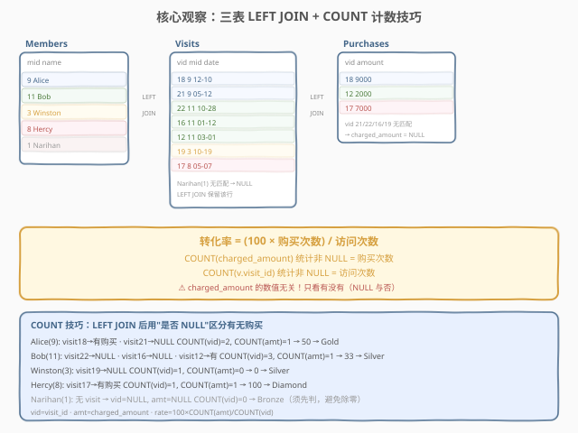
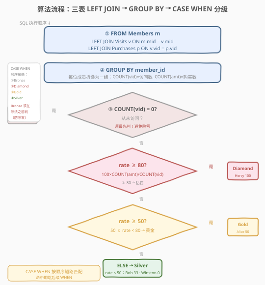
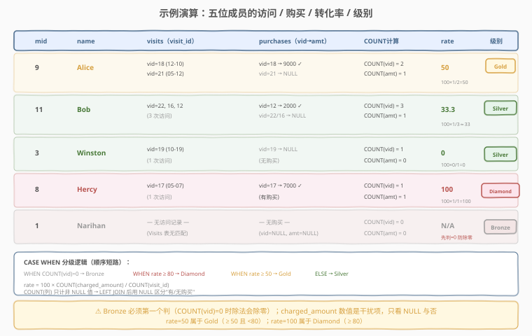

# 商店中每个成员的级别

- **题目名称**：商店中每个成员的级别
- **链接**：[2051. 商店中每个成员的级别 🔒](https://leetcode.cn/problems/the-category-of-each-member-in-the-store/)
- **难度**：中等
- **标签**：数据库、SQL、`LEFT JOIN`、`GROUP BY`、`COUNT` 的 NULL 计数语义、`CASE WHEN` 顺序短路、除零防护、LeetCode 锁题

## 1. 题目概述

给定 `Members`（成员）、`Visits`（访问）、`Purchases`（购买）三张表，编写 SQL 查询，为每位成员计算**转化率**并据此分级，输出 `member_id`、`name`、`category` 三列。结果可按任意顺序返回。

**转化率定义**：

$$
\text{rate} = \frac{100 \times \text{该成员的购买次数}}{\text{该成员的访问次数}}
$$

**分级规则**（共四级）：

| 级别 | 条件 |
|------|------|
| **Diamond（钻石）** | 转化率 $\ge 80$ |
| **Gold（黄金）** | 转化率 $\ge 50$ 且 $< 80$ |
| **Silver（白银）** | 转化率 $< 50$ |
| **Bronze（青铜）** | 该成员从未访问过商店（访问次数为 0） |

> 💡 注意：「购买次数」指该成员**有过购买记录的访问数**（即 `Purchases` 表中匹配到的行数），与 `charged_amount` 的金额数值**无关**——只看有没有购买，不看买了多少。

**表结构**：

```text
Table: Members
+-------------+---------+
| Column Name | Type    |
+-------------+---------+
| member_id   | int     |  ← 主键
| name        | varchar |
+-------------+---------+
每行表示一位成员的 ID 和姓名。

Table: Visits
+-------------+------+
| Column Name | Type |
+-------------+------+
| visit_id    | int  |  ← 主键
| member_id   | int  |  → Members.member_id 外键
| visit_date  | date |
+-------------+------+
每行记录一次访问商店的日期与访问成员。

Table: Purchases
+----------------+------+
| Column Name    | Type |
+----------------+------+
| visit_id       | int  |  ← 主键 / → Visits.visit_id 外键
| charged_amount | int  |
+----------------+------+
每行记录某次访问中的消费金额。
visit_id 既是本表主键又是外键 → 每次访问最多一笔购买。
```

**输出列**：`member_id`、`name`、`category`。结果无顺序要求。

**示例 1**：

```text
输入：
Members 表:
+-----------+---------+
| member_id | name    |
+-----------+---------+
| 9         | Alice   |
| 11        | Bob     |
| 3         | Winston |
| 8         | Hercy   |
| 1         | Narihan |
+-----------+---------+

Visits 表:
+----------+-----------+------------+
| visit_id | member_id | visit_date |
+----------+-----------+------------+
| 22       | 11        | 2021-10-28 |
| 16       | 11        | 2021-01-12 |
| 18       | 9         | 2021-12-10 |
| 19       | 3         | 2021-10-19 |
| 12       | 11        | 2021-03-01 |
| 17       | 8         | 2021-05-07 |
| 21       | 9         | 2021-05-12 |
+----------+-----------+------------+

Purchases 表:
+----------+----------------+
| visit_id | charged_amount |
+----------+----------------+
| 12       | 2000           |
| 18       | 9000           |
| 17       | 7000           |
+----------+----------------+

输出:
+-----------+---------+----------+
| member_id | name    | category |
+-----------+---------+----------+
| 1         | Narihan | Bronze   |
| 3         | Winston | Silver   |
| 8         | Hercy   | Diamond  |
| 9         | Alice   | Gold     |
| 11        | Bob     | Silver   |
+-----------+---------+----------+
```

**解释**：

| member_id | name | 访问次数 | 购买次数 | 转化率计算 | rate | 级别 |
|-----------|------|---------|---------|-----------|------|------|
| 1 | Narihan | 0 | 0 | —（从未访问） | N/A | Bronze |
| 3 | Winston | 1 | 0 | $100 \times 0 / 1$ | $0$ | Silver |
| 8 | Hercy | 1 | 1 | $100 \times 1 / 1$ | $100$ | Diamond |
| 9 | Alice | 2 | 1 | $100 \times 1 / 2$ | $50$ | Gold |
| 11 | Bob | 3 | 1 | $100 \times 1 / 3$ | $\approx 33.3$ | Silver |

> 💡 本题是 SQL **"多表 LEFT JOIN + COUNT 的 NULL 计数 + CASE WHEN 顺序防护"招牌题**——核心三步：① 三表 `LEFT JOIN` 保留所有成员（含从未访问者）；② 利用 `COUNT(列)` 只计非 NULL 的特性，`COUNT(v.visit_id)` 数访问、`COUNT(p.charged_amount)` 数购买；③ `CASE WHEN` 按 Bronze→Diamond→Gold→Silver 顺序短路，**Bronze 必须最先判**以避免除零。难点有二：识别 `charged_amount` 金额是干扰项（只看 NULL 与否）；以及 CASE 顺序对除零防护的必要性。

---

## 2. 解题思路

### 2.1 暴力思路：逐成员枚举统计

最直觉的过程式思路：对每位成员，遍历 `Visits` 表数其访问次数，再遍历 `Purchases` 表数其有购买的访问数，算转化率后分级。伪代码：

```text
result = []
for m in Members:
    visits = [v for v in Visits if v.member_id == m.member_id]
    purchases = [p for p in Purchases if p.visit_id in {v.visit_id for v in visits}]
    if len(visits) == 0:
        category = 'Bronze'
    else:
        rate = 100 * len(purchases) / len(visits)
        if rate >= 80:    category = 'Diamond'
        elif rate >= 50:  category = 'Gold'
        else:             category = 'Silver'
    result.append((m.member_id, m.name, category))
```

逻辑正确，但 SQL 表达「逐成员折叠统计」最自然的方式是**分组聚合**——按 `member_id` 分组后用 `COUNT` 统计。关键是把三张表关联到同一行集，再用 `COUNT` 的 NULL 语义区分"有/无购买"。

### 2.2 核心观察：三表 LEFT JOIN + COUNT 的 NULL 计数技巧



**关键洞察**：`COUNT(列名)` 只统计**非 NULL** 值的个数，而 `COUNT(*)` 统计所有行。经过 `LEFT JOIN` 后，未匹配的行对应列值为 `NULL`——这恰好让我们用 `COUNT` 自动区分"有无"：

1. **`Members LEFT JOIN Visits`**：从未访问的成员（如 Narihan）仍保留一行，但 `v.visit_id` 为 `NULL`。此时 `COUNT(v.visit_id) = 0`。

2. **`LEFT JOIN Purchases`**：访问了但未购买的访问行（如 visit 21），`p.charged_amount` 为 `NULL`。此时该行不增加 `COUNT(p.charged_amount)`。

3. **`COUNT(v.visit_id)`** = 访问次数（非 NULL 的 visit_id 行数）。
   **`COUNT(p.charged_amount)`** = 购买次数（非 NULL 的 charged_amount 行数）。

> 💡 **为何用 `LEFT JOIN` 而非 `INNER JOIN`？** 题目要求输出**所有成员**的级别，包括从未访问者（Bronze）。`INNER JOIN` 会丢弃无访问的成员，导致漏行。两层都必须 `LEFT JOIN`：第一层保留无访问的成员，第二层保留无购买的访问。

> ⚠️ **`charged_amount` 是干扰项**：转化率只关心"有没有购买"（COUNT 行数），不关心"买了多少钱"（SUM 金额）。9000、2000、7000 这些金额数值**完全不影响结果**——即使全部改成 1，输出也不变。这是本题最容易踩的思维陷阱：看到 `charged_amount` 就想 `SUM`，但实际只需 `COUNT`。

> ⚠️ **`COUNT(列)` vs `COUNT(*)` 不可混用**：若误用 `COUNT(*)`，则 `LEFT JOIN` 后每组行数 = 访问次数（因为即使无购买也有一行 NULL），无法区分有无购买。必须用 `COUNT(p.charged_amount)`——非 NULL 才计入——才能正确统计购买次数。

### 2.3 算法流程图



**逻辑执行步骤**：

| 步骤 | 子句 | 作用 |
|------|------|------|
| ① | `FROM Members m LEFT JOIN Visits v LEFT JOIN Purchases p` | 三表关联，保留所有成员（含无访问者与无购买者） |
| ② | `GROUP BY member_id` | 按成员折叠：`COUNT(v.visit_id)` = 访问数，`COUNT(p.charged_amount)` = 购买数 |
| ③ | `CASE WHEN COUNT(v.visit_id) = 0 THEN 'Bronze'` | **最先判**：无访问 → Bronze（避免后续除零） |
| ④ | `WHEN 100 * COUNT(amt) / COUNT(vid) >= 80 THEN 'Diamond'` | rate ≥ 80 → 钻石 |
| ⑤ | `WHEN 100 * COUNT(amt) / COUNT(vid) >= 50 THEN 'Gold'` | 50 ≤ rate < 80 → 黄金 |
| ⑥ | `ELSE 'Silver'` | rate < 50 → 白银 |

> 💡 **CASE WHEN 顺序为何关键？** `CASE WHEN` 按从上到下顺序短路匹配——命中即跳后续。Bronze 判断 `COUNT(vid) = 0` 必须放在除法**之前**：当访问次数为 0 时，`100 * COUNT(amt) / COUNT(vid)` 会除以零。MySQL 中 `x / 0` 返回 `NULL`（不报错），`NULL >= 80` 为 UNKNOWN（视为不满足），`NULL >= 50` 同理——最终落入 `ELSE 'Silver'`。**这会让 Narihan 错误地变成 Silver 而非 Bronze！** 因此 Bronze 必须第一个判，在除法发生前就把零访问者拦截。

> 💡 **SQL 子句执行顺序**：`FROM`（含 `JOIN`/`ON`）→ `WHERE` → `GROUP BY` → `HAVING` → `SELECT`（含 `CASE WHEN`）→ `ORDER BY` → `LIMIT`。`CASE WHEN` 在 `SELECT` 阶段执行，即分组聚合完成之后——此时 `COUNT` 已算好，`CASE` 直接引用聚合结果做分级。

### 2.4 示例演算

以示例 1 的 5 位成员为例，观察「LEFT JOIN → GROUP BY 计数 → CASE WHEN 分级」的逐步过程：



**步骤 ①：三表 LEFT JOIN 后的行集**

| member_id | name | visit_id | charged_amount | 说明 |
|-----------|------|----------|----------------|------|
| 9 | Alice | 18 | 9000 | 访问+购买 |
| 9 | Alice | 21 | NULL | 访问但未购买 |
| 11 | Bob | 22 | NULL | 访问但未购买 |
| 11 | Bob | 16 | NULL | 访问但未购买 |
| 11 | Bob | 12 | 2000 | 访问+购买 |
| 3 | Winston | 19 | NULL | 访问但未购买 |
| 8 | Hercy | 17 | 7000 | 访问+购买 |
| 1 | Narihan | NULL | NULL | 无访问（LEFT JOIN 保留） |

> 💡 Narihan 的行是 `LEFT JOIN Visits` 产生的保底行——`visit_id` 和 `charged_amount` 均为 NULL。这正是 `COUNT(v.visit_id) = 0` 判定 Bronze 的依据。

**步骤 ②：GROUP BY member_id + COUNT**

| member_id | name | COUNT(v.visit_id) | COUNT(charged_amount) | rate = 100×购买/访问 |
|-----------|------|-------------------|----------------------|---------------------|
| 9 | Alice | 2 | 1 | $100 \times 1 / 2 = 50$ |
| 11 | Bob | 3 | 1 | $100 \times 1 / 3 \approx 33.3$ |
| 3 | Winston | 1 | 0 | $100 \times 0 / 1 = 0$ |
| 8 | Hercy | 1 | 1 | $100 \times 1 / 1 = 100$ |
| 1 | Narihan | 0 | 0 | —（除零，跳过） |

**步骤 ③：CASE WHEN 分级（顺序短路）**

| member_id | COUNT(vid)=0? | rate≥80? | rate≥50? | ELSE | 级别 |
|-----------|---------------|----------|----------|------|------|
| 9 | 否 | 否（50<80） | **是** | — | Gold |
| 11 | 否 | 否 | 否 | **落此** | Silver |
| 3 | 否 | 否 | 否 | **落此** | Silver |
| 8 | 否 | **是** | — | — | Diamond |
| 1 | **是** | — | — | — | Bronze |

> ⚠️ **Narihan 是除零陷阱**：若 Bronze 判断不是第一个 WHEN，则 `100 * 0 / 0 = NULL`，后续所有 `>=` 比较都为 UNKNOWN，落入 ELSE → 错判 Silver。Bronze 必须最先判，在除法前拦截零访问者。

> 💡 **Alice 是边界值**：rate 恰为 50，满足 `>= 50` → Gold。若题目改为"严格大于 50"则 Alice 会落 Silver。`>= 50` 包含 50 本身——这与"≥ 80 且 < 80"的区间划分一致：Diamond 占 $[80, +\infty)$，Gold 占 $[50, 80)$，Silver 占 $[0, 50)$（不含零访问者）。

---

## 3. 参考代码

### SQL（解法 A：三表 LEFT JOIN + GROUP BY + CASE WHEN，推荐）

```sql
SELECT
    m.member_id,
    m.name,
    CASE
        WHEN COUNT(v.visit_id) = 0 THEN 'Bronze'
        WHEN 100 * COUNT(p.charged_amount) / COUNT(v.visit_id) >= 80 THEN 'Diamond'
        WHEN 100 * COUNT(p.charged_amount) / COUNT(v.visit_id) >= 50 THEN 'Gold'
        ELSE 'Silver'
    END AS category
FROM Members m
LEFT JOIN Visits v ON m.member_id = v.member_id
LEFT JOIN Purchases p ON v.visit_id = p.visit_id
GROUP BY m.member_id, m.name;
```

> 💡 **写法要点**：
> - **两层 `LEFT JOIN`**：第一层 `Members LEFT JOIN Visits` 保留无访问成员；第二层 `LEFT JOIN Purchases` 保留无购买访问。两层都必须 LEFT，缺一不可。
> - **`COUNT(v.visit_id)` 数访问**：非 NULL 的 visit_id 行 = 有访问记录的行数。无访问成员此值为 0。
> - **`COUNT(p.charged_amount)` 数购买**：非 NULL 的 charged_amount 行 = 有购买记录的行数。无购买访问此值不增加。
> - **`CASE WHEN` 顺序**：Bronze（`= 0`）→ Diamond（`>= 80`）→ Gold（`>= 50`）→ ELSE Silver。Bronze 必须最先，防除零。
> - **`GROUP BY m.member_id, m.name`**：MySQL 严格模式 `ONLY_FULL_GROUP_BY` 下，`SELECT` 中的非聚合列须出现在 `GROUP BY` 中。`name` 函数依赖于 `member_id`（主键），但显式写出更可移植。
> - ✓ **最推荐**：一句搞定，JOIN + 聚合 + 分级一气呵成。

### SQL（解法 B：CTE 预聚合计数再分级，职责分离）

```sql
WITH MemberStats AS (
    SELECT
        m.member_id,
        m.name,
        COUNT(v.visit_id)       AS visit_cnt,
        COUNT(p.charged_amount) AS purchase_cnt
    FROM Members m
    LEFT JOIN Visits v     ON m.member_id = v.member_id
    LEFT JOIN Purchases p  ON v.visit_id  = p.visit_id
    GROUP BY m.member_id, m.name
)
SELECT
    member_id,
    name,
    CASE
        WHEN visit_cnt = 0 THEN 'Bronze'
        WHEN 100 * purchase_cnt / visit_cnt >= 80 THEN 'Diamond'
        WHEN 100 * purchase_cnt / visit_cnt >= 50 THEN 'Gold'
        ELSE 'Silver'
    END AS category
FROM MemberStats;
```

> 💡 **解法 B 的思路**：先在 CTE `MemberStats` 中完成三表 JOIN + 分组计数，把 `visit_cnt` 和 `purchase_cnt` 物化为普通列；外层 `SELECT` 只做 `CASE WHEN` 分级——此时 `visit_cnt`、`purchase_cnt` 已是标量值，无需再写 `COUNT`，逻辑更清晰。
>
> **与解法 A 的关系**：逻辑完全等价。区别在于**职责分层**——解法 A 把"关联计数"与"分级"揉在一个 `SELECT`，解法 B 拆成两层：CTE 管聚合、外层管分级。当分级逻辑复杂（如更多级别、额外条件）时，解法 B 的分层更易维护；单看本题，解法 A 更简洁。MySQL 8.0+ 支持 CTE。

### SQL（解法 C：子查询计数，对照思路）

```sql
SELECT
    m.member_id,
    m.name,
    CASE
        WHEN (
            SELECT COUNT(*) FROM Visits v WHERE v.member_id = m.member_id
        ) = 0 THEN 'Bronze'
        WHEN 100 * (
            SELECT COUNT(*) FROM Purchases p
            JOIN Visits v ON p.visit_id = v.visit_id
            WHERE v.member_id = m.member_id
        ) / (
            SELECT COUNT(*) FROM Visits v WHERE v.member_id = m.member_id
        ) >= 80 THEN 'Diamond'
        WHEN 100 * (
            SELECT COUNT(*) FROM Purchases p
            JOIN Visits v ON p.visit_id = v.visit_id
            WHERE v.member_id = m.member_id
        ) / (
            SELECT COUNT(*) FROM Visits v WHERE v.member_id = m.member_id
        ) >= 50 THEN 'Gold'
        ELSE 'Silver'
    END AS category
FROM Members m;
```

> 💡 **解法 C 的思路**：对每位成员用相关子查询分别统计访问数和购买数，无需 `JOIN`/`GROUP BY`。最贴近 2.1 节的暴力伪代码。
>
> **与解法 A/B 的对比**：
> - **可读性**：较差——同一个子查询（购买数）重复出现两次，冗长易错。
> - **性能**：相关子查询对每位成员独立执行多次 `COUNT`，最坏 $O(M \cdot (V + P))$（$M$ 成员数、$V$ 访问数、$P$ 购买数）；解法 A/B 用哈希连接 + 哈希分组为 $O(M + V + P)$。数据量大时 A/B 明显更优。
> - **何时用**：仅当需要"逐成员视角"且数据量小时作为对照写法。生产环境优先 A/B。

### Python（pandas）

```python
import pandas as pd
import numpy as np

def store_category(members: pd.DataFrame, visits: pd.DataFrame, purchases: pd.DataFrame) -> pd.DataFrame:
    df = (
        members
        .merge(visits, on='member_id', how='left')
        .merge(purchases, on='visit_id', how='left')
    )
    stats = df.groupby(['member_id', 'name'], as_index=False).agg(
        visit_cnt=('visit_id', 'count'),
        purchase_cnt=('charged_amount', 'count'),
    )
    rate = np.where(
        stats['visit_cnt'] == 0,
        np.nan,
        100 * stats['purchase_cnt'] / stats['visit_cnt'],
    )
    stats['category'] = np.select(
        [stats['visit_cnt'] == 0, rate >= 80, rate >= 50],
        ['Bronze', 'Diamond', 'Gold'],
        default='Silver',
    )
    return stats[['member_id', 'name', 'category']]
```

> 💡 **pandas 对照**：
> - `.merge(visits, on='member_id', how='left')`——对应 `Members LEFT JOIN Visits`；`.merge(purchases, on='visit_id', how='left')`——对应 `LEFT JOIN Purchases`。`how='left'` 等价于 `LEFT JOIN`，保留左表全部行。
> - `.groupby(...).agg(visit_cnt=('visit_id', 'count'), ...)`——pandas 的 `count` 聚合**天然跳过 NaN/NULL**，与 SQL 的 `COUNT(列)` 语义一致。无访问的成员 `visit_id` 为 NaN，`count` 结果为 0。
> - `np.where(visit_cnt == 0, np.nan, ...)`——先处理除零：访问为 0 时 rate 设为 NaN（不参与比较），对应 SQL 中 Bronze 最先判。
> - `np.select([cond1, cond2, cond3], [val1, val2, val3], default='Silver')`——`np.select` 按顺序匹配第一个 True 的条件，**与 SQL 的 `CASE WHEN` 顺序短路完全对应**：先 Bronze、再 Diamond、再 Gold、兜底 Silver。

---

## 4. 复杂度分析

| 维度 | 解法 A（JOIN+CASE） | 解法 B（CTE） | 解法 C（子查询） | pandas |
|------|---------------------|---------------|-------------------|--------|
| **时间** | $O(M + V + P)$ | $O(M + V + P)$ | $O(M \cdot (V + P))$（最坏） | $O(M + V + P)$ |
| **空间** | $O(V + P)$（连接中间表） | $O(M)$（CTE 物化） | $O(1)$（无中间表） | $O(M + V + P)$ |
| **扫表次数** | 各表 1 次 | 各表 1 次 | Visits/Purchases 最多 $M$ 次 | 各表 1 次 |
| **可读性** | ✓ 简洁 | ✓ 分层清晰 | ✗ 子查询冗长 | ✓ 清晰 |
| **推荐度** | ✓ **首选** | ✓ 复杂场景 | ✗ 对照/小数据 | ✓ 验证用 |

> - $M$ = `Members` 行数，$V$ = `Visits` 行数，$P$ = `Purchases` 行数。
> - **解法 A/B 时间复杂度**：两层 `LEFT JOIN` 用哈希连接 $O(M + V + P)$，`GROUP BY` 哈希分组 $O(V + P)$，`CASE WHEN` 对每组 $O(1)$ 判定，总体线性。
> - **解法 C**：每位成员独立执行 3 个相关子查询（1 个访问数 + 2 个购买数），最坏 $O(M \cdot (V + P))$；若 `Visits(member_id)` 与 `Purchases(visit_id)` 上有索引可降为 $O(M \cdot \log(V + P))$，但仍劣于 A/B。
> - **空间**：解法 A 的连接中间表含 $V$ 行（每次访问一行，含购买金额列），分组后缩为 $M$ 行；解法 B 需额外物化 $M$ 行 `MemberStats`；解法 C 无中间表。
> - **索引优化**：在 `Visits(member_id)` 与 `Purchases(visit_id)` 上建索引可加速连接（嵌套循环连接走索引查找）；现代优化器通常用哈希连接，对索引依赖较小。

---

## 5. 扩展：COUNT 的 NULL 语义与除零防护

### 5.1 COUNT 的四种形态对比

`COUNT` 是 SQL 中对 NULL 最敏感的聚合函数。理解其四种形态是本题的核心：

| 写法 | 统计对象 | NULL 行是否计入 | 本题用途 |
|------|---------|----------------|----------|
| `COUNT(*)` | 所有行 | ✓ 计入 | ✗ 不可用（LEFT JOIN 后无购买行也有 NULL 行，会多计） |
| `COUNT(v.visit_id)` | visit_id 非 NULL 的行 | ✗ 不计入 | ✓ 数访问次数 |
| `COUNT(p.charged_amount)` | charged_amount 非 NULL 的行 | ✗ 不计入 | ✓ 数购买次数 |
| `COUNT(DISTINCT col)` | col 的不同非 NULL 值 | ✗ 不计入 | —（本题无需去重） |

> 💡 **口诀**：`COUNT(*)` 数行（含 NULL），`COUNT(列)` 数非 NULL 值。`LEFT JOIN` 产生的 NULL 行，`COUNT(列)` 自动跳过——这就是"用 NULL 区分有无"的计数技巧。

### 5.2 为何 Bronze 必须第一个判？

MySQL 中除以零的行为取决于模式：

| 模式 | `x / 0` 的结果 | 影响 |
|------|---------------|------|
| 默认（非严格） | `NULL`（不报错） | `NULL >= 80` → UNKNOWN → 跳过；`NULL >= 50` → UNKNOWN → 跳过 → 落 ELSE → **错判 Silver** |
| `ERROR_FOR_DIVISION_BY_ZERO` + 严格模式 | 报错 | 查询直接失败 |

无论哪种模式，把 `COUNT(vid) = 0` 的判断放在除法**之前**都是必须的：

```sql
-- ✓ 正确：Bronze 先判，零访问者在除法前被拦截
CASE
    WHEN COUNT(v.visit_id) = 0 THEN 'Bronze'          -- 先拦零访问
    WHEN 100 * COUNT(amt) / COUNT(vid) >= 80 THEN ...  -- 此时 COUNT(vid) > 0，安全除
    ...
END

-- ✗ 错误：Bronze 放最后，零访问者先做除法 → NULL → 落 ELSE Silver
CASE
    WHEN 100 * COUNT(amt) / COUNT(vid) >= 80 THEN 'Diamond'
    WHEN 100 * COUNT(amt) / COUNT(vid) >= 50 THEN 'Gold'
    ELSE 'Silver'                                       -- Narihan 错落此
END
-- Narihan: COUNT(vid)=0 → 0/0=NULL → 不是 Diamond、不是 Gold → ELSE → Silver ✗
```

> 💡 **通用模式**：任何含除法的 `CASE WHEN`，**先判分母为零的情况**，再做除法。这与编程语言中"先检查除数再除"的防御性编程思路一致。

### 5.3 若题目改为"按消费金额分级"

假如分级改为按 `SUM(charged_amount)` 而非购买次数（如 $\ge 10000$ 钻石、$\ge 5000$ 黄金），则：

```sql
SELECT
    m.member_id, m.name,
    CASE
        WHEN COUNT(v.visit_id) = 0 THEN 'Bronze'
        WHEN IFNULL(SUM(p.charged_amount), 0) >= 10000 THEN 'Diamond'
        WHEN IFNULL(SUM(p.charged_amount), 0) >= 5000  THEN 'Gold'
        ELSE 'Silver'
    END AS category
FROM Members m
LEFT JOIN Visits v ON m.member_id = v.member_id
LEFT JOIN Purchases p ON v.visit_id = p.visit_id
GROUP BY m.member_id, m.name;
```

> 💡 **区别**：`COUNT(charged_amount)` 换成 `IFNULL(SUM(charged_amount), 0)`——用 `SUM` 累加金额、`IFNULL` 处理无购买的 NULL（`NULL + 0 = NULL`，须 `IFNULL` 归零）。Bronze 仍须先判（虽 `SUM` 不会除零，但无访问时 `SUM` 为 NULL，`IFNULL` 归零后落 Silver 而非 Bronze，逻辑仍需先判访问数）。本题原题用 COUNT 而非 SUM，是刻意考察"识别干扰项"的能力。

### 5.4 与 INNER JOIN 的差异演示

若误用 `INNER JOIN`，Narihan（无访问）会被直接丢弃，输出只有 4 行：

```sql
-- ✗ 错误：INNER JOIN 丢弃无访问成员
SELECT m.member_id, m.name, ...
FROM Members m
JOIN Visits v ON m.member_id = v.member_id   -- Narihan 消失
JOIN Purchases p ON v.visit_id = p.visit_id   -- 无购买的访问也消失
GROUP BY m.member_id, m.name;
-- 输出只有 Hercy（唯一既有访问又有购买的... 不，Alice/Bob 也会被丢）
```

> ⚠️ 双层 `INNER JOIN` 会同时丢弃：① 无访问的成员（Narihan）；② 无购买的访问（visit 21、22、16、19）。这会让 Alice 的访问数从 2 变 1（丢 visit 21）、Bob 从 3 变 1（丢 visit 22、16）——转化率全部失真。**必须两层都 `LEFT JOIN`**。

---

## 6. 面试要点

1. **为什么用两层 `LEFT JOIN` 而不是 `INNER JOIN`？**

   > 题目要求输出**所有成员**的级别，包括从未访问者（Bronze）。`INNER JOIN` 会丢弃 `Visits` 表中无匹配的成员，导致漏行。第一层 `Members LEFT JOIN Visits` 保留无访问成员（visit_id 为 NULL）；第二层 `LEFT JOIN Purchases` 保留无购买的访问（charged_amount 为 NULL）。两层都必须 LEFT，任何一层用 INNER 都会丢数据。

2. **`COUNT(v.visit_id)` 和 `COUNT(*)` 有什么区别？为什么本题必须用前者？**

   > `COUNT(*)` 统计所有行（含 NULL 行），`COUNT(列)` 只统计该列非 NULL 的行数。`LEFT JOIN` 后，无访问的成员有一行保底行（visit_id 为 NULL），无购买的访问也有一行（charged_amount 为 NULL）。用 `COUNT(v.visit_id)` 才能正确数出"有访问记录的行数"（NULL 行不计）；若用 `COUNT(*)` 会把 NULL 保底行也算进去，导致无访问成员的"访问数"为 1 而非 0。同理 `COUNT(p.charged_amount)` 才能正确数出"有购买的行数"。

3. **`charged_amount` 的金额数值（9000、2000、7000）对结果有影响吗？**

   > 没有影响。转化率 = 100 × 购买次数 / 访问次数，只关心"有没有购买"（COUNT 行数），不关心"买了多少钱"（SUM 金额）。即使把所有 charged_amount 改成 1，输出也不变。这是本题的干扰项——看到金额列容易条件反射地用 `SUM`，但实际只需 `COUNT`。识别干扰项是本题的核心考察点。

4. **`CASE WHEN` 的顺序为什么重要？Bronze 为什么必须第一个判？**

   > `CASE WHEN` 按从上到下顺序短路匹配，命中即跳后续。Bronze 的条件是 `COUNT(visit_id) = 0`，必须放在除法 `100 * COUNT(amt) / COUNT(vid)` **之前**。当访问数为 0 时，除法 `x / 0` 在 MySQL 中返回 `NULL`（不报错），`NULL >= 80` 和 `NULL >= 50` 都为 UNKNOWN（不满足），会落入 `ELSE 'Silver'`——导致 Narihan 错判为 Silver 而非 Bronze。把 Bronze 放第一个 WHEN，在除法前就拦截零访问者，避免除零。通用模式：任何含除法的 CASE WHEN，先判分母为零的情况。

5. **`GROUP BY` 中为什么要写 `m.name`？不写会怎样？**

   > MySQL 严格模式 `ONLY_FULL_GROUP_BY` 下，`SELECT` 中的非聚合列必须出现在 `GROUP BY` 中（或函数依赖于 `GROUP BY` 列）。`name` 函数依赖于 `member_id`（主键），MySQL 8.0+ 允许不显式写出；但其他数据库（PostgreSQL、SQL Server）不识别函数依赖，会报错。显式写 `GROUP BY m.member_id, m.name` 更可移植、更安全。若关闭严格模式，不写 `m.name` 也能跑，但属于依赖非标准行为，不推荐。

> 💡 **一句话总结**：2051 是 SQL **"多表 LEFT JOIN + COUNT NULL 计数 + CASE 顺序防除零"招牌题**——核心模板「`Members LEFT JOIN Visits LEFT JOIN Purchases` → `GROUP BY member_id` → `COUNT(v.visit_id)` 数访问 / `COUNT(p.charged_amount)` 数购买 → `CASE WHEN COUNT(vid)=0 THEN Bronze → rate≥80 Diamond → rate≥50 Gold → ELSE Silver`」。三大要点：**两层 LEFT JOIN 保留全员**；**COUNT(列) 用 NULL 区分有无购买（金额是干扰项）**；**Bronze 最先判防除零**。

---

## 7. 同类练习题

- [1581. 进店却未进行过交易的顾客](https://leetcode.cn/problems/customer-who-visited-but-did-not-make-any-transactions/)（[题解](../1501-1600/1581_进店却未进行过交易的顾客.md)）：**同款 Members/Visits/Purchases 三表骨架**——`LEFT JOIN + IS NULL` 找无交易的访问，本题复用同一套表结构与 LEFT JOIN 反连接思想
- [2041. 面试中被录取的候选人](https://leetcode.cn/problems/accepted-candidates-from-the-interviews/)（[题解](./2041_面试中被录取的候选人.md)）：`JOIN + GROUP BY + 聚合计数 + HAVING 过滤`，同为"多表关联后分组统计"骨架（2041 是 HAVING 过滤，2051 是 CASE WHEN 分级）
- [1587. 银行账户概要 II](https://leetcode.cn/problems/bank-account-summary-ii/)（[题解](../1501-1600/1587_银行账户概要II.md)）：`JOIN + GROUP BY + SUM + HAVING`，同为多表关联后按聚合结果筛选，巩固"LEFT JOIN 保留 + 聚合统计"范式
- [1393. 股票的资本损益](https://leetcode.cn/problems/capital-gainloss/)：`JOIN + GROUP BY + SUM(CASE WHEN)` 计算每股盈亏，巩固"分组后用 CASE 做条件聚合"的套路
- [1070. 产品销售分析 III](https://leetcode.cn/problems/product-sales-analysis-iii/)：`GROUP BY + 子查询 + 比较聚合值`，巩固"分组后按聚合结果做条件筛选"的范式（2051 是 CASE 分级，1070 是 WHERE 子查询）
