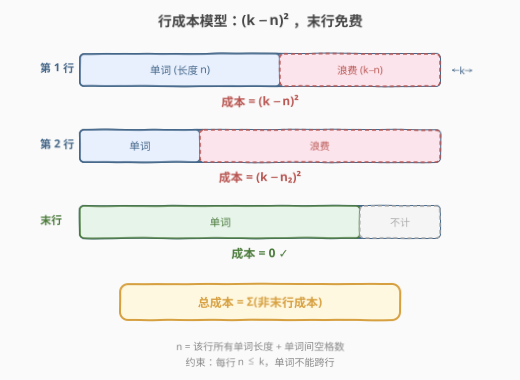
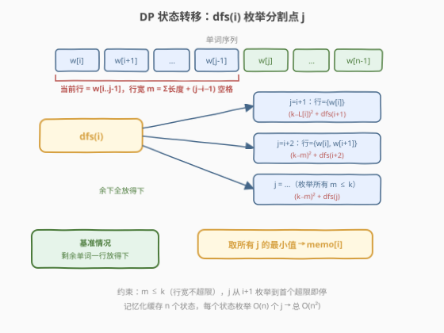
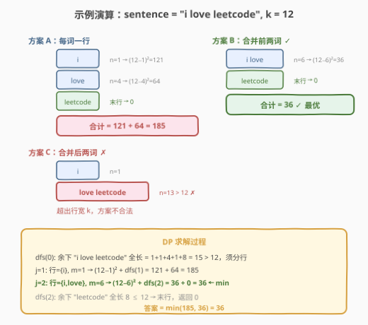

# LeetCode 将句子分隔成行的最低成本 题解

## 1. 题目概述

- **标题 / 题号**：将句子分隔成行的最低成本（#2052，medium）
- **链接**：https://leetcode.cn/problems/minimum-cost-to-separate-sentence-into-rows
- **难度**：中等
- **标签**：字符串、动态规划、记忆化搜索

**题意**：给定一个由空格分隔的单词组成的字符串 `sentence` 和一个整数 `k`。任务是将 `sentence` 分成**多行**，每行中的字符数**最多**为 `k`。可以假设 `sentence` 不以空格开头或结尾，且 `sentence` 中的单词由单个空格分隔。

可以通过在 `sentence` 中的单词间插入换行来分隔 `sentence`。一个单词**不能**被分成两行。每个单词只能使用一次，并且单词顺序不能重排。同一行中的相邻单词由单个空格分隔，每行都不以空格开头或结尾。

一行长度为 $n$ 的字符串的**分隔成本**是 $(k - n)^2$，**总成本**就是**除开**最后一行以外的**其它所有行的分隔成本**之和。

> 💡 关键：最后一行的成本不计入总成本——这决定了 DP 的基准情况。

**示例 1**：

```text
输入：sentence = "i love leetcode", k = 12
输出：36
解释：
分成 "i", "love", "leetcode"：成本 = (12-1)² + (12-4)² = 185
分成 "i love", "leetcode"：成本 = (12-6)² = 36
分成 "i", "love leetcode"：不可能（"love leetcode" 长度 13 > 12）
最低成本为 36
```

**示例 2**：

```text
输入：sentence = "apples and bananas taste great", k = 7
输出：21
解释：每词一行，成本 = (7-6)² + (7-3)² + (7-7)² + (7-5)² = 1 + 16 + 0 + 4 = 21
```

**示例 3**：

```text
输入：sentence = "a", k = 5
输出：0
解释：只有一行即末行，成本不计，返回 0
```

**约束**：

- $1 \le \text{sentence.length} \le 5000$
- $1 \le k \le 5000$
- `sentence` 中每个单词长度最大为 `k`
- `sentence` 只包含小写字母和空格
- `sentence` 不以空格开头或结尾，单词以单个空格分隔

## 2. 解题思路

### 2.1 暴力思路：枚举所有分隔方案

最直观的做法是**枚举所有可能的分行方案**——在每个单词之间的间隙，要么换行、要么不换行，共有 $2^{n-1}$ 种方案（$n$ 为单词数）。对每种方案验证每行宽度 $\le k$，计算非末行成本之和，取最小值。

但 $n$ 最大可达约 2500（5000 字符 / 2），$2^{2500}$ 完全不可行。需要利用**最优子结构**将其拆解为重叠子问题。

### 2.2 核心观察：区间 DP + 前缀和优化



将问题转化为**从第 $i$ 个单词开始分行的最小成本** `dfs(i)`，有以下两个关键观察：

1. **末行免费 → 基准情况**：若从第 $i$ 个单词到末尾的所有单词能放入一行（总宽度 $\le k$），则这一行就是末行，成本为 $0$。
2. **枚举分割点 $j$ → 状态转移**：否则，当前行必须以第 $i$ 到第 $j-1$ 个单词组成（$j > i$），行宽 $m = \sum L[i..j\!-\!1] + (j-i-1)$（单词长度之和 + 单词间空格数）。只要 $m \le k$，就是一个合法的当前行，成本为 $(k-m)^2 + \text{dfs}(j)$。枚举所有合法 $j$ 取最小值。

> 💡 **前缀和加速**：行宽 $m$ 中 $\sum L[i..j\!-\!1]$ 用前缀和数组 $S$ 在 $O(1)$ 内算出：$m = S[j] - S[i] + (j - i - 1)$。这使得每次状态转移的枚举只需线性扫描 $j$，遇到首个 $m > k$ 即可 `break`（因为单词长度为正，$j$ 越大 $m$ 越大）。

### 2.3 算法流程图



流程为「前缀和预处理 → 记忆化 DFS」：

1. 将 `sentence` 按空格切分为单词，记录每个单词长度，构建前缀和数组 $S$（$S[i]$ = 前 $i$ 个单词长度之和）。
2. 定义 `dfs(i)` = 从第 $i$ 个单词开始分行的最小成本：
   - **基准**：若 $S[n] - S[i] + (n - i - 1) \le k$（剩余单词全放一行），返回 $0$。
   - **转移**：枚举 $j$ 从 $i+1$ 开始，计算 $m = S[j] - S[i] + (j - i - 1)$；若 $m \le k$，则 $\text{ans} = \min(\text{ans},\ (k - m)^2 + \text{dfs}(j))$；若 $m > k$，`break`。
3. 用 `memo[i]` 缓存 `dfs(i)` 的结果，避免重复计算。答案为 `dfs(0)`。

> ⚠️ **约束保证有解**：题目保证每个单词长度 $\le k$，所以 $j = i+1$ 时 $m = L[i] \le k$ 恒成立，至少存在一个合法分割点，不会出现无解情况。

### 2.4 示例演算

以示例 1 `"i love leetcode"`, $k = 12$ 为例：



单词长度 $L = [1, 4, 8]$，前缀和 $S = [0, 1, 5, 13]$，$n = 3$。

| 调用 | 剩余全放一行? | 枚举 $j$ | 行宽 $m$ | 成本 | 取值 |
|------|-------------|----------|---------|------|------|
| `dfs(0)` | $13 - 0 + 2 = 15 > 12$，否 | $j=1$ | $1$ | $(12-1)^2 + \text{dfs}(1) = 121 + 64 = 185$ | — |
| | | $j=2$ | $1+1+4=6$ | $(12-6)^2 + \text{dfs}(2) = 36 + 0 = 36$ | $\min$ |
| | | $j=3$ | $13 > 12$ | `break` | — |
| `dfs(1)` | $13 - 1 + 1 = 13 > 12$，否 | $j=2$ | $4$ | $(12-4)^2 + \text{dfs}(2) = 64 + 0 = 64$ | $\min$ |
| | | $j=3$ | $4+1+8=13 > 12$ | `break` | — |
| `dfs(2)` | $13 - 5 + 0 = 8 \le 12$，是 | — | — | 返回 $0$（末行） | — |

最终 `dfs(0) = 36`。

## 3. 参考代码

### C++

```cpp
class Solution {
    vector<int> s, memo;
    int n, k;
public:
    int minimumCost(string sentence, int k) {
        this->k = k;
        istringstream iss(sentence);
        s = {0};
        string w;
        while (iss >> w) s.push_back(s.back() + w.size());
        n = s.size() - 1;
        memo.assign(n, -1);
        return dfs(0);
    }
private:
    int dfs(int i) {
        if (s[n] - s[i] + n - i - 1 <= k) return 0;
        if (memo[i] != -1) return memo[i];
        int ans = INT_MAX;
        for (int j = i + 1; j < n && s[j] - s[i] + j - i - 1 <= k; ++j) {
            int m = s[j] - s[i] + j - i - 1;
            ans = min(ans, dfs(j) + (k - m) * (k - m));
        }
        return memo[i] = ans;
    }
};
```

### Python

```python
class Solution:
    def minimumCost(self, sentence: str, k: int) -> int:
        @cache
        def dfs(i: int) -> int:
            if s[n] - s[i] + n - i - 1 <= k:
                return 0
            ans = inf
            j = i + 1
            while j < n and (m := s[j] - s[i] + j - i - 1) <= k:
                ans = min(ans, dfs(j) + (k - m) ** 2)
                j += 1
            return ans

        nums = [len(w) for w in sentence.split()]
        n = len(nums)
        s = list(accumulate(nums, initial=0))
        return dfs(0)
```

> 💡 Python 用 `@cache` 自动记忆化，C++ 用 `memo` 数组手动缓存。两者的行宽公式完全一致：$m = S[j] - S[i] + (j - i - 1)$，其中 $S[j] - S[i]$ 是单词长度和，$j - i - 1$ 是单词间空格数。

## 4. 复杂度分析

| 维度 | 复杂度 | 说明 |
|------|--------|------|
| 时间复杂度 | $O(n^2)$ | $n$ 个状态，每个状态枚举 $O(n)$ 个分割点 $j$；前缀和使每次行宽计算 $O(1)$ |
| 空间复杂度 | $O(n)$ | 前缀和数组 $S$、记忆化数组 `memo` 各 $O(n)$；递归栈深 $O(n)$ |

> 💡 $n$ 为单词个数，上限约 2500（`sentence.length` ≤ 5000，每个单词至少 1 字符 + 1 空格）。$n^2 \approx 6.25 \times 10^6$，完全可接受。

## 5. 扩展：自底向上迭代 DP

记忆化搜索是「自顶向下」的思路。也可以改为**自底向上**的迭代 DP，避免递归栈开销：

```cpp
class Solution {
public:
    int minimumCost(string sentence, int k) {
        istringstream iss(sentence);
        vector<int> s = {0};
        string w;
        while (iss >> w) s.push_back(s.back() + w.size());
        int n = s.size() - 1;
        vector<int> dp(n + 1, 0);
        for (int i = n - 1; i >= 0; --i) {
            if (s[n] - s[i] + n - i - 1 <= k) {
                dp[i] = 0;
            } else {
                dp[i] = INT_MAX;
                for (int j = i + 1; j < n && s[j] - s[i] + j - i - 1 <= k; ++j) {
                    int m = s[j] - s[i] + j - i - 1;
                    dp[i] = min(dp[i], dp[j] + (k - m) * (k - m));
                }
            }
        }
        return dp[0];
    }
};
```

| 维度 | 复杂度 | 说明 |
|------|--------|------|
| 时间复杂度 | $O(n^2)$ | 同记忆化版 |
| 空间复杂度 | $O(n)$ | `dp` 数组 + 前缀和数组；无递归栈 |

> 💡 自底向上版从 $i = n-1$ 逆序递推，保证计算 `dp[i]` 时 `dp[j]`（$j > i$）已就绪。`dp[n]` 作为哨兵置 $0$，对应"没有剩余单词"的边界。

## 6. 面试要点

1. **为什么最后一行的成本不计入总成本？这如何体现在 DP 中？**

   - 题目定义如此——末行是最后一段，没有"浪费"的惩罚。DP 中体现为基准情况：若剩余单词能全放入一行（宽度 $\le k$），直接返回 $0$，不再枚举分割点。这意味着这一行被当作末行处理。

2. **行宽 $m$ 的公式是什么？为什么是 $S[j] - S[i] + (j - i - 1)$？**

   - $S[j] - S[i]$ 是第 $i$ 到第 $j-1$ 个单词的长度之和（前缀和作差）。$(j - i - 1)$ 是这些单词之间的空格数——$j - i$ 个单词之间有 $j - i - 1$ 个间隔，每个间隔 1 个空格。两者相加才是行中实际字符数。

3. **枚举 $j$ 时为什么可以 `break` 而不是 `continue`？**

   - 单词长度为正，$j$ 递增时 $S[j] - S[i]$ 单调递增，空格数 $(j-i-1)$ 也递增，所以 $m$ 单调递增。一旦 $m > k$，更大的 $j$ 只会更宽，无需继续枚举。这是前缀和 + 单调性的联合优化。

4. **记忆化搜索和自底向上 DP 各有什么优劣？**

   - 记忆化搜索（自顶向下）思路自然，基准情况清晰对应"末行"语义，但递归有栈开销（$n$ 最大约 2500，递归深度可达 2500，需注意栈溢出风险）。自底向上（迭代）无栈开销、常数更小，但需要逆序思考状态依赖。本题 $n$ 不大，两种写法均可。

5. **如果题目改为"最后一行也计入成本"，DP 如何调整？**

   - 移除基准情况中"返回 $0$"的特判，让所有行（包括最后一行）都走状态转移。此时 `dfs(n)` 作为虚拟基准返回 $0$（没有单词即没有行），枚举 $j$ 到 $n$（含），行宽 $m = S[n] - S[i] + (n - i - 1)$，若 $\le k$ 则成本为 $(k - m)^2 + \text{dfs}(n) = (k - m)^2$。

## 同类练习题

| # | 题目 | 与本题的关联 |
|---|------|-------------|
| 139 | [单词拆分](https://leetcode.cn/problems/word-break/) | 同为字符串分割 DP，`dp[i]` = 前 $i$ 字符能否拆分，枚举分割点查字典，承接前缀复用思想 |
| 132 | [分割回文串 II](https://leetcode.cn/problems/palindrome-partitioning-ii/) | 预处理回文表 + 最小切割 DP，两阶段 DP 分割优化的经典题 |
| 410 | [分割数组的最大值](https://leetcode.cn/problems/split-array-largest-sum/) | 数组分段求最值，二分答案 + 贪心验证，与本题同为"分段优化"但策略不同 |
| 1011 | [在 D 天内送达包裹的能力](https://leetcode.cn/problems/capacity-to-ship-packages-within-d-days/) | 线性分段验证，二分答案求最小容量，分割类问题的二分范式 |
| 2767 | [分割字符串的方案数](https://leetcode.cn/problems/minimum-string-deletion-fidelity-partitioning/) | 字符串分割 + 计数 DP，枚举分割点计数合法方案 |
