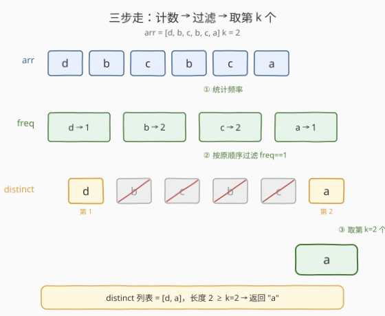
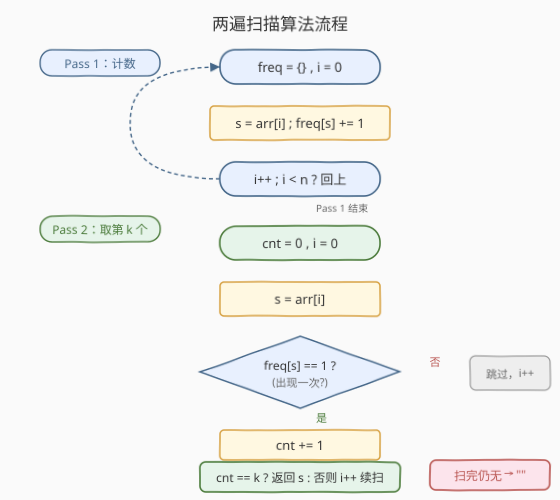

# 数组中第 K 个独一无二的字符串

- **题目名称**：数组中第 K 个独一无二的字符串
- **链接**：[2053. 数组中第 K 个独一无二的字符串](https://leetcode.cn/problems/kth-distinct-string-in-an-array/)
- **难度**：简单
- **标签**：数组、哈希表、字符串、计数

## 1. 题目概述

给定一个字符串数组 `arr` 和一个整数 `k`，返回数组中**第 `k` 个独一无二的字符串**。

**独一无二（distinct）**的定义：该字符串在 `arr` 中**恰好出现一次**。

返回时必须**按字符串在 `arr` 中的首次出现顺序**排列后取第 `k` 个。如果独一无二的字符串少于 `k` 个，返回空字符串 `""`。

**示例 1**：

```text
输入：arr = ["d","b","c","b","c","a"], k = 2
输出："a"
解释：唯一出现一次的字符串是 "d" 和 "a"，按首次出现顺序排为 ["d","a"]。
      第 2 个是 "a"。
```

**示例 2**：

```text
输入：arr = ["aaa","aa","a"], k = 1
输出："aaa"
解释：三个字符串各出现一次，第 1 个是 "aaa"。
```

**示例 3**：

```text
输入：arr = ["a","b","a"], k = 3
输出：""
解释：只有 "b" 出现一次，distinct 个数 1 < k=3，返回 ""。
```

**约束条件**：

- `1 <= k <= arr.length <= 1000`
- `1 <= arr[i].length <= 5`
- `arr[i]` 仅由小写英文字母组成。

> 💡 本题核心是「**频次过滤 + 保序取第 k**」。难点不在算法本身，而在于「**按首次出现顺序**」这一约束——不能排序、不能去重后乱序，必须用一趟额外扫描在原数组上重建顺序。这与 [1 两数之和](../0001-0100/1_两数之和.md)「一次遍历边查边插」的哈希套路同源，只是这里把「查存在性」换成了「查频次」。

---

## 2. 解题思路

### 2.1 暴力思路：对每个元素从头数频次

最直觉的写法：从 `arr` 第 0 个元素起，对当前 `arr[i]` 再扫一遍整个 `arr` 数频次；若频次为 1，计入「distinct 计数」，命中第 `k` 个就返回。

```text
for i in range(n):
    if count(arr, arr[i]) == 1:
        cnt += 1
        if cnt == k: return arr[i]
return ""
```

问题显而易见：**每个元素都重新扫一遍数组**，时间 $O(n^2)$。当 `n = 1000` 时约 $10^6$ 次比较，勉强可过，但完全没必要——频次信息是**全局共享**的，扫一遍就能全部拿到。

> ⚠️ 暴力的浪费：同一字符串的频次被反复重算。把「频次」提前算好存进哈希表，后续每个位置 `O(1)` 查询即可。

### 2.2 核心观察：频次预计算 + 两遍扫描

关键观察：**「是否独一无二」只取决于该字符串的频次，而频次可以一遍扫描全部确定**。因此把流程拆成两遍：

1. **Pass 1（计数）**：遍历 `arr`，用哈希表 `freq` 累计每个字符串出现次数。
2. **Pass 2（取第 k）**：再次**按原顺序**遍历 `arr`，遇到 `freq[s] == 1` 的就计入 `cnt`；当 `cnt == k` 时直接返回该字符串。若扫完仍未命中，返回 `""`。

**为什么第二遍必须按原顺序？** 因为题目要求「按首次出现顺序」取第 `k` 个。哈希表本身不保序（C++ `unordered_map`、Python `dict` 在 `Counter` 下虽保插入序但语义模糊），最稳妥的做法是**回到原数组上扫**——原数组天然保序，且重复元素第二次出现时 `freq != 1` 会被自动跳过，不会重复计数。



> 💡 **保序的本质**：我们不维护一个「distinct 列表」再去索引第 `k` 个，而是**复用原数组作为有序骨架**，频次表只负责「放行/拦截」的过滤角色。这样无需额外存储 distinct 列表，`O(1)` 额外变量 `cnt` 即可定位。这和 [203 移除链表元素](../0201-0300/203_移除链表元素.md)「在原结构上边走边判」是同一思想。

### 2.3 算法流程图



两遍扫描合计 $O(n)$ 时间，哈希表存至多 `n` 个条目，空间 $O(n)$。由于字符串长度 $\leq 5$ 且仅小写字母，单次哈希操作成本很低。

### 2.4 示例演算

以 `arr = ["d","b","c","b","c","a"]`、`k = 2` 为例：

![示例演算：arr = [d,b,c,b,c,a], k = 2](../images/kth_distinct_walkthrough.svg)

**Pass 1** 逐位累加 `freq`，关键转折在 `i=3`（`b` 第二次出现，`freq[b]` 从 1 升到 2）和 `i=4`（`c` 同理）。扫完后 `freq = {d:1, b:2, c:2, a:1}`，只有 `d`、`a` 频次为 1。

**Pass 2** 按原序扫描：

| `i` | `arr[i]` | `freq` | `cnt` | 动作 |
|-----|----------|--------|-------|------|
| 0 | d | 1 | 1 | distinct，但 `cnt=1 ≠ k=2`，继续 |
| 1 | b | 2 | — | `freq≠1`，跳过 |
| 2 | c | 2 | — | 跳过 |
| 3 | b | 2 | — | 跳过 |
| 4 | c | 2 | — | 跳过 |
| 5 | a | 1 | 2 | `cnt=2 == k` ✓，返回 `"a"` |

注意 `i=3` 的 `b` 虽然「第二次出现」，但 Pass 2 根本不需要区分第几次——只看 `freq` 是否为 1，所有重复元素一律被跳过。

---

## 3. 参考代码

### C++

```cpp
// 数组中第K个独一无二的字符串.cpp —— 频次预计算 + 两遍扫描，O(n) 时间 / O(n) 空间
// 编译: g++ -O2 -std=c++17 数组中第K个独一无二的字符串.cpp -o kthDistinct
class Solution {
  public:
    string kthDistinct(vector<string>& arr, int k) {
        unordered_map<string, int> freq;            // 频次表
        for (const auto& s : arr) freq[s]++;        // Pass 1：计数
        int cnt = 0;
        for (const auto& s : arr) {                 // Pass 2：按原序取第 k 个
            if (freq[s] == 1 && ++cnt == k) return s;
        }
        return "";                                  // distinct 不足 k 个
    }
};
```

### Python

```python
from collections import Counter
from typing import List

class Solution:
    def kthDistinct(self, arr: List[str], k: int) -> str:
        freq = Counter(arr)                         # Pass 1：一行计数
        cnt = 0
        for s in arr:                               # Pass 2：按原序扫描
            if freq[s] == 1:
                cnt += 1
                if cnt == k:
                    return s
        return ""
```

> 💡 Python 用 `collections.Counter` 一行完成 Pass 1，语义清晰。`Counter` 是 `dict` 子类，在 CPython 3.7+ 中保插入序，但**第二遍我们仍回到 `arr` 上扫**而非遍历 `freq`，就是为了严格对齐「首次出现顺序」——即使 `Counter` 保序，重复元素的「首次位置」也只在 `arr` 里直接可得，无需在 `freq` 里额外记下标。

---

## 4. 复杂度分析

| 维度 | 两遍扫描 + 哈希 | 暴力双循环 |
|------|----------------|-----------|
| **时间复杂度** | $O(n)$ | $O(n^2)$ |
| **空间复杂度** | $O(n)$ | $O(1)$ |
| **实现难度** | 简单，推荐面试首选 | 最直觉但超时风险 |
| **可扩展性** | 易推广到「第 k 个重复」「频次 ≤ m」等变体 | 同左 |

> ⚠️ **时间 $O(n)$ 的来源**：Pass 1 扫 `n` 次做哈希插入/自增，每次 $O(1)$（字符串长度 $\leq 5$ 视为常数哈希成本）；Pass 2 扫 `n` 次做哈希查询，每次 $O(1)$。合计 $2n$ 次操作，$O(n)$。空间上哈希表至多存 `n` 个不同字符串，$O(n)$。

---

## 5. 扩展：单遍扫描保序去重（LinkedHashMap 思路）

如果要求**只扫一遍**，可以用「保序哈希表」边计数边记插入顺序，第二阶段在保序结构上取第 `k` 个 distinct：

- **Python**：`Counter` 本身保插入序，扫一遍后再遍历 `freq` 即可（但需注意 `Counter` 遍历得到的是「首次出现顺序」，与原数组一致）。
- **C++**：`unordered_map` 不保序，需用 `vector<string> order` 配合 `unordered_map<string, int>` 手动维护插入顺序，或使用 `std::map` 配合自定义顺序结构。
- **Java**：`LinkedHashMap` 天然保序，一遍 `put` 计数后遍历 `keySet()` 即得 distinct 序。

```python
class Solution:
    def kthDistinct(self, arr: List[str], k: int) -> str:
        freq = {}
        for s in arr:                              # 一遍：计数 + 保序插入
            freq[s] = freq.get(s, 0) + 1
        cnt = 0
        for s in freq:                             # freq 按首次出现顺序遍历
            if freq[s] == 1:
                cnt += 1
                if cnt == k:
                    return s
        return ""
```

> ⚠️ 这版利用了 Python `dict` 的保序特性（3.7+ 语言规范保证）。但**面试推荐先讲两遍扫描版**——逻辑更直白、与语言无关，迁移到 C++/Java 不依赖保序哈希表的细节。保序版作为「能否优化到一遍」的进阶回答即可。

---

## 6. 面试要点

1. **为什么需要两遍扫描？一遍不行吗？**

   - 第一遍必须先扫完整个数组，才能确定每个字符串的**最终频次**。否则在遇到重复之前，会把第一个 `b`（频次暂时为 1）误判为 distinct。
   - 一遍扫描只有在「边计数边保序」的结构（如 `LinkedHashMap`、Python `dict`）下才可行，本质仍是两阶段：先建表，再过滤。

2. **第二遍为什么要回到原数组 `arr` 上扫，而不是遍历 `freq`？**

   - 题目要求「**按首次出现顺序**」取第 `k` 个。遍历 `freq` 的顺序依赖哈希表是否保序——C++ `unordered_map` 不保序，直接遍历会乱。
   - 回到 `arr` 上扫最稳妥：原数组天然有序，且重复元素第二次出现时 `freq != 1` 会自动被跳过，不会重复计数。

3. **distinct 个数不足 `k` 时怎么处理？**

   - Pass 2 扫完后 `cnt` 始终未达到 `k`，循环正常结束，返回 `""`。无需提前判断 `len(distinct) < k`，扫描本身就是判断。

4. **如果 `arr` 元素是大字符串（长度远超 5），复杂度会变吗？**

   - 时间上，哈希表插入/查询的单次成本不再是 $O(1)$，而是 $O(L)$（`L` 为字符串长度），总时间 $O(n \cdot L)$。
   - 本题约束 `arr[i].length <= 5`，`L` 视为常数，故仍是 $O(n)$。若 `L` 很大，可考虑字符串哈希（如滚动哈希）降单次成本，但会引入碰撞风险。

5. **变体：如果要返回第 `k` 个「出现至少两次」的字符串呢？**

   - 只需把 Pass 2 的过滤条件从 `freq[s] == 1` 改为 `freq[s] >= 2`，并额外维护一个 `seen` 集合避免同一字符串在重复位置被多次计数（因为第一次出现时 `freq>=2` 也会放行，会重复计）。
   - 本题因为 `freq==1` 天然只在「该字符串唯一位置」放行，无需 `seen` 去重——这是「distinct」定义带来的便利。

> 💡 **一句话总结**：第 `k` 个独一无二的字符串 = 频次预计算 + 按原序过滤取第 `k` 个。核心套路是**两遍扫描 + 哈希计数**——Pass 1 建频次表，Pass 2 回原数组保序扫描，`freq==1` 放行计数。$O(n)$ 时间、$O(n)$ 空间，与 [1 两数之和](../0001-0100/1_两数之和.md)「一次遍历边查边插」同属哈希基础套路。

---

## 7. 同类练习题

- [1. 两数之和](https://leetcode.cn/problems/two-sum/)（[题解](../0001-0100/1_两数之和.md)）：同样「一次遍历 + 哈希」的基础套路，查存在性 vs 查频次
- [203. 移除链表元素](https://leetcode.cn/problems/remove-linked-list-elements/)：在原结构上边走边判的过滤思想，对照本题 Pass 2
- [387. 字符串中的第一个唯一字符](https://leetcode.cn/problems/first-unique-character-in-a-string/)：同一套「频次预计算 + 二次扫描」模板，k=1 的特例
- [697. 数组的度](https://leetcode.cn/problems/degree-of-an-array/)：频次表 + 保序记录首末位置，频次哈希的进阶应用
- [1941. 检查是否所有字符出现相等次数](https://leetcode.cn/problems/check-if-all-characters-have-equal-number-of-occurrences/)：频次统计 + 值域判定，Counter 的直接使用
