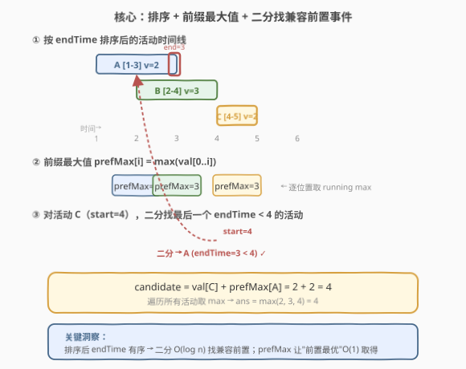
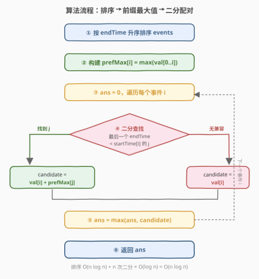
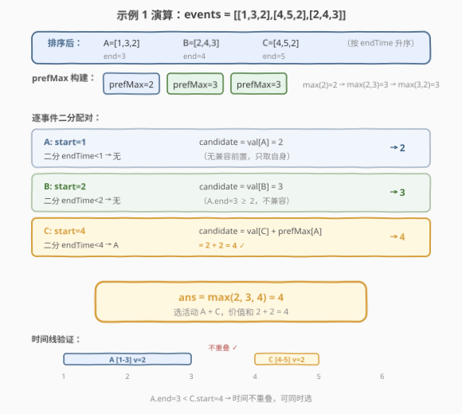

# 两个最好的不重叠活动

- **题目名称**：两个最好的不重叠活动
- **链接**：[2054. 两个最好的不重叠活动](https://leetcode.cn/problems/two-best-non-overlapping-events/)
- **难度**：中等
- **标签**：数组、排序、二分查找、动态规划

## 1. 题目概述

给定一个二维整数数组 `events`，其中 `events[i] = [startTime_i, endTime_i, value_i]`，表示第 $i$ 个活动的时间区间与参与价值。你**最多**可以参加**两个时间不重叠**的活动，使得它们的价值之和最大。

> ⚠️ **不重叠的定义**：如果你参加一个结束时间为 $t$ 的活动，下一个活动必须在 $t + 1$ 或之后开始。即两个活动不重叠的条件是 $\text{endTime}_j < \text{startTime}_i$（**严格小于**，不是 $\le$）。

**示例 1**：

```text
输入：events = [[1,3,2],[4,5,2],[2,4,3]]
输出：4
解释：选择活动 0 [1,3] 和活动 1 [4,5]，价值之和为 2 + 2 = 4。
      活动 2 [2,4] 与活动 0 重叠（end=3, start=2, 3 ≥ 2），也与活动 1 重叠（end=4, start=4, 4 ≥ 4 不满足严格小于）。
```

**示例 2**：

```text
输入：events = [[1,3,2],[4,5,2],[1,5,5]]
输出：5
解释：只选活动 2 [1,5] 价值为 5，比任意两活动组合（最多 2+2=4）都大。
```

**示例 3**：

```text
输入：events = [[1,5,3],[1,5,1],[6,6,5]]
输出：8
解释：选活动 0 [1,5] 和活动 2 [6,6]，价值之和为 3 + 5 = 8。
```

**约束条件**：

- $2 \le \text{events.length} \le 10^5$
- $\text{events[i].length} == 3$
- $1 \le \text{startTime}_i \le \text{endTime}_i \le 10^9$
- $1 \le \text{value}_i \le 10^6$

---

## 2. 解题思路

### 2.1 暴力思路：枚举所有活动对

最直观的做法是枚举所有可能的两活动组合 $(i, j)$，检查它们是否时间不重叠，取满足条件的最大价值和。同时还要考虑只选一个活动的情况（取全局最大 `value`）。

- 枚举对数：$O(n^2)$，当 $n = 10^5$ 时高达 $10^{10}$ 次操作，**超时**。

> 💡 暴力的瓶颈在于"对每个活动 $i$，需要在剩余活动中找到与它不重叠且价值最大的那个"。如果能将"查找兼容前置"从 $O(n)$ 降到 $O(\log n)$，总复杂度就可接受。

### 2.2 核心观察：排序 + 前缀最大值 + 二分查找



将问题分解为三步：

**第一步：按 `endTime` 升序排序。** 排序后，对于任意活动 $i$，所有排在它前面的活动 $j < i$ 都满足 $\text{endTime}_j \le \text{endTime}_i$。这意味着 `endTime` 数组天然有序，可以对其做二分查找。

**第二步：构建前缀最大值数组 `prefMax`。** 令 $\text{prefMax}[i] = \max(\text{value}_0, \ldots, \text{value}_i)$，即前 $i+1$ 个活动中的最大价值。这样，"排在某位置之前的所有活动中价值最大的那个"就能 $O(1)$ 取得。

**第三步：对每个活动 $i$，二分查找兼容前置。** 在排序后的 `endTime` 数组中，用二分找到**最后一个**满足 $\text{endTime}_j < \text{startTime}_i$ 的下标 $j$。如果找到，则候选价值为 $\text{value}_i + \text{prefMax}[j]$；否则候选价值为 $\text{value}_i$（只选自身）。

> 💡 **关键洞察**：排序使 `endTime` 有序 → 二分 $O(\log n)$ 找兼容前置；`prefMax` 使"前置最优" $O(1)$ 取得。两者结合，将暴力 $O(n^2)$ 降为 $O(n \log n)$。

### 2.3 算法流程图



流程为「排序 → 建 `prefMax` → 遍历每个活动做二分配对 → 取全局最大」：

1. 按 `endTime` 升序排序 `events`。
2. 构建 `prefMax` 数组：$\text{prefMax}[i] = \max(\text{prefMax}[i-1],\ \text{value}_i)$。
3. 遍历每个活动 $i$，用 `lower_bound` 在 $\text{endTime}[0..i-1]$ 中找首个 $\ge \text{startTime}_i$ 的位置 `idx`，则 `idx - 1` 是最后一个 $\text{endTime} < \text{startTime}_i$ 的活动。
4. 若 `idx > 0`：$\text{candidate} = \text{value}_i + \text{prefMax}[\text{idx}-1]$；否则 $\text{candidate} = \text{value}_i$。
5. $\text{ans} = \max(\text{ans},\ \text{candidate})$，遍历结束返回 `ans`。

> ⚠️ **二分细节**：用 `lower_bound` 找首个 $\ge \text{startTime}_i$ 的 `endTime`，其前一个位置即为所求。若 `lower_bound` 返回 `0`，说明所有前置活动的 `endTime` 都 $\ge \text{startTime}_i$，无兼容前置。

### 2.4 示例演算

以示例 1 `events = [[1,3,2],[4,5,2],[2,4,3]]` 为例：



**排序后**（按 `endTime`）：$A=[1,3,2],\ B=[2,4,3],\ C=[4,5,2]$

**构建 `prefMax`**：$[2,\ 3,\ 3]$（$\max(2)=2 \to \max(2,3)=3 \to \max(3,2)=3$）

| 活动 | startTime | 二分查找 | 兼容前置 | candidate | ans |
|------|-----------|----------|----------|-----------|-----|
| $A$  | 1         | `endTime < 1` → 无 | — | $2$ | $2$ |
| $B$  | 2         | `endTime < 2` → 无（$A.\text{end}=3 \ge 2$） | — | $3$ | $3$ |
| $C$  | 4         | `endTime < 4` → $A$（$\text{end}=3 < 4$） | $A$ | $2 + \text{prefMax}[0] = 2+2 = 4$ | $4$ |

最终答案 $\text{ans} = 4$，选活动 $A + C$。

> 💡 注意活动 $B$ 虽然 `endTime=4`，但 $4 \not< 4$（严格小于），所以与 $C$ **不兼容**。这正是题目"开始时间等于结束时间也算重叠"的要求。

---

## 3. 参考代码

### C++

```cpp
class Solution {
public:
    int maxTwoEvents(vector<vector<int>>& events) {
        int n = events.size();
        sort(events.begin(), events.end(), [](const auto& a, const auto& b) {
            return a[1] < b[1];
        });

        vector<int> prefMax(n);
        prefMax[0] = events[0][2];
        for (int i = 1; i < n; i++)
            prefMax[i] = max(prefMax[i - 1], events[i][2]);

        int ans = 0;
        for (int i = 0; i < n; i++) {
            int idx = lower_bound(
                events.begin(), events.begin() + i, events[i][0],
                [](const vector<int>& e, int v) { return e[1] < v; }
            ) - events.begin();
            int candidate = events[i][2];
            if (idx > 0) candidate += prefMax[idx - 1];
            ans = max(ans, candidate);
        }
        return ans;
    }
};
```

### Python

```python
from bisect import bisect_left
from typing import List

class Solution:
    def maxTwoEvents(self, events: List[List[int]]) -> int:
        events.sort(key=lambda e: e[1])
        n = len(events)

        pref_max = [0] * n
        pref_max[0] = events[0][2]
        for i in range(1, n):
            pref_max[i] = max(pref_max[i - 1], events[i][2])

        end_times = [e[1] for e in events]

        ans = 0
        for i in range(n):
            start = events[i][0]
            idx = bisect_left(end_times, start, 0, i)
            candidate = events[i][2]
            if idx > 0:
                candidate += pref_max[idx - 1]
            ans = max(ans, candidate)
        return ans
```

> 💡 C++ 的 `lower_bound` 使用自定义比较器 `e[1] < v`，直接在 `events` 数组上二分，无需额外提取 `endTimes`。Python 则提取 `end_times` 列表后用 `bisect_left`，并限定搜索范围 `[0, i)`。

---

## 4. 复杂度分析

| 维度 | 复杂度 | 说明 |
|------|--------|------|
| 时间复杂度 | $O(n \log n)$ | 排序 $O(n \log n)$ + 构建 `prefMax` $O(n)$ + $n$ 次二分每次 $O(\log n)$ |
| 空间复杂度 | $O(n)$ | `prefMax` 数组 $O(n)$（C++ 原地二分版无需额外 `endTimes`，Python 需 $O(n)$） |

> 💡 当 $n = 10^5$ 时，$n \log n \approx 1.7 \times 10^6$，远在时限内。

---

## 5. 扩展：小顶堆 + 贪心（按 startTime 排序）

上述方法按 `endTime` 排序 + 二分。还有一种对称的写法：**按 `startTime` 排序 + 小顶堆**，思路更接近「扫描线」：

- 按 `startTime` 升序排序。
- 维护小顶堆 `(endTime, value)`，以及变量 `bestEnded` 记录所有已结束活动中的最大价值。
- 对每个活动 $i$：弹出堆中所有 `endTime < startTime_i` 的活动，更新 `bestEnded`；候选 = `value_i + bestEnded`；将 `(endTime_i, value_i)` 入堆。

```python
import heapq
from typing import List

class Solution:
    def maxTwoEvents(self, events: List[List[int]]) -> int:
        events.sort(key=lambda e: e[0])
        heap = []  # (endTime, value)
        best_ended = 0
        ans = 0
        for start, end, val in events:
            while heap and heap[0][0] < start:
                _, v = heapq.heappop(heap)
                best_ended = max(best_ended, v)
            ans = max(ans, val + best_ended)
            heapq.heappush(heap, (end, val))
        return ans
```

| 维度 | 复杂度 | 说明 |
|------|--------|------|
| 时间复杂度 | $O(n \log n)$ | 排序 $O(n \log n)$ + 每个元素入堆/出堆各一次 $O(n \log n)$ |
| 空间复杂度 | $O(n)$ | 堆最多存 $n$ 个元素 |

> 💡 **两种方法对比**：二分法按 `endTime` 排序，利用前缀最大值"回看"兼容前置；堆方法按 `startTime` 排序，利用堆"前看"即将结束的活动。两者本质相同——都是对"找兼容活动"这一操作的加速，只是方向不同。堆方法更容易泛化到 $k$ 个活动（如 1751 题）。

---

## 6. 面试要点

1. **为什么按 `endTime` 排序而不是 `startTime`？**

   - 按 `endTime` 排序后，对于活动 $i$，所有 $j < i$ 的活动都满足 $\text{endTime}_j \le \text{endTime}_i$，`endTime` 数组天然有序，可以直接对其做二分查找，找最后一个 $\text{endTime}_j < \text{startTime}_i$ 的 $j$。若按 `startTime` 排序则没有这个便利，需要用堆维护。

2. **前缀最大值数组 `prefMax` 的作用是什么？**

   - `prefMax[i]` 记录前 $i+1$ 个活动中的最大 `value`。当二分找到兼容前置的右边界 `idx - 1` 后，$\text{prefMax}[\text{idx}-1]$ 就是"所有 $\text{endTime} < \text{startTime}_i$ 的活动中价值最大的那个"，$O(1)$ 取得，避免再扫一遍。

3. **二分查找找的是什么？为什么用 `lower_bound` 而非 `upper_bound`？**

   - 找最后一个 $\text{endTime}_j < \text{startTime}_i$ 的下标 $j$。`lower_bound` 返回首个 $\ge \text{startTime}_i$ 的位置 `idx`，则 `idx - 1` 即为所求。若用 `upper_bound`（首个 $>$），当存在 $\text{endTime} = \text{startTime}_i$ 的活动时会跳过它，但题目要求严格小于（$\text{endTime} < \text{startTime}$），所以 `lower_bound` 更直接。

4. **"不重叠"的条件为什么是严格小于 $\text{endTime}_j < \text{startTime}_i$？**

   - 题目明确"如果你参加一个结束时间为 $t$ 的活动，下一个活动必须在 $t+1$ 或之后开始"。即 $\text{startTime}_i \ge \text{endTime}_j + 1$，等价于 $\text{endTime}_j < \text{startTime}_i$。若写成 $\le$ 则会错误地允许边界相接的活动。

5. **只选一个活动的情况如何被覆盖？**

   - 当某个活动 $i$ 没有兼容前置（`idx == 0`）时，$\text{candidate} = \text{value}_i$，即只选自身。又因为 `ans` 取所有 `candidate` 的最大值，所以全局最大 `value` 自然被包含在答案中，无需额外处理。

---

## 7. 同类练习题

- [1235. 规划兼职工作](https://leetcode.cn/problems/maximum-profit-in-job-scheduling/)：加权区间调度的经典题，不限制选几个活动，用 DP + 二分（`endTime` 排序 + `lower_bound` 找前置），本题的"无限选"版本
- [1751. 最多可以参加的会议数目 II](https://leetcode.cn/problems/maximum-number-of-events-that-can-be-attended-ii/)：本题的 $k$ 泛化版——最多选 $k$ 个不重叠活动，DP 状态加一维"已选个数"，二分找兼容前置的思路完全一致
- [435. 无重叠区间](https://leetcode.cn/problems/non-overlapping-intervals/)：按右端点排序的区间调度经典题，贪心求最少删除数，排序策略与本题相同
- [2009. 使数组连续的最少操作数](https://leetcode.cn/problems/minimum-number-of-operations-to-make-array-continuous/)：排序 + 二分 + 滑动窗口，同属"排序后在有序序列上二分"的套路
