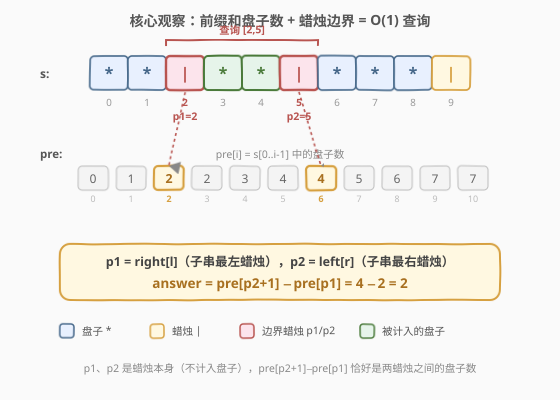
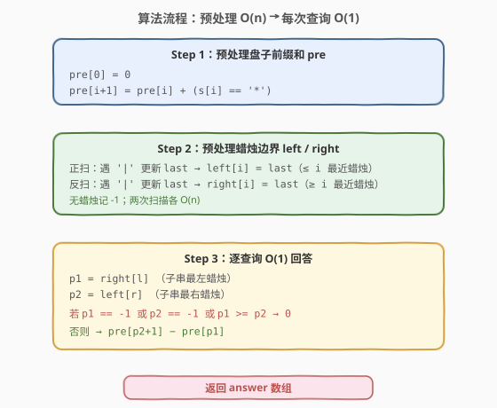
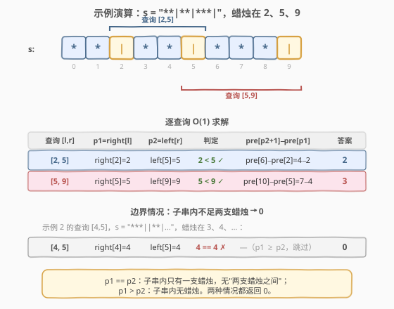

# 蜡烛之间的盘子

- **题目名称**：蜡烛之间的盘子
- **链接**：[2055. 蜡烛之间的盘子](https://leetcode.cn/problems/plates-between-candles/)
- **难度**：中等
- **标签**：数组、前缀和、预处理

## 1. 题目概述

给定下标从 **0** 开始的字符串 `s`，只包含 `'*'`（盘子）和 `'|'`（蜡烛）。再给一个二维数组 `queries`，其中 `queries[i] = [lefti, righti]` 表示子字符串 `s[lefti...righti]`（含两端）。对每个查询，求子字符串中**在两支蜡烛之间**的盘子数目——即一个盘子在子字符串范围内**左边和右边都至少有一支蜡烛**。

**示例 1**：

```text
输入：s = "**|**|***|", queries = [[2,5],[5,9]]
输出：[2,3]
解释：
- queries[0] 子串 s[2..5] = "|**|"，两支蜡烛之间的盘子有 2 个。
- queries[1] 子串 s[5..9] = "|***|"，两支蜡烛之间的盘子有 3 个。
```

**示例 2**：

```text
输入：s = "***||**|*****|**||**|*", queries = [[1,17],[4,5],[14,17],[5,11],[15,16]]
输出：[9,0,0,0,0]
解释：
- queries[0] 有 9 个盘子在蜡烛之间。
- 其余查询没有盘子在两支蜡烛之间。
```

**约束条件**：

- $3 \le \text{s.length} \le 10^5$
- `s` 只包含字符 `'*'` 和 `'|'`
- $1 \le \text{queries.length} \le 10^5$
- `queries[i].length == 2`
- $0 \le \text{left}_i \le \text{right}_i < \text{s.length}$

> 💡 **审题关键**：①「在两支蜡烛之间」= 子串最左蜡烛 `p1` 与最右蜡烛 `p2` 之间的盘子数，因为只有落在 `[p1, p2]` 内的盘子才保证左右都有蜡烛；②盘子是否被计入**只取决于子串内最左/最右蜡烛的位置**，与中间蜡烛无关；③查询数与串长同阶（都到 $10^5$），单次查询必须 $O(1)$ 或 $O(\log n)$，不能逐字符扫描。

---

## 2. 解题思路

### 2.1 暴力思路：逐查询扫描

对每个查询 `[l, r]`，扫描子串 `s[l..r]`：先找最左蜡烛 `p1` 和最右蜡烛 `p2`，再数 `[p1, p2]` 内的 `'*'`。

- **正确性**：显然正确。
- **效率**：单次查询 $O(r - l)$，最坏 $O(n)$；$q$ 次查询共 $O(n \cdot q)$，$n, q \le 10^5$ 时达 $10^{10}$，**超时**。

> ⚠️ 瓶颈在于"找蜡烛 + 数盘子"被重复了 $q$ 次。突破口是把这两个操作**预处理**成 $O(1)$ 查表：前缀和数盘子，左右扫描定蜡烛边界。

### 2.2 核心观察：前缀和 + 蜡烛边界预处理



把暴力里两个重复操作分别预处理：

**预处理 1：盘子前缀和 `pre`。**

令 `pre[i]` = `s[0..i-1]` 中的盘子数（`pre[0] = 0`）。则任意区间 `[a, b]` 的盘子数 = `pre[b+1] - pre[a]`，$O(1)$ 查询。

**预处理 2：蜡烛边界数组 `left` / `right`。**

- `left[i]` = 下标 $\le i$ 的**最近**蜡烛下标（从左往右扫，遇 `'|'` 更新 `last`），无则 $-1$。
- `right[i]` = 下标 $\ge i$ 的**最近**蜡烛下标（从右往左扫），无则 $-1$。

于是对查询 `[l, r]`：

- `p1 = right[l]`：子串内**最左**蜡烛（$\ge l$ 的最近蜡烛）。
- `p2 = left[r]`：子串内**最右**蜡烛（$\le r$ 的最近蜡烛）。

**为什么 `p1`、`p2` 就是子串最左/最右蜡烛？** `right[l]` 取 $\ge l$ 中最小的蜡烛下标，即从 `l` 往右看第一个蜡烛，正是子串最左蜡烛；`left[r]` 取 $\le r$ 中最大的蜡烛下标，即从 `r` 往左看第一个蜡烛，正是子串最右蜡烛。两者都是 $O(1)$ 查表。

**答案公式**：若 `p1 < p2`（且均非 $-1$），则

$$\text{answer} = \text{pre}[p_2+1] - \text{pre}[p_1]$$

即 `[p1, p2]` 区间内的盘子数。由于 `p1`、`p2` 本身是蜡烛（`'|'`），不计入盘子，所以这恰好等于"两支蜡烛之间"的盘子数。若 `p1 >= p2`（子串内不足两支蜡烛，无"之间"可言），答案为 $0$。

> 💡 **`p1 >= p2` 的含义**：`p1 == p2` 表示子串内只有一支蜡烛；`p1 > p2` 表示 `right[l]` 跑到了 `left[r]` 右边，即子串 `[l, r]` 内根本没有蜡烛。两种情况都没有"两支蜡烛之间"的盘子，返回 $0$。

### 2.3 算法流程图



三步走：

1. **预处理 `pre`**：一次扫描，`pre[i+1] = pre[i] + (s[i] == '*')`。
2. **预处理 `left` / `right`**：两次扫描（正向、反向），各 $O(n)$。
3. **逐查询 $O(1)$ 回答**：取 `p1 = right[l]`、`p2 = left[r]`，判断后用前缀和作差。

> ⚠️ **边界**：`p1` 或 `p2` 为 $-1$（子串一侧无蜡烛）也要归入 `p1 >= p2` 分支返回 $0$。代码里用 `p1 == -1 || p2 == -1 || p1 >= p2` 一次性判完。

### 2.4 示例演算



以示例 1 的 `s = "**|**|***|"`（下标 0–9，蜡烛在 2、5、9）为例。预处理后：

| 下标 `i` | 0 | 1 | 2 | 3 | 4 | 5 | 6 | 7 | 8 | 9 |
|----------|---|---|---|---|---|---|---|---|---|---|
| `s[i]`   | * | * | \| | * | * | \| | * | * | * | \| |
| `pre[i]` | 0 | 1 | 2 | 2 | 3 | 4 | 4 | 5 | 6 | 7 |
| `left[i]`| -1| -1| 2 | 2 | 2 | 5 | 5 | 5 | 5 | 9 |
| `right[i]`|2 | 2 | 2 | 5 | 5 | 5 | 9 | 9 | 9 | 9 |

> `pre` 列出的是 `pre[0..9]`，`pre[10] = 7`（全长盘子数）。

**查询 [2, 5]**：

| 步骤 | 计算 | 结果 |
|------|------|------|
| 取左边界蜡烛 | `p1 = right[2] = 2` | 2 |
| 取右边界蜡烛 | `p2 = left[5] = 5` | 5 |
| 判断 | `p1 < p2` ✓ | 有效 |
| 数盘子 | `pre[p2+1] - pre[p1] = pre[6] - pre[2] = 4 - 2` | **2** ✓ |

**查询 [5, 9]**：

| 步骤 | 计算 | 结果 |
|------|------|------|
| 取左边界蜡烛 | `p1 = right[5] = 5` | 5 |
| 取右边界蜡烛 | `p2 = left[9] = 9` | 9 |
| 判断 | `p1 < p2` ✓ | 有效 |
| 数盘子 | `pre[10] - pre[5] = 7 - 4` | **3** ✓ |

**边界情况（示例 2 的 `[4,5]`）**：`s = "***||**|..."`，蜡烛在 3、4、…。`p1 = right[4] = 4`，`p2 = left[5] = 4`，`p1 == p2` → 子串内只有一支蜡烛，返回 **0** ✓。

> 💡 **关键直觉**：被计入的盘子一定落在 `[p1, p2]` 内，因为 `p1` 是子串最左蜡烛（它左侧的盘子左边没蜡烛）、`p2` 是最右蜡烛（它右侧的盘子右边没蜡烛）。所以"两支蜡烛之间"等价于"最左蜡烛与最右蜡烛之间"，无需关心中间还有几支蜡烛。

---

## 3. 参考代码

### C++

```cpp
class Solution {
public:
    vector<int> platesBetweenCandles(string s, vector<vector<int>>& queries) {
        int n = s.size();
        // pre[i] = s[0..i-1] 中的盘子数
        vector<int> pre(n + 1, 0);
        // left[i]  = 下标 <= i 的最近蜡烛（-1 表示无）
        // right[i] = 下标 >= i 的最近蜡烛（-1 表示无）
        vector<int> left(n, -1), right(n, -1);

        for (int i = 0; i < n; ++i) {
            pre[i + 1] = pre[i] + (s[i] == '*' ? 1 : 0);
        }
        int last = -1;
        for (int i = 0; i < n; ++i) {
            if (s[i] == '|') last = i;
            left[i] = last;
        }
        last = -1;
        for (int i = n - 1; i >= 0; --i) {
            if (s[i] == '|') last = i;
            right[i] = last;
        }

        vector<int> ans;
        ans.reserve(queries.size());
        for (auto& q : queries) {
            int l = q[0], r = q[1];
            int p1 = right[l];   // 子串最左蜡烛
            int p2 = left[r];    // 子串最右蜡烛
            if (p1 == -1 || p2 == -1 || p1 >= p2) {
                ans.push_back(0);
            } else {
                ans.push_back(pre[p2 + 1] - pre[p1]);
            }
        }
        return ans;
    }
};
```

### Python

```python
class Solution:
    def platesBetweenCandles(self, s: str, queries: List[List[int]]) -> List[int]:
        n = len(s)
        # pre[i] = s[0..i-1] 中的盘子数
        pre = [0] * (n + 1)
        # left[i] / right[i] = 下标 <= / >= i 的最近蜡烛（-1 表示无）
        left = [-1] * n
        right = [-1] * n

        for i, ch in enumerate(s):
            pre[i + 1] = pre[i] + (1 if ch == '*' else 0)

        last = -1
        for i, ch in enumerate(s):
            if ch == '|':
                last = i
            left[i] = last

        last = -1
        for i in range(n - 1, -1, -1):
            if s[i] == '|':
                last = i
            right[i] = last

        ans = []
        for l, r in queries:
            p1 = right[l]   # 子串最左蜡烛
            p2 = left[r]    # 子串最右蜡烛
            if p1 == -1 or p2 == -1 or p1 >= p2:
                ans.append(0)
            else:
                ans.append(pre[p2 + 1] - pre[p1])
        return ans
```

> 💡 **`pre` 用 `n+1` 长度**：`pre[0] = 0` 作为哨兵，避免查询时对 `p1 = 0` 做边界特判。`pre[p2+1] - pre[p1]` 直接覆盖所有合法 `p1 < p2`。

---

## 4. 复杂度分析

| 维度 | 复杂度 | 说明 |
|------|--------|------|
| 预处理时间 | $O(n)$ | 三次线性扫描：`pre` 一次、`left` 正向一次、`right` 反向一次 |
| 查询时间 | $O(q)$ | 每个查询 $O(1)$：两次数组取值 + 一次前缀和作差 |
| 总时间 | $O(n + q)$ | 预处理与查询均线性，$n, q \le 10^5$ 毫无压力 |
| 空间 | $O(n)$ | `pre`（$n+1$）+ `left`/`right`（各 $n$），常数组 |

> ⚠️ 暴力法 $O(n \cdot q)$ 在 $n = q = 10^5$ 时约 $10^{10}$ 次操作，必超时。预处理把"找蜡烛"和"数盘子"都摊到 $O(n)$ 一次性做完，查询降为 $O(1)$，这是**离线查询**问题的经典套路：用空间换时间，把重复计算提前。

---

## 5. 扩展：二分查找蜡烛位置

本文用 `left`/`right` 两个数组把"找边界蜡烛"做到 $O(1)$。另一种等价做法是**收集所有蜡烛下标到有序数组 `cand`，再用二分查找**：

- `p1` = `lower_bound(cand, l)`：首个 $\ge l$ 的蜡烛。
- `p2` = `upper_bound(cand, r) - 1`：最后一个 $\le r$ 的蜡烛。

```python
import bisect
cand = [i for i, ch in enumerate(s) if ch == '|']  # 天然升序
ans = []
for l, r in queries:
    i1 = bisect.bisect_left(cand, l)        # 首个 >= l
    i2 = bisect.bisect_right(cand, r) - 1   # 最后一个 <= r
    if i1 < i2:                              # 至少两支蜡烛
        p1, p2 = cand[i1], cand[i2]
        ans.append(pre[p2 + 1] - pre[p1])
    else:
        ans.append(0)
```

| 维度 | 预处理数组法（本文） | 二分查找法 |
|------|---------------------|------------|
| 预处理 | $O(n)$，三个数组 | $O(n)$，一个蜡烛数组 |
| 单查询 | $O(1)$ | $O(\log m)$，$m$ 为蜡烛数 |
| 总时间 | $O(n + q)$ | $O(n + q \log m)$ |
| 空间 | $O(n)$ | $O(m) \le O(n)$ |
| 适用 | 查询多、追求极简单次查询 | 蜡烛稀疏、想省空间 |

> 💡 两种方法本质相同——都是"前缀和数盘子 + 找边界蜡烛"。面试中推荐本文的数组法（$O(1)$ 查询、实现直观）；若面试官追问"蜡烛很稀疏怎么省空间"，再提二分法。`left`/`right` 数组其实是把二分查找的结果**预计算**了，用 $O(n)$ 额外空间把每次 $O(\log n)$ 降为 $O(1)$。

---

## 6. 面试要点

1. **「两支蜡烛之间」为什么等价于最左蜡烛和最右蜡烛之间？**

   - 一个盘子被计入，要求左右都至少有一支蜡烛。子串最左蜡烛 `p1` 左侧的盘子，左边没有蜡烛（在子串内）；最右蜡烛 `p2` 右侧的盘子，右边没有蜡烛。所以只有 `[p1, p2]` 内的盘子才同时有左右蜡烛。中间蜡烛无论多少支，不影响这个边界判定。

2. **`pre[p2+1] - pre[p1]` 为什么就是两蜡烛之间的盘子数？**

   - `pre[i]` = `s[0..i-1]` 的盘子数，所以 `pre[p2+1] - pre[p1]` = `s[p1..p2]` 的盘子数。`p1`、`p2` 是蜡烛（`'|'`），本身不是盘子，因此这等于 `s[p1+1..p2-1]` 的盘子数，即"两支蜡烛之间"。

3. **`left` 和 `right` 数组分别在做什么？**

   - `left[i]`：从左往右扫，记录"下标 $\le i$ 的最近蜡烛"，回答"从 `r` 往左看第一支蜡烛在哪"——即子串最右蜡烛 `p2 = left[r]`。`right[i]`：从右往左扫，记录"下标 $\ge i$ 的最近蜡烛"，回答"从 `l` 往右看第一支蜡烛在哪"——即子串最左蜡烛 `p1 = right[l]`。

4. **什么时候返回 0？**

   - `p1 == -1`（`l` 右侧无蜡烛）、`p2 == -1`（`r` 左侧无蜡烛）、或 `p1 >= p2`（子串内不足两支蜡烛）。三者合并为 `p1 < p2` 的否定条件。

5. **能否不用前缀和，直接存"到每支蜡烛的累计盘子数"？**

   - 可以。给蜡烛数组额外存一个"前缀盘子数"前缀和，二分找到 `p1`/`p2` 后作差。本质和本文相同，只是把盘子前缀和"挂在蜡烛上"，省去对全串的前缀和数组，但实现稍绕。面试讲清本文方案即可。

---

## 7. 同类练习题

- [303. 区域和检索 - 数组不可变](https://leetcode.cn/problems/range-sum-query-immutable/)（[题解](../0301-0400/303_区域和检索 - 数组不可变.md)）：一维前缀和招牌题，本题 `pre` 数组的母题
- [304. 二维区域和检索 - 数组不可变](https://leetcode.cn/problems/range-sum-query-2d-immutable/)（[题解](../0301-0400/304_二维区域和检索 - 数组不可变.md)）：二维前缀和 + 容斥，前缀和思想的二维推广
- [34. 在排序数组中查找元素的第一个和最后一个位置](https://leetcode.cn/problems/find-first-and-last-position-of-element-in-sorted-array/)：`lower_bound`/`upper_bound` 二分找边界，本文扩展节的二分法同源
- [1855. 下标对中的最大距离](https://leetcode.cn/problems/maximum-distance-between-a-pair-of-values/)：双指针在有序下标序列上找满足条件的边界，与"找边界蜡烛"思路相通
- [2080. 区间内查询数字的频率](https://leetcode.cn/problems/range-frequency-queries/)：同样是"区间内统计某元素个数"，用哈希 + 二分（值的有序下标列表）替代前缀和，对比两种离线查询套路
